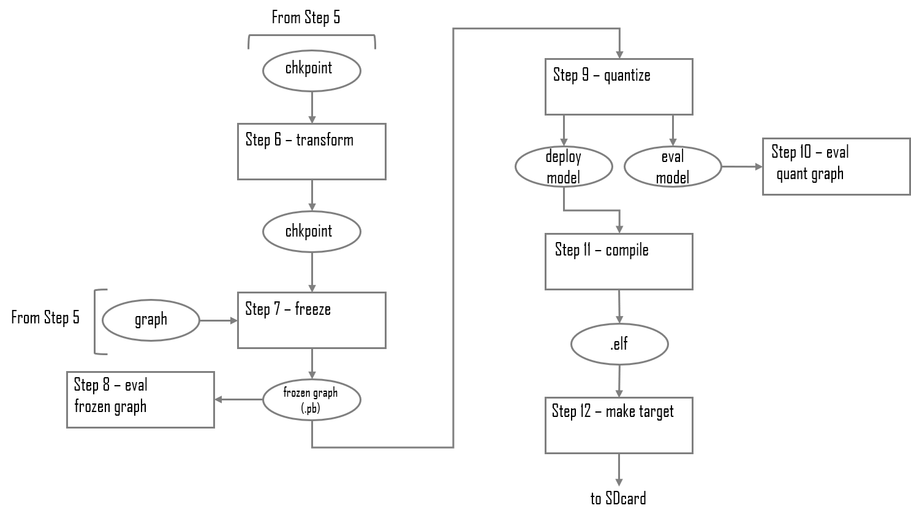

<!--
Copyright 2020 Xilinx Inc.
 
Licensed under the Apache License, Version 2.0 (the "License");
you may not use this file except in compliance with the License.
You may obtain a copy of the License at

http://www.apache.org/licenses/LICENSE-2.0
 
Unless required by applicable law or agreed to in writing, software
distributed under the License is distributed on an "AS IS" BASIS,
WITHOUT WARRANTIES OR CONDITIONS OF ANY KIND, either express or implied.
See the License for the specific language governing permissions and
limitations under the License.

Author: Mark Harvey, Xilinx Inc
-->
<table class="sphinxhide">
 <tr>
   <td align="center"><h1>Vitis AI Tutorials</h1>
  </td>
 </tr>
 <tr>
 <td align="center"><h1>TensorFlow AI Optimizer example using low-level coding style</h1>
 </td>
 </tr>
</table>

# Tutorial Overview

The Vitis-AI Optimizer can optimize convolutional neural networks (CNN) by exploiting redundancies and near-zero parameters to reduce the number of mathematical operations required to execute the network. This process is often known as 'pruning'. The reduction of mathematical operations leads to several benefits:

+ Increased throughput.
+ Reduced latency.
+ Reduced memory footprint of the compiled model.

This tutorial will show you how to use AI Optimizer for TensorFlow to prune an AlexNet CNN by 80% whilst maintaining the original accuracy.

The scripts provided in this design will allow users to either run a complete pruning flow or to run a 'baseline' design without pruning. Having the baseline design is useful to provide a comparison of performance and accuracy with the pruned design.

The `run_no_prune.sh` shell script creates the baseline design whereas `run_prune.sh` will prune the AlexNet design by approximately 80%. Users are invited to open both scripts with a text editor to get an idea of the differences between the two flows.

The remainder of this tutorial is dedicated to running the pruning flow.


## Current Status

[`X`]  Tested with Vitis-AI 1.2.1 on ZCU102

# TensorFlow AI Optimizer design steps

Pruning a CNN is an iterative process and requires an initial analysis phase in which the trained CNN is analysed using the test dataset and then is pruned in steps. The following diagrams summarize the complete TensorFlow AI Optimizer flow:


<p align="center">
  <br><br>
  
  <b>Steps 0 to 4</b>
  <br><br>
  <br><br>
  
  <b>Step 5</b>
  <br><br>
  <br><br>
  
  <b>Steps 6 to 12</b>
  <br><br>
</p>

## Before You Begin

As described in the Vitis AI User Guide ([UG1414](https://www.xilinx.com/html_docs/vitis_ai/1_2/zkj1576857115470.html)), set up the following:

+ [Host machine](https://www.xilinx.com/html_docs/vitis_ai/1_2/jck1570690043273.html)
+ [Evaluation board](https://www.xilinx.com/html_docs/vitis_ai/1_2/setupevaluationboard.html#yjf1570690235238)

#### Host Machine Requirements
+ Ubuntu 16.04 or 18.04 x86 host machine with internet access to download files
+ GPU card suitable for training
+ License for the AI Optimizer

## Step 0 - Downloading the dataset and setting up the workspace

1. Copy the repository by doing either of the following:

    + Download the repository as a ZIP file to the host machine, and then unzip the archive.
    + From a terminal, use the `git clone` command.

2. Download the Kaggle dogs-vs-cats dataset.

    1. Go to the [Kaggle website](https://www.kaggle.com/c/dogs-vs-cats/data) and register a new account.
    2. Download the [dataset](https://www.kaggle.com/c/dogs-vs-cats/data).
    3. Move dogs-vs-cats.zip into the `files` folder in the design repository, which is the same folder that contains the python (`.py`) and shell (`.sh`) scripts.

    The Kaggle dog-vs-cats dataset consists of 25,000 images of varying dimensions, divided into two classes: cat and dog. Each image is intrinsically labelled or classified in its filename (for example, `cat.12.jpg`).

    There is a set of unlabelled images which were part of the original Kaggle dogs-vs-cats challenge, but it will not be used. Only the 25000 images that are contained in the `train.zip` archive will be used.

3. Use `setenv` scripts to set up the workspace.

    >**NOTE**: `0_setenv_np.sh` is used in the non-pruning flow, and you will not modify it for this tutorial.
    + `0_setenv_common.sh` — called by both the above shell scripts, it defines all the paths and names of files and directories that the user can edit, as required. It also defines the GPUs to be used and might require modification to match the user's system.

    1. Place a copy of the AI Optimizer license file on your host machine.
    2. Edit `0_setenv_pr.sh` to set `XILINXD_LICENSE_FILE` to point to its location:

        ```shell
        # Xilinx pruning licenses
        export XILINXD_LICENSE_FILE=license/pruning.lic
        ```

    3. The `0_setenv_common.sh` defines all the paths and names of files and directories that the user can edit (as required). It also defines the GPUs to be used, which might require modification to match the user's system, such as:

        ```shell
        export CUDA_VISIBLE_DEVICES="0"
        ```

4. Open a linux terminal, `cd` to the repository folder, and then `cd` to the `files` folder.
   
5. Start the Vitis AI GPU docker:

      ```shell
        # navigate to densenet tutorial folder
        cd <path_to_densenet_design>/files

        # to start GPU docker container
        source ./start_gpu_docker.sh
        ```

  The docker container will start, and in the terminal, you should see something like this:

```shell
==========================================
__      ___ _   _                   _____ 
\ \    / (_) | (_)            /\   |_   _|
 \ \  / / _| |_ _ ___ ______ /  \    | |  
  \ \/ / | | __| / __|______/ /\ \   | |  
   \  /  | | |_| \__ \     / ____ \ _| |_ 
    \/   |_|\__|_|___/    /_/    \_\_____|

==========================================

Docker Image Version: latest
Build Date: Wed Sep 30 16:34:25 CEST 2020
VAI_ROOT=/opt/vitis_ai
For TensorFlow Workflows do:
  conda activate vitis-ai-tensorflow
For Caffe Workflows do:
  conda activate vitis-ai-caffe
For Neptune Workflows do:
  conda activate vitis-ai-neptune
For pytorch Workflows do:
  conda activate vitis-ai-pytorch
For optimizer_darknet Workflows do:
  conda activate vitis-ai-optimizer_darknet
For optimizer_caffe Workflows do:
  conda activate vitis-ai-optimizer_caffe
For optimizer_tensorflow Workflows do:
  conda activate vitis-ai-optimizer_tensorflow
mharvey@XITMHARVEY33:/workspace$ 
```

>:bulb: If you get a "Permission Denied" error when running the start_gpu_docker.sh or start_cpu_docker.sh scripts, it is almost certainly because the docker_run.sh script is not set to be executable. You can fix this by running the following command:
>
>```shell
> chmod +x ./docker_run.sh
>```
>
> *The remainder of this tutorial shows a step-by-step pruning flow however users can just run the complete flow using `source ./run_prune.sh` if they wish.*

Now run the environment setup script:  `source ./0_setenv_pr.sh`.

## Step 1 - Convert Dataset Images to numpy Files

Run `source ./1_create_dataset.sh`, which might take some time to complete.

The `1_create_dataset.sh` script will call the `create_dataset.py` Python script, which will:

   + Unzip the `dogs-vs-cats.zip` archive.
   + Split the full set of images into training and test subsets.
   + Resize and center crop the images to the size specified by the `--input_height` and `--input_width` arguments.
   + Normalize the images, so that pixel values are in the range 0 to 1.
   + Pack the resized, normalized train and test images and their associated labels into numpy files, which will be used as input for training and test in TensorFlow.
   + Put all the test images in a separate folder (`test_images`), so that they can be used later to create the files and folders to be run on the ZCU102 evaluation board.

  The `create_dataset.py` Python script has three arguments.

  | Argument | Data Type | Default | Description |
  |----------|:---------:|:-------:|-------------|
  | `--dataset_dir` or `-d` | string | ./dataset | Path to folder where `.npz` files and test images will be created |
  | `--input_height` or `-ih` | integer | 224 | All images will be resized to this height |
  | `--input_width` or `-iw`  | integer | 224 | All images will be resized to this width |

  After this script is completed, you should find two numpy files in the dataset folder, `trainData.npz` and `testData.npz`, and a subfolder called `test_images` that contains the resized test images.

## Step 2 - Training

Run `source ./2_train.sh`, which calls the `train_ft.py` Python script.

The `train_ft.py` script is used in at two different points in the flow—training of the original network and also in fine-tuning pruned checkpoints.

 If an input checkpoint is specified using the `--input_ckpt` argument, the script will assume that it is fine-tuning a pruned checkpoint and sets the pruning mode.

```python
# if an input checkpoint is specified, we are doing pruning fine-tune
if (input_ckpt!=''):
  tf.set_pruning_mode()
```

  Then the script will restore that checkpoint in the TensorFlow session.

```python
# if input checkpoint specified, restore it
if (input_ckpt!=''):
  saver.restore(sess, input_ckpt)
```

There is a minimal amount of image augmentation done during training; the images are randomly flipped from left to right around the vertical axis.

```python
# random flip
if (random.randint(0,1)==1):
  np.fliplr(x_batch[j])  
```

The initial learning rate is set by the `INIT_LR` environment variable, which you will find in `0_setenv_common.sh`.

```shell
export INIT_LR=0.001
```

This learning rate will be used for the first half of the training and will then be divided by 10 for the second half of the training.

At the end of each training epoch, the script evaluates the accuracy of the network using the test dataset. A checkpoint will be saved at the end of each epoch only if the accuracy improves over the current best score. The final accuracy should be approximately 92%.

After training has completed, TensorBoard can be launched using the command reported in the console and log file.

The `train_ft.py` Python script has the following arguments.

| Argument | Data Type | Default | Description
|----------|:---------:|:-------:|------------------------------------------------------------------|
| `--dataset_dir` or `-d` | string | './dataset' | Path to folder containing `testData.npz` and `trainData.npz` files |
| `--input_ckpt` or `-i` | string |   | Path to input checkpoint for fine-tuning |
| `--epochs` or `-e` | integer | 1 | Number of epochs for training or fine-tuning |
| `--batchsize` or `-b` | integer | 100 | Batch size for training or fine-tuning |
| `--init_lr` or `-il` | float | 0.1 | Initial learning rate for optimizer |
| `--output_ckpt` or `-o`  | string | output.ckpt | Path to output checkpoint |
| `--tboard_logs` or `-tb` | string | './tb_logs' | Path to folder where TensorBoard event logs will be saved |
| `--gpu` or `-g` | string | '0' | List of GPUs to be used for training or fine-tuning |

## Step 3 - Export Inference Graph

Run `source ./3_export_inf.sh`, which calls the `export_inf_graph.py` Python script.

An inference graph is required for the pruning. The `export_inf_graph.py` Python script will write out an inference graph in the text protobuf format. The AlexNet is instantiated with drop rate set to 0 and the `is_training` argument set to False.

```python
network = alexnet(net_in=input_tensor,classes=2,drop_rate=0.0,is_training=False)
```

**Note**: This inference graph is not the same as a frozen graph because it does not contain any values. 

The `export_inf_graph.py` Python script has the following arguments.

| Argument | Data Type | Default | Description
|:---------|:---------:|:-------:|:------------------------------------------------------------|
| `--output_file` or `-0` | string | '' | Full path name of inference graph file to be created |
| `--input_nodes` or `-i` | string | '' | List of input nodes |

Before moving on, ensure that the output file has been created.

## Step 4 - Run Pruning Analysis

Run `source ./4_prune_analysis.sh`, which will take some time to complete.

The pruning analysis command analyzes the trained checkpoint and inference graph and writes the analysis results into a file named `.ana` in the folder indicated by the `--workspace` argument.

The ``--eval_fn_path`` argument must point to a Python file that contains a function named ``model_fn()``. This function will be called once for every analysis batch, the number of analysis batches is set by the ``--max_num_batches`` argument.

The ``model_fn()`` must instantiate the network (for inference, not training) and provide input data (usually the test dataset) and an evaluation metric. In this case, you calculate accuracy.

After the script completes, before proceeding to the next step, ensure that you have a file named ``.ana`` in the folder indicated by the ``--workspace`` argument.

## Step 5 - Run Pruning

Run ``source ./5_pruning.sh``.

The ``5_pruning.sh`` shell script invokes the commands necessary to iteratively prune the network. The pruning loop will run eight pruning iterations, each one reduces the network by approximately 10%.

Inside the pruning loop, the sparsity value (i.e. the amount of pruning) is incremented by 0.1 each loop iteration. Pruning is run using the sparsity value then fine-tuning (basically re-training) is run on the pruned checkpoint.

There is an additional 'evaluate fine-tuned checkpoint' step in the ``5_pruning.sh`` script, but this step is currently commented out because ``train_ft.py`` will run the necessary evaluation.

## Step 6 - Create Dense Checkpoint

Run ``source ./6_transform.sh``.

This step will convert the sparse checkpoint that is created by the pruning/fine-tune iterations into a dense checkpoint.

## Step 7 - Freeze Pruned Graph and Checkpoint

Run ``source ./7_freeze.sh``.

The Vitis AI tools require a  TensorFlow frozen graph as the input to the quantization stage. The ``7_freeze.sh`` shell script will create the frozen graph from the dense checkpoint. The frozen graph is in the binary protobuf format and is gets the name because all variables are converted into constants and graph nodes associated with training, such as the optimizer and loss function, are stripped out.

## Step 8 - Evaluate the Frozen Graph

Run ``source ./8_eval_frozen.sh``.

This is an optional step because the frozen graph is still in floating-point format and should give almost identical accuracy results as the evaluation done during the training phase (step 2). All images of the test set are passed through the frozen model and the accuracy is calculated.

## Step 9 - Quantize

Run ``source ./9_quant.sh``.

The DPU accelerator IP executes all calculations in 8bit integer format, so we must quantize our floating-point frozen graph. This is done by the Vitis AI tools, in particular by the `vai_q_tensorflow quantize` command. This command can be seen in the ``9_quant.sh`` script and has several arguments that you must provide values for.

| Argument              | Description                                                    |
|:--------------------- | :------------------------------------------------------------- |
|`--input_frozen_graph` | Path and name of the input .pb frozen graph                    |
|`--input_fn`           | Name of input function used in calibration pre-processing      |
|`--output_dir`         | Name of the output folder where the quantized models are saved |
|`--input_nodes`        | Name(s) of the input nodes                                     |
|`--output_nodes`       | Name(s) of the output nodes                                    |
|`--input_shapes`       | Shape(s) of the input nodes                                    |
|`--calib_iter`         | Number of calibration iterations                               |
|`--gpu`                | List of CUDA devices to be used for quantization               |

**Note**: Any error messages relating to `./bin/ptxas` can be ignored.

Most of the arguments are self-explanatory but special mention needs to be made for the `--input_fn` and `--calib_iter` arguments.

You must use a sample set of data to calibrate the quantization process. This data will be passed through the model, so the data must be pre-processed in exactly the same way as the data is pre-processed in training. The function pointed to by the `--input_fn` argument will need to contain all of the pre-processing steps.

The `image_input_fn.py` Python script contains a single function called calib_input (the `--input_fn` argument is set to image_input_fn.calib_input in the `9_quant.sh` shell script) which unpacks the training dataset from its numpy format and then creates a list of numpy arrays. The number of arrays in the list is given by calib_batch_size * calib_iter and should be at least 1000.

After quantization has completed, you will have the quantized deployment model (`deploy_model.pb`) and the evaluation model (`quantize_eval_model.pb`) in the `./files/build/quantize` folder.

## Step 10 - Evaluate Quantized Graph

Run ``source ./10_eval_quant.sh``.

This step is optional but *highly* recommended. The conversion from a floating-point model where the values can have a very wide dynamic range to an 8-bit model where values can only have one of 256 values almost inevitably leads to a small loss of accuracy. You use the quantized evaluation model to see exactly how much impact the quantization process has had.

To ensure consistency, the same Python script, `eval_graph.py`, that was used to evaluate the frozen graph is also used to evaluate the quantized model.

## Step 11 - Compile

Run ``source ./11_compile_zcu102.sh``.

The DPUCZDX8G (for Zynq UltraScale+) is a soft-core IP whose only function is to accelerate the execution of convolutional neural networks. It acts as a co-processor to the Arm processor cores and has its own instruction set;those instructions are passed to the DPUCZDX8G in .elf file format.

The Vitis AI compiler will convert and optimize where possible, the quantized model to a set of micro-instructions and then output them to an .elf file.

The compile log file (`compile_zcu102.log`) will give details about the number of parameters, MACs, etc. If you have run the baseline non-pruned design, you will see that the Workload MACs are reported as being approximately 1445MOPS.

```shell
                            Kernel Name : alexnet_np
--------------------------------------------------------------------------------
                             Kernel Type : DPUKernel
                               Code Size : 0.17MB
                              Param Size : 42.71MB
                           Workload MACs : 1445.48MOPS
                         IO Memory Space : 0.21MB
```

Whereas the equivalent log file for the pruned design will show an 80% reduction in workload MACs.

```shell
                             Kernel Name : alexnet_pr
--------------------------------------------------------------------------------
                             Kernel Type : DPUKernel
                               Code Size : 0.15MB
                              Param Size : 21.30MB
                           Workload MACs : 215.25MOPS
                         IO Memory Space : 0.16MB
```

## Step 12 - Run the Application on the Target Board

Run ``source ./12_make_target_zcu102.sh``.

This final step will copy all the required files for running on the board into the `./files/build/target_zcu102` folder. The entire `target_zcu102` folder will need to be copied to the ZCU102 SD card. The `12_make_target_zcu102.sh` script also copies the test set images to `target_zcu102/images`; the application code will preprocess and classify these images.

Copy it to the `/home/root` folder of the flashed SD card. This can be done in one of several ways:

1. Direct copy to SD card:

    + If the host machine has an SD card slot, insert the flashed SD card, and when it is recognized, you will see two volumes, BOOT and ROOTFS.
    + Navigate into the ROOTFS and then into the `/home` folder.  Make the `./root` folder writeable by issuing the command ``sudo chmod -R 777 root``, and then copy the entire target folder from the host machine into the `/home/root` folder of the SD card.
    + Unmount both the BOOT and ROOTFS volumes from the host machine, and then eject the SD card from the host machine.

2. With the scp command:

    + If the ZCU102 is connected to a network and reachable by the host machine, the target folder can be copied using the scp command. If you connect directly from your host machine to the ZCU102 using ethernet, you might need to set up static IP addresses.
    + The command will be something like ``scp -r ./build_pr/target_zcu102 root@192.168.1.227:~/.``  assuming that the ZCU102 IP address is 192.168.1.227. Adjust this and the path to the target folder as appropriate for your system.
    + If the password is asked for, enter `root`.

With the target folder copied to the SD card and the ZCU102 booted, you can issue the command to launch the application.

**Note**: This process done on the ZCU102 board, not the host machine, so it requires a connection to the ZCU102, such as a serial connection to the UART or an SSH connection via Ethernet.

The application can be started by navigating into the `target_zcu102` folder (`cd target_zcu102`) and then issuing the command ``python3 app_mt.py -m model_dir/dpu_alexnet_pr.elf``. The application will start and after a few seconds show the throughput (in frames/sec) and the accuracy.

## Results

The exact throughput and accuracy results obtained will vary slightly but should be similar to the figures in the following table.

|                            | Throughput (fps) | Accuracy |
|:---------------------------|:----------------:|:--------:|
| Baseline design, 1 thread  |       89.50      |  0.9184  |
| Baseline design, 6 threads |      188.89      |  0.9184  |
| Pruned design, 1 thread    |      155.42      |  0.9080  |
| Pruned design, 6 threads   |      378.18      |  0.9080  |

## References

+ [Vitis AI Optimizer User Guide (UG1333)](https://www.xilinx.com/support/documentation/sw_manuals/vitis_ai/1_2/ug1333-ai-optimizer.pdf)

+ [Vitis AI User Guide (UG1414)](https://www.xilinx.com/support/documentation/sw_manuals/vitis_ai/1_2/ug1414-vitis-ai.pdf) 

+ [Kaggle Dogs-vs-Cats dataset](https://www.kaggle.com/c/dogs-vs-cats)

+ [ImageNet Classification with Deep Convolutional Neural Networks](https://papers.nips.cc/paper/4824-imagenet-classification-with-deep-convolutional-neural-networks.pdf)

</hr>
<p align="center"><sup>Copyright&copy; 2020 Xilinx</sup></p>