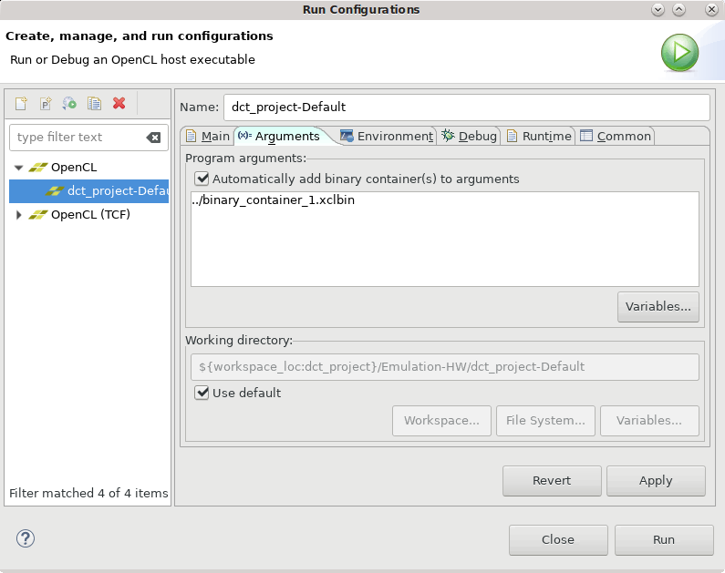

<table class="sphinxhide">
 <tr>
   <td align="center"><h1>2020.1 Vitis™ Application Acceleration Tutorials</h1>
   <a href="https://github.com/Xilinx/Vitis-Tutorials/branches/all">See 2019.2 Vitis Application Acceleration Development Flow Tutorials</a>
  </td>
 </tr>
 <tr>
 <td>
 </td>
 </tr>
</table>

# 5. Using the HLS Kernel in the Vitis Tool

In the earlier steps of this tutorial, you optimized the HLS kernel code and generated the Vitis compiled object file (`.xo`). You have also moved the optimization directives from the Tcl directives file to pragmas that are included in the `dct.cpp` file. The directives are effective when using the Vitis HLS tool to explore different solutions to the design problems you explored. However, for use in the Vitis application acceleration development flow, the pragmas included in the source code are the preferred methodology.

In this lab, you will create a new application project in the Vitis IDE, add the host application code and the compiled HLS kernel to the project, and build and run the application.

>**TIP:** You can optionally use the `dct.cpp` source file in the Vitis IDE to recompile the source code and create the Vitis kernel (`.xo`) file.

## Create the Application Project in the Vitis IDE

1. Enter the following command to launch the Vitis IDE:

   `vitis`

   The Eclipse Launcher dialog box displays to let you select a workspace.

2. Specify a new or existing workspace. Click **Launch**.

3. Select **File** > **New Application Project**. 

   The New Project wizard is displayed. Click **Next**. 

4. In the Platform page, select the `xilinx_u200_xdma_201830_2` platform. Click **Next**. 

5. In the Application Project Details page, specify `dct_project` as the Application project name and click **Next** to proceed. 

6. In the Templates page, select **Empty Application** and click **Finish** to create the application project.

The Vitis IDE creates the `dct_project` and opens the Design perspective.

### Add Source Files

1. In the Project Explorer view, right-click the `src` folder, and select **Import Sources**. 

   The Import Sources dialog box opens. You will need to specify the host application, needed `#include` files, and the Vitis HLS kernel `dct.xo` for the project.

2. Check that the **Into folder** field specifies the `dct_project/src` folder. This ensures that the source files are imported into the correct location. 

3. For the From directory, select the **Browse** button to display the Import from directory dialog box. Browse to the `reference_files/src` folder and click **OK**.

4. Select the following files in the `src` folder: 
    - `dct_top`.cpp: This is the host application. 
    - `dct_top.h` and `dct.h`: Required include files for the host application.

5. Click **Finish** to add the files to the project.

6. Right-click the `src` folder, and select **Import sources**. 
8. Click the **Browse** button, navigate to the `./vitis_hls_analysis/reference-files` folder, and click **OK**.
9. Select the `dct.xo` file that you exported from Vitis HLS in the last lab, and click **Finish** to import it into the project. 

   You now have the host application, `dct_top.cpp`, and the Vitis HLS kernel, `dct.xo`, in the project. 

10. Double-click the `dct_top.cpp` file to open it in the Code Editor, and examine the code. 

      Structurally the code is similar to the test bench you were working with when performing C and C/RTL co-simulation in the earlier labs. Here the host application includes the addition of the OpenCL API to setup and manage the Xilinx Runtime (XRT) library for the application. 
   
      For more information on writing the host application, refer to [Host Application](https://www.xilinx.com/html_docs/xilinx2020_1/vitis_doc/devhostapp.html#vpy1519742402284) in the Application Acceleration Development flow of the Vitis Unified Software Platform Documentation (UG1416). You can also work through the [Host Code Optimization](https://github.com/Xilinx/TechDocs/blob/Vitis-Tutorials-2020.1-develop/docs/host-code-opt/README.md) tutorial for an example application.

      After examining the host application, you need to specify a hardware function to be run on the Alveo Data Center U200 accelerator card you selected when you created the application project. 

11. In the Hardware Functions section of the Project Settings view, select **Add Hardware Functions**. 

      The Add Hardware Functions dialog box opens, listing the `dct()` function found in the `dct.xo` file, and the `main()` function found in the host application. 

12. Select the `dct()` function as shown in the following figure, and click **OK** to proceed.

      

13. In the Project Settings view, deselect the **Kernel debug** checkbox.

   >**TIP:** If you miss this step, you will receive a reminder when you try to build the project.

## Build and Run the Hardware Emulation Target

With the source code imported into the project and the hardware function specified, you are now ready to build the application project. There are multiple build targets to choose from. For more information see [Build Targets](https://www.xilinx.com/html_docs/xilinx2020_1/vitis_doc/buildtargets1.html#rst1525720251890) in the Application Acceleration Development flow of the Vitis Unified Software Platform Documentation (UG1416), or examine the [Essential Concepts for Building and Running the Accelerated Application](https://github.com/Xilinx/TechDocs/tree/Vitis-Tutorials-2020.1-develop/docs/Pathway3) tutorial.

1. In the Assistant view, expand the `dct_project` so you can see the Emulation-SW, Emulation-HW, and Hardware build targets.
2. Right-click **Emulation-HW** , and select **Set Active** to make it the active target.
3. Right-click the **Emulation-HW** target again, and select **Build**.

   The Vitis IDE builds the application project, for the hardware emulation build target. This will take less time than building for hardware. When the build completes, you can expand the Console view to examine the transcript of the process.

4. In the Assistant view, right-click the **Emulation-HW** target and select **Run > Run Configurations**. This opens the Run Configurations dialog box. 
5. Select the **Arguments** tab, select the **Automatically add binary containers to arguments** checkbox as shown in the following figure, and click **Apply**. 
6. Click **Run** to launch the application. 

   

When you click **Run**, the host application is run, loading the specified `.xclbin` file created from the `dct.xo` and the U200 platform. You can expand the Console view to examine the transcript of the application as it runs, or expand the Emulation Console view to see the results of the emulation environment. The transcript should display **Test Passed** if the application ran without error.

## Summary

In this tutorial:

1. You worked to optimize C/C++ code in the Vitis HLS tool, to synthesize it into RTL code for use in the Vitis application acceleration development flow. 
2. With the code optimized, you exported the compiled kernel object (`.xo`) file for use in a Vitis application project. 
3. Then you created a new application project in the Vitis IDE and imported the host source code and the HLS kernel object, and built and ran the hardware emulation target. 

These are the elements of building and accelerating applications and functions using the Vitis and Vitis HLS tools. You can mix the Vitis HLS kernels with RTL kernel objects (`.xo`) and uncompiled C/C++ kernel code (`.c`/`.cpp`) in the Vitis application project to create more complex accelerated applications. 

You have the optimized but uncompiled C++ code (`dct.cpp`) that you saved in an earlier step of this tutorial. You can remove the HLS kernel object and add this optimized C++ code in the Vitis application project if you want. In this case, the Vitis IDE will call Vitis HLS as part of the build process when compiling the C++ kernel code.  

 

<b><a href="/docs/vitis-getting-started/README.md">Return to Getting Started Pathway</a> — <a href="./README.md">Return to Start of Tutorial</a></b>

Copyright&copy; 2020 Xilinx

