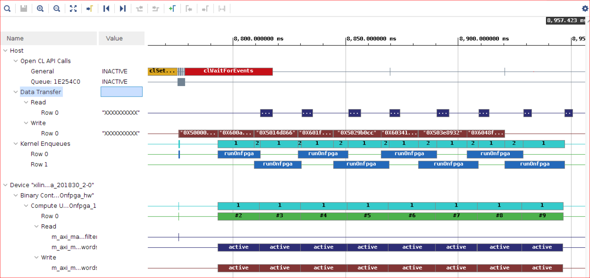
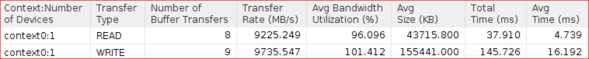

<table class="sphinxhide">
 <tr>
   <td align="center"><h1>2020.1 Vitis™ Application Acceleration Development Flow Tutorials</h1>
   <a href="https://github.com/Xilinx/Vitis-Tutorials/branches/all">See 2019.2 Vitis Application Acceleration Development Flow Tutorials</a>
   </td>
 </tr>
 <tr>
 <td>
 </td>
 </tr>
</table>

# Using Multiple DDR Banks

In the previous step, you noticed the overlap of the host data transfer documents sent to FPGA were also split into multiple buffers. Flags from the FPGA were also sent to the host immediately; this overlaps the compute profile score on the CPU with the "Compute FPGA" which further improves the application execution time.

You also observed memory contention because the host and kernel both accessed the same bank at the same time.
In this section, you configure multiple DDR banks to improve the kernel performance.

Alveo cards have multiple DDR banks, and you can use multiple banks in ping-pong fashion to minimize the contention.

* The host is writing words to DDR bank 1 and DDR bank 2 alternatively. 
* When the host is writing words to DDR bank1, the kernel is reading flags from DDR bank2. 
* When host is writing documents to DDR bank2, the kernel is reading flags from DDR bank1. 

## Code Modifications

1. Navigate to `$LAB_WORK_DIR/reference_files`, and with a file editor, open `run_sw_overlap_multiDDR.cpp`.

2. The kernel will read from DDR bank1 and bank2 alternatively and its `maxi` port is connected to both DDR banks. Establish the connectivity of kernel arguments to the appropriate DDR banks shown as follows. This connectivity is added in `design.connectivity`.  

    ```
    [connectivity]
    sp=runOnfpga_1.input_words:DDR[1:2] 
    ```
   - This option instructs the `v++` linker that input_words are connected to both DDR banks 1 and 2. You will need to rebuild the kernel because connectivity is now changed.

3. From the host code, you will need to send the words to both DDR banks alternatively. The DDR bank assignment in the host code is supported by a Xilinx vendor extension. Two Xilinx extension pointer objects (`cl_mem_ext_ptr_t`) are created, `buffer_words_ext[0]` and `buffer_words_ext[1]`. The`flags` will determine which DDR bank the buffer will be send to, so that kernel can access it.

   ```cpp
    cl_mem_ext_ptr_t buffer_words_ext[2];

    buffer_words_ext[0].flags = 1 | XCL_MEM_TOPOLOGY; // DDR[1]
    buffer_words_ext[0].param = 0;
    buffer_words_ext[0].obj   = input_doc_words;
    buffer_words_ext[1].flags = 2 | XCL_MEM_TOPOLOGY; // DDR[2]
    buffer_words_ext[1].param = 0;
    buffer_words_ext[1].obj   = input_doc_words;
   ```  

4. Next two buffers, `buffer_doc_words[0]` and `buffer_doc_words[1]` are created in `DDR[1]` and `DDR[2]` as follows.

    ```cpp 
    buffer_doc_words[0] = cl::Buffer(context, CL_MEM_EXT_PTR_XILINX | CL_MEM_USE_HOST_PTR | CL_MEM_READ_ONLY, total_size*sizeof(uint), &buffer_words_ext[0]);
    buffer_doc_words[1] = cl::Buffer(context, CL_MEM_EXT_PTR_XILINX | CL_MEM_USE_HOST_PTR | CL_MEM_READ_ONLY, total_size*sizeof(uint), &buffer_words_ext[1]);
    buffer_inh_flags    = cl::Buffer(context, CL_MEM_USE_HOST_PTR | CL_MEM_WRITE_ONLY, total_size*sizeof(char),output_inh_flags);
    buffer_bloom_filter = cl::Buffer(context, CL_MEM_USE_HOST_PTR | CL_MEM_READ_ONLY, bloom_filter_size*sizeof(uint),bloom_filter);

    // Set buffer kernel arguments (needed to migrate the buffers in the correct memory)
    kernel.setArg(0, buffer_inh_flags);
    kernel.setArg(1, buffer_doc_words[0]);
    kernel.setArg(2, buffer_bloom_filter);

    // Make buffers resident in the device
    q.enqueueMigrateMemObjects({buffer_bloom_filter, buffer_doc_words[0], buffer_doc_words[1], buffer_inh_flags}, CL_MIGRATE_MEM_OBJECT_CONTENT_UNDEFINED);

    // Create sub-buffers, one for each transaction
    unsigned subbuf_doc_sz = total_doc_size/num_iter;
    unsigned subbuf_inh_sz = total_doc_size/num_iter;

    cl_buffer_region subbuf_inh_info[num_iter];
    cl_buffer_region subbuf_doc_info[num_iter];
    cl::Buffer subbuf_inh_flags[num_iter];
    cl::Buffer subbuf_doc_words[num_iter];

    for (int i=0; i<num_iter; i++) {
        subbuf_inh_info[i]={i*subbuf_inh_sz*sizeof(char), subbuf_inh_sz*sizeof(char)};
        subbuf_doc_info[i]={i*subbuf_doc_sz*sizeof(uint), subbuf_doc_sz*sizeof(uint)};
        subbuf_inh_flags[i] = buffer_inh_flags.createSubBuffer(CL_MEM_WRITE_ONLY, CL_BUFFER_CREATE_TYPE_REGION, &subbuf_inh_info[i]);
        // The doc words sub-buffers will be alternating in DDR[1] and DDR[2]
        subbuf_doc_words[i] = buffer_doc_words[i%2].createSubBuffer (CL_MEM_READ_ONLY,  CL_BUFFER_CREATE_TYPE_REGION, &subbuf_doc_info[i]);
    }
    ```

5. The kernel argument, input word is set to array of sub-buffers created from `buffer_doc_words[0]` and `buffer_doc_words[1]` alternatively; hence, data is sent to DDR bank 1 and 2 alternatively in each kernel execution. 


    ```cpp 
    for (int i=0; i<num_iter; i++)
    {
      cl::Event buffDone, krnlDone, flagDone;
      total_size = subbuf_doc_info[i].size / sizeof(uint);
      load_filter = false;
      kernel.setArg(0, subbuf_inh_flags[i]);
      kernel.setArg(1, subbuf_doc_words[i]);
      kernel.setArg(3, total_size);
      kernel.setArg(4, load_filter);
      q.enqueueMigrateMemObjects({subbuf_doc_words[i]}, 0, &wordWait, &buffDone);
      wordWait.push_back(buffDone);
      q.enqueueTask(kernel, &wordWait, &krnlDone);
      krnlWait.push_back(krnlDone);
      q.enqueueMigrateMemObjects({subbuf_inh_flags[i]}, CL_MIGRATE_MEM_OBJECT_HOST, &krnlWait, &flagDone);
      flagWait.push_back(flagDone);
    }
    ```

### Run the Application Using 8 Words in Parallel

1. Go to the `makefile` directory and run the `make` command.

    ```
     cd $LAB_WORK_DIR/makefile; make run STEP=multiDDR TARGET=hw PF=8 ITER=8
    ```

    The following output displays.

    ```
      Processing 1398.905 MBytes of data
      MultiDDR- Splitting data in 8 sub-buffers of 174.863 MBytes for FPGA processing
      --------------------------------------------------------------------
      Executed FPGA accelerated version  |   426.6388 ms   ( FPGA 175.113 ms )
      Executed Software-Only version     |   3058.8499 ms
      --------------------------------------------------------------------
      Verification: PASS
    ```

  The overall FPGA time was reduced from 230 ms to 175 ms.

### Review the Profile Report and Timeline Trace
  
1. Run the following commands to view the Timeline Trace report.

    ```
    vitis_analyzer $LAB_WORK_DIR/build/multiDDR/kernel_8/hw/runOnfpga_hw.xclbin.run_summary
    ```

2. Zoom in to display the Timeline Trace report.

    

    - The Timeline Trace confirms that the host is writing to the DDR in a ping-pong fashion. You can hover your mouse over Data Transfer-> Write transactions and observe that the host is writing to bank1, bank2, bank1, bank2, alternatively.
    The kernel is always writing to same DDR bank1 as flags size is relatively small.
    - In the previous lab, without usage of multiple banks the kernel cannot read the next set of words from the DDR until the host has read flags written by the kernel in the previous enqueue. In this lab, you can observe that both of these accesses can be carried out in parallel because these accesses are for different DDR banks. 

    This results in an improved FPGA compute that includes the transfer from the host, device compute and sending flag data back to the host.

3. Review the Profile report and note the following observations:

    *  *Data Transfer: Host to Global Memory* section indicates:
        - Host to Global Memory WRITE Transfer takes about 145.7 ms which is less than 207 ms.
        - Host to Global Memory READ Transfer takes about 37.9 ms.

          

   * *Kernels & Compute Unit: Compute Unit Utilization* section shows that the CU Utilization has also increased to 89.5% from 71% in previous lab.

      

    * The *Kernels & Compute Unit: Compute Unit Utilization* shows that contention has been reduced from 21 ms in previous lab to about 5 ms in this lab.

      

Compared to the previous step using only one DDR, there is no overall application gain. The FPGA compute performance improves, but the bottleneck is processing the "Compute Score", which is limited by CPU Performance. If the CPU can process faster, you can get the better performance.  

Based on the results, the throughput of the application is 1399MB/426 ms = approximately 3.27 GBs. You now have approximately 7.2x (=3058 ms/426 ms) the performance results compared to the software-only version.

## Conclusion

Congratulations! You have successfully completed the tutorial.

In this tutorial, you learned that optimizing how the host application interacts with the accelerator makes a significant difference. A native initial implementation delivered a 4x performance improvement over the reference software implementation. By leveraging data-parallelism, the overlapping data transfers, compute, and the overlapping CPU processing with FPGA processing, using multiple DDR banks, the application performance was increased by another 1.8x, achieving a total of 7.2x acceleration.

In the next module, you will [create and optimize a two-dimensional convolution accelerator](../convolution-tutorial/README.md) used to filter a video stream at 30 fps.

---------------------------------------
<p align="center" class="sphinxhide"><b><a href="/docs/vitis-getting-started/">Return to Getting Started Pathway</a> — <a href="./README.md">Return to Start of Tutorial</a></b></p>
<p align="center" class="sphinxhide"><sup>Copyright&copy; 2020 Xilinx</sup></p>
