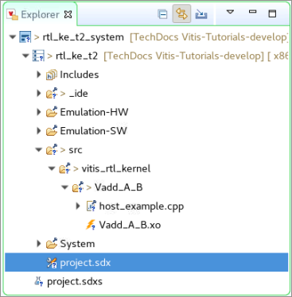

<table class="sphinxhide">
 <tr>
   <td align="center"><h1>2020.1 Vitis™ Application Acceleration Development Flow Tutorials</h1>
   <a href="https://github.com/Xilinx/Vitis-Tutorials/branches/all">See 2019.2 Vitis Application Acceleration Development Flow Tutorials</a>
   </td>
 </tr>
 <tr>
 <td>
 </td>
 </tr>
</table>

# Using the RTL Kernel in a Vitis IDE Project

>**TIP**: You can use the RTL kernel you created in the Package IP lab in the Vitis IDE.

## Delete and Import Host Code

After exiting the Vivado tool, the following files are added to the Project Explorer in the Vitis IDE:

- `Vadd_A_B.xo`: Compiled kernel object file.
- `host_example.cpp`: Example host application file.  

1. In the Project Explorer view, expand `src` as shown in the following figure.  

   > **NOTE**: `Vadd_A_B.xo` is displayed with a lightning bolt icon. In the Vitis IDE, this indicates a hardware function. The IDE recognizes the RTL kernel and marks it as an accelerated function.

2. Select and delete `host_example.cpp`. 

   At this point, import the host application provided for this tutorial.  

3. In the Project Explorer view, right-click the tutorial project, and click **Import Sources**.

4. In the From directory field, click **Browse...**, navigate to `reference-files/src/host`, and click **OK**.

5. Select `host.cpp` to add the host application code to your project.

6. In the Into folder field, click **Browse...** and navigate to `rtl_ke_t2/src/vitis_rtl_kernel/Vadd_A_B`, and click **OK**.

7. Click **Finish**.

   The `host.cpp` file is added in the `src/vitis_rtl_kernel/Vadd_A_B` folder.

8. Double-click `host.cpp`, which opens it in the Code Editor window.

## Host Code Structure

The structure of the host code is divided into three sections:

1. Setting up the OpenCL runtime environment
2. Execution of kernels
3. Post-processing and release of FPGA device

Here are some of the important OpenCL API calls allowing the host application to interact with the FPGA:

- A handle to the kernel is created (line 239).

   ```C
    clCreateKernel(program, "Vadd_A_B", &err);
    ```

- Buffers are created to transfer data back and forth between the host and the FPGA (line 256).

  ```C
  clCreateBuffer(context, CL_MEM_READ_WRITE,sizeof(int) * number_of_words, NULL, NULL);
  ```

- Values (A and B) are written into the buffers, and the buffers transferred to the FPGA (lines 266 and 274).

  ```C
  clEnqueueWriteBuffer(commands, dev_mem_ptr, CL_TRUE, 0,sizeof(int) * number_of_words, host_mem_ptr, 0, NULL, NULL);
  ```

- After A and B have been transferred to the device, the kernel can be executed (line 299).

  ```C
  clEnqueueTask(command_queue, kernel, 0, NULL, NULL);
  ```

- After the kernel completes, the host application reads back the buffer with the new value of B (line 312).

  ```C
  clEnqueueReadBuffer(command_queue, dev_mem_ptr, CL_TRUE, 0, sizeof(int)*number_of_words,host_mem_output_ptr, 0, NULL, &readevent );
  ```

The structure and requirements of the host application are discussed in greater detail in [Developing Applications](https://www.xilinx.com/cgi-bin/docs/rdoc?v=2020.1;t=vitis+doc;d=lhv1569273988420.html) in the Application Acceleration Development flow of the Vitis Unified Software Platform Documentation (UG1416).

## Add the Hardware Function

With the host application code (`host.cpp`) and the RTL kernel code (`Vadd_A_B.xo`) added to the project, you need to define the hardware function to generate the device binary or `.xclbin` file.

1. In the Project Editor, in the Hardware Functions window, click  to add hardware functions into the project.
2. Select the `Vadd_A_B` function.

## Build the Project

With the host application code (`host.cpp`) and the RTL kernel code (`Vadd_A_B.xo`) added to the project, you are ready to build and run the project.

>**TIP**: You can also use the RTL kernel you created in the Package IP/Package XO lab in the Vitis IDE.

1. In the Vitis Application Project Settings, change **Active build configuration** to **Emulation-HW**.  
The Hardware Emulation target is useful for:
   - Verifying the functionality of the logic that will go into the FPGA.
   - Retrieving the initial performance estimates of the accelerator and host application.

    >**TIP**: For Software Emulation, the RTL kernel flow requires a C/C++ software model of the kernel. In this tutorial, you have not been provided such a model, so you will not be able to run a Software Emulation build.

2. Using the **Run** button, select **Run Configurations**.

   

   You will see that the rtl_ke_t2-Default configuration has already been created by the system. The host code needs to read the `xclbin` file, which should be provided as an input argument in the argument list.
   

3. Select **Automatically add binary container(s) to arguments**.  
The option will automatically search and include the `xclbin`. Add `xilinx_u200_xdma_201830_2` after the `xclbin` filename as the second input argument when executing host code.

4. Build and run the Hardware Emulation configuration, and then verify the results.

### (Optional) Build and Run the Hardware on the Target Platform

1. In the Vitis Application Project Settings, change **Active build configuration** to **Hardware**.  
In the system configuration, the kernel code is implemented onto the FPGA, resulting in a binary that will run on the selected platform card.  

2. If you have an available hardware platform, build and run the hardware build, and then verify the results.

# Summary

1. You used the RTL Kernel Wizard from the Vitis IDE to specify the name and interfaces of a new RTL kernel (based on an existing RTL IP).
   - The RTL Kernel Wizard created an XML template according to your specifications, automatically generated files for an example RTL kernel matching these specifications, and then launched the Vivado Design Suite.

2. In the Vivado Design Suite, you removed the example RTL files and added in your own RTL IP files.

3. You simulated the IP using a test bench to incorporate the AXI Verification IP (AXI VIP).

4. You packaged the RTL IP project into the compiled XO file needed by the Vitis IDE.

5. You added the RTL kernel to a host application and built the Hardware Emulation configuration.  
   - In the Vitis IDE, a binary container was created using the XO file, and a `xclbin` file was compiled.
</br>
<hr/>
<p align="center" class="sphinxhide"><b><a href="/README.md">Return to Getting Started Pathway</a> — <a href="./README.md">Return to Start of Tutorial</a></b></p>

<p align="center" class="sphinxhide"><sup>Copyright&copy; 2020 Xilinx</sup></p>
