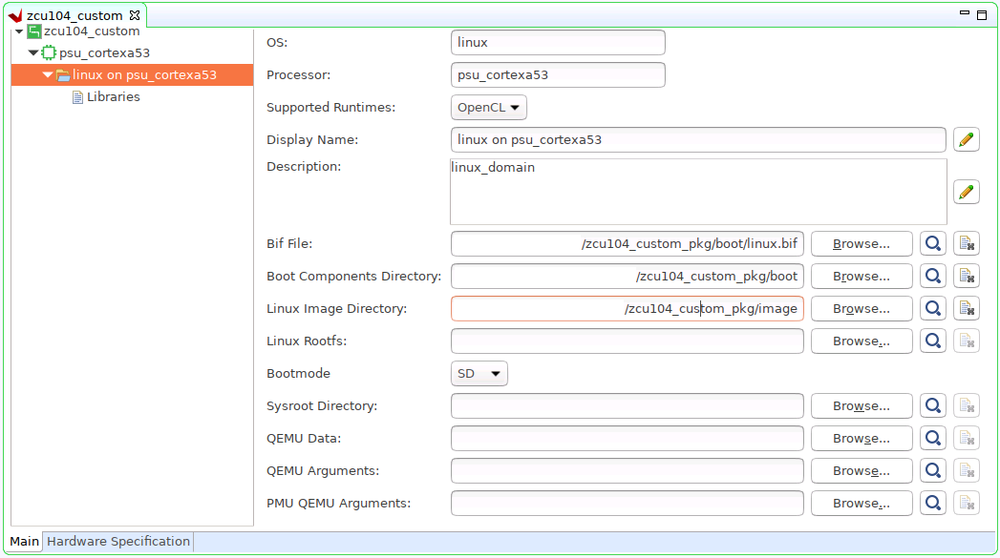

## Step 3: Create the Vitis Platform

### Prepare Files for Platform Packaging

1. We would store all the necessary files for Vitis platform creation flow. Here we name it ```zcu104_custom_pkg ```. Then we create a `pfm` folder inside to hold platform creation source components. 

   ```
   mkdir zcu104_custom_pkg
   cd zcu104_custom_pkg
   mkdir pfm
   ```
   After this step, your directory hierarchy looks like this.

   ```
   - zcu104_custom_platform # Vivado Project Directory
   - zcu104_custom_plnx     # PetaLinux Project Directory
   - zcu104_custom_pkg      # Platform Packaging Directory
     - pfm                  # Platform Packaging Sources
   ```

2. Install sysroot: 

    a) Go to <PetaLinux Project>/images/linux directory.

    b) Type ```./sdk.sh -d <Install Target Dir>``` to install PetaLinux SDK. use the `-d` option to provide a full pathname to the output directory ***zcu104_custom_pkg/pfm*** (This is an example ) and confirm.

   - Note: The environment variable ***LD_LIBRARY_PATH*** must not be set when running this command

We would install Vitis AI library and DNNDK into this rootfs during test phase.


3. Create `boot` directory and `image` directory inside pfm directory

   ```bash
   cd zcu104_custom_pkg/pfm
   mkdir boot
   mkdir image
   ```
   After this step, your directory hierarchy looks like this.

   ```
   - zcu104_custom_platform # Vivado Project Directory
   - zcu104_custom_plnx     # PetaLinux Project Directory
   - zcu104_custom_pkg      # Platform Packaging Directory
     - sysroots             # Extracted Sysroot Directory
     - pfm                  # Platform Packaging Sources
       - boot               # Platform boot components
       - image              # Files to be put in FAT32 partition
   ```

   We'll prepare BIF file and the files it refers to into ***boot*** directory; we'll prepare all files needed for FAT32 partition to ***image*** directory.


4. Copy the generated Linux software boot components from ***<your_petalinux_dir>/images/linux directory*** to the ***<full_pathname_to_zcu104_custom_pkg>/pfm/boot*** directory to prepare for running the Vitis platform packaging flow:

   - zynqmp_fsbl.elf: ***rename as fsbl.elf*** as a workaround of a Vitis known issue.
   - pmufw.elf
   - bl31.elf
   - u-boot.elf

Note: These files are the sources of creating BOOT.BIN.

5. Add a BIF file (linux.bif) to the ***<full_pathname_to_zcu104_custom_pkg>/pfm/boot*** directory with the contents shown below. The file names should match the contents of the boot directory. The Vitis tool expands these pathnames relative to the sw directory of the platform at v++ link time or when generating an SD card. However, if the bootgen command is used directly to create a BOOT.BIN file from a BIF file, full pathnames in the BIF are necessary. Bootgen does not expand the names between the <> symbols.<br />

```
/* linux */
 the_ROM_image:
 {
 	[fsbl_config] a53_x64
 	[bootloader] <fsbl.elf>
 	[pmufw_image] <pmufw.elf>
 	[destination_device=pl] <bitstream>
 	[destination_cpu=a53-0, exception_level=el-3, trustzone] <bl31.elf>
 	[destination_cpu=a53-0, exception_level=el-2] <u-boot.elf>
 }
```

   - The file names in `<>` are placeholders. Vitis will replace the placeholders with the relative path to platform during platform packaging. V++ packager, which runs when buiding the final application would expand it further to the full path during image packaging.
   - Filename placeholders point to the files in boot directory. The filenames in boot directory need to match with placeholders in BIF file.
   - `<bitstream>` is a reserved keyword. V++ packager will replace it with the final system bit file.
   - It's a known issue that v++ packager only recognizes FSBL with `<fsbl.elf>`. So for MPSoC, it's needed to copy `zynqmp_fsbl.elf` that PetaLinux generates to `fsbl.elf` in image directory. This issue is fixed in 2020.2.

6. Prepare image directory. Contents in this directory will be packaged to FAT32 partition by v++ package tool.

   a) Copy the generated Linux software components from ***<your_petalinux_dir>/images/linux directory*** to the ***<full_pathname_to_zcu104_custom_pkg>/pfm/image*** directory.

   - boot.scr: script for u-boot initialization
   - system.dtb: device tree file for Linux to boot

   b) Copy ***init.sh*** and ***platform_desc.txt*** from ***ref_files/step3_pfm/image*** to ***<full_pathname_to_zcu104_custom_pkg>/image*** directory.

   - init.sh will set environment variable XILINX_XRT for XRT and copy platform_desc.txt to /etc/xocl.txt
   - platform_desc.txt has the platform name. XRT OpenCL API can check the platform name before loading xclbin file to make sure they match.
   - User needs to run `source /mnt/sd-mmcblk0p1/init.sh` manually on the target platform.

### (Optional) Prepare Files to Enable Emulation

To run software emulation or software emulation with Vitis, we'll need to prepare some emulation configuration files.

- QEMU Data: boot components used by QEMU. It can reuse the boot directory that we've prepared
- QEMU Arguments: QEMU arguments for launching Linux on ARM Cortex-A53
- PMU QEMU Arguments: QEMU arguments for launching PMUFW on PMU

1. Create directory ***zcu104_custom_pkg/pfm/qemu***

   ```bash
   cd zcu104_custom_pkg/pfm
   mkdir qemu
   ```

   After this step, your directory hierarchy looks like this.

   ```
   - zcu104_custom_platform # Vivado Project Directory
   - zcu104_custom_plnx     # PetaLinux Project Directory
   - zcu104_custom_pkg      # Platform Packaging Directory
     - pfm                  # Platform Packaging Sources
       - boot               # Platform boot components
       - image              # Files to be put in FAT32 partition
       - qemu               # Emulation configuration files
   ```

2. Copy ***pmu_args.txt*** and ***qemu_args.txt*** from ***ref_files/step3_pfm/qemu/*** to your qemu directory

Example of ***qemu_args.txt***

```
-M
arm-generic-fdt
-serial
mon:stdio
-global
xlnx,zynqmp-boot.cpu-num=0
-global
xlnx,zynqmp-boot.use-pmufw=true
-net
nic
-net
nic
-net
nic
-net
nic
-net
user
-m
4G
-device
loader,file=<xrt/qemu/bl31.elf>,cpu-num=0
-device
loader,file=<xrt/qemu/u-boot.elf>
-boot
mode=5

```

Example of ***pmu_args.txt***

```
-M
microblaze-fdt
-device
loader,file=<xrt/qemu/pmufw.elf>
-machine-path
.
-display
none
```


### Create a Vitis Platform

First we create a Vitis platform project with the XSA file generated by Vivado from Step 1.

1. Go to the ***zcu104_custom_pkg*** folder you created:

   ```
   cd <full_pathname_to_zcu104_custom_pkg>
   ```

2. Launch Vitis by typing ```vitis``` in the console.

3. Select ***zcu104_custom_pkg*** folder as workspace directory.

4. In the Vitis IDE, select ***File > New > Platform Project*** to create a platform project.<br />

5. Enter the project name. For this example, type ```zcu104_custom```, click ***Next***.

6. In the Platform page,

   a) Click ***Browse*** button, select the XSA file generated by the Vivado. In this case, it is ```zcu104_custom_platform.xsa```.</br>
   b) Set the operating system to ***linux***.</br>
   c) Set the processor to ***psu_cortexa53***.</br>
   d) Architecture: ***64-bit***</br>
   e) ***Uncheck*** option ***Generate boot components***, because we'll use PetaLinux generated boot components.</br>
   f) Click ***Finish***.

Next we setup software settings in Platform Settings view.

1. In the Platform Settings view, observe the following:

   - The name of the Platform Settings view matches the platform project name of ***zcu104_custom***.<br />
   - A psu_cortexa53 device icon is shown, containing a ***Linux on psu_cortexa53*** domain.

2. Click the ***linux on psu_cortexa53*** domain, browse to the locations and select the directory or file needed to complete the dialog box for the following:

   - ***Bif file***: Browse to ***zcu104_custom_pkg/pfm/boot/linux.bif*** file and click OK.
   - ***Boot Components Direcotory***: Browse to ***zcu104_custom_pkg/boot*** and click OK.
   - ***Linux Image Directory***: Browse to ***zcu104_custom_pkg/image*** and click OK.

3. (Optional) Setup emulation related files

    If you've already enabled TLM simulation model for PS in Vivado design and prepared emulation arguments, please set the arguments to platform properties to enable emulation features.

   - QEMU Data: Browse to ***zcu104_custom_pkg/pfm/boot*** and click OK
   - QEMU Arguments: Browse to ***qemu_args.txt*** and click OK
   - PMU QEMU Arguments: Browse to ***pmu_args.txt*** and click OK



4. Click ***zcu104_custom*** project in the Vitis Explorer view, click the ***Build*** button to generate the platform.

    

***Note: The generated platform is placed in the export directory. BSP and source files are also provided for re-building the FSBL and PMU if desired and are associated with the platform. The platform is ready to be used for application development.***


If you'd create an Vitis application in the same workspace as this platform, you can find this platform available in the platform selection page in platform creation wizard. If you'd like to reuse this platform in another workspace, add its path to PLATFORM_REPO_PATHS environment variable before launching Vitis GUI, or use "Add" button in platform selection page of Vitis GUI to add its path.

***[Next let's try to build some applications on this platform and test them.](./step4.md)***

### Fast Track

Scripts are provided to create the Vitis platform. To use these scripts, please run the following steps.

1. Run build

   ```
   # cd to the step directory, e.g.
   cd step3_pfm
   make all
   ```

2. To clean the generated files, please run

   ```bash
   make clean
   ```

<p align="center"><sup>Copyright&copy; 2020 Xilinx</sup></p>
