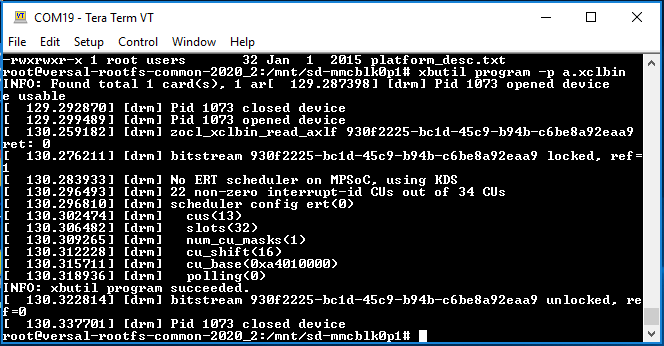
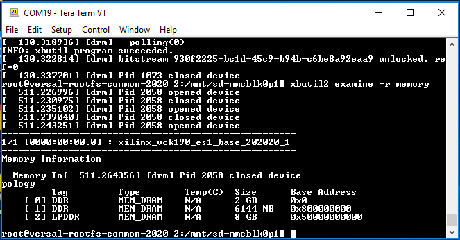
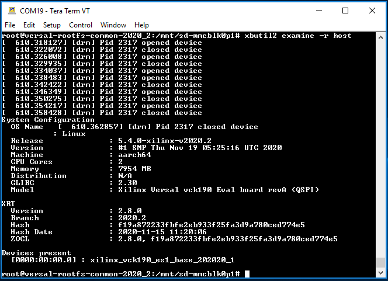
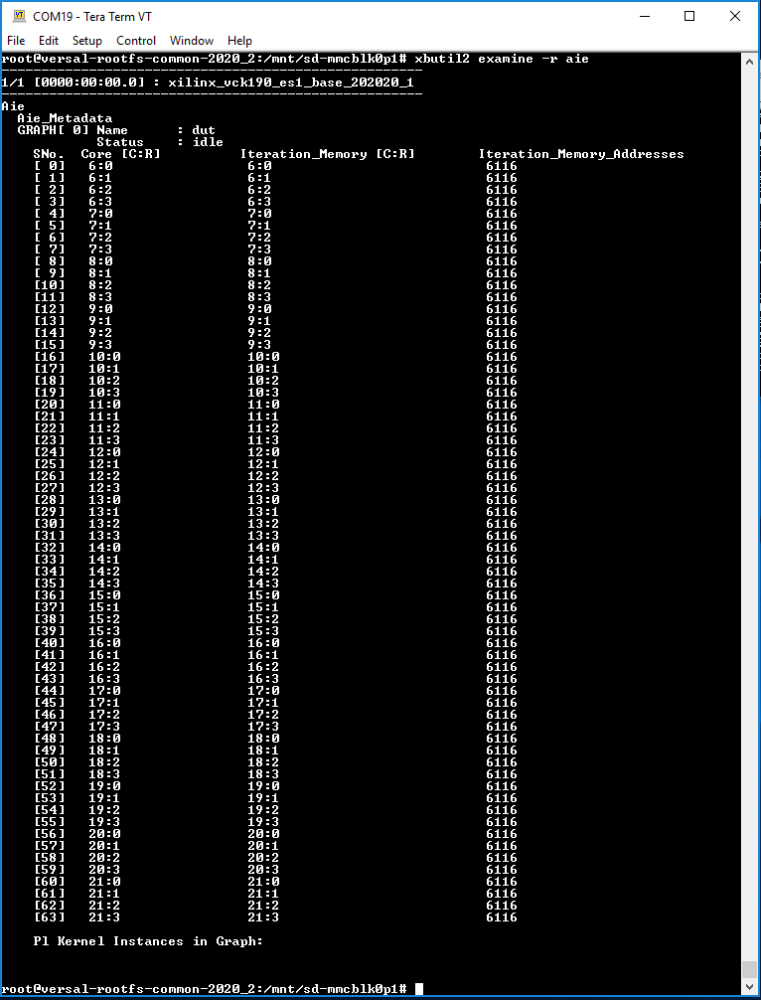
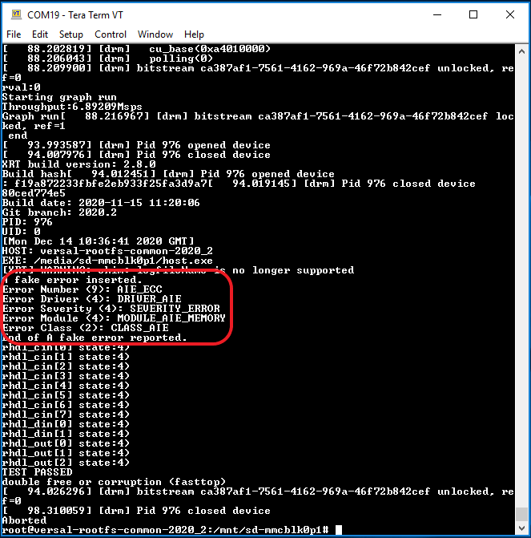
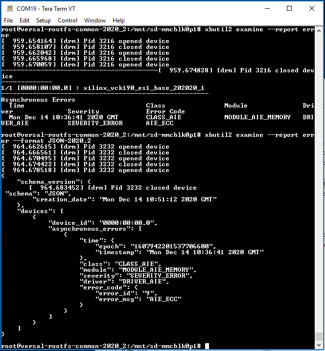

<table>
 <tr>
   <td align="center"><h1>AI Engine Debug Walkthrough Tutorial - From Simulation to Hardware</h1>
   </td>
 </tr>
 <tr>
 <td align="center"><h1>AI Engine/PL Kernel Debug with XRT Utilities</h1>
 </td>
 </tr>
</table> 


[xbutil xbutil2](#xbutil-xbutil2)

* [xbutil xbutil2 limitations](#xbutil-xbutil2-limitations)

[XRT error codes](#XRT-error-codes)

* [Asynchronous error](#Asynchronous-error)

* [Synchronous error](#Synchronous-error)


# xbutil & xbutil2
The two utilities, `xbutil` and `xbutil2` are supported for PL/AI Engine kernels debug. It provides information for PL/AI Engine kernels.

To use the tools, binary container, for example, xclbin is required to be loaded first then issue commands to obtain information from, or, configure the kernels.

A few command examples:
```bash
xbutil program -p a.xclbin
xbutil scan
xbutil2 examine -r aie
```

Step 1: Load binary container
```bash
xbutil program -p a.xclbin
```


Step 2: Get detailed status information for the device. Where ARG can be all, memory, error, compute-units, aie, and debug-ip-status.

```bash
xbutil2 examine -r ARG
```




```bash
root@versal-rootfs-common-2020_2:/mnt/sd-mmcblk0p1# xbutil2 examine -r all
System Configuration
  OS Name              : Linux
  Release              : 5.4.0-xilinx-v2020.2
  Version              : #1 SMP Thu Nov 19 05:25:16 UTC 2020
  Machine              : aarch64
  CPU Cores            : 2
  Memory               : 7954 MB
  Distribution         : N/A
  GLIBC                : 2.30
  Model                : Xilinx Versal vck190 Eval board revA (QSPI)

XRT
  Version              : 2.8.0
  Branch               : 2020.2
  Hash                 : f19a872233fbfe2eb933f25fa3d9a780ced774e5
  Hash Date            : 2020-11-15 11:20:06
  ZOCL                 : 2.8.0, f19a872233fbfe2eb933f25fa3d9a780ced774e5

Devices present
  [0000:00:00.0] : xilinx_vck190_es1_base_202020_1

-----------------------------------------------------
1/1 [0000:00:00.0] : xilinx_vck190_es1_base_202020_1
-----------------------------------------------------
Aie
  Aie_Metadata
  GRAPH[ 0] Name      : dut
            Status    : idle
    SNo.  Core [C:R]          Iteration_Memory [C:R]        Iteration_Memory_Addresses
    [ 0]   6:0                 6:0                           6116
    [ 1]   6:1                 6:1                           6116
    [ 2]   6:2                 6:2                           6116
    [ 3]   6:3                 6:3                           6116
    [ 4]   7:0                 7:0                           6116
    [ 5]   7:1                 7:1                           6116
    [ 6]   7:2                 7:2                           6116
    [ 7]   7:3                 7:3                           6116
    [ 8]   8:0                 8:0                           6116
    [ 9]   8:1                 8:1                           6116
    [10]   8:2                 8:2                           6116
    [11]   8:3                 8:3                           6116
    [12]   9:0                 9:0                           6116
    [13]   9:1                 9:1                           6116
    [14]   9:2                 9:2                           6116
    [15]   9:3                 9:3                           6116
    [16]   10:0                10:0                          6116
    [17]   10:1                10:1                          6116
    [18]   10:2                10:2                          6116
    [19]   10:3                10:3                          6116
    [20]   11:0                11:0                          6116
    [21]   11:1                11:1                          6116
    [22]   11:2                11:2                          6116
    [23]   11:3                11:3                          6116
    [24]   12:0                12:0                          6116
    [25]   12:1                12:1                          6116
    [26]   12:2                12:2                          6116
    [27]   12:3                12:3                          6116
    [28]   13:0                13:0                          6116
    [29]   13:1                13:1                          6116
    [30]   13:2                13:2                          6116
    [31]   13:3                13:3                          6116
    [32]   14:0                14:0                          6116
    [33]   14:1                14:1                          6116
    [34]   14:2                14:2                          6116
    [35]   14:3                14:3                          6116
    [36]   15:0                15:0                          6116
    [37]   15:1                15:1                          6116
    [38]   15:2                15:2                          6116
    [39]   15:3                15:3                          6116
    [40]   16:0                16:0                          6116
    [41]   16:1                16:1                          6116
    [42]   16:2                16:2                          6116
    [43]   16:3                16:3                          6116
    [44]   17:0                17:0                          6116
    [45]   17:1                17:1                          6116
    [46]   17:2                17:2                          6116
    [47]   17:3                17:3                          6116
    [48]   18:0                18:0                          6116
    [49]   18:1                18:1                          6116
    [50]   18:2                18:2                          6116
    [51]   18:3                18:3                          6116
    [52]   19:0                19:0                          6116
    [53]   19:1                19:1                          6116
    [54]   19:2                19:2                          6116
    [55]   19:3                19:3                          6116
    [56]   20:0                20:0                          6116
    [57]   20:1                20:1                          6116
    [58]   20:2                20:2                          6116
    [59]   20:3                20:3                          6116
    [60]   21:0                21:0                          6116
    [61]   21:1                21:1                          6116
    [62]   21:2                21:2                          6116
    [63]   21:3                21:3                          6116

    Pl Kernel Instances in Graph:


Memory Information

  Memory Topology
         Tag         Type        Temp(C)  Size      Base Address
    [ 0] DDR         MEM_DRAM    N/A      2 GB      0x0
    [ 1] DDR         MEM_DRAM    N/A      6144 MB   0x800000000
    [ 2] LPDDR       MEM_DRAM    N/A      8 GB      0x50000000000

Compute Units
Index   Name                    Base_Address    Usage   Status
0       mm2s_v4:mm2s_v4_1       0xa4010000      0       (IDLE)
1       mm2s_v8:mm2s_v8_1       0xa4020000      0       (IDLE)
2       mm2s_v8:mm2s_v8_2       0xa4030000      0       (IDLE)
3       mm2s_v8:mm2s_v8_3       0xa4040000      0       (IDLE)
4       mm2s_v8:mm2s_v8_4       0xa4050000      0       (IDLE)
5       mm2s_v8:mm2s_v8_5       0xa4060000      0       (IDLE)
6       mm2s_v8:mm2s_v8_6       0xa4070000      0       (IDLE)
7       mm2s_v8:mm2s_v8_7       0xa4080000      0       (IDLE)
8       mm2s_v8:mm2s_v8_8       0xa4090000      0       (IDLE)
9       mm2s_v8:mm2s_v8_9       0xa40a0000      0       (IDLE)
10      s2mm_v4:s2mm_v4_1       0xa40b0000      0       (IDLE)
11      s2mm_v4:s2mm_v4_2       0xa40c0000      0       (IDLE)
12      s2mm_v4:s2mm_v4_3       0xa40d0000      0       (IDLE)

Debug IP Status
Number of IPs found :: 0
IPs found [<ipname <(element filter option)>> :<count>)]:

root@versal-rootfs-common-2020_2:/mnt/sd-mmcblk0p1#
```

## xbutil & xbutil2 Limitations
1. Certain commands are under development and will be available in future releases.
2. Commands not applicable to the VCK190 platform:
  - validate: This command is for DFX base platform.
  - reset: Requires clearer definitions for VCK190 platforms. For example, reset command to PS/PL/AI Engine are under review.
  - top: A useful command, however, subcommands/options are being determined.
3. Utility could show false errors that are no harm to prior-loaded xclbin.


# XRT Error Codes

## Asynchronous Error
Error that happens asynchronously. It may or may not related to the XRT function call or the application which is running.

### Report Mechanism with XRT APIs
Asynchronous errors are cached in driver subsystems and can be accessed by user application through APIs.
Asynchronous errors retrieved from the driver are encoded errors defined in `xrt_error_code.h` which is shared between user space and kernel space. 

```bash
xrt_error_code.h
/**
 * xrtErrorCode layout
 *
 * This layout is internal to XRT (akin to a POSIX error code), 
 * it is populated by driver and consumed by XRT implementation where
 * it is translated into an actual error / info / warning that is propagated 
 * to the end user.
 *
 * 63 - 48  47 - 40   39 - 32   31 - 24   16 - 23    15 - 0
 * --------------------------------------------------------
 * |    |    |    |    |    |    |    |    |    |    |----| xrtErrorNum
 * |    |    |    |    |    |    |    |    |----|---------- xrtErrorDriver
 * |    |    |    |    |    |    |----|-------------------- xrtErrorSeverity
 * |    |    |    |    |----|------------------------------ xrtErrorModule
 * |    |    |----|---------------------------------------- xrtErrorClass
 * |----|-------------------------------------------------- reserved
 */
typedef uint64_t xrtErrorCode;
```

Error Code APIs:
The API header file `xrt_error.h` defines the APIs for accessing current cached errors.
```bash
///// C APIs, will have simplified C++ equivalents.
/**
 * xrtErrorGetLast - Get the last error code and its timestamp of a given error class.
 *
 * @handle:       Device handle.
 * @class:        Error Class for the last error to get.
 * @error:        Returned XRT error code.
 * @timestamp:    The timestamp when the error generated
 *
 * Return:        0 on success or appropriate XRT error code.
 */
int
xrtErrorGetLast(xclDeviceHandle handle, xrtErrorClass class, xrtErrorCode *error, uint64_t *timestamp);

/**
 * xrtErrorGetString - Get the description string of a given error code.
 *
 * @handle:       Device handle.
 * @error:        XRT error code.
 * @out:          Preallocated output buffer for the error string.
 * @len:          Length of output buffer.
 * @out_len:      Optional output of length of message.
 *
 * Return:        0 on success or appropriate XRT error code.
 * 
 * Specifying out_len while passing nullptr for output buffer will return the message length,
 * which can then be used to allocate the output buffer itself.
 */
int
xrtErrorGetString(xclDeviceHandle handle, xrtErrorCode error, char* out, size_t len, size_t* out_len=0);
```

Example using XRT APIs:
```bash
xrtGraphHandle ghdl;
ghdl = xrtGraphOpen(dhdl, top->m_header.uuid, "dut");
rval = xrtGraphRun(ghdl, 100);
if (rval != 0)
{   
    std::cout << "RUN error = 0x%x\n" << rval << std::endl;
}
rval = xrtGraphWait(ghdl, 0);
if (rval != 0)
{
    std::cout << "WAIT error = 0x%x\n" << rval << std::endl;

    if (rval == -ETIME)
    {
        /* wait for Graph done timeout */
        xrtErrorCode errCode;
        uint64_t timestamp;

        rval = xrtErrorGetLast(dhdl, XRT_ERROR_CLASS_AIE, &errCode, &timestamp);
        if (rval == 0)
        {
            size_t len;
            std::vector<char> buf(256);
            if (xrtErrorGetString(dhdl, errCode, buf.data(), buf.size(), &len))
            {
                std::cout << "xrtErrorGetString() error!" << std::endl;
            } else {
                std::cout << buf.data() << std::endl;
            }
        }
    }
}

/* more code can be added here to check other error class */
```


Step 1: Replace `host.cpp` with `host.cpp.error_code` that is available from this tutorial.

Step 2: Compile the `host.cpp` code and package to `sd_card.img` by issue commands,
```bash
cp ${PROJECT_PATH}/sw/host.cpp.error_code ${PROJECT_PATH}/sw/host.cpp
cd ${PROJECT_PATH}
make host.exe
make package
```

Step 3: Burn the generated `sd_card.img` to the SD card, insert SD card into SD card slot of the VCK190 board and power up.

Step 4: After VCK190 is powered up, run the binaries.
```bash
cd /mnt/sd-mmcblk0p1
source ./init.sh
export XILINX_XRT=/usr
./host.exe a.xclbin
```

Step 5: Expected result:




### Report Mechanism with xbutil
Issue command `xbutil2 examine --report error` or/and with formatted output `xbutil2 examine --report error --format JSON-2020.2` to VCK190 console to get output from console.




## Synchronous Error
Synchronous errors are errors that can be detected during the XRT runtime function all.

### Report Mechanism
1. Return system error (POSIX) code from
* Kernel driver IOCTL call.
* System libraries including shim level library, for example, xrt_core, AI Engine driver, FPGA manager, etc.
* On error, ioctl returns -1 and errno contains the system error code.
2. Translate returned POSIX error code into an XRT specific error which is returned to end user.
* In C++ APIs the error is propagated as an xrt::error exception embedded with a description of the error and the XRT error.
* In C APIs an exception message is printed and the XRT error code is returned to end-user.
3. The verbosity and target (display) of error reporting are following the message infrastructure already used.
Example:
```bash
rval = xclSyncBO(devHandle, boHandle, XCL_BO_SYNC_BO_TO_DEVICE, size, offset);  // Syncronous error captured by xclSyncBO call
if (rval != 0) {                                                                //    -EINVAL:     Invalid arguments, e.g. invalid sync  dir, invalid size or offset
    /* code to handle xclSyncBO fail */                                         //    -ENOENT:     No such file or directory, e.g.  invalid bo handle       
}                                                                               //    -EOPNOTSUPP: Operation not supported, e.g. BO is  not syncable
                                                                                //    -EBUSY:      Device or resource busy, e.g. No  available DMA channel
                                                                                //    -ENOMEM:     Out of memory, e.g. No available free memory for sync BO
                                                                                //    -EIO:        I/O error, e.g. DMA error
                                                                                // "dmesg" or look at system log file (/var/log/syslog)  might give you more information
```

Note: Supported error codes are listed in [UG1076 Versal ACAP AI Engine Programming Environment](https://www.xilinx.com/member/versal_ai_core_docs_ea.html).


# License

Licensed under the Apache License, Version 2.0 (the "License");
you may not use this file except in compliance with the License.
You may obtain a copy of the License at

    http://www.apache.org/licenses/LICENSE-2.0


Unless required by applicable law or agreed to in writing, software
distributed under the License is distributed on an "AS IS" BASIS,
WITHOUT WARRANTIES OR CONDITIONS OF ANY KIND, either express or implied.
See the License for the specific language governing permissions and
limitations under the License.

<p align="center"><sup>XD005 | &copy; Copyright 2021 Xilinx, Inc.</sup></p>
