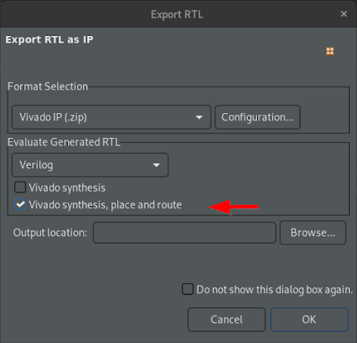
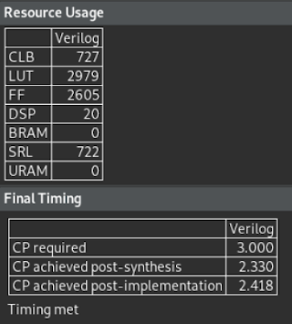


> **In this section...**   
We look at the export phase of the flow to packages the RTL either the Vivado or the Vitis flow.
In addition,  we run the Vivado tool directly from the Vitis HLS GUI to get more accurate timing and resource estimates.

<table width=100%>
 <tr width=50%>
    <td align="center"><h2>2020.2 Vitis™ - The Traveler Salesman Problem - Tutorial</h2>
    <a href="https://www.xilinx.com/products/design-tools/vitis.html">See Vitis™ Development Environment on xilinx.com</a>
    </td>
 </tr>
</table>

## Export the accelerated function and evaluate in Vivado

During the export phase of the flow, Vitis HLS packages the results into a form that can be consumed by either Vitis or Vivado.  

- Change the number of cities back to 13 in tsp.h
- Run C synthesis
- Export through the toolbar "play" pulldown menu or via the main menu: `Solution` -> `Export RTL`
- In the dialog, select `Vivado synthesis, place and route` as shown below:  

- Click OK and a few minutes later the flow completes and updates the main screen of Vitis HLS.
## Review the Vivado results

## Next Step

* [Code optimization with 4 parallel memory lookups](./code_opt.md)
