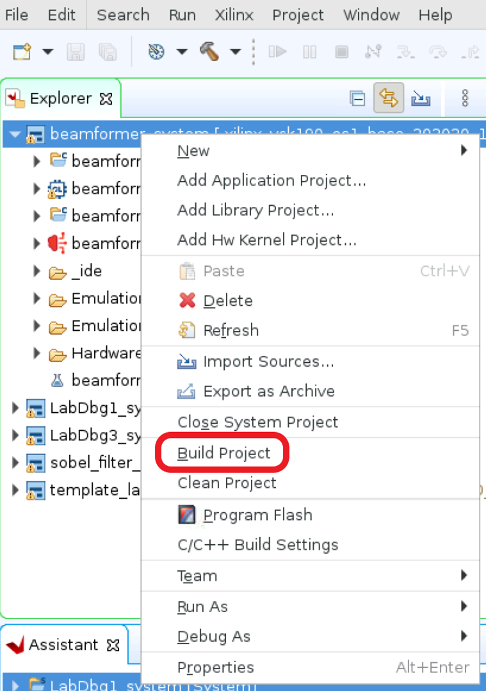
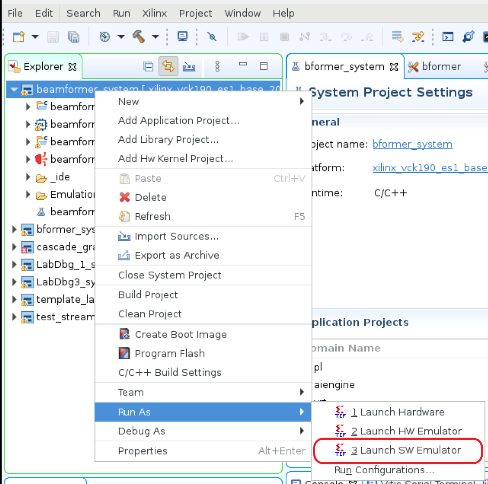
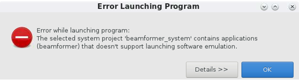
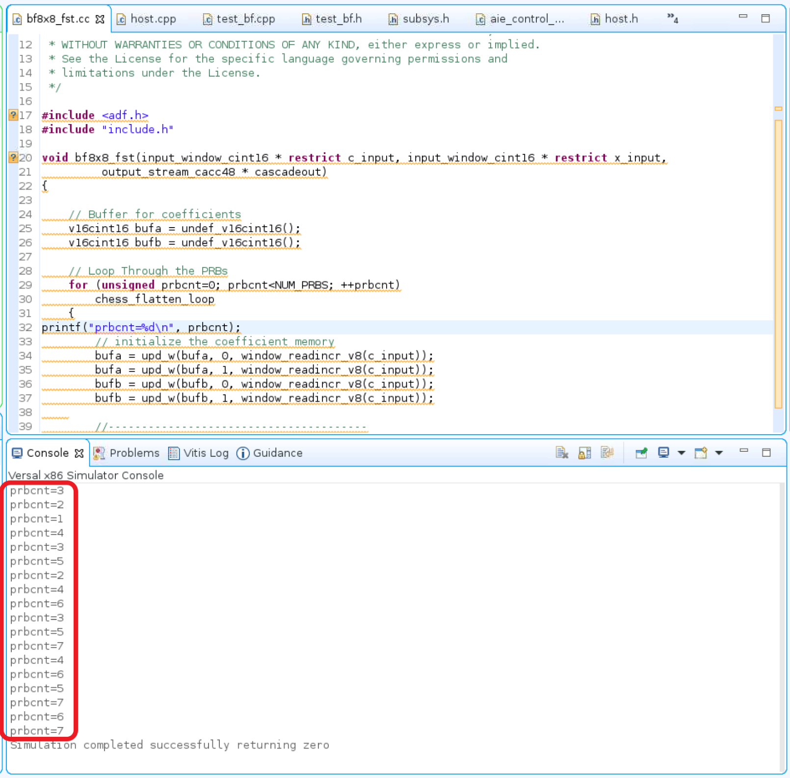

<table class="sphinxhide" width="100%">
 <tr width="100%">
    <td align="center"><h1>AI Engine Development</h1>
    <a href="https://www.xilinx.com/products/design-tools/vitis.html">See Vitis™ Development Environment on xilinx.com </a>
    <a href="https://www.xilinx.com/products/design-tools/vitis/vitis-ai.html">See Vitis-AI™ Development Environment on xilinx.com</a>
    </td>
 </tr>
</table>

# AI Engine Debug with Software Emulator

Software emulation supports fast emulation execution and `printf()` to help verify the kernel's functionalities. Users can check the output by examining design output files in the `${PROJECT}/Emulation-SW/data` directory.

Hardware constraints such as heap/stack sizes and program memory size are not verified in software emulator.

The following steps outline the procedure:

[1. Launch and Verify Software Emulation in Vitis IDE](#1-Launch-and-Verify-Software-Emulation-in-Vitis-IDE)

[2. Printf() support](#2-printf-support)

## 1. Launch and Verify Software Emulation in Vitis IDE

### Step 1.1. Select Software Emulation Configuration

### Step 1.2. Build with Software Emulator

### Step 1.3. Run with Software Emulator

Note: Launching the software emulator run from system project is not supported. This error from Vitis™ IDE is expected when the launch software emulator for system project option is selected.

### Step 1.4: Verify Run Result

Software emulator output files from design are located at `${PROJECT}/Emulation-SW/data`. Verify the output files `${PROJECT}/Emulation-SW/data/dlbf_out[0-7].txt` and `${PROJECT}/Emulation-SW/data/ulbf_out[0-3].txt` against golden files `${PROJECT}/data/dlbf_gold[0-7].txt` and `${PROJECT}/data/ulbf_gold[0-3].txt` to ensure that the design's I/O functionalities are correct. Vitis IDE supports `compare with` feature to compare two files, highlight two files to be compared then right click one of highlighted file and select `compare with` then `each other`.

For example, Compare `${PROJECT}/data/ulbf_gold3.txt` and `${PROJECT}/Emulation-SW/data/ulbf_out3.txt`

## 2. `printf` Support

The simplest form of tracing is to use a formatted `printf()` statement in the code for printing debug messages. Visual inspection of intermediate values and addresses can help you understand the progress of program execution. No additional include files are necessary for using `printf()` other than standard C/C++ includes (`stdio.h`). You can add `printf()` statements to your code to be processed during simulation, or hardware emulation, and remove them or comment them out for hardware builds.

### Step 2.1. Add `printf()` statement

Select `bf8x8_fst.cc` file in Vitis IDE to be edited. Add `printf("prbcnt=%d\n", prbcnt);` statement at line 32 of `bf8x8_fst.cc` file.
`bf8x8_fst.cc` can be found from Vitis IDE's explorer, browse to `beamformer` sub-project, click on `src` then `kernel` to expand the directory, and click on `bf8x8_fst.cc`. The file will be displayed at the center of the Vitis IDE.

### Step 2.2. Compile the Project

Highlight the beamformer sub-project, right-click to enable pull-down menu, and select **Build Project** to build the beamformer project.

### Step 2.3. Run the Project

Highlight the beamformer sub-project, right-click to enable pull-down menu, select **Run As**, and then **Launch SW Emulator** to run the project in Vitis IDE.

### Step 2.4. Expected Result

Expect to observe the output of `printf()` statement displayed at Vitis IDE console window.

Note: A predefined marco `defined(__PTHREAD_API__)` can be used to wrap around printf statements in software emulation to improve code portability.

## Limitations

1. System project run with software emulator is not supported.
2. Source code debug in software emulator is not supported hence **Launch SW Emulator** option from the "Debug As" pulldown menu is not available.
3. Hardware constraints check is not supported in software emulator. Functionalities verified in software emulator need to check resource constraints in AI Engine emulator before running on the hardware board.

# License

Licensed under the Apache License, Version 2.0 (the "License);
you may not use this file except in compliance with the License.
You may obtain a copy of the License at

    http://www.apache.org/licenses/LICENSE-2.0

Unless required by applicable law or agreed to in writing, software
distributed under the License is distributed on an "AS IS" BASIS,
WITHOUT WARRANTIES OR CONDITIONS OF ANY KIND, either express or implied.
See the License for the specific language governing permissions and
limitations under the License.

XD005 | &copy; Copyright 2021 Xilinx, Inc.

