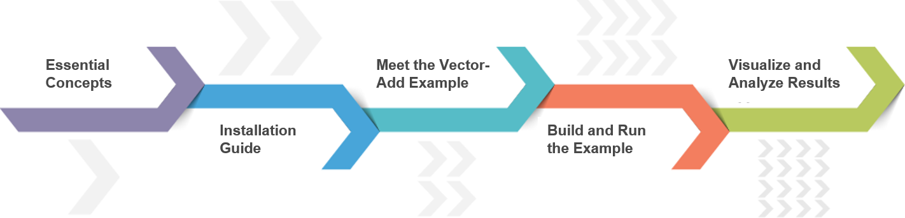

##############################################
Vitis Flow 101
##############################################

.. toctree::
   :maxdepth: 3
   :caption: Parts
   :hidden:

   Part 1 <./Part1>
   Part 2 <./Part2>
   Part 3 <./Part3>
   Part 4 <./Part4>
   Part 5 <./Part5>

An overview of the Vitis workflow including kernel development, host software creation, emulation, implementation, and analysis.

See how Vitis unifies software, acceleration, and ML development under a single development platform.

Vitis provides a unified flow for developing FPGA accelerated application targeted to either data-center or embedded platforms. This tutorial provides instructions for building and running on both ZCU102 and Alveo U200 cards. These instructions can be easily adapted to other Xilinx cards.

.. note::
   This tutorial requires Vitis 2020.2 or later to run.

.. list-table:: 
   :widths: 20 80
   :header-rows: 1
   
   * - Tutorial
     - Description
	 
   * - :doc:`Part 1 <./Part1>`
     - Covers all the essential concepts of the Vitis FPGA acceleration flow in under 10 minutes.

   * - :doc:`Part 2 <./Part2>`
     - Guides you through the process of installing the Vitis tools, platforms and runtime library.

   * - :doc:`Part 3 <./Part3>`
     - Explains the source code of vector-add example used in the rest of the tutorial.

   * - :doc:`Part 4 <./Part4>`
     - Describes the commands required to compile, link and run the example on your acceleration card.

   * - :doc:`Part 5 <./Part5>`
     - Gives an overview of Vitis Analyzer and shows how to open and analyze reports.

