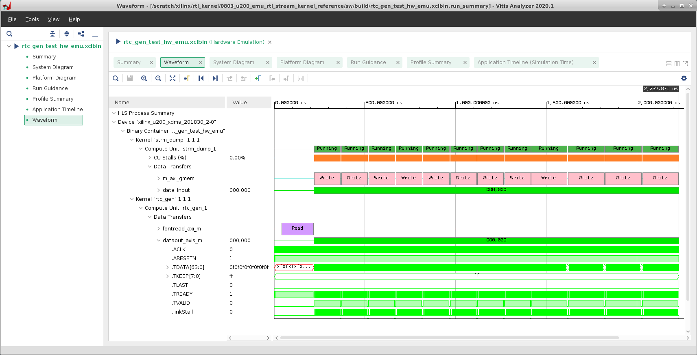

# Hardware Emulation

There are 3 types of builds and runs in Vitis, Software Emulation, Hardware Emulation and System Hardware. Since RTL kernels naturally don't support software emulation, this tutorial will only demonstrate hardware emulation flow. 

In addition to functional correctness, hardware emulation provides a cycle-accurate performance and detailed resource estimates , but the compile and execution times are longer than for software emulation, it is recommended to use small data sets for validation during hardware emulation to keep run times manageable. 

In mix-kernel design, hardware emulation has often been used to test system level integration and view the interaction between multiple kernels. 

## Waveform Report

Vitis can generate a waveform view when running hardware emulation, it displays in-depth details include data transfers between the kernel and global memory and data flow through inter-kernel pipes. 

To enable waveform data collection, make sure `-g` option was used during compilation, and associated switch is turned on at the *xrt.ini* file, which should be placed at the same directory as the host executable file. We already delivered a working *xrt.ini* with this tutorial, you can check it under *./sw/build/* directory. For more details, refer to [xrt.ini File ](https://www.xilinx.com/html_docs/xilinx2020_1/vitis_doc/obl1532064985142.html) from Vitis online documentation.

```
[Emulation]
debug_mode=batch
```

Let's take the Hardware Emulation result of *rtc_gen_test* on U200 card as an example, a run summary file will be automatically generated after emulation has been successfully executed, and it can be opened directly with *Vitis Analyzer*. Waveform is included at run summary report. 

```
vitis_analyzer rtc_gen_test_hw_emu.xclbin.run_summary
```

<div align="center">

</div>

You can also open the waveform database with the Vivado logic simulator `xsim`

```
xsim -gui xilinx_u200_xdma_201830_2-0-rtc_gen_test_hw_emu.wdb 
```

If you wish to have the simulation waveform opened during the hardware emulation run, change debug_mode to gui at *xrt.ini*

```
[Emulation]
debug_mode=gui
```

Besides waveform, other information delivered with run summary is also valuable for you to profile, optimize and debug your application, please check on [Profiling the Application](./profile_tutorial.md) of this tutorial for more details. If you want to understand more detailed information about hardware emulation flow, please refer to [Hardware Emulation](https://www.xilinx.com/html_docs/xilinx2020_1/vitis_doc/buildtargets1.html#ldh1504034328524) from Vitis online documentation.

<p class="sphinxhide" align="center"><sup>Copyright&copy; 2020-2021 Xilinx</sup></p>

