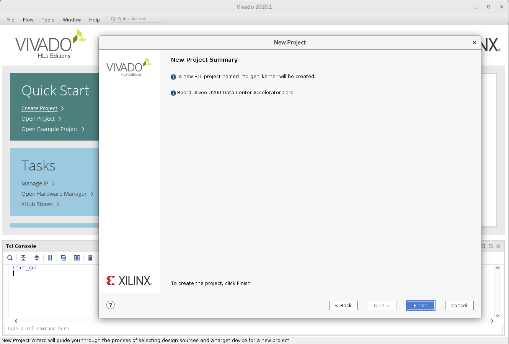
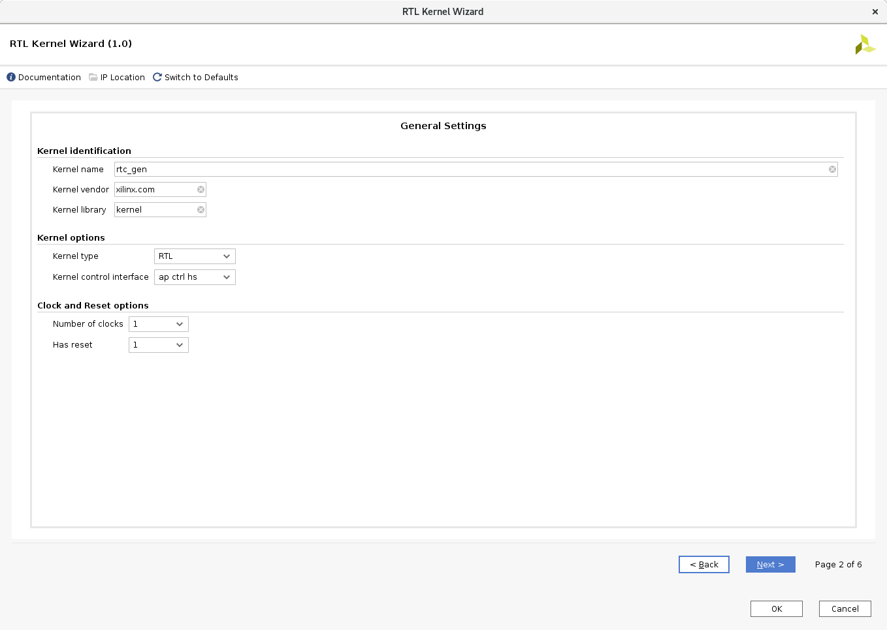
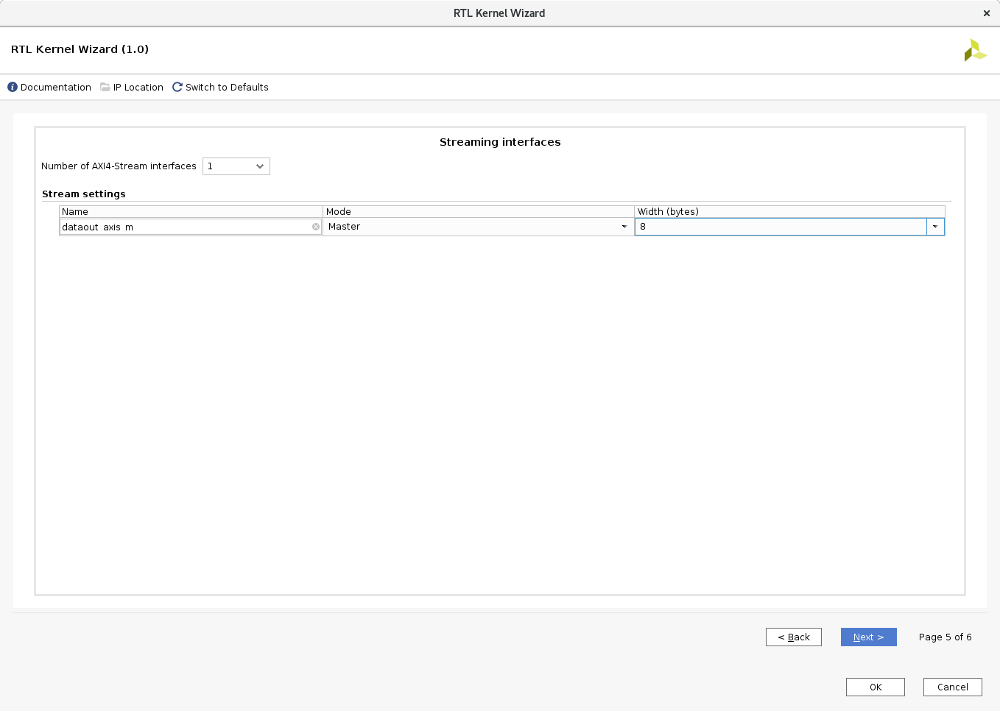
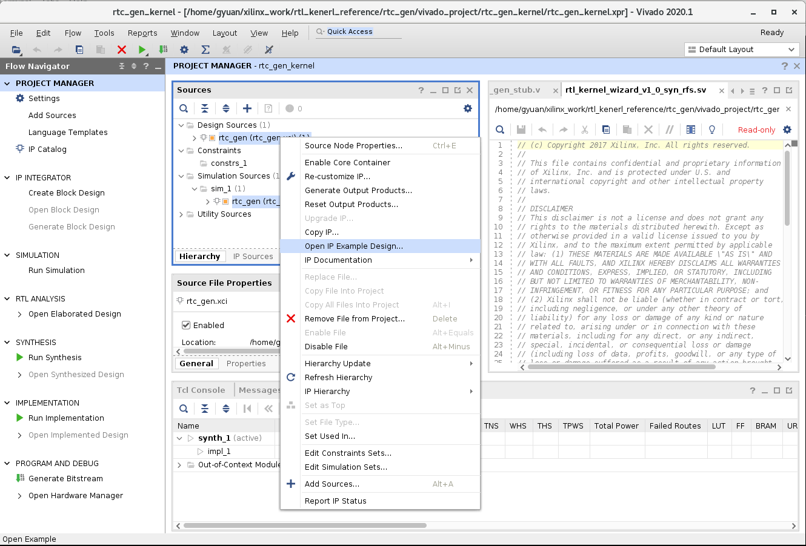
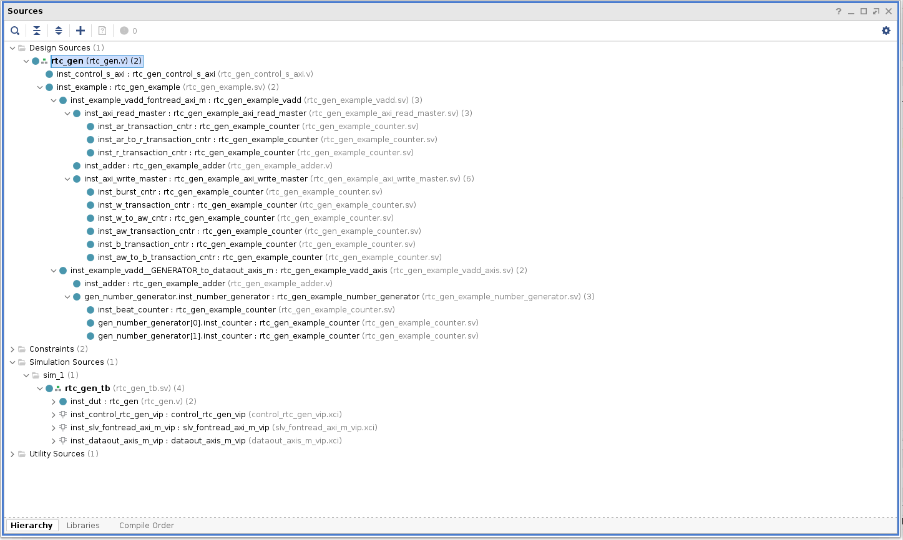
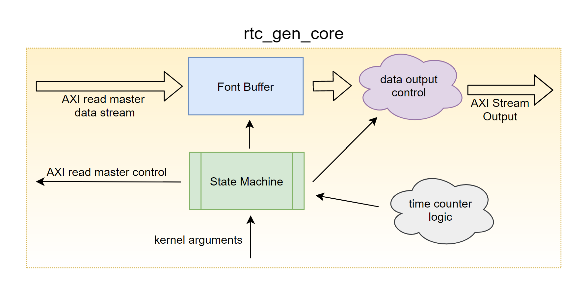
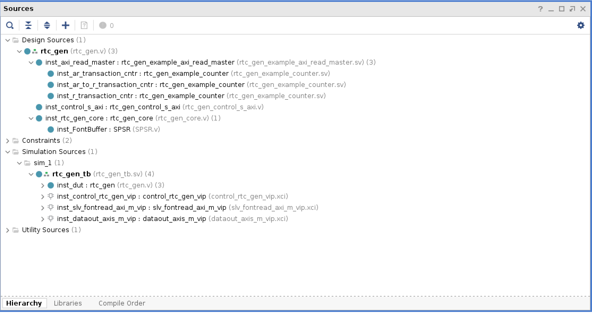
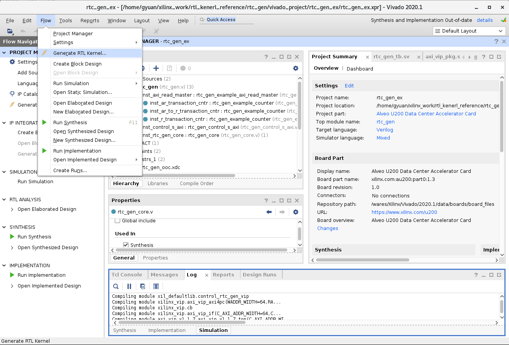

# RTC_GEN RTL Kernel Creation

It is very easy for the user to use Vitis/Vivado RTL Kernel Wizard to create and develop RTL based kernel which could be seamlessly integrated with other HLS C or Vitis Vision library based kernel with Vitis. This tutorial will show the detailed steps to create *rtc_gen* kernel. We use Alveo U200 as the target platform for the tutorial.

## Determine Top Level Design Specification

The *rtc_gen* kernel is required to read font library from global memory into on-chip SRAM, then output the clock image via AXI stream port. Considerting the font library reading is a one-time job, and no global memory bandwidth requirement exists during normal work, so we use 32-bit (data bus) AXI4 master interface for the font reading port to save resources. In the downstream processing pipeline, we will use *XF_NPP8* format (processing 8 pixels in each clock cycle), so we select the AXI stream width as 64-bit, which could transfer eight pixels in each AXI stream transaction. For control register, we will use an AXI slave interface compatible with XRT, so we could use the standard OpenCL API to program and control the kernel. 

Thus we generalize the top level design specification for *rtc_gen* kernel as below:

**Bus interfaces**

+ AXI-Lite slave interface for control
+ AXI-Lite master interface for font data loading, data width 32-bit, address width 64-bit
+ AXI stream master interface for clock digit image output, data width 64-bit

**Control Register**

|No.   | Arguments   | Width  | Description |
| ---- | ----        | ----   | ---- |
|0     | work_mode   | 1      |[0]: determine the kernel working mode   0 - load font from global memory to on-chip SRAM via AXI read master   1 - output RTC digit figure via AXI steam master |
|1     | cs_count    | 32     |[21:0]: Centi-second counter. For example, if the system clock is 200MHz, cs_count should be set to 2,000,000 |
|2     | time_format | 1      |[0]: determine whether centisecond is included in the output digit images   0 - disable centiseconds output   1 - enable centiseconds output |
|3     | time_set_val| 32     |Set time value for internal free-running clock:   [31:24] - hours   [23:16] - minutes   [15:8] - seconds   [7:0] - centi-seconds |
|4     | time_set_en | 1      |[0]: write 1 to this bit will load the time_set_value to internal free-running clock. |
|5     | time_val    | 32     |Read-only regsiter for internal real-time-clock time value:   [31:24] - hours   [23:16] - minutes   [15:8] - seconds   [7:0] - centi-seconds |
|6     | read_addr   | 64     |AXI master pointer, this is the FPGA device buffer address for font library |

 

## Use RTL Kernel Wizard to Create Kernel Frame

Now we use RTL Kernel Wizard to create the frame for *rtc_gen* kernel. We will launch the Wizard from Vivado. Please refer to [Vitis Application Acceleration Development Flow Documentation](https://www.xilinx.com/html_docs/xilinx2020_1/vitis_doc/devrtlkernel.html#qnk1504034323350) for detailed user guide of RTL kernel and RTL Kernel Wizard.

Please change to *./rtc_gen* directory of the git repo, create a directory named *vivado_project*, then enter this directory.

~~~
cd ./rtc_gen
mkdir vivado_project
cd ./vivado_project
vivado &
~~~

We create a new RTL project named *rtc_gen_kernel* in the just created *vivado_project* directory. During the part selection page, select **Alveo U200 Data Center Accelerator Card*.

 

When the project is created, in the Flow Navigator, click the IP catalog command, type RTL Kernel in the IP catalog search box, then double-click RTL Kernel Wizard to launch the wizard.

In the *General Settings* tab of the RTL Kernel Wizard, set the kernel name to **rtc_gen**, set the kernel vendor to **xilinx.com**, change the *has reset* option to value 1, refer to below snapshot.

 

In the *Scalars* tab, configure the kernel arguments as our design specification. Refer to the **Control Register** table and below snapshot. Please note **read_addr** register is not considered scalar argument as AXI master pointer, so we don't need to configure it in this tab. We are using **uint** as argument type here, though all these bit might not be used.

 

In the *Global Memory* tab, configure the AXI master interfaces parameters according to our design specification. Name the AXI master interface to **fontread_axi_m**, change the width to 4 bytes (32-bit), and set the relating argument name to **read_addr**. Refer to below snapshot.

 

In the *Streaming interfaces* tab, set the number of AXI4-Sttream interfaces to 1, name it to **dataout_axis_m**, set the mode the **Master**, and set the width to 8 bytes (64-bit). Refer to below snapshot.

 

Finally review the summary page of the wizard, and click *OK* button to generate the RTL kernel top level framework. 

 

For the next "Generate Output Products" pop-up window, just click *Skip* button close the window. Now you can see the *rtc_gen.xci* file in the *Design Sources* group of *Sources* view. Right click the *rtc_gen.xci* file, select *Open IP Example Design*.

 

In the *Open IP Example Design* pop-up window directly click *OK* button, then another project named *rtc_gen_ex* will be created in *./vivado_project* directory and open automatically in another Vivado session. We will use project *rtc_gen_ex* as the major working project to finish the *rtc_gen* kernel development.

 

In the *rtc_gen_ex* project, you can see a few automatically generated Verilog/SystemVerilog source code files:

~~~
rtc_gen_control_s_axi.v                 
rtc_gen_example_adder.v                
rtc_gen_example_axi_read_master.sv     
rtc_gen_example_axi_write_master.sv   
rtc_gen_example_counter.sv              
rtc_gen_example_number_generator.sv    
rtc_gen_example.sv 
rtc_gen_example_vadd_axis.sv
rtc_gen_example_vadd.sv
rtc_gen_tb.sv
rtc_gen.v
~~~

In the *Sources* view, *Hierarchy* tab, we can see the HDL file hierarchy. Now we have finished the kernel framework creation.

 

## RTC_GEN Kernel Development

We will use following generated RTL files in our *rtc_gen* kernel:
+ **rtc_gen_control_s_axi.v**

  It is the AXI Lite slave interface to upper level system and XRT. It includes all the kernel argument as well as the kernel control signals (ap_start, ap_done, ap_idle, ap_ready). We will modify this module a little to realize the read-only register *time_val*.

+ **rtc_gen_example_axi_read_master.sv**
  
  It is a simple AXI Lite read master which could be called by our kernel directly. It uses four control signals to trigger the master to finish data reading tasks: 
  + *ctrl_start*: single cycle pulse to start the master state machine
  + *ctrl_done*: single cycle pulse indicating the finish the AXI reading task
  + *ctrl_addr_offset*: base address for AXI reading operation. Kernel argument *read_addr* can be used to drive this signal
  + *ctrl_xfer_size_in_bytes*: number of byes to be read from AXI bus.
  
  The example master also use an AXI stream port for reading data transfer, which could be connected to FIFO like data pipeline easily.

+ **rtc_gen_example_counter.sv**
  
  The sub-module of the example AXI read master.

+ **rtc_gen.v**
  It is the example top level kernel wrapper instantiating all the submodule. We will modify this module to construct our *rtc_gen* kernel.

+ **rt_gen_tb.sv**
  It is an example testbench using Xilinx AXI Verification IP. We can modify this testbench to test our *rtc_gen* kernel.

In addition to these five files, we could also refer to *rtc_gen_example_vadd.sv* for the connection of AXI read master. For AXI stream port, it is simple and we don't need the example for reference. For *rtc_gen* kernel, a Verilog file *rtc_gen_core.v* is created to finish the core function of the kernel. The function diagram of *rtc_gen_core* is shown in following diagram.

 

To make the core source code directory clean, we put all the necessary generated, newly composed or modified RTL files in *~/rtc_gen/src* directory. Please review the directory for these source code files. Please note *SPSR.v* is a parameterized SRAM template which could be synthesized to FPGA BlockRAM.

~~~
./rtc_gen/src/rtc_gen_control_s_axi.v
./rtc_gen/src/rtc_gen_core.v
./rtc_gen/src/rtc_gen_example_axi_read_master.sv
./rtc_gen/src/rtc_gen_example_counter.sv
./rtc_gen/src/rtc_gen_tb.sv
./rtc_gen/src/rtc_gen.v
./rtc_gen/src/SPSR.v
~~~

Now we remove all the existing Verilog/SystemVerilog source codes (except for thos in *IP* group) from the *rtc_gen_ex* project in Vivado, then add the files in *./rtc_gen/src* to the project (*rtc_gen_tb.sv* for *Simulation-Only Sources*, other files for *Design Sources*). Thus you can see the design hierarchy as below snapshot, and we finish the coding for kernel *rtc_gen*.

 

Now you can simulation the design and go through normal RTL design flow with standard Vivado design methodology. A text format font library file *font_sim_data.txt* in *./rtc_gen* directory is provided, which could be read in by testbench *rtc_gen_tb.sv* for simulation. Please copy it to *./rtc_gen/vivado_project/rtc_gen_ex/rtc_gen_ex.sim/sim_1/behav/xsim/* for simulation runs.

## Package the RTL Kernel

After you confirm the design is OK, select *Generate RTL Kernel* from *Flow* Menu, then select *Sources-only kernel* in the pop-up window, click *OK* button to finish the *rtc_gen* RTL kernel creation.

 

The generated kernel file is *./rtc_gen/vivado_project/rtc_gen_ex/rtc_gen.xo*, which can be used in downstream Vitis intergartion flow. From the Vivado *Tcl Console* view, you can see the Vivado actually use following command line to finish the kernel packaging:

~~~
package_xo  -xo_path ./rtc_gen/vivado_project/rtc_gen_ex/exports/rtc_gen.xo \
            -kernel_name rtc_gen \
            -ip_directory ./rtc_gen/vivado_project/rtc_gen_ex/rtc_gen \
            -kernel_xml ./rtc_gen/vivado_project/rtc_gen_ex/imports/kernel.xml
~~~

*./rtc_gen/vivado_project/rtc_gen_ex/rtc_gen* is the folder for *rtc_gen* IP, and *./rtc_gen/vivado_project/rtc_gen_ex/imports/kernel.xml* is the kernel description file. So we could copy out these items to standlone directory and just use the command line above to package the kernel. This is also where the *./hw/rtc_gen_ip* directory and *./hw/rtc_gen_kernel.xml* file come from.

Copyright&copy; 2020 Xilinx

