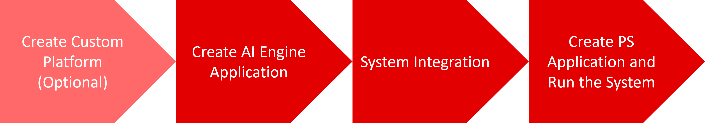

<table class="sphinxhide" width="100%">
 <tr width="100%">
    <td align="center"><h1>AI Engine Development</h1>
    <a href="https://www.xilinx.com/products/design-tools/vitis.html">See Vitis™ Development Environment on xilinx.com </a>
    <a href="https://www.xilinx.com/products/design-tools/vitis/vitis-ai.html">See Vitis™ AI Development Environment on xilinx.com</a>
    </td>
 </tr>
</table>

# A to Z Bare-metal Flow

***Version: Vitis 2022.1***

This tutorial introduces a complete end-to-end flow for a bare-metal host application using AI Engines and PL kernels.
The tutorial is based on the 2022.1 Vitis™ unified software platform.

>**Note**: This tutorial has been written for multiple versions of the tools. Each version available can be found in the specific github branch. The recommendation is to use the latest version available.

The flow is broken into four different steps shown in the following diagram.

<a href="./01-custom_base_platform_creation.md">Start with Custom Platform Creation (optional)</a></b>

<a href="./02-aie_application_creation.md">Start with AI Engine development using base platform</a></b>

Licensed under the Apache License, Version 2.0 (the "License");
you may not use this file except in compliance with the License.
You may obtain a copy of the License at

    http://www.apache.org/licenses/LICENSE-2.0

Unless required by applicable law or agreed to in writing, software
distributed under the License is distributed on an "AS IS" BASIS,
WITHOUT WARRANTIES OR CONDITIONS OF ANY KIND, either express or implied.
See the License for the specific language governing permissions and
limitations under the License.

Copyright&copy; 2020–2021 Xilinx XD018 

