<table class="sphinxhide" width="100%">
 <tr width="100%">
    <td align="center"><h1>AI Engine Development</h1>
    <a href="https://www.xilinx.com/products/design-tools/vitis.html">See Vitis™ Development Environment on xilinx.com</br></a>
    <a href="https://www.xilinx.com/products/design-tools/vitis/vitis-ai.html">See Vitis™ AI Development Environment on xilinx.com</a>
    </td>
 </tr>
</table>

# Versal Integration for Hardware Emulation and Hardware

***Version: Vitis 2022.1***

## Introduction

Versal® adaptive compute acceleration platforms (ACAPs) combine Scalar Engines, Adaptable Engines, and Intelligent Engines with leading-edge memory and interfacing technologies to deliver powerful heterogeneous acceleration for any application.

This tutorial demonstrates creating a system design running on the AI Engine, PS, and Programmable logic. The AI Engine domain contains a simple graph consisting of 3 kernels. These kernels are connected by both windows and streams. The PL domain contains data movers that provide input and capture output from the AI Engine. The PS domain contains a host application that controls the entire system. You'll validate the design running on these heterogeneous domains by first emulating the hardware and then running on actual hardware.

This tutorial steps through software emulation, hardware emulation and hardware flow in the context of a complete Versal ACAP system integration. By default, the Makefile is set for `sw_emu`. If you need to build for `hw_emu`,`hw`, use the corresponding TARGET option as instructed in corresponding sections.

**IMPORTANT**: Before beginning the tutorial make sure you have read and followed the *Vitis Software Platform Release Notes* (v2022.1) for setting up software and installing the VCK190 base platform.

Before starting this tutorial run the following steps:

1. Set up your platform by running the `xilinx-versal-common-v2022.1/environment-setup-cortexa72-cortexa53-xilinx-linux` script as provided in the platform download. This script sets up the `SDKTARGETSYSROOT` and `CXX` variables. If the script is not present, you **must** run the `xilinx-versal-common-v2022.1/sdk.sh`.
2. Set up your `ROOTFS`, and `IMAGE` to point to the `xilinx-versal-common-v2022.1` directory.
3. Set up your `PLATFORM_REPO_PATHS` environment variable based upon where you downloaded the platform.

This tutorial targets VCK190 production board for 2022.1 version. 

## Objectives

After completing this tutorial, you should be able to:

* Compile HLS functions for integration in the Programmable Logic (PL).
* Compile ADF graphs.
* Explore Vitis&trade; Analyzer for viewing the compilation and simulation summary reports.
* Create a configuration file that describes system connections and use it during the link stage.
* Create a software application that runs Linux.
* Package the design to run on software emulation, hardware emulation and an easy-to-boot SD card image to run on hardware.

## Tutorial Overview

**Section 1**: Compile AI Engine code using the AI Engine compiler for `x86simulator`, viewing compilation results in Vitis&trade; Analyzer.

**Section 2**: Simulate the AI Engine graph using the `x86simulator`.

**Section 3**: Run software emulation using QEMU & x86 process.

**Section 4**: Compile AI Engine code for `aiesimulator`, viewing compilation results in Vitis&trade; Analyzer.

**Section 5**: Simulate the AI Engine graph using the `aiesimulator` and viewing trace, and profile results in Vitis Analyzer.

**Section 6**: Run the hardware emulation, and view run summary in Vitis Analyzer.

**Section 7**: Run on hardware.

The design that will be used is shown in the following figure:


|Kernel|Type|Comment|
|  ---  |  ---  |  ---  |
|MM2S|HLS|Memory Map to Stream HLS kernel to feed input data from DDR to AI Engine interpolator kernel via the PL DMA.|
|Interpolator |AI Engine| Half-band 2x up-sampling FIR filter with 16 coefficients. Its input and output are cint16 window interfaces and the input interface has a 16 sample margin. |
|Polar_clip|AI Engine| Determines the magnitude of the complex input vector and clips the output magnitude if it is greater than a threshold. The polar_clip has a single input stream of complex 16-bit samples, and a single output stream whose underlying samples are also complex 16-bit elements.|
|Classifier |AI Engine| This kernel determines the quadrant of the complex input vector and outputs a single real value depending which quadrant. The input interface is a cint16 stream and the output is a int32 window.  |
|S2MM|HLS|Stream to Memory Map HLS kernel to feed output result data from AI Engine classifier kernel to DDR via the PL DMA.|

## Section 1: Compile AI Engine code using the AI Engine compiler for `x86simulator`, viewing compilation results in Vitis Analyzer.
In the early stages of the development cycle, it is critical to verify the design behavior functionally which identifies the errors. The x86 simulator is an ideal choice for testing, debugging because of the speed of iteration and the high level of data visibility it provides the developer. The x86 simulator is running exclusively on the tool development machine. This means, its performance and memory use are defined by the development machine.

This tutorial design has 3 AI Engine kernels (interpolator, polar_clip and classifier) and two HLS PL kernels (`s2mm` and `mm2s`).

#### Compiling an AI Engine ADF Graph for V++ Flow
An ADF Graph can be connected to an extensible Vitis&trade; platform. That is, the graph I/Os can be connected either to platform ports or to ports on Vitis kernels through the `v++` connectivity directives.

* An AI Engine ADF C++ graph contains AI Engine kernels only.
* All interconnections between AI Engine kernels are defined in the C++ graph (`graph.h`).
* All interconnections to external I/Os are fully specified in the C++ simulation testbench (`graph.cpp`) that instantiates the C++ ADF graph object. All platform connections from the graph to the "PLIO" map onto ports on the AI Engine subsystem graph that are connected via v++ connectivity directives.
* No dangling ports or implicit "connections" are allowed by `v++`.
* Stream connections are specified through the `v++ --sc` option, including employment of PL-based data movers, either in the platform or defined outside the ADF graph as Vitis PL kernels.

To compile the graph for x86 simulator, the target to be used is x86sim, use:

```bash
make compile
```
Or

```bash
aiecompiler --target=x86sim -include="$XILINX_VITIS/aietools/include" -include="./aie" -include="./data" -include="./aie/kernels" -include="./" -workdir=./Work aie/graph.cpp
```

| Flag | Description |
| ---- | ----------- |
| --target | Target how the compiler will build the graph and it is set to `x86sim`.  Default is `hw` |
| --include | All the include files needed to build the graph. |
| --workdir | The location where the work directory will be created. |

The generated output from `aiecompiler` is the `Work` directory, and the `libadf.a` file. This file contains the compiled AI Engine configuration, graph, and Kernel `.elf` files.

#### Vitis Analyzer Compile Summary
Vitis&trade; Analyzer is used to view the AI Engine compilation results. Below is the `graph.aiecompile_summary` file generated by the `aiecompiler`, which is located in the `Work` directory.

The **Summary** view displays compilation runtime,  version of the compiler used, the platform targeted, kernels created, and the exact command-line used for the compilation.

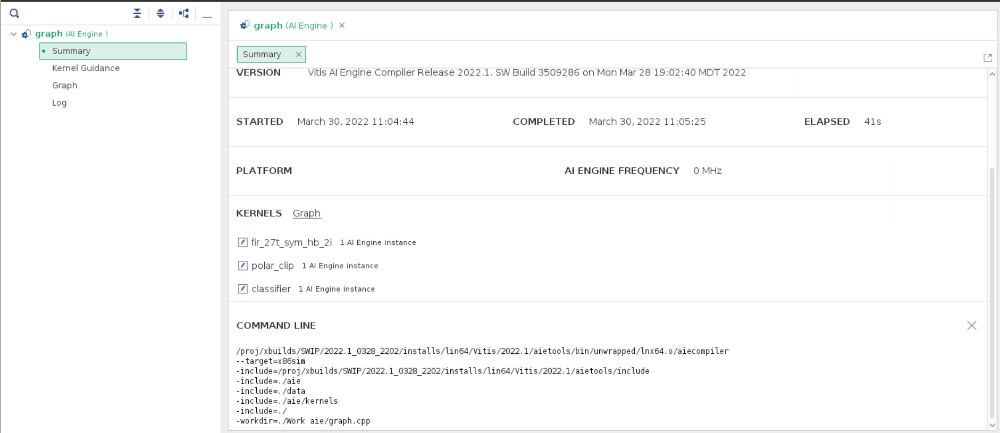

The **Graph** view gives an overview of your graph and how the graph is designed in a logical fashion.

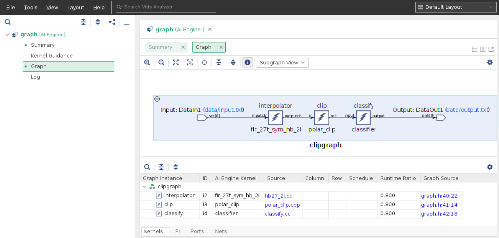

Clicking on any kernel in the logical diagram, highlights the corresponding kernel source in the graph instance column. You can cross-probe to the source code by clicking on the file.

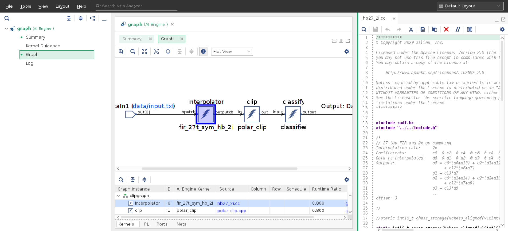

You can click on the **Log** to view the compilation log for your graph.

## Section-2: Simulate the AI Engine graph using the `x86simulator`
After the graph has been compiled, you can simulate your design with the `x86simulator` command. The x86 simulator is an ideal choice for testing, debugging, and verifying this kind of behavior because of the speed of iteration and the high level of data visibility it provides the developer. The x86 simulation does not provide timing, resource, or performance information.


1. To run simulation you can run the command:

	```bash
	make sim
	```

	Or

	```bash
	x86simulator --pkg-dir=./Work
	```

	| Flag | Description |
	| ---- | ----------- |
	| --pkg-dir | The ***Work*** directory. |

2. When the simulation is completed, navigate to the `x86simulator_output` directory from a terminal and run: `cd x86simulator_output; ls`

   You should see something similar to this:

	```bash
	  data/  x86sim.aierun_summary  x86simulator.log
	```

As you can see a variety of files, the `data` directory is generated here with the output file(s) you have in the `graph.cpp` for the PLIO objects and the `x86sim.aierun_summary` is generated, which contains all the information generated by `x86simulator`.

#### Vitis Analyzer
You can then open up the generated `x86sim.aierun_summary` from the `x86simulator_output` directory for Vitis&trade; Analyzer.

3. To do this you run the command:

	```bash
	vitis_analyzer x86simulator_output/x86sim.aierun_summary
	```
This opens the summary view in Vitis Analyzer that displays the simualtion run time and the exact command-line used for simulation.

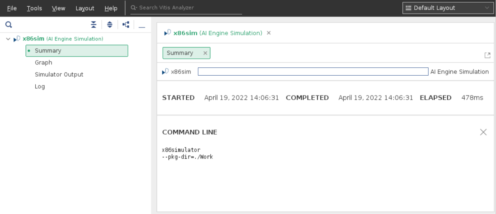

**Note:** As the x86 simulation runs the design at functional level, kernels do not physically map and route on AI engine array. Hence, an Array view is not available in aierun summary.

## Section 3: Compile and Run software emulation.

### 1. Compiling HLS Kernels Using v++

To compile the `mm2s`, and `s2mm` PL HLS kernels, use the `v++` compiler command - which takes in an HLS kernel source and produces an `.xo` file.

To compile the kernels, run the following command:

```bash
make kernels
```
Or
```bash
v++ -c -t sw_emu --platform $PLATFORM_REPO_PATHS/xilinx_vck190_base_202210_1/xilinx_vck190_base_202210_1.xpfm --save-temps -k s2mm pl_kernels/s2mm.cpp -o s2mm.xo
v++ -c -t sw_emu --platform $PLATFORM_REPO_PATHS/xilinx_vck190_base_202210_1/xilinx_vck190_base_202210_1.xpfm --save-temps -k mm2s pl_kernels/mm2s.cpp -o mm2s.xo
```

Looking at the `v++` command line, you will see several options. The following table describes each option:

|Switch/flag|Description|
|  ---  |  ---  |
|`-c`|Tells v++ to just compile the kernel.|
|`-t`|Specifies the compilation target for software emulation.|
|`--platform/-f`|Specifies the path to an extensible platform.|
|`-k`|The kernel name. This has to match the function name in the corresponding file defining the kernel. (E.g., For kernel `mm2s` the function name needs to be `mm2s.cpp`.|
|`-o`|The output file must always have the suffix of `.xo`.|
|`--save-temps/-s`|Saves the generated output process in the `_x` directory.|

### 2. Use V++ to Link AI Engine, HLS Kernels with the Platform
After the AI Engine kernels, graph, PL kernel, and HLS kernels have been compiled, and simulated you can use `v++` to link them with the platform to generate an `.xsa`.

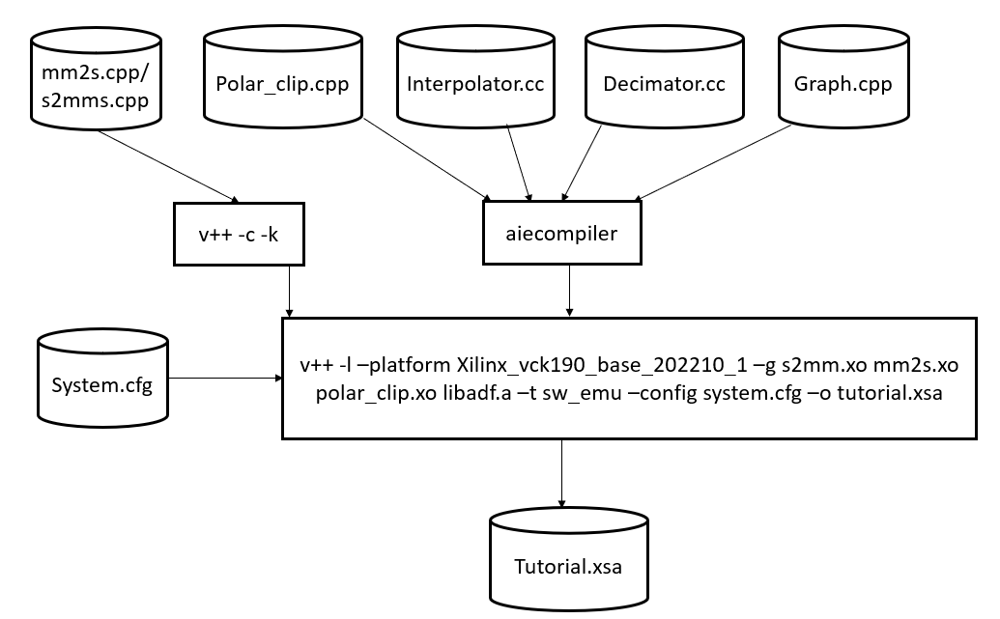

`v++` lets you integrate your AI Engine, HLS, and RTL kernels into an existing extensible platform. This step is where the platform chosen is provided by the hardware designer (or you can opt to use one of the many extensible base platforms provide by Xilinx&reg; and `v++` builds the hardware design for you in addition to integrating the AI Engine and PL kernels in the design.

You have a number of kernels at your disposal, but you need to tell the linker how you want to connect them together (from the AI Engine array to PL and vice versa). These connections are described in a configuration file: `system.cfg` in this tutorial shown below.

```ini
[connectivity]
nk=mm2s:1:mm2s
nk=s2mm:1:s2mm
sc=mm2s.s:ai_engine_0.DataIn1
sc=ai_engine_0.DataOut1:s2mm.s
```

| Option/Flag | Description |
| --- | --- |
| `nk` | This specifies number of instantiations of the kernel. For example, `nk=mm2s:1:mm2s` means that the kernel `mm2s` will instantiate one kernel with the name `mm2s`.|
| `stream_connect/sc` | This specifies the streaming connections to be made between PL/AI Engine or PL/PL. In this case, it should always be an output of a kernel to the input of a kernel.|

**NOTE:** The `v++` command-line can get cluttered, and using the `system.cfg` file can help contain it.

For `ai_engine_0` the names are provided in the `graph.h`. For the design, as an example, this line `in = adf::input_plio::create("DataIn1", adf::plio_32_bits,"data/input.txt");` has the name **DataIn1** which is the interface name.

You can see the `v++` switches in more detail in the [Vitis Unified Software Platform Documentation](https://www.xilinx.com/support/documentation/sw_manuals/xilinx2021.2/ug1393-vitis-application-acceleration.pdf).

To build the design run the follow command:

```bash
make xsa
```
or
```bash
v++ -l --platform -t sw_emu $PLATFORM_REPO_PATHS/xilinx_vck190_base_202210_1/xilinx_vck190_base_202210_1.xpfm s2mm.xo mm2s.xo libadf.a --save-temps -g --config system.cfg -o tutorial.xsa
```

| Flag/Switch | Description |
| --- | --- |
| `--link`/`-l` | Tells v++ that it will be linking a design, so only the `*.xo` and `libadf.a` files are valid inputs. |
| `--target`/`-t `| Tells v++ to build to software emulation (which will build the emulation models) |
| `--platform` |  Same as the previous two steps. |
| `--config` | This allows you to simplify the v++ command-line if it gets too unruly and have items in an `.ini` style file. |

Now you have a generated `.xsa` that will be used to execute your design on the platform.

### 3. Compile the A72 Host Application
After all the new AI Engine outputs are created, you can compile your host application by following the typical cross-compilation flow for the Cortex-A72. As you might notice, the host code uses [XRT](http://www.github.com/Xilinx/XRT) (Xilinx Run Time) as an API to talk to the AI Engine and PL kernels. Notice that in the linker, it is using the libraries: `-ladf_api_xrt -lxrt_coreutil`.

1. Open `sw/host.cpp` and familiarize yourself with the contents. Pay close attention to API calls and the comments provided.

   **Note:** [XRT](https://xilinx.github.io/XRT/2021.2/html/index.html) is used in the host application. This API layer is used to communicate with the programmable logic, specifically the PLIO kernels for reading and writing data. To understand how to use this API in an AI Engine application refer to ["Programming the PS Host Application"](https://www.xilinx.com/html_docs/xilinx2021.2/vitis_doc/program_ps_host_application.html).

2. Open the `Makefile`, and familiarize yourself with the contents. Take note of the `GCC_FLAGS`, `GCC_INCLUDES`.
   - `GCC_FLAGS`: Self-explanatory that you will be compiling this code with C++ 14. More explanation will be provided in the packaging step.
   - `GCC_INCLUDES`: Contains the list of all the necessary include files from the SDKTARGETSYSROOT as well as the AI Engine tools.
3. Close the Makefile, and run the command:

	```bash
	make host
	```

	Or

	```bash
	cd ./sw
	aarch64-xilinx-linux-g++ -Wall -c -std=c++14 -D__SYNCBO_ENABLE__ -D__PS_ENABLE_AIE__ -Wno-int-to-pointer-cast --sysroot=$SDKTARGETSYSROOT -	   I$SDKTARGETSYSROOT/usr/include/xrt -I$SDKTARGETSYSROOT/usr/include -I./ -I../aie -I$XILINX_VITIS/aietools/include -I$XILINX_VITIS/include -o aie_control_xrt.o ../Work/ps/c_rts/aie_control_xrt.cpp
	
	aarch64-xilinx-linux-g++ -Wall -c -std=c++14 -D__SYNCBO_ENABLE__ -D__PS_ENABLE_AIE__ -Wno-int-to-pointer-cast --sysroot=$SDKTARGETSYSROOT -I$SDKTARGETSYSROOT/usr/include/xrt -I$SDKTARGETSYSROOT/usr/include -I./ -I../aie -I$XILINX_VITIS/aietools/include -I$XILINX_VITIS/include -o host.o host.cpp
	
	aarch64-xilinx-linux-g++ host.o aie_control_xrt.o -ladf_api_xrt -lxrt_coreutil -L$SDKTARGETSYSROOT/usr/lib --sysroot=$SDKTARGETSYSROOT -L$XILINX_VITIS/aietools/lib/aarch64.o -o host.exe

	cd ..
	```

The follow table describes some of the GCC options being used:

| Flag | Description |
| ---- | ----------- |
| `-Wall` | Print out all warnings. |
| `-Wno-int-to-pointer-cast` | Warn about an integer to pointer cast. |
| `--sysroot` | Tells the compiler where to find the headers/libs for cross-compile. |
| `-std=c++14` | This is required for Linux applications using XRT. |


### 4. Package the Design
With all the AI Engine outputs and the new platform created, you can now generate the packaged SD card directory contains everything to boot Linux and have your generated application and `.xclbin`.

To package the design, run the following command:

```bash
make package
```
Or

```bash
	
cd ./sw
v++ -p -t sw_emu  \
	-f $PLATFORM_REPO_PATHS/xilinx_vck190_base_202210_1/xilinx_vck190_base_202210_1.xpfm \
	--package.rootfs=$PLATFORM_REPO_PATHS/sw/versal/xilinx-versal-common-v2022.1/rootfs.ext4 \
	--package.image_format=ext4 \
	--package.boot_mode=sd \
	--package.kernel_image=$PLATFORM_REPO_PATHS/sw/versal/xilinx-versal-common-v2022.1/Image \
	--package.defer_aie_run \
	--package.sd_file embedded_exec.sh \
	--package.sd_file host.exe ../tutorial.xsa ../libadf.a
cd ..
```

**NOTE:** By default the `--package` flow will create a `a.xclbin` automatically if the `-o` switch is not set.

The following table describes the packager options:

| Switch/flag | Description |
| --- | --- |
| `rootfs` | Points to the formatted image of the platform. |
| `image_format` | Tells packager what the image format is. |
| `boot_mode` | Signifies how the design is going to be run. |
| `kernel_image` | Points to the Image file created by Petalinux. |
| `defer_aie_run` | Tells packager at boot to not start the AI Engine and let the host application control it. |
| `sd_file` | Tell the packager what file is to be packaged in the `sd_card` directory. You'll have to specify this multiple times for all the files you want packaged. |

### 5. Run Software Emulation
After packaging, everything is set to run emulation. Software emulation is the first step to building and testing the system in a functional process. The software emulation can run the PS application as an ARM process by booting petalinux on QEMU machine or as an x86 process. 

#### Run PS application as an ARM process (QEMU)
a. To run emulation use the following command:

```bash
make run_emu 
```
Or

```bash
cd ./sw
./launch_sw_emu.sh 
```

When launched, use the Linux prompt presented to run the design.  Note that the emulation process is slow, so do not touch the keyboard of your terminal or you might stop the emulation of the Versal booth (as it happens in the real HW board)

b. Execute the following command when the emulated Linux prompt finally appears:

```bash
cd /run/media/*1
export XILINX_XRT=/usr
export XCL_EMULATION_MODE=sw_emu
```

This will set up the design to run emulation.

c. Run the design using the following command:

```bash
./host.exe a.xclbin
```

d. You should see an output displaying **TEST PASSED**. When this is shown, run the keyboard command: `Ctrl+A`, immediately followed by `x` to end the QEMU instance.

**Note:** The next step 'Run PS applicaion on x86' is a process to run software emulation on x86. The main advantage of running PS application on x86 is that it does not require to boot-up linux and hence the software emulation runs very faster when compared with running on QEMU emulator. You can either choose to follow these steps or jump directly to **Section 4** and run Hardware Emulation and Hardware steps.  

#### Run PS application on x86 process
This step demonstrates how softwre emulation can run the PS application on x86 process instead of ARM process for an AIE Design. Software emulation is an abstract model and does not use any of the petalinux drivers like Zynq OpenCL (ZOCL), interrupt controller or Device Tree Binary (DTB). Hence, the overhead of creating sd_card.img, booting petalinux on full QEMU machine is too heavy weight for software emulation and can be avoided.

There are no changes required in the AIE graph compilation for x86sim target, V++ compile and link steps. For the rest of the stages like, host compilation, package and launch emulation, follow these steps.


a. Remove the host compilation outputs(.o) and executable(host.exe) generated during **Run PS application on ARM process (QEMU)** step.

```bash
cd ..
make clean_for_x86
```
**Note:** XRT needs to be installed on the host and $XILINX_XRT variable should be set by sourcing the `/opt/xilinx/xrt/setup.sh`.

b. Unset CXX variable that points to `aarch64-linux-gnu-g++` compiler. Run the following command to set g++ for x86 process.

```bash
setenv CXX g++
```
c. Use the tutorial's Makefile.sw_x86 that configures the right GCC_FLAGS, GCC_LIB, GCC_INCLUDE options and `package` commands that corresponds to running PS application on x86 process.

```bash
cp -rf Makefile.sw_x86 Makefile
```
d. Open the Makefile and observe the linking option `-ladf_api_xrt_swemu` in GCC_LIB which is used for x86 process. Compile the host application by running the following command

```bash
make host
```
or

```bash
cd ./sw
 
g++ -Wall -c -std=c++14 -D__SYNCBO_ENABLE__ -D__PS_ENABLE_AIE__ -Wno-int-to-pointer-cast -I$XILINX_XRT/include -I./ -I../aie -I$XILINX_VITIS/aietools/include  -o aie_control_xrt.o ../Work/ps/c_rts/aie_control_xrt.cpp
 
g++ -Wall -c -std=c++14 -D__SYNCBO_ENABLE__ -D__PS_ENABLE_AIE__ -Wno-int-to-pointer-cast -I$XILINX_XRT/include -I./ -I../aie -I$XILNX_VITIS/aietools/include  -o host.o host.cpp
 
g++ *.o -ladf_api_xrt_swemu -lxrt_coreutil -L$XILINX_VITIS/aietools/lib/lnx64.o -L$XILINX_XRT/lib -o ./host_ps_on_x86

```
e. This step packages the design. In addition to package, the `emconfigutil` command is used to generate the device, board and device tree details(emconfig.json) and those details are required by XRT before loading the xclbin.	

```bash
make package
```
or
```bash
emconfigutil --platform $PLATFORM_REPO_PATHS/xilinx_vck190_base_202210_1/xilinx_vck190_base_202210_1.xpfm --nd 1
```
followed by,

```bash
cd ./sw
v++ -p -t sw_emu \
    --package.defer_aie_run \
    --platform $PLATFORM_REPO_PATHS/xilinx_vck190_base_202210_1/xilinx_vck190_base_202210_1.xpfm \
    --package.sd_dir $PLATFORM_REPO_PATHS/sw/versal/xrt \
    --package.out_dir ./package.sw_emu \
    --package.ps_on_x86 \
    --package.sd_file ./emconfig.json \
    ../tutorial.xsa ../libadf.a
```
f. To run the emulation use the following command 

```bash
cd ./sw
setenv XCL_EMULATION_MODE sw_emu
./host_ps_on_x86 a.xclbin 
```
**Note:** 
1) Observe the difference in launching the emulation process. we do not use any `launch_sw_emu.sh` script as like in QEMU emulator. Instead, the outputs of host compilation and package steps are used to launch the emulation.
2) You can also observe that, the start up time required to bootup the linux in QEMU process is more and the emulation process is slow. Unlike that, running PS application on x86 is faster.

## Section 4: Compile AI Engine code for AIE Simulator, viewing compilation results in Vitis&trade; Analyzer

**Important**

If you have exercised the steps to perform software emulation on x86 process, please make sure to follow below guidelines. If not, you can skip this step and proceed to compiling an AI Engine graph step directly.

1) Set back the `SYSROOT` and `CXX` variables as mentioned in the **Introduction**.
2) Clean the Working directory to remove all the files that are related to the software emulation by running the following command

```bash
make clean
```
3) Copy back the original Makefile to run hardware emulation and hardware using below command.

```bash
cp Makefile.org Makefile
```
### Compiling an AI Engine ADF Graph for V++ Flow

To compile the graph type to be used in either HW or HW_EMU, use:

```bash
make compile TARGET=hw
```
Or
```bash
aiecompiler --target=hw -include="$XILINX_VITIS/aietools/include" -include="./aie" -include="./data" -include="./aie/kernels" -include="./" --xlopt=0 -workdir=./Work aie/graph.cpp
```

The generated output from `aiecompiler` is the `Work` directory, and the `libadf.a` file. This file contains the compiled AI Engine configuration, graph, and Kernel `.elf` files.

#### Vitis Analyzer Compile Summary
Vitis&trade; Analyzer is used to view the AI Engine compilation results. It highlights the state of compilation, display the graph solution in both the **Graph** and **Array** views, provides guidance around the kernel code, and allow you to open various reports produced by `aiecompiler`. Below is the `graph.aiecompile_summary` file generated by the `aiecompiler`, which is located in the `Work` directory.

The **Summary View** displays compilation runtime,  version of the compiler used, the platform targeted, kernels created, and the exact command-line used for the compilation.

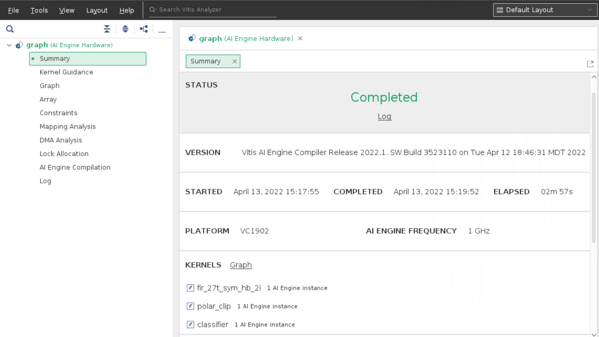

1. Click **Kernel Guidance**. This view provides a list of messages (INFO, Warning, Critical Warning) with various info to help with optimizing, or using best practices for kernel development. By default, ***INFO*** messages are hidden.

	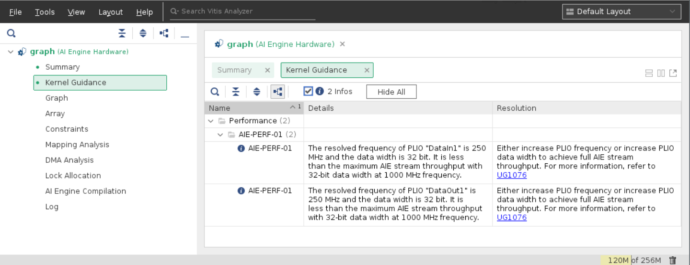

2. Click **Mapping Analysis**. This report provides detailed mapping information the `aiecompiler` generates for mapping the graph to the AI Engine.

	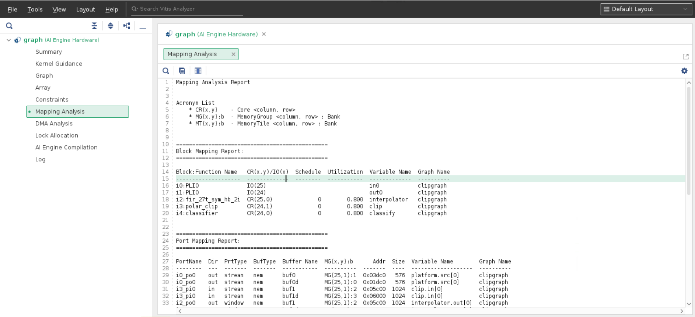

3. Click **DMA Analysis**. This is a text report showing a summary of the DMA accesses from the graph.

	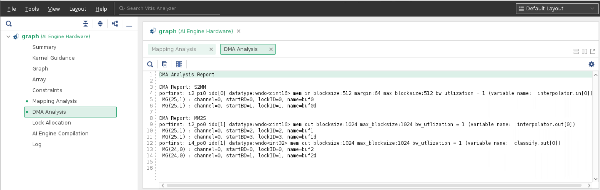

4. Click **Lock Allocation**. This shows the locks per buffer and where it is mapped in the ADF Graph.

	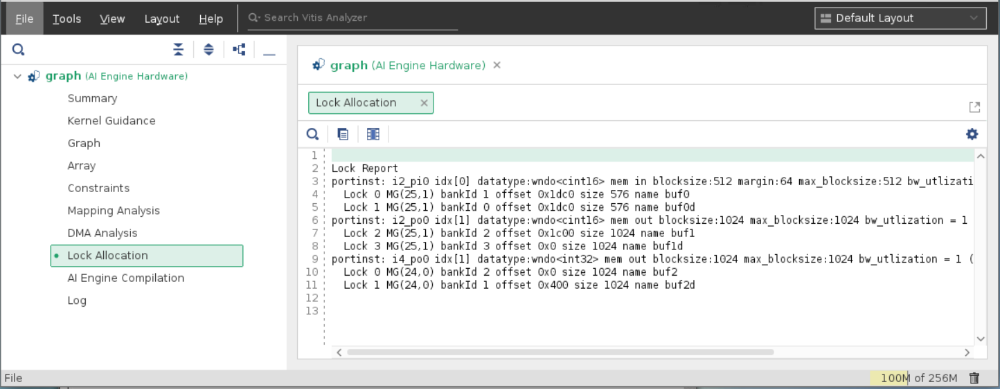

5. Click **Log**. This is the compilation log for your graph.

	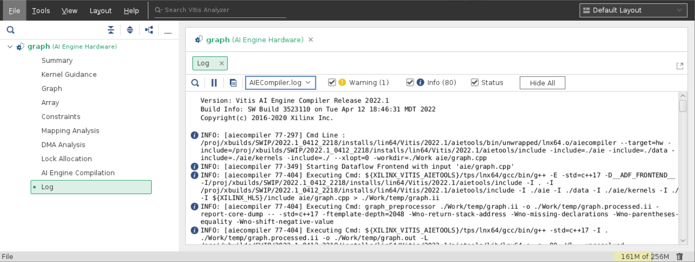

6. Click **AI Engine Compilation**. Shows the individual logs and command-line options for the individual Tile compilations. Below is an example of the kernel in ***Tile [24,0]***.

	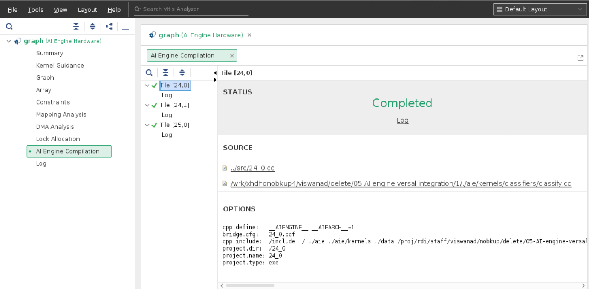
	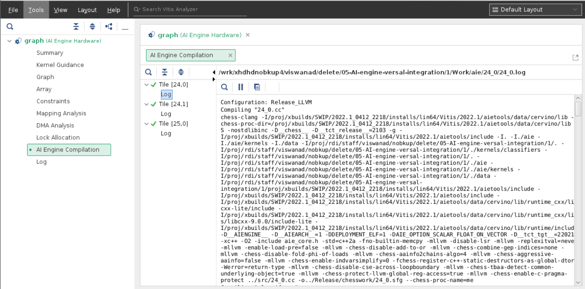

**Note**: The **Graph View** and **Array View** are presented in the next section.

## Section 5: Simulate the AI Engine graph using the `aiesimulator` and viewing trace, and profile results in Vitis Analyzer.

After the graph has been compiled, you can simulate your design with the `aiesimulator` command. This uses a cycle approximate model to test your graph and get preliminary throughput information early in the design cycle, while the PL developers continue to work on the platform for the application.

**Note**: Simulating the design with VCD will increase simulation runtime. To learn more about this feature you can read this section here: [AI Engine SystemC Simulator](https://www.xilinx.com/html_docs/xilinx2021.2/vitis_doc/simulate_graph_application.html#pmy1512608736116).

1. To run simulation you can run the command:

	```bash
	make sim TARGET=hw
	```

	Or

	```bash
	aiesimulator --profile --dump-vcd=tutorial --pkg-dir=./Work
	```

	| Flag | Description |
	| ---- | ----------- |
	| --profile | Profiles All the kernels, or select kernels (col,row)...(col,row).|
	| --dump-vcd | Grabs internal signals of tiles and dumps it in a VCD file. |
	| --pkg-dir | The ***Work*** directory. |

2. When simulation is completed navigate to the `aiesimulator_output` directory from a terminal by running: `cd aiesimulator_output; ls`

   You should see something similar to this:

	```bash
	aiesim_options.txt      profile_funct_24_0.xml  profile_funct_25_0.xml  profile_instr_24_0.xml  profile_instr_25_0.xml
	data                    profile_funct_24_1.txt  profile_funct_25_1.txt  profile_instr_24_1.txt  profile_instr_25_1.txt  
	default.aierun_summary  profile_funct_24_1.xml  profile_funct_25_1.xml  profile_instr_24_1.xml  profile_instr_25_1.xml
	profile_funct_24_0.txt  profile_funct_25_0.txt  profile_instr_24_0.txt  profile_instr_25_0.txt
	```

As you can see a variety of files, the ones prefixed with `profile_` are the outputs of the profiling and calculated per tile. In this tutorial, the profiling is done for all tiles that are utilized, but you can limit to specific tiles by providing the row and column of the tile. To see more info about profiling with `aiesimulator` go [here](https://www.xilinx.com/html_docs/xilinx2021.2/vitis_doc/simulate_graph_application.html#yfx1512608800495). You can open up these files to see what was calculated, but it is better to view it in Vitis&trade; Analyzer where it is all curated. The `data` directory is generated here with the output file(s) you have in the `graph.cpp` for the PLIO objects. Lastly, the `default.aierun_summary` is generated, which contains all the information generated by `aiesimulator` with profiling and trace info, and when opening this file in Vitis Analyzer will allow you to browse all the output files, and profile/trace data.

**NOTE**: The `tutorial.vcd` is generated on the same level as the `./Work` directory.

#### Vitis Analyzer
You can then open up the generated `default.aierun_summary` from the `aiesimulator_output` directory for Vitis&trade; Analyzer.

3. To do this you run the command:

	```bash
	vitis_analyzer ./aiesimulator_output/default.aierun_summary
	```

With this tool you can look at a variety of views to debug, and potentially, optimize your graph.

##### **Summary**
This a general overview summary of running `aiesimulator`. As you can see in the following screenshot, it tells you the status, what version is used, time, what platform is used, and the command-line used to execute.

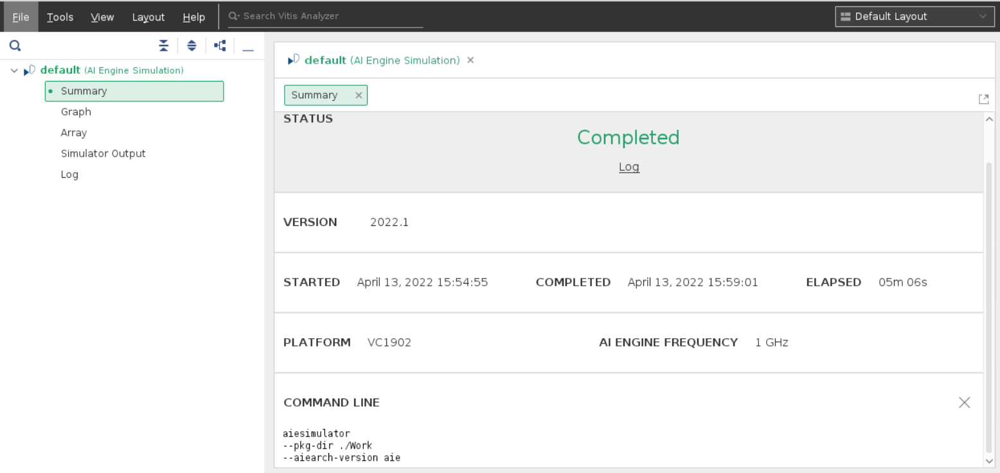

4. Click on **Profile**.
##### **Profile**
The **Profile View** provides detailed information collected during the simulation to give you an idea on cycle count, total instructions executed, program memory, and specific info per functions in the two tiles that the kernels are programmed.

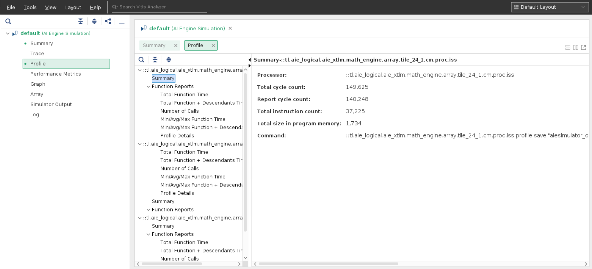

This is the top-level view of the profile and on the left column allows you to select one of many types of reports generated per function.

5. Select the first **Total Function Time** from this column you will see:

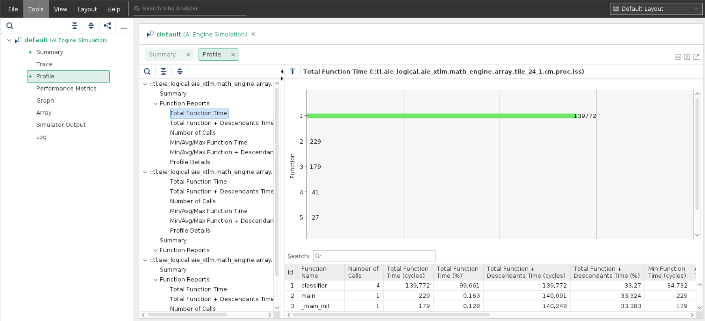

In this chart you can see what function is called the most, how long it took, etc. This can be useful in identifying if the tile is under or over utilized for your design.

6. Click on **Graph**.
##### **Graph**
This view gives an overview of your graph and how the graph is designed in a logical fashion. In this view, you can see all the PLIO ports, kernels, buffers, and net connections for the entire ADF Graph.

**Note**: This view as well as the **Array View** have cross-probe selection. Meaning selecting an object in this view will select it in the other and vice versa.

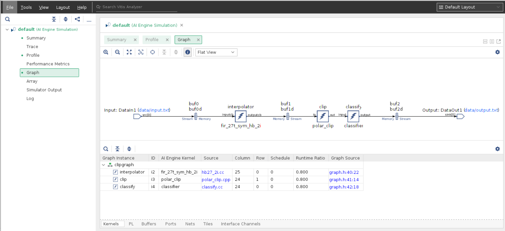

7. Click on **Array**.
##### **Array**
The **Array View** gives you a logical device view of the AI Engine and how the kernels are placed and how they are connected to each other as well as the shim.

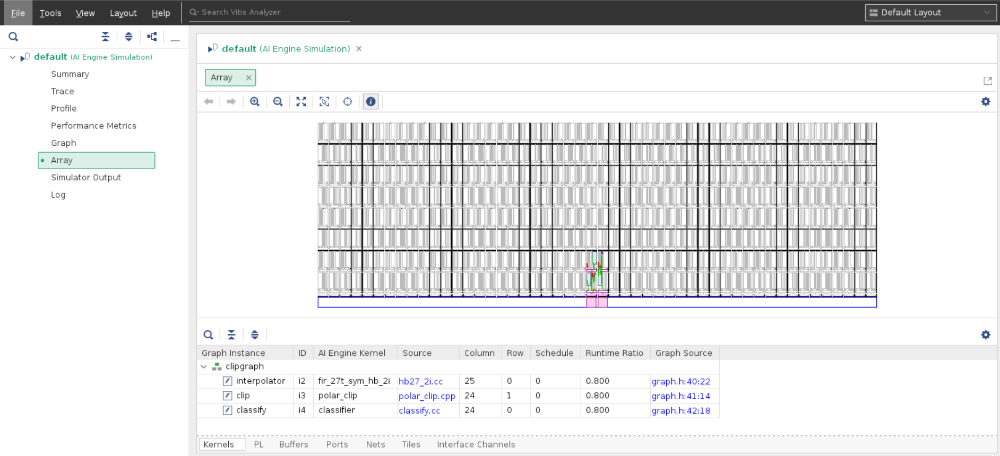

* Cross probe to kernel and graph source files
* The table at the bottom would show the following:
  * Kernel - The kernels in the graph.
  * PL - Shows connections between the graph and PLIO.
  * Buffer - Will show all the buffers used for inputs/outputs of the graph and the buffers for kernels.
  * Port - Shows all the ports of each kernels and ADF Graph.
  * Net - Shows all nets, named and generated, mapped in the ADF Graph.
  * Tile - Shows tile data (kernels, buffers) of mapped tiles and their grid location.

**Tip**: To see more detailed information about these tables go to [Chapter 9 - Section: "Viewing Compilation Results in the Vitis Analyzer"](www.xilinx.com/html_docs/xilinx2021.2/vitis_doc/compile_graph_application.html).

You can zoom into the view to get finer detail of the AI Engine and see how tiles are made up as seen in the following screenshot.

8. To zoom in, click and drag from the upper-left area you want to view to have a box show up around the area to zoom. Below is a zoomed in area too look at.

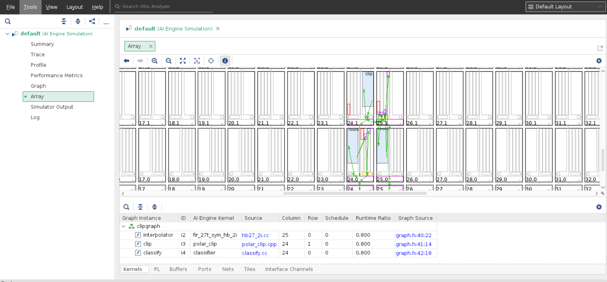

In this zoomed in location you can see how the kernels are connected to a variety of tiles and how the shim is connected to the PLIO ports of this design.

9. Click on **Simulator Output**.

##### **Simulator Output**
Lastly, the **Simulator Output** view and will print out the `output.txt` generated by the graph. This is a timestamped output.

**Note**: If you need to compare this file to a golden one, you'll have to remove the -`T ####ns`- from the file.

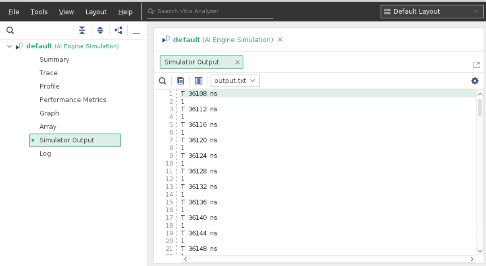

If you need to make any changes to the ADF Graph or the kernels inside based upon results of the `aiesimulator` you can do so and rerun the compiler and view the results in Vitis&trade; Analyzer to see the changes you have made.

10.  Once you're done with the Vitis Analyzer, close it by going to **File** > **Exit**.

## Section 6: Run the hardware emulation, and view run summary in Vitis Analyzer.

### 1. Compiling HLS Kernels Using v++

As done for sw_emu target in **Section-3**, compile the `mm2s`, and `s2mm` PL HLS kernels using the `v++` compiler command - which takes in an HLS kernel source and produces an `.xo` file.

To compile the kernels, run the following command:

```bash
make kernels TARGET=hw_emu
```
or

```bash
v++ -c --platform $PLATFORM_REPO_PATHS/xilinx_vck190_base_202210_1/xilinx_vck190_base_202210_1.xpfm --save-temps -g -k s2mm pl_kernels/s2mm.cpp -o s2mm.xo
v++ -c --platform $PLATFORM_REPO_PATHS/xilinx_vck190_base_202210_1/xilinx_vck190_base_202210_1.xpfm --save-temps -g -k mm2s pl_kernels/mm2s.cpp -o mm2s.xo
```

To get more details about several options of `v++` command line, refer to the **Compiling HLS Kernels Using V++** topic in **Section-3**
The only extra switch that is added is `-g`, which is required to capture waveform data.

### 2. Use V++ to Link AI Engine, HLS Kernels with the Platform

After the AI Engine kernels, graph, PL kernel, and HLS kernels have been compiled, and simulated you can use `v++` to link them with the platform to generate an `.xsa`.

As explained in the **Section-3**, you use the `system.cfg` configuration file to connect the AI Engine and PL kernels in the design.


```ini
[connectivity]
nk=mm2s:1:mm2s
nk=s2mm:1:s2mm
sc=mm2s.s:ai_engine_0.DataIn1
sc=ai_engine_0.DataOut1:s2mm.s
```

To build the design run the follow command:

```bash
make xsa TARGET=hw_emu
```
Or

```bash
v++ -l --platform $PLATFORM_REPO_PATHS/xilinx_vck190_base_202210_1/xilinx_vck190_base_202210_1.xpfm s2mm.xo mm2s.xo libadf.a -t hw_emu --save-temps -g --config system.cfg -o tutorial.xsad
```

Now you have a generated `.xsa` that will be used to execute your design on the platform.

### 3.Compile the A72 Host Application

To compile the A72 host application, run the command:

```bash
make host
```

Or

```bash
cd ./sw
aarch64-xilinx-linux-g++ -Wall -c -std=c++14 -Wno-int-to-pointer-cast --sysroot=$SDKTARGETSYSROOT -I$SDKTARGETSYSROOT/usr/include/xrt -I$SDKTARGETSYSROOT/usr/include -I./ -I../aie -I$XILINX_VITIS/aietools/include -I$XILINX_VITIS/include -o aie_control_xrt.o ../Work/ps/c_rts/aie_control_xrt.cpp

aarch64-xilinx-linux-g++ -Wall -c -std=c++14 -Wno-int-to-pointer-cast --sysroot=$SDKTARGETSYSROOT -I$SDKTARGETSYSROOT/usr/include/xrt -I$SDKTARGETSYSROOT/usr/include -I./ -I../aie -I$XILINX_VITIS/aietools/include -I$XILINX_VITIS/include -o main.o .cpp

aarch64-xilinx-linux-g++ main.o aie_control_xrt.o -ladf_api_xrt -lxrt_coreutil -L$SDKTARGETSYSROOT/usr/lib --sysroot=$SDKTARGETSYSROOT -L$XILINX_VITIS/aietools/lib/aarch64.o -o host.exe
cd ..
```

To get more details about the GCC options being used, refer to **Section-3** topic - **Compile the A72 host application**:

### 4.Package the Design

With all the AI Engine outputs and the new platform created, you can now generate the Programmable Device Image (PDI) and a package to be used on an SD card. The PDI contains all executables, bitstreams, and configurations of every element of the device, and the packaged SD card directory contains everything to boot Linux and have your generated application and `.xclbin`.

To package the design, run the following command:

	```bash
	make package TARGET=hw_emu
	```

	Or

	```bash
	cd ./sw
	v++ --package -t hw_emu \
		-f $PLATFORM_REPO_PATHS/xilinx_vck190_base_202210_1/xilinx_vck190_base_202210_1.xpfm \
		--package.rootfs=$PLATFORM_REPO_PATHS/sw/versal/xilinx-versal-common-v2022.1/rootfs.ext4 \
		--package.image_format=ext4 \
		--package.boot_mode=sd \
		--package.kernel_image=$PLATFORM_REPO_PATHS/sw/versal/xilinx-versal-common-v2022.1/Image \
		--package.defer_aie_run \
		--package.sd_file host.exe ../tutorial.xsa ../libadf.a
	cd ..
	```

**NOTE:** By default the `--package` flow will create a `a.xclbin` automatically if the `-o` switch is not set.

For more details on the packager options, refer to the **Section-3**, topic-**Package the Design**.

### 5.Run Hardware Emulation
After packaging, everything is set to run emulation. Since you ran `aiesimulator` with profiling enabled, you can bring that to hardware emulation. You can pass the `aiesim_options.txt` to the `launch_hw_emu.sh` which will enable the profiling options used in `aiesimulator` to be applied to hardware emulation. To do this, you will just add the `-aie-sim-options ../aiesimulator_output/aiesim_options.txt`.

1. To run emulation use the following command:

	```bash
	make run_emu TARGET=hw_emu
	```

	Or

	```bash
	cd ./sw
	./launch_hw_emu.sh -aie-sim-options ../aiesimulator_output/aiesim_options.txt -add-env AIE_COMPILER_WORKDIR=../Work
	```

When launched, use the Linux prompt presented to run the design.  Note that the emulation process is slow, so do not touch the keyboard of your terminal or you might stop the emulation of the Versal booth (as it happens in the real HW board)

2. Execute the following command when the emulated Linux prompt finally appears:

	```bash
	cd /run/media/*1
	export XILINX_XRT=/usr
	dmesg -n 4 && echo "Hide DRM messages..."
	```

This will set up the design to run emulation and remove any unnecessary DRM messaging.

3. Run the design using the following command:

	```bash
	./host.exe a.xclbin
	```

**Note**: The design is running with dumping VCD, which will extend emulation time. It may look like it is hung, but it is not.

4. You should see an output displaying **TEST PASSED**. When this is shown, run the keyboard command: `Ctrl+A x` to end the QEMU instance.

5. To view the profiling results and trace in Vitis&trade; Analyzer run the command:

	```bash
	vitis_analyzer sw/sim/behav_waveform/xsim/default.aierun_summary
	```

	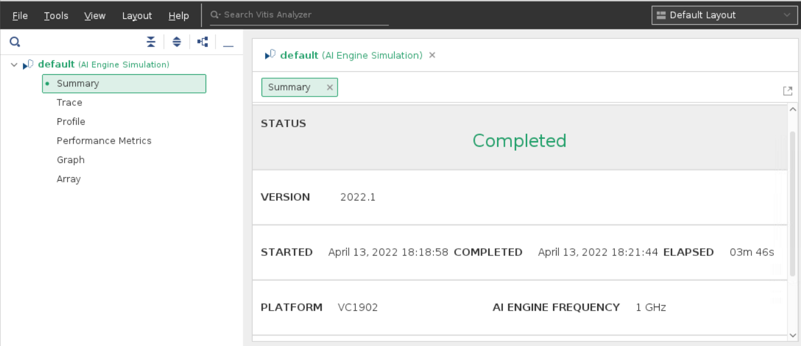

As you can tell from opening up this run summary, that it is the same layout as the one from `aiesimulator`.

6. Click **Trace**. This will open up the VCD data (as defined in the `aiesim_options.txt`). This gives detailed information about kernels, tiles, and nets within the AI Engine during execution. Here you can see stalls in regards to each kernel and can help you identify where they are originating.

	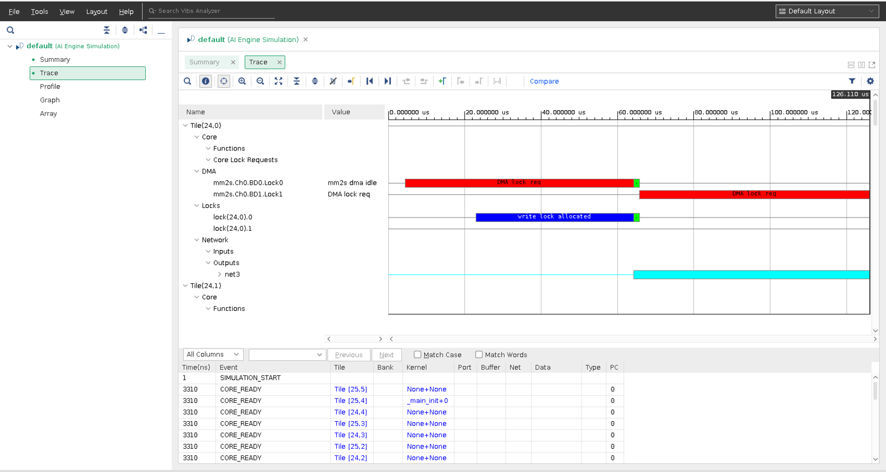

7. Click **Profile**. This will bring up the same view as shown for the profiling of the `aiesimulator`, but now it will have information gathered from running hardware emulation.

8. Click **Total Function Time** you will see this:

	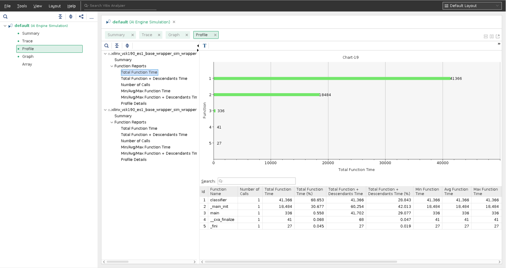

	As you can tell the values here differ from the one used in `aiesimulator`.

The final two views: **Graph** and **Array** are same to what you saw in the `aiesimulator` run summary.

9. Open the `aiesimulator` run summary by going to **File** > **Open Summary** and navigating to the `aiesimulator_output` directory and clicking on `default.aierun_summary`.

Explore the two reports and take notice of any differences and similarities. These will help you debug and optimize your design.

10. Close out of the **Vitis Analyzer** and build for hardware.

## Section 7: Build and Run on Hardware
1. To build for hardware run the following command:

	```bash
	cd ..
	make xsa TARGET=hw
	```

	Or

	```bash
	v++ -l --platform $PLATFORM_REPO_PATHS/xilinx_vck190_base_202210_1/xilinx_vck190_base_202210_1.xpfm s2mm.xo mm2s.xo libadf.a -t hw --save-temps -g --config system.cfg -o tutorial.xsa
	```

2. Then re-run the packaging step with:

	```bash
	make package TARGET=hw
	```

	Or

	```bash
	cd ./sw
	v++ --package -t hw \
		-f $PLATFORM_REPO_PATHS/xilinx_vck190_base_202210_1/xilinx_vck190_base_202210_1.xpfm \
		--package.rootfs=$PLATFORM_REPO_PATHS/sw/versal/xilinx-versal-common-v2022.1/rootfs.ext4 \
		--package.image_format=ext4 \
		--package.boot_mode=sd \
		--package.kernel_image=$PLATFORM_REPO_PATHS/sw/versal/xilinx-versal-common-v2022.1/Image \
		--package.defer_aie_run \
		--package.sd_file host.exe ../tutorial.xsa ../libadf.a
	cd ..
	```

When you run on hardware, ensure you have a supported SD card. Format the SD card with the `sw/sd_card.img` file. Then plug the SD card into the board and power it up.

3. When a Linux prompt appears, run the following commands:

	```bash
	dmesg -n 4 && echo "Hide DRM messages..."
	cd /run/media/*1
	export XILINX_XRT=/usr
	./host.exe a.xclbin
	```

You should see **TEST PASSED**. You have successfully run your design on hardware.

**IMPORTANT**: To rerun the application you need to power cycle the board.

### Summary
In this tutorial you learned the following:

* How to compile PLIO and PL Kernels using `v++ -c`.
* How to link the `libadf.a`, PLIO and PL kernels to the `xilinx_vck190_base_202210_1` platform.
* How to use Vitis&trade; Analyzer to explore the various reports generated from compilation and emulation/simulation.
* How to package your host code, and the generated `xclbin` and `libadf.a` into an SD card directory.
* How to execute the design for software emulation.
* How to execute the design for hardware emulation.
* How to execute the design on the board.

To read more about the use of Vitis in the AI Engine flow see: *UG1076: Versal ACAP AI Engine Programming Environment Chapter 13: Integrating the Application Using the Vitis Tool Flow*.

# Support

GitHub issues will be used for tracking requests and bugs. For questions go to [support.xilinx.com](https://support.xilinx.com/).

# License

Licensed under the Apache License, Version 2.0 (the "License"); you may not use this file except in compliance with the License.

You may obtain a copy of the License at [http://www.apache.org/licenses/LICENSE-2.0]( http://www.apache.org/licenses/LICENSE-2.0 )


Unless required by applicable law or agreed to in writing, software distributed under the License is distributed on an "AS IS" BASIS, WITHOUT WARRANTIES OR CONDITIONS OF ANY KIND, either express or implied. See the License for the specific language governing permissions and limitations under the License.

<p align="center"> XD002 | &copy; Copyright 2022 Xilinx, Inc.</p>
