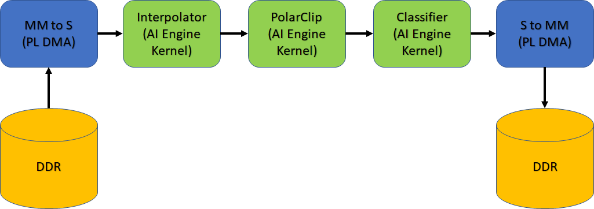

<table class="sphinxhide" width="100%">
 <tr width="100%">
    <td align="center"><h1>AI Engine Development</h1>
    <a href="https://www.xilinx.com/products/design-tools/vitis.html">See Vitis™ Development Environment on xilinx.com</br></a>
    <a href="https://www.xilinx.com/products/design-tools/vitis/vitis-ai.html">See Vitis AI Development Environment on xilinx.com</a>
    </td>
 </tr>
</table>

# Versal System Design Clocking

***Version: Vitis 2022.1***

## Introduction

Developing an accelerated AI Engine design for the VCK190, can be done using the Vitis™ compiler (`v++`). This compiler can be used to compile programmable logic (PL) kernels and connect these PL kernels to the AI Engine and PS device.

In this tutorial you will learn clocking concepts for the Vitis compiler and how to define clocking for ADF Graph, as well as PL kernels using clocking automation functionality. The design being used is a simple classifier design as shown in the following figure.



Pre-requisites for this tutorial are:

* Familiarity with the `aiecompiler` flow
* Familiarity with the `gcc` style command-line compilation

In the design the following clocking steps are used:

| Kernel Location | Compile Setting |
| --- | --- |
| Interpolator, Polar Clip, & Classifier | AI Engine Frequency (1 GHz) |
| `mm2s` & `s2mm` | 150 MHz and 100 MHz (`v++ -c` & `v++ -l`) |
For detailed information, see the Clocking the PL Kernels section [here](https://docs.xilinx.com/r/en-US/ug1076-ai-engine-environment/Clocking-the-PL-Kernels).

**IMPORTANT**: Before beginning the tutorial, make sure to read and follow the *Vitis Software Platform Release Notes* (v2021.2) for setting up software and installing the VCK190 base platform.

Run the following steps before starting this tutorial:

1. Set up your platform by running the `xilinx-versal-common-v2022.1/environment-setup-cortexa72-cortexa53-xilinx-linux` script as provided in the platform download. This script sets up the `SDKTARGETSYSROOT` and `CXX` variables. If the script is not present, you **must** run the `xilinx-versal-common-v2021.1/sdk.sh`.
2. Set up your `ROOTFS` and `IMAGE` to point to the `xilinx-versal-common-v2022.1` directory.
3. Set up your `PLATFORM_REPO_PATHS` environment variable based upon where you downloaded the platform.

This tutorial targets the VCK190 ES board (see https://www.xilinx.com/products/boards-and-kits/vck190.html). This board is currently available via early access. If you have already purchased this board, download the necessary files from the lounge and ensure you have the correct licenses installed. If you do not have a board and ES license please contact your Xilinx sales contact.

## Objectives

You will learn the following:

* Clocking of PL kernels
* Introduction of datawidth converters, clock-domain crossing, and FIFOs in `v++`

## Step 1 - Building ADF Graph

The ADF graph has connections to the PL through the PLIO interfaces. These interfaces can have reference clocking either from the `graph.cpp` through the `PLIO()` constructor or through the `--pl-freq`. This will help with determining what kind of clock can be set on the PL Kernels that are going to connect to the PLIO. Here you will set the reference frequency to be 200 MHz for all PLIO interfaces.

**NOTE**: If you do not specify the `--pl-freq` it will be set to 1/4 the frequency of the AI Engine frequency.

```bash
aiecompiler --target=hw -include="$(XILINX_VITIS)/aietools/include" -include="./aie" -include="./data" -include="./aie/kernels" -include="./" --pl-freq=200 --workdir=./Work
```

or

```bash
make aie
```

| Flag | Description |
| ---- | ----------- |
| --target | Target how the compiler will build the graph. Default is `hw` |
| --include | All the typical include files needed to build the graph |
| --pl-freq | Sets all PLIO reference frequencies (in MHz) |
| --workdir | The location of where the work directory will be created |

## Step 2 - Clocking the PL Kernels

In this design you will use three kernels called: **MM2S**, **S2MM**, and **Polar_Clip**, to connect to the PLIO. The **MM2S** and **S2MM** are AXI memory-mapped to AXI4-Stream HLS designs to handle mapping from DDR and streaming the data to the AI Engine. The **Polar_Clip** is a free running kernel that only contains two AXI4-Stream interfaces (input and output) that will receive data from the AI Engine, process the data, and send it back to the AI Engine. Clocking of these PLIO kernels is separate from the ADF Graph and these are specified when compiling the kernel, and when linking the design together.

Run the following commands:
    ```bash
    v++ -c --platform $PLATFORM_REPO_PATHS/xilinx_vck190_base_202210_1/xilinx_vck190_base_202210_1.xpfm -k mm2s ./pl_kernels/mm2s.cpp \
        --hls.clock 150000000:mm2s -o mm2s.xo --save-temps
    v++ -c --platform $PLATFORM_REPO_PATHS/xilinx_vck190_base_202210_1/xilinx_vck190_base_202210_1.xpfm -k s2mm ./pl_kernels/s2mm.cpp \
        --hls.clock 150000000:s2mm -o s2mm.xo --save-temps
    v++ -c --platform $PLATFORM_REPO_PATHS/xilinx_vck190_base_202210_1/xilinx_vck190_base_202210_1.xpfm --hls.clock 200000000:polar_clip -k polar_clip \
        ./pl_kernels/polar_clip.cpp -o polar_clip.xo --save-temps
    ```

    Or this command:

    ```bash
    make kernels
    ```

A brief explanation of the `v++` options:

| Flag/Switch | Description |
| --- | ---|
| `-c` | Tells `v++` to run the compiler.|
| `--platform` | (required) The platform to be compiled towards.|
| `-k` | (required) Kernel name.|
| `--hls.clock` | Tells the Vitis compiler to use a specific clock defined by a 9-digit number (in the previous example above the clock is 100 MHz). Specifying this will help with the compiler make optimizations based on kernel timing.|
| `-o` | (required) The output, which will always be `.xo`.|
| `--save-temps` | (optional) Will create a folder structure and save the compilation of the kernel.|

For additional information, see [Vitis Compiler Command](https://www.xilinx.com/html_docs/xilinx2021_2/vitis_doc/vitiscommandcompiler.html).

After completion, you will have the `mm2s.xo`, `s2mm.xo`, `polar_clip.xo` files ready to be used by `v++`. The host application will communicate with these kernels to read/write data into memory.

## Step 3 - `v++` linker -- Building the System

Now that you have a compiled graph (`libadf.a`), the PLIO kernels (`mm2s.xo`, `s2mm.xo`, and `polar_clip.xo`), you can link everything up for the VCK190 platform.

A few things to remember in this step:

1. For PLIO kernels, you need to specify their connectivity for the system.
2. Specify the clocking per PL Kernel.
3. You need to determine the `TARGET`: *hw* or *hw_emu*.

To link kernels up to the platform and AI Engine, you will need to look at the `system.cfg` file. For this design the config file looks like this:

```ini
[connectivity]
nk=mm2s:1:mm2s
nk=s2mm:1:s2mm
nk=polar_clip:1:polar_clip
stream_connect=mm2s.s:ai_engine_0.DataIn1
stream_connect=ai_engine_0.clip_in:polar_clip.in_sample
stream_connect=polar_clip.out_sample:ai_engine_0.clip_out
stream_connect=ai_engine_0.DataOut1:s2mm.s
```

Here you may notice some connectivity and clocking options.

* `nk` -- This defines your PL kernels as such: `<kernel>:<count>:<naming>`. For this design, you only have one of each `s2mm`, `mm2s`, and `polar_clip` kernels.
* `stream_connect` -- This tells `v++` how to hook up the previous two kernels to the AI Engine instance. Remember, AI Engine only handles stream interfaces. You can also define a FIFO on this line by adding a depth value to the end.

There are many more options available for `v++`. For a full list, see the documentation [here](https://www.xilinx.com/html_docs/xilinx2021_2/vitis_doc/vitiscommandcompiler.html).

1. Modify the `system.cfg` file so that the second `stream_connect` has a stream depth of `1024`. Replace the line with `ai_engine_0.Dataout` line with this: `stream_connect=ai_engine_0.Dataout:s2mm.s:1024`
   * Keep this file open for now.
2. The data output of the AI Engine is at 32-bit and at a high clock frequency. To reduce the possibilities of dropping data, you can attach the `s2mm` kernel to the AI Engine with a larger datawidth (eg. 64-bits) and the clock frequency to `s2mm` to keep relative bandwidth the same. To do this the Vitis Compiler will auto instantiate a Clock Converter block and Datawidth Converter block to make sure connectivity is achieved.
   * Open the `s2mm.cpp` in `./pl_kernels` to see that the line `23` has 64-bit defined for both input and output.
3. Because the `s2mm` kernel is running slower than the AI Engine output, you need to override the clock provided to it in **Step 2**. That was just for kernel compilation and linking is to make sure that clock is connected correctly. In the `system.cfg` file uncomment these lines:
    ```ini
    [clock]
    freqHz=200000000:s2mm.ap_clk
    tolerance=1000000:s2mm.ap_clk
    ```
    Here you are telling the `v++` linker to override the default clock frequency to 200 MHz for the `s2mm` kernel, and setting the clock tolerance to 1 MHz. By setting a tolerance you are giving the linker a better chance to make sure a clock can be generated that meets your bandwidth.
4. With the changes made you can now run the following command:
    ```bash
    v++ --link --target hw --platform $PLATFORM_REPO_PATHS/xilinx_vck190_base_202210_1/xilinx_vck190_base_202210_1.xpfm s2mm.xo \
        mm2s.xo polar_clip.xo ./aie/libadf.a --config system.cfg \
        --save-temps -o tutorial1.xclbin
    ```

    | Flag/Switch | Description |
    | --- | --- |
    | `--link` | Tells `v++` that it will be linking a design, so only the `*.xo` and `libadf.a` files are valid inputs. |
    | `--target` | Tells `v++` how far of a build it should go, hardware (which will build down to a bitstream) or hardware emulation (which will build the emulation models). |
    | `--platform` |  Same from the previous two steps. |
    | `--config` | This allows you to simplify the `v++` command-line if it gets too unruly and have items in an ini style file. |

5. When the linking is complete you can view what the design looks like in the Vivado® tools. Navigate to `_x/link/vivado/vpl`.
   1. Run the command in the terminal: `vivado -source openprj.tcl`
   2. When the tool is open, locate the button on the left in the Flow Navigator and click, "Open Block Design". You should see an output similar to the following figure. (The following figure has reduced nets visible to see the added FIFO, Datawidth Converter, and Clock Converter).

    

    **IMPORTANT: Do not change anything in this view. This is only for demonstration purposes.**

   * From the changes made in the previous steps, you will notice a new clock, Datawidth Converter, Clock Converter, and a new FIFO on the `s2mm` kernel.
      * Do note that if you change a kernel or connectivity you have to re-run the `v++` linker.

**NOTE: Any change to the `system.cfg` file can also be done on the command-line. Make sure to familiarize yourself with the Vitis compiler options by referring to the documentation [here](https://www.xilinx.com/html_docs/xilinx2021_2/vitis_doc/vitiscommandcompiler.html).**

## Step 4 - Compiling Host Code

When the `v++` linker is complete, you can compile the host code that will run on the Linux that comes with the platform. Compiling code for the design requires the location of the **SDKTARGETSYSROOT** or representation of the root file system, that can be used to cross-compile the host code.

1. Open `./sw/host.cpp` and familiarize yourself with the contents. Pay close attention to API calls and the comments provided.

    Do take note that [XRT](https://xilinx.github.io/XRT/2021.2/html/index.html) (Xilinx Runtime) is used in the host application. This API layer is used to communicate with the PL, specifically the PLIO kernels for reading and writing data. To understand how to use this API in an AI Engine application see [Programming the PS Host Application](https://www.xilinx.com/html_docs/xilinx2021_2/vitis_doc/program_ps_host_application.html#ykt1590616160037).

    The output size of the kernel run is half of what was allocated earlier. This is something to keep in mind. By changing the `s2mm` kernel from a 32-bit input/output to a 64-bit input/output, the kernel call will be adjusted. If this is not changed, it will hang because XRT is waiting for the full length to be processed when in reality half the count was done (even though all the data will be present). In the `host.cpp` look at line 117 and 118 and comment them out. You should have uncommented the following line:

   ```C++
   xrtRunHandle s2mm_rhdl = xrtKernelRun(s2mm_khdl, out_bohdl, nullptr, sizeOut/2);
   ```

2. Open the `Makefile`, and familiarize yourself with the contents. Take note of the `GCC_FLAGS` and `GCC_LIB`.
   * `GCC_FLAGS` -- Should be self-explanatory that you will be compiling this code with C++.
   * `GCC_LIB`   -- Has the list of all the specific libraries you will be compiling and linking with. This is the minimum list of libraries needed to compile an AI Engine application for Linux.
3. Close the makefile and run the command: `make host`.

With the host application fully compiled, you can now move to packaging the entire system.

## Step 5 - Packaging Design and Running on Board

To run the design on hardware using an SD card, you need to package all the files created. For a Linux application, you must make sure that the generated `.xclbin`, `libadf.a`, and all Linux info from the platform are in an easy to copy directory.

1. Open the `Makefile` with your editor of choice, and familiarize yourself with the contents specific to the `package` task.
2. In an easier to read command-line view, here is the command:
    ```bash
    v++ --package --target hw --platform $PLATFORM_REPO_PATHS/xilinx_vck190_base_202210_1/xilinx_vck190_base_202210_1.xpfm \
        --package.rootfs ${ROOTFS} \
		--package.kernel_image ${IMAGE} \
		--package.boot_mode=sd \
		--package.image_format=ext4 \
		--package.defer_aie_run \
		--package.sd_file host.exe \
        tutorial1.xsa libadf.a
    ```
    **NOTE:** Remember to change the `${ROOTFS}` and `${IMAGE}` to the proper paths.

    Here you are invoking the packaging capabilities of `v++` and defining how it needs to package your design.

    | Switch/Flag | Description |
    | --- | --- |
    | `--package.rootfs` | This specifies the root file system to be used. In the case of the tutorial it is using the pre-built one from the platform. |
    | `--package.kernel_image` | This is the Linux kernel image to be used. This is also a using a pre-built one from the platform. |
    | `--package.boot_mode` | Used to specify how the design is to be booted. For this tutorial, an SD card will be used and it will create a directory with all the contents needed to boot from one. |
    | `--package.image_format` | Tells the packager the format of the Kernel image and root file system. For Linux, this should be `ext4`. |
    | `--package.defer_aie_run` | This tells the packager that when building the boot system to program the AI Engine, to stop execution. In some designs, you do not want the AI Engine to run until the application is fully loaded. |
    | `--package.sd_file` | Specify this to tell the packager what additional files need to be copied to the `sd_card` directory and image. |

3. Run the command: `make package`
4. When the packaging is complete, do an `cd ./sw && ls` and notice that several new files were created, including the `sd_card` directory.
5. Format the SD card with the `sd_card.img` file.

When running the VCK190 board, make sure you have the right onboard switches flipped for booting from the SD card.

1. Insert the SD card and turn ON the board.
2. Wait for the Linux command prompt to be available on an attached monitor and keyboard.
3. Run the following commands:
    ```bash
    cd /mnt/sd-mmcblk0p1
    export XILINX_XRT=/usr
    ```
4. To run your application enter the command: `./host.exe a.xclbin`
5. You should see a **TEST PASSED** which means that the application ran successfully!

**IMPORTANT**: To re-run the application, you must power cycle the board.

## Challenge (Optional)

### Build the design for Hardware Emulation
Modifying the target for both **Step 3** and **Step 5**, link and package a design for hardware emulation, and run the emulation with the generated script, `launch_hw_emu.sh`.

## Summary

In this tutorial you learned the following:

* Adjusted clocking for PL Kernels and PLIO Kernels
* How to modify the `v++` linker options through the command-line, as well as the config file
* How datawidth converters, clock-domain crossing, and FIFOs are inserted in `v++`
* How to run an AI Engine application on a VCK190 board

<p align="center"><sup>&copy;  Copyright 2020-2021 Xilinx, Inc.</sup></p>

Licensed under the Apache License, Version 2.0 (the "License");

you may not use this file except in compliance with the License.

You may obtain a copy of the License at


    http://www.apache.org/licenses/LICENSE-2.0


Unless required by applicable law or agreed to in writing, software

distributed under the License is distributed on an "AS IS" BASIS,

WITHOUT WARRANTIES OR CONDITIONS OF ANY KIND, either express or implied.

See the License for the specific language governing permissions and

limitations under the License.

<p align="center"><sup>XD004</sup></p>
