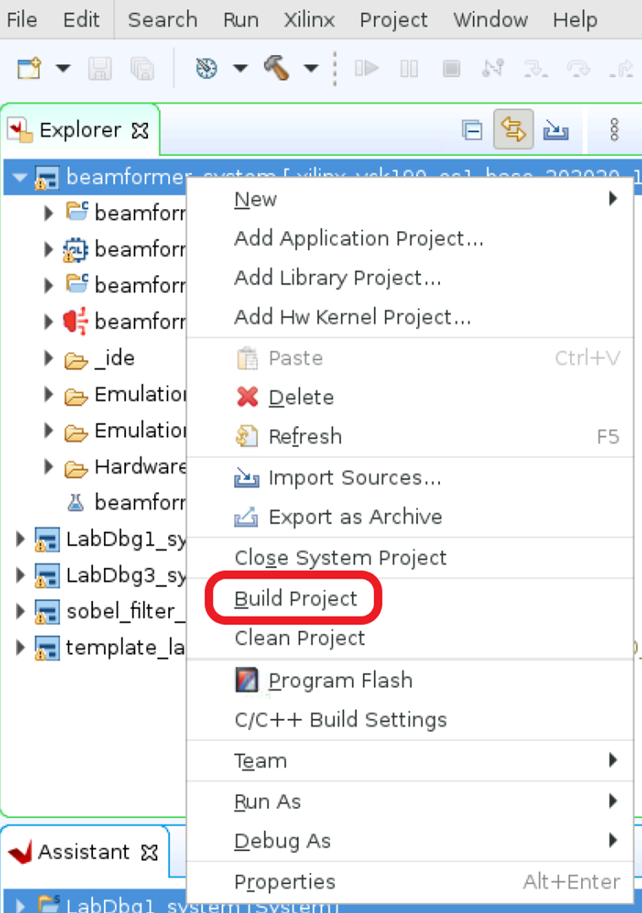
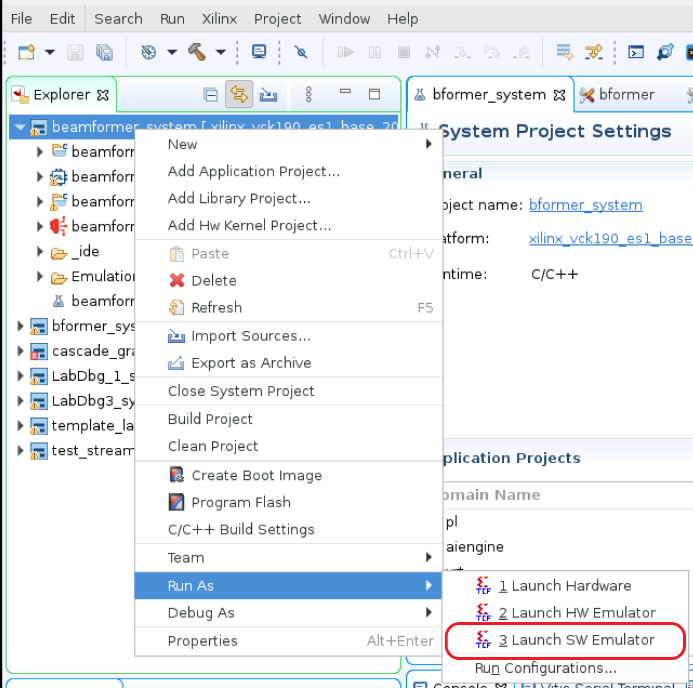

<table>
 <tr>
   <td align="center"><h1>AI Engine Debug Walkthrough Tutorial - From Simulation to Hardware</h1>
   </td>
 </tr>
 <tr>
 <td align="center"><h2>AI Engine Debug with Software Emulator</h2>
 </td>
 </tr>
</table>

Software emulation supports fast emulation execution and `printf()` to help verify the kernel's functionalities. Users can check the output by examining design output files in the `${PROJECT}/Emulation-SW/data` directory.

Hardware constraints such as heap/stack sizes and program memory size are not verified in software emulator.

The following steps outline the procedure:

[1. Prepare Software Emulation Project in Vitis IDE](#1-Prepare-Software-Emulation-Project-in-Vitis-IDE)

[2. Run and Verify Software Emulation in Vitis IDE](#2-Run-and-Verify-Software-Emulation-in-Vitis-IDE)

[3. Launch Debugger to Debug Design](#3-Launch-Debugger-to-Debug-Design)

[4. Command line project build and run with software emulator](#4-Command-line-project-build-and-run-with-software-emulator)


## 1. Prepare Software Emulation Project in Vitis IDE

### Step 1.1 Select Software Emulation Configuration


### Step 1.2 Build AI Engine domain project

Above step is required to generated aie_control_xrt.cpp that works with software emulation.

**Important: For software emulation to work properly, it is mandatory having tool generated `${PROJECT_PATH}/Work/ps/c_rts/aie_control_xrt.cpp` from software emulation target and import to PS domain application.
For hardware and hardware emulation targets, it is also mandatory to build AI Engine domain project for hardware/hardware emulation target then import generated `${PROJECT_PATH}/Work/ps/c_rts/aie_control_xrt.cpp` to PS domain project to build system project. Tool generated `${PROJECT_PATH}/Work/ps/c_rts/aie_control_xrt.cpp` can not be mix used for different targets.**

### Step 1.3 Import aie_control_xrt.cpp to PS domain


### Step 1.4 Import host.cpp to PS domain
Due to software emulation requires PS application to synchronize AIE data to and from host memory, xrtBOSync() calls are required to synchronize them. An updated host.cpp is provided from this tutorial. Import from tutorial's `sw/host.cpp.sw_emu` to `${WORKSPACE}/beamformer_ps/src/host.cpp`.
The updated host.cpp contains mandatory changes to make software emulation work.
```bash
...
195     #if defined(__SYNCBO_ENABLE__)
196     xrtBOSync(cin_bohdl[0], XCL_BO_SYNC_BO_TO_DEVICE, cin_size_in_bytes, 0);
197     xrtBOSync(cin_bohdl[1], XCL_BO_SYNC_BO_TO_DEVICE, cin_size_in_bytes, 0);
198     xrtBOSync(cin_bohdl[2], XCL_BO_SYNC_BO_TO_DEVICE, cin_size_in_bytes, 0);
199     xrtBOSync(cin_bohdl[3], XCL_BO_SYNC_BO_TO_DEVICE, cin_size_in_bytes, 0);
200     xrtBOSync(cin_bohdl[4], XCL_BO_SYNC_BO_TO_DEVICE, cin_size_in_bytes, 0);
201     xrtBOSync(cin_bohdl[5], XCL_BO_SYNC_BO_TO_DEVICE, cin_size_in_bytes, 0);
202     xrtBOSync(cin_bohdl[6], XCL_BO_SYNC_BO_TO_DEVICE, cin_size_in_bytes, 0);
203     xrtBOSync(cin_bohdl[7], XCL_BO_SYNC_BO_TO_DEVICE, cin_size_in_bytes, 0);
204
205     xrtBOSync(din_bohdl[0], XCL_BO_SYNC_BO_TO_DEVICE, dlbf_din_size_in_bytes, 0);
206     xrtBOSync(din_bohdl[1], XCL_BO_SYNC_BO_TO_DEVICE, ulbf_din_size_in_bytes, 0);
207     #endif
...
274     #if defined(__SYNCBO_ENABLE__)
275     xrtBOSync(out_bohdl[0], XCL_BO_SYNC_BO_FROM_DEVICE, out_size_in_bytes, 0);
276     xrtBOSync(out_bohdl[1], XCL_BO_SYNC_BO_FROM_DEVICE, out_size_in_bytes, 0);
277     xrtBOSync(out_bohdl[2], XCL_BO_SYNC_BO_FROM_DEVICE, out_size_in_bytes, 0);
278     #endif
...
```

IDE needs to add `__SYNCBO_ENABLE__` flag in build.


### Step 1.5 Build system project


## 2. Run and Verify Software Emulation in Vitis IDE

### Step 2.1 Configure Environment Variables

Add environment variables to software emulation run configuration and debug configuration.

```bash
export LD_LIBRARY_PATH=/mnt:/tmp:$LD_LIBRARY_PATH
export XCL_EMULATION_MODE=sw_emu
```

### Step 2.2 Run with Software Emulator


### Step 2.3 Verify Run Result
Software emulator output files from design are located at `${PROJECT}/Emulation-SW/data`. Verify the output files `${PROJECT}/Emulation-SW/data/dlbf_out[0-7].txt` and `${PROJECT}/Emulation-SW/data/ulbf_out[0-3].txt` against golden files `${PROJECT}/data/dlbf_gold[0-7].txt` and `${PROJECT}/data/ulbf_gold[0-3].txt` to ensure that the design's I/O functionalities are correct. Vitis IDE supports `compare with` feature to compare two files, highlight two files to be compared then right click one of highlighted file and select `compare with` then `each other`.
For example, Compare `${PROJECT}/data/ulbf_gold3.txt` and `${PROJECT}/Emulation-SW/data/ulbf_out3.txt`


## 3. Launch Debugger to Debug Design

### Step 3.1 Launch Software Emulation Debugger


### Step 3.2 Debug with Software Emulator
Click on `Start Emulator and Debug` to allow software emulator and debugger to run.


Example of debugging mm2s_v8.cpp


Note: Accessing vector variables values from software emulator is not fully supported. Recommend using `x86simulator` to inspect vector variables values.


## 4. Command line project build and run with software emulator
### Step 4.1 Download the project
Clone the project source from git repository and unzip the downloaded zip file.

### Step 4.2 Prepare Makefiles and source code
1. Use this tutorial's Makefile.sw_emu that configures right target to build.
```bash
cd ${DOWNLOAD_PATH}/AI_Engine_Development/Feature_Tutorials/09-debug-walkthrough
cp Makefile.sw_emu Makefile
```

2. Use this tutorial's sw_emu files `Makefile.sw_emu, host.cpp.sw_emu, aie_control_xrt.cpp.sw_emu` at sw directory that has software emulator related updates.
```bash
cd sw
cp Makefile.sw_emu Makefile
cp host.cpp.sw_emu host.cpp
cp aie_control_xrt.cpp.sw_emu aie_control_xrt.cpp
```

### Step 4.3 Build project
```bash
cd ${DOWNLOAD_PATH}/AI_Engine_Development/Feature_Tutorials/09-debug-walkthrough
make
```

### Step 4.4 Run project
Execute generated shell script, `./launch_sw_emu.sh`.

### Step 4.5 Petalinux boot
Expects to see Petalinux boots up with Linux prompt to accept Linux commands and run PS application.

### Step 4.6 Set up environment variables
```bash
export LD_LIBRARY_PATH=/mnt:/tmp:$LD_LIBRARY_PATH
export XCL_EMULATION_MODE=sw_emu
```
**Important: These environment variables are mandatory, or application run with errors.**

### Step 4.7 Run application
```bash
cd /run/media/mmcblk0p1
./host.exe a.xclbin
```
Expect to see `TEST PASSED` from terminal.


## Limitations
Limitations from `x86simulator` are applicable in software emulator.


# Support

GitHub issues will be used for tracking requests and bugs. For questions go to [support.xilinx.com](https://support.xilinx.com/).

# License

Licensed under the Apache License, Version 2.0 (the "License");
you may not use this file except in compliance with the License.
You may obtain a copy of the License at

    http://www.apache.org/licenses/LICENSE-2.0


Unless required by applicable law or agreed to in writing, software
distributed under the License is distributed on an "AS IS" BASIS,
WITHOUT WARRANTIES OR CONDITIONS OF ANY KIND, either express or implied.
See the License for the specific language governing permissions and
limitations under the License.

<p align="center"><sup>XD005 | &copy; Copyright 2021 Xilinx, Inc.</sup></p>
