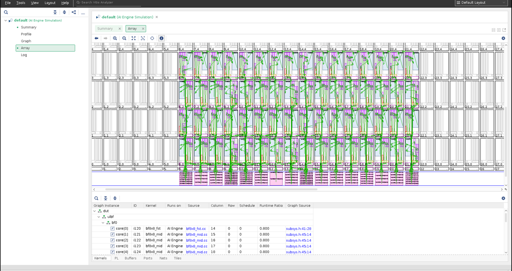

<table class="sphinxhide" width="100%">
 <tr width="100%">
    <td align="center"><h1>AI Engine Development</h1>
    <a href="https://www.xilinx.com/products/design-tools/vitis.html">See Vitis™ Development Environment on xilinx.com </a>
    <a href="https://www.xilinx.com/products/design-tools/vitis/vitis-ai.html">See Vitis™ AI Development Environment on xilinx.com</a>
    </td>
 </tr>
</table>

# AI Engine Debug Walkthrough Tutorial - From Simulation to Hardware

***Version: Vitis 2022.1***

## Introduction

System level debug of AI Engine designs that could use up to 400 tiles in the AI Engine domain, PL interfaces and kernels, and PS application can be done at several stages in the design flow. System level debug of AI Engine designs can be categorized as follows:

1. Functional debug that involves techniques to uncover bugs in the AI Engine kernel source code.
2. Performance level debug that involves debug techniques to uncover reasons for throughput drop or reasons for larger latencies when the AI Engine graph is run either in simulation or in hardware.

Techniques to uncover both functional and performance level bugs are described in the following sections.  

Source level debug includes visibility into register contents view, variable values view, breakpoints view, and hence necessitates a GUI. The Vitis™ integrated design environment (IDE) is the tool that supports these debug requirements. This tutorial demonstrates how to use the Vitis IDE to manage these challenges and additional tools and methodologies to assist with your design debug.

**IMPORTANT**: Before beginning the tutorial make sure you have read and followed the *Vitis Software Platform Release Notes (v2022.1)* for setting up software and installing the VCK190 base platform.

Before starting this tutorial run the following steps:

1. Set up your platform by running the `xilinx-versal-common-v2022.1/environment-setup-cortexa72-cortexa53-xilinx-linux` script as provided in the platform download. This script sets up the `SYSROOT` and `CXX` variables. If the script is not present, you **must** run the `xilinx-versal-common-v2022.1/sdk.sh`.
2. Set up your ROOTFS to point to the xilinx-versal-common-v2022.1/rootfs.ext4.
3. Set up your IMAGE to point to xilinx-versal-common-v2022.1/Image.
4. Set up your `PLATFORM_REPO_PATHS` environment variable based upon where you download the platform.

This tutorial targets VCK190 production board, PLATFORM variable in the Makefile(s) is:
PLATFORM = ${PLATFORM_REPO_PATHS}/xilinx_vck190_base_202210_1/xilinx_vck190_base_202210_1.xpfm

## Example Design: Beamformer

The architecture of the beamformer design consists of three kernels with slight differences which are scalable to various matrix sizes and throughput requirements. The design methodology is applicable to matrix multiplication including, but not limited to, 5G wireless communication.

One feature of the beamforming architecture is that only a small number of kernels are required by various system configurations. Depending on the location of the kernels in the cascading chain, they are named first, middle, and last. All the kernels implement (8x8) times (8x12) matrix multiplication and only differ in the input and output interfaces.
The first kernel in the cascading chain does not have cascading input, while the last one writes the output to local memory instead of the cascading bus.

Every beamforming kernel performs eight MAC4 operations on one column of eight inputs to compute eight outputs. Each MAC4 operation takes eight coefficients and two inputs, and stores the result in a register of 384 bits.
At the end of computation, the partial summations are sent to the next AI Engine core for further accumulation, or output to local memory after shift, round, and saturation.

This design has 64 tiles and 88 programmable logic input/output (PLIO) streams that the PS application prepares input data for, sends  data to AI Engine kernels via PL kernels. AI Engine kernels process the data received and then send it back to the PL kernels. The PS application receives the processed data, then saves it to the designated directory/files, compares it to golden data, and prints out "TEST PASSED" or "TEST FAILED" result on the console.

The complete beamformer design is shown in the Vitis™ analyzer.

## Methods

There are several ways to debug a system design that include PS, PL, and AI Engine or an AI Engine only design. Each method has the intended goal to help debug practice. For projects that are command-line based and would like to port to Vitis™ IDE, reference [Port command-line based projects to Vitis IDE](./Debug0_po.md) for detail steps.

For ease of use, a Vitis IDE exported project, `beamformer_2022_1.ide.zip` can be downloaded from https://www.xilinx.com/bin/public/openDownload?filename=beamformer_2022_1.ide.zip. Then import this zip file into the Vitis IDE.

Step 0. Download data files, `beamformer_data.zip` from https://www.xilinx.com/bin/public/openDownload?filename=beamformer_data.zip. Unzip this file and save it at the same level as this tutorial's Makefile.

Step 1. Source the Vitis IDE script or install the Vitis™ IDE.

Step 2. Launch the Vitis IDE using the command **vitis -workspace tutorial**.

Step 3. Click on **File**->**import...**. Select **Vitis project exported zip file**->**Next**. Browse to the `beamformer.ide.zip` file. Click **Next**->**Finish**.

Step 4. You should see the imported beamformer design in the Vitis™ IDE.

After the project is ready in the Vitis IDE, you can move on to the next steps to try out the various debug features in software and hardware emulation and also in hardware.

**Note**: The imported project specifies a hardware platform path that must be adjusted to your specific installed path to work correctly. Click on **`beamformer_system.sprj`** to update the hardware platform path in the Vitis™ IDE.

## Debug Methodology

### Debug via Simulations

Due to huge cost and time associated with build real system for testing and verification purposes, there are several simulation and modeling techniques to help evaluating AI Engine designs.

Classification of simulation,
* Functional vs. Timing simulations.

Functional simulator simulates the functionalities of the design only and do not model microarchitecture details and constraints. X86simulator and SW_emu are considered in this category while Aiesimulator and HW_emu are considered timing simulations that simulates execution time/performance and constraints of the design. Keeping track of those detailed timing information makes them slow and resources intensive in comparison to functional simulators. 

* Application level vs. Full system simulations.

Obviously, application level simulation focus on targeted designs, e.g. AI Engine design instead of a full fledge target operating system (OS). In user level simulation, any system service requests by the simulated application are serviced by the underlying host OS. Application level simulation is usually less complex but likely to show some inaccuracies due to lack of system level support.

Supported simulations are categorize in this table.
<table style="width:100%">
  <tr>
    <td width="40%" align="center"></td>
    <td width="30%" align="center"><a>Functional Simulation</a></td>
    <td width="30%" align="center"><a>Timing Simulation</a></td>
  </tr>
  <tr>
    <td width="40%" align="center"><a>Application Level Simulation</a></td>
    <td width="30%" align="center"><a href="Debug1_86.md">X86simulator</a></td>
    <td width="30%" align="center"><a href="Debug2_ai.md">AIEsimulator</a></td>
  </tr>  
  <tr>
    <td width="40%" align="center"><a>System Level Simulation</a></td>
    <td width="30%" align="center"><a href="Debug1_se.md">SW_emu</a></td>
    <td width="30%" align="center"><a href="Debug2_he.md">HW_emu</a></td>
  </tr>
</table>

These supported simulations help to fix majority of design issues before running the AI Engine design on actual hardware. [UG1076](https://docs.xilinx.com/r/en-US/ug1076-ai-engine-environment) contains more details of each simulation’s capabilities and how to apply the supported features to resolve design issues such as memory leaks, memory access conflicts, resource constraints, integration with PL/PS domains.

#### Step 1: Functional Simulation and Debug of AI Engine kernels and graph. – <a href="Debug1_86.md">X86simulator</a>.
#### Step 2: Performance Level Simulation and Debug of AI Engine graph. – <a href="Debug2_ai.md">AIEsimulator</a>.
#### Step 3: Software Emulation of AI Engine design integrated with PL and PS domains. – <a href="Debug1_se.md">SW_emu</a>.
#### Step 4: Hardware Emulation of AI Engine design integrated with PL and PS domains. – <a href="Debug2_he.md">HW_emu</a>.

### Debug via Hardware

After fixing all AI Engine design issues with above simulations, running AI Engine design on hardware could still exhibits issues.
[UG1076](https://docs.xilinx.com/r/en-US/ug1076-ai-engine-environment) debug methodology chapter describes these stages along with detail steps included.

#### Stage 1: Run the design on hardware 
This is the first stage running the design on hardware. Areas to check
* Verify input and output data
  * Restrict pointer usage
* Error reporting and handling reporting from host application
  * XRT APIs returned status
* Design stalls analysis
  * XRT Xbutil utility
  * XSDB generate run summary file and display with vitis_analyzer

[AI Engine/PL kernel Debug with XRT utilities on HW](./Debug5_bc.md)

[AI Engine Debug with Profiling APIs on HW](./Debug6_pa.md#3-Profiling-APIs-on-HW)

#### Stage 2: System profiling
[AI Engine Debug with Profiling Feature](./Debug6_pr.md)

#### Stage 3: Kernel Analysis
[AI Engine Debug with Integrated Logic Analyzer](./Debug7_il.md)

#### Stage 4: AI Engine Event Trace and Analysis
[AI Engine Debug with Event Trace](./Debug4_et.md)

#### Stage 5: Host Application Debug
[Host Application Debug](./Debug3_hw.md)

## Support

GitHub issues will be used for tracking requests and bugs. For questions go to [support.xilinx.com](https://support.xilinx.com/).

## License

Licensed under the Apache License, Version 2.0 (the "License");
you may not use this file except in compliance with the License.
You may obtain a copy of the License at

    http://www.apache.org/licenses/LICENSE-2.0

Unless required by applicable law or agreed to in writing, software
distributed under the License is distributed on an "AS IS" BASIS,
WITHOUT WARRANTIES OR CONDITIONS OF ANY KIND, either express or implied.
See the License for the specific language governing permissions and
limitations under the License.

XD005 | &copy; Copyright 2021 Xilinx, Inc.

