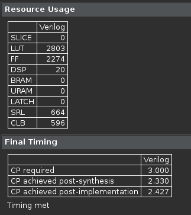

<!--
/*
 * Copyright 2020-2022 Xilinx, Inc.
 *
 * Licensed under the Apache License, Version 2.0 (the "License");
 * you may not use this file except in compliance with the License.
 * You may obtain a copy of the License at:
 * http://www.apache.org/licenses/LICENSE-2.0
 *
 * Unless required by applicable law or agreed to in writing, software
 * distributed under the License is distributed on an "AS IS" BASIS,
 * WITHOUT WARRANTIES OR CONDITIONS OF ANY KIND, either express or implied.
 * See the License for the specific language governing permissions and
 * limitations under the License.
 */ -->
 
<table width="100%">
 <tr width="100%">
    <td align="center"><h1>Vitis™ Hardware Acceleration Tutorials</h1>
    <a href="https://www.xilinx.com/products/design-tools/vitis.html">See Vitis™ Development Environment on xilinx.com</a>
    </td>
 </tr>
</table>

> **In this section...**   
We look at the export phase of the flow to packages the RTL either the Vivado or the Vitis flow.
In addition,  we run the Vivado tool directly from the Vitis HLS GUI to get more accurate timing and resource estimates.

## Export the accelerated function and evaluate in Vivado

During the export phase of the flow, Vitis HLS packages the results into a form that can be consumed by either Vitis or Vivado.  

- Change the number of cities back to 13 in `tsp.h`
- Run C synthesis
- Export through the toolbar "play" pulldown menu or via the main menu: `Solution` -> `Run Implementation`
- In the dialog, select `RTL synthesis, Place and Route` as shown below:  

- Click OK and let Vivado synthesis and implementation run until the flow completes, and updates the main screen of Vitis HLS.
## Review the Vivado results

## Next Step

* [Code optimization with 4 parallel memory lookups](./code_opt.md)
