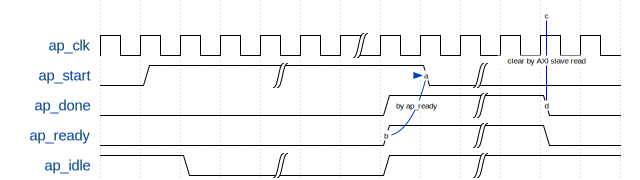
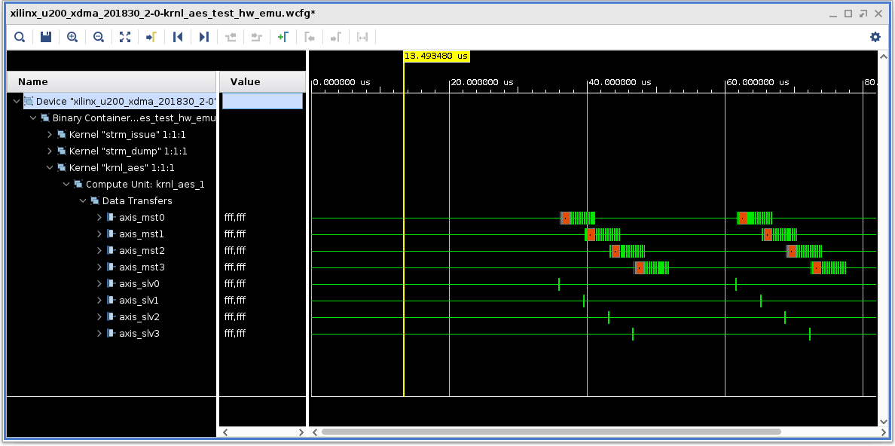

# RTL Kernel: krnl_aes

## Introduction

In this part of the tutorial, you will start with the Aes module you created in [RTL Module: Aes](./aes.md). You will add RTL logics, then pack them into Vivado&reg; IP and Vitis Kernel (XO) file. This Vitis&trade; Kernel file can be used directly in the Vitis v++ flow to build XCLBIN overlay files, and the user can use the XRT library to realize the kernel control and data transfer between the host and the kernel.

## Kernel Features

The `krnl_aes` kernel includes four Aes modules, each of which are connected outside with AXI stream slave and master ports. There is also an AXI slave port for kernel control. To simplify the design, all Aes modules use the same settings (encrypt/decrypt mode, key length and key value).

The `krnl_aes` actually uses two clocks inside: one for external AXI ports and the other for internal AXI ports and AES cores. The AES cores run at a higher frequency than the platform AXI interconnections.

There are two methods to get the higher clock for the kernel.
One method is to use the secondary platform clock provided, namely `ap_clk_2` ports. In the Alveo&trade; Data Center accelerator card, the target platform has provided multiple clocks for the user kernel. For example, for the Alveo U200 `xilinx_u200_xdma_201830_2` platform, two system clocks are provided, `ap_clk` and `ap_clk_2`, whose default frequency is 300 MHz and 500 Mhz, respectively. The frequency can be configured in the Vitis v++ link process. `ap_clk_2` is generated by a standalone MMCM in the static region of the Alveo platform. The second method to get the additional clock is to manually instantiate an MMCM inside the RTL kernel. This might provide additional flexibility for some specific requirements.

The example design provided here uses the second method to generate the required clock. The `krnl_aes` kernel includes a customized MMCM module to generate a 400 MHz clock from the standard 300 MHz input clock provided by the platform.

The UltraScale+&trade; Alveo target platform is divided into a static region and a dynamic region. The customer-instantiated MMCMs in the dynamic region are probably driven by an MMCM in the static region, which might be used to drive the platform bus clock. This usually causes big clock skew and makes it difficult for the synchronous design to meet timing. To ease the timing closure, those modules driven by the customer MMCM should operate in asynchronous mode to the platform bus clock. In this example design, the AXI slave control module and the four Aes engines all run in the 400MHz clock domain, while the kernel will be connected to 300MHz standard platform clock domain. So altogether nine AXI/AXIS clock converter IPs are used in the top level of the kernel: one AXI clock converter for AXI control slave, four AXIS clock converters for AXIS slave ports, and four AXIS clock converters for AXIS master ports.

Following is the block diagram of *krnl_aes* kernel.

<div align="center">

</div>
<br/>

There are three kernel execution models for Vitis acceleration application supported by XRT: *ap_ctrl_none*, *ap_ctrl_hs* and *ap_ctrl_chain*. You can refer to [ug1416](https://www.xilinx.com/html_docs/xilinx2020_2/vitis_doc/managing_interface_synthesis.html?hl=ap_ctrl_chain#qls1539734256651__ae476299), [Supported Kernel Execution Models](https://xilinx.github.io/XRT/master/html/xrt_kernel_executions.html) for more details. This RTL kernel *krnl_aes* is the mixing of *ap_ctrl_none* and *ap_ctrl_hs* modes: *ap_ctrl_hs* is used for AES key expansion operation, namely the host will start and wait for the finish of AES key expansion operation; *ap_ctrl_none* is used for general AES encryption/decryption operation, namely as soon as the kernel receives input data from AXI stream slave port, it will start and finish the encryption/decryption operation automatically and send the output data to AXI stream master port.

In *krnl_aes*, following control signal waveform is implemented for *ap_ctrl_hs* mode. XRT will assert *ap_start* signal to start the kernel execution, then *ap_start* will keep high and de-asserted by *ap_ready* signal. *ap_ready* is actually a copy of *ap_done* signal. Finally *ap_done* is cleared by read control register operation on AXI slave port. Please note that the XRT scheduler actually decides when to assert *ap_start* depending on the status of *ap_start*, that is, when XRT detects the *ap_start* is de-assert, it considers the kernel ready to receive new *ap_start* request.

<div align="center">

</div>
<br/>

The table below lists all the control register and kernel arguments included in AXI slave port, no interrupt support in this kernel.

|Name       |Addr Offset    |Width (bits)   |Description|
|----       |----           |----           |----       |
|CTRL       |0x000          |5              |Control Signals.<br>bit 0  - ap_start <br>bit 1  - ap_done <br>bit 2  - ap_idle <br>bit 3  - ap_ready , copy version of ap_done in ap_ctrl_hs mode<br>bit 4  - ap_continue , no use in ap_ctrl_hs mode|
|MODE       |0x010          |1              |Kernel cipher mode:<br> 0 - decryption <br> 1 - encryption|
|KEY_LEN    |0x018          |2              |AES Key length:<br>2'b00=128bit<br>2'b01=192bit<br>2'b10=256bit|
|STATUS     |0x020          |4              |Status of the 4 AES engines:<br>0 - idle<br>1 - busy|
|KEY_W7     |0x028          |32             |AES key word 7|
|KEY_W6     |0x030          |32             |AES key word 6|
|KEY_W5     |0x038          |32             |AES key word 5|
|KEY_W4     |0x040          |32             |AES key word 4|
|KEY_W3     |0x048          |32             |AES key word 3. When key length is 128, this word is not used|
|KEY_W2     |0x050          |32             |AES key word 2. When key length is 128, this word is not used|
|KEY_W1     |0x058          |32             |AES key word 1. When key length is 128/192bit, this word is not used|
|KEY_W0     |0x060          |32             |AES key word 0. When key length is 128/192bit, this word is not used|

## IP Generation

This example design uses three kinds of design IP and two kinds of verification IP:

* Clock generator MMCM
* AXI clock converter
* AXI stream clock converter
* AXI Master VIP
* AXIS Master VIP
* AXIS Slave VIP

These IPs are all generated by a Tcl script **~/krnl_aes/gen_ip.tcl**. The script runs in non-project mode and mainly uses three Tcl command *create_ip*, *set_property* and *generate_target* to finish the IP generation. You could refer to the script and relevant IP documents for more details.

## Pack the Design into Vivado IP and Vitis Kernel

One key step for the RTL kernel design for Vitis is to package the RTL design into Vitis kernel file (XO file). The user can utilize the GUI version *RTL Kernel Wizard* tool to help to create the Vitis kernel. The user can also use GUI version *IP Packager* in Vivado to package the design into Vivado IP then generate the XO file. Vivado also provides command line flow for Vitis kernel generation which provides the same jobs as GUI version. In this tutorial, we will use the Vivado Tcl command to finish the *krnl_aes* IP packaging and XO file generation in batch mode. The complete kernel generation script for this design is in **~/krnl_aes/pack_kernel.tcl**, the main steps are explained below and please see the details in the script. Actually each step in the script has its counterpart in GUI tool, refer to [RTL Kernels](https://www.xilinx.com/html_docs/xilinx2020_2/vitis_doc/devrtlkernel.html) for GUI version IP packaging tool usage.

#### Step 1: Create Vivado project and add design sources

Firstly we need to create a Vivado project containing the source files. The script use the Tcl command *create_project*, *add_files* and *update_compiler_order* to finish this step. All RTL source codes, generated IP file (xci file) and XDC file should be added into the newly created project.

Finally the *ipx::package_project* Tcl command is used to initialize the IP packaging process.

~~~shell
create_project krnl_aes ./krnl_aes
add_files -norecurse {
        ../rtl/aes_wrapper.sv ... ...              \
        ../ip_generation/clk_gen/clk_gen.xci      \
        ../ip_generation/axi_clock_converter/axi_clock_converter.xci \
        ../ip_generation/axis_clock_converter/axis_clock_converter.xci \
        ../krnl_aes.xdc                     \
       }
update_compile_order -fileset sources_1
ipx::package_project -root_dir ./krnl_aes_ip -vendor xilinx.com -library user -taxonomy /UserIP -import_files -set_current true
~~~

In this step, you may see a warning information like: *WARNING: [IP_Flow 19-5101] Packaging a component with a SystemVerilog top file is not fully supported. Please refer to UG1118 'Creating and Packaging Custom IP'*. Currently the Vitis tool chain requires the port definition of the top module be traditional Verilog style. Though the top level module *krnl_aes.sv* uses some SystemVerilog syntax (SystemVerilog *interface* objects), but it uses the traditional Verilog style port definition, so you could omit this warning.

#### Step 2: Infer clock, reset, AXI interfaces and associate them with clock

Here we first use *ipx::infer_bus_interface* command to infer *ap_clk* and *ap_rst_n* as AXI bus signals. Generally if *ap_clk* is the only clock we used in the RTL kernel, this command can be omitted. If we use more clocks (ap_clk_2, ap_clk_3, ...) in the design, we must use the *ipx::infer_bus_interface* command to infer the ports explicitly.

~~~
ipx::infer_bus_interface ap_clk xilinx.com:signal:clock_rtl:1.0 [ipx::current_core]
ipx::infer_bus_interface ap_rst_n xilinx.com:signal:reset_rtl:1.0 [ipx::current_core]
~~~

All AXI interfaces will be inferred automatically. In this design, these AXI ports include: a control AXI slave port *s_axi_control*, four AXIS slave ports *axis_slv0 ~ 3* and four AXIS master ports *axis_mst0 ~ 3*.

Then we use *ipx::associate_bus_interfaces* command to associate the automatically inferred AXI interfaces and reset signal to *ap_clk*.

~~~
ipx::associate_bus_interfaces -busif s_axi_control  -clock ap_clk [ipx::current_core]
ipx::associate_bus_interfaces -busif axis_mst0      -clock ap_clk [ipx::current_core]
  ...
ipx::associate_bus_interfaces -busif axis_slv0      -clock ap_clk [ipx::current_core]
  ...
ipx::associate_bus_interfaces -clock ap_clk -reset ap_rst_n [ipx::current_core]
~~~

#### Step 3: Set the definition of AXI control slave registers, including CTRL and user kernel arguments

Here we use *ipx::add_register* command to add the registers to inferred *s_axi_control* interface and use *set_property* command to set the property of the registers, for example the kernel argument *KEY_LEN*:

~~~
ipx::add_register KEY_LEN   [ipx::get_address_blocks reg0 -of_objects [ipx::get_memory_maps s_axi_control -of_objects [ipx::current_core]]]
set_property description    {AES key length}    [ipx::get_registers KEY_LEN -of_objects [ipx::get_address_blocks reg0 -of_objects [ipx::get_memory_maps s_axi_control -of_objects [ipx::current_core]]]]
set_property address_offset {0x018}             [ipx::get_registers KEY_LEN -of_objects [ipx::get_address_blocks reg0 -of_objects [ipx::get_memory_maps s_axi_control -of_objects [ipx::current_core]]]]
set_property size           {32}                [ipx::get_registers KEY_LEN -of_objects [ipx::get_address_blocks reg0 -of_objects [ipx::get_memory_maps s_axi_control -of_objects [ipx::current_core]]]]
~~~

Here *KEY_LEN* is the kernel argument name; "AES key length" is the register description; "0x018" is the address offset the the register and "32" is the data width of the register (all scalar kernel arguments should be 32-bit width).

You can see in the provided Tcl script that all the registers defined in the previous table are added and defined accordingly.

Since the *krnl_aes* kernel doesn't have AXI master ports, so we don't need to configure them. The description of setting AXI master can be found in *krnl_cbc* kernel part next.

#### Step 4: Package Vivado IP and generate Vitis kernel file

Here we use *set_property* command to set two required property *sdx_kernel* and *sdx_kernel_type*. Then we issue *ipx::update_source_project_archive* and *ipx::save_core* commands to package the Vivado project into Vivado IP. Finally we use *package_xo* command to generate the Vitis XO file.

~~~
set_property sdx_kernel true [ipx::current_core]
set_property sdx_kernel_type rtl [ipx::current_core]
ipx::update_source_project_archive -component [ipx::current_core]
ipx::save_core [ipx::current_core]
package_xo -force -xo_path ../krnl_aes.xo -kernel_name krnl_aes -ctrl_protocol ap_ctrl_hs -ip_directory ./krnl_aes_ip -output_kernel_xml ../krnl_aes.xml
~~~

Please note in the above *package_xo* command usage, we let the tool to generate the kernel description XML file automatically, and don't need to manually create it. If you have an existing Vitis compatible Vivado IP and need to generate XO file from it, you could also manually create the kernel XML file and designate it in the command as below usage:

~~~
package_xo -xo_path ../krnl_aes.xo -kernel_name krnl_aes -ip_directory ./krnl_aes_ip -kernel_xml ../krnl_aes.xml
~~~

In this way, the kernel execution model is specified in the XML file with *hwControlProtocol* property instead of in *package_xo* command line option.

## Testbench

We provides a simple SystemVerilog testbench for the *krnl_aes* module with Xilinx AXI VIPs. The testbench sources are in **~/krnl_aes/tbench** directory. Since *krnl_aes* has four completely identical AES engines, so we only test two of the four engines. Two AXI stream master VIPs are used to send input data to the kernel, two AXI stream slave VIPs are used to receive output data from the kernel, and an AXI master are used to configure the kernel arguments and control the kernel execution in *ap_ctrl_hs* fashion for AES key expansion operation. You could read the **tb_krnl_aes.sv** file for more details on the usages of AXI VIP to interaction with the kernel.

The input random data to the testbench is generated by a perl script **~/common/plain_gen.pl**, and the reference data for output check is generated by OpenSSL tools. The shell script **~/krnl_aes/runsim_krnl_aes_xsim.sh** is used to generate the input stimulus, output reference and run the simulation with Vivado XSIM.

## Kernel Test System and Overlay (XCLBIN) Generation

To build a test system overlay for `krnl_aes`, we need AXI stream master and AXI stream slave to provide and receive data from `krnl_aes`. To do this, we write a simple memory-mapped AXI-to-AXIS kernel and a AXIS-to-AXI memory-mapped kernel with HLS C language. These are located in the `~/krnl_aes/hls` directory, and they are called `strm_issue.cpp` and `strm_dump.cpp`, respectively.

The HLS C implementation of these two kernels is as below. Note that the for-loop with variable `j` is for endian conversion: the input/output data is transferred as little-endian via 128-bit data width AXI bus, and the 128-bit data is considered a integral word in big-endian.

```C
#define PTR_WIDTH 128

void strm_issue (hls::stream<ap_axiu<PTR_WIDTH, 0, 0, 0>>& data_output,
                ap_uint<PTR_WIDTH> *data_input,
                int byte_size)
{
    for (int i = 0; i < (byte_size * 8 / PTR_WIDTH); i++) {
    // clang-format off
    #pragma HLS PIPELINE II = 1
    // clang-format on
        ap_uint<PTR_WIDTH> data_in, data_out;
        ap_axiu<PTR_WIDTH, 0, 0, 0> temp;
        data_in = data_input[i];
        for (int j = 0; j < (PTR_WIDTH / 8); j++) {
            data_out.range(j*8+7, j*8) = data_in.range((PTR_WIDTH/8-1-j)*8+7, (PTR_WIDTH/8-1-j)*8);
        }
        temp.data = data_out;
        data_output.write(temp);
    }
}

void strm_dump (hls::stream<ap_axiu<PTR_WIDTH, 0, 0, 0>>& data_input,
                ap_uint<PTR_WIDTH> *data_output,
                int byte_size)
{
    for (int i = 0; i < (byte_size * 8 / PTR_WIDTH); i++) {
    // clang-format off
    #pragma HLS PIPELINE II = 1
    // clang-format on
        ap_axiu<PTR_WIDTH, 0, 0, 0> temp = data_input.read();
        ap_uint<PTR_WIDTH> data_in, data_out;
        data_in = temp.data;
        for (int j = 0; j < (PTR_WIDTH / 8); j++) {
            data_out.range(j*8+7, j*8) = data_in.range((PTR_WIDTH/8-1-j)*8+7, (PTR_WIDTH/8-1-j)*8);
        }            
        data_output[i] = data_out;
    }
}          
```

In total, four `strm_issue` and four `strm_dump` kernels are integrated with `krnl_aes` in the test system, and the linking operation is scribed in the `~/krnl_aes/Makefile`. The  `~/krnl_aes/krnl_aes_test.cfg` file provides the necessary Vitis linking option for this design.

## Host Programming

For host programming, you can use XRT Native C++ APIs to control the kernel execution in the FPGA. XRT Native APIs are very straightforward and intuitive. They provide higher efficiency compared to XRT OpenCL, especially in those cases needing very frequent host-kernel interactions. For more details on XRT Native APIs, refer to [XRT Native APIs](https://xilinx.github.io/XRT/master/html/xrt_native_apis.html).

The host program generates the random data as plain input, then uses the OpenSSL AES API to generate the reference cipher data. It supports the hardware emulation (`hw_emu`) flow as well, and will select the correct XCLBIN files for `hw` or `hw_emu` mode.

The host program uses a `run.start()` function followed by a `run.wait()` function in a single thread way; this is the common usage for *ap_ctrl_hs* execution model.

One special note is that when the kernel `krnl_aes` is transiting from encryption mode to decryption mode, you must use a kernel argument `MODE` to change the function of the kernel. There are two methods to update the register:

  1. Using low-level `kernel.write_register()` API
  2. Using high-level `run.set_arg()` API followed by `run.start()`

For method 2, the `run.set_arg()` function will not be effective until the `run.start()` function is called, so you must issue `run.start()` to make the register writing operation happen. The key expansion operation doesn't need to execute again, and the kernel for data encryption/decryption operation works in `ap_ctrl_none` mode.

Here is the code snippet for these two methods:

```C
// Method 1 to configure krnl_aes to decryption mode
//   use run instance to set kernel argument. The kernel register will not be updated until run()
  run_key_exp.set_arg(0,0);                       // index for argument MODE is 0
  run_key_exp.start();
  run_key_exp.wait();

// Method 2 to configrue krnl_aes to decryption mode
//   use kernel write_register() to access the register directly
  int reg_offset = kernel_krnl_aes.offset(0);     // reg_offset = 0x10 for krnl_aes kernel register MODE
  kernel_krnl_aes.write_register(reg_offset, 0);  // set MODE = 0
```

## Tutorial Usage

### Before You Begin

This tutorial uses files in the `~/krnl_aes` directory.

All steps except for host program execution in this tutorial are finished by the GNU Make. This example design supports four Alveo cards (U200, U250, U50, U280), and you must make the necessary adjustments to the `~/krnl_aes/Makefile` for each card by uncommenting the line matching your Alveo card.

```makefile
 41 # PART setting: uncomment the line matching your Alveo card
 42 PART := xcu200-fsgd2104-2-e
 43 #PART := cu250-figd2104-2L-e
 44 #PART := xcu50-fsvh2104-2-e
 45 #PART := xcu280-fsvh2892-2L-e
 46
 47 # PLATFORM setting: uncomment the lin matching your Alveo card
 48 PLATFORM := xilinx_u200_xdma_201830_2
 49 #PLATFORM := xilinx_u250_xdma_201830_2
 50 #PLATFORM := xilinx_u50_gen3x16_xdma_201920_3
 51 #PLATFORM := xilinx_u280_xdma_201920_3
```

As an alternative, instead of making the modification, you can use the command line option to override the default setting. An example is shown in the following steps related to using the make tool for the U50 card:

```shell
make xxx PART=xcu50-fsvh2104-2-e PLATFORM=xilinx_u50_gen3x16_xdma_201920_3
```

Before starting, ensure that you source the setup scripts in XRT and Vitis installation path. For example:

```shell
source /opt/xilinx/xrt/setup.sh
source /tools/Xilinx/Vitis/2020.2/settings64.sh
```

### Tutorial Steps

#### 1. Generate IPs

```
make gen_ip
```

This starts Vivado in batch mode and calls `~/krnl_aes/gen_ip.tcl` to generate all needed design and verification IPs.

#### 2. Run Standalone Simulation

~~~
make runsim
~~~

This calls `~/krnl_aes/runsim_krnl_aes_xsim.sh` to run the simulation with Vivado XSIM.

#### 3. Package Vivado IP and Generate Vitis Kernel File

```
make pack_kernel
```

This starts Vivado in batch mode and calls `~/krnl_aes/pack_kernel.tcl` to package the RTL sources, generated IP XCI files, and XDC files into Vivado IP. It then generates the Vitis kernel file `~/krnl_aes/krnl_aes.xo`.

#### 4. Build Kernel Testing System Overlay Files

##### For a hardware target
For a hardware target, use the following command:

```
make build_hw
```

This first compiles the two HLS kernels into XO files, then builds the total system overlay files `~/krnl_aes/krnl_aes_test_hw.xclbin`.

##### For a hardware emulation target
For a hardware emulation target, use the following command:

```
make build_hw TARGET=hw_emu
```

This first compiles the two HLS kernels into XO files, then builds the total system overlay files `~/krnl_aes/krnl_aes_test_hw_emu.xclbin`.

#### 5. Compile Host Program

```
make build_sw
```

This finishes the compilation of the host C++ program. An executable,  `~/krnl_aes/host_krnl_aes_test`, is generated for both `hw` and `hw_emu` modules.

##### Finding the Device ID of Your Target Card

If you have multiple Alveo cards installed on the host machine, use the `xbutil list` command to find the device ID of your target card. For example:

```
xbutil list
...
 [0] 0000:d8:00.1 xilinx_u250_gen3x16_base_3 user(inst=131)
 [1] 0000:af:00.1 xilinx_vck5000-es1_gen3x16_base_2 user(inst=130)
 [2] 0000:5e:00.1 xilinx_u50_gen3x16_xdma_201920_3 user(inst=129)
```

In this example, if your target card is U50, you can find the device ID is 2. You should modify the line 30 of `~/krnl_aes/host/host_krnl_aes_test.cpp` as follows:

```c++
 28 // Use 'xbutil list' command to get the device id of the target Alveo card if multiple
 29 //   cards are installed in the system.
 30 #define DEVICE_ID   2
```

#### 6. Run Hardware Emulation (Optional)

When the XCLBIN file for hardware emulation (`~/krnl_aes/krnl_aes_test_hw_emu.xclbin`) is generated, you can run hardware emulation to verify the kernel in the platform environment for debug or details profiling purposes. Refer to the following commands.

```shell
source setup_emu.sh -s on -p PLATFORM_NAME
./host_krnl_aes_test -w 32
```

The first command calls the script to generate the emulation configuration file and set the necessary environment variables. The PLATFORM_NAME is the Alveo platform you are using, which can be xilinx_u200_xdma_201830_2 (default), xilinx_u250_xdma_201830_2, xilinx_u280_xdma_201920_3 or xilinx_u50_gen3x16_xdma_201920_3.

The second command runs the host program in *hw_emu* mode. The optional command line parameter *-w 32* sets the number of 128-bit words to process. The default word number in the program source code is 1048576 (1 million), which is too big for hardware emulation, so you can set it to a smaller value to shorten the emulation run time.

The `~/krnl_aes/xrt.ini` file is used to control the XRT emulation options, as shown below. In line 2, `exclusive_cu_context=true` is necessary if the low-level `kernel.write_register()` function is used. In line 6, `user_pre_sim_script=/home/workspace/bottom_up_rtl_kernel/krnl_aes/xsim.tcl` sets the absolute path to the pre-simulation Tcl script used by XSIM to indicate the tool to dump the waveform for all the signals.

**Note**: Make sure to modify the path to match your real path.

```
  1 [Runtime]
  2 exclusive_cu_context=true
  3
  4 [Emulation]
  5 debug_mode=batch
  6 user_pre_sim_script=/home/workspace/bottom_up_rtl_kernel/krnl_aes/xsim.tcl
  7
  8 [Debug]
  9 profile=true
 10 timeline_trace=true
 11 data_transfer_trace=fine
```

After the hardware emulation run finishes, you can open the generated `xilinx_xxx-0-krnl_aes_test_hw_emu.wdb` file in Vivado to analyze the waveform. The following figure shows the waveform for the behavior of eight AXI stream ports of `krnl_aes`.

<div align="center">

</div>
<br/>

The next figure shows the control signals behavior in AXI control slave for `ap_ctrl_hs` mode.

<div align="center">

</div>
<br/>

#### 7. Run Host Program in Hardware Mode

If you have tried hardware emulation in the previous step, you must run the following command to disable the `hw_emu` mode:

```shell
source setup_emu.sh -s off
```

Now, you can run the compiled `host_krnl_aes_test` file to test the system in hardware mode. The default words number to process is 1M 128-bit words, which is 16 MBytes. Because of the data transfer efficiency between host and FPGA via PCIe, you can peak processing throughput with big-enough input data.

```
./host_krnl_aes_test

------------------------ krnl_aes test program ------------------------
 128-bit words number : 1048576
           Key length : 256-bit
                  Key : 123456789ABCDEF0123456789ABCDEF0123456789ABCDEF0123456789ABCDEF0

Generating plain data
[MESSAGE] Program running in hardware mode
Load krnl_aes_test_hw.xclbin
Create kernels
Create input and output device buffers
Run krnl_aes for AES key expansion
Kernel run finish

-------------- AES Encryption Test
Transfer plain data into device buffer
Start strm_issue and strm_dump kernels
Kernel run finish
AES engines execution time = 170.820007 ms
Transfer cipher data from device buffer and verification
-- AES Engine 0
   SUCCESS
-- AES Engine 1
   SUCCESS
-- AES Engine 2
   SUCCESS
-- AES Engine 3
   SUCCESS
AES total encryption throughput = 392.857971 MB/s

-------------- AES Decryption Test
Transfer cipher data into device buffer
Start strm_issue and strm_dump kernels
Kernel run finish
AES engines execution time = 170.800995 ms
Transfer plain data from device buffer and verification
-- AES Engine 0
   SUCCESS
-- AES Engine 1
   SUCCESS
-- AES Engine 2
   SUCCESS
-- AES Engine 3
   SUCCESS
AES total decryption throughput = 392.901703 MB/s

```

---
Now you have a Vitis RTL kernel file, `krnl_aes.xo`, with `ap_ctrl_hs` execution model. In the next session, you will learn about another RTL kernel, `krnl_cbc`, which supports `ap_ctrl_chain` model, and integrates these two kernel into a hardware overlay (XCLBIN) to form a complete AES-CBC acceleration application. This is described in the next section: [RTL Kernel: krnl_cbc](./krnl_cbc.md).
