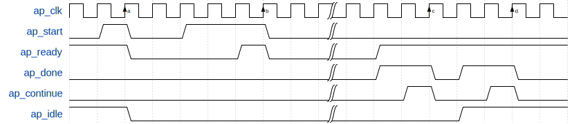

# RTL Kernel: krnl_cbc

## Introduction

This part of the tutorial introduces another RTL kernel: `krnl_cbc`.

This kernel has AXI master interfaces to access input/output data in on-board global memory, and to transmit/receive the data via AXI stream master/slave ports. This kernel is connected with the `krnl_aes` kernel via AXI stream ports in the Vitis v++ linking stage to implement the complete AES processing function. AES-ECB and AES-CBC modes are supported by `krnl_cbc`.

Again, you will use command-line Tcl scripts to finish all the steps without GUI support, except for waveform viewing. The `krnl_cbc` kernel has four internal processing pipes, matching the four AES engines in `krnl_aes`, which are transparent to the user. The `ap_ctrl_chain` execution model is supported by `krnl_cbc`, and the user can fully utilize the hardware parallel acceleration capability without insight knowledge about the number of the internal engines. Note that it is actually not so efficient to realize the connection between the AES core engines and CBC control units with external AXI stream link. We just implement them in this way to show the Vitis capability and design flow.

## Kernel Feature

Refer to the following block diagram of the `krnl_cbc` kernel. It has four identical CBC engines, which receive input data from AXI read master via engine control unit. They then send the data to and receive output data from the `krnl_aes` kernel via the AXI stream port, and send the result to AXI write master via the `engine control` unit.

An AXI control slave module is used to set the necessary kernel arguments. The `krnl_cbc` kernel finishes the task with input/output grouped words stored in global memory. Each internal engine will handle one words group at one time. Consecutive input groups are assigned to different internal CBC engines in round-robin fashion by `engine control` module. The `krnl_cbc` kernel uses a single kernel clock for all internal modules.

<div align="center">

</div>
<br/>

The `krnl_cbc` kernel supports the `ap_ctrl_chain` execution model. `ap_ctrl_chain` is an extension to the `ap_ctrl_hs` model; the kernel execution is divided into `input sync` and `output sync` stage. Control signals `ap_start` and `ap_ready` are used for `input sync`, while `ap_done` and `ap_continue` are used for `output sync`. Refer to [Supported Kernel Execution Models](https://xilinx.github.io/XRT/master/html/xrt_kernel_executions.html) for detailed explanations.

The following figure demonstrates an example waveform of `ap_ctrl_chain` module for two beat input sync and two beat output sync (kernel execute two jobs consecutively).

<div align="center">

</div>
<br/>


For `input sync`, at clock edge **a** and **b**, `ap_start` is validated and de-asserted by the `ap_ready` signal, and triggers the kernel execution simultaneously. (This is somewhat similar to `TVALID` validated by `TREADY` in the AXI stream protocol.) The XRT scheduler detects the status of the `ap_start` signal, and asserts `ap_start` when the signal is low, meaning the kernel can accept a new task. The `ap_ready` signal is generated by the kernel, indicating its  status.

For `output sync`, at clock edge **c** and **d**, `ap_done` is confirmed and de-asserted by the  `ap_continue` signal, meaning the completion of one kernel job. When the XRT scheduler detects the `ap_done` signal has been asserted, XRT asserts `ap_continue`. Generally, this should be implemented as a self-clear signal, so that it only keeps one cycle.

From the waveform, we can see that before the `ap_done` signal was asserted, the kernel uses the  `ap_ready` signal to tell the XRT that it can accept new input data. This scheme acts as back-pressure on the `input sync` stage to enable the task pipeline to fully utilize the hardware capability. In the above example waveform, XRT writes `ap_start` bit and `ap_continue` bit twice each in the AXI control slave register.

The following table lists all the control register and kernel arguments included in AXI slave port. There is no interrupt support in this kernel.

|Name        |Addr Offset    |Width (bits)   |Description|
|----        |----           |----           |----       |
|CTRL        |0x000          |5              |Control Signals.<br>bit 0  - ap_start <br>bit 1  - ap_done <br>bit 2  - ap_idle <br>bit 3  - ap_ready <br>bit 4  - ap_continue|
|MODE        |0x010          |1              |Kernel cipher mode:<br> 0 - decryption <br> 1 - encryption|
|IV_W3       |0x018          |32             |AES-CBC mode initial vector, Word 3|
|IV_W2       |0x020          |32             |AES-CBC mode initial vector, Word 2|
|IV_W1       |0x028          |32             |AES-CBC mode initial vector, Word 1|
|IV_W0       |0x030          |32             |AES-CBC mode initial vector, Word 0|
|WORDS_NUM   |0x038          |32             |Number of 128-bit words to process|
|SRC_ADDR_0  |0x040          |32             |Input data buffer address, LSB|
|SRC_ADDR_1  |0x044          |32             |Input data buffer address, MSB|
|DEST_ADDR_0 |0x048          |32             |Output data buffer address, LSB|
|DEST_ADDR_1 |0x04C          |32             |Output data buffer address, MSB|
|CBC_MODE    |0x050          |1              |Cipher processing mode:<br> 0 - AES-ECB mode <br> 1 - AES-CBC mode|

## IP Generation

This example design does not use design IP. It only uses verification IPs for simulation:

* AXI Master VIP
* AXI Slave VIP

These IPs are generated by a Tcl script called `~/krnl_cbc/gen_ip.tcl`.


## Packing the Design into Vivado IP and Vitis Kernel

One key step for the RTL kernel design for Vitis is to package the RTL design into a Vitis kernel file (XO file). You can utilize the RTL Kernel Wizard in the GUI to help to create the Vitis kernel. You can also use the IP Packager in Vivado to package the design into Vivado IP, and then generate the XO file. Vivado also provides a command line flow for Vitis kernel generation, which finishes the same jobs as the GUI version.

In this tutorial, like in the `krnl_aes` kernel case, we will use the Vivado Tcl command to finish the `krnl_cbc` IP packaging and XO file generation in batch mode. The complete kernel generation script for this design is in `~/krnl_cbc/pack_kernel.tcl`. The main steps are summarized below; refer to the details in the script.

**Note**: Each step in the script has a counterpart tool in the GUI. Refer to [RTL Kernels](https://www.xilinx.com/html_docs/xilinx2020_2/vitis_doc/devrtlkernel.html) for GUI version IP packaging tool usage.

### 1: Create the Vivado project and add design sources

First, you must create a Vivado project containing the source files. The script use the Tcl commands `create_project`, `add_files` and `update_compiler_order` to finish this step. For `krnl_cbc`, only RTL source code files are required to be added to the newly created project.

Next, the `ipx::package_project` Tcl command is used to initialize the IP packaging process, as follows:

```shell
create_project krnl_cbc ./krnl_cbc
add_files -norecurse {
      ../rtl/axi_master_counter.sv       \
      ../rtl/axi_read_master.sv          \
      ... ...
   }
update_compile_order -fileset sources_1
ipx::package_project -root_dir ./krnl_cbc_ip -vendor xilinx.com -library user -taxonomy /UserIP -import_files -set_current true
```

### 2: Infer clock, reset, and AXI interfaces, and associate them with the clock

First, use the `ipx::infer_bus_interface` command to infer `ap_clk` and `ap_rst_n` as AXI bus signals. Generally, if `ap_clk` is the only clock used in the RTL kernel, this command can be omitted. If you use more clocks (ap_clk_2, ap_clk_3, etc.) in the design, you must use the `ipx::infer_bus_interface` command to explicitly infer the ports.

```
ipx::infer_bus_interface ap_clk xilinx.com:signal:clock_rtl:1.0 [ipx::current_core]
ipx::infer_bus_interface ap_rst_n xilinx.com:signal:reset_rtl:1.0 [ipx::current_core]
```

All AXI interfaces will be automatically inferred. In this design, these AXI ports include the following:
* A control AXI slave port: `s_axi_control`
* Four AXIS slave ports: `axis_slv0 ~ 3`
* Four AXIS master ports: `axis_mst0 ~ 3`
* Two AXI master ports: `axi_rmst` and `axi_wmst`.

Next, use the `ipx::associate_bus_interfaces` command to associate the automatically inferred AXI interfaces and reset signal to `ap_clk`:

```
ipx::associate_bus_interfaces -busif s_axi_control  -clock ap_clk [ipx::current_core]
ipx::associate_bus_interfaces -busif axi_rmst       -clock ap_clk [ipx::current_core]
ipx::associate_bus_interfaces -busif axi_wmst       -clock ap_clk [ipx::current_core]
ipx::associate_bus_interfaces -busif axis_mst0      -clock ap_clk [ipx::current_core]
  ...
ipx::associate_bus_interfaces -busif axis_slv0      -clock ap_clk [ipx::current_core]
  ...
ipx::associate_bus_interfaces -clock ap_clk -reset ap_rst_n [ipx::current_core]
```

### 3: Set the definition of AXI control slave registers, including CTRL and user kernel arguments

Here we use the `ipx::add_register` command to add the registers to the inferred `s_axi_control` interface and use the `set_property` command to set the property of the registers. For example, the following shows this process with the kernel argument `CBC_MODE`:

```
ipx::add_register CBC_MODE     [ipx::get_address_blocks reg0 -of_objects [ipx::get_memory_maps s_axi_control -of_objects [ipx::current_core]]]
set_property description    {cbc mode}          [ipx::get_registers CBC_MODE  -of_objects [ipx::get_address_blocks reg0 -of_objects [ipx::get_memory_maps s_axi_control -of_objects [ipx::current_core]]]]
set_property address_offset {0x050}             [ipx::get_registers CBC_MODE  -of_objects [ipx::get_address_blocks reg0 -of_objects [ipx::get_memory_maps s_axi_control -of_objects [ipx::current_core]]]]
set_property size           {32}                [ipx::get_registers CBC_MODE  -of_objects [ipx::get_address_blocks reg0 -of_objects [ipx::get_memory_maps s_axi_control -of_objects [ipx::current_core]]]]
```

The following are included in the above example case:
* `CBC_MODE` is the kernel argument name
* "cbc mode" is the register description
* "0x050" is the address offset the the register
* "32" is the data width of the register (all scalar kernel arguments should be 32-bit width).

You can see in the provided Tcl script that all the registers defined in the previous table are added and defined accordingly. Two special kernel arguments here are `SRC_ADDR` and `DEST_ADDR`; these are for AXI master address pointer and are all 64-bit width. We will associate them with the AXI master ports in the next step.

### 4: Associate AXI master port to pointer argument and set data width

We use the `ipx::add_register_parameter` and `set_property` commands to create connections between the address pointer arguments and the AXI master port, such as the below command lines for AXI read master `axi_rmst`:

```
ipx::add_register_parameter ASSOCIATED_BUSIF [ipx::get_registers SRC_ADDR -of_objects [ipx::get_address_blocks reg0 -of_objects [ipx::get_memory_maps s_axi_control -of_objects [ipx::current_core]]]]
set_property value          {axi_rmst}          [ipx::get_register_parameters ASSOCIATED_BUSIF     \
                                    -of_objects [ipx::get_registers SRC_ADDR                      \
                                    -of_objects [ipx::get_address_blocks reg0                      \
                                    -of_objects [ipx::get_memory_maps s_axi_control                 \
                                    -of_objects [ipx::current_core]]]]]
```

You will use the `ipx::add_bus_parameter` and `set_property` commands to correctly set the AXI master data width, as shown in the following example:

```
ipx::add_bus_parameter DATA_WIDTH [ipx::get_bus_interfaces axi_wmst -of_objects [ipx::current_core]]
set_property value          {128} [ipx::get_bus_parameters DATA_WIDTH -of_objects [ipx::get_bus_interfaces axi_wmst -of_objects [ipx::current_core]]]
```

The `DATA_WIDTH` property is written to the generated kernel XML file.

### 5: Package the Vivado IP and generate the Vitis kernel file

In this step, you use the `set_property` command to set two required properties: `sdx_kernel` and `sdx_kernel_type`. Then, issue `ipx::update_source_project_archive` and `ipx::save_core` commands to package the Vivado project into Vivado IP. Finally, use `package_xo` command to generate the Vitis XO file.

```
set_property sdx_kernel true [ipx::current_core]
set_property sdx_kernel_type rtl [ipx::current_core]
ipx::update_source_project_archive -component [ipx::current_core]
ipx::save_core [ipx::current_core]
package_xo -force -xo_path ../krnl_cbc.xo -kernel_name krnl_cbc -ctrl_protocol ap_ctrl_chain -ip_directory ./krnl_cbc_ip -output_kernel_xml ../krnl_cbc.xml
```

Note that in the above `package_xo` command usage, you let the tool to generate the kernel description XML file automatically, and therefore you do not need to manually create it.

##### Manually creating the kernel XML file
If you have an existing Vitis-compatible Vivado IP and need to generate the XO file from it, you could also manually create the kernel XML file and designate it in the command as follows:

```
package_xo -xo_path ../krnl_cbc.xo -kernel_name krnl_cbc -ip_directory ./krnl_cbc_ip -kernel_xml ../krnl_cbc.xml
```

In this case, the kernel execution model is specified in the XML file with `hwControlProtocol` property instead of in the `package_xo` command line option.


## Testbench

Xilinx provides a simple SystemVerilog testbench for the `krnl_cbc` module with Xilinx AXI VIPs. The testbench sources are in the `~/krnl_cbc/tbench` directory. The `krnl_aes` module is instantiated in this testbench to connect with `krnl_cbc` via AXI stream link. Two AXI slave VIPs are used in memory mode, and two AXI master VIPs are used to configure the arguments and control the kernel execution.

For `krnl_aes`, the AXI master VIP emulates the `ap_ctrl_hs` protocol for AES key expansion operation. For `krnl_cbc`, the AXI master VIP emulates the `ap_ctrl_chain` protocol for consecutive task pushing. In the testbench, the input and output data are divided into groups including a number of words. Both `input sync` and `output sync` are emulated in the testbench. For more details, refer to the ``tb_krnl_cbc.sv`` file.

The input random data to the testbench is generated by a perl script ``~/common/plain_gen.pl``, and the reference data for output check is generated by OpenSSL tools. The shell script `~/krnl_cbc/runsim_krnl_cbc_xsim.sh` is used to generate the input stimulus and output reference, and to run the simulation with Vivado XSIM.

## Kernel Test System and Overlay (XCLBIN) Generation

To build a test system overlay for `krnl_cbc`, you just need to integrate both `krnl_cbc` and `krnl_aes` in the system.

## Host Programming

For host programming, use XRT Native C++ APIs to control the kernel execution in FPGA. XRT Native APIs are very straightforward and intuitive. They provide higher efficiency compared to XRT OpenCL, especially in those cases needing very frequent host-kernel interactions. For more details on XRT Native APIs, refer to [XRT Native APIs](https://xilinx.github.io/XRT/master/html/xrt_native_apis.html).

The host program generates the random data as plain input, then uses OpenSSL AES API to generate the reference cipher data. Both AES-ECB and AES-CBC modes are tested. The PCIe data transfer is very low efficient for small blocks of data, so in the host program, we assign a number of 128-bit input data into a group, and transfer a number of groups to/from FPGA at one time. In the code, we create FPGA sub-buffers for each data group for both input and output data. From the hardware limitation, the words number in each group should be multiples of 16 and the maximum allowed value is 1008 (~16KByte).

The host test program supports the hardware emulation (`hw_emu`) flow as well, and will select the correct XCLBIN files for `hw` or `hw_emu` mode.

For `ap_ctrl_chain` execution model, the host program uses multi-threading techniques to simultaneously push multi-tasks to the kernel. In each sub-thread, a `run.start()` function followed by a `run.wait()` function is used. The program also provides a option to emulate the `ap_ctrl_hs` mode execution. You can see the obvious performance difference between these two modes.

## Tutorial usage

### Before You Begin

This tutorial uses files in the `~/krnl_cbc` directory.

All steps except for host program execution in this tutorial are finished by the GNU Make. This example design supports four Alveo cards (U200, U250, U50, U280), and you must make the necessary adjustments to the `~/krnl_cbc/Makefile` for each card by uncommenting the line matching your Alveo card.

```makefile
 41 # PART setting: uncomment the line matching your Alveo card
 42 PART := xcu200-fsgd2104-2-e
 43 #PART := cu250-figd2104-2L-e
 44 #PART := xcu50-fsvh2104-2-e
 45 #PART := xcu280-fsvh2892-2L-e
 46
 47 # PLATFORM setting: uncomment the lin matching your Alveo card
 48 PLATFORM := xilinx_u200_xdma_201830_2
 49 #PLATFORM := xilinx_u250_xdma_201830_2
 50 #PLATFORM := xilinx_u50_gen3x16_xdma_201920_3
 51 #PLATFORM := xilinx_u280_xdma_201920_3
```

As an alternative, instead of making the modification, you can use the command line option to override the default setting. An example is shown in the following steps related to using the make tool for the U50 card:

```shell
make xxx PART=xcu50-fsvh2104-2-e PLATFORM=xilinx_u50_gen3x16_xdma_201920_3
```

Before starting, ensure that you source the setup scripts in XRT and Vitis installation path. For example:

```shell
source /opt/xilinx/xrt/setup.sh
source /tools/Xilinx/Vitis/2020.2/settings64.sh
```

### Tutorial Steps

#### 1. Generate IPs

```
make gen_ip
```

This starts Vivado in batch mode and calls ``~/krnl_cbc/gen_ip.tcl`` to generate all needed design and verification IPs.

#### 2. Run Standalone Simulation

~~~
make runsim
~~~

This calls ``~/krnl_cbc/runsim_krnl_cbc_xsim.sh`` to run the simulation with Vivado XSIM.

The following figure shows the control signal waveform of `krnl_cbc`. You can see that before `ap_done` is asserted, four `ap_start` pulses are issued. Then, four `ap_continue` pulses are issued to confirm the four `ap_done` flags. Because `krnl_cbc` has four internal processing pipes, it can accept four task requests and process them in parallel.

<div align="center">

</div>
<br/>

#### 3. Package Vivado IP and Generate Vitis Kernel File

```
make pack_kernel
```

This starts Vivado in batch mode and calls ``~/krnl_cbc/pack_kernel.tcl`` to package the RTL sources into Vivado IP. It then generates the Vitis kernel file ``~/krnl_cbc/krnl_cbc.xo``.

#### 4. Build Kernel Testing System Overlay Files

##### For a hardware target
For a hardware target, use the following command:

```
make build_hw
```

This builds the total system overlay files `~/krnl_cbc/krnl_cbc_test_hw.xclbin`.

##### For a hardware emulation target
For a hardware emulation target, use the following command:

```
make build_hw TARGET=hw_emu
```

This builds the total system overlay files ``~/krnl_cbc/krnl_cbc_test_hw_emu.xclbin``.

#### 5. Compile Host Program

```
make build_sw
```

This finishes the compilation of the host C++ program. An executable, `~/krnl_cbc/host_krnl_cbc_test`, is generated for both `hw` and `hw_emu` modules.

##### Finding the Device ID of Your Target Card

If you have multiple Alveo cards installed on the host machine, use the `xbutil list` command to find the device ID of your target card. For example:

```
xbutil list
...
 [0] 0000:d8:00.1 xilinx_u250_gen3x16_base_3 user(inst=131)
 [1] 0000:af:00.1 xilinx_vck5000-es1_gen3x16_base_2 user(inst=130)
 [2] 0000:5e:00.1 xilinx_u50_gen3x16_xdma_201920_3 user(inst=129)
```

In this example, if your target card is U50, you can find the device ID is 2. You should modify the linee 32 of ``~/krnl_cbc/host/host_krnl_cbc_test.cpp`` as follows:

```c++
 30 // Please use 'xbutil list' command to get the device id of the target alveo card if multiple
 31 //   cards are installed in the system.
 32 #define DEVICE_ID   2
```

#### 6. Run Hardware Emulation

When the XCLBIN file for hardware emulation ``~/krnl_cbc/krnl_cbc_test_hw_emu.xclbin`` is generated, we can run hardware emulation to verify the kernel in the platform environment for debug or details profiling purpose. We also use different option to compare the different behaviors between `ap_ctrl_hs` and `ap_ctrl_chain` modes.

First, use the following command to enable `hw_emu` mode. The PLATFORM_NAME is the Alveo platform you are using, which can be `xilinx_u200_xdma_201830_2` (default), `xilinx_u250_xdma_201830_2`, `xilinx_u280_xdma_201920_3`, or `xilinx_u50_gen3x16_xdma_201920_3`.

```shell
source setup_emu.sh -s  -p PLATFORM_NAME
```

Then, use the following command to run the program with words-per-groups as 64 and group number as 4 in `ap_ctrl_chain` mode:

```
./host_krnl_cbc_test -w 64 -g 4
```

In the generated `wdb` waveform database, you can select the AXI stream slave ports of `krnl_cbc` to reflect the work status of the kernel. You can also add `emu_wrapper.emu_i.krnl_aes_1.inst.krnl_aes_axi_ctrl_slave_inst.status[3:0]` signals to the waveform window to get the status of the AES engines in `krnl_aes`.

The waveform snapshot is as below. You can see that the four AES engines are working in parallel to process the four consecutive input data groups.

<div align="center">

</div>
<br/>

As a contrast, if you use the following command to run the emulation, `ap_ctrl_hs` execution model will be emulated.

```
./host_krnl_cbc_test -w 64 -g 4 -s
```

The following figure shows the waveform. You can see that each time the kernel only processes one input data groups, and there are three processing engines in idle status all the time.

<div align="center">

</div>
<br/>

The next figure shows the control signals behavior in AXI control slave for `ap_ctrl_chain` mode, which is similar to the waveform in the previous standalone simulation step.

<div align="center">

</div>
<br/>

The `~/krnl_cbc/xrt.ini` file is used to control the XRT emulation options, as shown below. In line 3, `user_pre_sim_script=/home/workspace/bottom_up_rtl_kernel/krnl_cbc/xsim.tcl` sets the absolute path to the pre-simulation Tcl script used by XSIM to indicate the tool to dump the waveform for all the signals.

**Note**: Make sure to modify the path to match your real path.

~~~
  1 [Emulation]
  2 debug_mode=batch
  3 user_pre_sim_script=/home/workspace/bottom_up_rtl_kernel/krnl_cbc/xsim.tcl
  4
  5 [Debug]
  6 profile=true
  7 timeline_trace=true
  8 data_transfer_trace=coarse
~~~


#### 7. Run Host Program in Hardware Mode

If you have tried hardware emulation in the previous step, you must first run the following command to disable the `hw_emu` mode:

```shell
source setup_emu.sh -s off
```

Next, you can execute the compiled ``host_krnl_cbc_test`` file to test the system in hardware mode. You can use command option `-s` to disable `ap_ctrl_chain` execution mode and compare the performance difference.

```shell
./host_krnl_cbc_test       # execute in ap_ctrl_chain mode
./host_krnl_cbc_test -s    # execute in emulated ap_ctrl_hs mode
```

Note that because the kernel running time is very short, CPU/XRT needs frequent interactions with the kernel. Therefore, the performance data reported by the program might vary between different executions brought by CPU/PCIe latency.

---
Thank you for completing this tutorial.
