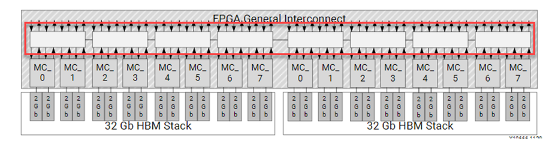

<table width="100%">
 <tr width="100%">
    <td align="center"><h1>Hardware Acceleration Tutorials</h1>
    <a href="https://www.xilinx.com/products/design-tools/vitis.html">See Vitis™ Development Environment on xilinx.com</a>
    </td>
 </tr>
</table>

# HBM Overview

There are some algorithms that are memory bound, limited by the 77GB/s bandwidth available on DDR based Alveo cards. For those applications there are  HBM (High Bandwidth Memory) based  Alveo cards, providing up to 460 GB/s memory bandwidth.  This module will walk you through some of the structural differences between DDR and HBM and introduce how you can take advantage of the higher bandwidth.

DDR memories have been used in cards and computers for decades. There is a memory controller in the FPGA, that talks across traces on the pcb to an on-card DDR module. The memory controller sees all the memory in the DDR module. For Alveo cards with multiple DDR banks, the FPGA needs to implement a memory controller or each DDR modules used in an application.

HBM is a memory technology that takes advantage of newer chip fabrication techniques to allow for more bandwidth and more bandwidth/watt than traditional DDR implementations. Memory manufacturer uses stacked die and through silicon via chip fabrication techniques to stack multiple smaller DDR based memories into a single larger faster memory stack.

For the Alveo implementation, two 16-layer HBM (HBM2 specification) stacks are incorporated into the FPGA package - connected into the FPGA fabric with an interposer. The implementation provides:

- 8GB HBM memory
- 32 HBM Pseudo Channels (PC), sometime also referred as banks, each of 256MB (2Gb)
- An independent AXI channel for communication with the FPGA through a segmented crossbar switch per pseudo channel
- A 2-channel memory controller per 2 PCs
- 14.375 GB/s max theoretical bandwidth per PC
- 460 GB/S ( 32 * 14.375 GB/s) max theoretical bandwidth for the HBM sub-system and 420 GB/s (~ 90 % efficiency) achievable bandwidth

Each pseudo channel has a max theoretical performance of 14.375 GB/s, less than the theoretical 19.25 GB/s for a DDR channel. To get better than DDR performance, designs must use multiple AXI masters efficiently into the HBM subsystem.

The figure below will help you visualize HBM sub-system and FPGA connectivity from the 32 AXI channels (shown by the 32 pairs of up/down arrows) , into the segmented crossbar switch  (shown by the 8 white boxes highlighted in red),  to the memory controllers leading to the pseudo channels:

The crossbar switch is hardened switch. It offers great flexibility with little change to application i.e. simple reconfiguration of memory specification. The switch also consumes very little logic for this flexibility leaving the Alveo device open for more kernel logic.

The segmented crossbar switch can become the bottleneck impacting an applications actual HBM performance.
 Lets review the structure of the switch to better understand how to use it. The switch is composed of eight 4x4 switch segments. The 4x4 segment is detailed below

The fastest connections are from an AXI channel to the memory address of the aligned PC, M0→S0 (0-256MB), M1->S1(256-512MB), and etc. That would limit a design to accessing 32 individual PCs of 256MB segments each. For a performance trade off, the segmented crossbar switch allows any AXI master to access any of the addresses in the 8GB HBM range. This is different compared to DDR configurations where if an AXI master port is connected to DDR0, then only the addresses within DDR0 can be accessed. For HBM, if an address is outside the aligned PC, then it will traverse the segmented crossbar to get to the correct PC, via the local 4x4 connectivity shown above, or traversing to another 4x4 switch on the L/R connections.
When you instruct the tools to connect one master AXI interface to multiple PC, there is a an internal mechanism that uses the memory specification for a particular kernel master.

Performance will be impacted by two factors
- Each connection in the switch has the same bandwidth.
- Crossing from 4x4 switch to another 4x4 switch increases latency.

 The fastest connections will be from the AXI master to one of the 4 aligned pseudo channels in the same switch.  If multiple masters are spanning the range, the left ↔ right switch structure can become  bandwidth saturated.

For more information on HBM controller, refer to <a href="https://www.xilinx.com/support/documentation/ip_documentation/hbm/v1_0/pg276-axi-hbm.pdf"> AXI High Bandwidth
Memory Controller v1.0</a>

## Next Steps

In the next step, you will follow the instructions how to migrate a DDR based application to HBM.

<b>
Start the next step: <a href="2_Migrating_to_HBM.md"> Migrate the application to HBM</a>
</b>

 

<b><a href="README.md">Return to Start of Tutorial</a></b>

Copyright&copy; 2020-2022 Xilinx

