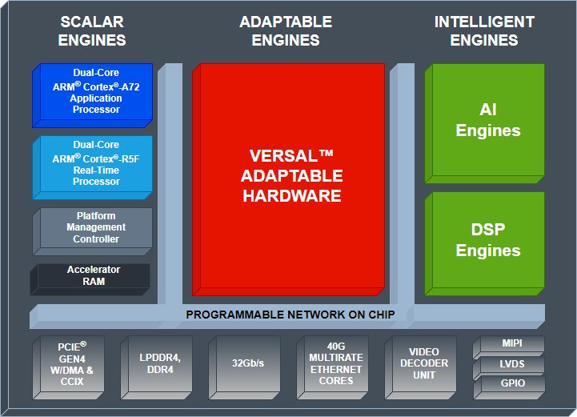
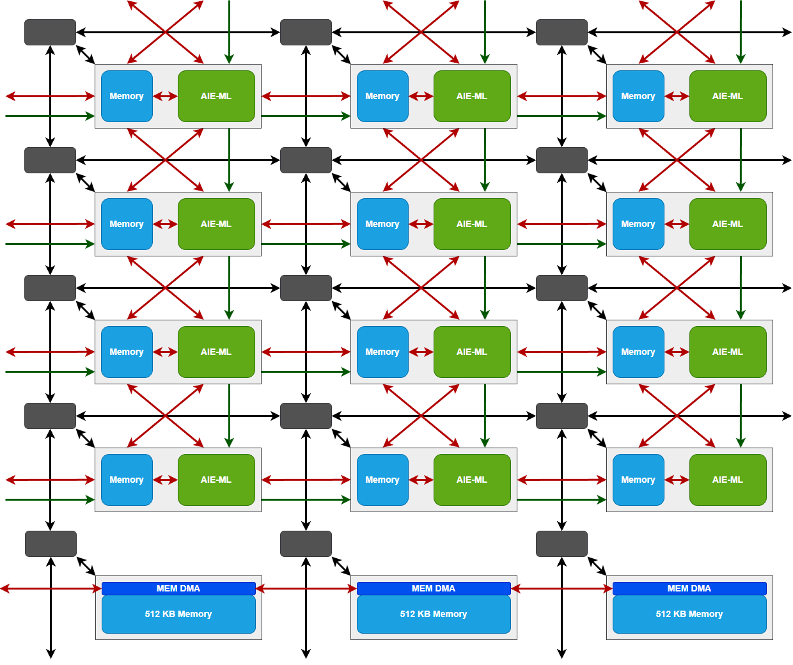

<!-- <table class="sphinxhide" width="100%"> -->
 <tr width="100%">
    <td align="center"><h1>AI Engine Development</h1>
    <a href="https://www.xilinx.com/products/design-tools/vitis.html">See Vitis™ Development Environment on xilinx.com </a>
    <a href="https://www.xilinx.com/products/design-tools/vitis/vitis-ai.html">See Vitis™ AI Development Environment on xilinx.com</a>
    </td>
 </tr>
</table>

# AI Engine-ML Architecture

## Introduction

Versal™ AI Edge ACAPs have been develop to target any applications at the edge where balancing performance and power consumption, low latency, size and thermal constraints, and safety and reliability are paramount.

As the Versal™ AI Core series they contain also an array of SIMD VLIW DSP processors but with different functionality.

For detailed information about these devices you can refer to:

- [WP158 ACAP at the Edge with the Versal AI Edge Series](https://www.xilinx.com/content/dam/xilinx/support/documentation/white_papers/wp518-ai-edge-intro.pdf)
- [Produc Brief: Versal AI Edge Series](https://www.xilinx.com/content/dam/xilinx/publications/product-briefs/xilinx-versal-AI-edge-product-brief.pdf)
- [Versal AI Edge webpage](https://www.xilinx.com/products/silicon-devices/acap/versal-ai-edge.html#productAdvantages)

In this document I will just give a description of the processor array which is the core of this tutorial.

## AI Engine-ML processor array

The SIMD VLIW AI Engine-ML comes as an array of interconnected processors using AXI-Stream interconnect blocks as shown in the following figure:

Differences can be seen at this level compared to the AI Engine that is in the Versal™ AI Core devices:
- At the bottom of the processor array there is 1 (or 2 depending on the device) rows of 512KB memories. These memories can be accessed by the PL and the AI Engine-ML processors through the AXI-Stream interconnect network. DMA channels of 1 memory block has also access to neighbor memories. These memories are called '_shared memories_'
- AI Engine-ML tiles are all oriented the same way
  - Cascade stream is always left-to -right, but also top-to-bottom
  - Neighborhood structure does not depend anymore on the row index

These devices being intended for Machine Learning Inference they have been optimized for this kind of applications:
- Supported datatype  list is:
  - (u)int4, (u)int8, (u)int16, bfloat16
  - Number of 8-bit x 8-bit multipliers doubled
  - Support for 4-bit x 8-bit multiplication (4x more than in previous architecture)
  - bfloat16: 8-bit exponent, 8-bit mantissa --> keeps dynamic but with less mantissa precision that in the standard float32 (SPFP).
- Pipeline is optimized for tensor product
  - permute blocks are no more full crossbars but are limited to specific data selection (tensor products and convolution)
  - AI Engine-ML processors have now access to their own registers. They can program the DMAs of their local memories.
  - Local memory is now 64KB long, always with 8x 128-bit wide banks.

Compute Performance is doubled in 8x8 and 16x16 and quadrupled in 4x8.

## Support

GitHub issues will be used for tracking requests and bugs. For questions, go to [support.xilinx.com](https://support.xilinx.com/).

Copyright © 2023 Advanced Micro Devices, Inc.

<a href="https://www.amd.com/en/corporate/copyright">Terms and Conditions</a>

