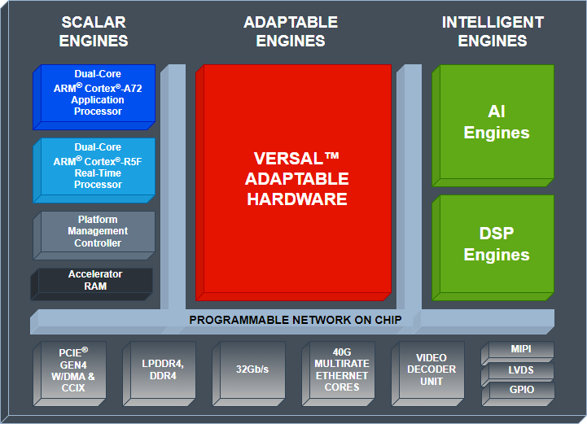
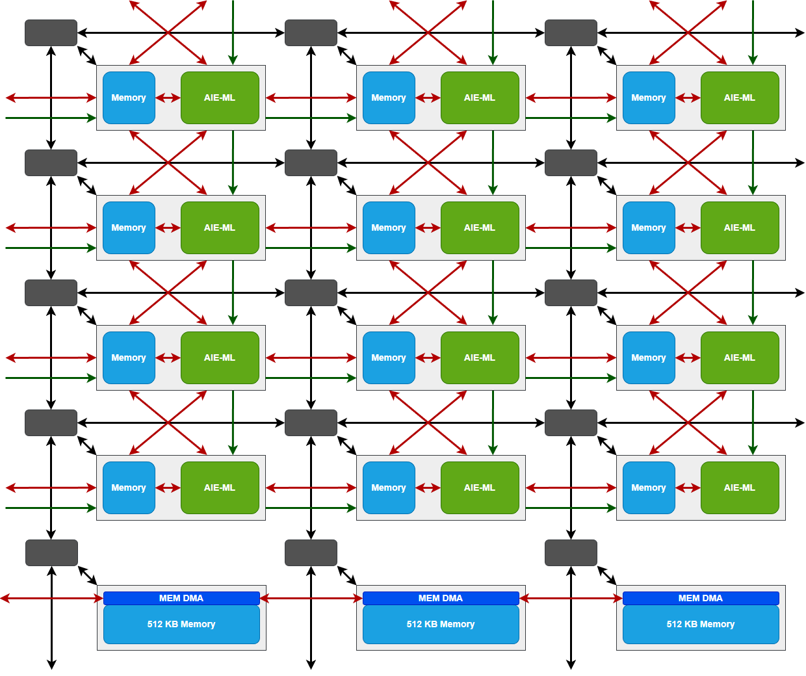

<table class="sphinxhide" style="width:100%;">
  <tr>
    <td align="center">
      <picture>
        <source media="(prefers-color-scheme: dark)" srcset="https://raw.githubusercontent.com/Xilinx/Image-Collateral/main/logo-white-text.png">
        
      </picture>
      <h1>AMD Vitis™ AI Engine Tutorials</h1>
      <a href="https://www.amd.com/en/products/software/adaptive-socs-and-fpgas/vitis.html">See Vitis Development Environment on amd.com</a>
         
      <a href="https://www.amd.com/en/products/software/vitis-ai.html">See Vitis AI Development Environment on amd.com</a>
    </td>
  </tr>
</table>

# AI Engine-ML Architecture

## Introduction

The AMD Versal™ AI Edge Series targets edge applications where you balance performance, power consumption, low latency, size, thermal constraints, safety, and reliability. 

Like the Versal AI Core Series, it contains an array of single instruction multiple data (SIMD), very long instruction word (VLIW) digital signal processor (DSP) processors with different functionality.

For detailed device information, refer to the following documents:

- [WP158 ACAP at the Edge with the Versal AI Edge Series](https://www.xilinx.com/content/dam/xilinx/support/documentation/white_papers/wp518-ai-edge-intro.pdf)
- [Product Brief: Versal AI Edge Series](https://www.xilinx.com/content/dam/xilinx/publications/product-briefs/xilinx-versal-AI-edge-product-brief.pdf)
- [Versal AI Edge webpage](https://www.xilinx.com/products/silicon-devices/acap/versal-ai-edge.html#productAdvantages)

This document describes the processor array, the core of this tutorial.

## AI Engine-ML Processor Array

The single instruction multiple data (SIMD) very long instruction word (VLIW) AI Engine-ML comes as an array of interconnected processors using AXI-Stream interconnect blocks, as shown in the following figure:

Differences from the AI Engine in the Versal™ AI Core devices include the following:
- At the bottom of the processor array, one or two rows of 512 KB memories exist. You can access these memories from the PL and AI Engine-ML processors through the AXI-Stream interconnect network. Direct memory access (DMA) channels of one memory block also access neighbor memories. These memories are referred to as `_shared memories_`
- AI Engine-ML tiles all orient the same way:
  - Cascade stream always flows left-to-right, and top-to-bottom
  - Neighborhood structure no longer depends on the row index

These devices are optimized for machine learning inference:
- Supported datatype list:
  - `(u)int4`, `(u)int8`, `(u)int16`, `bfloat16`
  - Number of 8-bit x 8-bit multipliers doubled
  - Support for 4-bit x 8-bit multiplication (four times more than in previous architecture)
  - `bfloat16`: 8-bit exponent, 8-bit mantissa keeps dynamic but with less mantissa precision that in the standard `float32` single precision floating point (SPFP).
- Pipeline optimization for tensor products:
  - Permute blocks are limited to specific data selection tensor products and convolution.
  - AI Engine-ML processors access to their own registers. They can program the DMAs of local memories.
  - Each local memory is now 64 KB with eight times 128-bit wide banks.

You get double compute performance for 8×8 and 16×16 and quadruple for 4×8 operations.

## Support

Track requests and bugs through GitHub issues. For questions, visit [support.xilinx.com](https://support.xilinx.com/).

Copyright © 2026 Advanced Micro Devices, Inc.

<a href="https://www.amd.com/en/corporate/copyright">Terms and Conditions</a>

