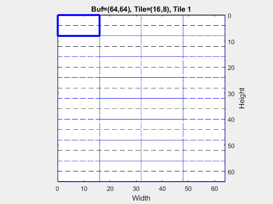
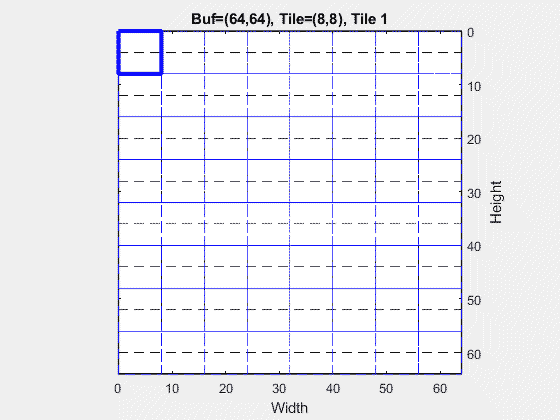
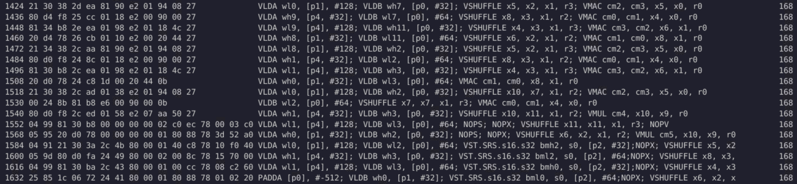

<table class="sphinxhide" width="100%">
 <tr width="100%">
    <td align="center"><h1>AIE-ML Development</h1>
    <a href="https://www.xilinx.com/products/design-tools/vitis.html">See Vitis™ Development Environment on xilinx.com</br></a>
    <a href="https://www.xilinx.com/products/design-tools/vitis/vitis-ai.html">See Vitis™ AI Development Environment on xilinx.com</br></a>
    </td>
 </tr>
</table>

# Compute Optimization

## AI Engine-ML matrix multiplication Instruction Set


The *AI Engine-ML* has specific hardware instructions for matrix multiplications. Depending on the bitwidth of the operands, various matrix sizes are supported. In the following table the notation `MxKxN` means that matrix multiplication with a first operand of size M rows x K columns and a second operand of size K rows x N columns is supported.

**Matrix Multiplication modes for real types**

| 8b x 4b | 8b x 8b | 16b x 8b | 8b x 16b | 16b x 16b | 32b x 16b | 16b x 32b | 32b x 32b | bfloat16 x bfloat16
|---|---|---|---|---|---|---|---|---|
|  4x16x8 | 4x8x4  | 4x4x4  | 4x4x8  | 4x4x4  | 2x4x8  | 2x4x8  |  4x2x4 |  4x8x4 |
|  8x16x8 | 4x16x4 | 8x4x4  | 4x4x4  | 2x4x8  | 4x4x4  | 4x4x4  |  4x2x4 |   |
|  4x32x8 | 8x8x4  | 4x8x4  |        | 4x4x8  |  4x2x4 |   | 8x2x4  |   |
|         | 2x8x8  | 4x4x8  |        | 4x2x8  |        |   |   |   |
|         | 4x8x8  |        |        |        |        |   |   |   |
|         | 2x16x8 |        |        |        |        |   |   |   |
|         | 4x16x8 |        |        |        |        |   |   |   |


**Matrix Multiplication modes for complex types**


| c16b x 16b | c16b x c16b | c32b x c16b | c32b x c32b |
|---|---|---|---|
|  2x4x8 | 1x4x8  | 1x2x4  | 1x2x8  |
| 4x4x4  |   | 1x2x8  |   |
|   |   |  2x2x8 |   |
|   |   |  1x4x8 |   |
|   |   |  2x4x8 |   |

## IO or Compute bound?

One thing is to support a matrix multiply of some size, another is to verify that the 2 loads, the store and the compute are equally optimized.

A complete table of the matrix multiply efficiency, including matrices load and vector compute, can be seen here:
e[Performance Table](FullAIEMLTable.md)


### Example 1

For example let's take the first element of the table which is 8b x 4b with a matrix size of 4x16x8:

- The sub matrix **A** is of size 4x16 on 8 bits which is 512 bits: 2 clocks cycles are necessary to load it
- The sub matrix **B** is of size 16x8 on 4 bits which is 512 bits: 2 clocks cycles are necessary to load it
- The sub matrix **C** is of size 4x8 on 16 or 32 bits which is 512 or 1024 bits: 2 or 4 clocks cycles are necessary to store it
- Finally, 512 MACs must be performed for this matrix which can be done in 1 clock cycles.

The overall efficiency is 50% (result in 16 bits) or 25% (results in 32 bits): 2 or 4 clock cycles for load/store, 1 clock cycle for the compute.

### Tutorial Example

In this tutorial, the matrix sizes are the same but the input data type is `int8` for both **A** and **B** matrices but the output data type can be either `int16` or `int32`.

- The sub matrix **A** is of size 4x16 on 8 bits which is 512 bits: 2 clocks cycles are necessary to load it
- The sub matrix **B** is of size 16x8 on 8 bits which is 1024 bits: 4 clocks cycles are necessary to load it
- The sub matrix **C** is of size 4x8 on 16 or 32 bits which is 512 or 1024 bits: 2 or 4 clocks cycles are necessary to store it, once every 4 sub-matrix multiplication-accumulation.
- Finally, 512 MACs must be performed for this matrix which can be done in 2 clock cycles (256 int8 x int8 multiplication-accumulations can be performed each cycle).

The overall maximum efficiency is 50%: The limitation comes from the load operation of the **B** sub-matrix.

A simple way to balance load/compute/store operations is to load 2 sub-matrices **A** and 1 sub-matrix **B** to perform 2 multiplication-accumulations for each **B**.

## Code analysis

In this new version of the kernel, we want to load 2 **A** sub-matrices while we load a single **B** sub-matrix. The 2 **A** sub-matrices must belong to the same tile column so that they have to be multiplied by the same **B** sub-matrix.

The simplest id to take 2 **A** tiles just one above the other, and multiply them by the same **B** sub-matrix. On the **C** side, the 2 tiles that will be computed will be also just one above the other.

In order to avoid too many pointer manipulations, the **A** tiles will be read 2 by 2 from Memory Tile so that they will be stored right next to each other in AI Engine ML Memory. **B** tiles will be read as in the previous basic solutions. Similarly to **A**, **C** tiles will be stored side by side in the AI Engine ML Memory. They will be reorganized when copying into the Memory Tile.

This way to do offloads the pointer manipulation to the DMA programming, freeing some scalar processor cycles.

The next 2 animated GIFs will show how **A** matrix is read from the Memory Tile and how **C** matrix is written to it. You can see that I chose to have **super tiles** consisting of 2 sub-matrices one above the other:





These read write orders are obtained using the following tiling parameters:

```C++
adf::tiling_parameters ReadAns_pattern = {
    .buffer_dimension={A_COLS,A_ROWS},
    .tiling_dimension={ATILES_COLS,ATILES_ROWS*2},
    .offset={0,0},
    .tile_traversal={
        {.dimension=0, .stride=ATILES_COLS, .wrap=A_COLS/ATILES_COLS},
        {.dimension=1, .stride=ATILES_ROWS*2, .wrap=A_ROWS/ATILES_ROWS/2}
    }
};

adf::tiling_parameters WriteCns_pattern = {
    .buffer_dimension={C_COLS,C_ROWS},
    .tiling_dimension={CTILES_COLS,CTILES_ROWS*2},
    .offset={0,0},
    .tile_traversal={
        {.dimension=0, .stride=CTILES_COLS, .wrap=C_COLS/CTILES_COLS},
        {.dimension=1, .stride=2*CTILES_ROWS, .wrap=C_ROWS/CTILES_ROWS/2}
    }
};
```

These parameters are very similar to the previous ones except that the vertical dimension is doubled.

The C++ code is also changed as we now load 2 **A** sub-matrices and compute 2 **C** sub matrices per iteration:

```C++
template<typename ITYPE,typename OTYPE, int SHIFT_RESULT>
void ClassicMatMult(adf::input_buffer<ITYPE, adf::extents<adf::inherited_extent, adf::inherited_extent>> &__restrict inA,
adf::input_buffer<ITYPE, adf::extents<adf::inherited_extent, adf::inherited_extent>> &__restrict inB,
adf::output_buffer<OTYPE, adf::extents<adf::inherited_extent, adf::inherited_extent>> &__restrict outC)
{
    constexpr size_t sizeTileA = ATILES_ROWS * ATILES_COLS;
    constexpr size_t sizeTileB = BTILES_ROWS * BTILES_COLS;
    constexpr size_t sizeTileC = CTILES_ROWS * CTILES_COLS;

    constexpr size_t NTilesPerRow_A = A_ROWS / ATILES_ROWS;
    constexpr size_t NTilesPerCol_A = A_COLS / ATILES_COLS;
    constexpr size_t NTilesPerRow_B = B_ROWS / BTILES_ROWS;
    constexpr size_t NTilesPerCol_B = B_COLS / BTILES_COLS;
    constexpr size_t NTilesPerRow_C = C_ROWS / CTILES_ROWS;
    constexpr size_t NTilesPerCol_C = C_COLS / CTILES_COLS;

    auto pA = aie::begin_vector<sizeTileA>(inA);
    auto pB = aie::begin_vector<sizeTileB>(inB);
    auto pC = aie::begin_vector<sizeTileC>(outC);

    aie::mmul<ATILES_ROWS, ATILES_COLS, CTILES_COLS, ITYPE, ITYPE, acc32> ctile1;
    aie::mmul<ATILES_ROWS, ATILES_COLS, CTILES_COLS, ITYPE, ITYPE, acc32> ctile2;

    for (int i = 0; i < NTilesPerRow_C / 2; i++)
    {
        for (int j = 0; j < NTilesPerCol_C; j++)
        chess_prepare_for_pipelining
        chess_loop_range(4, )
        {
            auto a1 = *pA++;
            auto a2 = *pA++;
            auto b = *pB++;
            ctile1.mul(a1, b);
            ctile2.mul(a2, b);

            for (int k = 1; k < NTilesPerCol_A; k++)
            chess_flatten_loop
            {
                a1 = *pA++;
                a2 = *pA++;
                b = *pB++;
                ctile1.mac(a1, b);
                ctile2.mac(a2, b);
            }

            *pC++ = ctile1.template to_vector<OTYPE>(SHIFT_RESULT);
            *pC++ = ctile2.template to_vector<OTYPE>(SHIFT_RESULT);

            pA -= 2 * NTilesPerCol_A; // Back to begining of row
            // For matrix B the next tile is used
        }
        pA += 2 * NTilesPerCol_A;              // Next Row
        pB -= NTilesPerCol_B * NTilesPerRow_B; // Back to begining of matrix B
    }
}
```

The main difference is that we now have 2 `mmul` operators that are used to compute the 2 **C** sub-matrices.

## Running the tutorial

This is done the exact same way as in the previous section replacing `OPT=0` by `OPT=1`.

```BASH
make clean-all OPT=1 data x86 x86sim comparex86
make  OPT=1  aie aiesim compareaie aieviz
```

## Performance Analysis

The following parameters are the same as in the previous section:

- Number of multiplication-accumulations to perform: 64x64x64
- Number of parallel multiplication-accumulations in the SIMD vector processor: 256

The visualization of the profiling information of the optimized version of the kernel gives you enough data to compute vector processor usage efficiency:


|  Kernel Version | #cycles | Efficiency |
|:---|---:|---:|
| 32 bits output | 1750 | 58% |
| 16 bits output | 1121 | 91% |

The 32-bit output version is still not really using very efficiently the hardware because of some difficulties to schedule load/store/compute operations.

The 16-bit output version is doing a frog-leap in performances, **C** sub-matrices storage is fast so it can be interleaved very easily in the inner-loop code.

Let's have a look to this code:



Some lines (1568, 1584, ...) are not fully displayed in the interface, we need to get the original assembly code in the compilation directory (aie/Work1/aie/20_0/Release/20_0.lst). Let's focus on the inner loop delimited by the ZLS/ZLE flags (Zero Overhead Loop Start/End):

```C++
.label ZLS_F_Z14ClassicMatMultIas ... EE_208
.loop_nesting 1
.begin_of_loop
         960    VLDA wl0, [p1], #128;         VLDB wh7, [p0, #32];    VSHUFFLE x5, x2, x1, r3;                VMAC cm2, cm3, x5, x0, r0
         972    VLDA wh9, [p4, #32];          VLDB wl7, [p0], #64;    VSHUFFLE x8, x3, x1, r2;                VMAC cm0, cm1, x4, x0, r0
         984    VLDA wl9, [p4], #128;         VLDB wh11, [p0, #32];   VSHUFFLE x4, x3, x1, r3;                VMAC cm3, cm2, x6, x1, r0
         996    VLDA wh8, [p1, #32];          VLDB wl11, [p0], #64;   VSHUFFLE x6, x2, x1, r2;                VMAC cm1, cm0, x8, x1, r0
        1008    VLDA wl8, [p1], #128;         VLDB wh2, [p0, #32];    VSHUFFLE x5, x2, x1, r3;                VMAC cm2, cm3, x5, x0, r0
        1020    VLDA wh1, [p4, #32];          VLDB wl2, [p0], #64;    VSHUFFLE x8, x3, x1, r2;                VMAC cm0, cm1, x4, x0, r0
        1032    VLDA wl1, [p4], #128;         VLDB wh3, [p0, #32];    VSHUFFLE x4, x3, x1, r3;                VMAC cm3, cm2, x6, x1, r0
        1044    VLDA wh0, [p1, #32];          VLDB wl3, [p0], #64;    VMAC cm1, cm0, x8, x1, r0
        1054    VLDA wl0, [p1], #128;         VLDB wh2, [p0, #32];    VSHUFFLE x10, x7, x1, r2;               VMAC cm2, cm3, x5, x0, r0
        1066                                  VLDB wl2, [p0], #64;    VSHUFFLE x7, x7, x1, r3;                VMAC cm0, cm1, x4, x0, r0
        1076    VLDA wh1, [p4, #32];          VLDB wh3, [p0, #32];    VSHUFFLE x10, x11, x1, r2;              VMUL cm4, x10, x9, r0
        1088    VLDA wl1, [p4], #128;         VLDB wl3, [p0], #64;     NOPS;   NOPX;     VSHUFFLE x11, x11, x1, r3;              NOPV
        1104    VLDA wh0, [p1, #32];          VLDB wh2, [p0, #32];     NOPS;   NOPX;     VSHUFFLE x6, x2, x1, r2;                VMUL cm5, x10, x9, r0
        1120    VLDA wl0, [p1], #128;         VLDB wl2, [p0], #64;     VST.SRS.s16.s32 bmh2, s0, [p2, #32];NOPX;  VSHUFFLE x5, x2, x1, r3;   VMAC cm2, cm4, x7, x8, r0
        1136    VLDA wh1, [p4, #32];          VLDB wh3, [p0, #32];     VST.SRS.s16.s32 bml2, s0, [p2], #64;NOPX;  VSHUFFLE x8, x3, x1, r2;   VMAC cm0, cm5, x11, x8, r0
        1152    VLDA wl1, [p4], #128;         VLDB wl3, [p0], #64;     VST.SRS.s16.s32 bmh0, s0, [p2, #32];NOPX;  VSHUFFLE x4, x3, x1, r3;   VMAC cm3, cm2, x6, x1, r0
.label ZLE_F_Z14ClassicMatMultIas ... EE_416
.end_of_loop
        1168    PADDA [p0], #-512;            VLDB wh0, [p1, #32];     VST.SRS.s16.s32 bml0, s0, [p2], #64;NOPX;   VSHUFFLE x6, x2, x1, r2;   VMAC cm1, cm0, x8, x1, r0
```

In this inner loop code we can see that there are 16 vector instructions VMUL/VMAC out of the 17 lines. This reveals a highly optimized pipelined loop implementation. On almost all lines there are 2 loads and one vector compute instruction, data storage takes only a fourth of the cycles.

## Conclusion

In this section of the tutorial you learnt how to:

- Compute the number of cycles needed to load/store matrices.
- Compute the number of cycles needed to compute a matrix multiplication.
- How to define a strategy to balance IO and compute burden
- How to get access to the assembly code to analyze it.

## Support

GitHub issues will be used for tracking requests and bugs. For questions, go to [support.xilinx.com](https://support.xilinx.com/).

<p class="sphinxhide" align="center"><sub>Copyright © 2023 Advanced Micro Devices, Inc.</sub></p>

<p class="sphinxhide" align="center"><sup><a href="https://www.amd.com/en/corporate/copyright">Terms and Conditions</a></sup></p>
