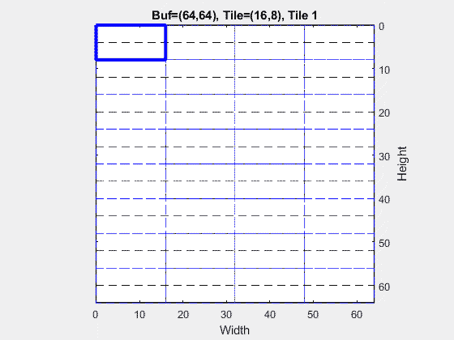
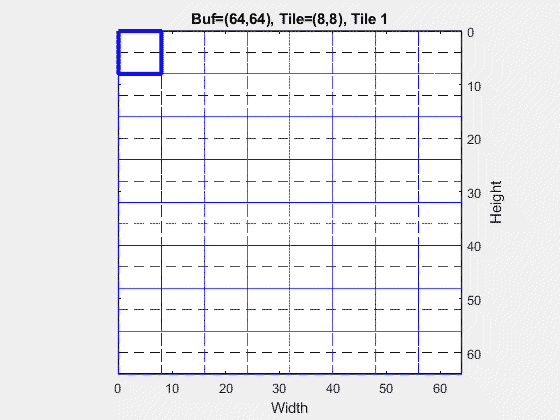
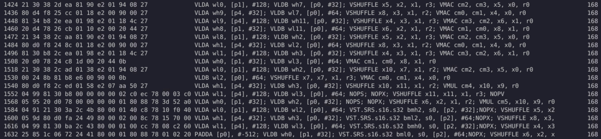

<table class="sphinxhide" style="width:100%;">
  <tr>
    <td align="center">
      <picture>
        <source media="(prefers-color-scheme: dark)" srcset="https://raw.githubusercontent.com/Xilinx/Image-Collateral/main/logo-white-text.png">
        
      </picture>
      <h1>AMD Vitis™ AI Engine Tutorials</h1>
      <a href="https://www.amd.com/en/products/software/adaptive-socs-and-fpgas/vitis.html">See Vitis™ Development Environment on amd.com</a>
        </br>
      <a href="https://www.amd.com/en/products/software/vitis-ai.html">See Vitis™ AI Development Environment on amd.com</a>
    </td>
  </tr>
</table>

# Compute Optimization

## AI Engine-ML Matrix Multiplication Instruction Set


The *AI Engine-ML* includes hardware instructions for matrix multiplication. You can use different matrix sizes based on operand bit-width. In the following table, the notation `MxKxN` means you multiply a first operand with M rows and K columns by a second operand with K rows and N columns. 

**Matrix Multiplication Modes for Real Types**

| 8b x 4b | 8b x 8b | 16b x 8b | 8b x 16b | 16b x 16b | 32b x 16b | 16b x 32b | 32b x 32b | bfloat16 x bfloat16
|---|---|---|---|---|---|---|---|---|
|  4x16x8 | 4x8x4  | 4x4x4  | 4x4x8  | 4x4x4  | 2x4x8  | 2x4x8  |  4x2x4 |  4x8x4 |
|  8x16x8 | 4x16x4 | 8x4x4  | 4x4x4  | 2x4x8  | 4x4x4  | 4x4x4  |  4x2x4 |   |
|  4x32x8 | 8x8x4  | 4x8x4  |        | 4x4x8  |  4x2x4 |   | 8x2x4  |   |
|         | 2x8x8  | 4x4x8  |        | 4x2x8  |        |   |   |   |
|         | 4x8x8  |        |        |        |        |   |   |   |
|         | 2x16x8 |        |        |        |        |   |   |   |
|         | 4x16x8 |        |        |        |        |   |   |   |


**Matrix Multiplication modes for complex types**


| c16b x 16b | c16b x c16b | c32b x c16b | c32b x c32b |
|---|---|---|---|
|  2x4x8 | 1x4x8  | 1x2x4  | 1x2x8  |
| 4x4x4  |   | 1x2x8  |   |
|   |   |  2x2x8 |   |
|   |   |  1x4x8 |   |
|   |   |  2x4x8 |   |

## IO or Compute-bound?

You need to check more than matrix multiplication size support. Verify that the two loads, the store, and the compute remain equally optimized.

You can view a complete efficiency table, including matrix load and vector compute details, here: [Performance Table](FullAIEMLTable.md)


### Example One

For example, take the first element of the table: 8b x 4b with a matrix size of 4x16x8.

- The sub matrix **A** is size 4x16 at 8 bits (512 bits). You need two clock cycles to load it.
- The sub matrix **B** is size 16x8 at 4 bits (512 bits). You need two clock cycles to load it.
- The sub matrix **C** is size 4x8 at 16 or 32 bits (512 or 1024 bits). You need two or four clock cycles to store it.
- You must perform 512 MACs for this matrix, which you can complete in one clock cycle.

Overall efficiency is 50 % (16‑bit results) or 25 % (32‑bit results): two or four cycles for load/store and one cycle for compute.

### Tutorial Example

In this tutorial, the matrix sizes are the same but the input data type is `int8` for both **A** and **B** matrices but the output data type can be either `int16` or `int32`.

- The sub matrix **A** is of size 4x16 on 8 bits which is 512 bits: 2 clocks cycles are necessary to load it
- The sub matrix **B** is of size 16x8 on 8 bits which is 1024 bits: 4 clocks cycles are necessary to load it
- The sub matrix **C** is of size 4x8 on 16 or 32 bits which is 512 or 1024 bits: 2 or 4 clocks cycles are necessary to store it, once every 4 sub-matrix multiplication-accumulation.
- Finally, 512 MACs must be performed for this matrix which can be done in 2 clock cycles (256 int8 x int8 multiplication-accumulations can be performed each cycle).

The overall maximum efficiency is 50%: The limitation comes from the load operation of the **B** sub-matrix.

A simple way to balance load/compute/store operations is to load 2 sub-matrices **A** and 1 sub-matrix **B** to perform 2 multiplication-accumulations for each **B**.

## Code Analysis

In this new version of the kernel, you load two **A** sub-matrices while loading a single **B** sub-matrix. The two **A** sub-matrices must belong to the same tile column so that you multiply them by the same **B** sub-matrix.

The simplest idea is to take two **A** tiles stacked vertically and multiply them by the same **B** sub-matrix. On the **C** side, the two tiles you compute are also stacked vertically.

To avoid excessive pointer manipulations, you read **A** tiles two at a time from the Memory Tile so that they store next to each other in AI Engine ML Memory. You read **B** tiles as in the previous basic solutions. Similarly to **A**, you store **C** tiles side by side in AI Engine-ML memory. You reorganize them when copying into the Memory Tile.

This approach offloads pointer manipulation to direct memory access (DMA) programming, freeing some scalar processor cycles.

The next two animated GIFs show how the **A** matrix is read from the memory tile and how **C** matrix is written to it. You can see that you use **super tiles** cconsisting of two sub-matrices stacked vertically:





You obtain these read write orders using the following tiling parameters:

```C++
adf::tiling_parameters ReadAns_pattern = {
    .buffer_dimension={A_COLS,A_ROWS},
    .tiling_dimension={ATILES_COLS,ATILES_ROWS*2},
    .offset={0,0},
    .tile_traversal={
        {.dimension=0, .stride=ATILES_COLS, .wrap=A_COLS/ATILES_COLS},
        {.dimension=1, .stride=ATILES_ROWS*2, .wrap=A_ROWS/ATILES_ROWS/2}
    }
};

adf::tiling_parameters WriteCns_pattern = {
    .buffer_dimension={C_COLS,C_ROWS},
    .tiling_dimension={CTILES_COLS,CTILES_ROWS*2},
    .offset={0,0},
    .tile_traversal={
        {.dimension=0, .stride=CTILES_COLS, .wrap=C_COLS/CTILES_COLS},
        {.dimension=1, .stride=2*CTILES_ROWS, .wrap=C_ROWS/CTILES_ROWS/2}
    }
};
```

These parameters match the previous ones except the vertical dimension is doubled.

The C++ code also changes, as you now load two **A** sub-matrices and compute two **C** sub-matrices per iteration:

```C++
template<typename ITYPE,typename OTYPE, int SHIFT_RESULT>
void ClassicMatMult(adf::input_buffer<ITYPE, adf::extents<adf::inherited_extent, adf::inherited_extent>> &__restrict inA,
adf::input_buffer<ITYPE, adf::extents<adf::inherited_extent, adf::inherited_extent>> &__restrict inB,
adf::output_buffer<OTYPE, adf::extents<adf::inherited_extent, adf::inherited_extent>> &__restrict outC)
{
    constexpr size_t sizeTileA = ATILES_ROWS * ATILES_COLS;
    constexpr size_t sizeTileB = BTILES_ROWS * BTILES_COLS;
    constexpr size_t sizeTileC = CTILES_ROWS * CTILES_COLS;

    constexpr size_t NTilesPerRow_A = A_ROWS / ATILES_ROWS;
    constexpr size_t NTilesPerCol_A = A_COLS / ATILES_COLS;
    constexpr size_t NTilesPerRow_B = B_ROWS / BTILES_ROWS;
    constexpr size_t NTilesPerCol_B = B_COLS / BTILES_COLS;
    constexpr size_t NTilesPerRow_C = C_ROWS / CTILES_ROWS;
    constexpr size_t NTilesPerCol_C = C_COLS / CTILES_COLS;

    auto pA = aie::begin_vector<sizeTileA>(inA);
    auto pB = aie::begin_vector<sizeTileB>(inB);
    auto pC = aie::begin_vector<sizeTileC>(outC);

    aie::mmul<ATILES_ROWS, ATILES_COLS, CTILES_COLS, ITYPE, ITYPE, acc32> ctile1;
    aie::mmul<ATILES_ROWS, ATILES_COLS, CTILES_COLS, ITYPE, ITYPE, acc32> ctile2;

    for (int i = 0; i < NTilesPerRow_C / 2; i++)
    {
        for (int j = 0; j < NTilesPerCol_C; j++)
        chess_prepare_for_pipelining
        chess_loop_range(4, )
        {
            auto a1 = *pA++;
            auto a2 = *pA++;
            auto b = *pB++;
            ctile1.mul(a1, b);
            ctile2.mul(a2, b);

            for (int k = 1; k < NTilesPerCol_A; k++)
            chess_flatten_loop
            {
                a1 = *pA++;
                a2 = *pA++;
                b = *pB++;
                ctile1.mac(a1, b);
                ctile2.mac(a2, b);
            }

            *pC++ = ctile1.template to_vector<OTYPE>(SHIFT_RESULT);
            *pC++ = ctile2.template to_vector<OTYPE>(SHIFT_RESULT);

            pA -= 2 * NTilesPerCol_A; // Back to begining of row
            // For matrix B the next tile is used
        }
        pA += 2 * NTilesPerCol_A;              // Next Row
        pB -= NTilesPerCol_B * NTilesPerRow_B; // Back to begining of matrix B
    }
}
```

The main difference is that you now use two `mmul` operators to compute the two **C** sub-matrices.

## Running the Tutorial

You run this the exact same way as in the previous section, replacing `OPT=0` with `OPT=1`.

```BASH
make clean-all OPT=1 data x86 x86sim comparex86
make  OPT=1  aie aiesim compareaie aieviz
```

## Performance Analysis

The following parameters are the same as in the previous section:

- Number of multiplication-accumulations to perform: 64x64x64
- Number of parallel multiplication-accumulations in the SIMD vector processor: 256

The visualization of the profiling information of the optimized version of the kernel gives you enough data to compute vector processor usage efficiency:


|  Kernel Version | #cycles | Efficiency |
|:---|---:|---:|
| 32 bits output | 1750 | 58% |
| 16 bits output | 1121 | 91% |

The 32-bit output version still does not use the hardware efficiently because of scheduling load, store, and compute operations.

The 16-bit output version makes a large performance jump. **C** sub-matrix storage is fast, so you interleave it easily in inner-loop code.

You can now look at this code:



Some lines (1568, 1584, ...) do not fully display in the interface. You must get the original assembly code from the AIE compilation directory (`aie/Work1/aie/20_0/Release/20_0.lst`). You now focus on the inner loop marked by the zero overhead loop start (ZLS) and zero overhead loop end (ZLE) flags:

```C++
.label ZLS_F_Z14ClassicMatMultIas ... EE_208
.loop_nesting 1
.begin_of_loop
         960    VLDA wl0, [p1], #128;         VLDB wh7, [p0, #32];    VSHUFFLE x5, x2, x1, r3;                VMAC cm2, cm3, x5, x0, r0
         972    VLDA wh9, [p4, #32];          VLDB wl7, [p0], #64;    VSHUFFLE x8, x3, x1, r2;                VMAC cm0, cm1, x4, x0, r0
         984    VLDA wl9, [p4], #128;         VLDB wh11, [p0, #32];   VSHUFFLE x4, x3, x1, r3;                VMAC cm3, cm2, x6, x1, r0
         996    VLDA wh8, [p1, #32];          VLDB wl11, [p0], #64;   VSHUFFLE x6, x2, x1, r2;                VMAC cm1, cm0, x8, x1, r0
        1008    VLDA wl8, [p1], #128;         VLDB wh2, [p0, #32];    VSHUFFLE x5, x2, x1, r3;                VMAC cm2, cm3, x5, x0, r0
        1020    VLDA wh1, [p4, #32];          VLDB wl2, [p0], #64;    VSHUFFLE x8, x3, x1, r2;                VMAC cm0, cm1, x4, x0, r0
        1032    VLDA wl1, [p4], #128;         VLDB wh3, [p0, #32];    VSHUFFLE x4, x3, x1, r3;                VMAC cm3, cm2, x6, x1, r0
        1044    VLDA wh0, [p1, #32];          VLDB wl3, [p0], #64;    VMAC cm1, cm0, x8, x1, r0
        1054    VLDA wl0, [p1], #128;         VLDB wh2, [p0, #32];    VSHUFFLE x10, x7, x1, r2;               VMAC cm2, cm3, x5, x0, r0
        1066                                  VLDB wl2, [p0], #64;    VSHUFFLE x7, x7, x1, r3;                VMAC cm0, cm1, x4, x0, r0
        1076    VLDA wh1, [p4, #32];          VLDB wh3, [p0, #32];    VSHUFFLE x10, x11, x1, r2;              VMUL cm4, x10, x9, r0
        1088    VLDA wl1, [p4], #128;         VLDB wl3, [p0], #64;     NOPS;   NOPX;     VSHUFFLE x11, x11, x1, r3;              NOPV
        1104    VLDA wh0, [p1, #32];          VLDB wh2, [p0, #32];     NOPS;   NOPX;     VSHUFFLE x6, x2, x1, r2;                VMUL cm5, x10, x9, r0
        1120    VLDA wl0, [p1], #128;         VLDB wl2, [p0], #64;     VST.SRS.s16.s32 bmh2, s0, [p2, #32];NOPX;  VSHUFFLE x5, x2, x1, r3;   VMAC cm2, cm4, x7, x8, r0
        1136    VLDA wh1, [p4, #32];          VLDB wh3, [p0, #32];     VST.SRS.s16.s32 bml2, s0, [p2], #64;NOPX;  VSHUFFLE x8, x3, x1, r2;   VMAC cm0, cm5, x11, x8, r0
        1152    VLDA wl1, [p4], #128;         VLDB wl3, [p0], #64;     VST.SRS.s16.s32 bmh0, s0, [p2, #32];NOPX;  VSHUFFLE x4, x3, x1, r3;   VMAC cm3, cm2, x6, x1, r0
.label ZLE_F_Z14ClassicMatMultIas ... EE_416
.end_of_loop
        1168    PADDA [p0], #-512;            VLDB wh0, [p1, #32];     VST.SRS.s16.s32 bml0, s0, [p2], #64;NOPX;   VSHUFFLE x6, x2, x1, r2;   VMAC cm1, cm0, x8, x1, r0
```

In this inner loop, you see 16 vector multiply (VMUL) or vector multiply-accumulate (VMAC) instructions among 17 lines. This reveals a highly optimized pipelined loop implementation. On almost all lines, you execute two loads and one vector compute instruction. Data storage takes only one-fourth of the cycles.

## Conclusion

In this section of the tutorial you learned how to:

- Compute the number of cycles needed to load/store matrices.
- Compute the number of cycles needed to compute a matrix multiplication.
- Define a strategy to balance input/output (I/O) and compute burden
- HAccess the assembly code to analyze it.

## Support

GitHub issues are used for tracking requests and bugs. For questions, go to [support.xilinx.com](https://support.xilinx.com/).

<p class="sphinxhide" align="center"><sub>Copyright © 2023-2026 Advanced Micro Devices, Inc.</sub></p>

<p class="sphinxhide" align="center"><sup><a href="https://www.amd.com/en/corporate/copyright">Terms and Conditions</a></sup></p>
