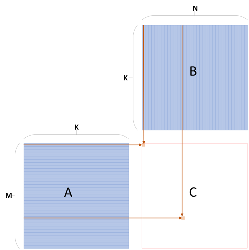
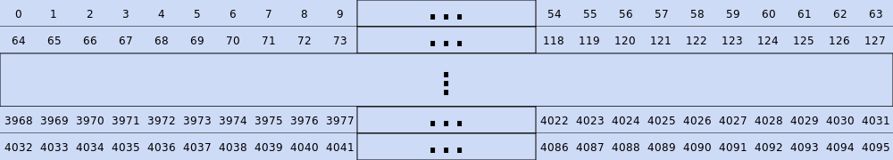
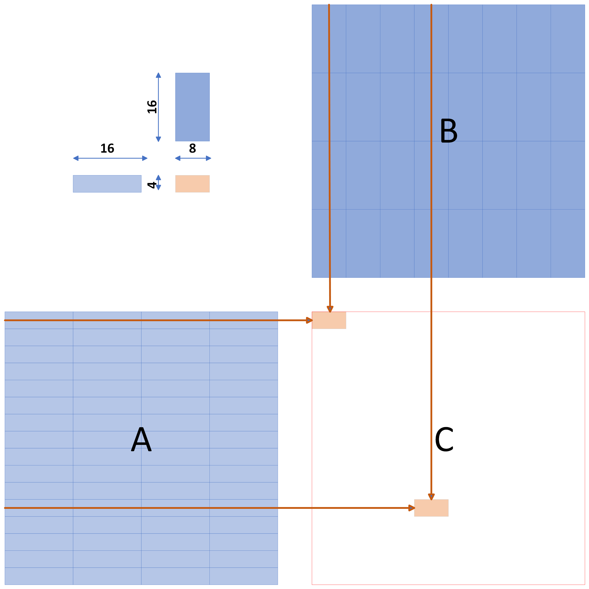
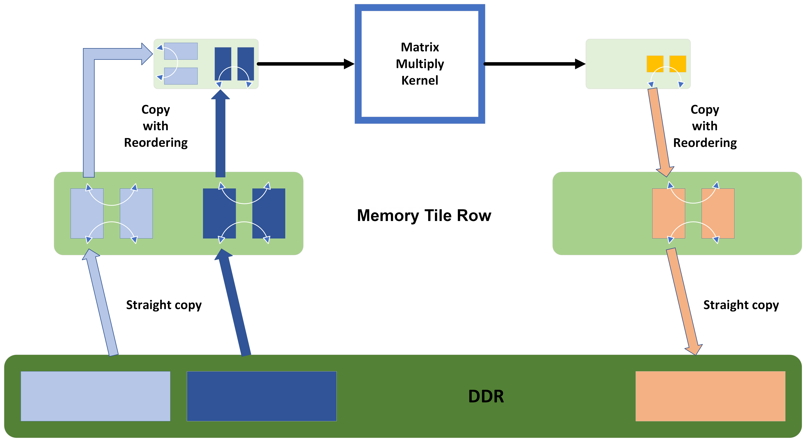
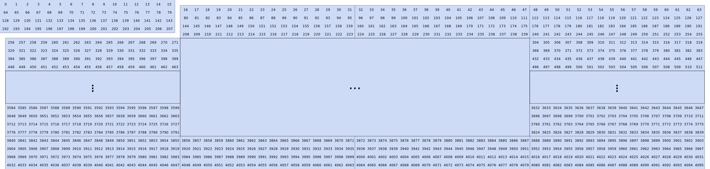
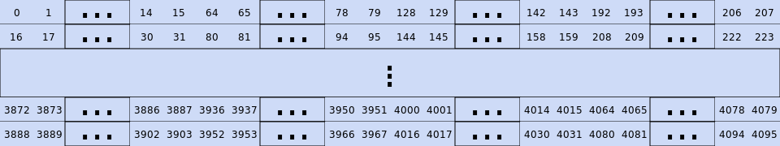
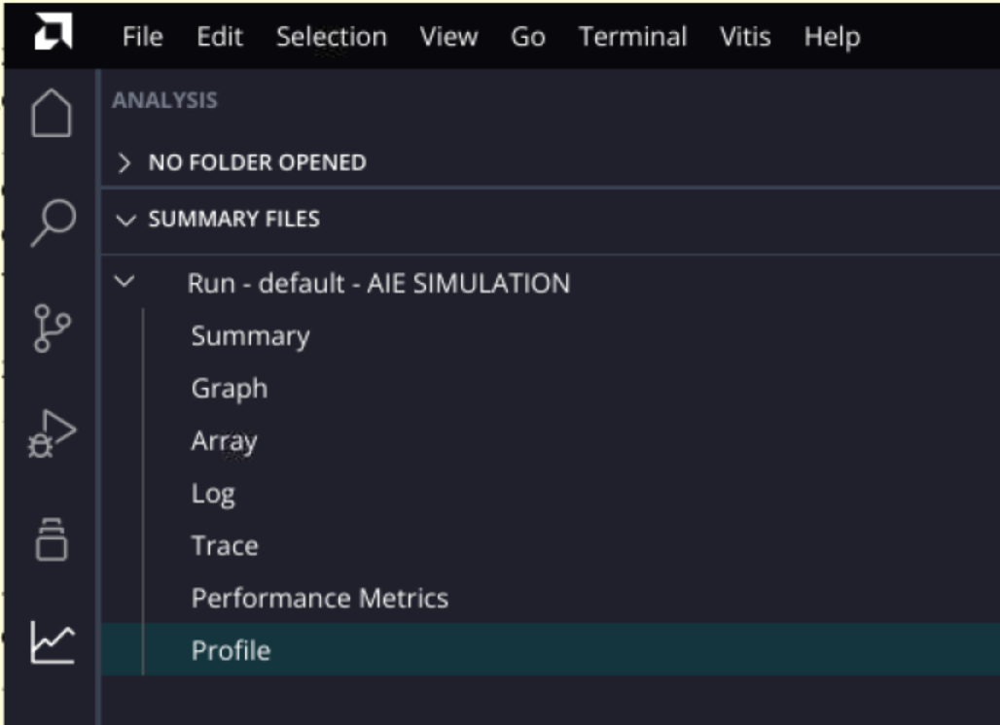
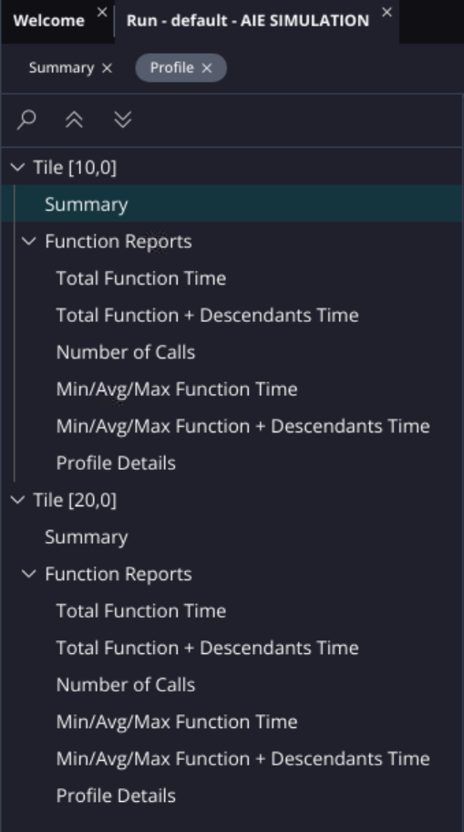
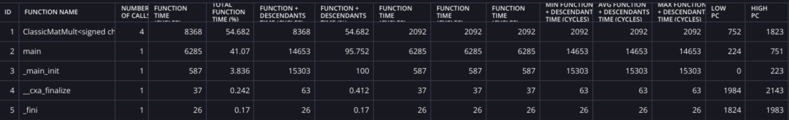
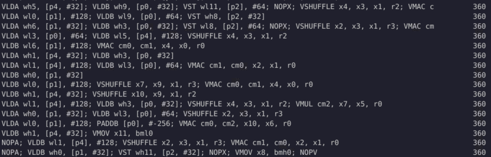

<table class="sphinxhide" width="100%">
 <tr width="100%">
    <td align="center"><h1>AIE-ML Development</h1>
    <a href="https://www.xilinx.com/products/design-tools/vitis.html">See Vitis™ Development Environment on xilinx.com</br></a>
    <a href="https://www.xilinx.com/products/design-tools/vitis/vitis-ai.html">See Vitis™ AI Development Environment on xilinx.com</br></a>
    </td>
 </tr>
</table>

# AI Engine-ML Programming

***Version: Vitis 2024.1***

## Introduction

Xilinx introduced the Versal™ AI Edge series, designed to enable AI innovation from the edge to the endpoint. This new series is mainly based on the AI Engine-ML that delivers 4X machine learning compute compared to previous AI Engine architecture and integrates new accelerator RAM with an enhanced memory hierarchy for evolving AI algorithms.

>**IMPORTANT**: Before beginning the tutorial make sure you have installed the Vitis 2024.1 software.  The Vitis release includes all the embedded base platforms including the VEK280 base platform that is used in this tutorial. In addition, do ensure you have downloaded the Common Images for Embedded Vitis Platforms from this link [https://www.xilinx.com/support/download/index.html/content/xilinx/en/downloadNav/embedded-platforms/2023-2.html](https://www.xilinx.com/support/download/index.html/content/xilinx/en/downloadNav/embedded-platforms/2023-2.html)
The ‘common image’ package contains a prebuilt Linux kernel and root file system that can be used with the Versal board for embedded design development using Vitis.
Before starting this tutorial run the following steps:

1. Go to the directory where you have unzipped the Versal Common Image package
2. In a Bash shell run the `/Common Images Dir/xilinx-versal-common-v2024.1/environment-setup-cortexa72-cortexa53-xilinx-linux` script. This script sets up the `SDKTARGETSYSROOT` and `CXX` variables. If the script is not present, you must run the `/Common Images Dir/xilinx-versal-common-v2024.1/sdk.sh`.
3. Set up your `ROOTFS`, and `IMAGE` to point to the `rootfs.ext4` and `Image` files located in the `/Common Images Dir/xilinx-versal-common-v2024.1` directory.
4. Set up your `PLATFORM_REPO_PATHS` environment variable to`$XILINX_VITIS/lin64/Vitis/2024.1/base_platforms`
This tutorial targets VEK280 board for 2024.1 version.

Data generation for this tutorial requires [Python 3](https://www.python.org/downloads/). The following packages are required:

- math
- sys
- numpy
- random


## Objectives

After completing this tutorial, you will be able to:

- Understand the differences between AI Engine and AI Engine-ML architecture.
- How to declare and use shared buffers (memory tiles).
- How to declare and use external buffers (external memory).
- How to program buffer descriptors using tiling parameters

This tutorial is based on matrix multiplication which is a usual algorithm in Machine Learning applications.

## Prerequisite knowledge

To follow this tutorial you need to understand the architecture of the *AI Engine-ML* as well as the art of buffer descriptor programming:

- **AI Engine ML Architecture:**: [am020](https://docs.xilinx.com/r/en-US/am020-versal-aie-ml)
- **Programming Buffer Descriptors with Tiling parameters:** [UG1603](https://docs.xilinx.com/r/en-US/ug1603-ai-engine-ml-kernel-coding)

A short introduction to **AI Engine-ML** architecture is available [here](AIEngineMLArchitecture.md).

The various memory levels contains DMAs used to receive/transfer data to/from memory or Programmable Logic. These DMAs use Buffer Descriptors (BDs) that contains the parameters of these transfers. The best way to program these BDs is to use *Tiling Parameters* that are introduced [here](TilingParametersProgramming.md).

## Matrix Multiplication

Matrix multiplication is very common algorithm that can be found in numerous standard applications. The basic equation is:

```
$$ C = A.B $$
$$ \left( c_{ij} \right)_{\substack{0\leq i \lt M \\ 0 \leq j \lt N}}  =  \sum_{k=0}^{k<K} a_{ik}.b_{kj}$$
```



Natural storage for a matrix is column major: all columns of row 0 are stored csequentially in memory, then
row 1 and so on up to last row o the matrix.
In the following image, index in the boxes shows the increasing address:



## Taking advantage of *AI Engine-ML*  architecture

The *AI Engine-ML* has specific hardware instructions for matrix multiplications. Depending on the bitwidth of the operands, various matrix sizes are supported. In the following table the notation `MxKxN` means that matrix multiplication with a first operand of size M rows x K columns and a second operand of size K rows x N columns is supported.

### Matrix Multiplication modes for real types

| 8b x 4b | 8b x 8b | 16b x 8b | 8b x 16b | 16b x 16b | 32b x 16b | 16b x 32b | 32b x 32b | bfloat16 x bfloat16
|---|---|---|---|---|---|---|---|---|
|  4x16x8 | 4x8x4   | 4x4x4    | 4x4x8    | 4x4x4     | 2x4x8     | 2x4x8     |  4x2x4    |  4x8x4 |
|  8x16x8 | 4x16x4  | 8x4x4    | 4x4x4    | 2x4x8     | 4x4x4     | 4x4x4     |  4x2x4    |   |
|  4x32x8 | 8x8x4   | 4x8x4    |          | 4x4x8     | 4x2x4     |           |  8x2x4    |   |
|         | 2x8x8   | 4x4x8    |          | 4x2x8     |           |   |   |   |
|         | 4x8x8   |          |          |           |           |   |   |   |
|         | 2x16x8  |          |          |           |           |   |   |   |
|         | 4x16x8  |          |          |           |           |   |   |   |


### Matrix Multiplication modes for complex types


| c16b x 16b | c16b x c16b | c32b x c16b | c32b x c32b |
|---|---|---|---|
|  2x4x8 | 1x4x8  | 1x2x4  | 1x2x8  |
| 4x4x4  |   | 1x2x8  |   |
|   |   |  2x2x8 |   |
|   |   |  1x4x8 |   |
|   |   |  2x4x8 |   |

In the example developed in this tutorial the 3 matrices A, B and C are all 64x64 with 8-bit data:

```
$$A_{64x64}.B_{64x64} = C_{64x64}$$
```

The mode `4x16x8` will be used so that we need to decompose matrix **A** into `4x16`sub-matrices, matrix **B** into `16x8`sub-matrices in oder to compute **C** using `4x8` sub-results:



In order to use these matrix multiplication modes we need to have one submatrix stored in a register and the other matrix in another register. Unfortunately, when an AI Engine-ML reads memory, it reads 256 contiguous bits from the memory. Multiple reads would be necessary to read a sub-matrix of the right size. A solution is to re-arrange data so that sub-matrices are in contiguous memory addresses. The *adf* graph API provides a very handy way to do such data ordering manipulation.

Let's first have a look to the chosen architecture for this matrix multiply small application:



 Multiple **A** and **B** matrices are stored in DDR which are copied in a memory tile using ping-pong buffering. These matrices are then copied again to AI Engine-ML memory using also ping-pong buffering. The kernel operates on the 2 stored matrices to compute the output **C** matrix. This matrix is then copied to a memory tile and then DDR. Data reordering can be done either between DDR and memory tile, or between memory tile and AI Engine-ML memory. The latter choice has been done.

The goal of the reordering is to be able to have the sub-matrices needed by the block-based matrix multiplication in adjacent addresses. As we will compute the resulting matrix **C** block rows by block rows, the sub-blocks of matrix **A** will be stored row by row and the one of matrix **B** will be stored column by column. Computing the first row of **C** will require the user to read 8 times the first row of block of **A** and the full matrix **B** block column by block column.

In first place the block must be extracted using memory tile DMA and stored in the AI Engine-ML memory. The tiling has to occur when reading from the memory tile because it is currently impossible to provide a read or a write access pattern to the AI Engine-ML memory.



 The first block, on the top-left of the picture is first extracted and stored row by row on the AI Engine-ML memory. The second block, starting with the column vector **(8,72, 136, 200)** is then also extracted from the memory tile and stored in the AI Engine-ML memory. Finally we obtain the following re-arrangement of the data:



## AI Engine-ML code analysis

This tutorial has been built to allow the user to easily change matrices and sub-matrices sizes. Matrix **A** being of size **(M,K)** and matrix **B** of size **(K,N)**, the resulting matrix **C** has size **(M,N)**. The `Makefile` defines these default values to 64 (`sizeM, sizeK, sizeN`). The size of the sub-matrices used by the AIE API is also defined (`subM, subK, subN`). All these values can be overriden in the `make` command line.

In this part we focus on a straightforward implementation of the matrix multiply which will be selected by the macro `OPTIMIZED_SOURCE = 0`. The `make` command will be invoked using `make OPT=0 ...` which is actually the default.

```MAKEFILE
# Default values for A, B, C matrix sizes
# A:MxK    B:KxN    C:MxN
sizeM ?= 64
sizeK ?= 64
sizeN ?= 64

# Default for A, B and C sub matrices
# 4x16x8
subM ?= 4
subK ?= 16
subN ?= 8

#Default Number of iterations
NIterations ?= 16
```

The `system_settings.h` header file defines all the sizes that will be used internally by the kernel:

```C++
// Multiply 2 matrices   (MxK) x (KxN)
#define A_ROWS sizeM
#define A_COLS sizeK

#define B_ROWS A_COLS
#define B_COLS sizeN

#define C_ROWS A_ROWS
#define C_COLS B_COLS

// Non Sparse Tiling: 4x16x8
#define ATILES_ROWS_NS subM
#define ATILES_COLS_NS subK
#define BTILES_ROWS_NS ATILES_COLS_NS
#define BTILES_COLS_NS subN
#define CTILES_ROWS_NS ATILES_ROWS_NS
#define CTILES_COLS_NS BTILES_COLS_NS
```

As explained in previous section, the matrices will be transferred from DDR to memory tile without any change, and then from memory tile to *AI Engine-ML* memory with a reordering of the data to make them easier to read from the kernel.

Even the write access pattern to the memory tile on the input side as well as read access pattern on the output side is just linear contiguous addressing, it needs to be specified in the graph. All these tiling parameters are defined in the file `tiling_parameters.h`. Let's have a look to these parameters for the input matrix **A**:

```cpp
adf::tiling_parameters WriteAns_pattern = {
    .buffer_dimension={A_COLS,A_ROWS},
    .tiling_dimension={A_COLS,1},
    .offset={0,0},
    .tile_traversal={
        {.dimension=1, .stride=1, .wrap=A_ROWS}
    }
};

adf::tiling_parameters ReadAns_pattern = {
    .buffer_dimension={A_COLS,A_ROWS},
    .tiling_dimension={ATILES_COLS_NS,ATILES_ROWS_NS},
    .offset={0,0},
    .tile_traversal={
        {.dimension=0, .stride=ATILES_COLS_NS, .wrap=A_COLS/ATILES_COLS_NS},
        {.dimension=1, .stride=ATILES_ROWS_NS, .wrap=A_ROWS/ATILES_ROWS_NS}
    }
};
```

The matrix is a 2D set of data dimension 0 being the number of columns, dimension 1 being the number of rows. When writing to the memory tile, data is stored column major in the memory. The read access of matrix **A** is completely different as we read the data block by block, each block being a sub-matrix of the matrix multiplication of the API, and we read the blocks column major from the memory (dimension 0 then dimension 1). For the matrix **B** it will be the same except that the block reading will be done row major (dimension 1 then dimension 0). **C** Matrix is written block by block, column major. The following animated GIF gives you the order the various **A, B** and **C** blocks are read and written to memory


The data storage at kernel level is declared as 2D just to clarify the way it is stored but we use data pointers (essentially 1D data access) in the kernel code:

```cpp
std::vector<uint32> DimAin = {
    ATILES_COLS_NS*ATILES_ROWS_NS, // Tile size
    A_ROWS*A_COLS/ATILES_COLS_NS/ATILES_ROWS_NS // Total number of Tiles
};

std::vector<uint32> DimBin = {
    BTILES_COLS_NS*BTILES_ROWS_NS,  // Tile size
    B_ROWS*B_COLS/BTILES_COLS_NS/BTILES_ROWS_NS // Total number of Tiles
};
```


The matrix multiplication kernel is very simple to write as the data have been reordered. Computing a block row of the output matrix requires to read multiple times the same block row of matrix **A** and the entire matrix **B**:

```cpp
template<typename ITYPE,typename OTYPE, int SHIFT_RESULT>
void ClassicMatMult(adf::input_buffer<ITYPE,adf::extents<adf::inherited_extent,adf::inherited_extent>> & __restrict inA,
    adf::input_buffer<ITYPE,adf::extents<adf::inherited_extent,adf::inherited_extent>> & __restrict inB,
    adf::output_buffer<OTYPE,adf::extents<adf::inherited_extent,adf::inherited_extent>> & __restrict outC)
    {
        constexpr size_t sizeTileA = ATILES_ROWS * ATILES_COLS;
        constexpr size_t sizeTileB = BTILES_ROWS * BTILES_COLS;
        constexpr size_t sizeTileC = CTILES_ROWS * CTILES_COLS;

        constexpr size_t NTilesPerRow_A = A_ROWS / ATILES_ROWS;
        constexpr size_t NTilesPerCol_A = A_COLS / ATILES_COLS;
        constexpr size_t NTilesPerRow_B = B_ROWS / BTILES_ROWS;
        constexpr size_t NTilesPerCol_B = B_COLS / BTILES_COLS;
        constexpr size_t NTilesPerRow_C = C_ROWS / CTILES_ROWS;
        constexpr size_t NTilesPerCol_C = C_COLS / CTILES_COLS;

        auto  pA = aie::begin_vector<sizeTileA>(inA);
        auto  pB = aie::begin_vector<sizeTileB>(inB);
        auto  pC = aie::begin_vector<sizeTileC>(outC);

        aie::mmul<ATILES_ROWS, ATILES_COLS, CTILES_COLS, ITYPE, ITYPE, acc32> ctile;

        for (int i = 0; i < NTilesPerRow_C; i++)
        {
            for (int j = 0; j < NTilesPerCol_C; j++)
            chess_prepare_for_pipelining
            {
                auto a = *pA++;
                auto b = *pB++;
                ctile.mul(a, b);

                for (int k = 1; k < NTilesPerCol_A; k++)
                // chess_unroll_loop(*)
                chess_flatten_loop
                {
                    a = *pA++;
                    b = *pB++;
                    ctile.mac(a, b);
                }

                *pC++ = ctile.template to_vector<OTYPE>(SHIFT_RESULT);

                pA -= NTilesPerCol_A; // Back to beginning of row
                // For matrix B the next tile is used
            }
            pA += NTilesPerCol_A;                  // Next Row
            pB -= NTilesPerCol_B * NTilesPerRow_B; // Back to beginning of matrix B
        }
    }
```

Pointers `pA, pB` and `pC` are declared as pointers to data chunks of size equal to the sizes of the various sub-matrices. It makes it very simple to read the sub-matrices and to move the pointers. For each output sub-matrix a row of **A** and a column of **B** is read. **A** rows are contiguous in memory as well as **B** column. This makes easy the pointer evolution: just a post-incrementation. For each new output sub-matrix we need to move the **A** pointer back to the beginning of the row, but **B** pointer can continue its regular evolution. At the end of an output matrix row, the pointer of **A** has to be moved to the beginning of the next **A** row, and **B** pointer has to be reinitialized to the beginning of **B** matrix.

This kernel is built for `int8` input data type and either `int32` or `int16` output data type, in the latter case, a simple right shift of 6 bits is performed to overcome the accumulation on 64 data. In the graph both versions are instantiated in column 10 and 20.

```C++
class TestMatMult: public  graph {
public:
    input_plio inA1,inB1;
    output_plio outC1;
    input_plio inA2,inB2;
    output_plio outC2;

    **MatrixMultiply<int8,int32,0,10> MMult1;
    MatrixMultiply<int8,int16,6,20> MMult2;**


    TestMatMult(){

        inA1 = adf::input_plio::create("inputA1",adf::plio_128_bits,"data/inputA_128.txt",250);
        inB1 = adf::input_plio::create("inputB1",adf::plio_128_bits,"data/inputB_128.txt",250);
        outC1 = adf::output_plio::create("outputC1",adf::plio_128_bits,"data/outputCns_128_32b.txt",250);

        adf::connect(inA1.out[0],MMult1.inA);
        adf::connect(inB1.out[0],MMult1.inB);
        adf::connect(MMult1.outC,outC1.in[0]);

        inA2 = adf::input_plio::create("inputA2",adf::plio_128_bits,"data/inputA_128.txt",250);
        inB2 = adf::input_plio::create("inputB2",adf::plio_128_bits,"data/inputB_128.txt",250);
        outC2 = adf::output_plio::create("outputC2",adf::plio_128_bits,"data/outputCns_128_16b.txt",250);

        adf::connect(inA2.out[0],MMult2.inA);
        adf::connect(inB2.out[0],MMult2.inB);
        adf::connect(MMult2.outC,outC2.in[0]);

    };
};
```


## Running the tutorial

This tutorial is Makefile based. You can run X86 and AIE simulations. If you want more detailed simulation you can do hardware emulation (hw_emu). You can also run this tutorial on hardware board.

Testbench creation is quite special as this tutorial is designed to evolve towards sparse matrix multiplication. Data is created so that we can ensure that a sparsity level is satisfied for all sub-matrices. Test vectors are created using a Python script that takes multiple parameters:

- matrix sizes M, K, N
- sub-matrix sizes m, k, n
- number of bits of input data (8, 16, 32)
- number of iterations in the testbench
- required sparsity (1 means full matrix)
- data directory: where to store the generated data files
- PLIO width: 32, 64 or 128 bit. This allows the testbench generator to format correctly the files

After an AIE or X86 simulation you can compare the simulation output with the reference output. This is done either with `make compareaie` or `make comparex86`. For sw_emu and hw_emu, the verification is done within the host code.

```bash
make clean-all OPT=0 data x86 x86sim comparex86
```

This will compile simulate and verify the result for the default size matrices using x86 simulation.

```bash
make sizeK=128 clean-all OPT=0 data x86 x86sim comparex86
```

Will do the same thing but with **A** matrices of size (64,128) and **B** matrices of size (128,64).

AI Engine simulation can be conducted the same way:

```bash
make clean-all OPT=0 data aie aiesim compareaie
```

Finally for hardware emulation `make OPT=0 build_hw_emu` will compile, link and create the package for hardware emulation, and `make OPT=0 launch_hw_emu` will run the hardware emulation. `make OPT=0 run_hw_emu` will chain the two previous commands.

## Performance analysis

After running AIE simulation with 64x64 matrices, we can look at the profiling results with:

```bash
make OPT=0 aieviz
```

This opens up `vitis analyzer` with the run summary displayed. The profile tab is opened clicking on the last section **Profile**:



There are 2 tiles which contain a kernel:

- Column 10: the kernel output data type is int32
- Column 20: the kernel output data type is int16



Let start with the first one which is outputing int32 data. The **Total Function Time** tab will inform us on the number of cycles necessary to compute this matrix multiply:



We can see that the number of cycles to run the entire function is 2092 cycles. If we want to compute the vector processor usage efficiency we have to use the following data:

- number of multiplications to perform: 64 x 64 x 64
- number of parallel int8 x int8 multiplications in the SIMD vector processor: 256

```txt
             64 x 64 x 64
Efficiency = ------------ = 0.49
              2092 x 256
```

This efficiency is not very high and we will see how to improve it in the next part of this tutorial. Anyway we can have a look to the assembly code to verify why we are at this level of performance. The Profile Details tab gives you access to this code:



The inner loop is run 360 times (4 Iterations) and we can see how many VMUL and VMAC operations it contains: 8 VMUL/VMAC instructions out of 16 lines which is close to the 50% efficiency computed above.

An equivalent efficiency can be computed from the 16 bits version of the kernel as the kernel duration is 2089 cycles.

## Conclusion

In this section of the tutorial you learnt how to:

- Declare and use shared buffers (memory tiles).
- Declare and use external buffers (external memory).
- Program buffer descriptors using tiling parameters
- Program matrix multiplication algorithm using AIE API.
- How to compute a vector processor usage efficiency.

A second section of this tutorial will teach you how to optimize this code: [Optimization](ComputeOptimization.md).


## Support

GitHub issues will be used for tracking requests and bugs. For questions, go to [support.xilinx.com](https://support.xilinx.com/).

<p class="sphinxhide" align="center"><sub>Copyright © 2020–2023 Advanced Micro Devices, Inc</sub></p>

<p class="sphinxhide" align="center"><sup><a href="https://www.amd.com/en/corporate/copyright">Terms and Conditions</a></sup></p>
