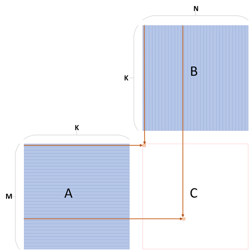
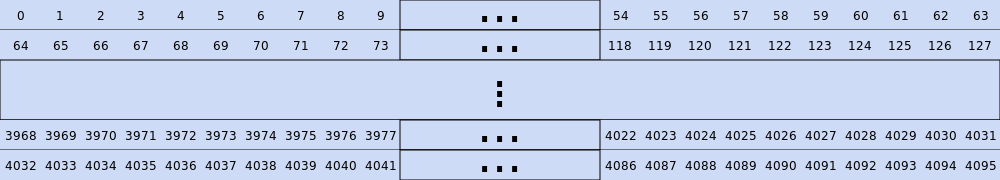
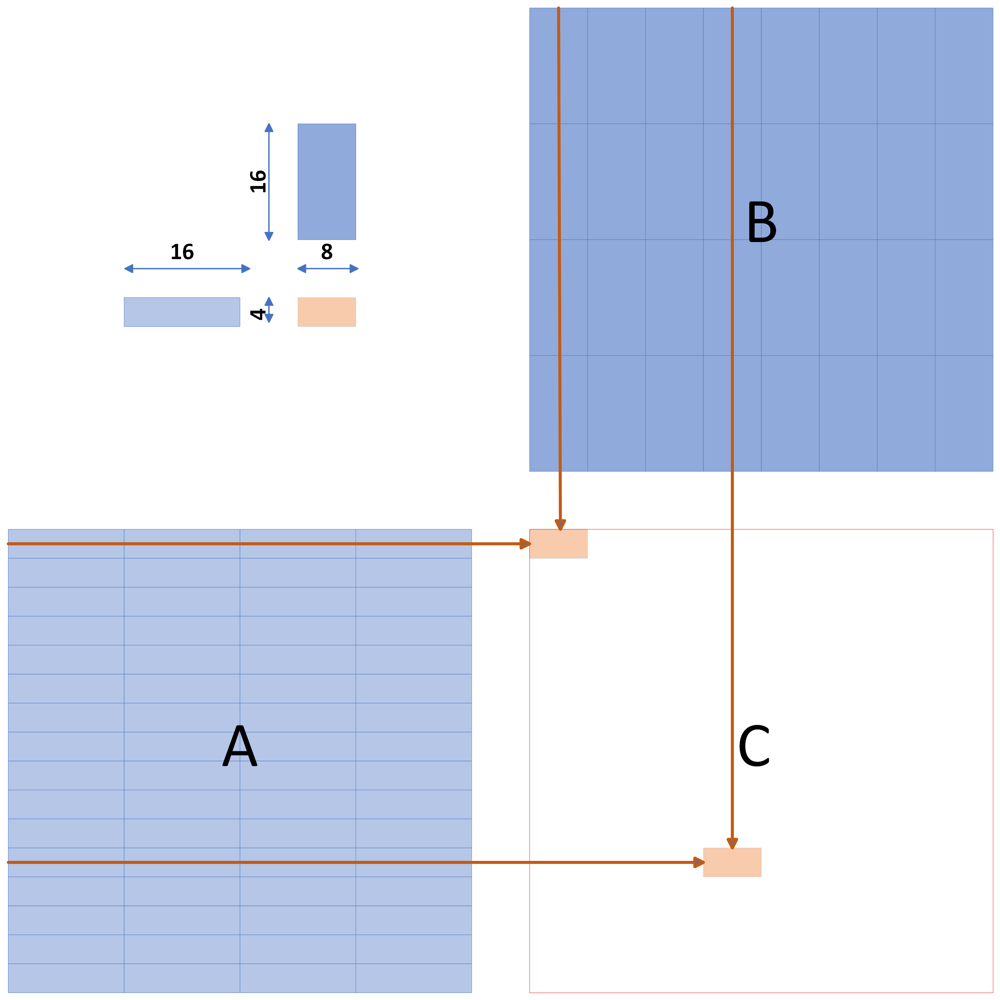
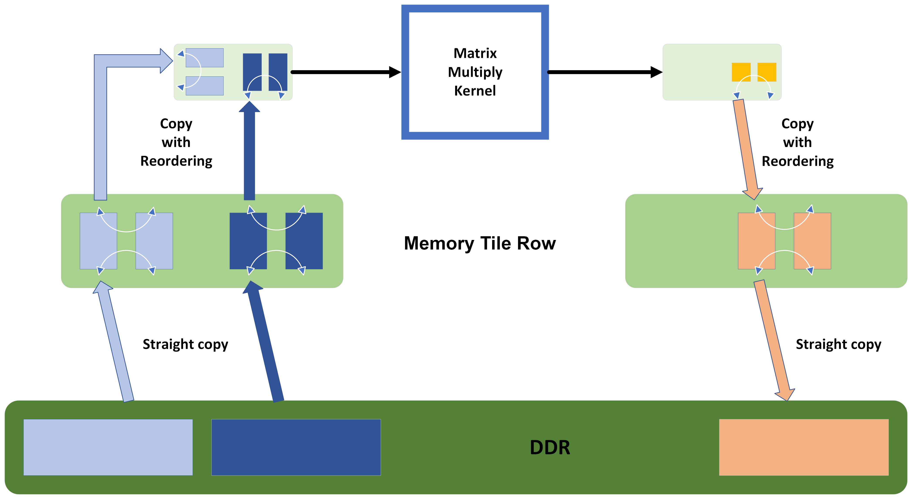
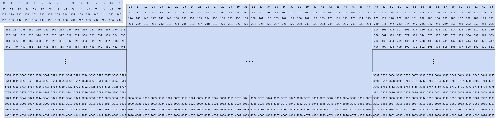
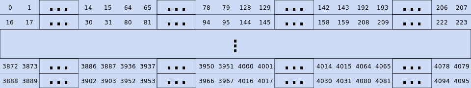
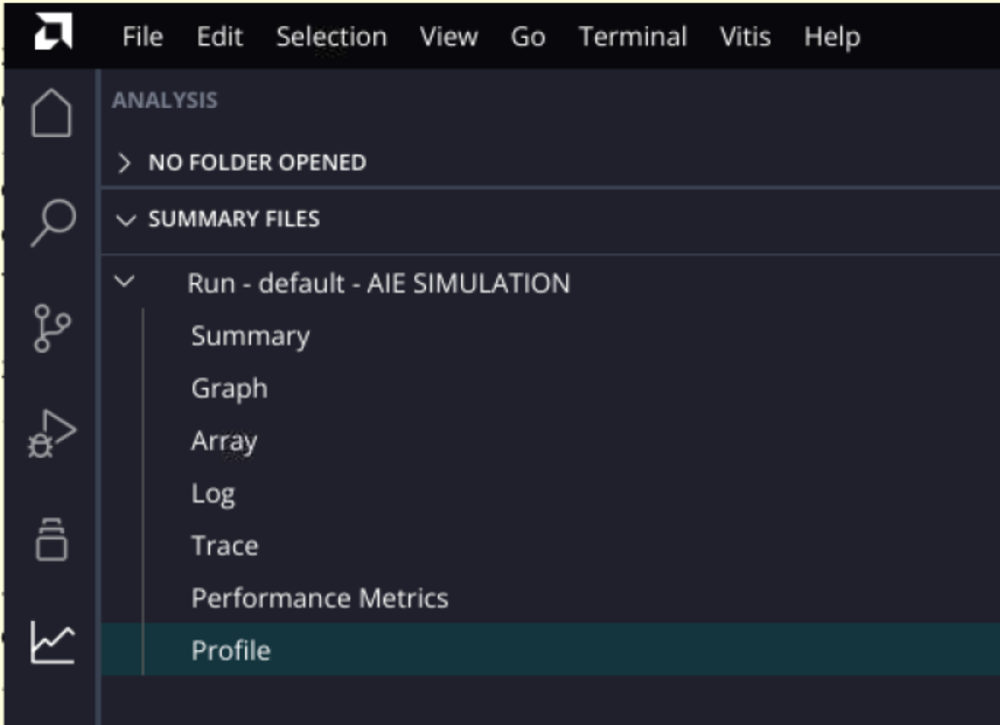
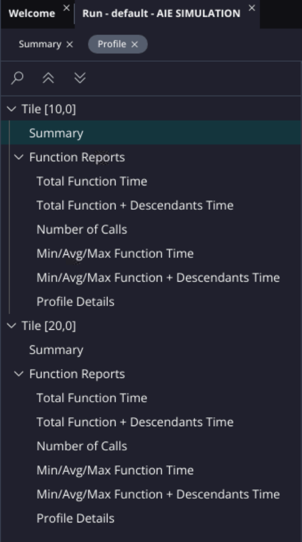
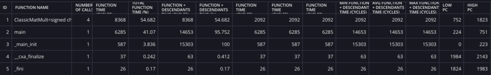
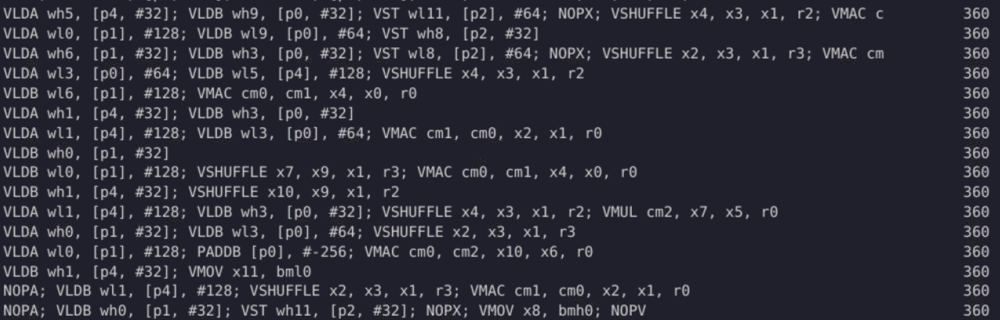

<table class="sphinxhide" style="width:100%;">
  <tr>
    <td align="center">
      <picture>
        <source media="(prefers-color-scheme: dark)" srcset="https://raw.githubusercontent.com/Xilinx/Image-Collateral/main/logo-white-text.png">
        
      </picture>
      <h1>AMD Vitis™ AI Engine Tutorials</h1>
      <a href="https://www.amd.com/en/products/software/adaptive-socs-and-fpgas/vitis.html">See Vitis Development Environment on amd.com</a>
        </br>
      <a href="https://www.amd.com/en/products/software/vitis-ai.html">See Vitis AI Development Environment on amd.com</a>
    </td>
  </tr>
</table>

# AI Engine-ML Programming

***Version: Vitis 2025.2***

## Introduction

>**IMPORTANT**: Before you begin this tutorial, install the Vitis 2025.2 software. This release includes all embedded base platforms, including the VEK280 base platform used in this tutorial. Also download the *Common Images for Embedded Vitis Platforms* from [this link](https://www.xilinx.com/support/download/index.html/content/xilinx/en/downloadNav/embedded-platforms.html).

The *common image* package contains a prebuilt Linux kernel and root file system that you can use with the AMD Versal™ board for embedded design development using the Vitis software platform.

Follow these steps before starting the tutorial:

1. Go to the directory where you unzipped the AMD Versal™ `Common Image` package.
2. In a Bash shell, run the `/Common Images Dir/xilinx-versal-common-v2025.2/environment-setup-cortexa72-cortexa53-amd-linux` script. This script sets up the `SDKTARGETSYSROOT` and `CXX` variables. If the script is not present, run `/Common Images Dir/xilinx-versal-common-v2025.2/sdk.sh`.
3. Set the `ROOTFS` and `IMAGE` variables to point to the `rootfs.ext4` and `Image` files located in the `/Common Images Dir/xilinx-versal-common-v2025.2` directory.
4. Set the `PLATFORM_REPO_PATHS` environment variable to `$XILINX_VITIS/base_platforms`.

This tutorial targets the VEK280 board for 2025.2 version.

You need [Python 3](https://www.python.org/downloads/) with the following packages for data generation:

- `math`
- `sys`
- `numpy`
- `random`

## Objectives

After completing this tutorial, you learn how to:

- Compare AI Engine and AI Engine-ML architectures.
- Declare and use shared buffers (memory tiles).
- Program buffer descriptors with tiling parameters.

This tutorial uses a matrix multiplication example, a common algorithm in machine learning applications.

## Prerequisite Knowledge

Before starting, understand the *AI Engine-ML* architecture and buffer descriptor programming:

- **AI Engine ML Architecture:**: [am020](https://docs.amd.com/r/en-US/am020-versal-aie-ml)
- **Programming Buffer Descriptors with Tiling Parameters:** [UG1603](https://docs.amd.com/r/en-US/ug1603-ai-engine-ml-kernel-coding)

A short introduction to **AI Engine-ML** architecture is available [here](AIEngineMLArchitecture.md).

Memory levels contain DMAs that transfer data between memory and programmable logic (PL). These DMAs use buffer descriptors (BDs) to define transfer parameters. The best way to program BDs is with *tiling parameters* as introduced [here](TilingParametersProgramming.md).

## Matrix Multiplication

Matrix multiplication appears in many applicatons. The basic equation is as follows:

$$ C = A.B $$
$$ \left( c_{ij} \right)_{\substack{0\leq i \lt M \\ 0 \leq j \lt N}}  =  \sum_{k=0}^{k<K} a_{ik}.b_{kj}$$




Natural matrix storage is column-major: all columns of row 0 are stored sequentially, then row 1, and so on.



## Taking Advantage of AI Engine-ML Architecture

The *AI Engine-ML* includes hardware instructions for matrix multiplication. Supported matrix sizes depend on operand bitwidth. When you see `MxKxN`, the first operand has M rows x K columns, the second operand has K rows x N columns.

### Matrix Multiplication Modes for Real Types

| 8b x 4b | 8b x 8b | 16b x 8b | 8b x 16b | 16b x 16b | 32b x 16b | 16b x 32b | 32b x 32b | bfloat16 x bfloat16
|---|---|---|---|---|---|---|---|---|
|  4x16x8 | 4x8x4   | 4x4x4    | 4x4x8    | 4x4x4     | 2x4x8     | 2x4x8     |  4x2x4    |  4x8x4 |
|  8x16x8 | 4x16x4  | 8x4x4    | 4x4x4    | 2x4x8     | 4x4x4     | 4x4x4     |  4x2x4    |   |
|  4x32x8 | 8x8x4   | 4x8x4    |          | 4x4x8     | 4x2x4     |           |  8x2x4    |   |
|         | 2x8x8   | 4x4x8    |          | 4x2x8     |           |   |   |   |
|         | 4x8x8   |          |          |           |           |   |   |   |
|         | 2x16x8  |          |          |           |           |   |   |   |
|         | 4x16x8  |          |          |           |           |   |   |   |


### Matrix Multiplication Modes for Complex Types


| c16b x 16b | c16b x c16b | c32b x c16b | c32b x c32b |
|---|---|---|---|
|  2x4x8 | 1x4x8  | 1x2x4  | 1x2x8  |
| 4x4x4  |   | 1x2x8  |   |
|   |   |  2x2x8 |   |
|   |   |  1x4x8 |   |
|   |   |  2x4x8 |   |

For this tutorial’s example, matrices A, B, and C are all `64x64` with 8-bit data:

$$A_{64x64}.B_{64x64} = C_{64x64}$$

Use mode `4x16x8`. Decompose **A** into `4x16` submatrices, **B** into `16x8` submatrices, and compute **C** from `4x8` sub-results. 



In these matrix multiplication modes, you store one submatrix in one register and another submatrix in a second register. An AI Engine-ML reads 256 contiguous bits from memory at a time. Without rearranging data, you need multiple reads to load one required submatrix. Rearrange data so submatrices occupy contiguous memory addresses. Use the adf graph API to perform this data ordering.

Following is the chosen architecture for this small matrix multiplication application:



 You can store multiple **A** and **B** matrices in double data rate (DDR). Copy them into a memory tile with ping-pong buffering. Then copy these matrices into AI Engine-ML memory the same way. The kernel processes both matrices to compute the **C** matrix, which you copy back to a memory tile and then to DDR. You can reorder data either between DDR and memory tile or between memory tile and AI Engine-ML memory. In this tutorial, you reorder between memory tile and AI Engine-ML memory.

The goal of the reordering is to place the submatrices needed for block-based matrix multiplication in adjacent memory addresses. You compute the resulting matrix **C** block rows by block rows. Store **A** sub-blocks and **B** sub-blocks column by column. When computing the first row of **C**, read eight times from the first row of block in **A** and read all of the **B** column-by-column.

First, extract a block using the memory tile DMA and store it in the AI Engine-ML memory. Perform tiling during the memory tile read, because you cannot currently specify a read or a write access pattern directly to the AI Engine-ML memory.



 You begin by extracting the first block in the top-left of the matrix. Store it row by row in AI Engine-ML memory. Next, extract the block starting with column vector **(8, 72, 136, 200)** from the memory tile and store it in the AI Engine-ML memory. After processing all blocks, you achieve the following data arrangement:



## AI Engine-ML Code Analysis

This tutorial lets you change matrix and submatrix sizes. Matrix **A** has size **(M,K)**, matrix **B** has size **(K,N)**, and matrix **C** has size **(M,N)**. In the `Makefile`, the default values are 64 for `sizeM`, `sizeK`, and `sizeN`. The submatrix size for the AIE API is also defined as `subM`, `subK`, `subN`. You can override any of these values on the `make` command line.

The following scenario uses the basic matrix multiply defined by the macro `OPTIMIZED_SOURCE = 0`. Invoke the `make` command using the default `make OPT=0 ...`. 

```MAKEFILE
# Default values for A, B, C matrix sizes
# A:MxK    B:KxN    C:MxN
sizeM ?= 64
sizeK ?= 64
sizeN ?= 64

# Default for A, B and C sub matrices
# 4x16x8
subM ?= 4
subK ?= 16
subN ?= 8

#Default Number of iterations
NIterations ?= 16
```

The `system_settings.h` header file defines all internal kernel sizes. 

```C++
// Multiply 2 matrices   (MxK) x (KxN)
#define A_ROWS sizeM
#define A_COLS sizeK

#define B_ROWS A_COLS
#define B_COLS sizeN

#define C_ROWS A_ROWS
#define C_COLS B_COLS

// Non Sparse Tiling: 4x16x8
#define ATILES_ROWS_NS subM
#define ATILES_COLS_NS subK
#define BTILES_ROWS_NS ATILES_COLS_NS
#define BTILES_COLS_NS subN
#define CTILES_ROWS_NS ATILES_ROWS_NS
#define CTILES_COLS_NS BTILES_COLS_NS
```

As previously explained, you transfer matrices from DDR to the memory tile without changes. Then, you transfer them to AI Engine-ML memory with reordered data for easier kernel access.

Even with simple contiguous addressing, you must define read and write patterns in the graph. The file `tiling_parameters.h` contains these patterns. For example, matrix **A** uses the following: 

```cpp
adf::tiling_parameters WriteAns_pattern = {
    .buffer_dimension={A_COLS,A_ROWS},
    .tiling_dimension={A_COLS,1},
    .offset={0,0},
    .tile_traversal={
        {.dimension=1, .stride=1, .wrap=A_ROWS}
    }
};

adf::tiling_parameters ReadAns_pattern = {
    .buffer_dimension={A_COLS,A_ROWS},
    .tiling_dimension={ATILES_COLS_NS,ATILES_ROWS_NS},
    .offset={0,0},
    .tile_traversal={
        {.dimension=0, .stride=ATILES_COLS_NS, .wrap=A_COLS/ATILES_COLS_NS},
        {.dimension=1, .stride=ATILES_ROWS_NS, .wrap=A_ROWS/ATILES_ROWS_NS}
    }
};
```

Dimension 0 represents the number of columns; dimension 1 represents the number of rows. Write data for the memory tile in column-major order. Read **A** block-by-block, column‑major. Read **B**block‑by‑block, row‑major. Write **C** block‑by‑block, column‑major.

The following GIF shows the read/write order for **A**, **B**, and **C** blocks:


Declare kernel‑level storage as 2D for clarity, even though you use 1D pointer access in code:

```cpp
std::vector<uint32> DimAin = {
    ATILES_COLS_NS*ATILES_ROWS_NS, // Tile size
    A_ROWS*A_COLS/ATILES_COLS_NS/ATILES_ROWS_NS // Total number of Tiles
};

std::vector<uint32> DimBin = {
    BTILES_COLS_NS*BTILES_ROWS_NS,  // Tile size
    B_ROWS*B_COLS/BTILES_COLS_NS/BTILES_ROWS_NS // Total number of Tiles
};
```

Because you reordered data, the multiplication kernel becomes simpler. Computing one **C** block row requires reading the same **A** block row multiple times and all **B** blocks.

```cpp
template<typename ITYPE,typename OTYPE, int SHIFT_RESULT>
void ClassicMatMult(adf::input_buffer<ITYPE,adf::extents<adf::inherited_extent,adf::inherited_extent>> & __restrict inA,
    adf::input_buffer<ITYPE,adf::extents<adf::inherited_extent,adf::inherited_extent>> & __restrict inB,
    adf::output_buffer<OTYPE,adf::extents<adf::inherited_extent,adf::inherited_extent>> & __restrict outC)
    {
        constexpr size_t sizeTileA = ATILES_ROWS * ATILES_COLS;
        constexpr size_t sizeTileB = BTILES_ROWS * BTILES_COLS;
        constexpr size_t sizeTileC = CTILES_ROWS * CTILES_COLS;

        constexpr size_t NTilesPerRow_A = A_ROWS / ATILES_ROWS;
        constexpr size_t NTilesPerCol_A = A_COLS / ATILES_COLS;
        constexpr size_t NTilesPerRow_B = B_ROWS / BTILES_ROWS;
        constexpr size_t NTilesPerCol_B = B_COLS / BTILES_COLS;
        constexpr size_t NTilesPerRow_C = C_ROWS / CTILES_ROWS;
        constexpr size_t NTilesPerCol_C = C_COLS / CTILES_COLS;

        auto  pA = aie::begin_vector<sizeTileA>(inA);
        auto  pB = aie::begin_vector<sizeTileB>(inB);
        auto  pC = aie::begin_vector<sizeTileC>(outC);

        aie::mmul<ATILES_ROWS, ATILES_COLS, CTILES_COLS, ITYPE, ITYPE, acc32> ctile;

        for (int i = 0; i < NTilesPerRow_C; i++)
        {
            for (int j = 0; j < NTilesPerCol_C; j++)
            chess_prepare_for_pipelining
            {
                auto a = *pA++;
                auto b = *pB++;
                ctile.mul(a, b);

                for (int k = 1; k < NTilesPerCol_A; k++)
                // chess_unroll_loop(*)
                chess_flatten_loop
                {
                    a = *pA++;
                    b = *pB++;
                    ctile.mac(a, b);
                }

                *pC++ = ctile.template to_vector<OTYPE>(SHIFT_RESULT);

                pA -= NTilesPerCol_A; // Back to beginning of row
                // For matrix B the next tile is used
            }
            pA += NTilesPerCol_A;                  // Next Row
            pB -= NTilesPerCol_B * NTilesPerRow_B; // Back to beginning of matrix B
        }
    }
```

Pointers `pA, pB`, and `pC` reference chunks equal to submatrix sizes. This lets you read them and advance pointers efficiently. For each **C** submatrix, read one **A** row and one **B** column. **A** rows and **B** columns are stored contiguously, making pointer changes simple (only a post-incrementation). Reset **A** pointer at the start of each new row. Continue **B** pointer until the end of a **C** row, then reset to **B**’s beginning. 

The kernel supports `int8` inputs with `int32` or `int16` outputs. For `int16`, shift right by six bits to normalize accumulation on the 64 data. In the following graph, you instantiate both versions in columns 10 and 20.

```C++
class TestMatMult: public  graph {
public:
    input_plio inA1,inB1;
    output_plio outC1;
    input_plio inA2,inB2;
    output_plio outC2;

    **MatrixMultiply<int8,int32,0,10> MMult1;
    MatrixMultiply<int8,int16,6,20> MMult2;**


    TestMatMult(){

        inA1 = adf::input_plio::create("inputA1",adf::plio_128_bits,"data/inputA_128.txt",250);
        inB1 = adf::input_plio::create("inputB1",adf::plio_128_bits,"data/inputB_128.txt",250);
        outC1 = adf::output_plio::create("outputC1",adf::plio_128_bits,"data/outputCns_128_32b.txt",250);

        adf::connect(inA1.out[0],MMult1.inA);
        adf::connect(inB1.out[0],MMult1.inB);
        adf::connect(MMult1.outC,outC1.in[0]);

        inA2 = adf::input_plio::create("inputA2",adf::plio_128_bits,"data/inputA_128.txt",250);
        inB2 = adf::input_plio::create("inputB2",adf::plio_128_bits,"data/inputB_128.txt",250);
        outC2 = adf::output_plio::create("outputC2",adf::plio_128_bits,"data/outputCns_128_16b.txt",250);

        adf::connect(inA2.out[0],MMult2.inA);
        adf::connect(inB2.out[0],MMult2.inB);
        adf::connect(MMult2.outC,outC2.in[0]);

    };
};
```

## Running the Tutorial

This tutorial uses a Makefile-based workflow. You can run X86 and AI Engine simulations, perform hardware emulation (`hw_emu`) for detailed analysis, or execute the design directly on a hardware board.

The testbench creation process is unique because this tutorial evolves toward sparse matrix multiplication. You generate data so each submatrix meets a required sparsity level. A Python script produces the test vectors based on these parameters:

- Matrix sizes: `M`, `K`, `N`
- Sub-matrix sizes: `m`, `k`, `n`
- Number of bits of input data:  8, 16, 32
- Number of iterations in the testbench
- Required sparsity (use 1 for a fully populated matrix)
- Data directory: location to store the generated data files
- PLIO width: 32, 64, or 128 bit, allowing the testbench generator to format the files correctly

After completing an AI Engine or X86 simulation, compare the simulation output with the reference output. For AI Engine, run `make compareaie`. For X86, run `make comparex86`. For `sw_emu` and `hw_emu` runs, the host code performs output verification automatically.

```bash
make clean-all OPT=0 data x86 x86sim comparex86
```

This command compiles the project, runs the simulation, and verifies the results for the default matrix sizes using X86 simulation. 

To run with **A** matrices of size (64,128) and **B** matrices of size (128,64), use:

```bash
make sizeK=128 clean-all OPT=0 data x86 x86sim comparex86
```

Run the AI Engine simulation in the same way:

```bash
make clean-all OPT=0 data aie aiesim compareaie
```

To prepare and run emulation, use `make OPT=0 build_hw_emu` to compile, link, and create the hardware emulation package. Use `make OPT=0 launch_hw_emu` to run the hardware emulation. Use `make OPT=0 run_hw_emu` to chain both steps into a single command. 

## Performance Analysis

After running the AI Engine simulation with 64x64 matrices, you can view the profiling results with the following:

```bash
make OPT=0 aieviz
```

This opens `Vitis Analyzer` with the run summary displayed. Click the **Profile** tab. 



Two tiles contain kernels:

- Column 10: Kernel output data type is `int32`
- Column 20: Kernel output data type is `int16`



Start with the `int32` kernel. In the **Total Function Time** tab , check the number of cycles required to compute the matrix multiplication:



The number of cycles to run the entire function is 2092. To calculate the vector processor usage efficiency, use the following data:

- Number of multiplications to perform: `64 x 64 x 64`
- Number of parallel `int8 x int8` multiplications in the SIMD vector processor: 256

```txt
             64 x 64 x 64
Efficiency = ------------ = 0.49
              2092 x 256
```

This efficiency is modest. In the next part of this tutorial you learn how to improve efficiency. You can confirm the cause by reviewing the assembly code in the **Profile Details** tab:



The inner loop runs 360 times (four Iterations). Eight out of 16 instructions are `VMUL` or `VMAC`, which is close to the 50% efficiency computed previously.

The `int16` kernel shows similar efficiency, with a total duration of 2089 cycles.

## Conclusion

In this section of the tutorial, you learned how to:

- Declare and use shared buffers (memory tiles).
- Declare and use external buffers (external memory).
- Program buffer descriptors using tiling parameters
- Program matrix multiplication algorithm using AIE API.
- Compute vector processor usage efficiency.

Continue to the next section to learn how to optimize this code: [Optimization](ComputeOptimization.md).


## Support

GitHub issues are used for tracking requests and bugs. For questions, go to [support.xilinx.com](https://support.xilinx.com/).

<p class="sphinxhide" align="center"><sub>Copyright © 2020–2026 Advanced Micro Devices, Inc.</sub></p>

<p class="sphinxhide" align="center"><sup><a href="https://www.amd.com/en/corporate/copyright">Terms and Conditions</a></sup></p>
