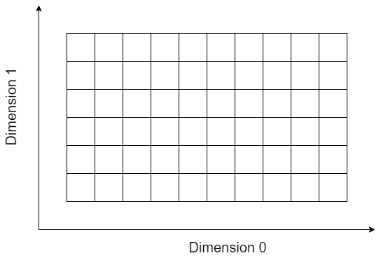
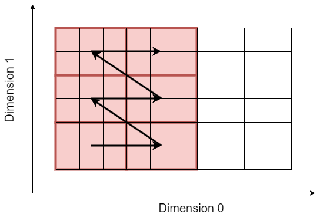
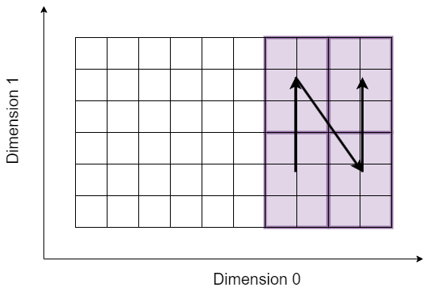
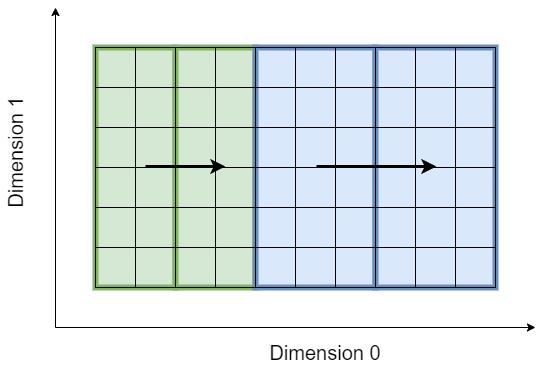
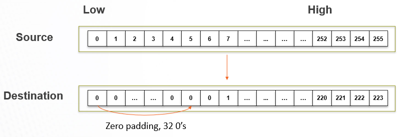
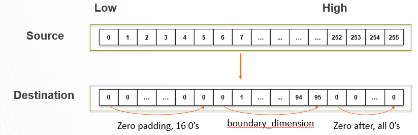
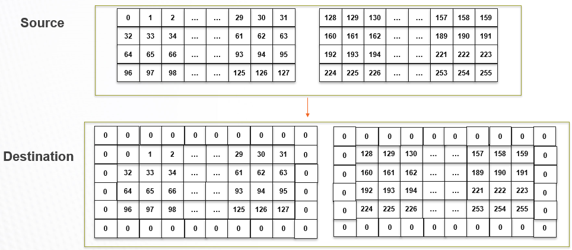

<!-- <table class="sphinxhide" width="100%"> -->
 <tr width="100%">
    <td align="center"><h1>AI Engine Development</h1>
    <a href="https://www.xilinx.com/products/design-tools/vitis.html">See Vitis™ Development Environment on xilinx.com</br></a>
    <a href="https://www.xilinx.com/products/design-tools/vitis/vitis-ai.html">See Vitis™ AI Development Environment on xilinx.com</a>
    </td>
 </tr>
</table>

# Tiling Parameters Programming

## Introduction

There are multiple levels of memory in the AI Engine-ML architecture:

- Memory Module attached to the AI Engine-ML (64kB). Access from the processor or using internal DMA with dedicated address generators (2xMM2S, 2xS2MM).
- memory tile (512 kB): 1 or 2 per column. Access with internal DMAs with dedicated address generator (6xS2MM, 6xMM2S).
- External memory: DDR or HBM which is also addressed by DMAs located in the PL-AIE array interface.

Data in these memories can be seen as a single dimension set of data, but depending on the memory the maximum dimensionality can be 3 (AIE Tile DMA, Interface Tile DMA) or 4 (memory tile DMA). Currently (2022.2) DMA BDs of the memory tile and the Interface Tile can be programmed from within the graph.

This programming process is done through what we call _Tiling Parameters_. These parameters describe how the data should be accessed in the memory on a tile basis. Dimension 0 is the dimesion where the data are contiguous in memory. The overall dimension of the buffer is specified and then the tile dimension and the number of tiles to read in each dimension.

## Tiling parameter structure

The `tiling_parameters`structure is defined as follows:

```C++
  struct tiling_parameters
  {
      /// Buffer dimensions in buffer element type. buffer_dimension[0] is the fast-moving dimension and is contiguous in memory.
      /// When this variable is left unspecified, the dimensions of the associated buffer object will be used.
      std::vector<uint32_t> buffer_dimension;
      /// Tiling dimensions in buffer element type.
      std::vector<uint32_t> tiling_dimension;
      /// Multi-dimensional offset w.r.t. buffer starting element. Assuming buffer dimension is specified.
      std::vector<int32_t> offset;
      /// Vector of traversing_parameters. tile_traversal[i] represents i-th loop of inter-tile traversal,
      /// where i=0 represents most inner loop and i=N-1 represents most outer loop.
      std::vector<traversing_parameters> tile_traversal;
      /// Output port id of the connected pktsplit or the input port id of the connected pktmerge.
      int packet_port_id = -1;
      /// Number of repetitions of tiling traversal
      uint32_t repetition = 1;
      /// Phase of tiling parameter resource sharing and execution
      uint32_t phase = 0;
      /// Real data boundary dimension for padding
      std::vector<uint32_t> boundary_dimension;
  };

```

One can see in this prameters all the global parameters of the transfer, but the order of the memory access is specified by the `traversing_parameters`:

```C++
struct traversing_parameters
  {
      /// The dimension of the inter-tile traversing loop.
      uint32_t dimension = 0;
      /// stride represents the distance in terms of buffer element type between consecutive inter-tile traversal in the dimension
      uint32_t stride = 0;
      /// wrap represents the number of steps before wrapping the current traversing loop and incrementing to the next traversing loop.
      /// The traversal stops when the last wrap completes.
      uint32_t wrap = 0;

      bool operator==(const traversing_parameters& rhs) const
      {
          return (dimension == rhs.dimension && stride == rhs.stride && wrap == rhs.wrap);
      }
  };    
```

Actually a vector of `traversing_parameters` is describing the access order. This allows the user to specify any dimension-wise order, starting with dimension 3 if the data must be ordered that way.


## A graphical Example

Let suppose we have a buffer named `mtx` stotred in a _shared buffer_:



Its size is 10x6 and there are 4 kernels that want to access it: 2 for wrtiting onto it and 2 for reading from it:

```C++
kernel k1, k2, k3, k4;
shared_buffer<int> mtx;
mygraph()
{
 k1 = kernel::create(func1); k2 = kernel::create(func2);
 k3 = kernel::create(func3); k4 = kernel::create(func4);
 mtx = shared_buffer<int>::create({10, 6}, 2, 2); // Size:10x6, 2 write-inputs, 2 read-outputs
 …
}
```

Kernel `k1` is willing to write to the buffer tile by tile. Each tile has a size 3x2 and the origin of the read access is (0,0):



The access scheme is as follows:

- Dimension 0: 2 blocks, 3 samples apart
- Dimension 1: 3 blocks, 2 samples apart.

```C++
write_access(mtx.in[0]) = tiling({
.buffer_dimension={10,6}, .tiling_dimension={3,2}, .offset={0,0}, .tile_traversal = {{.dimension=0, .stride=3, .wrap=2}, {.dimension=1, .stride=2, .wrap=3}}});
```

Kernel `k2` is also willing to write to the buffer but with different tile size and order:



The access scheme is as follows:

- Dimension 1: 2 blocks, 3 samples apart
- Dimension 0: 2 blocks, 2 samples apart

The origin of the subset is sample at position (6,0):

```C++
write_access(mtx.in[1]) = tiling({
  .buffer_dimension={10,6}, .tiling_dimension={2,3}, .offset={6,0},
    .tile_traversal = {{.dimension=1, .stride=3, .wrap=2},{.dimension=0, .stride=2, .wrap=2}}});
```

The 2 other kernels `k3, k4` are willing to read from the buffer in a completely different way the buffer has been written to:



These access schemes are defined in the graph with:

```C++
read_access(mtx.out[0]) = tiling({
   .buffer_dimension={10,6}, .tiling_dimension={2,6}, .offset={0,0},
   .tile_traversal = {{.dimension=0, .stride=2, .wrap=2}}});
read_access(mtx.out[1]) = tiling({
   .buffer_dimension={10,6}, .tiling_dimension={3,6}, .offset={4,0}
   .tile_traversal = {{.dimension=0, .stride=3, .wrap=2}}});
```

The overall C++ code, including the connections of the kernels to the shared_buffer will look like this:

```C++
class mygraph : public graph
{
  kernel k1, k2, k3, k4;
  shared_buffer<int> mtx;
  mygraph()
  {
    k1 = kernel::create(func1); k2 = kernel::create(func2); k3 = kernel::create(func3); k4 = kernel::create(func4);
    mtx = shared_buffer<int>::create({10, 6}, 2, 2); // 10x6, 2 write-inputs, 2 read-outputs
    connect<> n1(k1.out[0], mtx.in[0]);
    write_access(mtx.in[0]) = tiling({
  .buffer_dimension={10,6}, .tiling_dimension={3,2}, .offset={0,0},                         .tile_traversal = {{.order=0, .stride=3, .wrap=2}, {.order=1, .stride=2, .wrap=3}}});
    connect<> n2(k2.out[0], mtx.in[1]);
    write_access(mtx.in[1]) = tiling({
  .buffer_dimension={10,6}, .tiling_dimension={2,3}, .offset={6,0},
                         .tile_traversal = {{.order=0, .stride=2, .wrap=2}, {.order=1, .stride=3, .wrap=2}}});
    connect<> n3(mtx.out[0], k3.in[0]);
    read_access(mtx.out[0]) = tiling({
  .buffer_dimension={10,6}, .tiling_dimension={2,6}, .offset={0,0},
  .tile_traversal = {{.order=0, .stride=2, .wrap=2}}});
    connect<> n4(mtx.out[1], k4.in[0]);
    read_access(mtx.out[1]) = tiling({
  .buffer_dimension={10,6}, .tiling_dimension={3,6}, .offset={4,0},
  .tile_traversal = {{.order=0, .stride=3, .wrap=2}}});
 }
};
```

## Some other examples

While reading a buffer, if the access is outside the buffer area, the DMA performs zero-padding, replacing non-existent data by zeros:

### 1D Linear with Zero-Padding before

```C++
read_access(mtxB.out[0])=tiling({.buffer_dimension={256}, .tiling_dimension={256}, .offset={-32},
  .tile_traversal = {{.dimension=0, .stride=256, .wrap=1}} });
```



### 1D linear with zero-padding and truncation

```C++
read_access(mtxB.out[0]) = tiling({.buffer_dimension={256}, .tiling_dimension={128}, .offset={-16},
   .tile_traversal = {{.dimension=0, .stride=144, .wrap=2}}, .boundary_dimension={96} });
```



### 3D Linear with zero padding around


```C++
read_access(mtxB.out[0]) = tiling({.buffer_dimension={32,4,2}, .tiling_dimension={34,6,2}, .offset={-1,-1,0},
 .tile_traversal = {{.dimension=0, .stride=128, .wrap=1}, {.dimension=1, .stride=4, .wrap=1}
   , {.dimension=2, .stride=2, .wrap=1}},
 .packet_port_id = -1, .repetition = 1,.phase = 0, .boundary_dimension={32,4,2} });
```



## Support

GitHub issues will be used for tracking requests and bugs. For questions, go to [support.xilinx.com](https://support.xilinx.com/).

<p class="sphinxhide" align="center"><sub>Copyright © 2023 Advanced Micro Devices, Inc.</sub></p>

<p class="sphinxhide" align="center"><sup><a href="https://www.amd.com/en/corporate/copyright">Terms and Conditions</a></sup></p>
