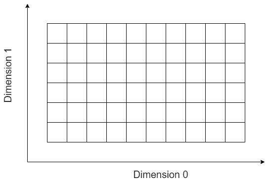
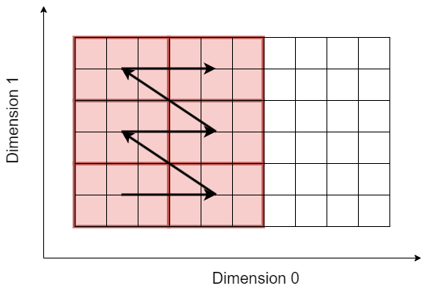
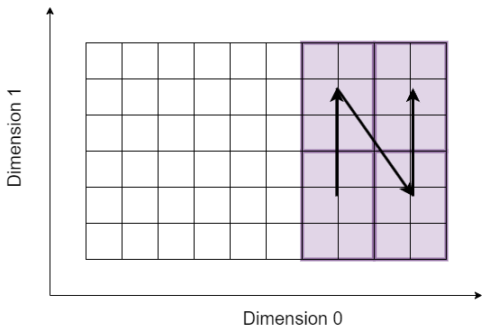
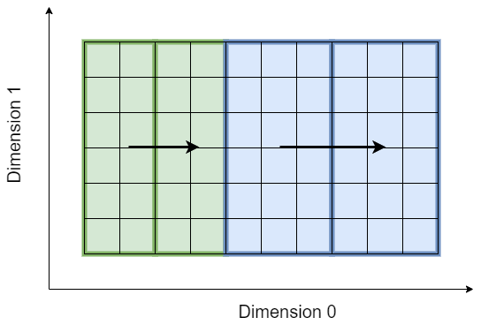
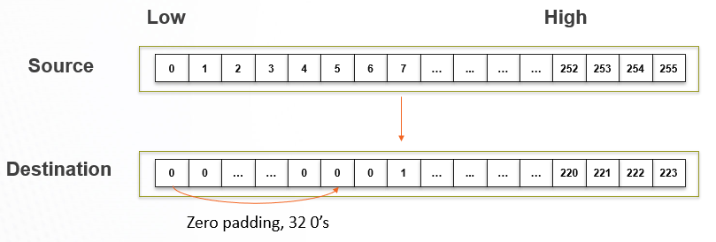
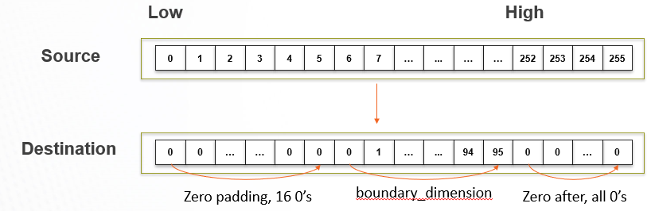
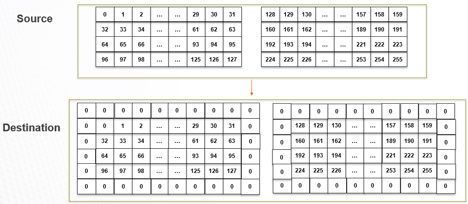

<table class="sphinxhide" style="width:100%;">
  <tr>
    <td align="center">
      <picture>
        <source media="(prefers-color-scheme: dark)" srcset="https://raw.githubusercontent.com/Xilinx/Image-Collateral/main/logo-white-text.png">
        
      </picture>
      <h1>AMD Vitis™ AI Engine Tutorials</h1>
      <a href="https://www.amd.com/en/products/software/adaptive-socs-and-fpgas/vitis.html">See Vitis™ Development Environment on amd.com</a>
        </br>
      <a href="https://www.amd.com/en/products/software/vitis-ai.html">See Vitis™ AI Development Environment on amd.com</a>
    </td>
  </tr>
</table>
# Tiling Parameters Programming

## Introduction

There are multiple levels of memory in the AI Engine-ML architecture:

- Memory module attached to the AI Engine-ML (64 KB). You can access it from the processor or through internal DMA with dedicated address generators (2xMM2S, 2xS2MM).
- Memory tile (512 KB): one or two per column. You can access it using internal DMAs with dedicated address generators (6xS2MM, 6xMM2S).
- External memory: double data rate (DDR) or high bandwidth memory (HBM), addressed by DMAs in the PL-AIE array interface.

You can see data in these memories as a single dimension set. Depending on the memory, maximum dimensionality can be three (AIE tile DMA, interface tile DMA) or four (memory tile DMA). As of 2022.2, you can program DMA BDs of the memory tile and interface tile from within the graph.

You perform this programming through *Tiling Parameters*. These parameters describe how you access data in memory on a tile basis. Dimension 0 is where data is contiguous in memory. Specify the overall buffer dimension, then the tile dimension, and finally the number of tiles to read in each dimension.

## Tiling Parameter Structure

The `tiling_parameters` structure is defined as follows:

```C++
  struct tiling_parameters
  {
      /// Buffer dimensions in buffer element type. buffer_dimension[0] is the fast-moving dimension and is contiguous in memory.
      /// When this variable is left unspecified, the dimensions of the associated buffer object will be used.
      std::vector<uint32_t> buffer_dimension;
      /// Tiling dimensions in buffer element type.
      std::vector<uint32_t> tiling_dimension;
      /// Multi-dimensional offset w.r.t. buffer starting element. Assuming buffer dimension is specified.
      std::vector<int32_t> offset;
      /// Vector of traversing_parameters. tile_traversal[i] represents i-th loop of inter-tile traversal,
      /// where i=0 represents most inner loop and i=N-1 represents most outer loop.
      std::vector<traversing_parameters> tile_traversal;
      /// Output port id of the connected pktsplit or the input port id of the connected pktmerge.
      int packet_port_id = -1;
      /// Number of repetitions of tiling traversal
      uint32_t repetition = 1;
      /// Phase of tiling parameter resource sharing and execution
      uint32_t phase = 0;
      /// Real data boundary dimension for padding
      std::vector<uint32_t> boundary_dimension;
  };

```

You can see in these parameters all the global details of the transfer. The order of memory access is specified by the `traversing_parameters`:

```C++
struct traversing_parameters
  {
      /// The dimension of the inter-tile traversing loop.
      uint32_t dimension = 0;
      /// stride represents the distance in terms of buffer element type between consecutive inter-tile traversal in the dimension
      uint32_t stride = 0;
      /// wrap represents the number of steps before wrapping the current traversing loop and incrementing to the next traversing loop.
      /// The traversal stops when the last wrap completes.
      uint32_t wrap = 0;

      bool operator==(const traversing_parameters& rhs) const
      {
          return (dimension == rhs.dimension && stride == rhs.stride && wrap == rhs.wrap);
      }
  };    
```

You define a vector of `traversing_parameters` to describe the access order. This lets you specify any dimension-wise order, starting with dimension three if required.


## A Graphical Example

Suppose you have a buffer named `mtx` stored in a *shared buffer*:



Its size is 10x6 and four kernels need to access it, two for writing and two for reading from it:

```C++
kernel k1, k2, k3, k4;
shared_buffer<int> mtx;
mygraph()
{
 k1 = kernel::create(func1); k2 = kernel::create(func2);
 k3 = kernel::create(func3); k4 = kernel::create(func4);
 mtx = shared_buffer<int>::create({10, 6}, 2, 2); // Size:10x6, 2 write-inputs, 2 read-outputs
 …
}
```

Kernel `k1` writes to the buffer tile by tile. Each tile is size 3x2 and the read origin is (0,0):



The access scheme is as follows:

- Dimension 0: two blocks, three samples apart
- Dimension 1: three blocks, two samples apart.

```C++
write_access(mtx.in[0]) = tiling({
.buffer_dimension={10,6}, .tiling_dimension={3,2}, .offset={0,0}, .tile_traversal = {{.dimension=0, .stride=3, .wrap=2}, {.dimension=1, .stride=2, .wrap=3}}});
```

Kernel `k2` writes to the buffer with different tile size and order:



The access scheme is as follows:

- Dimension 1: two blocks, three samples apart
- Dimension 0: two blocks, two samples apart

The subset origin is at position (6,0):

```C++
write_access(mtx.in[1]) = tiling({
  .buffer_dimension={10,6}, .tiling_dimension={2,3}, .offset={6,0},
    .tile_traversal = {{.dimension=1, .stride=3, .wrap=2},{.dimension=0, .stride=2, .wrap=2}}});
```

Kernels `k3` and `k4` read from the buffer differently than it was written:



These access schemes are defined in the graph with the following:

```C++
read_access(mtx.out[0]) = tiling({
   .buffer_dimension={10,6}, .tiling_dimension={2,6}, .offset={0,0},
   .tile_traversal = {{.dimension=0, .stride=2, .wrap=2}}});
read_access(mtx.out[1]) = tiling({
   .buffer_dimension={10,6}, .tiling_dimension={3,6}, .offset={4,0}
   .tile_traversal = {{.dimension=0, .stride=3, .wrap=2}}});
```

The overall C++ code, including the connections of the kernels to the `shared_buffer` looks like this:

```C++
class mygraph : public graph
{
  kernel k1, k2, k3, k4;
  shared_buffer<int> mtx;
  mygraph()
  {
    k1 = kernel::create(func1); k2 = kernel::create(func2); k3 = kernel::create(func3); k4 = kernel::create(func4);
    mtx = shared_buffer<int>::create({10, 6}, 2, 2); // 10x6, 2 write-inputs, 2 read-outputs
    connect<> n1(k1.out[0], mtx.in[0]);
    write_access(mtx.in[0]) = tiling({
  .buffer_dimension={10,6}, .tiling_dimension={3,2}, .offset={0,0},                         .tile_traversal = {{.dimension=0, .stride=3, .wrap=2}, {.dimension=1, .stride=2, .wrap=3}}});
    connect<> n2(k2.out[0], mtx.in[1]);
    write_access(mtx.in[1]) = tiling({
  .buffer_dimension={10,6}, .tiling_dimension={2,3}, .offset={6,0},
                         .tile_traversal = {{.dimension=0, .stride=2, .wrap=2}, {.dimension=1, .stride=3, .wrap=2}}});
    connect<> n3(mtx.out[0], k3.in[0]);
    read_access(mtx.out[0]) = tiling({
  .buffer_dimension={10,6}, .tiling_dimension={2,6}, .offset={0,0},
  .tile_traversal = {{.dimension=0, .stride=2, .wrap=2}}});
    connect<> n4(mtx.out[1], k4.in[0]);
    read_access(mtx.out[1]) = tiling({
  .buffer_dimension={10,6}, .tiling_dimension={3,6}, .offset={4,0},
  .tile_traversal = {{.dimension=0, .stride=3, .wrap=2}}});
 }
};
```

## Some Other Examples

When reading a buffer, if the access goes outside the buffer area, the DMA performs zero-padding, replacing non-existent data by zeros:

### 1D Linear with Zero-Padding Before

```C++
read_access(mtxB.out[0])=tiling({.buffer_dimension={256}, .tiling_dimension={256}, .offset={-32},
  .tile_traversal = {{.dimension=0, .stride=256, .wrap=1}} });
```



### 1D Linear with Zero-padding and Truncation

```C++
read_access(mtxB.out[0]) = tiling({.buffer_dimension={256}, .tiling_dimension={128}, .offset={-16},
   .tile_traversal = {{.dimension=0, .stride=144, .wrap=2}}, .boundary_dimension={96} });
```



### 3D Linear with Zero-padding Around


```C++
read_access(mtxB.out[0]) = tiling({.buffer_dimension={32,4,2}, .tiling_dimension={34,6,2}, .offset={-1,-1,0},
 .tile_traversal = {{.dimension=0, .stride=128, .wrap=1}, {.dimension=1, .stride=4, .wrap=1}
   , {.dimension=2, .stride=2, .wrap=1}},
 .packet_port_id = -1, .repetition = 1,.phase = 0, .boundary_dimension={32,4,2} });
```



## Support

Use GitHub issues to track requests and bugs. For questions, go to [support.xilinx.com](https://support.xilinx.com/).

<p class="sphinxhide" align="center"><sub>Copyright © 2026 Advanced Micro Devices, Inc.</sub></p>

<p class="sphinxhide" align="center"><sup><a href="https://www.amd.com/en/legal/copyright.html">Terms and Conditions</a></sup></p>
