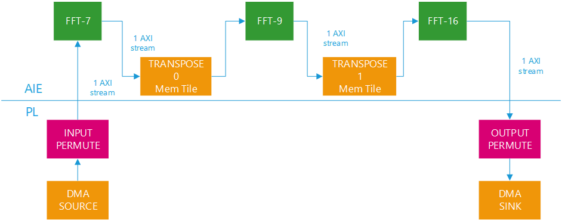
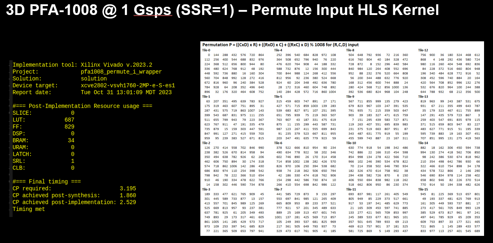
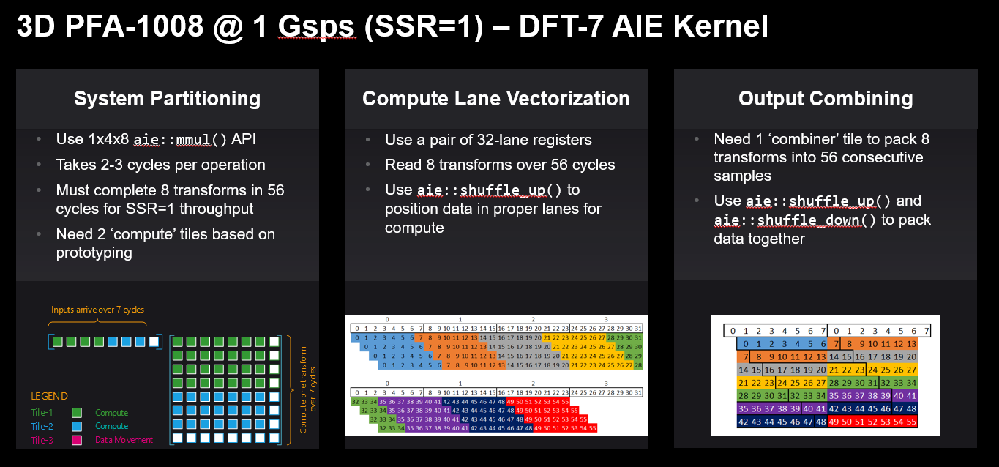
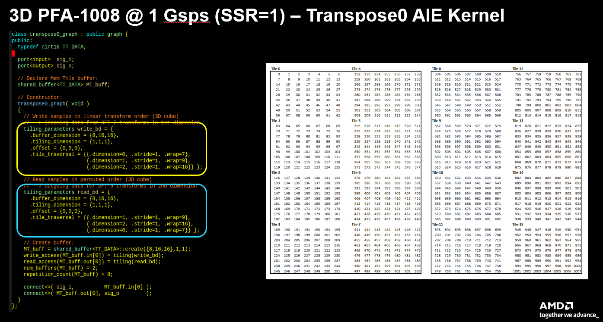
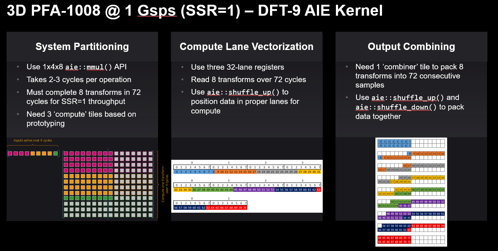
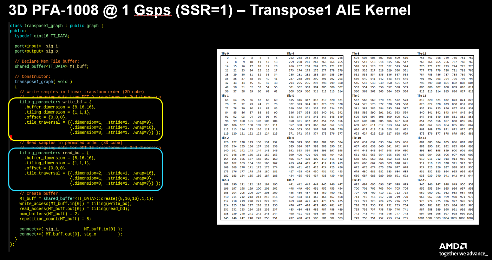
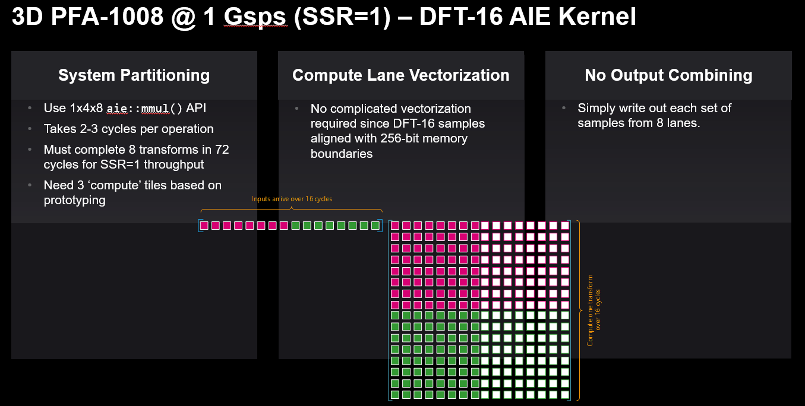
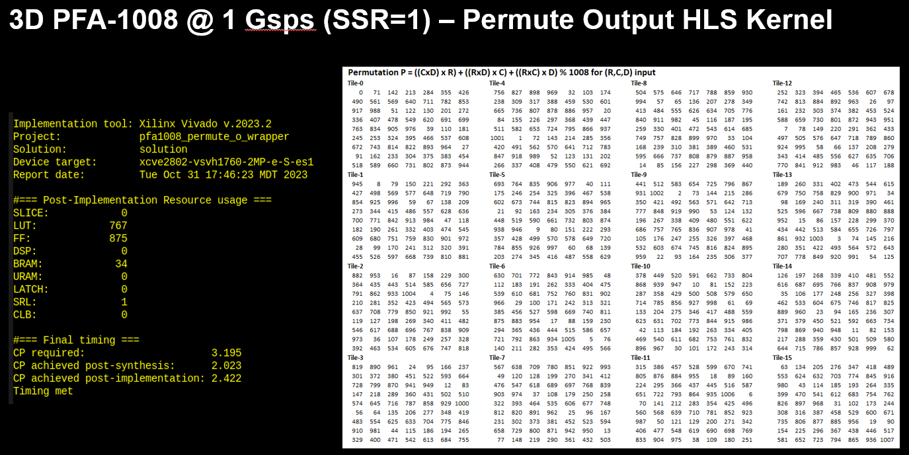
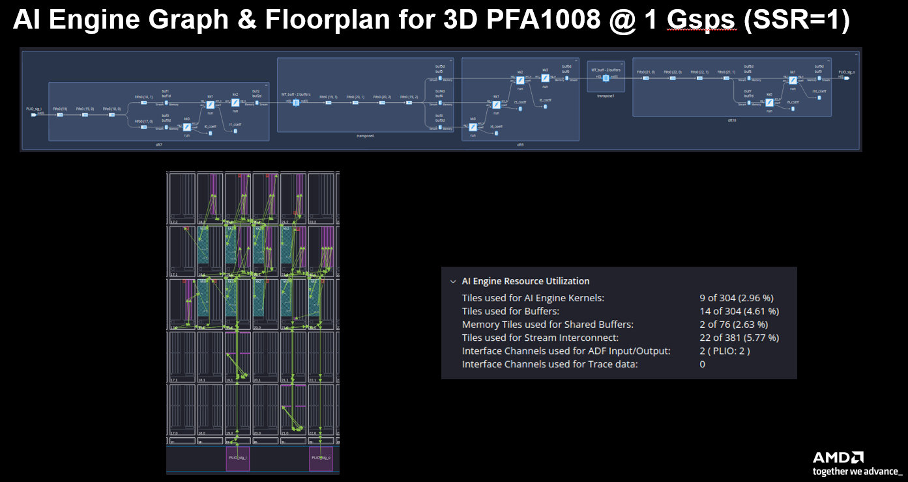
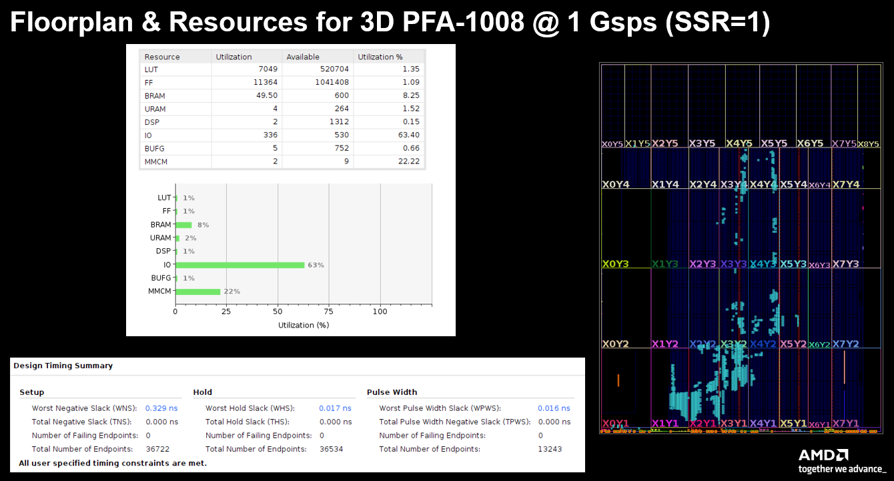

<!--
Copyright (C) 2023, Advanced Micro Devices, Inc. All rights reserved.
SPDX-License-Identifier: MIT
Author: Mark Rollins
-->
<table class="sphinxhide" width="100%">
 <tr width="100%">
    <td align="center"><h1>AI Engine Development</h1>
    <a href="https://www.xilinx.com/products/design-tools/vitis.html">See Vitis™ Development Environment on xilinx.com</br></a>
    <a href="https://www.xilinx.com/products/design-tools/vitis/vitis-ai.html">See Vitis™ AI Development Environment on xilinx.com</a>
    </td>
 </tr>
</table>

# Prime Factor FFT-1008 on AIE-ML

***Version: Vitis 2024.1***

## Table of Contents

1. [Introduction](#introduction)
2. [Matlab Models](#matlab-models)
3. [Design Overview](#design-overview)
4. [Design Resources](#design-resources)
5. [Build and Run Design](#build-and-run-design)

[References](#references)

[Support](#support)

[License](#license)

## Introduction
The Prime Factor Algorithm (PFA) [[1]] is a Fast Fourier Transform (FFT) algorithm [[2]] discovered by Good & Thomas before the more popular Cooley-Tukey algorithm with some interesting properties. The PFA is another "divide and conquer" approach for computing a Discrete Fourier Transform (DFT) of size $N = N_1 \cdot N_2$ as a two-dimensional DFT of size $N_1 \times N_2$ as long as $N_1$ and $N_2$ are relatively prime (ie. share no common divisors). The smaller transforms of size $N_1$ and $N_2$ may be computed by some other technique, for example using the Winograd FFT Algorithm, or the PFA technique may be applied recursively again to both $N_1$ and $N_2$. It turns out Versal AI Engines compute DFT with small dimensions $N < 32$ very efficiently using direct vector/matrix multiplication. Consequently, the PFA approach using DFT on the individual prime factors provides an efficient approach to the FFT on Versal AI Engines.

A second advantage of the PFA approach is that unlike the popular Cooley-Tukey FFT, no extra multiplications by "twiddle factors" need be performed between stages. This fact falls out of the DFT factorization when $N_1$ and $N_2$ share no common factors. This provides a computational advantage compared to the more traditional Cooley-Tukey formulation, but the PFA incurs a drawback in that a complicated re-indexing or permutation of it's I/O samples is required. For Versal devices with both AI Engines and Programmable Logic (PL), however, this drawback is solved easily by leveraging the PL to implement these permutations as part of a custom data flow tailored to the PFA signal flow graph.

An [earlier tutorial](https://github.com/Xilinx/Vitis-Tutorials/tree/2023.2/AI_Engine_Development/AIE/Design_Tutorials/05-Prime-Factor-FFT) implemented a PFA-1008 transform on AIE architecture in the VC1902 device. This tutorial maps the PFA-1008 transform to AIE-ML architecture in the VE2802 device. Once again we map the short-length DFT-7, DFT-9 and DFT-16 transforms to AI Engine using vector-matrix DFT's but this time to the AIE-ML architecture. The intermediate "memory transpose" operations mapped earlier to the programmable logic (PL) are instead mapped here to the Memory Tiles contained in the AIE-ML array. This simplifies data flow and keeps most of the graph inside the the array. The input and output permutation blocks remain implemented in the PL as RTL obtained using VItis High Level Synthesis (HLS) from untimed C++ models. These cannot be mapped to Mem Tiles as they require a type of modulo addressing not supported by the Memory Tile buffer descriptors (BDs).

## Matlab Models

This tutorial relies on the same Matlab models from the [original tutorial](https://github.com/Xilinx/Vitis-Tutorials/tree/2023.2/AI_Engine_Development/AIE/Design_Tutorials/05-Prime-Factor-FFT). These models have been replicated here in the `matlab` folder of the repo. These apply to both the signal processing functions as well as the I/O permutations and matrix transpose addressing operations. All remain identical.

## Design Overview

The figure below shows a block diagram of a 3D PFA-1008 hardware design implemented in Versal using AI Engines and PL. The design targets a 1 Gsps throughput (SSR=1). AI Engines implement the three DFT kernels, specifically DFT-7, DFT-9 and DFT-16, using a vector-matrix multiplication approach. The design implements the matrix transpose kernels in the AI Engine array using Memory Tiles, and maps the I/O permutation blocks to PL using Vitis HLS.



Some details on each kernel design is given in the sections below.

### INPUT PERMUTE Kernel

This PL kernel is implemented in HLS @ 312.5 MHz (SSR=4). Samples arriving on one 128-bit stream are written are written into a ping/pong buffer in 4X duplicate fashion. This is required since we must read or write 4 samples per cycle. The input permutation $P_i$ is stored in a LUT (again with 4X duplication) so the samples may be read back in the required permuted order. The latency of the design is 1008/4 cycles due to the ping/pong nature of the design. A single output streams delivers consecutive 7-pt transforms to the AI Engine array.

The figure below shows the input permutation required by the PFA-1008 design. The permutation ordering may be considered as a 3D mapping with $R=7$ rows, $C=9$ columns, and a depth of $D=16$. The $R$ dimension is given horizontally, the $C$ dimension vertically, and the $D$ dimension is identified by the "Tile-N" labels in the figure. The required permutation may be computed as $P=mod(C \times D \times R + R \times D \times C + R \times C \times D,1008)$. Note that this pattern cannot be generated automatically using the DMA buffer descriptors of the AI Engine Memory Tiles since it contains the "modulo 1008" operation which is not supported by the hardware. For this reason, we map the I/O permutation kernels to the PL.



### FFT-7 Kernel

This AI Engine kernel implements the DFT-7 using the 1x4x8 `aie::mmul()` API which takes 2 to 3 cycles per operation. The complete DFT-7 compute may be partitioned over two compute tiles, one to compute the green portion and a second to compute the blue portion indentified in the figure below. The API computes a [1x4] x [4x8] matrix multiply, and we must must pad the DFT-7 with an extra row and column of zeros. The entire transform must be computed over 7 cycles (SSR=1). The actual API code computes 8 transforms in less than 56 cycles.

The algorithm is vectorized using a pair of 32-lane registers in each AIE-ML core. A set of 8 vector reads fully populates these registers with data from eight consecutive transforms. Once populated, a set of `aie::shuffle_up()` API operations are used to position the data in the proper lanes for computes performed by the `aie::mmul()` API routine. 

The outputs from eight consecutive transforms are then packed together into seven 8-lane vectors using a third tile to perform this output combining. Here we use `aie::shuffle_up()` and `aie::shuffle_down()` API's to perform this packing.



### TRANSPOSE-0 Kernel

This AIE kernel implements the matrix transpose operation required to feed the proper 9-point input samples to the DFT-9 on the second dimension of the 3D cube. For AIE-ML technology, this matrix transpose may be implemented completely within the array using the Memory tile eliminating the need to exit the array to perform the operation in the PL. 

Buffer descriptions control the sample ordering employed by the Memory tile on both input and output. A "write BD" controls the sample ordering on input to the Memory tile. The write BD is configured using an ADF graph programming model shown below. The 3D pattern required here has dimensions ${7,9,16}$. This is configured with a `buffer_dimension` of ${8,16,16}$ since we must ensure alignment to the 32-bit boundaries of the Memory tile. The write address pattern is linear in dimensions 7, 9, and 16, and so the `tile_traversal` is configure in this order with address wrapping occuring at the dimensions $0,1,2$.

```
tiling_parameters write_bd = {
      .buffer_dimension = {8,16,16},
      .tiling_dimension = {1,1,1},
      .offset = {0,0,0},
      .tile_traversal = {{.dimension=0, .stride=1, .wrap=7},
                         {.dimension=1, .stride=1, .wrap=9},
                         {.dimension=2, .stride=1, .wrap=16}} };
```

The read BD is configured using a similar ADF graph programming model shown below. In this case, the 3D patter required here has dimensions ${9,16,7}$ since we send data first along the 2nd $N_2=9$ dimension, then electing to process $N_3=16$ second and $N_1=7$ last. This is configured with a `tile_traversal` along dimensions $1,2,0$ with wrapping applied as before. 

Finally, a `repetition_count` of 8 is specified because both the write BD and the read BD must be repeated four times each to match the number of transforms computed per kernel invocation by each DFT-7, DFT-9 and DFT-16 AIE compute kernel. The `num_buffers` is set to 2 because a ping/pong buffer arrangement is required here to support a full streaming data flow model. 



### FFT-9 Kernel

This AI Engine kernel implements the DFT-9 using the 1x4x8 `aie::mmul()` API which takes 2 to 3 cycles per operation. The complete DFT-9 compute may be partitioned over three compute tiles, one to compute the pink portion, a second to compute the orange portion, and a third to compute the green portion indentified in the figure below. The API computes a [1x4] x [4x8] matrix multiply, and we must must pad the DFT-9 with an extra rows and columns of zeros. The entire transform must be computed over 9 cycles (SSR=1). The actual API code computes 8 transforms in less than 72 cycles.

The algorithm is vectorized using three 32-lane registers in each AIE-ML core. A set of ten vector reads fully populates these registers with data from eight consecutive transforms. Once populated, a set of `aie::shuffle_up()` API operations are used to position the data in the proper lanes for computes performed by the `aie::mmul()` API routine. 

The outputs from eight consecutive transforms are then packed together into nine 8-lane vectors using a fourth tile to perform this output combining. Here we use `aie::shuffle_up()` and `aie::shuffle_down()` API's to perform this packing.



### TRANSPOSE-1 Kernel

This AIE kernel implements the matrix transpose operation required to feed the proper 16-point input samples to the DFT-16 on the third dimension of the 3D cube. Once again the matrix transpose may be implemented completely within the array using the Memory tile.

The `write_bd` buffer descriptor here is configured to match the `read_bd` buffer descriptor from the TRANSPOSE-0 kernel as we need to write-back the transformed results into the same memory locations from which they are read from. This configuration is shown below.
```
 tiling_parameters write_bd = {
      .buffer_dimension = {8,16,16},
      .tiling_dimension = {1,1,1},
      .offset = {0,0,0},
      .tile_traversal = {{.dimension=1, .stride=1, .wrap=9},
                         {.dimension=2, .stride=1, .wrap=16},
                         {.dimension=0, .stride=1, .wrap=7}} };
```

The `read_bd` buffer descriptor here is configured to deliver the samples required by the DFT-16 kernel that follows. Those sample are read of the third dimension of the 3D data cube, taken from dimensions $16,9,6$ corresponding to configurations $2,1,0$.

```
tiling_parameters read_bd = {
      .buffer_dimension = {8,16,16},
      .tiling_dimension = {1,1,1},
      .offset = {0,0,0},
      .tile_traversal = {{.dimension=2, .stride=1, .wrap=16},
                         {.dimension=1, .stride=1, .wrap=9},
                         {.dimension=0, .stride=1, .wrap=7}} };
```

Once again, `repetition_count` is configured to 8 and `num_buffers` is configured to 2 for reasons explained above.



### FFT-16 Kernel

This AI Engine kernel implements the DFT-16 using an approach similar to the DFT-7 and DFT-9 kernels above. Unlike those kernels, however, the approach here is simplified since the transform length is a multiple of eight. We need only two compute tiles and because there is no complicated vectorization, there are no data movement APIs required and no output combining.



### OUTPUT PERMUTE Kernel

This PL kernel is implemented in HLS @ 312.5 MHz (SSR=4). Samples arriving over a single 128-bit stream are written are written into a ping/pong buffer in 4X duplicate fashion in a manner similar to the INPUT PERMUTE kernel. The output permutation $P_o$ is stored in a LUT (again with 4X duplication) so the samples may be read back in the required permuted order. The latency of the design is 1008/4 cycles due to the ping/pong nature of the design. The output stream delivers the data for consumption by the DMA sink buffer.



## Design Resources

The figure below summarizes the final AI Engine graph and floorplan for the PFA-1008 design in the VE2802 device on the VEK280 board. The design uses 9 AI Engine tiles for compute kernels, 14 local tiles for buffering, and two Memory Tiles for shared buffers. 



The figure below summarizes the PL resources required to implement the design. The PL requires 50 BRAMs and 4 URAMs to implement the I/O permutes and the DMA source & sink buffers to support the design data flow between DDR4 and the AI Engine array. Timing closure is achieved with sufficient margin. This design illustrates how Versal AIE-ML technology with PL may be crafted together to create a high performance tightly coupled custom data path tailored directly to the algorithm of interest.



## Build and Run Design

### Setup & Initialization

IMPORTANT: Before beginning the tutorial ensure you have installed Vitis™ 2023.2 software. Ensure you have downloaded the Common Images for Embedded Vitis Platforms from this link.

https://www.xilinx.com/support/download/index.html/content/xilinx/en/downloadNav/embedded-platforms/2023-2.html

Set the environment variable ```COMMON_IMAGE_VERSAL``` to the full path where you have downloaded the Common Images. Then set the environment variable ```PLATFORM_REPO_PATHS``` to the value ```$XILINX_VITIS/lin64/Vitis/2023.2/base_platforms```.

The remaining environment variables are configured in the top level Makefile ```<path-to-design>/05-Prime-Factor-FFT/Makefile``` file.

```
RELEASE=2023.2
BOARD=vek280
BASE_NUM=202320_1

# Platform Selection...
VERSAL_VITIS_PLATFORM      = xilinx_${BOARD}\_base_${BASE_NUM}
VITIS_PLATFORM_DIR         = ${PLATFORM_REPO_PATHS}/${VERSAL_VITIS_PLATFORM}
export VITIS_PLATFORM_XPFM = ${VITIS_PLATFORM_DIR}/${VERSAL_VITIS_PLATFORM}.xpfm

# Set SysRoot, RootFS and Image
export VITIS_SYSROOTS   = ${COMMON_IMAGE_VERSAL}/sysroots/cortexa72-cortexa53-xilinx-linux
export KERNEL_IMAGE     = ${COMMON_IMAGE_VERSAL}/Image
export ROOTFS           = ${COMMON_IMAGE_VERSAL}/rootfs.ext4
export XLNX_VERSAL      = ${COMMON_IMAGE_VERSAL}
export PLATFORM         = ${VITIS_PLATFORM_XPFM}
export SYSROOT          = ${VITIS_SYSROOT}
```

### Hardware Emulation


```
[shell]% cd <path-to-design>/05-Prime-Factor-FFT
[shell]% make all TARGET=hw_emu
```

This will take about 90 minutes to run the first time as the build will perform C/RTL verification and Vivado out-of-context place-and-route runs for all six HLS IPs. This will only be done once, but is not strictly required for hardware emulation. To skip this step, alternately run using the following:

```
[shell]% cd <path-to-design>/05-Prime-Factor-FFT
[shell]% make all TARGET=hw_emu DO_COSIM=false
```

The build process will generate a folder ```05-Prime-Factor-FFT/package``` containing all the files required for hardware emulation. This can be run as shown below. An optional `-g` can be applied to the ```launch_hw_emu.sh``` command to launch the Vivado waveform GUI to observe the top-level AXI signal ports in the design.

```
[shell]% cd <path-to-design>/05-Prime-Factor-FFT/package
[shell]% ./launch_hw_emu.sh -run-app embedded_exec.sh
```

### Hardware

The design can be built for the VEK280 board using the Makefile as follows:

```
[shell]% cd <path-to-design>/05-Prime-Factor-FFT
[shell]% make all TARGET=hw
```

The build process will generate the SD card image in the ```<path-to-design>/05-Prime-Factor-FFT/package/sd_card``` folder.

## References

[1]: <https://en.wikipedia.org/wiki/Prime-factor_FFT_algorithm> "Prime Factor FFT Algorithm"

[[1]] Wikipedia, "[Prime Factor FFT Algorithm]([https://en.wikipedia.org/wiki/Prime-factor_FFT_algorithm])"

[2]: <https://eng.libretexts.org/Bookshelves/Electrical_Engineering/Signal_Processing_and_Modeling/Fast_Fourier_Transforms_(Burrus)> "Fast Fourier Transforms"

[[2]] C. Sidney Burrus, "[Fast Fourier Transforms]([https://eng.libretexts.org/Bookshelves/Electrical_Engineering/Signal_Processing_and_Modeling/Fast_Fourier_Transforms_(Burrus)])"

## Support

GitHub issues will be used for tracking requests and bugs. For questions, go to [support.xilinx.com](http://support.xilinx.com/).

## License

Components: xilinx-images

images in the documentation

Components: xilinx-files

The MIT License (MIT)

Copyright (c) 2023 Advanced Micro Devices, Inc.

Permission is hereby granted, free of charge, to any person obtaining a copy
of this software and associated documentation files (the "Software"), to deal
in the Software without restriction, including without limitation the rights
to use, copy, modify, merge, publish, distribute, sublicense, and/or sell
copies of the Software, and to permit persons to whom the Software is
furnished to do so, subject to the following conditions:

The above copyright notice and this permission notice shall be included in all
copies or substantial portions of the Software.

THE SOFTWARE IS PROVIDED "AS IS", WITHOUT WARRANTY OF ANY KIND, EXPRESS OR
IMPLIED, INCLUDING BUT NOT LIMITED TO THE WARRANTIES OF MERCHANTABILITY,
FITNESS FOR A PARTICULAR PURPOSE AND NONINFRINGEMENT. IN NO EVENT SHALL THE
AUTHORS OR COPYRIGHT HOLDERS BE LIABLE FOR ANY CLAIM, DAMAGES OR OTHER
LIABILITY, WHETHER IN AN ACTION OF CONTRACT, TORT OR OTHERWISE, ARISING FROM,
OUT OF OR IN CONNECTION WITH THE SOFTWARE OR THE USE OR OTHER DEALINGS IN THE
SOFTWARE.

<p class="sphinxhide" align="center">  &copy; Copyright 2023 Advanced Micro Devices, Inc.</p>
<p class="sphinxhide" align="center">  &copy; Copyright 2021 Xilinx Inc.</p>

