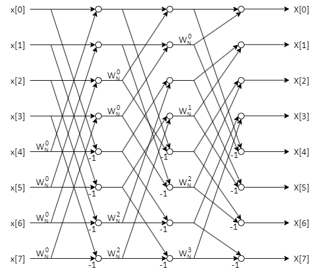
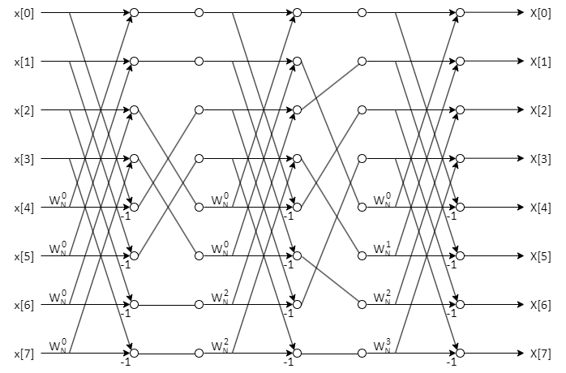

<table class="sphinxhide" width="100%">
 <tr width="100%">
    <td align="center"><h1>AIE-ML Development</h1>
    <a href="https://www.xilinx.com/products/design-tools/vitis.html">See Vitis™ Development Environment on xilinx.com </a>
    <a href="https://www.xilinx.com/products/design-tools/vitis/vitis-ai.html">See Vitis™ AI Development Environment on xilinx.com </a>
    </td>
 </tr>
</table>

# Fast Fourier Transform

## From the basics to the FFT
The Fourier Transform allows to transform a function from the time domain to the frequency domain, enabling various analysis and manipulation on the function itself through the exploitation of transform's properties.
From a mathematical standpoint, the Fourier Transform is defined as:
$$\mathcal{F}\left[x(t)\right]=X(f)=\int_{-\infty}^{+\infty}x(t)e^{-2j\pi f t}$$ Where $x(t)$ is a generic function in time domain, $X(f)$ is the same function in the frequency domain, and $j$ is the immaginary number.
Since computers work with *discrete* bits in *finite* memories, those limitations need to be taken into account when porting the transform operation to the digital world.
To this aim, the first step is to use a summation instead of an integral because in there is *no continuity*. In this case, the Fourier Transform is called is called Discrete Time Fourier Transform (DTFT). The second step is to adjust the summation interval to a *finite time window*, since it is impossible to acquire a signal for infinite time.
Performing those two modifications, the Discrete Fourier Transform (DFT) is obtained:
$$\mathbf{DFT}[x(nT_s)]=X(kf_s)=\sum_{n=0}^N x(nT_s)e^{-2j\pi\frac{n}{N}k}$$  Where $N$ is the total number of samples, $T_s$ is the sampling time, that is the time spanning from a sample to the subsequent one, that for simplicity we can assume to be constant, and $f_s$ is the sample frequency, that is the dual of the sampling time in the frequency domain, as it is the distance between the samples in frequency.
The obtained frequency-domain sequence $X(kf_s)$ has the same number of samples N of the starting time-domain sequence $x(nT_s)$. This results in a complexity that is $O(N^2)$, as it requires $N$ multiply-and-accumulate operations for each of the $N$ points.
For this reason, in most cases computing the DFT of signal acquisitions comprising a large amount of points is an highly demanding task for the processors. To overcome this issue, it is introduced the Fast Fourier Transform, that drastically reduces the complexity, allowing most of the times a more efficient computation.

## Cooley-Tukey FFT and its variants

Usually, when the literature refers the FFT algorithm, it refers to a version of the algorithm proposed by Cooley and Tukey that is usually applied to signals that have a number of points equal to a power of two. To give a general idea, the original algorithm allows to decompose the computation of the discrete Fourier transform of a function of $N$ points when $N$ is a composite number $(N=N_1 \cdot N_2)$, by computing $N_1$ DFTs of size $N_2$. This algorithm is often used recursively on functions having a power of 2 as number of points in order to perform a series of simple few-points DFTs, achieving a $O(N\cdot log_2(N))$ (also called loglinear) computational complexity.

### Cooley-Tukey decimation formalization

Given a discrete signal $x_n$, and its Discrete Fourier Transform $X(kf_ s)=\mathbf{DFT}_N [x(nT_s)]$, where $n \in [0,N]$ , and $N$ is a composite numer: $N=N_1 \cdot N_2$, the following two equations hold $\forall \space k \in [0,N]$

$$X_k = \mathbf{DFT}_ N[x_n] =\sum_ {i=0}^ {N_2-1} W_N^ {i\cdot k} \cdot \mathbf{DFT}[x_ {(i + j \cdot N_2)}] \qquad\quad j=0,1,\dots,N_1-1$$

$$X_k = \mathbf{DFT}_ N[x_n] =\sum_ {i=0}^ {N_2-1} W_N^ {k \cdot i \cdot N_1} \cdot \mathbf{DFT}[x_ {(i\cdot N_1 +j)}] \qquad\quad j=0,1,\dots,N_1-1$$

Where:
- $W_N^k=e^{-j\cdot2\pi\frac{k}{N}}$ are called **Twiddle Factors**
- The operation of dividing $N$ points into $N_2$ subsets having $N_1$ points is called **decimation** of order $N_2$.
- The decimation done in the first equation is called **decimation in time** (**DIT**).
- The decimaton done in the second equation is called **decimation in frequency** (**DIF**).

### Power-of-B/Radix-B and mixed radix FFT algorithms
The power-of-B algorithms (also known as radix-B argorithms) are certainly the most known application of Cooley-Tukey's results.
Those algorithms are obtained when the number of samples of the acquired signal is a *prime power* of a number B, that means that $N=B^p$ with $B,p\in\mathbb{N}$. In those cases, the algorithm can be applied recursively, because the DFTs obtained in the Cooley-Tukey decimation equations (shown above) can be decimated as well if $\frac{N_1}{N_2} \in \mathbb{N}$, and, if the chosen decimation order $N_2=B$, the DFT can be decimated upto $p$ times.
After applying this algebraic ploy, the resulting operations are just small DFTs that have $B$ points and are faster to be computed, obtaining the $O(N\cdot log_B(N))$ computational complexity that Cooley and Tukey highlighted in their paper.
A well-known representation of this category of algorithms is the **butterfly diagram**, that is a diagram where the nodes are the operations to be performed during a certaing step of the algorithm, and the edges connect the samples and the temporary results to the aforementioned nodes or to the final results. 

Fig. 1: Butterfly diagram of an 8-point, radix-2 DIT FFT

 

Those diagram are useful because they highlight the steps to perform while using the FFT algorithm as well as the data dependencies, making thus the designer able to visualize the pipeline and the data flow that the implementation needs to have.
Observing the indexes of the inputs and outputs of the decimation in time and decimation in frequency butterfly diagrams shown above, it is visible that this is a **not self-sorting** algorithm because the indexes, either at the inputs or the outputs are indexed in **bit-reversed order**.

It is also important to note that the usage higher order radix algorithms is rather beneficial for implementations on vector machines that are provided with multiply-accumulate functional units. The increase in performance is due to a plethora of factors. In the first place, a reduction in the number of needed operations is observed because the number of the stages of the algorithm is reduced. This translates also in a lower number of required load and store operations, which is beneficial to spare data movement through interconnects. This is even more important when we consider that the result of a DFT can be computed using fewer clock cycles when using a MAC unit equipped vector computer. Furthermore, the usage of higher order decimations comes with an increase in trivial complex rotation operations, i.e. multiplication by 1, -1, $j$ and $-j$, since the twiddle factors will be rotating more times in the complex plane.

Another category of FFT algorithms that comes from the radix-B class of FFT algorithm are the **mixed-radix** ones. Those are applicable to signals that are sampled with composite prime power number of points $N=\prod_iB_i^{(p_i)}$. This applies in the common case when the prime factors of the number of points can be grouped with different powers, e.g. $2^{11}=2^1\cdot4^5$, $\quad2^{10}=2^2\cdot4^4$, etc...
From a mathematical standpoint, to use those algorithm is sufficient to perform first the wanted decimations of one order, and then perform the other decimations on the resulting FFTs. However, this family of algorithms have in most cases quite complex indexing and are harder to implement in hardware. Nevertheless, this does not apply for every type of mixed-radix algorithms, as the Stockham variant of the FFT algorithm, that is used by the AI Engine APIs, have little to none indexing overhead for mixed-radixes.

## The Stockham FFT algorithm
To adapt the Cooley-Tuckey algorithm to vector computers that are equipped with local memory, such as the AI Engine, the concepts of *in-place computation*, *constant geometry* and *self-sorting* are introduced.
- **In-place computation**: an algorithm has the property of being computed in-place if the memory space occupied by the data is the same along all the algorithm steps, i.e. there is no buffer memory overhead for the data computation.
- **Constant geometry**: an FFT algorithm has the constant geometry property if the indexes of the data are unchanged stage by stage, increasing the parallelization for SIMD machines thanks to the avoidance of indexes book-keeping.
- **Self-sorting**: an FFT algorithm is self-sorting if the output data stored output data address is not bit-reversed, i.e. the output data is ordered. This may spare quite some computation since there would be no need for a bit-reverse stride permutation matrix to be used to order the data.

Unfortunately, research has not found an FFT algorithm that possesses all those properties yet. 
Among the possible solutions, AI Engine API employs the Stockham variant of the FFT algorithm. Such variant sacrifies the in-place computation property to gain the self-sorting one.

Fig. 2: Butterfly diagram of an 8-point, radix-2 Stockham DIT FFT

 
As observable from the figure above, the Stockham variant of the FFT is obtained through re-indexing the stage's computational nodes, done by adding a given increasing offset to the indexes, as explicited in the example figure here below.
  

Fig. 3: Butterfly diagram of an 8-point, radix-2 Stockham DIF FFT with explicit re-indexing.

 
In conclusion, the Stockham variant of the FFT sacrifices the in-place computation property not only to acquire the self-sorting one, but also to be efficiently vectorizable.

Such features make this algorithm to be a suitable choice for performing the FFT on SIMD machines as the AI Engine ML

## Bibliography
- [F. Franchetti - Fast Fourier Transform](https://users.ece.cmu.edu/~franzf/papers/fft-enc11.pdf)
- [J. W. Cooley et al. - What Is the Fast Fourier Transform?](https://ieeexplore.ieee.org/stamp/stamp.jsp?arnumber=1447887)
- [J. W. Cooley, J. W. Tukey - An Algorithm for the Machine Calculation of Complex Fourier Series](https://www.ams.org/journals/mcom/1965-19-090/S0025-5718-1965-0178586-1/S0025-5718-1965-0178586-1.pdf)

## Support

GitHub issues will be used for tracking requests and bugs. For questions, go to [support.xilinx.com](http://support.xilinx.com/).

## License

Components: xilinx-images

images in the documentation

Components: xilinx-files

The MIT License (MIT)

Copyright (c) 2024 Advanced Micro Devices, Inc.

Permission is hereby granted, free of charge, to any person obtaining a copy
of this software and associated documentation files (the "Software"), to deal
in the Software without restriction, including without limitation the rights
to use, copy, modify, merge, publish, distribute, sublicense, and/or sell
copies of the Software, and to permit persons to whom the Software is
furnished to do so, subject to the following conditions:

The above copyright notice and this permission notice shall be included in all
copies or substantial portions of the Software.

THE SOFTWARE IS PROVIDED "AS IS", WITHOUT WARRANTY OF ANY KIND, EXPRESS OR
IMPLIED, INCLUDING BUT NOT LIMITED TO THE WARRANTIES OF MERCHANTABILITY,
FITNESS FOR A PARTICULAR PURPOSE AND NONINFRINGEMENT. IN NO EVENT SHALL THE
AUTHORS OR COPYRIGHT HOLDERS BE LIABLE FOR ANY CLAIM, DAMAGES OR OTHER
LIABILITY, WHETHER IN AN ACTION OF CONTRACT, TORT OR OTHERWISE, ARISING FROM,
OUT OF OR IN CONNECTION WITH THE SOFTWARE OR THE USE OR OTHER DEALINGS IN THE
SOFTWARE.

  &copy; Copyright 2024 Advanced Micro Devices, Inc.

  &copy; Copyright 2021 Xilinx Inc.

