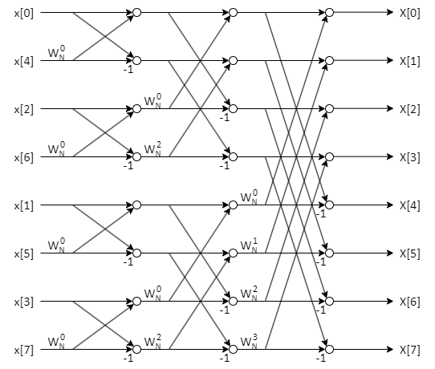
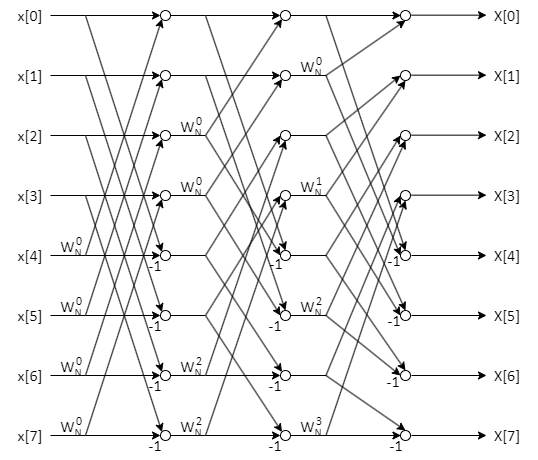
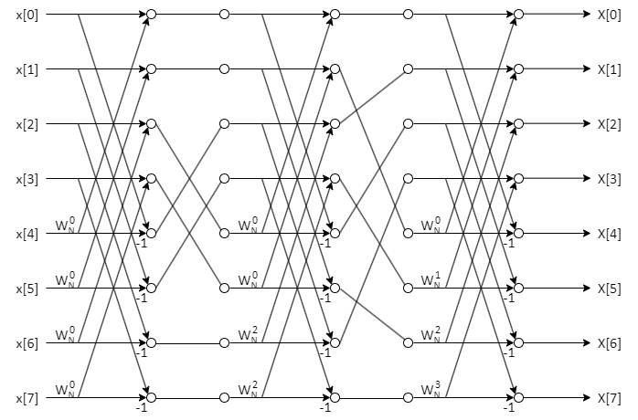

<table class="sphinxhide" style="width:100%;">
  <tr>
    <td align="center">
      <picture>
        <source media="(prefers-color-scheme: dark)" srcset="https://raw.githubusercontent.com/Xilinx/Image-Collateral/main/logo-white-text.png">
        
      </picture>
      <h1>AMD Vitis™ AI Engine Tutorials</h1>
      <a href="https://www.amd.com/en/products/software/adaptive-socs-and-fpgas/vitis.html">See Vitis™ Development Environment on amd.com</a>
         
      <a href="https://www.amd.com/en/products/software/vitis-ai.html">See Vitis™ AI Development Environment on amd.com</a>
    </td>
  </tr>
</table>

# Fast Fourier Transform

## Introduction

The Fourier Transform transforms a function from the time domain to the frequency domain. It enables various analysis and manipulation on the function itself through the exploitation of transform properties.

The following equation defines the Fourier Transform:

$$\mathcal{F}\left[x(t)\right]=X(f)=\int_{-\infty}^{+\infty}x(t)e^{-2j\pi f t}$$

where,

- $x(t)$ is a generic function in time domain
- $X(f)$ is the same function in the frequency domain
- $j$ is the imaginary number

Because computers work with *discrete* bits in *finite* memories, you must account for these limitations when porting the transform operation to the digital world.

The first step uses a summation instead of integration because there is *no continuity*. In this case, this Fourier Transform becomes the Discrete Time Fourier Transform (DTFT). The second step adjusts the summation interval to a *finite time window* because acquiring a signal for infinite time is impossible.

These two modifications yield the Discrete Fourier Transform (DFT):

$$\mathbf{DFT}[x(nT_s)]=X(kf_s)=\sum_{n=0}^N x(nT_s)e^{-2j\pi\frac{n}{N}k}$$  

where,

- $N$ is the total number of samples.
- $T_s$ is the sampling time, that is the time spanning from a sample to the subsequent one. For simplicity, you can assume this to be constant.
- $f_s$ is the sample frequency, that is the dual of the sampling time in the frequency domain, as it is the distance between the samples in frequency.

The frequency-domain sequence $X(kf_s)$ has the same number of samples N as the starting time-domain sequence $x(nT_s)$. This results in $O(N^2)$ complexity because it requires $N$ multiply and accumulate operations for each of the $N$ points.

Computing the DFT of signal acquisitions with many points is usually highly demanding for processors. The Fast Fourier Transform overcomes this issue by drastically reducing the complexity, allowing more efficient computation.

## Cooley-Tukey FFT and its Variants

The literature typically refers to the FFT algorithm as the version proposed by Cooley and Tukey. This version usually applies to signals with a number of points equal to a power of two.

The original algorithm decomposes the discrete Fourier transform computation of a function with $N$ points when $N$ is a composite number $(N=N_1 \cdot N_2)$. It does this by computing $N_1$ DFTs of size $N_2$. You can use this algorithm recursively on functions with a power of 2 points to perform a series of simple few-point DFTs. This achieves a $O(N\cdot log_2(N))$ computational complexity (also called loglinear).

### Cooley-Tukey Decimation Formalization

Given a discrete signal $x_n$, and its Discrete Fourier Transform $X(kf_ s)=\mathbf{DFT}_N [x(nT_s)]$, where $n \in [0,N]$ , and $N$ is a composite numer: $N=N_1 \cdot N_2$, the following two equations hold $\forall \space k \in [0,N]$

$$X_k = \mathbf{DFT}_ N[x_n] =\sum_ {i=0}^ {N_2-1} W_N^ {i\cdot k} \cdot \mathbf{DFT}[x_ {(i + j \cdot N_2)}] \qquad\quad j=0,1,\dots,N_1-1$$

$$X_k = \mathbf{DFT}_ N[x_n] =\sum_ {i=0}^ {N_2-1} W_N^ {k \cdot i \cdot N_1} \cdot \mathbf{DFT}[x_ {(i\cdot N_1 +j)}] \qquad\quad j=0,1,\dots,N_1-1$$

Where:

- $W_N^k=e^{-j\cdot2\pi\frac{k}{N}}$ is the **Twiddle Factors**
- The operation of dividing $N$ points into $N_2$ subsets having $N_1$ points is **decimation** of order $N_2$.
- The decimation done in the first equation is **decimation in time** (**DIT**).
- The decimation done in the second equation is **decimation in frequency** (**DIF**).

### Power-of-B/Radix-B and Mixed Radix FFT Algorithms

Power-of-B algorithms (also known as radix-B algorithms) are the most known application of Cooley-Tukey's results. These algorithms apply when the signal has a *prime power* of a number B: $N=B^p$ with $B,p\in\mathbb{N}$. In such cases, you can apply the algorithm recursively. The DFTs from the Cooley-Tukey decimation equations (shown above) can be decimated if $\frac{N_1}{N_2} \in \mathbb{N}$. When the decimation order is $N_2=B$, the DFT can be decimated up to $p$ times.

After applying this algebraic approach, the resulting operations are small DFTs with $B$ points that compute faster. This achieves the $O(N\cdot log_B(N))$ computational complexity that Cooley and Tukey highlighted.

The **butterfly diagram** provides a well-known representation of these algorithms. The nodes represent operations that occur during each algorithm step. The edges connect the samples and temporary results to these nodes or to the final results.

> *Fig. 1*: Butterfly diagram of an 8-point, radix-2 DIT FFT

These diagrams help you visualize the algorithm steps, data dependencies, pipeline, and data flow during implementation. By observing the indexes of the inputs and outputs of the decimation in time and decimation in the frequency butterfly diagrams shown above, you can see that this is a **not self-sorting** algorithm because the indexes at both inputs and outputs use **bit-reversed order**.

Higher order radix algorithms benefit implementations on vector machines with multiply-accumulate functional units. The performance increase stems from several factors. First, the algorithm requires fewer operations because it has fewer stages. This also means fewer load and store operations, reducing data movement through interconnects. MAC unit equipped vector computers compute a DFT in fewer clock cycles, making this particularly important. Higher order decimations also increase trivial complex rotation operations (multiplication by 1,–1, $j$, and $-j$) because the twiddle factors rotate more times in the complex plane.

The **mixed-radix** algorithms represent another category from the radix-B class. These algorithms apply to signals sampled with composite prime power number of points $N=\prod_iB_i^{(p_i)}$. For example, when you can group the prime factors of the number of points with different powers: $2^{11}=2^1\cdot4^5$ or $2^{10}=2^2\cdot4^4$.

You first perform the desired decimations of one order, then perform the other decimations on the resulting FFTs. This family of algorithms usually has complex indexing, making them harder to implement in hardware. This does not apply to every mixed-radix algorithm type because the Stockham variant of the FFT algorithm, which the AI Engine APIs use, has little to no indexing overhead for mixed-radixes.

## Stockham FFT Algorithm

Adapting the Cooley-Tuckey algorithm to vector computers with local memory (such as the AI Engine) requires three key concepts: *in-place computation*, *constant geometry*, and *self-sorting*.

- **In-place computation**: The memory space occupied by the data remains constant throughout all algorithm steps. There is no buffer memory overhead for data computation.
- **Constant geometry**: The data indexes remain unchanged from stage to stage. This increases parallelization for SIMD machines by avoiding index book-keeping.
- **Self-sorting**: The output data address is not bit-reversed, meaning the data appears in order. This can spare computation because you do not need a bit-reverse stride permutation matrix to order the data.

Research has not yet found an FFT algorithm that possesses all three properties.

The AI Engine APIs employ the Stockham FFT variant as a solution. This variant sacrifices in-place computation to gain self-sorting.

> *Fig. 2*: Butterfly diagram of an 8-point, radix-2 Stockham DIT FFT

The preceding figure shows how re-indexing the stage's computational nodes creates the Stockham variant of the FFT by adding a given increasing offset to the indexes. The following example figure shows this more explicitly.

> *Fig. 3*: Butterfly diagram of an 8-point, radix-2 Stockham DIF FFT with explicit re-indexing

The Stockham variant sacrifices in-place computation to gain self-sorting and efficient vectorization.

These features make this algorithm suitable for performing the FFT on SIMD machines such as the AI Engine ML.

## Bibliography

- [F. Franchetti - Fast Fourier Transform](https://users.ece.cmu.edu/~franzf/papers/fft-enc11.pdf)
- [J. W. Cooley et al. - What Is the Fast Fourier Transform?](https://ieeexplore.ieee.org/stamp/stamp.jsp?arnumber=1447887)
- [J. W. Cooley, J. W. Tukey - An Algorithm for the Machine Calculation of Complex Fourier Series](https://www.ams.org/journals/mcom/1965-19-090/S0025-5718-1965-0178586-1/S0025-5718-1965-0178586-1.pdf)

## Support

GitHub issues are used to track requests and bugs. For questions, go to [support.amd.com](https://adaptivesupport.amd.com/s/?language=en_US).

Copyright © 2021–2026 Advanced Micro Devices, Inc.

<a href="https://www.amd.com/en/legal/copyright.html">Terms and Conditions</a>

