<table class="sphinxhide" width="100%">
 <tr width="100%">
    <td align="center"><h1>AIE-ML Development</h1>
    <a href="https://www.xilinx.com/products/design-tools/vitis.html">See Vitis™ Development Environment on xilinx.com</br></a>
    <a href="https://www.xilinx.com/products/design-tools/vitis/vitis-ai.html">See Vitis™ AI Development Environment on xilinx.com</br></a>
    </td>
 </tr>
</table>

# AIE API based FFT for Many Instances Applications on AIE-ML <!-- omit from toc -->

***Version: Vitis 2024.1***

## Introduction
This tutorial intends to show how to design a complex Digital Signal Processing application using the AI Engine ML with its exclusive features through Vitis Unified IDE. In the tutorial the GUI flow is used. 
Moreover, Python scripts are provided to automate project creation and build. To run such Python scripts, first set up your `PLATFORM_REPO_PATHS` environment variable to `$XILINX_VITIS/lin64/Vitis/2024.1/base_platforms`, then clone this repository, locate inside it, and run the following commands:
- ``vitis -s Step1_3Dbuf.py`` to automate the first hands-on part of the tutorial.
- ``vitis -s Step2_4Dbuf.py`` to automate the second hands-on part of the tutorial.
### Table of Contents <!-- omit from toc -->
- [Introduction](#introduction)
  - [Objectives](#objectives)
  - [Required Background Knowledge](#required-background-knowledge)
  - [Considered Case Study](#considered-case-study)
  - [Design Strategy](#design-strategy)
- [Designing the FFT Application with the AI Engine ML](#designing-the-fft-application-with-the-ai-engine-ml)
  - [Designing the Kernel with the AI Engine API](#designing-the-kernel-with-the-ai-engine-api)
    - [Understanding the APIs](#understanding-the-apis)
    - [Coding the Kernel](#coding-the-kernel)
      - [Twiddles Header File](#twiddles-header-file)
      - [Kernel Header File](#kernel-header-file)
      - [Kernel Source Code](#kernel-source-code)
  - [Designing the Graph](#designing-the-graph)
    - [Data Movement Design](#data-movement-design)
    - [Designing Data Movement with the Memory Tiles](#designing-data-movement-with-the-memory-tiles)
    - [Using the Shared Buffers](#using-the-shared-buffers)
    - [Coding the Graph](#coding-the-graph)
      - [Graph Header File](#graph-header-file)
      - [Graph Source Code](#graph-source-code)
- [Implementing and Evaluating the AIE-ML Design with Vitis Unified IDE](#implementing-and-evaluating-the-aie-ml-design-with-vitis-unified-ide)
  - [Creating the AI Engine ML Project in Vitis](#creating-the-ai-engine-ml-project-in-vitis)
  - [x86 Simulation and Functional Validation](#x86-simulation-and-functional-validation)
  - [AI Engine Simulation, Array and Trace Analysis](#ai-engine-simulation-array-and-trace-analysis)
- [Optimizing the AIE-ML Design](#optimizing-the-aie-ml-design)
  - [Graph Optimizations](#graph-optimizations)
  - [x86 Simulation and Functional Validation](#x86-simulation-and-functional-validation-1)
  - [AI Engine Simulation, Array and Trace analysis](#ai-engine-simulation-array-and-trace-analysis-1)
- [Support](#support)
- [License](#license)

### Objectives
This tutorial has the objective to show:
- how to code Fast Fourier Transform kernels using the AI Engine APIs, 
- how to create a graph that uses multiple replicated kernels connected to the memory tiles,
- how to use the memory tiles and program their access pattern,
- how to evaluate the design outcome with Vitis Unified IDE, and
- how such evaluations enable simple architecture aware optimizations that result in huge utilization and power savings.

The target device for the design evaluation is [VEK280 Evaluation Kit](https://www.xilinx.com/products/boards-and-kits/vek280.html), equipped with the [Versal AI Edge](https://www.amd.com/en/products/adaptive-socs-and-fpgas/versal/ai-edge-series.html) VE2802 Adaptive SoC.


The proposed design has been carried out with the intents of minimizing resource utilization and power consumption, avoiding expecially the utilization of programmable logic resources, and instead using the memory tiles' customizable addressing to perform spatial and temporal interleaving between multiple signal instances.


### Required Background Knowledge
To thoroughly understand the content of this tutorial, it is necessary to know at least some background concepts about the Versal Adaptive SoC, the AI Engine ML architecture, and the basics of its programming methodology. Moreover, it is advisable to have some background knowledge about the Fast Fourier Transform algorithm and its variants.

- Versal technology basic introduction: [click here](https://gitenterprise.xilinx.com/dgiorgio/AIE-API-based-FFT-for-many-instances-applications-on-AIE-ML/blob/main/VersalBasics.md)
- Fast Fourier Transform algorithm introduction: [click here](https://gitenterprise.xilinx.com/dgiorgio/AIE-API-based-FFT-for-many-instances-applications-on-AIE-ML/blob/main/FourierBasics.md)

For further information, please refer to the following documentation:
- [AI Engine-ML Kernel and Graph Programming Guide (UG1603)](https://docs.amd.com/r/en-US/ug1603-ai-engine-ml-kernel-graph)
- [AI Engine API User Guide (UG1529)](https://www.xilinx.com/htmldocs/xilinx2024_1/aiengine_api/aie_api/doc)
- [AI Engine Tools and Flows User Guide (UG1076)](https://docs.amd.com/r/en-US/ug1076-ai-engine-environment)
- [Versal Adaptive SoC AIE-ML Architecture Manual (AM020)](https://docs.amd.com/r/en-US/am020-versal-aie-m)
- [Versal Adaptive SoC Technical Reference Manual (AM011)](https://docs.amd.com/r/en-US/am011-versal-acap-trm)
- [ACAP at the Edge with the Versal AI Edge Series (WP158)](https://docs.amd.com/v/u/en-US/wp518-ai-edge-intro)


### Considered Case Study

The considered case study for this tutorial is a real-time system comprising:
- 128 parallel signals, at a
- 125 MSa/s sample rate each, with
- CINT16 datatype (16 bits for the real part and 16 bits for the imaginary part) for both twiddle factors and data.

The total required I/O bandwidth, thus minimum throughput, is thus 16 GSa/s or 64 GByte/s.

### Design Strategy
The considered case study requires the computation of the FFT of 128 concurrent signals. To do so, an efficient strategy is to create a basic FFT computing block and replicate it in the top graph to run more FFT calculations in parallel, matching the required throughput.
Moreover, to optimize the AI Engine resources, it is beneficial to maximize the local memory usage and to serialize the data and the computation, as this decreases the interface and compute tiles utilization.
For how the FFT algorithm works, the buffering of at least half the samples of each signal is required. To avoid using programmable logic memory resources, the chosen strategy is to perform such buffering inside the AIE-ML using the memory tiles.
<p align="center">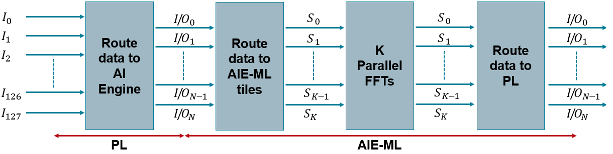</p>
<p align="center">Fig. 1: Preliminary Data Flow Block Diagram.</p>
</br>

The resulting system follows the diagram shown in figure 1, where 128 instances are acquired in parallel, then they are routed from the programmable logic to the AIE-ML though a certain number **N** of interface tile I/O channels. The samples are then routed to a certain number **K** of kernels to compute the FFTs in parallel, and their output is eventually routed back to PL.
</br>
<table>
      <tbody>
         <tr>
            <th align="center">Design requirement</th>
            <th align="center">Strategy</th>
         </tr>
         <tr>
            <td align="left">Compute the FFT of 128 distinct signals</td>
            <td><ul>
               <li>
               Create one compute block (kernel) and replicate it to parallelize computation</li>
            </ul></td>
         </tr>
         <tr>
            <td align="left">Optimize AI Engine resources</td>
            <td><ul>
               <li>
               Minimize AIE-ML tile utilization: maximize local memory usage and serialize the computation
               </li><li>
               Minimize Interface tile utilization: serialize the data
               </li>
            </ul></td>
         </tr>
         <tr>
            <td align="left">Optimize Programmable Logic resources</td>
            <td><ul>
               <li>
               Perform the FFT required buffering inside the AIE-ML using the memory tiles
               </li>
            </ul></td>
         </tr>
      </tbody>
</table>
<p align="center">Table 1: Preliminary Design Strategy Summary.</p>
</br>


## Designing the FFT Application with the AI Engine ML
In this section it is explained the rationale of the kernel and graph implementation, that has been done following the coding guidelines found in:
- [AI Engine-ML Kernel and Graph Programming Guide (UG1603)](https://docs.amd.com/r/en-US/ug1603-ai-engine-ml-kernel-graph)
- [AI Engine API User Guide (UG1529)](https://www.xilinx.com/htmldocs/xilinx2024_1/aiengine_api/aie_api/doc)

### Designing the Kernel with the AI Engine API
#### Understanding the APIs
The AIE API has a particular set of stage-based functions to compute the Fast Fourier Transform through the Stockham variant of the Cooley-Tukey algorithm. As explained in the [FFT background document](https://gitenterprise.xilinx.com/dgiorgio/AIE-API-based-FFT-for-many-instances-applications-on-AIE-ML/blob/main/FourierBasics.md), such variant is a not in place algorithm, thus generally requires a *temporary buffer* to save intermediate calculations. However, it has the big advantage of being self-sorting and efficiently vectorizable.

To understand the FFT API usage it is important to consider that the FFT algorithms rely on the concept of decimation, for which an N point Discrete Fourier Transform can be divided into the sum of multiple smaller transforms, multiplied by complex rotation parameters called Twiddle Factors. 
The number of the resulting transforms depends linearly on the radix parameter: a radix-2 FFT stage will thus divide the original transform into two transforms, a radix-3 into three, and so on. Usually, the decimation process is repeated recursively until the discrete transform to be performed has a number of points equal to the radix of the last stage.
<p align="center">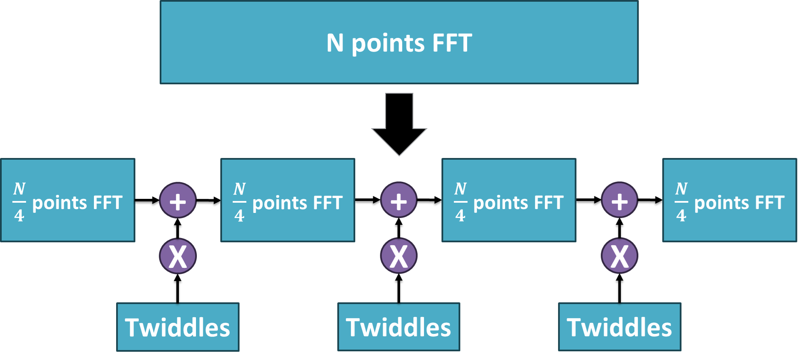</p>
<p align="center">Fig. 2: Diagram of a radix-4 Stage Decimation.</p>
</br>

The FFT staged API functions are C++ templatized functions. The API used for this work is the radix-4 stage function, whose declaration is the following:
```
void aie::fft_dit_r4_stage <unsigned Vectorization, 
                           typename Input , typename Output , typename Twiddle>
   (  const Input *__restrict 	        x,
      const Twiddle *__restrict 	tw0,
      const Twiddle *__restrict 	tw1,
      const Twiddle *__restrict 	tw2,
      unsigned                          n_points,
      unsigned                          shift_tw,
      unsigned                          shift,
      bool                              inv,
      Output *__restrict   out)
```
The template parameters are:
- The **input datatype**;
- The **output datatype**;
- The **twiddles datatype**;
- The **stage vectorization**, that is the step between the indexes of the samples to be summed and rotated.

$$\text{vec}(\text{stage}_ 0)=\frac{N_ {\text{points}}}{\text{radix}_ {\text{stage}_ 0}}, \quad \text{vec}(\text{stage}_ m)=\frac{\text{vec}(\text{stage}_ {m-1})}{\text{radix}_ {\text{stage}_ m}}$$

<p align="center">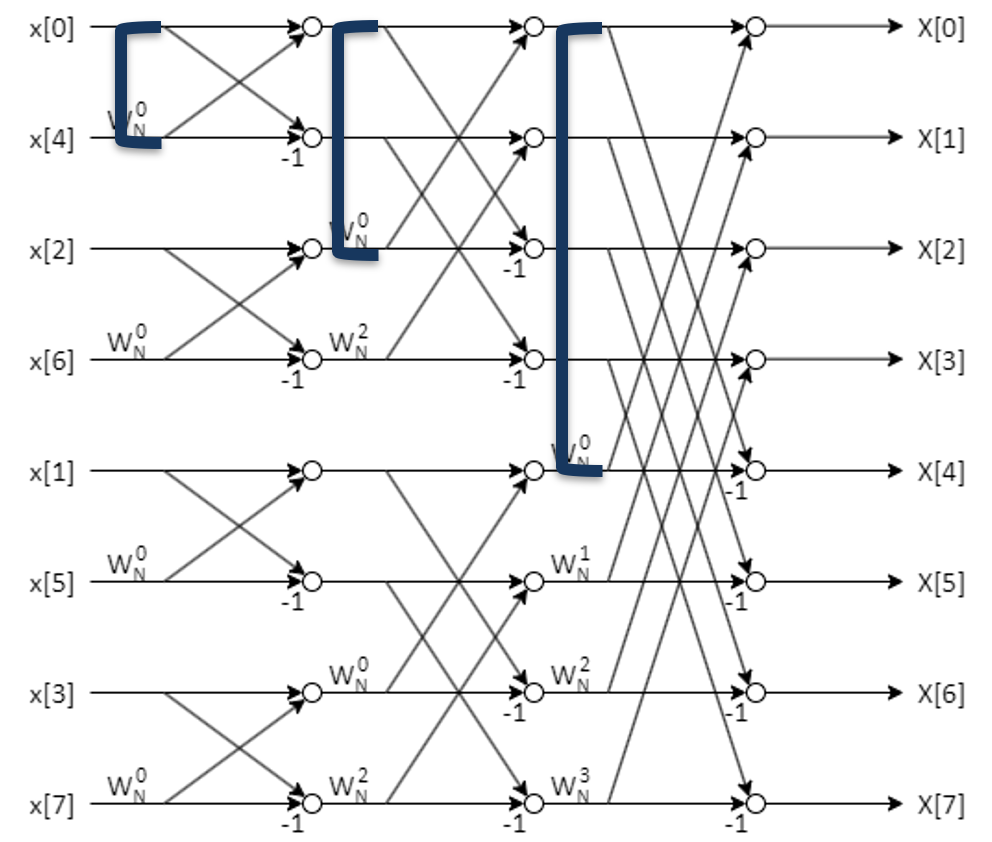</p>
<p align="center">Fig. 3: Example of vectorization of the three stages of an 8 points radix-2 DIT FFT.</p>
</br>
From the figure above, note that the vectorization follows the equations above, where the stride in index (shown at the left of the image) between samples is 4-2-1.
<br>
</br>

The function’s arguments are:
- The **pointers to the twiddle tables**, that are in number equal to the used stage radix minus one, thus three pointers for a radix-4 stage implementation, as observable from figure 2;
- The **input data memory pointer**;
- The **output data memory pointer**; 
- The **total number of points** of the signal; 
- The **twiddle shift parameter** to handle the fixed-point graularity of the twiddles;
- The **stage shift parameter** to handle the fixed-point graularity of the FFT stage;
- The **inverse flag**, that sets the function to compute the FFT or its inverse function.

Note moreover that having an odd number of stages eliminates the need for a temporary buffer, because the output ping-pong buffers can be used as the auxiliary memory to compute the not in-place algorithm. 
This happens because every alternated sequence of two elements terminates on the second element only if the number of repetitions is odd. For example, if the three repetitions are done the sequence will be {in-out, out-in, in-out}, whereas with four repetitions it is {in-out, out-in, in-out, out-in}, thus a third auxiliary element would be needed to terminate the sequence on the "out" element.


#### Coding the Kernel
Before coding the kernel, it is important to choose the best API function to carry out the computation. Since $1024=4^5$, a radix-4 only implementation that comprehends five stages, therefore five API calls, is a suitable choice for this design. This API not only requires less API calls with respect to radix-2, thus less program execution control overhead, but it also requires less computations because of the increased number of trivial complex multiplications.
Another important consideration to keep in mind is that the memory used to compute one FFT is equal to four times the memory needed to store the 1024 CINT16 samples, that is 16 kilobytes, plus the memory reserved for the twiddle tables. Such factor of four is due to the fact that ping-pong buffers are needed both at the input and at the output to avoid creating backpressure.
This means that, since it has a 64 kilobytes local memory, multiple signals can be batched together to be computed into the same AIE-ML tile. In this design, we are batching two signals for each kernel.


Keeping in mind the design considerations, the next step is to code the AI Engine kernels.
The file structure of choice to write the kernels is:
1.  One header file containing all the twiddle factor tables defined as macros with the #define compiler directive.
2.  One highly parametric header file where the *fft1k_kernel* class is defined.
3.  One .cpp file where the kernel class *run* method is defined with the AIE API functions.

##### Twiddles Header File

The first header file, that contains all the twiddle factor entries, is a rather long file. Because of the regular structure of the code, and because the mathematical formula to compute the twiddles is well known, the better choice is to generate the header file using a script.
The twiddle generation script, written in Python following the [AIE API](https://www.xilinx.com/htmldocs/xilinx2024_1/aiengine_api/aie_api/doc/group__group__fft.html) guidelines, along with an explanation of its functionalities can be found in the [support twiddles folder](./support/twiddles/) of this repository.

In particular, the defined twiddles vectors are organized with two subscripts, the first indicating the FFT stage, and the second indicating the stage entry. Thus for instance, the third entry of the fifth stage of a radix-4 FFT stage will be named *TWID4_2*. Because this project is about a radix-4 staged implementation, the generated header file contains 15 twiddle tables, three per each of the five stages.

##### Kernel Header File

The following step is to write the kernel's header file. Inside such file the *aie_api/aie.hpp* and the *adf.h* API header files are included along with the one containing the twiddles. Then, the *fft1k_kernel* class is created. 
It has the following public attributes:

    static constexpr unsigned N = POINTS;
    static constexpr unsigned SHIFT_TW = 15;
    static constexpr unsigned SHIFT_DT = 15;
    static constexpr bool     INVERSE  = false;
    static constexpr unsigned REPEAT   = REPS;
    static constexpr unsigned BUF_SIZE = N * REPEAT;

Those attributes define the number of points (N), the shifts to be applied between stages for twiddles and data (SHIFT_DT and SHIFT_TW), and the IFFT/FFT flag to be passed to the API calls (INVERSE). Moreover, they define the number of FFT instances to batch together in one kernel (REPEAT), and the buffer size (BUF_SIZE).

As private attributes, the kernel class has the twiddle tables, defined as *static constexpr* CINT16 arrays aligned to the AIE-ML core vector registers lane boundaries. The alignment is important to avoid cycle waste when loading the values into the vector processor's registers, whereas the *static constexpr* directive is used to instruct the compiler that the declared variable is a read-only constant (static) that has to be available at compile-time as well as runtime for optimization.
The twiddle array size has a trend that is opposite to the vectorization one. Therefore, in a 1024 points radix-4 implementation, the first stage will have a vectorization equal to 256, and each of the twiddle entries will have just one element. Those trends are clearly visible in the butterfly diagram of the 3-stages, radix-2, 8-points example shown in figure 3, where the index stride between summed factors decreases through the stages, while the number of used different twiddle factors increases.

    ...
        alignas(aie::vector_decl_align) static constexpr TT_TWID	tw0_0[1]	= TWID0_0;
        alignas(aie::vector_decl_align) static constexpr TT_TWID	tw0_1[1]	= TWID0_1;
        alignas(aie::vector_decl_align) static constexpr TT_TWID	tw0_2[1]	= TWID0_2;
        alignas(aie::vector_decl_align) static constexpr TT_TWID	tw1_0[4]	= TWID1_0;
        alignas(aie::vector_decl_align) static constexpr TT_TWID	tw1_1[4]	= TWID1_1;
        alignas(aie::vector_decl_align) static constexpr TT_TWID	tw1_2[4]	= TWID1_2;
        alignas(aie::vector_decl_align) static constexpr TT_TWID	tw2_0[16]	= TWID2_0;
        alignas(aie::vector_decl_align) static constexpr TT_TWID	tw2_1[16]	= TWID2_1;
        alignas(aie::vector_decl_align) static constexpr TT_TWID	tw2_2[16]	= TWID2_2;
        alignas(aie::vector_decl_align) static constexpr TT_TWID	tw3_0[64]	= TWID3_0;
        alignas(aie::vector_decl_align) static constexpr TT_TWID	tw3_1[64]	= TWID3_1;
        alignas(aie::vector_decl_align) static constexpr TT_TWID	tw3_2[64]	= TWID3_2;
        alignas(aie::vector_decl_align) static constexpr TT_TWID	tw4_0[256]	= TWID4_0;
        alignas(aie::vector_decl_align) static constexpr TT_TWID	tw4_1[256]	= TWID4_1;
        alignas(aie::vector_decl_align) static constexpr TT_TWID	tw4_2[256]	= TWID4_2;
    ...

Note that the CINT16 twiddle datatype is parametrized through the TT_TWID *typedef*, and that the vector's subscripts indicate in order the FFT stage and the stage entry, in compliance with the convention used in the twiddles header file. Moreover, also a temporary buffer with size equal to the number of points must be declared if the number of stages is even.

The last section of the class is reserved to declare the public methods, those are:
-   the class constructor;
-   the *run* method, that will be the actual kernel code;
-   the *registerKernelClass* method that calls the *REGISTER_FUNCTION* macro, that registers the run method to be used on the AIE-ML tile core to perform the kernel function.

The run method has for agruments the input and output buffers data structures, that are declared with the *\_\_restrict* pointer qualifier, that enable aggressive compiler optimizations by explicitly stating that there will not be pointer aliasing, i.e., the pointed memory space will be accessed only by such pointer.

    // Class constructor
    fft1k_kernel(void);

    // Run function
    void run(input_buffer<TT_DATA,extents<BUF_SIZE> >& __restrict din,
             output_buffer<TT_DATA,extents<BUF_SIZE> >& __restrict dout );

    // Register macro
    static void registerKernelClass(void){
        REGISTER_FUNCTION(fft1k_kernel::run);
    }

##### Kernel Source Code

The kernel source code in the .cpp file is quite straightforward because it just implements the kernel class constructor and run method.
After including the other header files and the ADF and AIE API libraries, the kernel constructor can be implemented.
The only operations done in the constructor are setting the rounding and saturation modes for the kernels. In this case the choice is to use the whole datatype representable numeric range to saturate, and to round positively if the results are multiples of $0.5$.

    fft1k_kernel::fft1k_kernel(void)
    {
        aie::set_rounding(aie::rounding_mode::positive_inf);
        aie::set_saturation(aie::saturation_mode::saturate);
    }

In the run function the data is read from the input buffer and written to the output buffer in linear fashion. To do so, the *data()* method of the buffer is used to get the pointer to the memory space reserved for the data. After getting the pointer to the data from the buffer structure pointer, a loop iterating through the batched signals instances is performed by using the REPEAT parameter from the header kernel file. Inside the loop, the staged FFT API is called for each stage on the pointed data, and the buffer data pointer is updated to the next instance of the data batch.
It is also worth noting that in the following code block are used two chess compiler directives: one to prepare for software pipelining, and one to mark the loop to be expected to iterate REPEAT times.

    void fft1k_kernel::run( input_buffer<TT_DATA,extents<BUF_SIZE>> & 
                            __restrict din,
                            output_buffer<TT_DATA,extents<BUF_SIZE>> & 
                            __restrict dout )
    {
        TT_DATA* ibuff = din.data();
        TT_DATA* obuff = dout.data();

        for (int i=0; i < REPEAT; i++)
            chess_prepare_for_pipelining
            chess_loop_range(REPEAT,)
            {
                TT_DATA *__restrict in_data  = ibuff;
                TT_DATA *__restrict out_data = obuff;

                aie::fft_dit_r4_stage<256>(in_data, tw0_1, tw0_0, tw0_2, N, SHIFT_TW, SHIFT_DT, INVERSE, out_data);
                aie::fft_dit_r4_stage<64>(out_data, tw1_1, tw1_0, tw1_2, N, SHIFT_TW, SHIFT_DT, INVERSE, in_data);
                aie::fft_dit_r4_stage<16>(in_data, tw2_1, tw2_0, tw2_2, N, SHIFT_TW, SHIFT_DT, INVERSE, out_data);
                aie::fft_dit_r4_stage<4>(out_data, tw3_1, tw3_0, tw3_2, N, SHIFT_TW, SHIFT_DT, INVERSE, in_data);
                aie::fft_dit_r4_stage<1>(in_data, tw4_1, tw4_0, tw4_2, N, SHIFT_TW, SHIFT_DT, INVERSE, out_data);

                ibuff += N;
                obuff += N;
            }
    }

For this implementation, the REPEAT parameter is set to 2. Thus two FFTs are batched together in one kernel. Therefore, in first instance, it must be replicated 64 times to perform all FFTs in parallel.

### Designing the Graph
After writing the kernels, the last coding step is to write the adaptive flow graph of the AI Engine application, that is planing the data movement, the kernel replication, the memory tiles buffers, the connectivity, and the mapping. To do so, it is paramount to understand how this AI Engine application interacts with the external world, that is the input and output data flow.

#### Data Movement Design
The data comes from all the 128 instances with a rate $r=125MSa/s$. Assuming that the data comes from the PL, the PL interface tiles are used to send the data inside the device. To reduce as much as possible the PLIO channels usage, the best decision would be to apply time interleaving between the instances and run the fabric at the high (but manageable) speed of $f_{PL}=500MHz$, with an interleaving factor $\theta=4$. 
The data is sent through the PLIO channels that are 64-bit wide, and can thus accomodate two samples per channel, allowing also time interleaving. The instances can be assigned to the channels in a round-robin fashion, as shown in the following table.

<p align="center">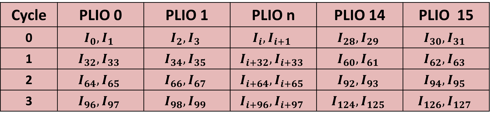</p>
<p align="center">Table 2: PLIO Channels Mapping with Temporal and Spatial Interleaving.</p></br>

A not trivial design challenge to face when performing time interleaving is the management of the kernels' buffers. In fact, each single kernel that computes the FFT expects its input data to be contiguous inside the buffer. If for instance we set the batching parameter $\text{REPEAT} = 2$ in the kernels' header file, the input buffer size will increase, but the data is expected to be ordered with the first N samples coming from one signal instance, followed by the second N samples coming from another instance. This is not possible, since the data will be inputted as interleaved, as visible from Table 2.

Within this context, the easiest construct to use would be packet switching, where a single physical channel is used to route data to different kernels. However, the only supported packet switching mode for AI Engine kernels is currently the explicit one, where is sent a 32-bit header first, containing the packet information, and then a payload containing the wanted amount of data. Because of the interleaved nature of the data communication, in such case the header overhead must be paid for every sent sample, halving the channels bandwidth.
The second possibility is to use passthrough kernels to just route the data to the compute kernels, relocating the overhead from the I/O resources to the computational ones.
The third option is to use 16 BRAM buffers in PL and thus to send the data in order, paying with fabric resources and a large initial latency, that would last about twice the total acquisition time: $2 \cdot T_{acq} \simeq 16,4\mu s$.
The fourth and last possibility is using the AIE-ML memory tile as buffers, and exploit their programmable access pattern to use them as interfaces. 

The choice falls on this last option, as it manages all the data within the AI Engine and keeps the bandwidth, the interleaving, and the used programmable logic resources unvaried, at the cost of a resonably increased latency and the resources inside the array memory tiles.

#### Designing Data Movement with the Memory Tiles

The main idea is to employ the AIE-ML memory tiles ability to perform matrix transposition implicitly while writing and reading the data, through the programmable access pattern set with tiling parameters. In this way it is possible to perform temporal and spatial interleaving on the input samples before sending them to their respective kernels.
To do so, consider the input data as a matrix where the rows represent the n-th samples of every instance, and the columns represent the instances. A visualization of such a matrix is shown in the following table, where the instances $i$ go from 0 to $I$, while the samples $n$ go from 0 to $N$.

<p align="center">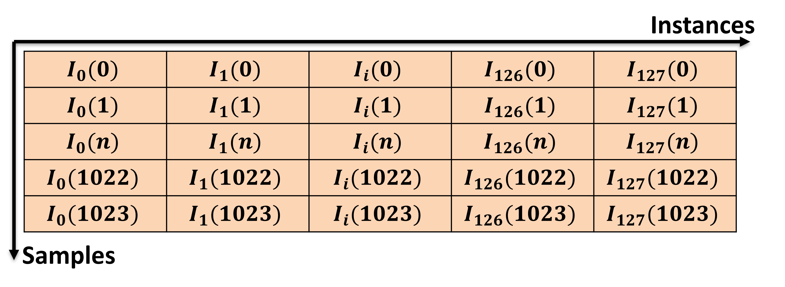</p>
<p align="center">Table 3: Memory tile Buffering Matrix.</p></br>

In this way, it is possible to write inside the memory tile row-by-row with the inputs coming from every instance at their sample rate of 125MSa/s, so that a row of the memory tile will be filled at every sample cycle. Eventually, all the columns of the matrix will be filled when the last sample of every instance will be written to the memory tile, i.e. the last row of the matrix, at the last sampling cycle.
Now, the memory tile reading operation done by the kernels can proceed in the opposite way, column-by-column. In this way the kernel's buffers will be filled with the all the samples in a contiguous way, as needed.
To apply time interleaving to such matrix, Table 2 and Table 3 need to be merged. To do so, observe that the rows of Table 2 are filled at a rate $r=125MSa/s$, while the rows of Table 2 are filled every $f_{PL}=500MHz$, thus Table 3 is filled with an rate equal to the sample rate $r$ for each row, because the wanted temporal interleaving makes the PL rate $\theta$ times bigger than $r$. This means that Table 3 can be folded $\theta$ times to form a three-dimensional tensor, where each vertical slice contains all the time interleaved samples with the order of Table 2, while each horizontal slice is composed of contiguous instances spanning though rows, and contiguous samples spanning though columns, as shown in the following animation.

<p align="center"></p>
<p align="center">Animation 1: Memory tile 3D buffering mechanism.</p></br>

#### Using the Shared Buffers

The digital construct used to program the access of both the interface tiles and the AIE-ML tiles to the the memory tile is the shared buffer. 

This buffer is parametrized with:
-   Data type, chosen in the template parameters.
-   Size, as a 1,2,3 or 4 values vector where each of those values expresses the sizes of the dimensions of the buffer, in terms of samples.
-   Number of input ports, that are maximum six per Memory Tile.
-   Number of output ports, that are maximum six per Memory Tile.

This buffer has various settings that are controlled through specific APIs. Some of the most important ones are:
-   Read and write access patterns, that are set through tiling parameters.
-   Repetition count, that sets the amount of times the access pattern to the buffer must be done for every graph call.
-   Number of buffers, that enable the usage of ping-pong buffers if set to two.

The tiling parameters regulate the access to the shared buffer by dividing it into \"tiles\" that have dimensions lesser or equal to the ones of shared buffer, being thus subsets of the memory tensor. Those parameters give freedom to the developer to traverse the tiles with various patterns. Some important features set by those parameters are:
-   Tile dimensions, that is a vector having the same dimensionality of the shared buffer, where each element contains the size of the tile in such dimension.
-   Offset, that is vector having the same dimensionality of the shared buffer, where each element contains the offset with respect to the first element of the buffer.
-   Traversing parameters, that is a vector having the same dimensionality of the shared buffer, where each element is a data structure that defines:
    -   Dimension: the dimension (i, j, k...) of the shared buffer tensor to be traversed;
    -   Stride: the distance between consecutive elements accessed in the tile, in terms of samples;
    -   Wrap: the number of tiles to be accessed in the chosen dimension.

#### Coding the Graph
After designing the data flow, and understanding the constructs to be used to make it possible, the next step is to code the actual graph.
For this tutorial, the graph files are just the header and the implementation file.

##### Graph Header File

In the graph header file, the *fft1k_128_graph* class is defined, with all the kernel and buffer objects and connection inside it.
As a first step, the ADF library and kernel header file are included, then six variables are defined through #define compiler directives:
-   the number of signal instances $\text{N\\_INST}=128$;
-   the width of the PLIO channels in terms of samples, that are CINT16, thus 32 bits wide: $\text{PLIO\\_WIDTH} = 2$;
-   the time interleaving $\theta$ factor $\text{IO\\_ILV}=4$;
-   the number of kernels, that is equal to the number of instances divided by the batch factor $\text{N\\_KERS}=\frac{\text{N\\_INST}}{\text{REPS}}=64$;
-   the number of I/O channels, that is $\text{N\\_IO}=\frac{\text{N\\_INST}}{\text{IO\\_ILV}\hspace{1mm}\cdot\hspace{1mm}\text{PLIO\\_WIDTH}}=16$.
-   the maximum number $\text{MAX\\_BUF}$ of shared buffer that fits into a memory tile. It can be limited either by the memory occupation of the buffer, or by the number of memory interfaces.
    -   Note that the formulas suggested in the code are calculated for ping-pong shared buffers and considering input and output buffers packed together (as it spares mem tile interface resources). 
  $$\text{MAX\\_BUF} = min\left[ \frac{512kB}{\text{BUF\\_SIZE}\cdot\text{DATATYPE\\_BYTES}\cdot 2\cdot 2}\quad; \quad \frac{6}{2\cdot \frac{\text{N\\_KERS}}{\text{N\\_IOs}}} \right]$$
    -   For this reason, the build will work even if MAX_BUF = 0 in the case the design is port-limited, as in such case the buffers are left unconstrained.

In the private section of the class there are only attributes, that are an array of N_IO kernels and two arrays of N_IO shared buffers, one for the inputs and one for the outputs.
In the public section of the graph class, the attributes are just two arrays of N_IO ports, one for the input and one for the output.

    ...
    class fft1k_128_graph : public graph {
    private:
        kernel k_kernel[N_KERS];
        shared_buffer<cint16> in_mem[N_IO], out_mem[N_IO];
    public:
        port<input>     din[N_IO];
        port<output>    dout[N_IO];
    ...

The choice of creating one tensor for each I/O has been made to facilitate the job of the placer of the aiecompiler in binding the memory and routing hardware resources to the constructs.
The graph class constructor is where all the kernels, buffers and connections are created and configured. The constructor code is divided in three for loops.

    ...
    fft1k_128_graph(void)
    {
      // LOOP 1
        for(int i=0; i<N_KERS; i++){
            k_kernel[i] = kernel::create_object<fft1k_kernel>();
            source(k_kernel[i]) = "fft1k_single_kernel.cpp";
            runtime<ratio>(k_kernel[i]) = 0.9;
            location<stack>(k_kernel[i]) = location<kernel>(k_kernel[i]);
            location<buffer>(k_kernel[i].in[0]) = location<kernel>(k_kernel[i]);
            location<buffer>(k_kernel[i].out[0]) = location<kernel>(k_kernel[i]);
        }
    ...

In the first loop, all the kernels are instantiated one by one specifying the kernel name, the kernel source file and its expected runtime ratio (i.e., its reserved cycle budget on the compute tile with respect to the entire one).
Moreover, to lighten the job of the placer of aiecompiler, and to ensure minimizing resource usage, three relative location constraints are used to state that the input and output buffers and the program memory (that contains the twiddles) must be binded to the same tile in which the computation is carried out.

    ...
    // LOOP 2
    for(int i=0; i<N_IO; i++){
        // Creating the input and output shared buffers
        in_mem[i] = shared_buffer<cint16>::create({PLIO_WIDTH,IO_ILV,POINTS}, 1, int(PLIO_WIDTH*IO_ILV/REPS));
        out_mem[i] = shared_buffer<cint16>::create({PLIO_WIDTH,IO_ILV,POINTS}, int(PLIO_WIDTH*IO_ILV/REPS), 1);

        num_buffers(in_mem[i]) = 2;    // Ping-pong in
        num_buffers(out_mem[i]) = 2;   // Ping-pong out

        if(MAX_BUF != 0){
                    if(i%MAX_BUF>0){
                        location<buffer>(in_mem[i]) = location<buffer>(in_mem[i-1]) + relative_offset({.col_offset = 0, .row_offset = 0});
                        location<buffer>(out_mem[i]) = location<buffer>(out_mem[i-1]) + relative_offset({.col_offset = 0, .row_offset = 0});}
                    location<buffer>(out_mem[i]) = location<buffer>(in_mem[i]) + relative_offset({.col_offset = 0, .row_offset = 0});}

    ...

The second loop is used to instantiate the input and output shared buffers. As a first operation, the buffers are created to match a slice of the 3D tensor, that has a length equal to PLIO_WIDTH, a depth equal to IO_ILV, and a height equal to the number of samples.
The ports of such buffers are configured to be connected to one I/O from the side facing the PL. On the other side, instead, they are configured to connect one kernel for every two instances they contain. Therefore, since they contain $\text{PLIO\\_WIDTH} \cdot \text{IO\\_ILV}$ instances, the number of ports on the buffer side facing the kernels is equal to 4, meaning that every buffer serves four kernels with two instances each.
In the following lines, it is required that the shared buffers are instantiated as ping-pong buffers, thus to reserve double the memory for each. 
Moreover, the buffers are location constrained to pack together as many input and output buffers per memory tile as possible, being the limitation either the number of ports or the memory size.

    ...LOOP 2...
    write_access(in_mem[i].in[0]) =
        tiling(
            {
                .buffer_dimension = {PLIO_WIDTH, IO_ILV, POINTS},      
                .tiling_dimension = {PLIO_WIDTH, IO_ILV, POINTS},      
                .offset           = {0, 0, 0},
                .tile_traversal   = {
                    {.dimension=0, .stride=PLIO_WIDTH, .wrap=1},    
                    {.dimension=1, .stride=IO_ILV, .wrap=1},           
                    {.dimension=2, .stride=POINTS, .wrap=1}        
                } 
            });
    connect(din[i], in_mem[i].in[0]);
    ...

The second and third code blocks of the second loop regulate the access policies that the PLIOs will have with respect to the buffers, and connects them. In particular, the tiling size is set equal to the buffer size, and the tile traversal is set to occur in the natural order in which the PLIOs feed the data, thus filling the buffer tensor vertically, slice by slice. This means that the first filling dimension is the length, then the depth, and finally the height of the tensor, resetting the previous dimensions every time there is a change of dimension caused by the reach of the end of the stride (because the .wrap parameter is set to 1). After defining the tiling and the buffer access policy, each buffer is connected to their respective port.
The code shown above is only related to the input management because the output management one is analogous.

    ...
    LOOP 3
    for(int i=0; i<N_IO; i++){
        int cur = 0;
        for(int k=0; k<IO_ILV; k++)
            for(int j=0; j<PLIO_WIDTH/REPS; j++){
            // Kernel inputs management
                read_access(in_mem[i].out[cur]) =
                    tiling(                                                                      
                    {
                        .buffer_dimension = {PLIO_WIDTH, IO_ILV, POINTS},
                        .tiling_dimension = {1, 1, POINTS},              
                        .offset           = {REPS*j, k, 0},                 
                        .tile_traversal   = {
                            {.dimension=2, .stride=POINTS, .wrap=1},        
                            {.dimension=0, .stride=1, .wrap=REPS},         
                            {.dimension=1, .stride=1, .wrap=1}            
                    }});
                connect(in_mem[i].out[cur], k_kernel[int(i*(PLIO_WIDTH*IO_ILV/REPS)+cur)].in[0]);
            // Kernel outputs management
                ...
                cur++;
            }
    ...

The third and last loop configures the interfacing between the shared buffers inside the memory tiles and the kernels inside the AIE-ML tiles. To this end, three nested loops are created: the top one to iterate through the shared buffers, and the two inner ones to loop though the instances in a ordered manner. Indeed, the tiling is unidimensional and makes the kernel read and write to the 3D shared buffers in the third dimension (the height), that constitutes the entire ensemble of points of a given instance inside the tensor. After reading one instance, the tiling wraps to the first dimension to select the second part of the PLIO (i.e., the second instance, that is paired to the first one in the 64bit PLIO channel), that is also the second kernel repetition. After that, to take into account also time interleaving, the tile moves to the second dimension to perform the same access pattern. This complete pattern is then repeated until the shared buffer has been fully traversed.
The connections are then made to feed each kernel with contiguous instances from the input shared buffer, and then in a specular way to fill the output shared buffer keeping the data indexes in the same order of the input one, making the output PLIO return data in the same exact order of the input PLIOs.
As for the second loop, the code shown for the third one is only related to the input management because the output management code is analogous.

##### Graph Source Code

The graph source code is composed of a top level graph class declaration and definition, and the main function. The new graph is used to encapsulate the actual graph and facilitate testing.
After the graph header file is included, the new class *dut_graph* is defined.

    class dut_graph : public graph {
    public:
        input_plio  din[N_IO];
        output_plio dout[N_IO];
        fft1k_128_graph fft_graph;
        dut_graph(void)
        {
            std::string plio_i;
            std::string plio_o;
            std::string file_i;
            std::string file_o;
            for(int i=0; i<N_IO; i++){
                plio_i = "PLIO_i[" + std::to_string(i) + "]";
                plio_o = "PLIO_o[" + std::to_string(i) + "]";
                file_i = "verif_i_128/din" + std::to_string(i) + ".txt";
                file_o = "verif_o_128/dout" + std::to_string(i) + ".txt";
                din[i] = input_plio::create(plio_i, plio_64_bits, file_i);
                dout[i] = output_plio::create(plio_o, plio_64_bits, file_o);
                connect(din[i].out[0], fft_graph.din[i]);
                connect(fft_graph.dout[i], dout[i].in[0]);
            }
        }
    };

The new class instantiates the *fft1k_128_graph* and connects each of its ports to the PLIOs that are also created though a for loop. In this case, the PLIOs are connected to files for simulation purposes.
The second part of the graph source code is the main function

    int main(void)
    {
        fft1k_128_dut.init();
        fft1k_128_dut.run(3);
        fft1k_128_dut.end();

        return 0;
    }

Inside the main there are basic APIs that control the graph runtime execution. As easly understandable looking at the code, the API purpose is to initialize the graph, make it run for three times, and terminate the execution.

Now that the design of the AIE-ML FFT implementation is complete, the next step is to build it.

## Implementing and Evaluating the AIE-ML Design with Vitis Unified IDE 

### Creating the AI Engine ML Project in Vitis
To create the AIE-ML project in Vitis Unified IDE, follow those steps:
1. Clone this repository.
2. Open Vitis Unified IDE.
3. Select "Open Workspace" and choose a folder for the project.
4. Create a new AI engine component by either clicking on "Create Component" under the "AI Engine Graph Development" menu, or opening the "File" &rarr; "New Component" menu, and clicking on AI Engine, as shown in the following figure.
  <p align="center">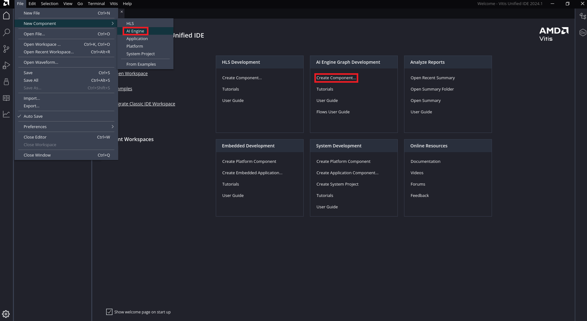</p>
  <p align="center">Fig. 4: AI Engine Component Creation in Vitis Unified IDE.</p>
  </br>

5. Select the project name and component directory and press "next".
6. Select "Add folder" and import the ```src``` folder of this repository. Make sure that ``fft1k_128_graph.cpp`` is the top-level file and press "next".
  <p align="center">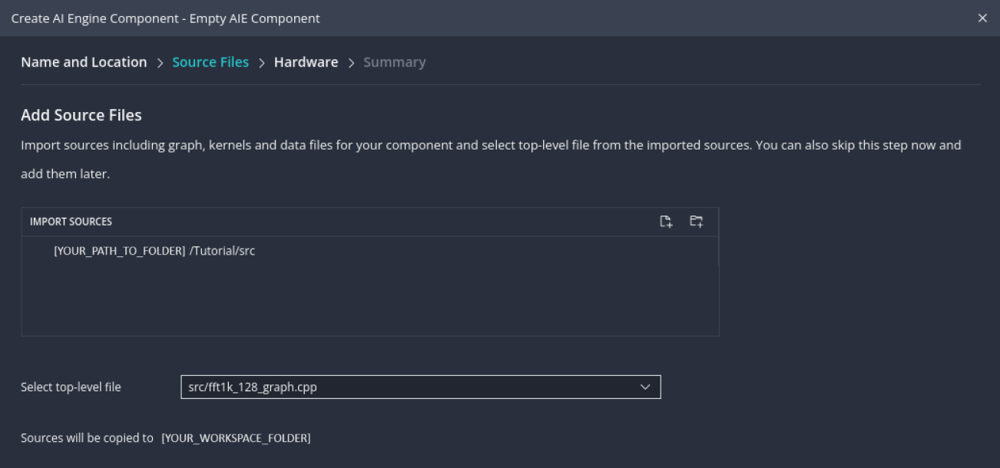</p>
  <p align="center">Fig. 5: AIE Component Creation - Source Files Selection.</p>
  </br>
    
7. When chosing the hardware, select the VEK280 board-based platform, as shown in the following figure, and press "next", and then "finish".
  <p align="center">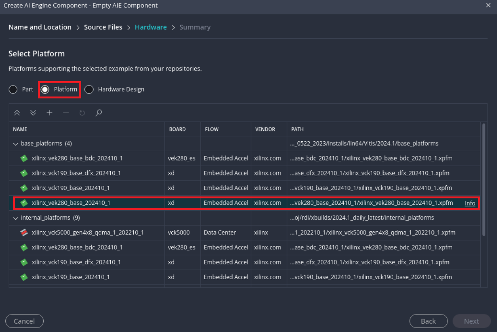</p>
  <p align="center">Fig. 6: AIE Component Creation - Platform Selection.</p>
  </br>

8. Open the compiler configuration clicking on ```aiecompiler.cfg``` under the AI Engine Component's setting folder on the left hand side of the GUI, then click on AI Engine and set the PL frequency to 500MHz, as decided in the design phase of the tutorial.
  <p align="center">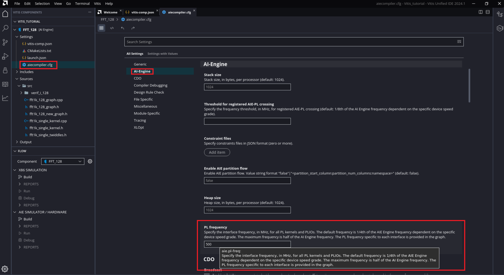</p>
  <p align="center">Fig. 7: Selecting the Programmable Logic Frequency in the AI Engine Compile Settings.</p>

### x86 Simulation and Functional Validation

1. Build the x86 simulation for the graph by clicking "Build" under the "X86 SIMULATION" tab on the "FLOW" menu located on the bottom left corner of the GUI.
2. Run the simulation by clicking "Run" under the same tab of the previous step. This functional simulation takes the input data from the text files present in the ```./src/verif_i_128```, that represent the 16 PLIOs.
    - Note: By default the input data is a set of three rectangular waves per each instance. Those files can be replaced the text files present in the three folders in the ``verification/v_inputs`` folder to test also random signals.
3. Check the execution outputs under the ``Output/x86sim/x86simulator_output/verif_o_128`` in the GUI, as shown in the following figure.
  <p align="center">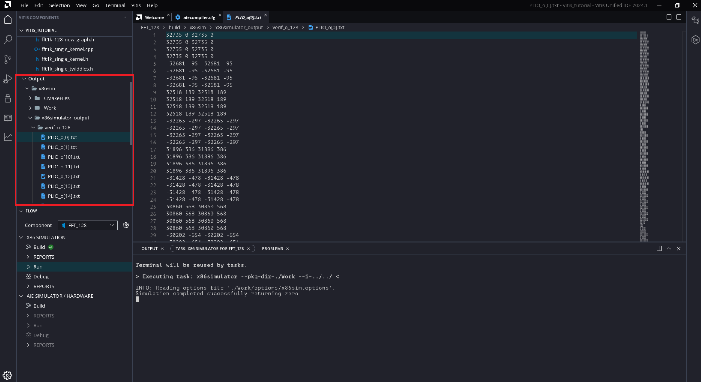</p>
  <p align="center">Fig. 8: Visualizing the x86 Simulation Output Files.</p>
  </br>

4. Perform a functional verification using the Python script in the ``support/verification`` folder of this repository.
   - This script analyzes the text files inside the "v_inputs" and "v_outputs" folder and creates some functional verification charts. 
   For more information refer to [this document](https://gitenterprise.xilinx.com/dgiorgio/AIE-API-based-FFT-for-many-instances-applications-on-AIE-ML/tree/main/support/verification).
   - If you did not modify the input files, you can just run the ```Basic_verification``` Python script with the following terminal command, while being located into the ```support/verification``` directory: ```python -i ./Basic_verification```
   -  If you replaced the simulator input files, replace also the text files inside the ```support/verification/v_inputs``` folder with the ones you used, keeping the same names. Then, copy the output files from ```[project-folder]/build/x86sim/x86simulato_output/verif_o_128``` into the ```support/verification/v_outputs``` folder and run the python script with the aforementioned command.
5. Look at the generated charts and make sure that the comparison graphs are superimposed, and the error is fairly low, as shown in the following figure.
Note that, since this is a fixed point implementation and Numpy performs the FFT with a float datatype, the error could spike when the transform approaches zero.
<p align="center">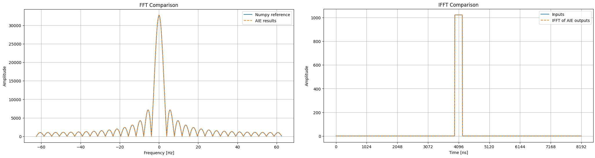</p>
  <p align="center">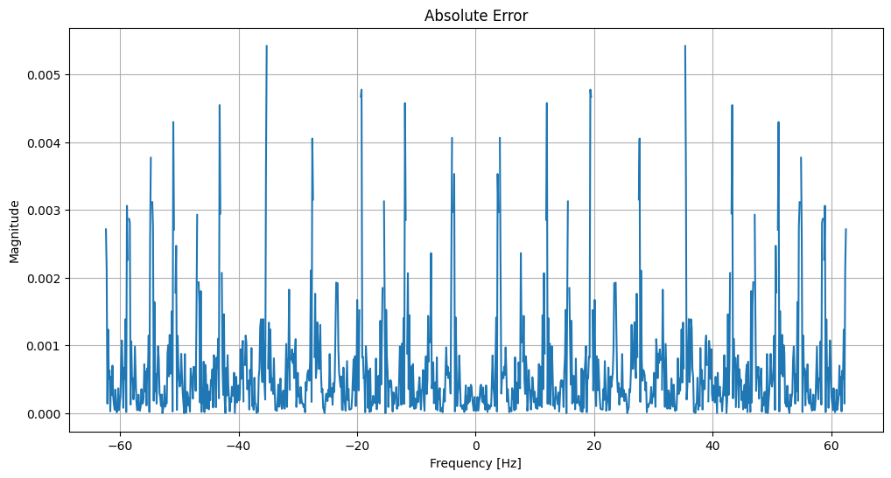</p>
  <p align="center">Fig. 9: Validation Script Graphs.</p>
  </br>

### AI Engine Simulation, Array and Trace Analysis

1. Build the Hardware project for the graph by clicking on "Build" under the "AIE SIMULATOR / HARDWARE" tab on the "FLOW" menu located on the bottom left corner of the GUI.
2. When the build finishes, under the "REPORTS" tab in the "FLOW" menu, click "array" and check the AI Engine utilization. Observe in particular the mapping and routing for the 64 kernels and of the shared buffers.
<p align="center">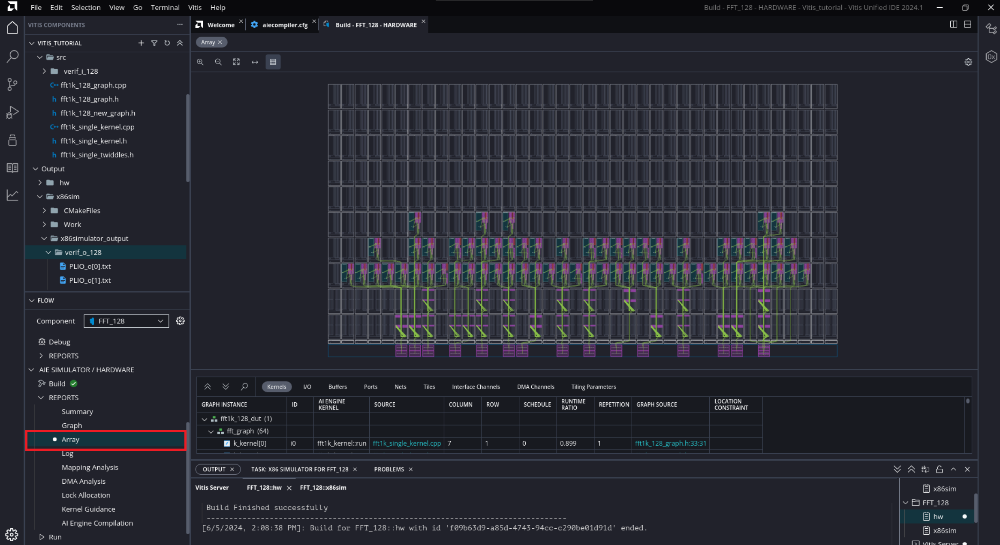</p>
  <p align="center">Fig. 7: Vitis AI Engine array view of the implemented graph.</p>
  </br>

3. Enable tracing for the simulation by opening the ```launch.json``` configuration file, selecting the "aiesim" run and clicking "Enable Trace".
<p align="center">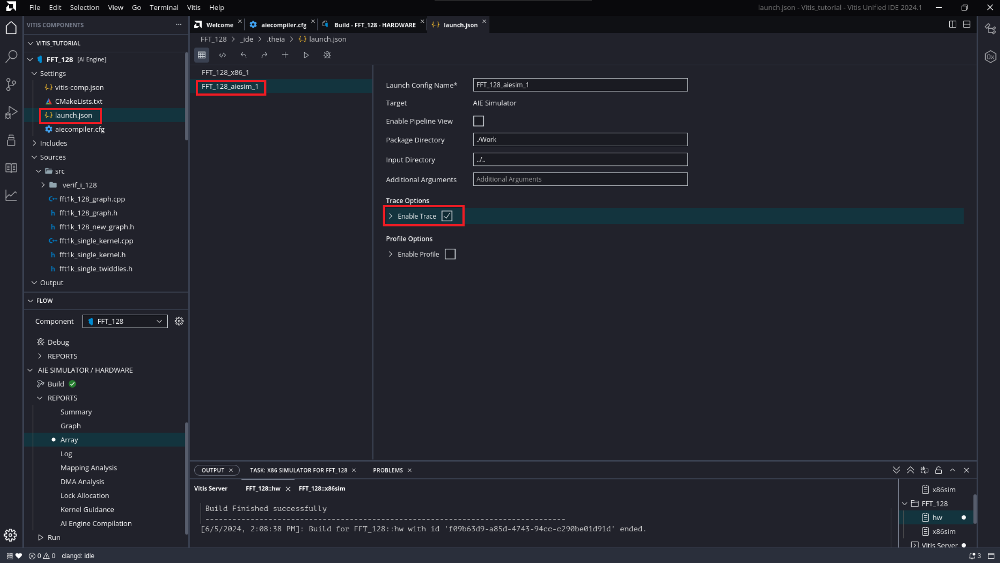</p>
  <p align="center">Fig. 8: Enabling trace for AI Engine simulation.</p>
  </br>

4. Run the AI Engine simulation by clicking "Run" under the "AIE SIMULATOR / HARDWARE" tab on the "FLOW" menu.
5. When the simulation ends, open the Trace reports and collapse all the signals, as shown in the following figure.
<p align="center">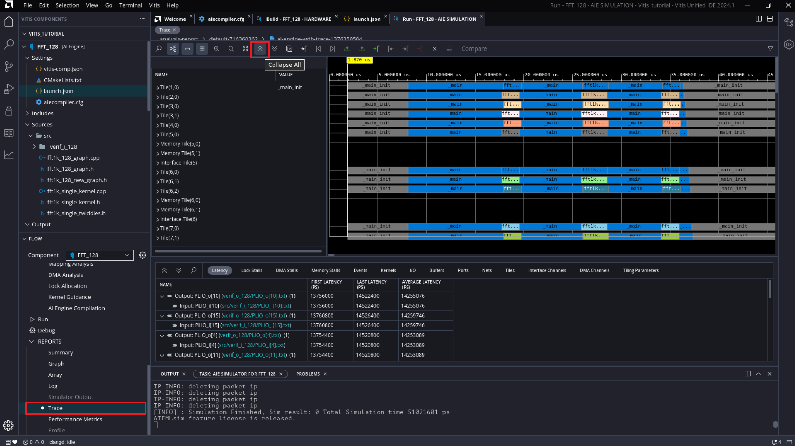</p>
  <p align="center">Fig. 9: Opening and analyzing the AIE simulator trace report.</p>
  </br>
Note that the kernels are running for less than 25% of the time, being locked for the remaining time. Moreover, the memory tiles are almost empty because each shared buffer serves four kernels, thus the shared buffer mapping to the memory tiles is highly port-limited.
Considering the previous validation steps, it can be concluded that the design is functionally correct, but a further optimization can be performed. Indeed, because the AIE-ML is much faster than the data rate, the computation can be serialized, reducing utilization and power consumption.
To look into the optimization step, see the final step of this tutorial.


## Optimizing the AIE-ML Design
After gathering the performance data of the first 3D buffer implementation, we can proceed refining the design through a rework on the Adaptable Flow Graph code. In this section is shown that a much more power efficient implementation can be achieved with a second design iteration by leveraging the results gathered in the first one and applying some basic architectural knowledge. 

### Graph Optimizations 

After gathering the performance data of the first 3D buffer implementation, because the profiling results showed that the kernels are locked for more than $75\%$ of the time, an idea is to further exploit the capacity and features of the memory tiles to buffer more data and use a quarter of the kernels through data serialization. 
To do so, a further dimension that represents time, can be added for the shared buffer. This fourth dimension will make possible that the number of kernels is less affected by the input time interleaving, by moving a selectable amount of instances from the second dimension (depth) to the fourth one.
The resulting code restructuring is minimal and involves the aforementioned reshaping of the shared buffer tensor though a new parameter $\text{KER\\_ILV}$, that expresses the number of times that a kernel must run during the acquisition time, at steady state.
The $\text{KER\\_ILV}$ parameter effectively counteracts the $\text{IO\\_ILV}$ effect, decoupling the spatial-temporal interleaving done for the IOs and the one done inside the AIE-ML, enabling seralization.

The graph header file ``fft1k_128_new_graph.h`` contains the new modified code. Note that the only changes done to the code are the following:
- The shared buffer now has four dimensions: the time dimesion has been added as the third one, and the dimension of the samples (previously the third) is now the fourth.
- Every time that $\text{IO\\_ILV}$ appears in the code, it has to be divided by $\text{KER\\_ILV}$.
- The $\text{MAX\\_BUF}$ variable can be now set to three, according to the formulas in the code.
  - The number of shared buffers that can fit in a memory tile is still port-limited, but since each shared buffer now serves just one kernel instead of four, the number of required active ports lowers to just one for each ping-pong buffer. This means that three input and three output memory shared buffers can be packed together.

In the following code block shows an excerpt of the third loop. Note the differences with the previous design iterations.

    ...
    for(int i=0; i<N_IO; i++){
        int cur = 0;
        for(int k=0; k<IO_ILV/KER_ILV; k++)
            for(int j=0; j<PLIO_WIDTH/REPS; j++){
                read_access(in_mem[i].out[cur]) =
                    tiling(                                                                              
                        {
                            .buffer_dimension = {PLIO_WIDTH, IO_ILV/KER_ILV, 
                                                KER_ILV, POINTS},    
                            .tiling_dimension = {1, 1, 1, POINTS},           
                            .offset           = {REPS*j, k, 0, 0},           
                            .tile_traversal   = {
                                {.dimension=3, .stride=POINTS, .wrap=1},       
                                {.dimension=0, .stride=1, .wrap=REPS},          
                                {.dimension=2, .stride=1, .wrap=KER_ILV},        
                                {.dimension=1, .stride=1, .wrap=1}         
                            } 
                        });
                connect(in_mem[i].out[cur], k_kernel[
                    int(i*(PLIO_WIDTH*IO_ILV/(REPS*KER_ILV))+cur)].in[0]);
    ...

To use the new graph, open the ``"fft1k_128_graph.cpp"`` graph source code file and change the first line:
 ``#include "fft1k_128_graph.h"`` with ``#include "fft1k_128_new_graph.h"``

### x86 Simulation and Functional Validation
The steps for building and verifying the project are the same as those for the second part of the tutorial.
1. Build the x86 simulation for the graph by clicking "Build" under the "X86 SIMULATION" tab on the "FLOW" menu located on the bottom left corner of the GUI.
2. Make sure that all the required verification text files are under the ``./src/verif_i_128`` folder, and run the simulation by clicking "Run", under the same tab of the previous step.
3. Copy the graph's outputs text files in the ``Output/x86sim/x86simulator_output/verif_o_128`` folder and paste them into the ``support\verification\v_outputs`` folder to make sure that the verification Python script works on the new output data.
4. Run the Python verification script while being located into the ```support/verification``` directory with the following command ```python -i ./Basic_verification``` and make sure that the results are correct.

### AI Engine Simulation, Array and Trace analysis
The steps for building the hardware and analyzing the reports are the as those for the second part of the tutorial.
1. Build the Hardware project for the graph by clicking "Build" under the "AIE SIMULATOR / HARDWARE" tab on the "FLOW" menu located on the bottom left corner of the GUI.
2. When the build finishes, under the reports in the "FLOW" menu, click "array" and check the AI Engine utilization.
  Observe that the number of kernels is 16 instead of 64, and that there are six well-filled memory tiles, instead of 23 mostly empty. Note that this great reduction in utilization also translates to a huge reduction in dynamic power.
<p align="center">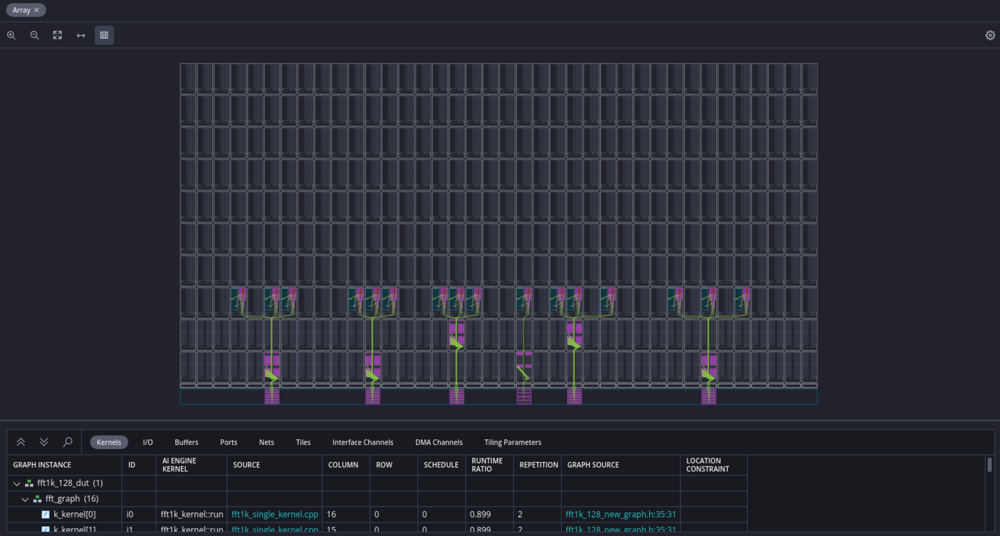</p>
  <p align="center">Fig. 10: 4D Buffer Implementation's AI Engine Array Report.</p>
  </br>

4. Enable tracing for the simulation by opening the ```launch.json``` configuration file, selecting the "aiesim" run and clicking "Enable Trace". If you modified the ``launch.json`` settings in the second part of the tutorial, skip this step.
5. Launch the AIE simulation by clicking "Run" under the "AIE SIMULATOR / HARDWARE" tab on the "FLOW" menu.
6. When the simulation ends, open the Trace reports and collapse all the signals.

Note now that the kernels are running for more than 90% of the time at steady state, as expected.

<p align="center">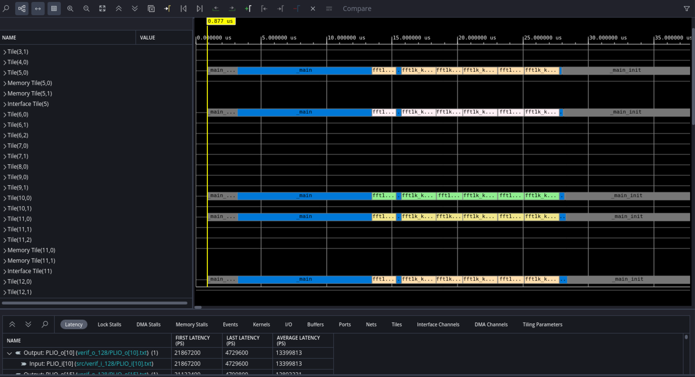</p>
  <p align="center">Fig. 11: 4D buffer Implementation's Trace Report.</p>
  </br>

## Support

GitHub issues will be used for tracking requests and bugs. For questions, go to [support.xilinx.com](http://support.xilinx.com/).

## License

Components: xilinx-images

images in the documentation

Components: xilinx-files

The MIT License (MIT)

Copyright (c) 2024 Advanced Micro Devices, Inc.

Permission is hereby granted, free of charge, to any person obtaining a copy
of this software and associated documentation files (the "Software"), to deal
in the Software without restriction, including without limitation the rights
to use, copy, modify, merge, publish, distribute, sublicense, and/or sell
copies of the Software, and to permit persons to whom the Software is
furnished to do so, subject to the following conditions:

The above copyright notice and this permission notice shall be included in all
copies or substantial portions of the Software.

THE SOFTWARE IS PROVIDED "AS IS", WITHOUT WARRANTY OF ANY KIND, EXPRESS OR
IMPLIED, INCLUDING BUT NOT LIMITED TO THE WARRANTIES OF MERCHANTABILITY,
FITNESS FOR A PARTICULAR PURPOSE AND NONINFRINGEMENT. IN NO EVENT SHALL THE
AUTHORS OR COPYRIGHT HOLDERS BE LIABLE FOR ANY CLAIM, DAMAGES OR OTHER
LIABILITY, WHETHER IN AN ACTION OF CONTRACT, TORT OR OTHERWISE, ARISING FROM,
OUT OF OR IN CONNECTION WITH THE SOFTWARE OR THE USE OR OTHER DEALINGS IN THE
SOFTWARE.

<p class="sphinxhide" align="center">  &copy; Copyright 2024 Advanced Micro Devices, Inc.</p>
<p class="sphinxhide" align="center">  &copy; Copyright 2021 Xilinx Inc.</p>
