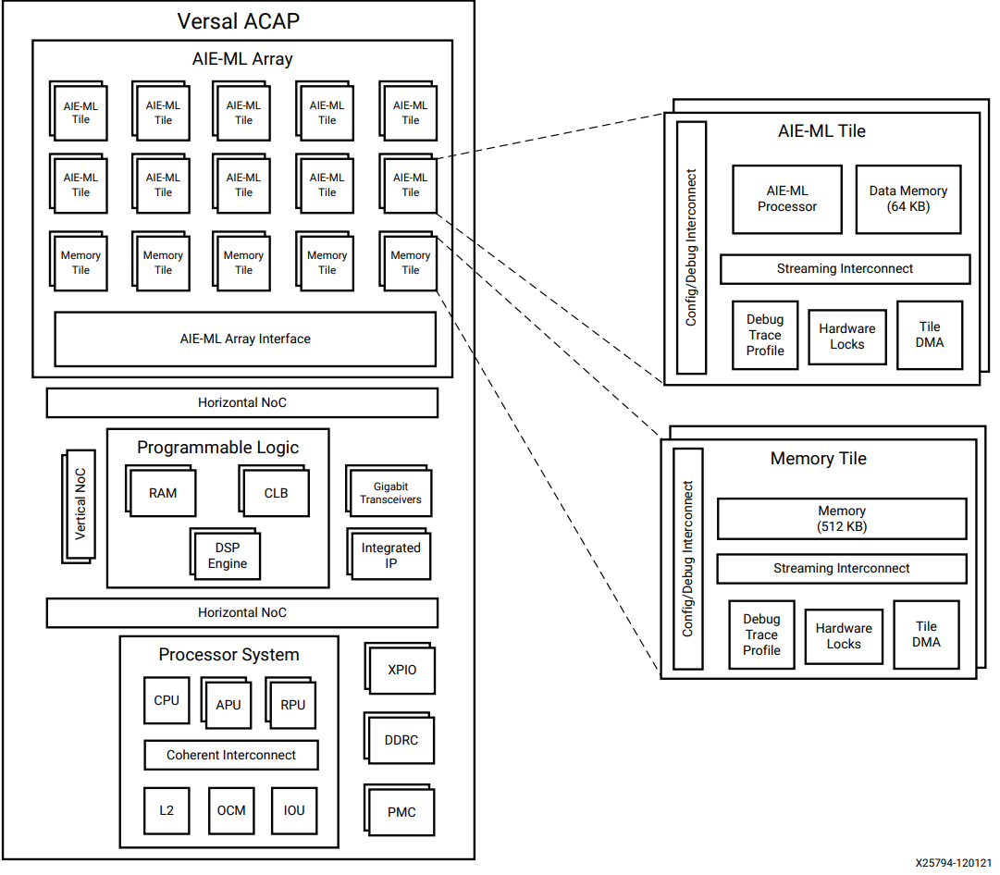
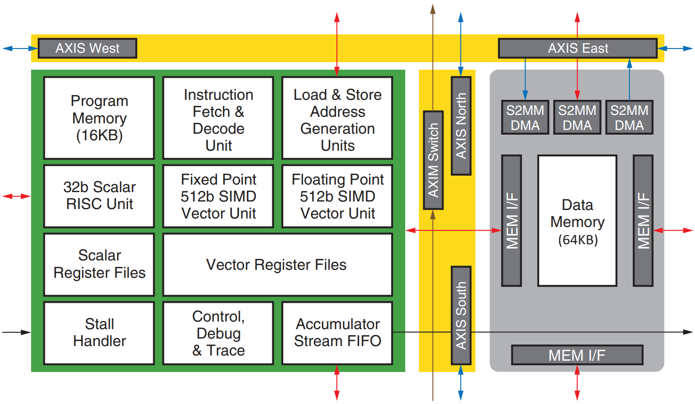
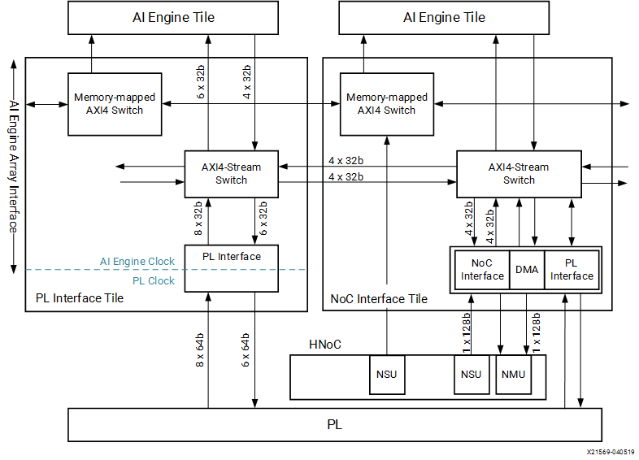
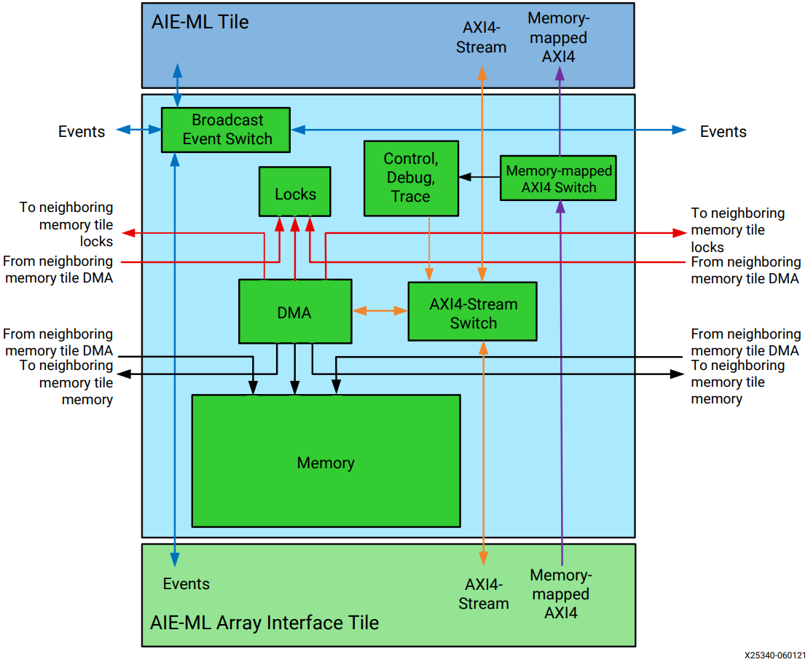
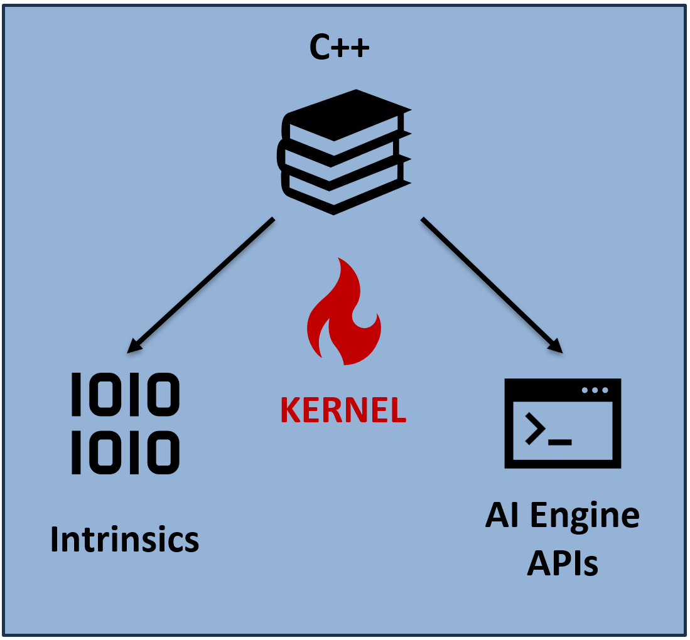
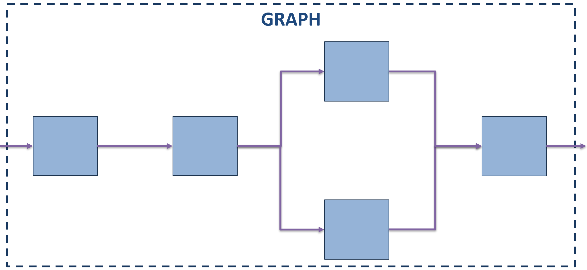

<table class="sphinxhide" width="100%">
 <tr width="100%">
    <td align="center"><h1>AIE-ML Development</h1>
    <a href="https://www.xilinx.com/products/design-tools/vitis.html">See Vitis™ Development Environment on xilinx.com </a>
    <a href="https://www.xilinx.com/products/design-tools/vitis/vitis-ai.html">See Vitis™ AI Development Environment on xilinx.com </a>
    </td>
 </tr>
</table>

# Versal and AI Engine ML basics

The aim of this document is to give the simple background needed to understand the tutorial. 
For further information, please refer to the following documentation:
- [Versal Adaptive SoC Technical Reference Manual (AM011)](https://docs.amd.com/r/en-US/am011-versal-acap-trm)
- [Versal Adaptive SoC AIE-ML Architecture Manual (AM020)](https://docs.amd.com/r/en-US/am020-versal-aie-m)
- [AI Engine-ML Kernel and Graph Programming Guide (UG1603)](https://docs.amd.com/r/en-US/ug1603-ai-engine-ml-kernel-graph/)
- [ACAP at the Edge with the Versal AI Edge Series (WP158)](https://docs.amd.com/v/u/en-US/wp518-ai-edge-intro)
- [Versal AI Edge webpage](https://www.xilinx.com/products/silicon-devices/acap/versal-ai-edge.html#productAdvantages)

## Versal adaptive SoC overview

Fig. 1: High level block diagram of the Versal Adaptive SoC architecture.

 

The AMD Versal Adaptive SoC can be divided into four main parts:
- **Scalar Engines**, composed of
  - **Processing System** (**PS**), an ensamble of real-time (Real-time Proccessing
Unit, RPU) and application (Application Processing Unit, APU) processors;
  - **Platform Management Controlle** (**PMC**), the unit that configures and
monitors the whole system.

- **Adaptable Engines**, composed of the **Programmable Logic** (PL, also known as
fabric), a sea of programmable logic resources and interconnect, and memory that
allows for the implementation of soft IPs.

- **Intelligent Engines**, used for compute-intensive tasks, and composed of
  - **DSP Engines**: a series of hard blocks spread in the programmable logic, that implement arithmetic-logic operations, including multiply-and-accumulate (MAC) and vector (Single Instruction Multiple Data, SIMD) arithmetic.
  - **AI Engines**: an array of interconnected Very-Long-Instruction-Word (VLIW) Single-Instruction-Multiple-Data (SIMD) capable processors, characterized by high computation density and programmability.

- **Network-on-Chip** (**NoC**), **Interconnect** and **hard IPs**, a plethora of components that enable communication among engines, I/O operations, memory operations, and adapt various communication technologies and protocols.

## Versal AI Engine ML overview
The AI Engine (AIE) is a two-dimensional array of computation, memory and interconnect resources connected to programmable logic and to the NoC. 

Fig. 2: High level block diagram of the AI Engine ML array.

 
Its purpose is to leverage its specialized processors to process heavy computations without requiring timing closure, and to spare programmable logic resources. The AI Engine currently comes in two versions, the AI Engine and the AI Engine - Machine Learning (AIE-ML), that is a new model of the component that has been introduced to support the heavy computation and memory loads needed by machine learning application, introducing some new features. Note however, that the new memory features are beneficial also for some DSP applications, such as FFTs.

The AI Engine ML array is composed of three main blocks:
- **AI Engine ML Tiles**, also called **compute tiles**, that comprehend a 64 kilobyte local memory, a plethora of interconnect resources, various blocks to control the program execution, and a 6-ways Very-Long-Instruction-Word microprocessor equipped with a vector unit capable of performing both fixed and floating point operations.

Fig. 3: Block diagram of the AI Engine ML tile.

 

- **Interface tiles**, whose task is to route the data in the AI Engine from the programmable logic and the programmable Network-on-Chip. Those are a set of interfaces that manages domain crossings, such as Clock Domain Crossing (CDC) between the PL $(f_ { \text{clk}} \sim 500 \text{ MHz})$ and AIE-ML $(f_ {\text{clk}} \ge 1 \text{ MHz})$ environment, and AXI4 compliant multi-channel interconnect to efficiently route the data.

Fig. 4: Block diagram of PL and NoC interface tiles.

 

- **Memory tiles**, that are exclusive of the ML version of the AI Engine, and comprise various interconnect and control resources as well as a 512 kilobyte memory equipped with 6 read and 6 write ports with user programmable access pattern and support for multi-dimensional buffers.

Fig. 5: Block diagram of the memory tile.

## AI Engine programming basics
To program the AI Engine ML, we resort to **kernels** and **graphs**.
The kernel is the actual program running inside the compute tile. It can be coded in C++ with two programming styles, each using a different set of APIs. 
 

Fig. 6: Kernel coding styles.

 

- The intrisics APIs are a set of low level, architecture dependend functions, much similar to low level C or Assembly.
- The AI Engine APIs are instead a set of higher level optimized functions built with intrinsics, that are device independent, thus portable among the various AI Engine models.

The kernels are then connected and encapsulated in a graph, also coded in C++, that works as a Kahn Process Network, meaning that each kernel waits for all its needed data before running. 
It is worth mentioning that a graph can also encapsulate other graphs.
 

Fig. 7: Example of a graph.

 

## Support

GitHub issues will be used for tracking requests and bugs. For questions, go to [support.xilinx.com](http://support.xilinx.com/).

## License

Components: xilinx-images

images in the documentation

Components: xilinx-files

The MIT License (MIT)

Copyright (c) 2024 Advanced Micro Devices, Inc.

Permission is hereby granted, free of charge, to any person obtaining a copy
of this software and associated documentation files (the "Software"), to deal
in the Software without restriction, including without limitation the rights
to use, copy, modify, merge, publish, distribute, sublicense, and/or sell
copies of the Software, and to permit persons to whom the Software is
furnished to do so, subject to the following conditions:

The above copyright notice and this permission notice shall be included in all
copies or substantial portions of the Software.

THE SOFTWARE IS PROVIDED "AS IS", WITHOUT WARRANTY OF ANY KIND, EXPRESS OR
IMPLIED, INCLUDING BUT NOT LIMITED TO THE WARRANTIES OF MERCHANTABILITY,
FITNESS FOR A PARTICULAR PURPOSE AND NONINFRINGEMENT. IN NO EVENT SHALL THE
AUTHORS OR COPYRIGHT HOLDERS BE LIABLE FOR ANY CLAIM, DAMAGES OR OTHER
LIABILITY, WHETHER IN AN ACTION OF CONTRACT, TORT OR OTHERWISE, ARISING FROM,
OUT OF OR IN CONNECTION WITH THE SOFTWARE OR THE USE OR OTHER DEALINGS IN THE
SOFTWARE.

  &copy; Copyright 2024 Advanced Micro Devices, Inc.

  &copy; Copyright 2021 Xilinx Inc.
