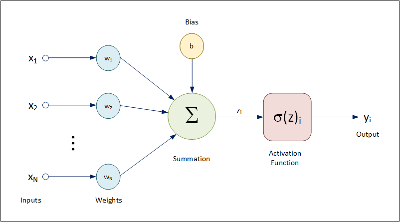
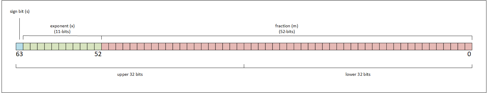
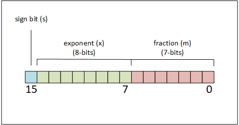
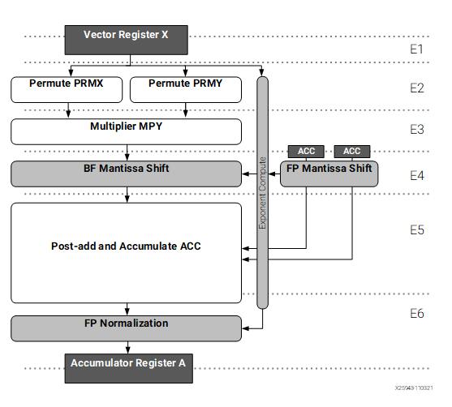
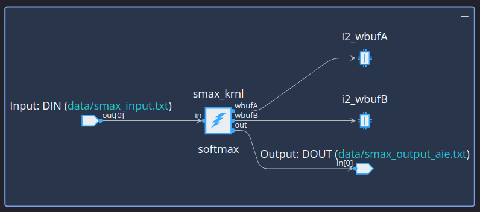
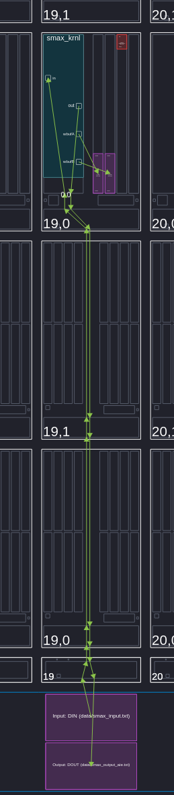
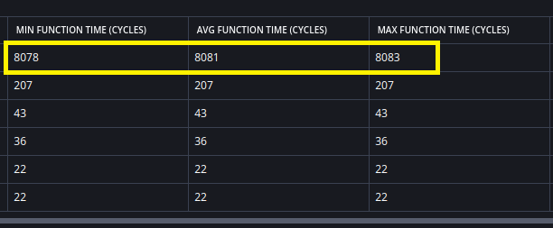
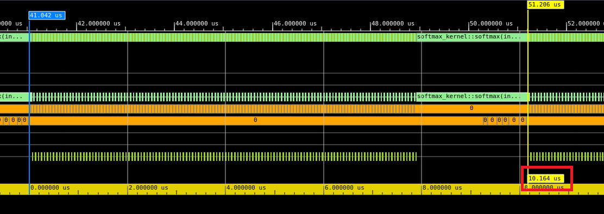
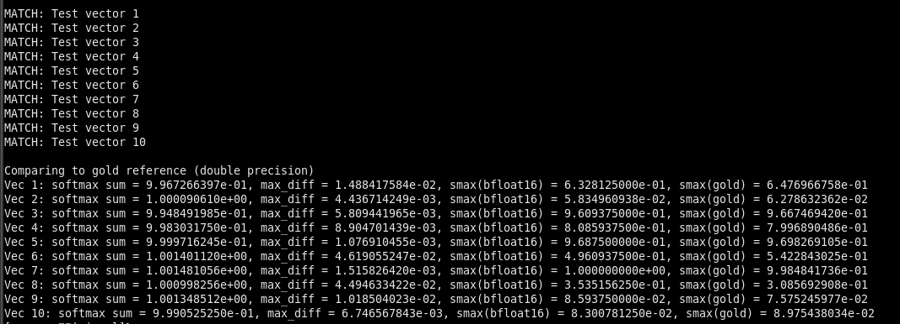

<table class="sphinxhide" style="width:100%;">
  <tr>
    <td align="center">
      <picture>
        <source media="(prefers-color-scheme: dark)" srcset="https://raw.githubusercontent.com/Xilinx/Image-Collateral/main/logo-white-text.png">
        
      </picture>
      <h1>AMD Vitis™ AI Engine Tutorials</h1>
      <a href="https://www.amd.com/en/products/software/adaptive-socs-and-fpgas/vitis.html">See Vitis™ Development Environment on amd.com</a>
        </br>
      <a href="https://www.amd.com/en/products/software/vitis-ai.html">See Vitis™ AI Development Environment on amd.com</a>
    </td>
  </tr>
</table>

# Softmax Function

***Version: Vitis 2025.2***

## Table of Contents

1. [Introduction](#introduction)
2. [Softmax Function Definition](#softmax-function-definition)
3. [Computing the Exponential Function](#computing-the-exponential-function)
4. [AI Engine Implementation](#ai-engine-implementation)
5. [AI Engine Kernel Processing](#ai-engine-kernel-processing)
6. [Running the Example](#running-the-example)
7. [Analyzing Results](#analyzing-results)

[References](#references)

[Support](#support)

## Introduction

Machine Learning is pervasive in most modern applications. Machine learning tends to infer processing of structured data. The sub-class of deep learning is often applied to unstructured data. This requires more abstraction to extract significant features from a data set. Some applications have proven to benefit from the application of deep learning. These include natural language processing and image classification, where the relationship between input data and desired output can be exceedingly complex.

Deep learning solutions are often created in the form of a neural network, as depicted in the following figure.


*Figure 1 - Artificial Neural Network*

An artificial neural network consists of layers of neurons intended to mimic behavior of the human brain. Each layer has nodes that connect to adjacent layers. The number of nodes in a layer and number of hidden layers can vary depending on implementation. Nodes in the graph represent individual neurons, which you may see depicted in more detail in the following figure.



*Figure 2 - Artificial Neuron*

Input data to each layer is multiplied by a weight before being summed together. Training the neural network using empirical data determines these weights. The activation function transforms the weighted sum of inputs into an output signal. Activation functions add non-linearity to neural networks, enabling them to approximate any complex function of the input data. Different types of activation functions are available to use within the various layers of the neural network. Softmax is the activation function often applied to the output layer.

## Softmax Function Definition

The softmax function is defined for a vector of real values $\mathbf{z} = \left( z_1, z_2, \ldots , z_M \right)$ by the equation

$$
\Large {\sigma \left( \mathbf{z} \right) {\small i}} = {\frac{e^{z_i}}{\sum\nolimits_{j=1}^{M} e^{z_j}}}
$$

where $z_i$ are the individual outputs of the layer. Softmax differs from other popular activation functions. It takes into account the entire layer and scales outputs so they sum to a value of 1. You can interpret each individual output as a probability. In classification problems, you can interpret softmax output as probability that the input data belongs to a specified class.

When computing the softmax function, there is a risk of overflow. Overflow can occur during evaluation of the individual exponential functions that comprise the formula. For bfloat16 floating-point numbers, the exponential function overflows when input values exceed 88.5. To avoid overflow, use the following equivalent formula for softmax function evaluation.

$$
\Large {\sigma \left( \mathbf{z} \right) {\small i}} = {\frac{e^{z_i - \alpha}}{\sum\nolimits_{j=1}^{M} e^{z_j- \alpha}}}
$$

where $\alpha$ is a real-valued constant. In particular, $\alpha$ is often chosen to be the maximum of all $z_i$ values comprising the input vector. Subtracting the maximum value from all others constrains inputs to the exponential functions to the range $(-\infty, 0]$. This in turn limits the exponential function values to the range $[0, 1]$.

Another alternative to evaluating the softmax function is to use the equivalent formula

$$
\Large {\sigma \left( \mathbf{z} \right) {\small i}} = \exp \left( z_i - \log \sum\nolimits_{j=1}^{M} e^{z_j} \right)
$$

which is attractive because it requires no division. However, practice has shown that this formula tends to produce larger computational errors [[1]].

## Computing the Exponential Function

### IEEE 754 Format Trick

In addition to basic arithmetic operations, softmax computation depends on efficient evaluation of the exponential function. Several ways exist to accomplish this. An attractive alternative is to estimate the exponential function using a trick based on IEEE 754 floating-point format [[2]]. The following figure shows a double-precision, floating-point number represented by IEEE 754 format.



*Figure 3 - IEEE 754 Format for Double-Precision Numbers*

This format is used to represent a number $(-1)^s(1+m)2^{x-x_0}$, where $s$ is a sign bit, $m$ is the 52-bit fractional part of a normalized mantissa, and $x$ is an 11-bit exponent with bias $x_0 = 1023$.

Approximation is based on the identity $e^y = 2^{y/log(2)}$. So for any floating-point number $y$, the value $e^y$ is approximated by setting the exponent $x$ of the result to $y/log(2) + x_0$. To perform the computation, it helps to divide a double precision number into two groups comprised of upper 32 bits and lower 32 bits. The lower 32 bits are set to 0 in this approximation, while the upper 32 bits are the same bits used to represent the signed 32-bit integer value

$$
I_{upper} = \left\lfloor \frac{2^{20}y}{log(2)} + 2^{20}x_0 - C \right\rfloor .
$$

A factor of $2^{20}$ represents a binary shift necessary to align with the exponent field of the IEEE 754 format. Residual mantissa bits provide a degree of interpolation between exponent values. The parameter $C$ is a correction factor meant to mitigate estimation error. It was found that a value of $C=60801$ minimizes RMS error [[2]]. You can adapt this estimation method for other variations of floating-point number representations, such as bfloat16 data type.

### Improving Accuracy

While this trick is computationally efficient, it can result in an estimation error as large as ~4% of the true value. To reclaim lost accuracy, [[3]] proposes a method where computation uses all 64 bits and defines a correction function $F$. To derive the solution, begin by expressing the exponential function in the form

$$
e^y = 2^{y/log(2)} = 2^{y_{i}} \cdot 2^{y_{f}} \approx 2^{y_{i}} \cdot \left( 1 + m - F \right),
$$

where $y_i$ and $y_f$ are the integer and fractional parts of $y/log(2)$, respectively. Solving for $F = 1 + m - 2^{y_{f}}$ defines the correction function. Because $m \equiv y_{f}$, an equivalent expression is $F \left( y_{f} \right) = 1 + y_{f} - 2^{y_{f}}$. The correction function $F \left( y_f \right)$ can be modeled as a polynomial, where $y_f$ is defined over the range $[0, 1)$.

Compute the following to obtain the exponential function estimate:

$$
I = \left\lfloor \frac{2^{52}}{log(2)} \left( y - log(2) F(y_f) \right) + 2^{52}x_0 \right\rfloor
$$

as a 64-bit signed integer then reinterpreting the result as a double-precision floating-point value. Because computation uses all 64 bits, a factor $2^{52}$ is necessary to align to the exponential field of the IEEE 754 format.

### Adapting for bfloat16 Floating-Point

AMD Versal™ Edge Adaptive SoCs primarily contain a variant of AI Engine processor, which has bfloat16 floating-point as a native data type. The following figure shows the structure of a bfloat16 number.



*Figure 4 - bfloat16 Floating-Point Format*

This format is structurally similar to double-precision format. However, it has reduced dynamic range and precision because fewer bits represent the exponent and mantissa. The number of exponent bits is the same as IEEE 754 single-precision format, giving bfloat16 essentially the same dynamic range. This is attractive in deep learning and other applications where dynamic range is more important than precision. To adapt exponential function approximation to bfloat16 data types, the equation becomes

$$
I = \left\lfloor \frac{2^{7}}{log(2)} \left( y - log(2) F(y_f) \right) + 2^{7}x_0 \right\rfloor
$$

where $x_0 = 127$ and $I$ is computed as a signed 16-bit integer which is then reinterpreted as bfloat16.

You can approximate the correction function $F(y_f)$ with a polynomial. However, quantization introduced by bfloat16 arithmetic used to evaluate the polynomial, and remaining softmax function computation, counteracts the benefit of using a correction function. Also, for bfloat16 numbers greater than 128.0, there is no fractional part to serve as an argument for the correction polynomial. When considering exponential function evaluation with bfloat16 data types, you can avoid unnecessary computation by using the simpler estimation

$$
I = \left\lfloor \frac{2^{7}}{log(2)}  y + 2^{7}x_0 \right\rfloor
$$

which becomes

$$
I = \left\lfloor 185  y + 16256 \right\rfloor
$$

after taking quantization of coefficients into account. For an example of using a correction function in exponential function estimation, consult the [Softmax Function Tutorial](../../../AIE/Design_Tutorials/18-Softmax-Function/) based on single-precision floating-point computation.

## AI Engine Implementation

One of the key parameters impacting the amount of computation required for evaluating the softmax function is the number of classes. For the example presented here, 2048 classes represent the output nodes of a neural network. Because data is in bfloat16 floating-point format, this requires the floating-point vector unit of the AI Engine, shown in the following figure. The floating-point multiply unit processes vectors with 16 lanes, so softmax computation accommodates a SIMD factor of 16.



*Figure 5 - AI Engine Floating-Point Vector Unit*

From the preceding figure, you can observe that the floating-point vector processor has a pipeline depth of six. To improve compute efficiency, design kernel processing to keep the pipeline full. This is not the case when a computation needs to wait for intermediate results to proceed. To take full advantage of software pipelining, break computation into components and store intermediate results in data memory. Each loop in the kernel processes a specific computation for the entire number of classes in the softmax function, 16 elements at a time. Each invocation of the kernel computes a single softmax vector comprising the values for all outputs according to the following processing order:

1. Read and store all input values while searching for the maximum value, then subtract the maximum value from all inputs. (two computational loops)
2. Compute exponential function of all values. (two computational loops)
3. Sum all exponentials and invert sum to obtain scaling factor. (single computational loop plus scalar processor inverse operation)
4. Multiply all exponentials by scaling factor and send result to output. (single computational loop)

## AI Engine Kernel Processing

### Kernel Data Interface

While this kernel processes `bfloat16` data, the function signature indicates that data type at the interface is `int16` for both input and output.

```cpp
void softmax_kernel::softmax(input_stream<int16>* in, output_stream<int16>* out)
```

Each of these `int16` values represents the 16-bits of a `bfloat16` value. When the kernel uses them, it reinterprets values as `bfloat16` for processing. The reason for this is that when performing AI Engine simulation, input and output of data use text files. Using `int16` preserves all bits of the floating-point number when read from or written to a text file. It also allows for test vector matching at the bit level.

The streaming interfaces provide input and output, which reduces latency and eliminates the need for ping pong buffers in data memory.

### Kernel Code

The following code shows the first two processing loops of the kernel. Iterators are defined for work buffers specified in data memory to hold intermediate results. The first processing loop reads input values for softmax computation and stores them to memory while searching for the maximum input value. After determining the maximum value, a second loop reads input values from memory. It subtracts the maximum value from each and stores results back to memory. The iterators reset after each loop completes to prepare them for the next loop.

```cpp
// set rounding to match MATLAB generated test vectors
aie::set_rounding(aie::rounding_mode::symmetric_inf);
aie::set_saturation(aie::saturation_mode::saturate);

// work buffers in data memory
auto pWbufA = aie::begin_restrict_vector<16>(wbufA);
auto pWbufB = aie::begin_restrict_vector<16>(wbufB);

// read and store data while searching for maximum value
float max_val = -2 ^ 127;

for (unsigned i=0; i < BUFFSZ/16; i++) 
    chess_prepare_for_pipelining
    chess_loop_count(BUFFSZ/16)
{
    aie::vector<bfloat16,16> vin = v16bfloat16(readincr_v<16>(in));
    float vmax = aie::reduce_max(vin);
    if (vmax > max_val) {
        max_val = vmax;
    }
    *pWbufA++ = v16int16(vin);
}

pWbufA -= (BUFFSZ/16);

chess_separator();

// subtract maximum value from all input values
aie::accum<accfloat,16> accM;
accM.from_vector(aie::broadcast<float,16>(max_val));

for (unsigned i=0; i < BUFFSZ/16; i++) 
    chess_prepare_for_pipelining
    chess_loop_count(BUFFSZ/16)
{
    aie::vector<bfloat16,16> vecA = v16bfloat16(*pWbufA++);
    aie::accum<accfloat,16> accA;
    accA.from_vector(vecA);
    *pWbufB++ = v16int16(aie::to_vector<bfloat16>(aie::sub(accA, accM)));
}

pWbufA -= (BUFFSZ/16);
pWbufB -= (BUFFSZ/16);

chess_separator();
```

The next segment of kernel code, shown below, uses two computational loops to evaluate the exponential function for all inputs. The first loop scales all inputs by $\frac{1}{\log(2)}$ and adds the exponent offset. Also built into this computation is scaling by a factor of $2^7$ to align the result with the exponent field of the `bfloat16` format. The kernel header file defines constants in this computation. The second loop takes these values and extracts the 16-bit integer part used to represent a `bfloat16` number. Because the maximum value is subtracted from each input, the exponential function values must be in the range $[0, 1]$. Additional instructions check for values outside this range. If the system detects any such values, it assumes they result from overflow and sets them to zero.

```cpp
/****** Start of computation of exponential functions of all input values ******/
// convert results to IEEE 754 format - use 2 loops
aie::accum<accfloat,16> b_acc;
b_acc.from_vector(aie::broadcast<float,16>(exp_B));

for (unsigned i=0; i < BUFFSZ/16; i++) 
    chess_prepare_for_pipelining
    chess_loop_count(BUFFSZ/16)
{
    aie::vector<bfloat16,16> vecB = v16bfloat16(*pWbufB++);
    aie::accum<accfloat,16> aout = aie::mac(b_acc, vecB, exp_S);
    *pWbufA++ = v16int16(aie::to_vector<bfloat16>(aout));
}

pWbufA -= (BUFFSZ/16);
pWbufB -= (BUFFSZ/16);

chess_separator();

for (unsigned i=0; i < BUFFSZ/16; i++) 
    chess_prepare_for_pipelining
    chess_loop_count(BUFFSZ/16)
{
    aie::vector<bfloat16,16> vecA = v16bfloat16(*pWbufA++);
    aie::vector<int16,16> exp_i = aie::to_fixed<int16>(vecA,0);

    // integer values should be in the range [0, 16,256], find outliers and set to zero
    aie::mask<16>  msk_neg = aie::lt(exp_i,int16(0));
    aie::vector<int16,16> exp_bnd = aie::select(exp_i, aie::zeros<int16,16>(), msk_neg);
    aie::mask<16>  msk_pos = aie::gt(exp_bnd, int16(16256));
    exp_bnd = aie::select(exp_bnd, aie::zeros<int16,16>(), msk_pos);
    *pWbufB++ = exp_bnd;
}

pWbufA -= (BUFFSZ/16);
pWbufB -= (BUFFSZ/16);

/****** End of computation of exponential functions of all input values ******/

chess_separator();
```

With the exponential function of all inputs computed, the following kernel code evaluates the softmax function. The first loop sums exponential values in individual vector lanes. Next, the code sums individual vector lanes and invokes the scalar processor to compute a scale factor, which is the inverse of the sum. The final loop multiples all the exponential values by the scale factor and sends the result to output.

```cpp
// accumulate all vectors to determine scale factor
aie::accum<accfloat,16> accsum;
accsum.from_vector(aie::zeros<bfloat16,16>());

for (unsigned i=0; i < BUFFSZ/16; i++) 
    chess_prepare_for_pipelining
    chess_loop_count(BUFFSZ/16)
{
    aie::vector<bfloat16,16> vecB = v16bfloat16(*pWbufB++);
    accsum = aie::add(accsum, vecB);
}

pWbufB -= (BUFFSZ/16);

chess_separator();

// compute inverse
bfloat16 scl_fctr = aie::inv(aie::reduce_add(aie::to_vector<bfloat16>(accsum)));

// scale values and write to output
for (unsigned i=0; i < BUFFSZ/16; i++) 
    chess_prepare_for_pipelining
    chess_loop_count(BUFFSZ/16)
{
    aie::vector<bfloat16,16> vecB = v16bfloat16(*pWbufB++);
    aie::vector<int16,16> vout = v16int16(aie::to_vector<bfloat16>(aie::mul(vecB, scl_fctr)));
    writeincr(out, vout);
}
```

## Running the Example

Running the example requires that you have both MATLAB and AMD Vitis™ tools installed and configured correctly. After downloading the files, cd into the ``.../05-Softmax-Function/aie-ml/`` directory and use the make build process.

### Generating Test Vectors

Before running the AI Engine graph simulation, you need test vectors to provide input. Scripts are also provided to compare with AI Engine simulator output for verification. To generate the vectors, run the following command:

```bash
$ make gen_vectors
```

This tutorial includes test vectors, so this step is not necessary before AI Engine simulation. If desired, you can run the ``matlab/genvectors_softmax_aie_ml_bfloat16.m`` function from the MATLAB environment to generate test vectors. This function accepts input arguments specifying the number of softmax classes and the number of softmax vectors to generate. This function also creates a file ``aie-ml/src/config.h``, which configures the AIE kernel and simulation to process the generated test vectors.

### Running x86 Simulation

To perform a functional x86 simulation, enter the following sequence of commands:

```bash
$ make x86com
$ make x86sim
$ make check_x86sim
```

The first command compiles graph code for simulation on an x86 processor. The second command runs the simulation. The final command invokes MATLAB to compare the simulator output with test vectors.

### Running AI Engine Simulation

To perform AI Engine emulation using the SystemC simulator, enter the following sequence of commands:

```bash
$ make aiecom
$ make aiesim
$ make check_aiesim
```

The first command compiles graph code for the SystemC simulator. The second command runs the simulation. The final command invokes MATLAB to compare simulation output with test vectors. To generate trace and profile data during simulation, use the sequence:

```bash
$ make aiecom
$ make profile
$ make check_aiesim
```

## Analyzing Results

### Vitis Analyzer

Vitis Analyzer is an essential tool for accessing information on compilation, simulation, and implementation of AI Engine graphs. You can use it to obtain a summary on profiling data and to graphically display trace events. You can launch the tool with the ``vitis_analyzer`` command, or for this example, by entering:

```bash
$ make analyze
```

The Graph view displays connectivity of the AI Engine graph. The following figure displays this for the current example. This simple example shows a softmax kernel with streaming data input and output. Also visible are two buffers in data memory used for holding intermediate computations.



*Figure 6 - Vitis Analyzer Graph View*

The Array view displays how the AI Engine graph maps to the AI Engine array for the device specified. This example uses a VE2802 Versal AI Edge device which contains 304 AI Engine tiles. As shown in the following figure, this example utilizes a single AI Engine tile. The tile contains an AI Engine for kernel processing along with work buffers in data memory. The amount of memory required for these buffers depends on the number of classes in the softmax function. For this example with 2048 classes, only a small portion of the 64 kB associated with the tile gets utilized.



*Figure 7 - Vitis Analyzer Array View*

The following figure contains information from the Profile view. The highlighted fields show that the softmax kernel takes up to 8,083 cycles to process 2048 classes. For lowest speed grade Versal devices, this translates to a processing rate of ~123,716 softmax computations per second. Higher speed grade devices have a peak rate of ~154,645 softmax computations per second.



*Figure 8 - Vitis Analyzer Profile View*

The following figure shows part of the Vitis Analyzer trace view. The cursors show that the time between the end of one kernel invocation to the end of the next is 10.164 $\mu s$. The additional overhead causes softmax computation rate to decrease to ~98,386 computations per second in higher speed grade devices. To improve processing rate, investigate using buffer kernel inputs instead of streams. This loads kernel data from the wider memory interfaces. You can also analyze the generated microcode to determine how to further optimize computation.



*Figure 9 - Vitis Analyzer Trace View*

### Test Vector Comparison

When comparing simulation results with test vectors, run a MATLAB script to perform the processing. The following figure shows an example of a successful comparison.



*Figure 10 - Simulation Verification*

The output provides two different indications of simulation performance. The first is an indication of whether the simulation output matched corresponding test vectors. There is one comparison for each softmax function evaluated. The script compares `int16` values, which represent bfloat16 floating-point softmax function values. When comparing floating point results, there can be variation. The comparison allows for mismatch in the two least significant mantissa bits of the floating-point number. You can adjust the number of allowed LSB mismatches in the MATLAB script.

The second comparison indicates the maximum difference between AI Engine simulation results and double precision floating-point results generated by MATLAB processing. For each softmax computation, the output specifies the maximum error along with the two values compared. Also shown for each softmax computation is the summation of all terms, which should ideally be 1. The differences demonstrated suggest that bfloat16 computation is providing the expected 2 to 3 decimal digits of precision.

## References

[1]:<https://doi.org/10.1093/imanum/draa038> "Blanchard2021"
[[1]]: Blanchard, P., Higham, D. J., and Higham, N. J., Accurately computing the log-sum-exp and softmax functions, IMA Journal of Numerical Analysis, Volume 41, Issue 4, October 2021, Pages 2311–2330.

[2]:<https://www.schraudolph.org/pubs/Schraudolph99.pdf> "Schraudolph2000"
[[2]]: N.N. Schraudolph, "A fast, compact approximation of the exponential function," *Neural Comput.*, Volume 12, Number 9, pp. 2009-2012, 2000.

[3]: <https://research.ibm.com/publications/fast-exponential-computation-on-simd-architectures> "Malossi2015"
[[3]]: Malossi, A. C. I., Ineichen, Y., Bekas, C., and Curioni, A., "Fast exponential computation on SIMD architectures," HiPEAC 2015 - 1st Workshop On Approximate Computing (WAPCO), Amsterdam, NL, 2015, DOI: 10.13140/2.1.4362.3207.

## Support

GitHub issues are used to track requests and bugs. For questions, go to [support.amd.com](https://adaptivesupport.amd.com/s/?language=en_US).


<hr class="sphinxhide"></hr>

<p class="sphinxhide" align="center"><sub>Copyright © 2021–2025 Advanced Micro Devices, Inc.</sub></p>

<p class="sphinxhide" align="center"><sup><a href="https://www.amd.com/en/corporate/copyright">Terms and Conditions</a></sup></p>
