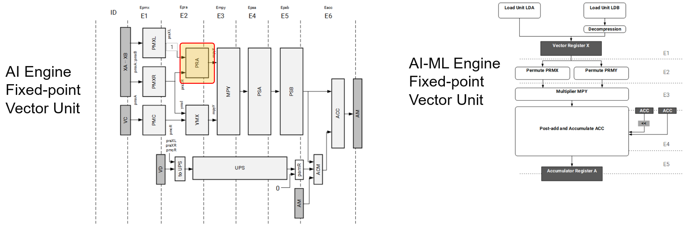
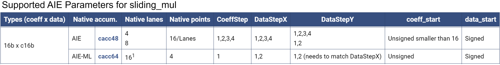
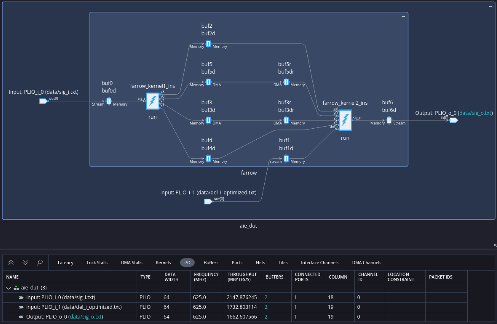
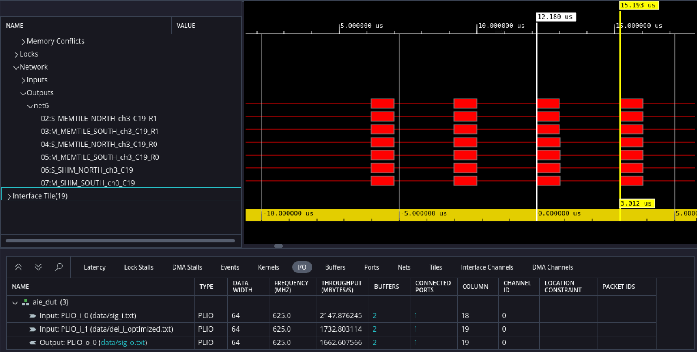
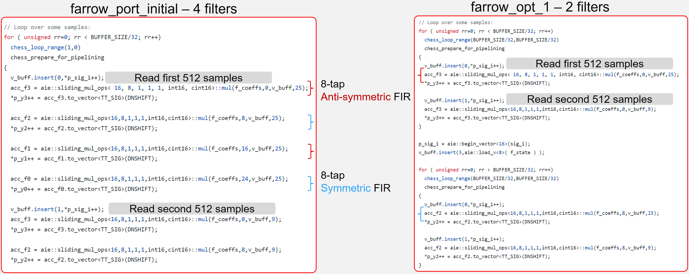
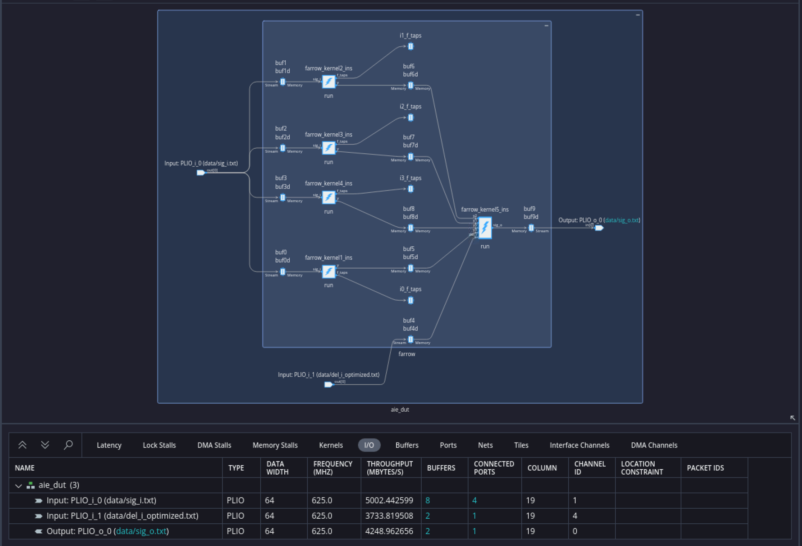
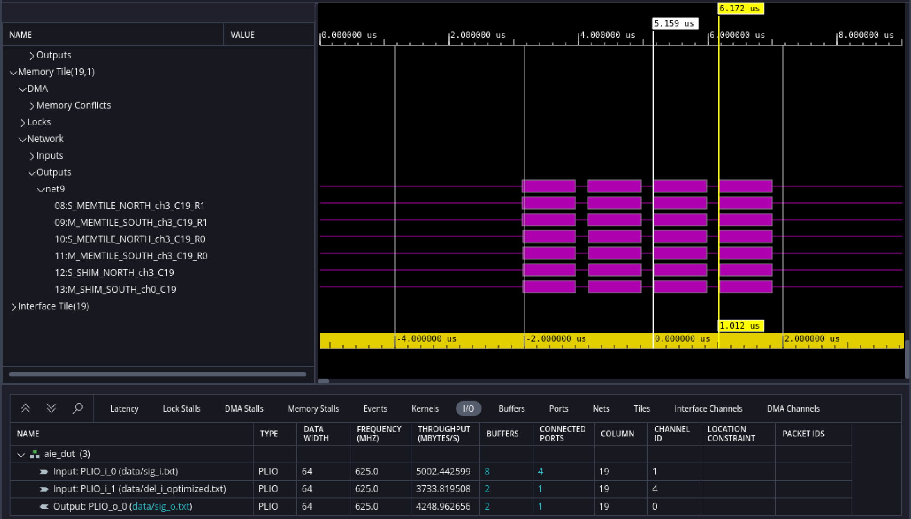
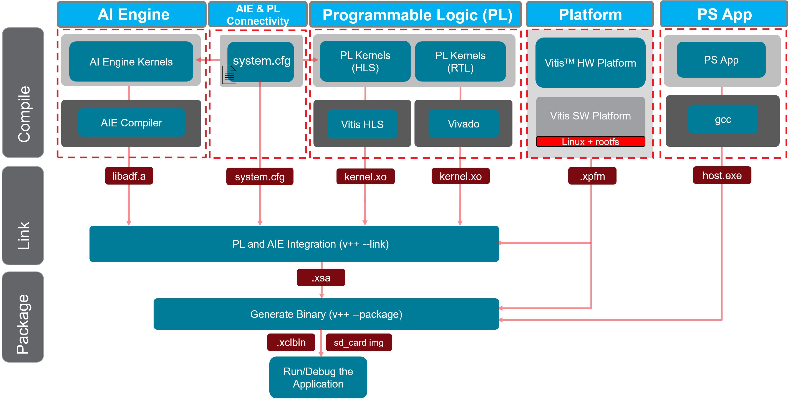

# Migrating Fractional Delay Farrow Filter from AIE to AIE-ML Architecture

***Version: Vitis 2024.1***

## Introduction

A fractional delay filter is a common digital signal processing (DSP) algorithm found in many applications including digital receivers in modems and is required for timing synchronization.

The *Fractional Delay Farrow Filter* design has already been implemented for the AIE architecture.

Before starting this tutorial on migrating the design from AIE to AIE-ML architecture, it is essential to understand the Farrow Filter and its implementation details with the AIE architecture. This understanding will lay a foundation for grasping the differences and considerations involved in the migration process.

Please study this tutorial **[Fractional Delay Forrow Filter Targeting AIE Architecture](../../../AIE/Design_Tutorials/15-farrow_filter/README.md)** to understand the following:

1. What is a Farrow Filter? 
2. Requirements and AIE System Partitioning 
3. AI Engine Implementation and Optimization

Now that you have familiarized yourself with the Farrow Filter and its implementation in the AIE architecture, you are ready to migrate the farrow filter to the AIE-ML architecture.

The design requirements are identical here as you are simply migrating the design to AIE-ML architecture:

|Requirements| |
|---|---|
| Sampling rate | 1 GSPS |
| I/O data type | `cint16` |
| Coefficients data type | `int16` |
| Delay input data type | `int16` |

**IMPORTANT**: Before beginning the tutorial, make sure that you have read and followed the *Vitis Software Platform Release Notes* (v2024.1) for setting up the software and installing the VEK280 base platform.

Before starting this tutorial, run the following steps:

1. Set up your platform by running the `xilinx-versal-common-v2024.1/environment-setup-cortexa72-cortexa53-xilinx-linux` script as provided in the platform download. This script sets up the `SYSROOT` and `CXX` variables. If the script is not present, you _must_ run `xilinx-versal-common-v2024.1/sdk.sh`.
2. Set up your ROOTFS to point to the `xilinx-versal-common-v2024.1/rootfs.ext4`.
3. Set up your IMAGE to point to `xilinx-versal-common-v2024.1/Image`.
4. Set up your `PLATFORM_REPO_PATHS` environment variable based upon where you downloaded the platform.

# Table of Contents
- [Migrating the Design from AIE to AIE-ML architecture](#migrating-the-design-from-aie-to-aie-ml-Architecture)
- [Optimizing the Design for Performance](#optimizing-the-design-for-performance)
- [Changing the Interface to GMIO](#changing-the-plio-interface-to-gmio-interface)
- [Running the Design on the Board](#building-and-running-the-design-on-the-board)

## Objectives
- Migrate the farrow filter from AIE to AIE-ML architecture
- Optimize the design to meet the required performance
- Modify the interface to GMIO
- Write a host code with XRT APIs
- Implement the design using the Vitis tool
- Run the design on the board 

## Migrating the Design from AIE to AIE-ML Architecture
### Change the Project Path
Switch the device from AIE to AIE-ML and then compile the design to ensure it compiles without errors.  \
Enter the following command to navigate to the project path of the final AIE design:
```
cd <path-to-tutorial>/designs/farrow_final_aie
```
Make sure to set the `PLATFORM_REPO_PATHS` environment variable.

### Source the Vitis Tool
Enter the following command to source the Vitis tool:
```
source /<TOOL_INSTALL_PATH>/Vitis/2024.1/settings.sh
```
### Update the Makefile to switch the device from AIE to AIE-ML.
Open the Makefile and modify the device from AIE to AIE-ML as shown below:
```
PLATFORM_USE	  := xilinx_vek280_base_202410_1
```
Save the file.
### Compile the Design for x86 Simulation
Enter the following command to compile for x86 simulation:
```
make x86compile
```
Notice the compilation error as shown below:
```
 In file included from wrap_farrow_kernel1.cpp:2:
./../../farrow_kernel1.cpp:58:19: error: constraints not satisfied for alias template 'sliding_mul_sym_xy_ops' [with Lanes = 8, Points = 8, CoeffStep = 1, DataStepXY = 1, CoeffType = short, DataType = cint16, AccumTag = cacc48]
    acc_f3 = aie::sliding_mul_sym_xy_ops<8,8,1,1,int16,cint16>::mul_antisym(f_coeffs,0,v_buff,9);
                  ^~~~~~~~~~~~~~~~~~~~~~~~~~~~~~~~~~~~~~~~~~~~
/proj/gsd/vivado/Vitis/2024.1/aietools/include/aie_api/aie.hpp:6492:14: note: because 'arch::is(arch::AIE)' evaluated to false
    requires(arch::is(arch::AIE))
`
```
#### What does the compile error indicate?
The error message indicates that the AIE API **sliding_mul_sym_xy_ops<>** only supports the AIE architecture and not AIE-ML. You can see the error as `'arch::is(arch::AIE)' evaluated to false`

#### Why is the AIE API **sliding_mul_sym_xy_ops<>** not supported for AIE-ML?
This API uses only half the tap values because it uses the pre-adder to compute the rest of the samples.  

Based on the comparison provided between the AIE and AIE-ML architectures regarding fixed-point multiplication paths, it appears that the AIE architecture utilizes a pre-adder mechanism that is absent in the AIE-ML architecture.



#### How to fix this for AIE-ML?
Additional AIE APIs that can make full use of the tap values for computation need to be identified. One such API is `aie::sliding_mul_ops<Lanes, Points, CoeffStep, DataStepXY, DataStepY, int16, cint16>;`. You should now adjust the parameter values according to the API details provided in the documentation in the this link **[AIE APIs Special Multiplication](https://www.xilinx.com/htmldocs/xilinx2024_1/aiengine_api/aie_api/doc/group__group__mul__special.html#structaie_1_1sliding__mul__ops)**.

The following figure shows the supported parameters type (coeff x data) for AIE and AIE-ML architecture. **coeff** is *int16* and **data** is *cint16*.



## Initial Porting of Farrow Filter to AIE-ML
### Modify the Kernel code using AIE API aie::sliding_mul_ops<>

The parameters for **aie:sliding_mul_ops<>** are Lanes, Points, CoeffStep, DataStepX, DataStepY, CoeffType, DataType, AccumTag.

For AIE-ML:\
`Number of lanes are 16`\
`Points can be 8`\
`Accumulator is cacc64`\
Other parameters use the same value used for AIE architecture:\
`CoeffStep is 1`\
`DataStepX is 1`\
`DataStepY is 1`\
`CoeffType is int16`\
`DataType is cint16`

So, it will be as follows **aie::sliding_mul_ops<16, 8, 1, 1, 1,int16,cint16>;**

Enter the following command to navigate to the project path of the design:
```
cd ../farrow_port_initial
```
Review the kernel code located under `<path-to-tutorial>/designs/farrow_port_initial/farrow_kernel1.cpp` file. The necessary changes are already made. Study the code and observe the following changes:
- Accumulator size has been changed to `cacc64` (acc_f3, acc_f2, acc_f1, acc_f0) as per the AIE API. 
- Load the full coefficient values (f_coeffs).
- Vector iterator size updated for 16 lanes (p_sig_i, p_y3, p_y2, p_y2, p_y0), compared to eight lanes in AIE code.
- sliding_mul API as: 
  - `aie::sliding_mul_ops< 16, 8, 1, 1, 1, int16, cint16>::mul(f_coeffs,0,v_buff,25);` 
    - Observe the four filter coefficient start location (0, 8, 16, 24) as second template parameter of aie::sliding_mul_ops<...>::mul(...). 
    - It uses the full coefficient length.

Review the kernel code header file located under `<path-to-tutorial>/designs/farrow_port_initial/farrow_kernel1.h` file. 
- `f_taps` has full coefficient values
- `TT_ACC` has been udpated for `cacc64`

No changes to the `farrow_kernel2.cpp` file. 

After finishing the review of the kernel code, proceed to compile and then simulate the design.

### Compile and Simulate the Design
Enter the following command to compile (x86compile) and simulate (x86sim) to verify the functional correctness of the design:
```
$ make x86compile
$ make x86sim
```
The first command compiles the graph code for simulation on an x86 processor, the second command runs the simulation. 

To verify the results, make sure you have already invoked MATLAB in your command line and run the following command:
```
$ make check_sim_output_x86
```
This command invokes MATLAB to compare the simulator output against golden test vectors. 
The console should output `Max error LSB = 1`.

To understand the performance of your initial implementation, you can perform AI Engine emulation using the SystemC simulator by entering the following sequence of commands:
```
$ make compile
$ make sim
$ make check_sim_output_aie
```
The first command compiles graph code for the SystemC simulator, the second command runs the AIE simulation, and the final command invokes MATLAB to compare the simulation output with test vectors and compute raw throughput. The average throughput for the IO ports is displayed at the end of AIE simulation.
After the final command execution, the console should output as below:
```
Raw Throughput = 415.7 MSPS
Max error LSB = 1
```
### Analyze the Reports

Enter the following command to launch the Vitis Analyzer and review the reports.
```
$ vitis_analyzer aiesimulator_output/default.aierun_summary
```
Select the `Graph` view.


The Graph view shows the kernels in the graph and the input/output ports of the graph. Select the I/O tabs as shown in the above diagram. Observe the Throughput column in the I/O tab.

The output PLIO port throughput shows the value 1662.607566 MBYTES PER SEC (MBPS). To get the throughput in Sample per second, this throughput needs to be divided by four because the data type used is `cint16`, which is four bytes in size. This gives a throughput value of 415.65 MSPS.

A more accurate throughput measurement can be made by measuring the steady state achieved in the final graph iteration. In vitis_analyzer, select the trace view and set markers to measure the throughput of this final iteration as shown below. Because each graph iteration processes 1024 samples, throughput = 1024/3.012 = 339.9 MSPS.

Note: In the graph, select the output port which will show the net name, in this case it is net6.



The design requirement is to reach 1 GSPS, but the current performance is only **339.9 MSPS**.

#### How to find the bottleneck in the design? 
Begin by examining the compiler report for each kernel to assess its performance.

In the context of AI Engine processors, Initiation Interval (II) is defined as how often (in cycles) a new iteration of the loop can start.

For example, if a new iteration of the loop can start every II=16 cycles, and each loop iteration produces 16 samples, that means the processor is producing the equivalent of one sample per clock (excluding processor overhead).

Assuming your AI Engine clock is 1.25 GHz, that means your throughput can potentially reach 1.25 GSPS excluding any processor overhead. Output throughput is defined as the number of samples produced from your kernel per second.

#### How to determine the II required for farrow_kernel1?
Navigate to the compiler reports for each tile located at `designs/farrow_port_initial/Work/aie`.

The *farrow_kernel1* is specifically implemented on tile `18_2`. Locate the `18_2.log` file within the `18_2` folder. Search for "minimum length due to resources" in this file. The AIE Compiler optimizes in three stages; use the results from the final stage output. Each loop iteration takes *II=115 cycles*.

In `designs/farrow_port_initial/farrow_kernel1.cpp`, examine line 55 where the loop is implemented. This loop processes 32 samples per iteration, equivalent to BUFFER_SIZE/32 = 1024 samples/32 => 32 samples. Therefore, the goal is to achieve an II of 32.

## Optimizing the Design For Performance 

### First Optimization 

After reviewing the previous analysis, it is evident that the kernel requires II=115 cycles to execute each loop iteration. Now, explore strategies to optimize the `farrow_kernel1.cpp` kernel to achieve an II of 32.

In the `designs/farrow_port_initial/farrow_kernel1.cpp` file, within the for loop located at line number 55, the kernel currently performs four filter operations. To optimize, we propose splitting these operations; execute two filter operations in one tile and the remaining two in another tile.

Compare the code below. The initial version using four filter operations versus the suggested version with two filter operations use two tiles to perform four filter computations. In the `farrow_opt_1` design, **farrow_kernel1** will be instantiated twice to perform four filter operations. 




#### Enhancing Performance Through Computation Split Across Multiple Tiles
By dividing the computations across multiple tiles, each kernel is tasked with fewer operations. Instead of handling four filters, each kernel now manages only two filter operations. This adjustment has the potential to enhance the II, thereby improving overall performance.

Enter the following command to change project path:
```
cd ../farrow_opt_1
```
Review the kernel code `farrow_kernel1.cpp` and `farrow_kernel1.h` located under the `farrow_opt_1` directory.
- `farrow_kernel1.cpp`
  - Only two filters operations are done
  - It has only two outputs as it performs only two filter operations
- `farrow_kernel1.h`
  - Constructor used to load the coefficient values 
  - Register the `f_taps` as `REGISTER_PARAMETER( f_taps );` in the `registerKernelClass()` function

Review the graph code `farrow_graph.h` located under the `farrow_opt_1` directory.
- Coefficient values are declared (taps1_2 and taps3_4)
- Kernel `farrow_kernel1` is instantiated twice (`farrow_kernel1_ins` and `farrow_kernel2_ins`) to perform four filters in two tiles
- Observe the connections made between the kernels

### Compile and Simulate the Design
Enter the following command to compile (x86compile) and simulate (x86sim) to verify the functional correctness of the design:
```
$ make x86compile
$ make x86sim
$ make check_sim_output_x86
```
The console should output `Max error LSB = 1`.

To understand the performance of your initial implementation, you can perform AI Engine emulation using the SystemC simulator by entering the following sequence of commands:
```
$ make compile
$ make sim
$ make check_sim_output_aie
```
The console should output as below:
```
Raw Throughput = 755.2 MSPS
Max error LSB = 1
```

This design was able to reach 755.2 MSPS. But still it does not meet goal of 1 GSPS.
Note: In trace view, the measured throughput is 1024/1.535 = 667.1 MSPS.

Run the script which will read the II from the compiler log for each tile.
```
$ make get_II
```
The console should output as below:
```
*** [LOOP_II] *** Tile 19_0 minII = 29 achieves II = 29
*** [LOOP_II] *** Tile 19_0 minII = 29 achieves II = 29
*** [LOOP_II] *** Tile 19_1 minII = 6 achieves II = 6
*** [LOOP_II] *** Tile 19_1 minII = 6 achieves II = 6
*** [LOOP_II] *** Tile 19_1 minII = 6 achieves II = 6
*** [LOOP_II] *** Tile 19_3 minII = 29 achieves II = 29
*** [LOOP_II] *** Tile 19_3 minII = 29 achieves II = 29
```
The implementation of `farrow_kernel1.cpp` spans across tiles 19_0 and 19_3 to perform four filter computations. According to the kernel `farrow_kernel1.cpp`, it contains two `for loops`, each with an II of 29. Consequently, it necessitates 58 cycles for each loop iteration. But the goal is to achieve an II of 32 to achieve 1 GSPS.

### Second Optimization 
The previous setup employs three tiles: two tiles for filters and another for final computations.

As you noticed, the performance has been improved from 339.9 MSPS to 667.1 MSPS. The II has been reduced from 115 to 58 cycles. But the required goal of 1 GSPS has not yet been achieved.

Instead of managing two filters per tile, each kernel will now handle just one filter operation. You will use four tiles to carry out each filter operation. This adjustment could improve the II and enhance overall performance.

Enter the following command to change the project path:
```
cd ../farrow_opt_2
```
Review the kernel code `farrow_kernel1.cpp` and `farrow_kernel1.h` located under the `farrow_opt_2` directory.
- farrow_kernel1.cpp
  - Only one filter operation is performed
  - It has only one output as it performs only one filter operation

Review the graph code `farrow_graph.h` located under the `farrow_opt_2` directory.
- Coefficient values are declared (taps1, taps2, taps3, and taps4)
- Kernel `farrow_kernel1` is instantiated four times (`farrow_kernel1_ins`, `farrow_kernel2_ins`, `farrow_kernel3_ins` and `farrow_kernel4_ins`) to perform four filters in four tiles
- Observe the connections made between the kernels

### Compile and Simulate the Design
Enter the following command to compile (x86compile) and simulate (x86sim) to verify the functional correctness of the design:
```
$ make x86compile
$ make x86sim
$ make check_sim_output_x86
```
The console should output `Max error LSB = 1`.

To understand the performance of your initial implementation, you can perform AI Engine emulation using the SystemC simulator by entering the following sequence of commands:
```
$ make compile
$ make sim
$ make check_sim_output_aie
```
The console should output as below:
```
Raw Throughput = 1062.2 MSPS
Max error LSB = 1
```
### Analyze the Reports
Enter the following command to launch the Vitis Analyzer and review the reports.

```
$ vitis_analyzer aiesimulator_output/default.aierun_summary
```

Graph view shows the five kernels (four for filters and one for final computation). Select the I/O tabs as shown in the above diagram. Observe the Throughput column in the I/O tab.

The output PLIO port throughput shows the value 4248.962656. This throughput value needs to be divided by four because the data type used is `cint16`, which is four bytes in size. You will get the throughput value as 1062.2 MSPS.

A more accurate throughput measurement can be made by measuring the steady state achieved in the final graph iteration. In vitis_analyzer, select the trace view and set markers to measure the throughput of this final iteration as shown below. 

Because each graph iteration processes 1024 samples, throughput is 1024/1.012 = **1011.8 MSPS**.

Note: In the graph, select the output port which will show the net name, in this case it is net9.


The design was able to meet the desired 1 GSPS.

After reviewing the report, close the Vitis Analyzer.

Run the script which will read the II from the compiler log for each tiles.
```
$ make get_II
```
The console should output as below:

```
*** [LOOP_II] *** Tile 18_1 minII = 29 achieves II = 29
*** [LOOP_II] *** Tile 19_0 minII = 29 achieves II = 29
*** [LOOP_II] *** Tile 19_1 minII = 29 achieves II = 29
*** [LOOP_II] *** Tile 19_2 minII = 6 achieves II = 6
*** [LOOP_II] *** Tile 19_2 minII = 6 achieves II = 6
*** [LOOP_II] *** Tile 19_2 minII = 6 achieves II = 6
*** [LOOP_II] *** Tile 19_4 minII = 29 achieves II = 29
```

The implementation of `farrow_kernel1.cpp` spans across tiles 18_1, 19_0, 19_1, and 19_4. Based on the results above, these tiles successfully achieved an II of 29 for each of their respective for loops, meeting the desired performance targets.

## Comparison of the Optimizations

| Design              | Number of Tiles | Throughput  |
|---------------------|-----------------|-------------|
| farrow_port_initial |       2         | 339.9 MSPS  |
| farrow_opt_1        |       3         | 667.1 MSPS  |
| farrow_opt_2        |       5         | 1011.8 MSPS |

Note: Throughput values are measured from Trace.

## Changing the PLIO Interface to GMIO Interface
A `input_gmio` or `output_gmio` object is used to make external memory-mapped connections to or from the global memory. These connections are made between an AI Engine graph and the logical global memory ports of a hardware platform design. 

Now, we will change the PLIO interface to GMIO interface and do the necessary changes to the graph and test bench (`farrow_graph.h` and `farrow_app_adf.cpp`).

Enter the following command to change project path:
```
cd ../farrow_gmio/aie_ml
```
Review the `farrow_graph.h` file. Observe the `class dut_graph` where the input and output ports are declared as GMIO. 

```sig_i =  input_gmio::create("sig_i", 256, 1000);```

The above port specification is used to connect DDR memory to AI Engine kernels. logical_name (sig_i) is the name of the port. The burst_length is the length of DDR memory burst transaction (can be 64, 128, or 256 bytes), and the bandwidth is the average expected throughput in MB/s.

Review the test bench `farrow_app_adf.cpp` which has been udpated for GMIO interface.

In Linux, the virtual address passed to GMIO::gm2aie_nb, GMIO::aie2gm_nb, GMIO::gm2aie and GMIO::aie2gm must be allocated by GMIO::malloc. After the input data is allocated, it can be initialized.

1. Memory allocated by `GMIO::malloc` for input and ouput data as shown below.

```
  short int* sig_i_Array=(short int*)GMIO::malloc(BLOCK_SIZE_sig_in_Bytes);
  int32* del_i_Array=(int32*)GMIO::malloc(BLOCK_SIZE_del_in_Bytes);
  short int* sig_o_Array=(short int*)GMIO::malloc(BLOCK_SIZE_out_Bytes);
```  

2. Copy the test vectors to the allocated memory.
```
  /* Copy the samples to the buffer */
  memcpy(sig_i_Array, input_sig_i, BLOCK_SIZE_sig_in_Bytes);
  
  /* Copy the delay values to the buffer */
  memcpy(del_i_Array, input_del_i,BLOCK_SIZE_del_in_Bytes);
```
3. Initiate the memory-mapped AXI4 transactions for the AI Engine_ML to read from DDR memory spaces. 
```
  aie_dut.sig_i.gm2aie_nb(sig_i_Array, BLOCK_SIZE_sig_in_Bytes);
  aie_dut.del_i.gm2aie_nb(del_i_Array, BLOCK_SIZE_del_in_Bytes);
```
  - The first argument `sig_i_Array` is the pointer to the start address of the memory space for the transaction
  - The second argument is the transaction size in bytes.

4. Similarly, `aie2gm()` is used to initiate memory-mapped AXI4 transactions for the AI Engine-ML to write to DDR memory spaces.
```
aie_dut.sig_o.aie2gm(sig_o_Array, BLOCK_SIZE_out_Bytes);
```
`aie_dut.sig_o.aie2gm_nb()` is a non-blocking function in a sense that it returns immediately when the transaction is issued, that is, it does not wait for the transaction to complete. 

5. The results are compared with the golden values and printed out.

6. When PS has completed processing, the memory space allocated by GMIO::malloc can be released by GMIO::free.
```
  GMIO::free(sig_i_Array);
  GMIO::free(del_i_Array);
  GMIO::free(sig_o_Array);
```

### Compile and Simulate the Design

Enter the following command to compile (x86compile) and simulate (x86sim) to verify the functional correctness of the design:
```
$ make x86compile
$ make x86sim
$ make check_sim_output
```
The console should output as below:
```
Max error LSB = 1
```
In the PLIO design, the simulator outputs data to a file, while in GMIO, the data is written to memory. For GMIO, first read the output from global memory and then write it to a file.
You can perform AI Engine emulation using the SystemC simulator by entering the following sequence of commands:
```
$ make compile
$ make sim
$ make check_sim_output
```
The console should output as below:
```
Max error LSB = 1
```

## Building and Running the Design on the Board

### Review of Tool Flow 
The diagram below illustrates the entire Vitis tool flow, encompassing the development stages for AI kernels, PL kernels, and PS code. Once the development of AIE kernels and PL kernels is completed, the subsequent step involves linking `libadf.a` and all `.xo` kernels with the designated platform. Following the linking stage, the output of the linker, which includes `.xsa` and `host.exe`, is packaged together to generate `.xclbin` and the `SD card image` required for programming the SD card.
  


### Setup and Initialization
IMPORTANT: Before beginning the tutorial ensure you have installed AMD Vitis™ 2024.1 software. Ensure you have downloaded the Common Images for Embedded Vitis Platforms from this link.

https://www.xilinx.com/support/download/index.html/content/xilinx/en/downloadNav/embedded-platforms/2024-1.html

Set the environment variable ```COMMON_IMAGE_VERSAL``` to the full path where you have downloaded the Common Images. The remaining environment variables are configured in the top level Makefile ```<path-to-tutorial>/designs/farrow_gmio/Makefile```. 

#### Host Code with XRT APIs
It is recommended to use the XRT APIs for the host code. The host code has been modified with XRT API. Review the code and then build the project and run it on board.

Enter the following command to change project path:
```
$ cd ../ps_apps/hw_emu
```
Review the `host.cpp` file.

The XRT APIs are used and XRT profiling is also used to measure the throughput of the design.

##### Hardware Emulation
Enter the following command to build the design for hardware emulation:
```
$ cd <path-to-tutorial>/designs/farrow_gmio/
$ make clean all TARGET=hw_emu
```

This will take about 15 minutes to run. The build process will generate a folder `designs/farrow-gmio/package` containing all the files required for hardware emulation.

Enter the following command to run hardware emulation:
```
$ cd <path-to-tutorial>/designs/farrow_gmio/package
$ ./launch_hw_emu.sh -run-app embedded_exec.sh
```

```
...
PASSED:  auto xclbin_uuid = my_device.load_xclbin(a.xclbin)
PASSED:  auto my_graph  = xrt::graph(my_device, xclbin_uuid, "aie_dut")
PASSED:  my_graph.reset()
GMIO::malloc completed
PASSED:  xrt::aie::profiling handle(my_device);

INFO:    Started profiling timers...

PASSED:  my_graph.run( ITERATION=4 )
Throughput of the graph: 4247.2 MB/s
Throughput of the graph: 1061.8 MSPS
...
```
To exit the QEMU, press Ctrl A + X.
After the hardware emulation run is complete, you can analyze the reports in Vitis Analyzer. 

##### Hardware Run

Enter the following command to build the design for hardware emulation:
```
$ cd <path-to-tutorial>/designs/farrow_gmio/
$ make clean all TARGET=hw
```

The build process will generate the SD card image in the `<path-to-tutorial>/designs/farrow_gmio/package/sd_card` folder.
You can flash the `sd_card.img` using baleno etcher app. Then insert the SD Card into VEK280 board and power ON the board.


```
...
PASSED:  auto xclbin_uuid = my_device.load_xclbin(a.xclbin)
PASSED:  auto my_graph  = xrt::graph(my_device, xclbin_uuid, "aie_dut")
PASSED:  my_graph.reset()
GMIO::malloc completed
PASSED:  xrt::aie::profiling handle(my_device);
 
INFO:    Started profiling timers...
 
PASSED:  my_graph.run( ITERATION=4 )
Throughput of the graph: 4499.12 MB/s
Throughput of the graph: 1124.78 MSPS
GMIO transactions finished

```

# Comparison of AIE vs AIE-ML Farrow Filter Design Implementation
The following table compares the implementation of a farrow filter in AIE and AIE-ML architectures.
This indicates that approximately twice the number of tiles is required for kernel computation in AIE_ML compared to the AIE architecture to achieve the same performance.
| Design                 | Tiles for AIE Kernels | Tiles for Buffers | Total Tiles |  Throughput         | Relative MSPS per tile |
|------------------------|-----------------------|-------------------|-------------|---------------------|------------------------|
| farrow - AIE (PLIO)    |       2               | 5                 | 5           | 1138 MSPS (HW_EMU)  | 227.6                  |
| farrow - AIE-ML (GMIO) |       5               | 9                 | 9           | 1061 MSPS (HW_EMU)  | 124.8                  |

```* Total Tiles: Represents the total count of tiles, including those that have both kernels and buffers within the same tile.```

# Conclusion

This tutorial has demonstrated the following:
- How to migrate the design from AI Engine to AIE-ML architecture.
- How to optimize the design to meet the required sampling rate.
- Using the GMIO interface and host code with XRT APIs.
- Running the design on the board.

