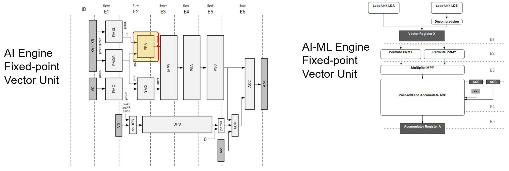
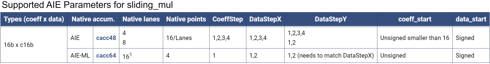
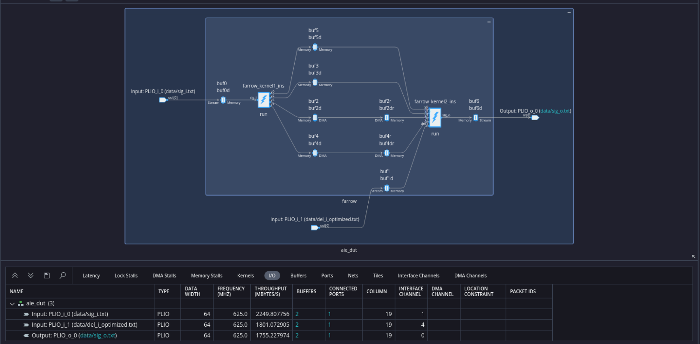
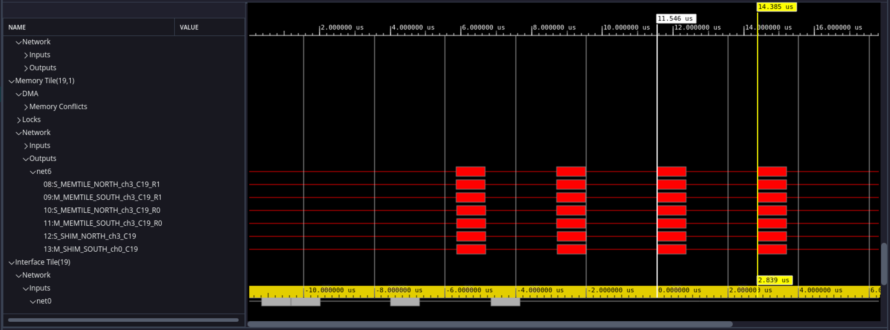
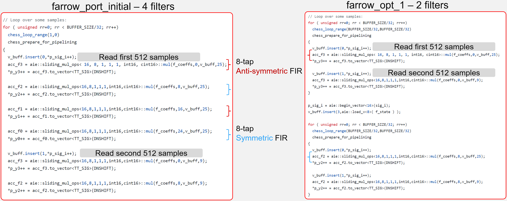
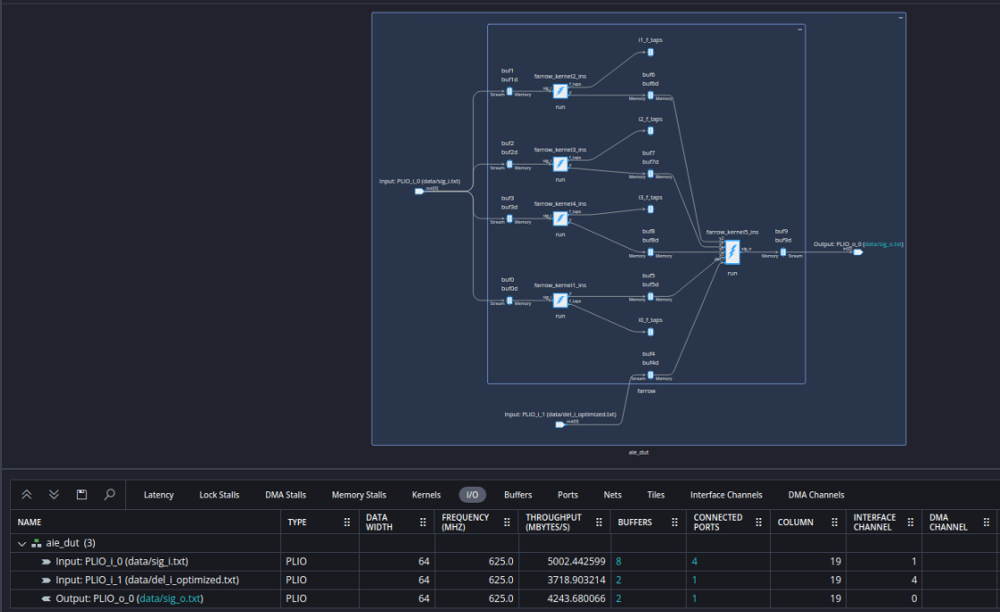
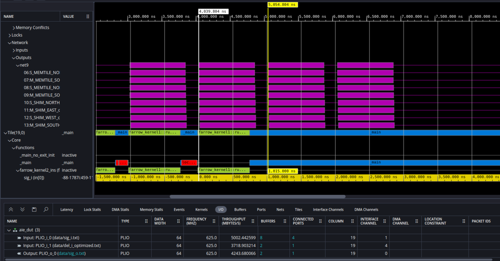
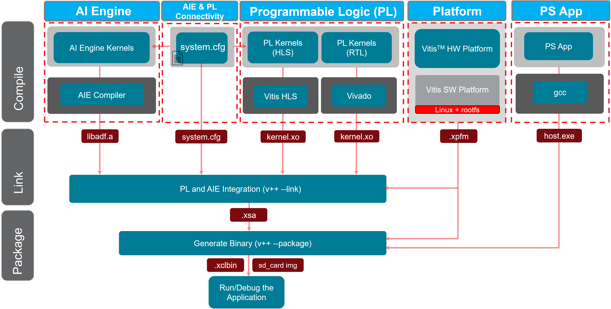

<table class="sphinxhide" style="width:100%;">
  <tr>
    <td align="center">
      <picture>
        <source media="(prefers-color-scheme: dark)" srcset="https://raw.githubusercontent.com/Xilinx/Image-Collateral/main/logo-white-text.png">
        
      </picture>
      <h1>AMD Vitis™ AI Engine Tutorials</h1>
      <a href="https://www.amd.com/en/products/software/adaptive-socs-and-fpgas/vitis.html">See Vitis™ Development Environment on amd.com</a>
        </br>
      <a href="https://www.amd.com/en/products/software/vitis-ai.html">See Vitis™ AI Development Environment on amd.com</a>
    </td>
  </tr>
</table>

# Migrating Fractional Delay Farrow Filter from AIE to AIE-ML Architecture

***Version: Vitis 2025.2***

## Introduction

Use the fractional delay filter, a common digital signal processing (DSP) algorithm, in applications including digital receivers in modems. It is essential for timing synchronization.

The *Fractional Delay Farrow Filter* design is already implemented for the AIE architecture.

Before starting this tutorial on migrating the design from AIE to AIE-ML architecture, make sure you understand the Farrow Filter. Familiarize yourself with its implementation details within the AIE architecture. This understanding provides a foundation for grasping the differences and considerations involved in the migration process.

Study this tutorial **[Fractional Delay Forrow Filter Targeting AIE Architecture](../../../AIE/Design_Tutorials/15-farrow_filter/README.md)** to understand the following:

1. What is a Farrow Filter?
2. Requirements and AIE System Partitioning
3. AI Engine Implementation and Optimization

Now that you are familiar with the Farrow Filter and its implementation in the AIE architecture. You are ready to migrate the farrow filter to the AIE-ML architecture.

The design requirements are identical here as you are simply migrating the design to AIE-ML architecture:

| Requirements|
|---|---|
| Sampling rate | 1 GSPS |
| I/O data type | `cint16` |
| Coefficients data type | `int16` |
| Delay input data type | `int16` |

**IMPORTANT**: Before beginning the tutorial, read and follow *Vitis Software Platform Release Notes* (v2025.2) to set up the software and install the VEK280 base platform.

Before starting this tutorial, run the following steps:

1. Set up your platform by running the `xilinx-versal-common-v2025.2/environment-setup-cortexa72-cortexa53-amd-linux` script as provided in the platform download. This script sets up the `SYSROOT` and `CXX` variables. If the script is not present, you *must* run `xilinx-versal-common-v2025.2/sdk.sh`.
2. Set up your ROOTFS to point to the `xilinx-versal-common-v2025.2/rootfs.ext4`.
3. Set up your IMAGE to point to `xilinx-versal-common-v2025.2/Image`.
4. Set up your `PLATFORM_REPO_PATHS` environment variable based upon where you downloaded the platform.

## Table of Contents

- [Migrating the Design from AIE to AIE-ML architecture](#migrating-the-design-from-aie-to-aie-ml-Architecture)
- [Optimizing the Design for Performance](#optimizing-the-design-for-performance)
- [Changing the Interface to GMIO](#changing-the-plio-interface-to-gmio-interface)
- [Running the Design on the Board](#building-and-running-the-design-on-the-board)

### Objectives

- Migrate the farrow filter from AIE to AIE-ML architecture
- Optimize the design to meet the required performance
- Modify the interface to GMIO
- Write a host code with XRT APIs
- Implement the design using the AMD Vitis™ tool
- Run the design on the board

### Migrating the Design from AIE to AIE-ML Architecture

#### Change the Project Path

Switch the device from AIE to AIE-ML, and then compile the design to make sure it compiles without errors.  \
Enter the following command to navigate to the project path of the final AIE design:

```
cd <path-to-tutorial>/designs/farrow_final_aie
```

Make sure to set the `PLATFORM_REPO_PATHS` environment variable.

#### Source the Vitis Tool

Enter the following command to source the Vitis tool:

```
source /<TOOL_INSTALL_PATH>/Vitis/2025.2/settings.sh
```

#### Update the Makefile to switch the device from AIE to AIE-ML

Open the Makefile and modify the device from AIE to AIE-ML as shown in the follwing:

```
PART := xcve2802-vsvh1760-2MP-e-S
```

Save the file.

#### Compile the Design for x86 Simulation

Enter the following command to compile for x86 simulation:

```
make x86compile

```

Notice the compilation error shown in the following example:

```

In file included from wrap_farrow_kernel1.cpp:2:
./../../farrow_kernel1.cpp:58:19: error: constraints not satisfied for alias template 'sliding_mul_sym_xy_ops' [with Lanes = 8, Points = 8, CoeffStep = 1, DataStepXY = 1, CoeffType = short, DataType = cint16, AccumTag = cacc48]
   58 |     acc_f3 = aie::sliding_mul_sym_xy_ops<8,8,1,1,int16,cint16>::mul_antisym(f_coeffs,0,v_buff,9);
      |                   ^~~~~~~~~~~~~~~~~~~~~~~~~~~~~~~~~~~~~~~~~~~~
/<TOOL_PATH>/Vitis/aietools/include/aie_api/sliding_mul.hpp:1154:14: note: because 'arch::is(arch::AIE)' evaluated to false
 1154 |     requires(arch::is(arch::AIE))
      |              ^


```

##### What does the compile error indicate?

The error message indicates that the AIE API **sliding_mul_sym_xy_ops<>** only supports the AIE architecture and not AIE-ML. The error `'arch::is(arch::AIE)' evaluated to false` displays.

##### Why is the AIE API **sliding_mul_sym_xy_ops<>** not supported for AIE-ML?

This API uses only half the tap values because it uses the pre-adder to compute the rest of the samples.  

The comparison between the AIE and AIE-ML architectures highlights differences in their fixed-point multiplication paths. The AIE architecture uses a pre-adder mechanism. This mechanism is absent in the AIE-ML architecture.



##### How to fix this for AIE-ML?

Identify the additional AIE APIs that can make full use of the tap values for computation. One such API is `aie::sliding_mul_ops<Lanes, Points, CoeffStep, DataStepXY, DataStepY, int16, cint16>;`. Now, adjust the parameter values according to the API details provided in the documentation in this link **[AIE APIs Special Multiplication](https://download.amd.com/docnav/aiengine/xilinx2025_2/aiengine_api/aie_api/doc/group__group__mul__special.html#structaie_1_1sliding__mul__ops)**.

The following figure shows the supported parameters type (coeff x data) for AIE and AIE-ML architecture. **coeff** is *int16* and **data** is *cint16*.



### Initial Porting of Farrow Filter to AIE-ML

#### Modify the Kernel code using AIE API aie::sliding_mul_ops<>

The parameters for **aie:sliding_mul_ops<>** are Lanes, Points, CoeffStep, DataStepX, DataStepY, CoeffType, DataType, AccumTag.

For AIE-ML:\
`Number of lanes are 16`\
`Points can be 8`\
`Accumulator is cacc64`\
Other parameters use the same value used for AIE architecture:\
`CoeffStep is 1`\
`DataStepX is 1`\
`DataStepY is 1`\
`CoeffType is int16`\
`DataType is cint16`

So, it is as follows **aie::sliding_mul_ops<16, 8, 1, 1, 1,int16,cint16>;**

Enter the following command to navigate to the project path of the design:

```
cd ../farrow_port_initial
```

Review the kernel code located under `<path-to-tutorial>/designs/farrow_port_initial/farrow_kernel1.cpp` file. The necessary changes are already made. Study the code and observe the following changes:

- Accumulator size changes to `cacc64` (acc_f3, acc_f2, acc_f1, acc_f0) per the AIE API.
- Load the full coefficient values (f_coeffs).
- Vector iterator size updated for 16 lanes (p_sig_i, p_y3, p_y2, p_y2, p_y0), compared to eight lanes in AIE code.
- sliding_mul API as:
  - `aie::sliding_mul_ops< 16, 8, 1, 1, 1, int16, cint16>::mul(f_coeffs,0,v_buff,25);`
    - Observe the four filter coefficient start location (0, 8, 16, 24) as second template parameter of aie::sliding_mul_ops<...>::mul(...).
    - It uses the full coefficient length.

Review the kernel code header file located under `<path-to-tutorial>/designs/farrow_port_initial/farrow_kernel1.h` file.
- `f_taps` has full coefficient values
- `TT_ACC` updates for `cacc64`

No changes to the `farrow_kernel2.cpp` file.

After finishing the review of the kernel code, proceed to compile and then simulate the design.

#### Compile and Simulate the Design

Enter the following command to compile (x86compile) and simulate (x86sim) to verify the functional correctness of the design:

```
$ make x86compile
$ make x86sim
```

The first command compiles the graph code for simulation on an x86 processor, the second command runs the simulation.

To verify the results, make sure you have already invoked MATLAB in your command line and run the following command:

```
$ make check_sim_output_x86
```

This command invokes MATLAB to compare the simulator output with golden test vectors.
The console should output `Max error LSB = 1`.

To understand the performance of your initial implementation, you can perform AI Engine emulation using the SystemC simulator by entering the following sequence of commands:

```
$ make compile
$ make sim
$ make check_sim_output_aie
```

The first command compiles the graph code for the SystemC simulator. The second command runs the AIE simulation. The final command invokes MATLAB to compare the simulation output with test vectors and compute the raw throughput. The AIE simulation displays the average throughput for the IO ports at the end.

After the final command execution, the console must output as the following:

```
Raw Throughput = 449.0 MSPS
Max error LSB = 1
```

#### Analyze the Reports

Enter the following command to launch the Vitis Analyzer and review the reports.

```
$ vitis_analyzer aiesimulator_output/default.aierun_summary
```

Select the `Graph` view.


The Graph view shows the kernels in the graph and the input/output ports of the graph. Select the I/O tabs as shown in the preceeding diagram. Observe the Throughput column in the I/O tab.

The output PLIO port throughput shows the value 1795.8611 MBYTES PER SEC (MBPS). To obtain the throughput in samples per second, divide the throughput by four. The data type used, `cint16`, is four bytes in size. This calculation results in a throughput value of 449.0 mega samples per second (MSPS).

A more accurate throughput measurement can be made by measuring the steady state achieved in the final graph iteration. In vitis_analyzer, select the trace view and set markers to measure the throughput of this final iteration as shown below. Because each graph iteration processes 1024 samples, throughput = 1024/2.77 = 369.68 MSPS.

Note: In the graph, select the output port which shows the net name, in this case it is net6. Then select the `Trace` view, which shows the selected net.



The design requirement is to reach 1 GSPS, but the current performance is only **369.68 MSPS**.

Close the Vitis Analyzer.

##### How to find the bottleneck in the design?

Begin by examining the compiler report for each kernel to assess its performance.

In the context of AI Engine processors, Initiation Interval (II) defines how often (in cycles) a new iteration of the loop can start.

For example, if a new iteration of the loop can start every II=16 cycles, and each loop iteration produces 16 samples, that means the processor is producing the equivalent of one sample per clock (excluding processor overhead).

Assuming your AI Engine clock is 1.25 GHz, that means your throughput can reach 1.25 GSPS excluding any processor overhead. Output throughput defines the number of samples produced from your kernel per second.

##### How to determine the II required for farrow_kernel1?

Navigate to the compiler reports for each tile located at `designs/farrow_port_initial/Work/aie`.

The *farrow_kernel1* is specifically implemented on tile `19_0`. Locate the `19_0.log` file within the `19_0` folder. Search for "minimum length due to resources" in this file. The AIE Compiler optimizes in three stages; use the results from the final stage output. Each loop iteration takes *II=112 cycles*.

In `designs/farrow_port_initial/farrow_kernel1.cpp`, examine line 55 where the loop is implemented. This loop processes 32 samples per iteration, equivalent to BUFFER_SIZE/32 = 1024 samples/32 => 32 samples. Therefore, the goal is to achieve an II of 32.

### Optimizing the Design For Performance

#### First Optimization

After reviewing the previous analysis, it is evident that the kernel requires II=112 cycles to execute each loop iteration. Now, explore strategies to optimize the `farrow_kernel1.cpp` kernel to achieve an II of 32.

In the `designs/farrow_port_initial/farrow_kernel1.cpp` file, within the for loop located at line number 55, the kernel currently performs four filter operations. To optimize, we suggest executing two filter operations in one tile and the other two in a different tile.

Compare the following code. The initial version using four filter operations versus the suggested version with two filter operations use two tiles to perform four filter computations. In the `farrow_opt_1` design, **farrow_kernel1** instantiates twice to perform four filter operations.



##### Enhancing Performance Through Computation Split Across Multiple Tiles

We divide the computations across multiple tiles to assign fewer operations to each kernel. Instead of handling four filters, each kernel now manages only two filter operations. This adjustment has the potential to enhance the II, thereby improving overall performance.

Enter the following command to change project path:

```
cd ../farrow_opt_1
```

Review the kernel code `farrow_kernel1.cpp` and `farrow_kernel1.h` located under the `farrow_opt_1` directory.
- `farrow_kernel1.cpp`
  - Only two filters operations execute
  - It has only two outputs as it performs only two filter operations
- `farrow_kernel1.h`
  - Constructor used to load the coefficient values
  - Register the `f_taps` as `REGISTER_PARAMETER( f_taps );` in the `registerKernelClass()` function

Review the graph code `farrow_graph.h` located under the `farrow_opt_1` directory.
- Coefficient values are declared (taps1_2 and taps3_4)
- Kernel `farrow_kernel1` instantiates twice (`farrow_kernel1_ins` and `farrow_kernel2_ins`) to perform four filters in two tiles
- Observe the connections made between the kernels

#### Compile and Simulate the Design

Enter the following command to compile (x86compile) and simulate (x86sim) to verify the functional correctness of the design:

```
$ make x86compile
$ make x86sim
$ make check_sim_output_x86
```

The console should output `Max error LSB = 1`.

To understand the performance of your initial implementation, you can perform AI Engine emulation using the SystemC simulator by entering the following sequence of commands:

```
$ make compile
$ make sim
$ make check_sim_output_aie
```

The console must output as the following:

```
Raw Throughput = 754.9 MSPS
Max error LSB = 1
```

This design was able to reach 754.9 MSPS. But still it does not meet goal of 1 GSPS.
Note: In trace view, the measured throughput is 1024/1.535 = 664.7 MSPS.

Run the script which reads the II from the compiler log for each tile.

```
$ make get_II
```

The console display the following output:

```
*** [LOOP_II] *** Tile 19_0 minII = 29 achieves II = 29
*** [LOOP_II] *** Tile 19_0 minII = 29 achieves II = 29
*** [LOOP_II] *** Tile 19_2 minII = 6 achieves II = 6
*** [LOOP_II] *** Tile 19_2 minII = 6 achieves II = 6
*** [LOOP_II] *** Tile 19_2 minII = 6 achieves II = 6
*** [LOOP_II] *** Tile 19_4 minII = 29 achieves II = 29
*** [LOOP_II] *** Tile 19_4 minII = 29 achieves II = 29
```

The implementation of `farrow_kernel1.cpp` spans across tiles 19_0 and 19_4 to perform four filter computations. According to the kernel `farrow_kernel1.cpp`, it contains two `for loops`, each with an II of 29. Consequently, it necessitates 58 cycles for each loop iteration but the goal is to achieve an II of 32 to achieve 1 GSPS.

Close the Vitis Analyzer.

#### Second Optimization

The previous setup employs three tiles: two tiles for filters and another for final computations.

As you noticed, the performance improves from 369.68 MSPS to 664.9 MSPS. The II reduces from 112 to 58 cycles, but the required goal of 1 GSPS is not yet achieved.

Instead of managing two filters per tile, each kernel now handles only one filter operation. Use four tiles to carry out each filter operation. This adjustment can improve the II and enhance overall performance.

Enter the following command to change the project path:

```
cd ../farrow_opt_2
```

Review the kernel code `farrow_kernel1.cpp` and `farrow_kernel1.h` located under the `farrow_opt_2` directory.
- farrow_kernel1.cpp
- Only one filter operation executes
- It has only one output as it performs only one filter operation

Review the graph code `farrow_graph.h` located under the `farrow_opt_2` directory.
- Coefficient values are declared (taps1, taps2, taps3, and taps4)
- Kernel `farrow_kernel1` instantiates four times (`farrow_kernel1_ins`, `farrow_kernel2_ins`, `farrow_kernel3_ins` and `farrow_kernel4_ins`) to perform four filters in four tiles
- Observe the connections made between the kernels

#### Compile and Simulate the Design

Enter the following command to compile (x86compile) and simulate (x86sim) to verify the functional correctness of the design:

```
$ make x86compile
$ make x86sim
$ make check_sim_output_x86
```

The console should output `Max error LSB = 1`.

To understand the performance of your initial implementation, you can perform AI Engine emulation using the SystemC simulator by entering the following sequence of commands:

```
$ make compile
$ make sim
$ make check_sim_output_aie
```

The console must output as the following:

```
Raw Throughput = 1060.9 MSPS
Max error LSB = 1
```

#### Analyze the Reports

Enter the following command to launch the Vitis Analyzer and review the reports.

```
$ vitis_analyzer aiesimulator_output/default.aierun_summary
```



Graph view shows the five kernels (four for filters and one for final computation). Select the I/O tabs as shown in the preceeding diagram. Observe the Throughput column in the I/O tab.

The output PLIO port throughput shows the value 4243.680066. This throughput value needs to divide by four because the data type used is `cint16`, which is four bytes in size. You get the throughput value as 1060.9 MSPS.

You can make a more accurate throughput measurement by measuring the steady state achieved in the final graph iteration. In vitis_analyzer, select the trace view and set markers to measure the throughput of this final iteration as shown in the following.

Because each graph iteration processes 1024 samples, throughput is 1024/1.015 = **1008.9 MSPS**.

Note: In the graph, select the output port which shows the net name, in this case it is net9.


The design was able to meet the desired 1 GSPS.

After reviewing the report, close the Vitis Analyzer.

Run the script which reads the II from the compiler log for each tiles.

```
$ make get_II
```

The console must output as the following:

```
*** [LOOP_II] *** Tile 18_1 minII = 29 achieves II = 29
*** [LOOP_II] *** Tile 19_0 minII = 29 achieves II = 29
*** [LOOP_II] *** Tile 19_1 minII = 29 achieves II = 29
*** [LOOP_II] *** Tile 19_2 minII = 6 achieves II = 6
*** [LOOP_II] *** Tile 19_2 minII = 6 achieves II = 6
*** [LOOP_II] *** Tile 19_4 minII = 29 achieves II = 29
```

The implementation of `farrow_kernel1.cpp` spans across tiles 18_1, 19_0, 19_1, and 19_4. Based on the preceeding results, these tiles successfully achieved an II of 29 for each of their respective for loops, meeting the desired performance targets.

### Comparison of the Optimizations

| Design              | Number of Tiles | Throughput  |
|---------------------|-----------------|-------------|
| farrow_port_initial |       2         | 369.7 MSPS  |
| farrow_opt_1        |       3         | 664.9 MSPS  |
| farrow_opt_2        |       5         | 1008.9 MSPS |

Note: Throughput values are measured from Trace.

### Changing the PLIO Interface to GMIO Interface
Use an `input_gmio` or `output_gmio` object to make external memory-mapped connections to or from the global memory. You can make these connections between an AI Engine graph and the logical global memory ports of a hardware platform design.

Now, we change the PLIO interface to GMIO interface and do the necessary changes to the graph and test bench (`farrow_graph.h` and `farrow_app_adf.cpp`).

Enter the following command to change project path:

```
cd ../farrow_gmio/aie_ml
```

Review the `farrow_graph.h` file. Observe the `class dut_graph` where the input and output ports are declared as GMIO.

```sig_i =  input_gmio::create("sig_i", 256, 1000);```

DDR memory connects to the AI Engine kernels using the preceeding port specification. logical_name (sig_i) is the name of the port. The burst_length is the length of DDR memory burst transaction (can be 64, 128, or 256 bytes). The bandwidth is the average expected throughput in MB/s.

Review the test bench `farrow_app_adf.cpp`, updated for GMIO interface.

In Linux, the virtual address passed to GMIO::gm2aie_nb, GMIO::aie2gm_nb, GMIO::gm2aie and, GMIO::malloc must allocate GMIO::aie2gm. Ypu can initialize it after the allocation of the input data.

1. Memory allocated by `GMIO::malloc` for input and ouput data as shown as the following:

  ```
  short int* sig_i_Array=(short int*)GMIO::malloc(BLOCK_SIZE_sig_in_Bytes);
  int32* del_i_Array=(int32*)GMIO::malloc(BLOCK_SIZE_del_in_Bytes);
  short int* sig_o_Array=(short int*)GMIO::malloc(BLOCK_SIZE_out_Bytes);
  ```  

2. Copy the test vectors to the allocated memory.

  ```
  /* Copy the samples to the buffer */
  memcpy(sig_i_Array, input_sig_i, BLOCK_SIZE_sig_in_Bytes);
  
  /* Copy the delay values to the buffer */
  memcpy(del_i_Array, input_del_i,BLOCK_SIZE_del_in_Bytes);
  ```

3. Initiate the memory-mapped AXI4 transactions for the AI Engine_ML to read from DDR memory spaces.

  ```
  aie_dut.sig_i.gm2aie_nb(sig_i_Array, BLOCK_SIZE_sig_in_Bytes);
  aie_dut.del_i.gm2aie_nb(del_i_Array, BLOCK_SIZE_del_in_Bytes);
  ```

- The first argument `sig_i_Array` is the pointer to the start address of the memory space for the transaction
- The second argument is the transaction size in bytes.

4. Similarly, use `aie2gm()` to initiate memory-mapped AXI4 transactions for the AI Engine-ML to write to DDR memory spaces.

    ```
    aie_dut.sig_o.aie2gm(sig_o_Array, BLOCK_SIZE_out_Bytes);
    ```

    `aie_dut.sig_o.aie2gm_nb()` is a non-blocking function in a sense that it returns immediately on issuing the transaction. This means it does not wait for the transaction to complete.

5. Compare the results with the golden values and print them out.

6. When PS completes processing, GMIO::free can release the memory space allocated by GMIO::malloc.

  ```
  GMIO::free(sig_i_Array);
  GMIO::free(del_i_Array);
  GMIO::free(sig_o_Array);
  ```

#### Compile and Simulate the Design

Enter the following command to compile (x86compile) and simulate (x86sim) to verify the functional correctness of the design:

```
$ make x86compile
$ make x86sim
$ make check_sim_output
```

The console must output as the following:

```
Max error LSB = 1
```

In the PLIO design, the simulator outputs data to a file, while in GMIO, the data is written to memory. For GMIO, first read the output from global memory and then write it to a file.
You can perform AI Engine emulation using the SystemC simulator by entering the following sequence of commands:

```
$ make compile
$ make sim
$ make check_sim_output
```

The console must output as the following:

```
Max error LSB = 1
```

### Building and Running the Design on the Board

#### Review of Tool Flow

The following diagram shows the entire Vitis tool flow, encompassing the development stages for AI kernels, PL kernels, and PS code. After the development of AIE kernels and PL kernels is complete, the subsequent step involves linking `libadf.a` and all `.xo` kernels with the designated platform. Following the linking stage, the output of the linker, which includes `.xsa` and `host.exe`, packages together to generate `.xclbin` and the `SD card image` required for programming the SD card.
  


#### Setup and Initialization

IMPORTANT: Before beginning the tutorial, make sure you have installed AMD Vitis™ 2025.2 software. Make sure you have downloaded the Common Images for Embedded Vitis Platforms from this link.

<https://www.xilinx.com/support/download/index.html/content/xilinx/en/downloadNav/embedded-platforms/2025-2.html>

Set the environment variable ```COMMON_IMAGE_VERSAL``` to the full path where you have downloaded the Common Images. The remaining environment variables are configured in the top level Makefile ```<path-to-tutorial>/designs/farrow_gmio/Makefile```.

##### Host Code with XRT APIs

AMD recommends to use the XRT APIs for the host code. XRT API modifies the host code. Review the code and then build the project and run it onboard.

Enter the following command to change project path:

```
$ cd ../ps_apps/hw_emu
```

Review the `host.cpp` file.

To measure the throughput of the design, use the XRT APIs and XRT profiling.

###### Hardware Emulation

Enter the following command to build the design for hardware emulation:

```
$ cd <path-to-tutorial>/designs/farrow_gmio/
$ make clean all TARGET=hw_emu
```

This takes about 15 minutes to run. The build process generates a `designs/farrow-gmio/package` folder containing all the files required for hardware emulation.

Enter the following command to run hardware emulation:

```
$ cd <path-to-tutorial>/designs/farrow_gmio/package
$ ./launch_hw_emu.sh -run-app embedded_exec.sh
```

```
...
PASSED:  auto xclbin_uuid = my_device.load_xclbin(a.xclbin)
PASSED:  auto my_graph  = xrt::graph(my_device, xclbin_uuid, "aie_dut")
PASSED:  my_graph.reset()
GMIO::malloc completed
PASSED:  xrt::aie::profiling handle(my_device);

INFO:    Started profiling timers...

PASSED:  my_graph.run( ITERATION=4 )
Throughput of the graph: 4241.92 MB/s
Throughput of the graph: 1060.48 MSPS
...
```

Note: You can safely ignore the warnings.

To exit the QEMU, press Ctrl A + X.
After the hardware emulation run is complete, you can analyze the reports in Vitis Analyzer.

###### Hardware Run

Enter the following command to build the design for hardware emulation:

```
$ cd <path-to-tutorial>/designs/farrow_gmio/
$ make clean all TARGET=hw
```

The build process generates the SD card image in the `<path-to-tutorial>/designs/farrow_gmio/package/sd_card` folder.
You can flash the `sd_card.img` using baleno etcher app. Then insert the SD Card into VEK280 board and power ON the board.

```
...
PASSED:  auto xclbin_uuid = my_device.load_xclbin(a.xclbin)
PASSED:  auto my_graph  = xrt::graph(my_device, xclbin_uuid, "aie_dut")
PASSED:  my_graph.reset()
GMIO::malloc completed
PASSED:  xrt::aie::profiling handle(my_device);
 
INFO:    Started profiling timers...
 
PASSED:  my_graph.run( ITERATION=4 )
Throughput of the graph: 4497.15 MB/s
Throughput of the graph: 1124.29 MSPS
--- PASSED ---
GMIO transactions finished

```

Note: You can safely ignore the warnings.

## Comparison of AIE vs AIE-ML Farrow Filter Design Implementation

The following table compares the implementation of a farrow filter in AIE and AIE-ML architectures.
This indicates that approximately twice the number of tiles is required for kernel computation in AIE_ML compared to the AIE architecture to achieve the same performance.

| Design                 | Tiles for AIE Kernels | Tiles for Buffers | Total Tiles |  Throughput         | Relative MSPS per tile |
|------------------------|-----------------------|-------------------|-------------|---------------------|------------------------|
| farrow - AIE (PLIO)    |       2               | 5                 | 5           | 1138 MSPS (HW_EMU)  | 227.6                  |
| farrow - AIE-ML (GMIO) |       5               | 8                 | 8           | 1061 MSPS (HW_EMU)  | 132.6                  |

**Note:**Total Tiles: Represents the total count of tiles, including those that have both kernels and buffers within the same tile.

## Conclusion

This tutorial has demonstrated the following:

- How to migrate the design from AI Engine to AIE-ML architecture.
- How to optimize the design to meet the required sampling rate.
- Using the GMIO interface and host code with XRT APIs.
- Running the design on the board.

<hr class="sphinxhide"></hr>

<p class="sphinxhide" align="center"><sub>Copyright © 2021–2025 Advanced Micro Devices, Inc.</sub></p>

<p class="sphinxhide" align="center"><sup><a href="https://www.amd.com/en/corporate/copyright">Terms and Conditions</a></sup></p>
