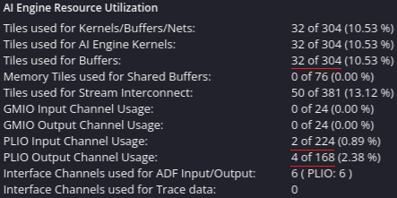
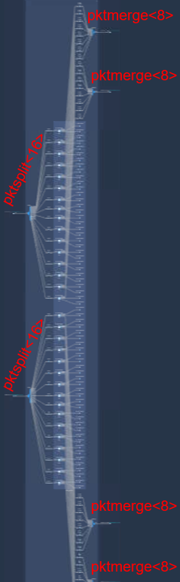
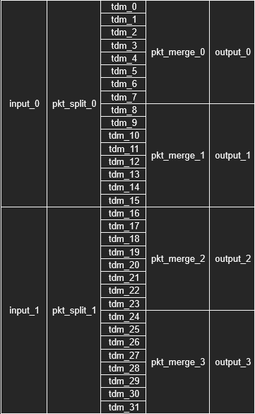
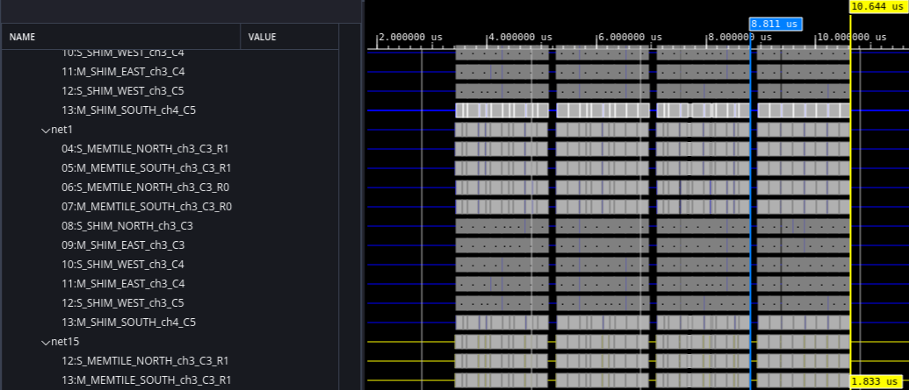
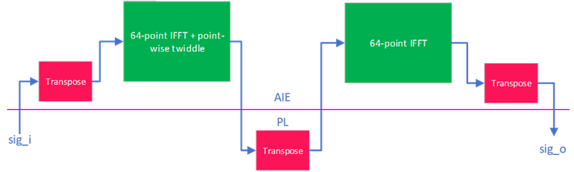
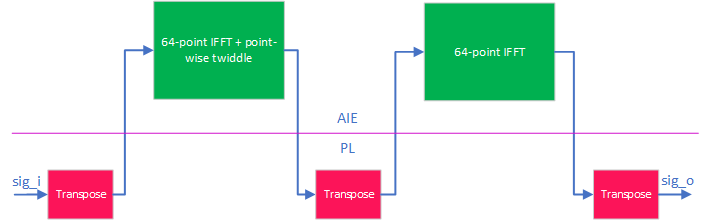
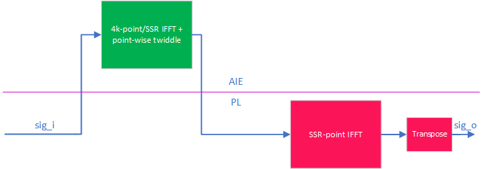
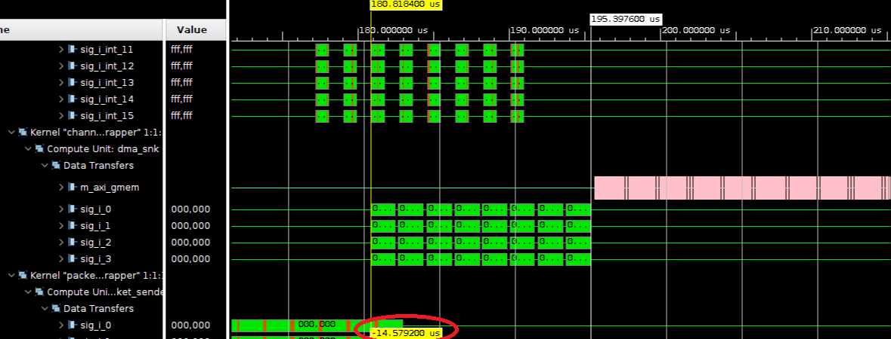

<table class="sphinxhide" style="width:100%;">
  <tr>
    <td align="center">
      <picture>
        <source media="(prefers-color-scheme: dark)" srcset="https://raw.githubusercontent.com/Xilinx/Image-Collateral/main/logo-white-text.png">
        
      </picture>
      <h1>AMD Vitis™ AI Engine Tutorials</h1>
      <a href="https://www.amd.com/en/products/software/adaptive-socs-and-fpgas/vitis.html">See Vitis™ Development Environment on amd.com</a>
        </br>
      <a href="https://www.amd.com/en/products/software/vitis-ai.html">See Vitis™ AI Development Environment on amd.com</a>
    </td>
  </tr>
</table>

# Polyphase Channelizer on AIE-ML using Vitis Libraries

***Version: Vitis 2025.2***

## Table of Contents

- [Polyphase Channelizer on AIE-ML using Vitis Libraries](#polyphase-channelizer-on-AIE-ML-using-Vitis-Libraries)
  - [Table of Contents](#table-of-contents)
  - [Introduction](#introduction)
  - [Channelizer Requirements](#channelizer-requirements)
  - [System Partitioning](#system-partitioning)
    - [Filterbank System Partitioning](#filterbank-system-partitioning)
    - [IFFT-2D System Partitioning](#ifft-2d-system-Partitioning)
  - [Design Resources](#design-resources)
  - [Build and Run Design](#build-and-run-design)
    - [Setup \& Initialization](#setup--initialization)
    - [Hardware Emulation](#hardware-emulation)
    - [Hardware](#hardware)
  - [References](#references)
  - [Support](#support)
  - [License](#license)

## Introduction

AMD Vitis™ Libraries introduced two new IP elements to simplify building Channelizers.
* [TDM FIR](https://docs.amd.com/r/en-US/Vitis_Libraries/dsp/user_guide/L2/func-fir-TDM.html)
* [2D FFT/IFFT Vitis subsystem](https://docs.amd.com/r/en-US/Vitis_Libraries/dsp/user_guide/L2/func-fft-vss.html)

This tutorial shows you how to use these IP blocks to build high-performance channelizers. It combines AIE-ML and programmable logic (PL) resources in AMD Versal™ adaptive SoC devices.
The content of this tutorial is also available as an on-demand video. See second session of [AMD Versal™ AI Engine for DSP Webinar Series](https://webinar.amd.com/AMD-Versal-tm-AI-Engine-for-DSP-Webinar-Series/en).

The polyphase channelizer [[1]] simultaneously down-converts a set of frequency-division multiplexed (FDM) channels. These channels are carried in a single data stream. It uses an efficient approach based on digital signal processing. Channelizer use is ubiquitous in many wireless communications systems. Channelizer sampling rates increase steadily with advancements in RF-DAC and RF-ADC technology. These advancements make implementation challenging in high-speed reconfigurable devices like field-programmable gate arrays (FPGAs).


You can implement a 1D IFFT using a 2D IFFT algorithm with higher efficiency overall in cases of larger point size and SSR > 1 regime. This requires resources that span AIE and PL. 

Note: To reproduce any of the steps below, begin by cloning [Vitis_Libraries](https://github.com/Xilinx/Vitis_Libraries) and set DSPLIB_ROOT path to point to the `<cloned_repo_path>/dsp`.

## Channelizer Requirements

The following table shows the system requirements for the polyphase channelizer. The sampling rate is 2 GSPS. 
The design supports M=4096 channels with each channel supporting 2G / 4096 = 488.28125 KHz of bandwidth. 
The filterbank used by the channelizer uses K=36 taps per phase, leading to a total of 4096 x 36 = 147456 taps overall.

|Parameter|Value|Units|
|---|---|---|
| Sampling Rate (Fs) | 2 | GSPS |
| # of Channels (M) | 4096 | channels |
| Channel Bandwidth | 488.28125 | KHz |
| # of taps per phase (K) | 36 | n/a |
| Input datatype | cint16 | n/a |
| Output datatype | cint32 | n/a |
| Filterbank coefficient type | int32 | n/a |
| FFT twiddle type | cint16 | n/a |

## System Partitioning

System Partitioning is the process of designing an embedded system for heterogeneous compute.
Analyze the polyphase channelizer algorithm characteristics and its functional blocks. Identify the block to implement in AI Engines versus programmable logic (PL). Establish a data flow with sufficient bandwidth to support the required computations.
For more information on system partitioning methodology, refer to *Versal Adaptive SoC System and Solution Planning Methodology Guide* [(UG1504)](https://docs.amd.com/r/en-US/ug1504-acap-system-solution-planning-methodology/AI-Engine-System-Partitioning-Planning).


The channelizer has two fundemental building blocks and those are the Polyphase Filterbank and IFFT.
This tutorial aims to analyze compute, storage, and I/O bandwidth requirements for the filterbank and IFFT. Understanding these requirements helps determine the expected usage of the number of AI Engine tiles.
We then instantiate and characterize the IP blocks and look for optimization opportunities. 

### Filterbank System Partitioning

#### Filterbank Compute Requirements

The filterbank has a total of 4096 channels, each with 36 taps of type int32. The sampling rate of each channel is 2e9/4096 = 488.28125 Ksps.

Based on the specified data and coefficient types, AI Engine must be able to perform 8 `cint16` x `int32` MACs every cycle in a single tile.
For more information, refer to Table 1 of the *Versal Adaptive SoC AIE-ML Architecture Manual* [(AM020)](https://docs.amd.com/r/en-US/am020-versal-aie-ml/Functional-Overview). 

Assuming we use part `xcve2802-vsvh1760-2MP-e-S`, you can clock the AI Engine at 1.25 GHz, as described in *Versal AI Core Series Data Sheet: DC and AC Switching Characteristics* [(DS957)](https://docs.amd.com/r/en-US/ds957-versal-ai-core/AI-Engine-Switching-Characteristics).
A general rule of thumb is to reserve some margin for processor overhead in the range of 20-25%.

The number of tiles required based on compute-bound analysis = 2e9 x 36 / 8 / 1.25e9 x 1.25 = 9 tiles.

#### Filterbank Storage Requirements

The filterbank requires storage for the filter coefficients and state, requiring 8 Bytes and 4 Bytes per coefficient or sample.
Total storage required for the filterbank = 4096 x 36 x 4B + 4096 x 35 x 4B = 1136 KB.

A single AIE-ML tile has 64 KB of local tile memory. This tile has access to three neighboring tile memories for a total size of 256 KB.
Reserve some storage for sysmem, which the processor requires to store stack and heap.

This leads to a solution which requires ~18 tiles for the filterbank. Rounding up to a power of 2 results in a simpler PL solution to avoid managing state.
Number of tiles based on storage-bound analysis = 32 tiles.

#### Filterbank I/O Bandwidth Requirements

The filterbank needs to run at 2 GSPS, with cint16 inputs and cint32 outputs.

Based on AIE-ML interfaces specified data in the *Versal Adaptive SoC AIE-ML Architecture Manual* [(AM020)](https://docs.amd.com/r/en-US/am020-versal-aie-ml/AIE-ML-Interfaces), a single stream delivers 32-bits per cycle.


For the chosen I/O datatypes and sampling rate, bandwidth requirement translates to two input PLIO ports and four output PLIO ports.

#### Filterbank Library Characterization

Based on the preceeding analysis, we learned that our filterbank is storage-bound, requiring 32 tiles. 
We can instantiate the TDM FIR IP based on the following configuration. For more information on the definition of these parameters, refer to [Vitis Libraries](https://docs.amd.com/r/en-US/Vitis_Libraries/dsp/rst/class_xf_dsp_aie_fir_tdm_fir_tdm_graph.html).

```
  typedef cint16                      TT_DATA;
  typedef cint32                      TT_OUT_DATA;
  typedef int32                       TT_COEFF;
  static constexpr unsigned           TP_FIR_LEN            = 36;
  static constexpr unsigned           TP_SHIFT              = 31;
  static constexpr unsigned           TP_RND                = 12;
  static constexpr unsigned           TP_NUM_OUTPUTS        = 1;
  static constexpr unsigned           TP_DUAL_IP            = 0;
  static constexpr unsigned           TP_SAT                = 1;
  static constexpr unsigned           TP_TDM_CHANNELS       = 4096;
  static constexpr unsigned           TP_SSR                = 32;
  static constexpr unsigned           TP_INPUT_WINDOW_VSIZE = 4096;
  static constexpr unsigned           TP_CASC_LEN           = 1;
```

We can characterize its performance to confirm it works as expected.

```
[shell]% cd <path-to-design>/aie/tdm_fir_characterize
[shell]% make clean all
[shell]% vitis_analyzer aiesimulator_output/default.aierun_summary
```

Inspecting vitis_analyzer, we observe that the design uses more tiles than expected (64 vs 32 predicted).


Zooming in to one of the tiles, we observe that the state history is stored with the input window, which is double-buffered.
This causes the storage requirement to increase beyond the predicted 32 tiles. This observation is specific to the TDM FIR IP on AIE-ML.


We also observe that the achieved throughput is higher than the requirement, 4096/1.257 = 3258 MSPS.


Below is a table summary of predicated vs actual resources with a note on what could be done to bring down resources closer to predicated levels.

|  | Predicted | Actual | Notes |
| ---   | --- | --- | --- |
|  AI Engine Tiles   | 32   | 64   | Use `single_buffer` on input ports + tight placement constraints |
|  PLIOs (in/out)  | 2/4   | 32/32   | Use **new** [Packet Switching IP](https://docs.amd.com/r/en-US/Vitis_Libraries/dsp/user_guide/L2/func-pkt_switch.html)|
|  Throughput (Gsps)  | >2   | 3.3   | Usage of above will result in some throughput degradation |

#### Filterbank Library Optimization
You can use the following approach to tradeoff throughput for storage, reducing the number of used AI Engine tiles:
* Apply `single_buffer` constraint on the input. For more information, refer to *AI Engine Kernel and Graph Programming Guide* [UG1076](https://docs.amd.com/r/en-US/ug1079-ai-engine-kernel-coding/Buffer-Allocation-Control).
* Add placement constraints to store each tile's storage requirements locally.

  Code snippet below taken from `<path-to-design>/aie/tdm_fir/firbank_app.cpp` shows an example of how this can be done.

  ```
  single_buffer(dut.tdmfir.m_firKernels[ii+0].in[0]);
  location<kernel>   (dut.tdmfir.m_firKernels[ii])                 =      tile(start_index+xoff,0);
  location<stack>    (dut.tdmfir.m_firKernels[ii])                 =      bank(start_index+xoff,0,3);
  location<parameter>(dut.tdmfir.m_firKernels[ii].param[0])        =      bank(start_index+xoff,0,3);
  location<parameter>(dut.tdmfir.m_firKernels[ii].param[1])        =   address(start_index+xoff,0,0x4C00);
  location<buffer>   (dut.tdmfir.m_firKernels[ii].in[0])           =      bank(start_index+xoff,0,0);
  location<buffer>   (dut.tdmfir.m_firKernels[ii].out[0])          = {    bank(start_index+xoff,0,1), bank(start_index+xoff,0,3) };
  ```

Compile and simulate the design to confirm it works as expected.

```
[shell]% cd <path-to-design>/aie/tdm_fir
[shell]% make clean all
[shell]% vitis_analyzer aiesimulator_output/default.aierun_summary
```

Inspecting vitis_analyzer, we observe that our resource count dropped to 32 tiles with a throughput = 4096/1.837us = 2230 MSPS.


To reduce the number of input and output PLIOs, we can use the newly introduced [Vitis Libraries Packet Switching IP](https://docs.amd.com/r/en-US/Vitis_Libraries/dsp/user_guide/L2/func-pkt_switch.html).

```
  using TT_FIR = xf::dsp::aie::fir::tdm::fir_tdm_graph<TT_DATA,TT_COEFF,TP_FIR_LEN,TP_SHIFT,TP_RND,TP_INPUT_WINDOW_VSIZE,
                                       TP_TDM_CHANNELS,TP_NUM_OUTPUTS,TP_DUAL_IP,TP_SSR,TP_SAT,TP_CASC_LEN,TT_OUT_DATA>;

  static constexpr unsigned           NPORT_I = 2;
  static constexpr unsigned           NPORT_O = 4;
  xf::dsp::aie::pkt_switch_graph<TP_SSR, NPORT_I, NPORT_O, TT_FIR> tdmfir;
```

Compile the design to understand updated resources usage:

```
[shell]% cd <path-to-design>/aie/tdm_fir
[shell]% make clean compile
[shell]% vitis_analyzer Work/firbank_app.aiecompile_summary
```



Under the hood, the IP instantiates 2 x pktsplit<16> and 4 x pktmerge<8>.



We have 4k samples that need to be distributed between 32 parallel filters, hence each filter shall receive 128 samples. From here, we have to key decisions to make:

* Size of the packet, i.e. number of samples per packet. A smaller packet requires less buffering in the PL but has higher bandwidth overhead since packet header needs to be sent more often, while the opposite is true for a larger packet. Edge cases are
  * Packet size = 1 can be simulated by commenting out `gen_vectors.m` line 127-146 and uncommenting line 167-177. This should double the bandwidth requirement since packet header has to be specified for every sample. When simulating the design, we observe that the system incurrs additional cycles of latency for packet arbitration. Therefore, this option is not ideal to proceed with.
  * Packet size = 128 results in minimal packet switching overhead but requires a full transform double-buffered storage in PL
* Order of the packets
  * Linear ordering: Since the # output ports > # input ports, distributing the packets in linear order means output_0 starts producing samples way before output_1. Simiarly, output_2 before output_3. This can be simulated by commenting out `gen_vectors.m` line 127-146 and uncommenting line 149-164. The large latency (~0.84us, measured in aiesimulator) delta between output ports will results in stalling and degraded throughput when connecting the TDM to the rest of the channelizer. This latency can be absorbed by adding large FIFOs on TDM output in system.cfg, but this consumes PL resources. More on applying FIFOs on stream connections can be found in [Specifying Streaming Connections • Embedded Design Development Using Vitis User Guide (UG1701)](https://docs.amd.com/r/en-US/ug1701-vitis-accelerated-embedded/Specifying-Streaming-Connections).
      
  * Interleaved ordering: Alternatively, we can distribute the packets such that each output port receives one packet at at a time. Therefore, input_0 receives input data for tdm_0, tdm_8, tdm_1, tdm_9, etc. Doing so comes at no cost and results in latency delta reduction down to ~0.091us, measured in aiesimulator.

Run `gen_vectors.m` and simulate the design to understand achieved throughput:

```
[shell]% cd <path-to-design>/aie/tdm_fir
[shell]% make gen_vectors
[shell]% make profile
[shell]% vitis_analyzer aiesimulator_output/default.aierun_summary
```

Below we measure the aiesimulator throughput for the optimized packet switching-based TDM => 4096/1.833 = 2234 Msps.


#### Packet Sender

The `packet_sender` is an HLS kernel that bridges between the continuous data stream from DDR memory and the AI Engine's packet-switched interface. It performs two critical functions:

1. **Data Reorganization**: The consumer function reads continuous cint16 sample streams and reorganizes them into an interleaved pattern optimized for packet distribution. Samples are read from two input streams alternately and written to stream-of-blocks buffers (`ss0` and `ss1`) in a specific pattern that ensures balanced packet timing downstream.

2. **Packet Formation**: The producer function reads from the buffered data and formats AXI-Stream packets with proper headers and sideband signals. Each packet consists of:
   - **Header beat**: 32-bit AI Engine packet header (containing routing ID) + first 3 cint16 samples
   - **Middle beats**: 31 beats of continuous data (4 samples per beat)
   - **Last beat**: Final sample with TLAST=1 and TKEEP=0x000F to mark packet boundary

Key implementation details:
- **Dataflow architecture**: Consumer and producer run concurrently using HLS dataflow pragma
- **Stream-of-blocks**: Two 512-word × 128-bit LUTRAM buffers (zero BRAM usage) synchronize the consumer and producer
- **Interleaved ordering**: Packets are distributed in stride-8 pattern (0,8,1,9,2,10,3,11,4,12,5,13,6,14,7,15) to minimize latency delta between the 4 AI Engine output ports of the packet-switched TDM FIR (~0.091us vs 0.84us for linear ordering, as described earlier). This reduces downstream stalls when connecting the TDM FIR to the IFFT, avoiding the need for large FIFOs to absorb timing skew between streams.
- **TKEEP signaling**: Critical for width converter compatibility - uses 0xFFFF for valid data and 0x000F for partial last beat
- **Performance**: Achieves 2.5 Gsps total throughput (1.25 Gsps per stream) at 312.5 MHz with 128-bit interfaces

The kernel processes 4096 input samples per stream and generates 16 packets per stream, with each packet containing 128 samples. Packet headers are generated from routing IDs defined in `packet_ids_c.h`, which is produced by the AI Engine compiler.

#### Packet Receiver

The `packet_receiver` is an HLS kernel that performs cross-port packet switching from 4 input AXI Stream ports to 8 output AXI Stream ports, reorganizing data from the AI Engine's packet-switched TDM FIR outputs back into polyphase streams for the IFFT. It performs two critical functions:

1. **Packet Reception and Buffering**: The producer function reads packets from 4 input ports and routes them to 32 dedicated stream-of-blocks buffers based on packet ID. Each input port receives 8 packets sequentially, with packet IDs extracted from the 32-bit AI Engine header (bits [4:0]). The design supports out-of-order packet arrival through a two-level lookup mechanism: extracting the index from header bits [4:0], then looking up the actual packet ID from `packet_ids_N` arrays to determine the destination buffer.

2. **Data Reorganization and Output**: The consumer function reads from the buffered packets and reorganizes samples into 8 output streams with interleaved ordering. Each output port receives 4 packets (strided pattern: output N receives packets N, N+8, N+16, N+24), with samples written in round-robin fashion across the packets to ensure balanced timing.

Key implementation details:
- **32 independent stream-of-blocks**: One dedicated 128-sample buffer per packet with ping-pong double buffering (depth=2) for concurrent producer/consumer operation
- **LUTRAM implementation**: Zero BRAM usage - all 512 Kb of storage (32 packets × 128 samples × 64 bits × 2 buffers) implemented in distributed RAM
- **Array partitioning**: Cyclic factor=2 partitioning splits each buffer into even/odd memory banks, enabling dual-write optimization for producer II=1
- **Out-of-order packet support**: Header-based routing using `packet_ids_N[header[4:0]]` lookup ensures correct data flow regardless of packet arrival order from upstream AI Engine processing
- **Cross-port switching**: Input port N receives packets (N×8) to (N×8+7), while output port N receives packets N, N+8, N+16, N+24
- **Performance**: Achieves 2.38 Gsps sustained throughput (95.2% efficiency) at 312.5 MHz with 128-bit interfaces, validated in RTL co-simulation

The kernel processes 4096 samples per transform (32 packets × 128 samples), with each packet containing a 32-bit header followed by 128 cint32 samples. The two-level packet ID lookup mechanism (defined in `packet_receiver.h` using values from `packet_ids_c.h`) provides flexible mapping between AI Engine packet IDs and internal routing, critical for robust integration with the asynchronous AI Engine fabric.

### IFFT-2D System Partitioning

In this tutorial, we explore the use of 2D IFFT IP to implement a 4K-pt IFFT @ 2 GSPS. The resources span AIE + PL. To learn more about this IP, refer to [Vitis Libraries - 2D FFT/IFFT Vitis subsystem](https://docs.amd.com/r/en-US/Vitis_Libraries/dsp/user_guide/L2/func-fft-vss.html).

The IP offers two modes to implement the IFFT set through VSS_MODE parameter: Mode 1 and Mode 2. This tutorial uses Mode 1.

Mode 1 implements the row and column transforms in AI Engine while implementing the transpose operations in AIE+PL as follows:
* The middle transpose is implemented using resources in AIE+PL and can use single buffering (half the resources) compared to 2025.1 Vitis Libraries.
* For powers-of-two SSRs, the front and back transpose operations implemented in AIE leveraging either DMA or memory tiles, depending on datatype and transform sizes.
  

  Otherwise, implement the front and back transpose operations in the PL.

  

Mode 2 splits the IFFT into a front section mapped to AI Engine and a back section mapped to PL. This architecture results in less memory requirements in PL but requires some DSPs.



#### Available Workflows for IFFT-2D IP

You can use the IFFT-2D IP through two different approaches:

1) **Vitis Subsystem (VSS) - Recommended**: The IP automatically handles leaf block connectivity and produces a `.vss` file. This is the recommended workflow for most users. Refer to [Vitis Libraries IFFT-2D VSS example](https://github.com/Xilinx/Vitis_Libraries/tree/main/dsp/L2/examples/vss_fft_ifft_1d) for reference.

2) **Manual Leaf Block Instantiation**: Users manually instantiate and connect the individual leaf blocks that make up the IFFT-2D IP. This tutorial demonstrates this workflow, which provides greater control over design placement and avoids reserving full columns for the FFT implementation.

**Note**: To understand the required leaf blocks and how they must connect, first use approach 1 to instantiate the IP as a VSS. Then, examine the generated leaf blocks and their connectivity. After that, manually instantiate and connect these blocks in your custom configuration.

#### IFFT-2D Library Characterization

We need to characterize a single instance of the IP and measure throughput to understand how many instances we need to meet performance.

The first step is to characterize the 2D IFFT AI Engine IP, that is, vss_fft_ifft_1d_graph, to understand the optimal configuration to meet our requirements.

We can instantiate vss_fft_ifft_1d_graph based on the configuration below. The main choice you have to make as part of this exercise is what TP_SSR is sufficient to meet our throughput requirement. We begin assuming that TP_SSR=1 and adjust as needed.
For more information on the definition of these parameters, refer to [Vitis Libraries](https://docs.amd.com/r/en-US/Vitis_Libraries).

```
  typedef cint32            TT_DATA;
  typedef cint16            TT_TWIDDLE;
  static constexpr unsigned TP_POINT_SIZE = 4096;
  static constexpr unsigned TP_FFT_NIFFT = 0;
  static constexpr unsigned TP_SHIFT = 0;
  static constexpr unsigned TP_CASC_LEN = 1;
  static constexpr unsigned TP_API = 0;
  static constexpr unsigned TP_SSR = 1;
  static constexpr unsigned TP_USE_WIDGETS = 0;
  static constexpr unsigned TP_RND = 12;
  static constexpr unsigned TP_SAT = 1;
  static constexpr unsigned TP_TWIDDLE_MODE = 0;
```

Note that vss_fft_ifft_1d_graph consists of three AI Engine kernels:
* Front FFT/IFFT
* Point-wise twiddle multiplication
* Back FFT/IFFT

In `<path-to-design>/aie/ifft4096_2d_characterize/ifft4096_2d_app.cpp`, we have added a location constraint to place the first two kernels in the same tile.
```
location<kernel>(dut.ifft4096_2d.m_fftTwRotKernels[ff]) = location<kernel>(dut.ifft4096_2d.frontFFTGraph[ff].FFTwinproc.m_fftKernels[0]);
```
The next step is to characterize its performance.

```
[shell]% cd <path-to-design>/aie/ifft4096_2d_characterize
[shell]% make clean all
[shell]% vitis_analyzer aiesimulator_output/default.aierun_summary
```

Inspecting vitis_analyzer, we can read two throughput numbers:
* First,  4096/8.392us = 488 MSPS, corresponding to the tile performing front 64-point IFFT + point-wise twiddle multiplication.
* Second, 4096/6.913us = 593 MSPS, corresponding to the tile performing the back 64-point IFFT.


This means, we need SSR=5 to meet our target throughput of 2 GSPS.

#### IFFT-2D Library Optimization

While an SSR=5 is sufficient from a resource count perspective, using a SSR that is a power of 2 simplifies the overall design and allows the direct mapping of TDM FIR outputs into 2D IFFT input. For this reason, we proceed with SSR=8.

We can also apply the `single_buffer` constraint on some I/Os of this block to reduce the storage requirements at the expense of some degradation in throughput. Using `single_buffer` on the I/Os of the front FFT and on the input of the back FFT lets you place the design in a compact (8x2) placement.

```
[shell]% cd <path-to-design>/aie/ifft4096_2d
[shell]% make clean all
[shell]% vitis_analyzer aiesimulator_output/default.aierun_summary
```

Inspecting vitis_analyzer, we observe a resource count of 16 AIE-ML tiles and 6 Memory Tiles.
Achieved throughput for:
* Front 64-point IFFT + point-wise twiddle multiplication = 2386 MSPS
* Back 64-point IFFT = 2376 MSPS


The AI Engine portion of the design is implementing the front/back transpose operations. What remains is the middle transpose block, done in PL.

The IFFT mid transpose block that exist in `${DSPLIB_ROOT}/L1/src/hw/mid_transpose`. The PL runs at 312.5 MHz and use 128-bit interfaces. A 128-bit interface contains two cint32 samples, so instantiate this block with 2x SSR value selected for AIE portion, that is, 16. A PL splitter/merger block must connect on each side of this transpose block to match these SSR assumptions. These exist in `${DSPLIB_ROOT}/L1/src/hw/common_fns/axis_split_join`.

### Design Summary

- TDM FIR uses 32 AI Engine tiles with 32 IO streams
- Implement the 4k-pt IFFT using 2D architecture (with Mode 1) with resources split between 16 AI Engine tiles (compute), 6 memory tiles (front/back transpose) and PL (middle transpose).
- From a bandwidth perspective, the design requires 2 input and 4 output streams.
- Build custom HLS blocks (split and merge) to manage connectivity between the IPs.
- Output ports of AI Engine going to PL can arrive at different times causing minor throughput loss. You can compensate those by adding FIFOs during v++ linking step, [Specifying-Streaming-Connections](https://docs.amd.com/r/en-US/ug1701-vitis-accelerated-embedded/Specifying-Streaming-Connections).


## Design Resources

The following figure summarizes the AI Engine and PL resources required to implement the design in the VE2802 device on the VEK280 eval board. The design is using 48 AI Engine tiles for compute. The PL design includes the resources required to implement the DMA Source, Stream Split/Merge, Memory Transpose, and DMA Sink kernels.


## Build and Run Design

You can build the polyphase channelizer design from the command line.

### Setup & Initialization

IMPORTANT: Before beginning the tutorial, install AMD Vitis™ 2025.2 software. Download the Common Images for Embedded Vitis Platforms from [this link](https://www.xilinx.com/support/download/index.html/content/xilinx/en/downloadNav/embedded-platforms.html).

Set the environment variable ```COMMON_IMAGE_VERSAL``` to the full path where you have downloaded the Common Images. Then set the environment variable ```PLATFORM_REPO_PATHS``` to the value ```$XILINX_VITIS/base_platforms```.

The remaining environment variables are configured in the top level Makefile ```<path-to-design>/Makefile``` file.

### Hardware Emulation

You can build the channelizer design for hardware emulation using the Makefile as follows:

```
[shell]% cd <path-to-design>
[shell]% make all TARGET=hw_emu
```

This takes about 90 minutes to run. The build process generates a folder ```package``` containing all the files required for hardware emulation.
This runs as shown below.
An optional `-g` can be applied to the ```launch_hw_emu.sh``` command to launch Vivado waveform GUI to observe the top-level AXI signal ports in the design.

```
[shell]% cd <path-to-design>/package
[shell]% ./launch_hw_emu.sh -g -run-app embedded_exec.sh
```
After hardware emulation run is complete, you view the following in the terminal.


Throughput can be measured by inspecting the traces. The design processes 8 transforms, each with 4k samples in 15.56us. Throughput = 8 x 4096 / 14.58 = 2250 Msps.



### Hardware

You can build the channelizer design for the VEK280 board using the Makefile as follows:

```
[shell]% cd <path-to-design>
[shell]% make all TARGET=hw
```

The build process generates the SD card image in the ```package/sd_card``` folder.
After flashing sd_card.img into the sd card, power on the board and run the design.
The following is displayed on the terminal.


## References

[1]: <https://ieeexplore.ieee.org/document/1193158> "Digital Receivers and Transmitter Using Polyphase Filter Banks for Wireless Communications, F.J. Harris et. al."

[[1]] F.J. Harris et. al., "[Digital Receivers and Transmitter Using Polyphase Filter Banks for Wireless Communications](https://ieeexplore.ieee.org/document/1193158)", IEEE Transactions on Microwave Theory and Techniques, Vol. 51, No. 4, April 2003.

## Support

GitHub issues are used for tracking requests and bugs. For questions, go to [Support](https://adaptivesupport.amd.com/s/?language=en_US).

## License

<p class="sphinxhide" align="center"><sub>Copyright © 2023-2025 Advanced Micro Devices, Inc.</sub></p>
<p class="sphinxhide" align="center"><sup><a href="https://www.amd.com/en/corporate/copyright">Terms and Conditions</a></sup></p>
