<table class="sphinxhide" style="width:100%;">
  <tr>
    <td align="center">
      <picture>
        <source media="(prefers-color-scheme: dark)" srcset="https://raw.githubusercontent.com/Xilinx/Image-Collateral/main/logo-white-text.png">
        
      </picture>
      <h1>AMD Vitis™ AI Engine Tutorials</h1>
      <a href="https://www.amd.com/en/products/software/adaptive-socs-and-fpgas/vitis.html">See Vitis Development Environment on amd.com</a>
        </br>
      <a href="https://www.amd.com/en/products/software/vitis-ai.html">See Vitis AI Development Environment on amd.com</a>
    </td>
  </tr>
</table>

# Matrix Compute with Vitis Libraries on AIE and AIE-ML

***Version: Vitis 2025.2***

## Introduction

In linear algebra, matrix multiplication is a binary operation that generates a matrix from two input matrices.

For this operation to occur, the number of columns in the first matrix must match the number of rows in the second matrix. The resulting matrix, called the matrix product, has the same number of rows as the first matrix and the same number of columns as the second matrix.

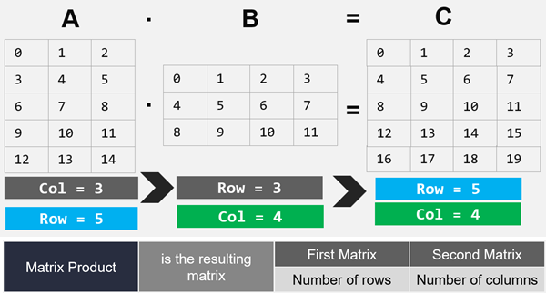

The figure shows the product of two matrices, **A** and **B**, highlighting how each entry comes from a row in **A** and a column in **B**.

For example, `c11` equals `(a11 x b11) + (a12 x b21)`. Similarly, `c33` equals `(a31 x b13) + (a32 x b23)`.

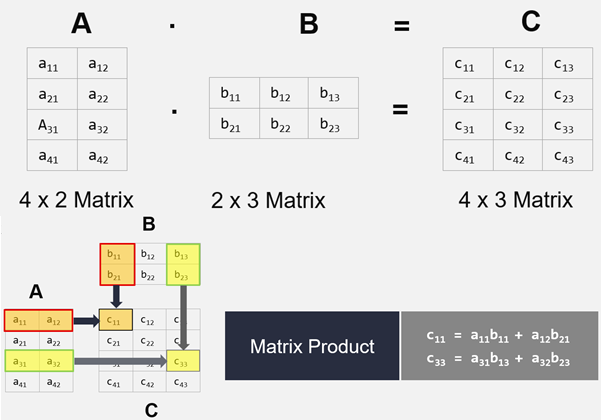

**IMPORTANT**: Before starting the tutorial, read and follow the *Vitis Software Platform Release Notes* (v2025.2) to set up the software and install the VEK280 base platform.

Then complete the following steps:
1. Set your `PLATFORM_REPO_PATHS` environment variable based on the directory where you downloaded the platform.
2. Download the Vitis libraries from https://github.com/Xilinx/Vitis_Libraries. For example: run `git clone https://github.com/Xilinx/Vitis_Libraries.git` to an appropriate directory.
3. Set the `DSPLIB_ROOT` to the downloaded Vitis libraries path. For example, run `export DSPLIB_ROOT=/<DSP_LIBRARY_PATH>/Vitis_Libraries/dsp`

# AMD Versal Devices with AI Engine Variants

AMD Versal™ AI Core and Versal AI Edge devices come in AIE, AIE-ML, and AIE-MLv2 variants. Select your device based on project requirements. The following table lists the devices that have AIE and AIE-ML variants.

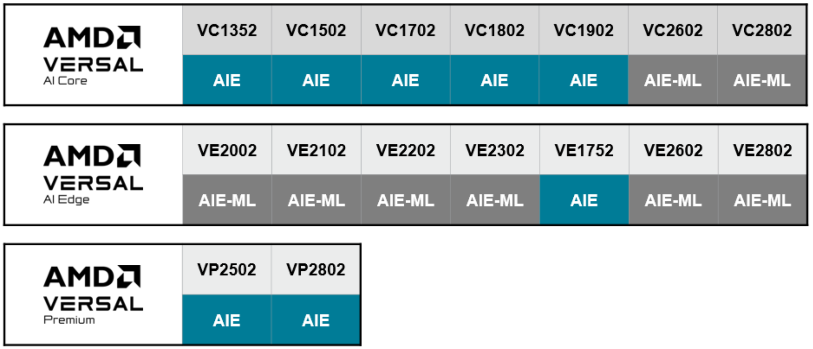

For more information, visit the *[AMD Versal Adaptive SoCs page](https://www.amd.com/en/products/adaptive-socs-and-fpgas/versal.html)*. 

# Table of Contents
- [Introduction to DSP Library](#introduction-to-dsp-library) 
- [List of Parameters in General Matrix Multiply (GEMM)](#list-of-parameters-in-general-matrix-multiply-gemm)
- [Configuration of GEMM Parameters](#configuration-of-gemm-parameters)
- [Design Variant 1: Single Tile](#design-variant-1-single-tile)
- [Design Variant 2: 4-tile design with TP_CASC_LEN=4](#design-variant-2-4-tile-design-with-tp_casc_len4)
- [Design Variant 3: 8-tile design with TP_CASC_LEN=4 and TP_SSR=2](#design-variant-3-8-tile-design-with-tp_casc_len4-and-tp_ssr2)
- [Migrate the Design from AIE to AIE-ML and Evaluate the Performance Differences](#migrate-the-design-from-aie-to-aie-ml-and-evalute-the-performance-differences)

## Objectives
- Overview of matrix multiply and general matrix multiply (GEMM) in Vitis libraries.
- Configure the GEMM parameters according to your design requirements.
- Explore three designs for different application needs.
- Compare performance of the designs on AIE versus AIE‑ML devices.

## Introduction to DSP Library
The DSP library (DSPLib) includes a PL DSP library and an AI Engine DSP library. This tutorial focuses on the AI Engine DSP library. This configurable library contains graphs and kernels for developing applications on Versal AI Engines. The library is open‑source and supports DSP applications. Kernels use AI Engine APIs in C++, providing access to vector processing capabilities. You can combine kernels into graphs to build complex designs.

An example design is included with the library. Each kernel has a corresponding graph. Use the library element’s L2 graph as your entry point.

The DSPLib offers one matrix multiply and a GEMM solution for AIE and AIE‑ML. The GEMM uses two input ports connected to two data windows.

Inputs are matrix A (`inA`) and matrix B (`inB`). The output port connects to a window storing the output matrix data.

You can configure the data type for both input matrices. The output data type derives from the input types.

Matrix Multiply supports multiplying integer matrices (`int16`, `cint16`, `int32`, `cint32`) and multiplying floating‑point matrices (`float` and `cfloat`). It does not support mixing integer and floating‑point types.

For AIE‑ML and AIE‑MLv2, Matrix Multiply supports integer types (`int16`, `int32`, `cint16`, `cint32`) only and does not support floating‑point types.

The graph entry point is: ```xf::dsp::aie::blas::matrix_mult::matrix_mult_graph```

## List of Parameters in GEMM

The parameters are organized into seven groups as shown in the following figure.
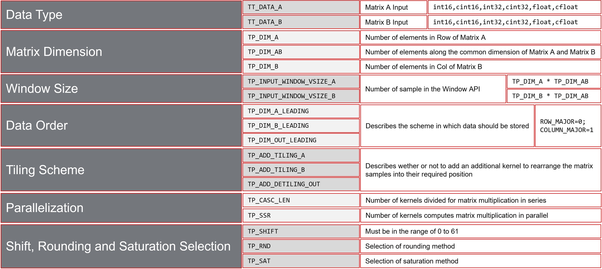

The first group defines the ***data type***:

* TT_DATA_A: Specify the type of individual data samples for matrix A input to the GEMM function.
The data type must be one of the following: `int16`, `cint16`, `int32`, `cint32`, `float`, or `cfloat`.

* TT_DATA_B: Specify the type of individual data samples for matrix B input to the GEMM function.
The data type must be one of the following: `int16`, `cint16`, `int32`, `cint32`, `float`, or `cfloat`.
The following rules apply:
  - Use an integer type if TT_DATA_A is an integer type
  - Use a float type if TT_DATA_A is a float type

The second group specifies the ***matrix dimensions***:

* TP_DIM_A: Specify the number of elements along the unique dimension (rows) of matrix A. Use an unsigned integer.

* TP_DIM_AB: Specify the number of elements along the common dimension of matrix A (columns) and matrix B (rows). Use an unsigned integer.

* TP_DIM_B: Specify the number of elements along the unique dimension (columns) of matrix B. Use an unsigned integer.

The third group specifies the ***window size***:

* TP_INPUT_WINDOW_VSIZE_A:  Specify the number of samples in the window application programming interface (API) for matrix A input. The size must equal `TP_DIM_A * TP_DIM_AB`.

* TP_INPUT_WINDOW_VSIZE_B: Specify the number of samples in the window API for matrix B input. The size must equal `TP_DIM_B * TP_DIM_AB`. The output size equals `TP_DIM_A * TP_DIM_B`.

The fourth group details the ***data order***:

* TP_DIM_A_LEADING: Specify how to store data in memory. `ROW_MAJOR = 0`, `COL_MAJOR = 1`. You can transpose a `COL_MAJOR` matrix to become a `ROW_MAJOR` matrix.

* TP_DIM_B_LEADING: Specify how to store data in memory. `ROW_MAJOR = 0`, `COL_MAJOR = 1`.

* TP_DIM_OUT_LEADING: Specify how to store output data in memory. `ROW_MAJOR = 0`, `COL_MAJOR = 1`.

The fifth group describes the ***tiling scheme***:

* TP_ADD_TILING_A / TP_ADD_TILING_B / TP_ADD_DETILING_OUT: Specify whether to add a kernel to rearrange matrix samples into required positions. Set this option to 0 if you rearrange externally to the AIE matrix multiply graph.

The sixth group addresses the ***parallelization***:

* TP_CASC_LEN: Specify the number of AIE kernels for a series division of matrix multiplication.

* TP_SSR: Specify the number of kernels, or cascaded kernel chains, computing the matrix multiplication in parallel. Each SSR rank receives an equal split (along the unique dimension) of matrix A data.

The seventh group focuses on the selection of ***shift, rounding, and saturation methods***. Various selection options appear in the *[Vitis Libraries User Guide](https://docs.amd.com/r/en-US/Vitis_Libraries/dsp/rst/class_xf_dsp_aie_blas_matrix_mult_matrix_mult_graph.html)*.

## Configuration of GEMM Parameters

### Configure Matrix Dimension
In the coding section, first specify the graph entry: `xf::dsp::aie::blas::matrix_mul`.

Create your own class to configure the GEMM parameters. Name the class `gemm_16x32x8_graph`.

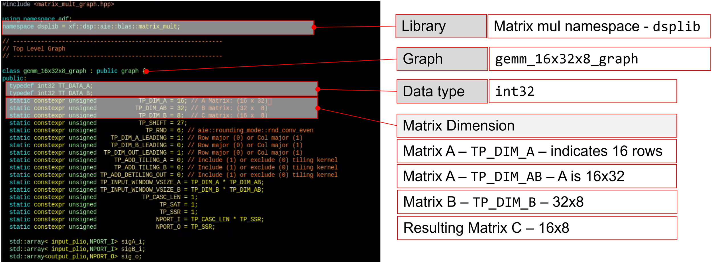

Configure the data type and matrix dimensions as follows:
- Matrix A: 16 rows
- Matrix B: 8 columns
- TP_DIM_AB: Indicates the number of elements along the shared dimension of matrix A (columns) and matrix B (rows), set to 32. 

Therefore, the final matrices are:
```
- Matrix A: 16x32
- Matrix B: 32x8
- Resulting Matrix C: 16x8
```
### Configure Data Ordering (LEADING) - A, B, Output

Data ordering specifies whether matrix data is stored row-by-row or column-by-column.

- Row major: Store data in row order. The following figure shows row major organization.
- Column major: Store data in column order. The following figure shows column major organization.

Now you need to set the data ordering for matrices A, B, and the resulting matrix C. But first, let’s clarify what data ordering is.

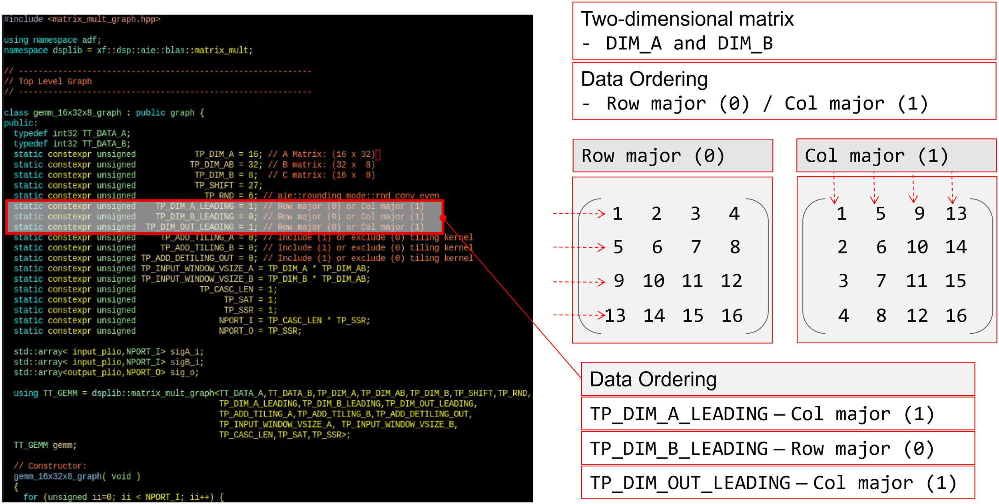

Set the data order for matrices A, B, and C as follows:
```
- Matrix A is set to column major, provide the data in column-major format.
- Matrix B is set to row major, supply the data in row-major format.
- Matrix C is also set to column major, read output data according to column-major ordering.
```
### Configure Buffer Size (Window)

Do the following to configure the buffer sizes:

- Calculate the input buffer size for ``TP_INPUT_WINDOW_VSIZE_A`` as ***TP_DIM_A * TP_DIM_AB***. In this example it is `16 x 32 = 512`.
- Set the input buffer size for ``TP_INPUT_WINDOW_VSIZE_B`` to ***TP_DIM_B * TP_DIM_AB***. In this example it is `8 x 32 = 256`.

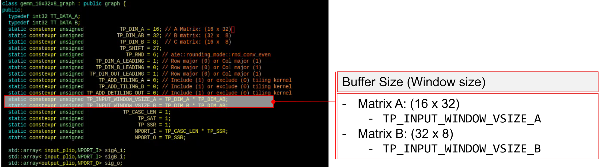

### Configure Parallelization (TP_CASC_LEN and TP_SSR)

In this tutorial, explore three design variants. The first design uses of a single processing core.

To use a single core, configure both ``TP_CASC_LEN`` and ``TP_SSR`` to 1.

The values of `TP_CASC_LEN` and `TP_SSRnumber` determine the number of input and output ports.

For the input port **NPORT_I**, calculate it as ``TP_CASC_LEN * TP_SSR``. In this case, `1 x 1 = 1` input port.

For the output port **NPORT_N**, set it to ``TP_SSR``. Here, ``TP_SSR`` equals 1, resulting in one output port.

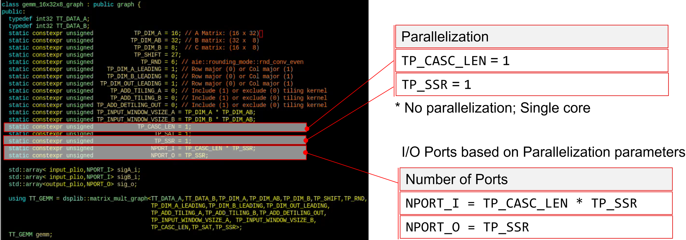


### Configure Tiling Scheme

**What is Tiling?**

To maximize performance, arrange the GEMM input matrix data into a specific tiling pattern, where each sub-tile within the matrix is contiguous in memory. Use tiler and detiler widgets to arrange the input matrix data into this tiling pattern and convert the tiled output data to a specified row or column major format. This process can introduce performance and resource overhead. 

For optimal GEMM performance, supply input data and read output data in the required tiled arrangement.

The following figure demonstrates how to arrange a 16x16 input matrix into a 4x4 tiling pattern.

The tiling scheme depends on the data type. In this case, for `int16` matrices A and B, the appropriate tiling scheme is 4x4 for both matrices.

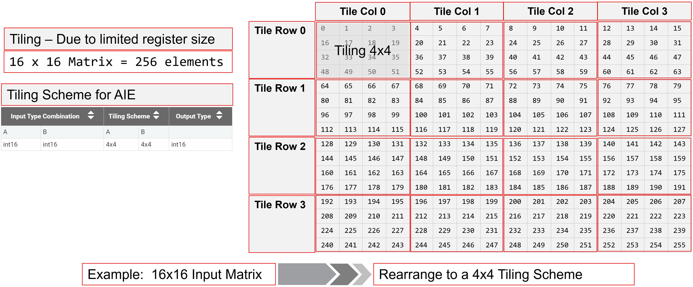

The following table specifies the tiling scheme used for the given data type combinations and corresponding output data types for AIE and AIE-ML devices.

For instance, for the `int32` data type in both matrices A and B, the tiling scheme for `matrix A is 4x4`, while for `matrix B, it is 4x2`.

In the case of **AIE-ML**, both matrix A and matrix B have a tiling scheme of `4x4`.

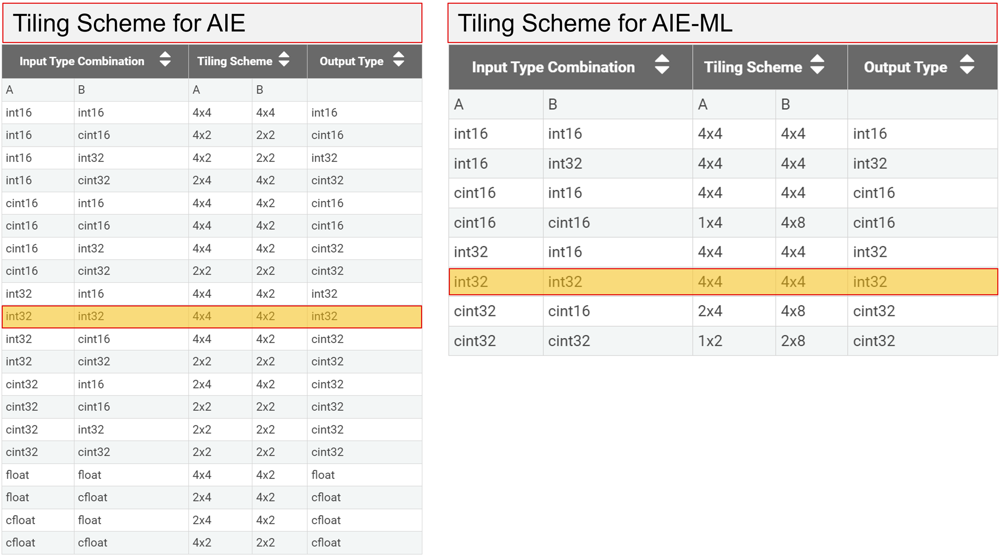

**Tiling and Data Ordering:**

Rearrange the 16x16 matrix into a 4x2 tiling pattern. 

Note the data order. In this case, configure it as row major.

Store the data contiguously in memory, as shown in the following figure.

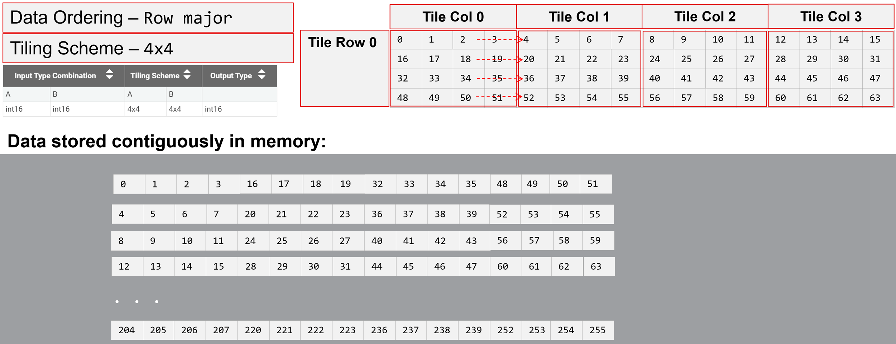

**Tiling Scheme and Data Ordering Example**

Following is an example of an 8x8 matrix.

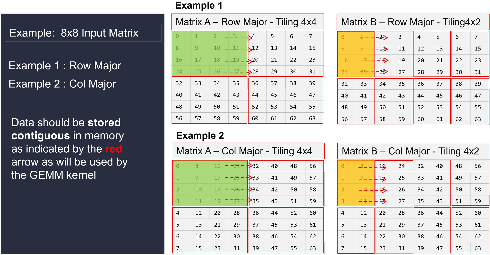

The **Row Major/Column Major** data order indicates the arrangement of matrices before any tiling occurs.

For an 8x8 matrix with a 4x4 tiling scheme, both column and row major modes illustrate how the 8x8 matrix is populated. Tiles are derived from this matrix regardless of the original row or column major arrangement. 

In example 1, the data order is row major, and the tiling scheme is 4x4. You can see how the data should be stored contiguously. Similarly, for matrix B, which also uses row major order with a tiling scheme of 4x2, the data is stored contiguously.

In example 2, the data order is column major, with a tiling scheme of 4x4. Again, notice how the data is stored contiguously. For matrix B, the data order is column major and the tiling scheme is 4x2, with the data also stored contiguously.

The red arrows show contiguous data in memory used by the GEMM kernel after tiling. Consume tiles left to right and top to bottom in row-major order.

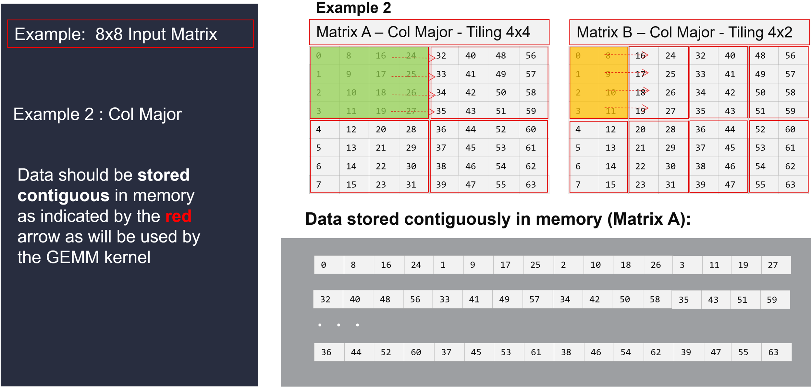

> Note: As you prepare to implement the design in AIE and AIE-ML, it is crucial to consider how the data should be stored according to the tiling scheme.

| Architecture        | Data Type | Data Type  | Tiling Scheme   |          | 
|---------------------|-----------|------------|-----------------|----------|
|                     | Matrix A  | Matrix B   | Matrix A        | Matrix B |
| AIE                 | int32     | int32      | 4x4             | 4x2      |
| AIE-ML              | int32     | int32      | 4x4             | 4x4      |      

The tiling scheme for matrix A is ``4x4``, so the data can be the same for both AIE and AIE-ML designs. 

For matrix B, the tiling scheme is ``4x2`` for **AIE** and ``4x4`` for **AIE-ML**. Therefore, the data should be stored in a ``4x2`` tiling scheme for **AIE** and a ``4x4`` tiling scheme for **AIE-ML**.

## Design Variant 1: Single Tile

The goal of Design 1 is to use a single tile for matrix multiplication.

Observe the parameter configuration shown in the following figure.

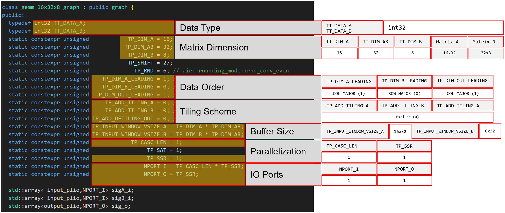

The data type is defined as ```int32``` for both ***matrix A*** and ***matrix B*** inputs.

**Matrix A** has dimensions of *16x32*, while **matrix B** is set to *32x8*.

The data order for **matrix A** and the resulting **matrix C** is configured as ``Column major``, whereas **matrix B** is set as ``Row major``.

Exclude the tiling scheme so you handle rearrangement externally to the AIE matrix multiply graph. This avoids adding an additional kernel for position rearrangement.

The input buffer size for **TP_INPUT_WINDOW_VSIZE_A** is calculated as ``TP_DIM_A * TP_DIM_AB``, which in this case equals ***512***.

Likewise, the input buffer size for **TP_INPUT_WINDOW_VSIZE_B** is set to ``TP_DIM_B * TP_DIM_AB``, resulting in a value of ***256***.

Because you use a single AIE core, set both **TP_CASC_LEN** and **TP_SSR** to ```1```.

The values of `TP_CASC_LEN` and `TP_SSRnumber` determine the number of input and output ports.

For the input port **NPORT_I**, calculate ```TP_CASC_LEN x TP_SSR```, which results in ***1*** input port.

For the output port **NPORT_O**, set it to ```TP_SSR```, which results in ***1*** output port.

### Change the Project Path
Run the following command to navigate to the design variant 1 project path:
```
$ cd <path-to-tutorial>/aie/gemm_16x32x8
```

### Review the gemm_16x32x8_graph.h File

Open the ```gemm_16x32x8_graph.h``` file and review the code:

- Graph entry namespace: ```dsplib = xf::dsp::aie::blas::matrix_mult;```
- Class definition: ```class gemm_16x32x8_graph : public graph {```
- GEMM parameters definition:  
- Passing the defined parameters: ```using TT_GEMM = dsplib::matrix_mult_graph<>```
- Observe how the input and output port names are generated

The `NPORT_I` and `NPORT_O` parameters determine the number of input and output ports.

For example, using `NPORT_I` as the loop counter, the port for matrix A is named `PLIO_A_0`, `PLIO_A_1`, continuing sequentially. The port for matrix B is named `PLIO_B_0`, `PLIO_B_1`, continuing sequentially.

Similarly, using `NPORT_O` as the loop counter, the output ports are named `PLIO_0_o`, `PLIO_1_o`, continuing sequentially.

Close the ```gemm_16x32x8_graph.h``` file after complete your review.

Similarly, review the ```gemm_16x32x8_app.cpp``` file. After completing the review, close this file.

### Compile and Simulate the Design Variant 1: Single Tile

Run the following command to compile (`x86compile`) and simulate (`x86sim`) to verify design correctness:
```
$ make x86com
$ make x86sim
```
The first command compiles the graph code for simulation on an x86 processor. The second command runs the functional simulation. 

Ensure MATLAB® is running in your command line, then verify the results:
```
$ make check_sim_output_x86
```
This command invokes MATLAB® to compare simulator output with golden test vectors. The expected console output is:
```
Max err: 0
--- PASSED ---
```

To check performance, run AI Engine emulation using the SystemC simulator. Execute the following sequence of commands:

```
$ make clean
$ make all
$ make profile
$ make check_sim_output_aie
```
- `make clean`: Delete previously generated files.
- `make all`: Compile graph code for the SystemC simulator.
- `make profile`: Start the AIE simulation.
- `make check_sim_output_aie`: Invoke MATLAB® to compare simulation output with golden test vectors.

The AIE simulation displays average throughput for the I/O ports at completion. The output port `PLIO_0_o` throughput is 1112.56 MB/s.

After running the last command (`make check_sim_output_aie`) to verify the results, the expected console output is: 
```
Max err: 0
--- PASSED ---
```

### Analyze the Reports
Run the following command to launch the Vitis Analyzer and review the reports.
```
$ make analyze
```
Select the `Graph` view.

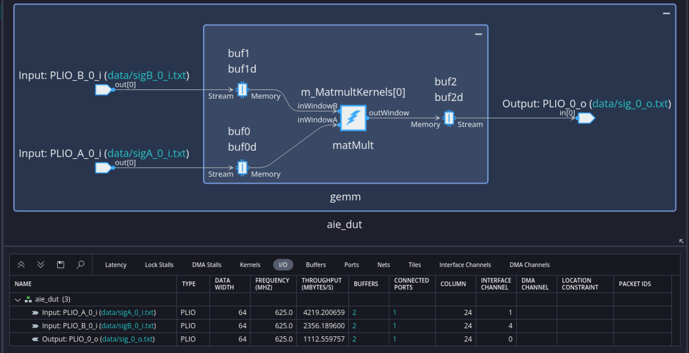

In the graph view, you see the kernels in the graph and the I/O ports of the graph. Select the `I/O` tabs as shown in the preceding figure. Observe the `Throughput` column in the I/O tab.
Click the `Array` view to can see the tile placement of the kernel, the memory used in tiles, and the programmable logic input/output PLIO connections.

Close the Vitis analyzer.

### Comparison of the Designs

| Design              | TP_CASC_LEN | TP_SSR | NPORT_I | NPORT_O | Throughput  |
|---------------------|-------------|--------|---------|---------|-------------|
| Design Variant 1    |      1      |    1   |    1    |    1    | 1112 MBPS   |


## Design Variant Two: 4-tile Design with TP_CASC_LEN=4

In design two, you use four tiles and adjust the parameters to accommodate this four-tile configuration. All parameters remain the same except `TP_CASC_LEN`.

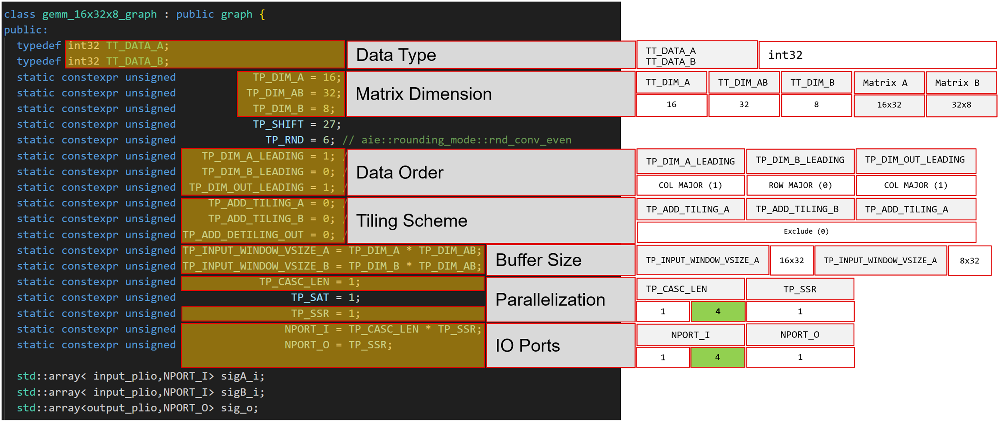

Because you use four AIE cores, set `TP_CASC_LEN` to **4** instead of **1**. You determine the number of input and output ports from the values of `TP_CASC_LEN` and `TP_SSR`.

For the input port **NPORT_I**, you calculate `TP_CASC_LEN * TP_SSR`, resulting in **four** input ports. For the output port **NPORT_N**, you set `TP_SSR`, which means there is **one** output port.

### Change the Project Path
Enter the following command to change the project path:
```
cd ../gemm_16x32x8_cascade
```
### Review the gemm_16x32x8_graph.h File
Open the ```gemm_16x32x8_graph.h``` file and review the code:

- Observe that `TP_CASC_LEN` is set to **4** instead of **1** from the previous design.  
- You determine the number of input and output ports from the `NPORT_I` and `NPORT_O` parameters, which depend on `TP_CASC_LEN` and `TP_SSR`.

Close the file after completing your review.

### Compile and Simulate the Design Variant 2: 4-tile design with TP_CASC_LEN=4
To understand the performance of the design, you can perform AI Engine emulation using the SystemC simulator by entering the following sequence of commands:

Enter the following command to compile the design for aiesim:
```
$ make clean
$ make all
$ make profile
$ make check_sim_output_aie
```

The average throughput for the IO ports is displayed at the end of AIE simulation.
The output port PLIO_0_o throughput is 2452.11 MB/s.

After running the last command (`make check_sim_output_aie`) to verify the results, the console should output as follows: 
```
Max err: 0
--- PASSED ---
```
### Analyze the Reports
Enter the following command to launch the Vitis Analyzer and review the reports.
```
$ make analyze
```
Select the `Graph` view.

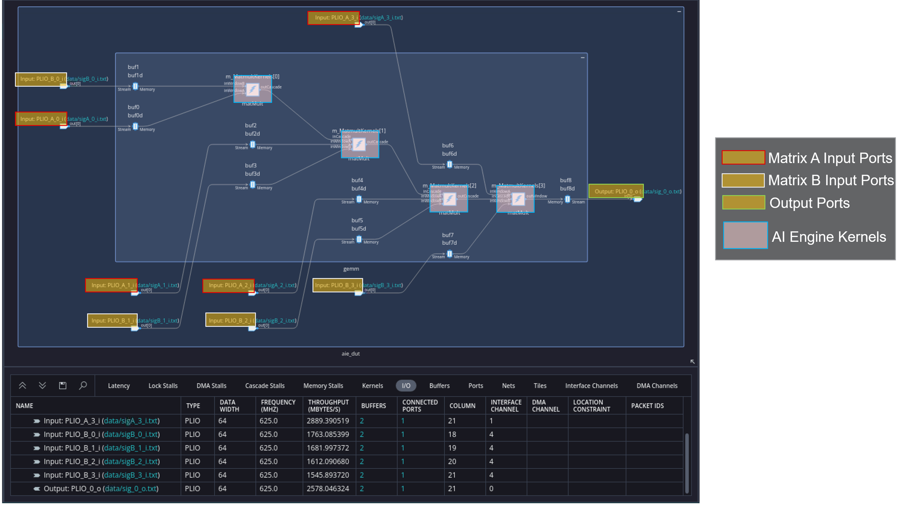

The Graph view displays the kernels within the graph along with the graph's input and output ports. It shows that four AI Engine kernels are implemented and four input ports are used in the design as the `TP_CASC_LEN` is set to **4**.

Select the I/O tabs as shown in the preceding figure. Observe the Throughput column in the I/O tab.

Click the `Array` view, where you can see the tile placement of the kernel, the memory used in tiles, and the PLIO connections.

Close the Vitis Analyzer.

### Comparison of the Designs

| Design              | TP_CASC_LEN | TP_SSR | NPORT_I | NPORT_O | Throughput  |
|---------------------|-------------|--------|---------|---------|-------------|
| Design Variant 1    |      1      |    1   |    1    |    1    | 1112 MBPS   |
| Design Variant 2    |      4      |    1   |    4    |    1    | 2447 MBPS   |

## Design Variant 3: 8-tile design with TP_CASC_LEN=4 and TP_SSR=2

In Design 3, the goal is to use eight tiles. You need to adjust the parameters to accommodate a eight-tile configuration.

All the parameters shown in the following figure are same except the `TP_SSR`.

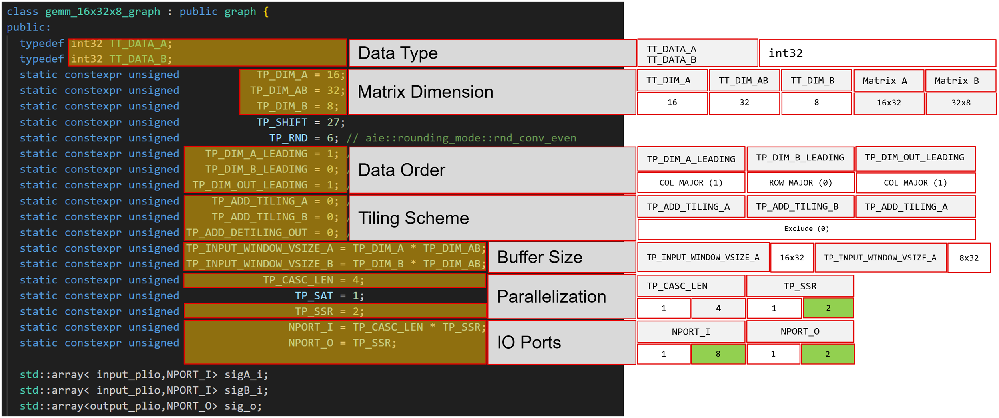

Because an eight AIE core is being used, set `TP_SSR` to **2** from **1** and the `TP_CASC_LEN` is the same as 4.

For the input port **NPORT_I**, it is calculated as `TP_CASC_LEN * TP_SSR`, resulting in **eight** input ports.

For the output port **NPORT_N**, it is set to `TP_SSR`, which means there will be **two** output ports.

### Change the Project Path
Enter the following command to change the project path:
```
cd ../gemm_16x32x8_cascade_ssr
```
### Review the gemm_16x32x8_graph.h file
Open the ```gemm_16x32x8_graph.h``` file and review the code:

- Observe the `TP_SSR` is set to **2** (from **1** in previous design).  
- The number of input and output ports is determined by the NPORT_I and NPORT_O parameters which is based on `TP_CASC_LEN` and `TP_SSR`.

Close the file after completing your review.

### Compile and Simulate the Design Variant 3: 8-tile design with TP_CASC_LEN=4 and TP_SSR=2
To understand the performance of the design, you can perform AI Engine emulation using the SystemC simulator by entering the following sequence of commands:

Enter the following command to compile the design for aiesim:
```
$ make clean
$ make all
$ make profile
$ make check_sim_output_aie
```

The average throughput for the IO ports is displayed at the end of AIE simulation.
The throughput for the output port is approximately 3815.2 MBYTES/S (for example, `PLIO_0_o + PLIO_1_o`).

After running the last command (`make check_sim_output_aie`) to verify the results, the console should output as follows: 
```
Max err: 0
--- PASSED ---
```

### Analyze the Reports
Enter the following command to launch the Vitis Analyzer and review the reports.
```
$ make analyze
```
Select the `Graph` view.

It shows that eight AI Engine kernels are implemented, eight input ports for each matrix input and two output ports are used in the design as the `TP_CASC_LEN` is set to **4** and `TP_SSR` is set to **2**.

The design implements `eight` AI Engine kernels, with `eight` input ports for each matrix input and `two` output ports. This configuration is due to `TP_CASC_LEN` being set to 4 and `TP_SSR` set to 2.

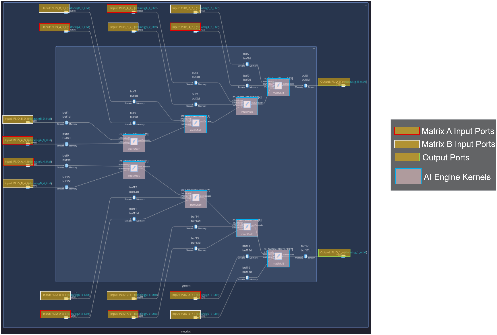

Select the I/O tabs and observe the Throughput column in the I/O tab.

Click the `Array` view, where you can see the tile placement of the kernel, the memory used in tiles, and the PLIO connections.

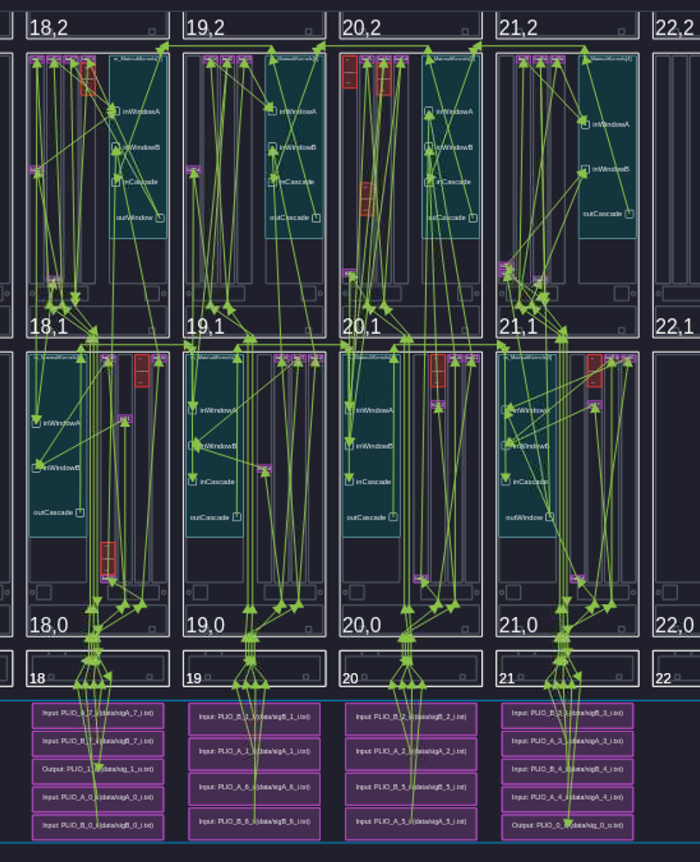

Close the Vitis Analyzer.

### Comparison of the Designs

| Design              | TP_CASC_LEN | TP_SSR | NPORT_I | NPORT_O | Throughput  |
|---------------------|-------------|--------|---------|---------|-------------|
| Design Variant 1    |      1      |    1   |    1    |    1    | 1112 MBPS   |
| Design Variant 2    |      4      |    1   |    4    |    1    | 2447 MBPS   |
| Design Variant 3    |      4      |    2   |    8    |    2    | 3770 MBPS   |


## Migrate the Design from AIE to AIE-ML and Evalute the Performance Differences

Migrating the design from AIE to AIE-ML is straightforward. The only modification required is to update the device name.

There are no changes needed in the code. AIE and AIE-ML are compatible, making it easy to migrate the design.

### Change the Project Path
Enter the following command to change the project path:
```
cd ../../aie-ml/gemm_16x32x8
```

### Review the gemm_16x32x8_graph.h file
Open the ```Makefile``` file and review the code. The only modification is the updated platform name.

```
PLATFORM_USE      := xilinx_vek280_base_202520_1
```

### Design Variant 1: Single Tile (AIE-ML)
Enter the following commands to compile, simulate the design for aiesim and verify the results:
```
$ make clean
$ make all
$ make profile
$ make check_sim_output_aie
```

The average throughput for the IO ports is displayed at the end of AIE simulation.
The throughput for the output port is approximately 1529 MB/s.

After running the last command (`make check_sim_output_aie`) to verify the results, the console should output as follows: 
```
Max err: 1
--- PASSED ---
```

### Analyze the Reports
Enter the following command to launch the Vitis Analyzer and review the reports.
```
$ make analyze
```
Select the `Graph` view and observe the kernel and I/O ports. Select the I/O tabs and observe the Throughput column in the I/O tab.

Click the `Array` view and observe the implementaion.

Close the Vitis Analyzer.

### Comparison of the Designs

| Design              | TP_CASC_LEN | TP_SSR | NPORT_I | NPORT_O | Throughput (AIE)|Throughput (AIE-ML)|
|---------------------|-------------|--------|---------|---------|-----------------|-------------------|
| Design Variant 1    |      1      |    1   |    1    |    1    | 1112 MBPS       | 1529 MBPS         |
| Design Variant 2    |      4      |    1   |    4    |    1    | 2447 MBPS       |                   |
| Design Variant 3    |      4      |    2   |    8    |    2    | 3770 MBPS       |                   |

## Design Variant 2: 4-tile Design with TP_CASC_LEN=4 (AIE-ML)

### Change the Project Path
Run the following command to change the project path:
```
cd ../gemm_16x32x8_cascade
```

Use these commands to compile the design for AIE simulation (`aiesim`) and verify results:
```
$ make clean
$ make all
$ make profile
$ make check_sim_output_aie
```

At the end of AIE simulation, review the average throughput for the I/O ports. The throughput for the output port is approximately 3029 MB/s.

The expected console output after running the `make check_sim_output_aie` command to verify the results is: 
```
Max err: 1
--- PASSED ---
```

### Analyze the Reports
Run the following command to launch the Vitis Analyzer and review the reports.
```
$ make analyze
```
Select the `Graph` view to observe the kernels and I/O ports. Select the `I/O` tabs to check the `Throughput` column.

Click the `Array` view to observe the implementaion.

Close the Vitis Analyzer after completing your review.

### Comparison of the Designs

| Design              | TP_CASC_LEN | TP_SSR | NPORT_I | NPORT_O | Throughput (AIE)|Throughput (AIE-ML)|
|---------------------|-------------|--------|---------|---------|-----------------|-------------------|
| Design Variant 1    |      1      |    1   |    1    |    1    | 1112 MBPS       | 1529 MBPS         |
| Design Variant 2    |      4      |    1   |    4    |    1    | 2447 MBPS       | 3033 MBPS         |
| Design Variant 3    |      4      |    2   |    8    |    2    | 3770 MBPS       |                   |

## Design Variant 3: 8-tile Design with TP_CASC_LEN=4 and TP_SSR=2 (AIE-ML)

### Change the Project Path
Run the following command to change the project path:
```
cd ../gemm_16x32x8_cascade_ssr
```

Use these commands to compile the design for AIE simulation (`aiesim`) and verfiy results:
```
$ make clean
$ make all
$ make profile
$ make check_sim_output_aie
```

At simulation completion, review the average throughput for the I/O ports. The throughput for the combined output ports (`PLIO_0_o + PLIO_1_o`) is approximately 6702 MB/s.

The expected console output after running the `make check_sim_output_aie` command to verify the results is:
```
Max err: 1
--- PASSED ---
```

### Analyze the Reports
Enter the following command to launch the Vitis Analyzer and review the reports.
```
$ make analyze
```
Select the `Graph` view to observe the kernels and I/O ports. Select the `I/O` tabs to check the `Throughput` column.

Click the `Array` view to observe the implementaion.

Close the Vitis Analyzer after completing your review.

### Comparison of the Designs

| Design              | TP_CASC_LEN | TP_SSR | NPORT_I | NPORT_O | Throughput (AIE)|Throughput (AIE-ML)|
|---------------------|-------------|--------|---------|---------|-----------------|-------------------|
| Design Variant 1    |      1      |    1   |    1    |    1    | 1112 MB/S       | 1529 MB/S         |
| Design Variant 2    |      4      |    1   |    4    |    1    | 2447 MB/S       | 3033 MB/S         |
| Design Variant 3    |      4      |    2   |    8    |    2    | 3770 MB/S       | 6754 MB/S         |


From the table, for **Design Variant 3**, on the AIE-ML architecture runs approximately **1.7x** faster than the AIE architecture.

**Why does the AIE-ML architecture outperform the AIE architecture?**

The **AIE** architecture supports **eight MACs** for ``int32 x int32`` operations. The **AIE-ML** architecture supports ***32 MACs*** for ``int32 x int16`` operations. However, for ``int32 x int32`` AIE‑ML requires two operations, resulting in **16 MACs total**. This delivers a theoretical 2x performance gain. In simulation (emulation), you observe approximately 1.7× improvement.

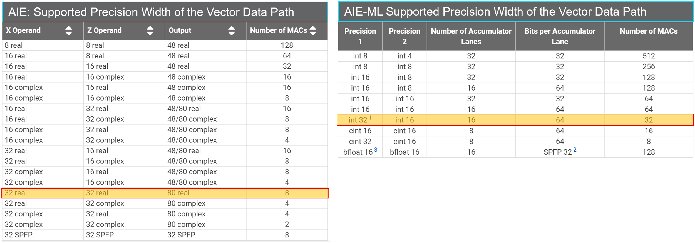

TThe gain comes from having more multipliers in AIE‑ML and using mmul() intrinsics optimized for matrix multiplication.

## Conclusion

In this tutorial, you learned how to:
- Identify GEMM parameters and understand their usage.
- Configure GEMM parameters according to your specific design requirements.
- Implement and test three designs with different configurations.
- Migrate the design from AIE to AIE-ML architecture.
- Compare AIE and AIE-ML performance across all design variants.


<hr class="sphinxhide"></hr>

<p class="sphinxhide" align="center"><sub>Copyright © 2021–2026 Advanced Micro Devices, Inc.</sub></p>

<p class="sphinxhide" align="center"><sup><a href="https://www.amd.com/en/corporate/copyright">Terms and Conditions</a></sup></p>
