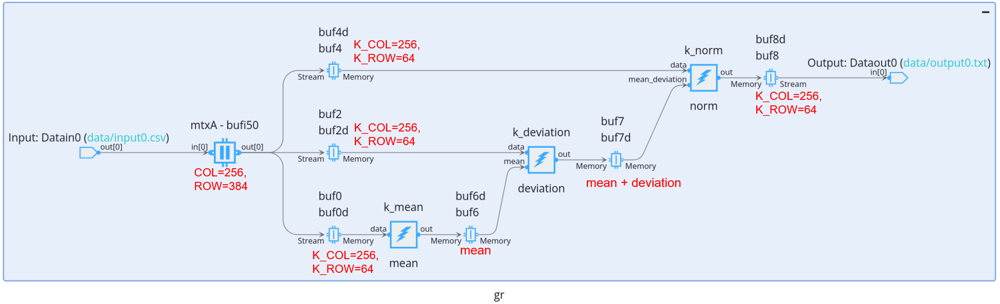
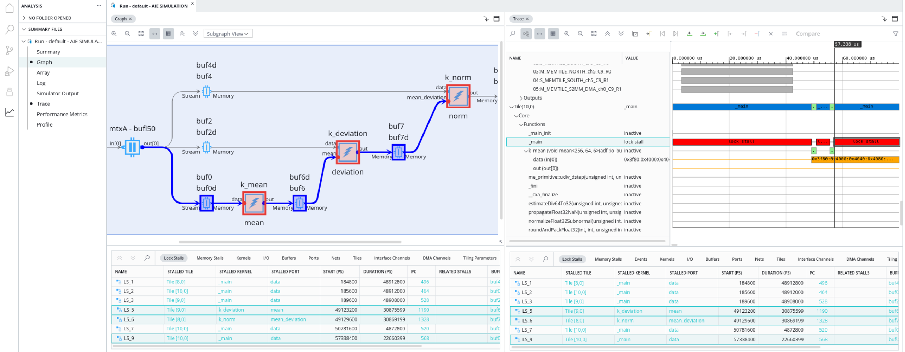
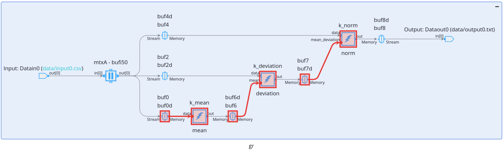
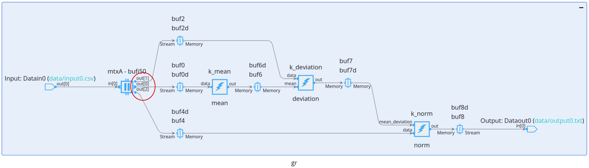
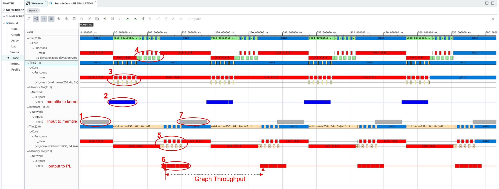
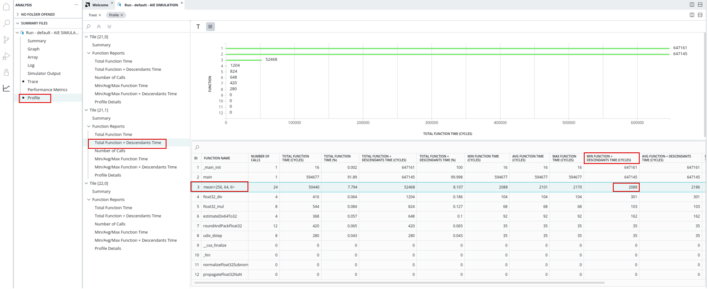
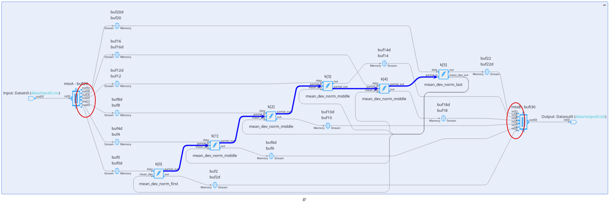
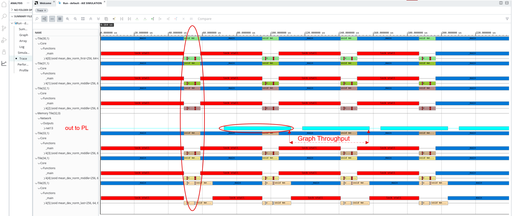
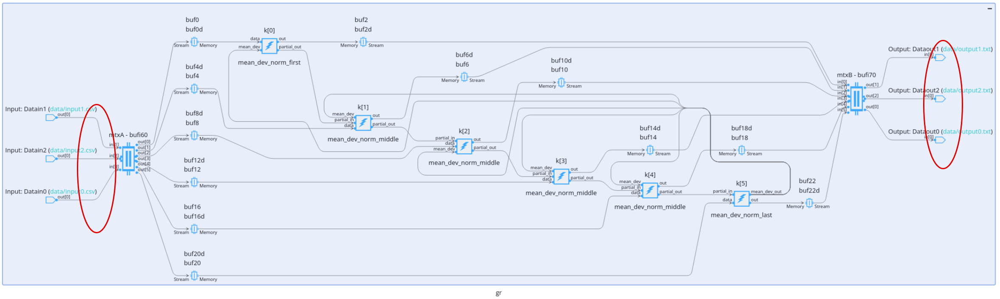
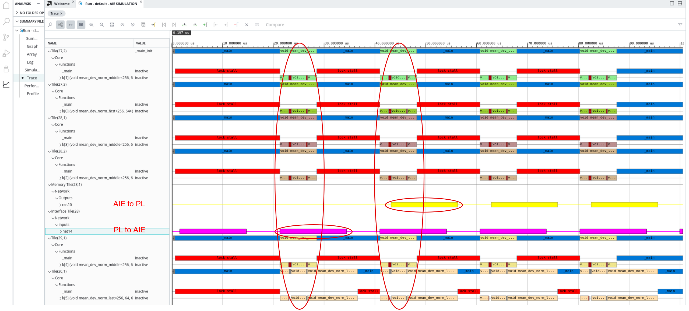

<table class="sphinxhide" width="100%">
 <tr width="100%">
    <td align="center"><h1>AIE-ML Development</h1>
    <a href="https://www.xilinx.com/products/design-tools/vitis.html">See AMD Vitis™ Development Environment on xilinx.com</br></a>
    <a href="https://www.xilinx.com/products/design-tools/vitis/vitis-ai.html">See Vitis AI Development Environment on xilinx.com</a>
    </td>
 </tr>
</table>

# AIE-ML Performance Analysis Tutorial

***Version: Vitis 2024.1***

This tutorial introduces you on design partitioning into AIE-ML device. By various performance analysis techniques introduced, the design is optimized. The performance is also verified in hardware in each optimization step.

>**IMPORTANT**: Before beginning the tutorial make sure you have installed the Vitis software platform 2024.1. The Vitis release includes all the embedded base platforms including the VEK280 ES1 base platform that is used in this tutorial. In addition, ensure that you have downloaded the Common Images for Embedded Vitis Platforms from [this link](https://www.xilinx.com/support/download/index.html/content/xilinx/en/downloadNav/embedded-platforms.html).

The ‘common image’ package contains a prebuilt Linux kernel and root file system that can be used with the AMD Versal™ board for embedded design development using the Vitis tools.

Before starting this tutorial, run the following steps:

1. Go to the directory where you have unzipped the Versal Common Image package.
2. In a Bash shell, run the `/**Common Images Dir**/xilinx-versal-common-v2024.1/environment-setup-cortexa72-cortexa53-xilinx-linux` script. This script sets up the SDKTARGETSYSROOT and CXX variables. If the script is not present, you must run the `/**Common Images Dir**/xilinx-versal-common-v2024.1/sdk.sh`.
3. Set up your ROOTFS and IMAGE to point to the `rootfs.ext4` and Image files located in the `/**Common Images Dir**/xilinx-versal-common-v2024.1` directory.
4. Set up your PLATFORM_REPO_PATHS environment variable to `$XILINX_VITIS/base_platforms`.

This tutorial targets VEK280 ES1 board for 2024.1 version.

## Objectives

After completing this tutorial, you will be able to:

* Construct AI Engine graph and use shared buffers (for AIE-ML memory tiles)
* Use simulation to do hang analysis
* Use simulation and Vitis Analyzer to do profiling and performance analysis
* Learn the concept of design partition and optimization for AIE-ML device

## Target Application Introduction

This tutorial targets z-score normalization that scales elements of a frame, making the frame output have $\mu=0$ and $\sigma=1$ distributions (mean=0, deviation=1).

Assume the input frame is a `COL * ROW` matrix (data is stored column first). For each element in a frame, it computes the corresponding element as:

$$ {x^{'}}={\frac{x-\mu}{\sigma}} $$

Where:

$$ {\mu}=\sum_{i=0}^{ROW}\sum_{i=0}^{COL}{x} / {(ROW*COL)} $$

$$\sigma=\sqrt{{\sum_{i=0}^{ROW}\sum_{i=0}^{COL}{{(x-\mu)}^2}} / {(ROW\*COL-1)}} \approx \sqrt{\sum_{i=0}^{ROW}\sum_{i=0}^{COL}{{(x-\mu)}^2} / {(ROW*COL)}} $$

For designs in the tutorial, following specifications are chosen:

* COL=256
* ROW=384
* Data type: bfloat16

## Steps - Version 1

The input frame size is `256*384*2=192 KB`. One memtile is 512 KB, but AIE-ML tile memory has only 64 KB. The input frame is able to be put into a memtile, but not an AIE-ML tile memory. And the same frame data is first to be used to compute the "mean", and then "deviation", and "normalization" last.

So, based on the analysis, a design is constructed: [Normalization Version 1](./normalization_v1)



The data is transferred to a memtile, and multicasted to three kernels `mean`, `deviation` and `norm`. Kernel `mean` calculates the mean value and sends it to `deviation`. Kernel `deviation` calculates the deviation value and sends it with the mean value to `norm`. Kernel `norm` will generates the normalization value and sends them out.

Look at [Normalization Version 1 Graph Code](./normalization_v1/aie/graph.h):

* It defines frame sizes: COL=256, ROW=384 (192 KB), and kernel buffer input size: K_COL=256, K_ROW=64 (32 KB, maximum size for PING PONG buffers in a tile):

  ```
  const int COL=256;
  const int ROW=384;
  const int K_COL=256;
  const int K_ROW=64;
  ```

* The memtile data is transferred to AIE tile memory via multiple iterations of the kernels. So, the repetition counts of the kernels are `ROW*COL/K_ROW/K_COL = 6`:

  ```
  repetition_count(k_mean)=ROW*COL/K_ROW/K_COL;
  repetition_count(k_deviation)=ROW*COL/K_ROW/K_COL;
  repetition_count(k_norm)=ROW*COL/K_ROW/K_COL;
  ```

* The write access and read access of the memtile is linear. For tiling parameters usage, you may refer to [Tiling Parameters Specification](https://docs.xilinx.com/r/en-US/ug1603-ai-engine-ml-kernel-coding/Tiling-Parameters-Specification).

  ```
  mtxA = shared_buffer<bfloat16>::create({COL,ROW}, 1, 1);
  write_access(mtxA.in[0]) = tiling({.buffer_dimension={COL,ROW}, .tiling_dimension={COL,ROW}, .offset={0,0} });
  read_access(mtxA.out[0]) = tiling({.buffer_dimension={COL,ROW}, .tiling_dimension={COL,ROW}, .offset={0,0} });
  ```

  Look at the kernel `mean` code [Normalization Version 1 Mean Kernel Code](./normalization_v1/aie/mean.cc):

* The kernel will generate the mean value after 6 iterations of the kernel. So, the output buffer of `mean` is defined as an asynchronous buffer `output_async_buffer`. 
* `__attribute__((noinline))` is added to the kernel function to improve debuggability.

  ```
  template<int COL, int ROW, int REPEAT>
  __attribute__((noinline)) void mean(input_buffer<bfloat16> & __restrict data, output_async_buffer<bfloat16> & __restrict out){
  	......
  	if(iteration==REPEAT){
  		out.acquire();
  		bfloat16* pout=out.data();
  		*pout=(bfloat16)(aie::reduce_add(acc.to_vector<float>()) / ROW / COL / REPEAT);
  		out.release();
  	......
  }
  ```

A similar concept applies to kernel `deviation` ([Normalization Version 1 Kernel Deviation Code](./normalization_v1/aie/deviation.cc)) and `norm` ([Normalization Version 1 Kernel Norm Code](./normalization_v1/aie/norm.cc)).

However, the design will hang. Hang detection is supported via multiple design flows. Each has its benefits:

1. X86 Simulation is quick in the flow. Run following make command:

   ```
   make x86sim
   ```

   The log of X86 simulation:

   ```
   x86simulator: Detected deadlock
   Deadlock diagnosis:
     1. main() is waiting on kernel 'gr.k_mean'
        because Node 'gr.k_mean' is blocked while reading port 'gr.k_mean.in[0]'
     2. Node 'gr.k_mean' is blocked while reading port 'gr.k_mean.in[0]'
        because Data unavailable from port 'gr.k_mean.in[0]'
     3. Data unavailable from port 'gr.k_mean.in[0]'
        because Node 'sharedBuf_i5_out0' is blocked while writing port 'gr.k_deviation.in[0]'
     4. Node 'sharedBuf_i5_out0' is blocked while writing port 'gr.k_deviation.in[0]'
        because Unable to write port 'gr.mtxA.out[0]'
     5. Unable to write port 'gr.mtxA.out[0]'
        because Node 'gr.k_deviation' is blocked while reading port 'gr.k_mean.out[0]'
     6. Node 'gr.k_deviation' is blocked while reading port 'gr.k_mean.out[0]'
        because Data unavailable from port 'gr.k_deviation.in[1]'
     7. Data unavailable from port 'gr.k_deviation.in[1]'
        because Node 'gr.k_mean' is blocked while reading port 'gr.k_mean.in[0]'
   ```

2. AIE Simulation can give a visualization of the stalls inside the graph. Run following make command:

   ```
   make aiesim
   ```

   And Refer to [Lock Stall Analysis](https://docs.xilinx.com/r/en-US/ug1076-ai-engine-environment/Lock-Stall-Analysis) for steps to analyze the root cause of the hang. The stalls of the kernels are highlighted as:

   

3. If the hang is not shown in simulation, but only in hardware, the AIE status report can be used for analysis. Run the following make command to build the SD card image:

   ```
   make package TARGET=hw
   ```

   And refer to [AIE status report](https://docs.xilinx.com/r/en-US/ug1076-ai-engine-environment/Analyzing-AI-Engine-Status-in-Hardware) for steps to analyze the root cause of the hang. The status in hardware is like:

   

From the  above hang status in HW, you can see how each kernel is stalled. The kernel `mean` cannot generate "mean” because it does not receive 6 input buffers. Memtile cannot multicast all the data to multiple kernels, because `deviation` and `norm` are only capable to store 2 input buffers and then stalled.

To break down the dependency of the input data of the kernels, it's able to utilize 3 different channels of the memtile. See the solution in next version.

## Steps - Version 2

Different channels of memtile can transfer data to different kernels independently. Three channels of the memtile are used to resolve the hang issue.

An improved version is constructed -- [Normalization Version 2](./normalization_v2)



Look at [Normalization Version 2 Graph Code](./normalization_v2/aie/graph.h):

The memtile has 3 outputs. All the access patterns are same:

```
mtxA = shared_buffer<bfloat16>::create({COL,ROW}, 1, 3);
write_access(mtxA.in[0]) = tiling({.buffer_dimension={COL,ROW}, .tiling_dimension={COL,ROW}, .offset={0,0} });
read_access(mtxA.out[0]) = tiling({.buffer_dimension={COL,ROW}, .tiling_dimension={COL,ROW}, .offset={0,0} });
read_access(mtxA.out[1]) = tiling({.buffer_dimension={COL,ROW}, .tiling_dimension={COL,ROW}, .offset={0,0} });
read_access(mtxA.out[2]) = tiling({.buffer_dimension={COL,ROW}, .tiling_dimension={COL,ROW}, .offset={0,0} });
```

Run following command to finish AIE simulation:

```
make aiesim
```

Open the simulation result by `vitis_analyzer aiesimulator_output/default.aierun_summary`, and then click `Trace` to open trace view. In trace view, by "Filter" button, the kernels and some related nets can be grouped together to have a comprehensive view of application execution:



Some observations from the above running result:

* Point 3 shows that there are stalls between each kernel's execution. This indicates that the data transfer to kernel is slower than kernel execution. Similarly, point 4 and 5 show that the data transfer to kernels is slower than kernels' execution.

* Point 3, 4 and 5 shows that the kernels are executing in series.

* Point 2 and 3 shows that the data transfer to kernel can be in parallel with kernel execution. Similarly, point 5 and 6 show that the data transfer to output can be in parallel with kernel execution.

* Graph throughput can be defined as how much time to complete an iteration of the graph. Each output buffer of a kernel to PLIO have a `TLAST` indication in the simulation output file. This can be utilized to calculate the finish time of graph execution. Since each graph iteration has 6 kernel output buffers, the graph execution time can be from 1st `TLAST` to 7th `TLAST`. See point 6 as an example. Following are example timestamps for 1st `TLAST` to 7th `TLAST`:

```
T 128198400 ps
TLAST
......
T 272822400 ps
TLAST
```

So, the graph throughput via simulation can be computed as:

```
256*384*2 (Bytes) / (272822400-128198400)ps = 1359.44 MB/s
```

The kernel execution time can be profiled by multiple ways, for example:

1. By utilizing the tile counter in the kernel code: [Profiling Kernel Code](https://docs.xilinx.com/r/en-US/ug1603-ai-engine-ml-kernel-coding/Profiling-Kernel-Code)
2. Use `--profile` option of AIE simulation to get the function time:



> **TIP**: `Total Function Time` includes only the function execution time, but not its sub-functions. `Total Function Time + Descendants Time` includes the function and its sub-functions' execution time. Both include stall time in function execution.

The design can run through hardware flow. The PL kernels are designed for performance testing purpose. They can just send data and receive data at maximum throughput without affecting AI Engine performance. To build for HW:

```
make package TARGET=hw
```

To run in HW:

```
./host.exe a.xclbin 9999
```

The result might be similar to the following:

```
Throughput of the graph:1344.51M Bytes/s
```

Following table summarizes the profiling results of kernels and the graph:

Kernel or graph | Cycle or throughput
------------ | -------------
mean | 2088 (cycles)
deviation | 4921 (cycles)
norm | 3296 (cycles)
Kernel Data Transfer | 8192 (cycles/iteration)
Graph Throughput (sim) | 1359.44 MB/s
Graph Throughput (HW) | 1344.51 MB/s

By above trace analysis and profiling results, the kernels can be put into a tile, but replicated to improve the application performance. See how optimization can be done in next version.

## Steps -- Version 3

In this version, kernels `mean`, `deviation` and `norm` are combined into a kernel, but the kernel is replicated. Each kernel deals with 1/6 of the data, and they are cascaded with partial accumulation results. The last kernel will compute the "mean" and "deviation" and multicast them back to every kernel. Then, every kernel computes the "normalization" and sends the results to another memtile to combine the results.

The design is in [Normalization Version 3](./normalization_v3)



Look at [Normalization Version 3 Graph Code](./normalization_v3/aie/graph.h):

* The memtiles have 6 inputs or outputs. 1/6 of the data are accessed via the `offset` settings:

```
const int NUM=6;
mtxA = shared_buffer<bfloat16>::create({COL,ROW}, 1, NUM);
mtxB = shared_buffer<bfloat16>::create({COL,ROW}, NUM, 1);
write_access(mtxA.in[0]) = tiling({.buffer_dimension={COL,ROW}, .tiling_dimension={COL,ROW}, .offset={0,0} });
read_access(mtxB.out[0]) = tiling({.buffer_dimension={COL,ROW}, .tiling_dimension={COL,ROW}, .offset={0,0} });
for(int i=0;i<NUM;i++){
	read_access(mtxA.out[i]) = tiling({.buffer_dimension={COL,ROW}, .tiling_dimension={K_COL,K_ROW}, .offset={0,K_ROW*i} });
	write_access(mtxB.in[i]) = tiling({.buffer_dimension={COL,ROW}, .tiling_dimension={K_COL,K_ROW}, .offset={0,K_ROW*i} });
}
```

Run following command to finish AIE simulation:

```
make aiesim
```

Open the simulation result by `vitis_analyzer aiesimulator_output/default.aierun_summary`, and then click `Trace` to open trace view. In trace view, by "Filter" button, the kernels and some related nets can be grouped together to have a comprehensive view of application execution:



Some observations from above running result:

* Kernel execution is in parallel. The last kernel has an additional summarization task. So, it takes more time than other kernels. 

* The data transferring from memtile to PL takes a much longer time than the kernels' execution time. Similar for PL input data to memtile.

* The average graph completion time can be obtained from 1st `TLAST` to 2nd `TLAST` in simulation result:

  ```
  T 111920 ns
  TLAST
  ......
  T 157808 ns
  TLAST
  ```

* The graph throughput can be computed as:

  ```
  256*384*2 (Bytes) / (157808-111920)ns = 4284.52 MB/s
  ```

The design can run through hardware flow. The PL kernels are designed for performance testing purpose. They can just send data and receive data at maximum throughput without affecting AI Engine performance. To build for HW:

```
make package TARGET=hw
```

To run in HW:

```
./host.exe a.xclbin 9999
```

The result can be like:

```
Throughput of the graph:4137.26M Bytes/s
```

Following table summarizes the profiling results of kernels and the graph:

Kernel or graph | Cycle or throughput
------------ | -------------
mean_dev_norm_first | 12113 (cycles)
mean_dev_norm_middle | 12106 (cycles)
mean_dev_norm_last | 21104 (cycles)
Kernel Data Transfer | 8192 (cycles/iteration)
Graph Throughput (sim) | 4284.52 MB/s
Graph Throughput (HW) | 4137.26 MB/s

By above trace analysis and profiling results, the largest bottleneck should be data transferring from or to PL. If the system allows more PL ports to be used, multiple PL ports can transfer data together to improve the system performance. See next version for this optimization.

## Steps - Version 4

If the system allows, the data is split into 3 portions that are to be transferred via 3 ports. See the design in [Normalization Version 4](./normalization_v4):



Look at the memtile settings in [Normalization Version 4 Graph Code](./normalization_v4/aie/graph.h):

```
const int PLIO_NUM=3;
mtxA = shared_buffer<bfloat16>::create({COL,ROW}, PLIO_NUM, NUM);
mtxB = shared_buffer<bfloat16>::create({COL,ROW}, NUM, PLIO_NUM);
for(int i=0;i<PLIO_NUM;i++){
	write_access(mtxA.in[i]) = tiling({.buffer_dimension={COL,ROW}, .tiling_dimension={COL,ROW/PLIO_NUM}, .offset={0,ROW/PLIO_NUM*i} });
	read_access(mtxB.out[i]) = tiling({.buffer_dimension={COL,ROW}, .tiling_dimension={COL,ROW/PLIO_NUM}, .offset={0,ROW/PLIO_NUM*i} });
}
```

Run following command to finish AIE simulation:

```
make aiesim
```

Open the simulation result by `vitis_analyzer aiesimulator_output/default.aierun_summary`, and then click `Trace` to open trace view. In trace view, by "Filter" button, the kernels and some related nets can be grouped together to have a comprehensive view of application execution:



Some observations from above running result:

* Kernels' executions are in parallel with the input and output data transferring.

* The last kernel takes more time than other kernels.

* The average graph completion time can be obtained from the  1st `TLAST` to 2nd `TLAST` in one of the simulation outputs:

  ```
  T 58873600 ps
  TLAST
  ......
  T 78547200 ps
  TLAST
  ```

* The graph throughput can be computed as:

  ```
  256*384*2 (Bytes) / (78547200-58873600)ps = 9993.49 MB/s
  ```

The design can run through hardware flow. The PL kernels are designed for performance testing purpose. They can just send data and receive data at maximum throughput without affecting AI Engine performance. To build for HW:

```
make package TARGET=hw
```

To run in HW:

```
./host.exe a.xclbin 9999
```

The result might be similar to the following:

```
Throughput of the graph:9728.82M Bytes/s
```

Following table summarizes the profiling results of kernels and the graph:

Kernel or graph | Cycle or throughput
------------ | -------------
mean_dev_norm_first | 9056 (cycles)
mean_dev_norm_middle | 9045 (cycles)
mean_dev_norm_last | 19113 (cycles)
Kernel Data Transfer | 8192 (cycles/iteration)
Graph Throughput (sim) | 9993.49 MB/s
Graph Throughput (HW) | 9728.82 MB/s


> **NOTE**: The kernel performance is improved because default xlopt level is used in version 4. In previous versions, `--xlopt=0` is added to improve debuggability.

### Conclusion

In this tutorial, you learned about multiple aspects of AIE-ML designing:

* Design planning with memtile
* Hang detection and profiling of the design
* Design optimization with performance analysis

### Support

GitHub issues will be used for tracking requests and bugs. For questions go to [forums](http://forums.xilinx.com/).

<p class="sphinxhide" align="center"><sub>Copyright © 2020–2023 Advanced Micro Devices, Inc</sub></p>

<p class="sphinxhide" align="center"><sup><a href="https://www.amd.com/en/corporate/copyright">Terms and Conditions</a></sup></p>
