<!--
Copyright (C) 2024, Advanced Micro Devices, Inc. All rights reserved.
SPDX-License-Identifier: MIT
Author: Faisal El-Shabani
-->
<table class="sphinxhide" width="100%">
   <tr width="100%">
      <td align="center">
         <picture>
            <source media="(prefers-color-scheme: dark)" srcset="https://raw.githubusercontent.com/Xilinx/Image-Collateral/main/logo-white-text.png" width="30%">
            
         </picture>
         <h1>AI Engine Development</h1>
         <a href="https://www.amd.com/en/products/software/adaptive-socs-and-fpgas/vitis.html">Refer to Vitis™ Development Environment on amd.com</br></a>
         <a href="https://www.amd.com/en/products/software/vitis-ai.html">Refer to Vitis™ AI Development Environment on amd.com</a>
      </td>
   </tr>
</table>

# Radio-ML on AMD Versal™ AI Edge Series Gen 2 (AIE-ML v2)

***Version: Vitis 2026.1***

## Table of Contents

1. [Introduction](#introduction)
2. [Jupyter Notebook Model](#jupyter-notebook-model)
3. [AIE-ML v2 Inference Solution](#aie-ml-v2-inference-solution)
4. [Individual Layer Designs](#individual-layer-designs)
5. [Design Resources](#design-resources)
6. [Build and Run Design](#build-and-run-design)
7. [Summary](#summary)

[References](#references)

[Support](#support)

[License](#license)

## Introduction

This tutorial implements a Convolutional Neural Network classifier on [AMD Versal™ AI Edge Series Gen 2](https://www.amd.com/en/products/adaptive-socs-and-fpgas/versal/gen2/ai-edge-series.html) for radio signal classification.

The model architecture follows [[1]]. This tutorial trains the model on DeepSig Dataset 2018.01A [[2]]. This tutorial example shows a number of key topics fundamental to custom coding machine learning designs using the AIE API including:

* Using multi-node matrix multiply intrinsics to vectorize ConvNet layer compute workloads
* Using 2D addressing patterns of memory tiles to access layer I/O in the order required for consumption by the compute
* Using zero-padding capability of the memory tiles when feeding input data to ConvNet layers to preserve the original input size
* Using async RTPs to send network weights from host at startup and using local tile memory for storing them
* Using custom coding to implement [SeLU activation function](https://www.tensorflow.org/api_docs/python/tf/keras/activations/selu)

### Virtual Python Environment Setup

This tutorial implements computer models of the Radio-ML ConvNet in Python using Jupyter Notebooks. This is best managed using a Python virtual environment.

The first step of this tutorial involves setting up such a virtual environment with the required versions of all the associated open source Python packages.

The top level Makefile of this tutorial builds the Python virtual environment based on a script `create_venv.sh`. It creates the environment and then loads a set of specific versions of all required Python packages.

To create this Python virtual environment, run the following code:

```bash
% make my-venv
% source my-venv/bin/activate
% python --version
```

This creates a folder `my-venv` in the top-level folder. This folder contains all the required packages for Jupyter Notebooks, TensorFlow, matplotlib, pydot, and bfloat16 (including all dependencies) required by the tutorial.

The second command activates the Python environment. The third command displays the version of Python used to create the virtual environment. This tutorial is tested using Python 3.12.6.

## Jupyter Notebook Model

The first step of this tutorial is to build a computer model of the Radio-ML ConvNet modulation classifier and train it to obtain a set of weights for inference. The tutorial provides the full Jupyter Notebook of this model in [radio-ml-model.ipynb](radio-ml-model.ipynb).

Begin by downloading the DeepSig Dataset 2018.01A [[2]] and set environment variable RADIOML_DATA to point to dataset.

To run the notebook, execute the following command:

```bash
% jupyter-notebook radio-ml-model.ipynb
```

The Keras model for the Radio-ML ConvNet modulation classifier attempts to follow [[1]] closely. The following Python code defines the model:

```python
    inputs = keras.Input(shape=(1024,2),name="input")
    x1 = Conv1D(filters=64,kernel_size=7,strides=1,padding="same",name="conv1D_w1",activation='relu')(inputs)
    x2 = MaxPooling1D(pool_size=2,strides=2,padding="valid",name="max_pool1d_w2")(x1)
    x3 = Conv1D(filters=64,kernel_size=7,strides=1,padding="same",name="conv1D_w3",activation='relu')(x2)
    x4 = MaxPooling1D(pool_size=2,strides=2,padding="valid",name="max_pool1d_w4")(x3)
    x5 = Conv1D(filters=64,kernel_size=7,strides=1,padding="same",name="conv1D_w5",activation='relu')(x4)
    x6 = MaxPooling1D(pool_size=2,strides=2,padding="valid",name="max_pool1d_w6")(x5)
    x7 = Conv1D(filters=64,kernel_size=7,strides=1,padding="same",name="conv1D_w7",activation='relu')(x6)
    x8 = MaxPooling1D(pool_size=2,strides=2,padding="valid",name="max_pool1d_w8")(x7)
    x9 = Conv1D(filters=64,kernel_size=7,strides=1,padding="same",name="conv1D_w9",activation='relu')(x8)
    x10 = MaxPooling1D(pool_size=2,strides=2,padding="valid",name="max_pool1d_w10")(x9)
    x11 = Conv1D(filters=64,kernel_size=7,strides=1,padding="same",name="conv1D_w11",activation='relu')(x10)
    x12 = MaxPooling1D(pool_size=2,strides=2,padding="valid",name="max_pool1d_w12")(x11)
    x13 = Conv1D(filters=64,kernel_size=7,strides=1,padding="same",name="conv1D_w13",activation='relu')(x12)
    x14 = MaxPooling1D(pool_size=2,strides=2,padding="valid",name="MaxPool1D_w14")(x13)
    x15 = Flatten(name="flatten_w15")(x14)
    x16 = Dense(128, activation="selu",name="dense_w16")(x15)
    x18 = Dense(128, activation="selu",name="dense_w17")(x16)
    outputs = Dense(24,activation="softmax",name="dense_w18")(x18)
    model = keras.Model(inputs=inputs,outputs=outputs)
    optimizer = keras.optimizers.RMSprop(learning_rate=0.0005)
    model.compile(optimizer=optimizer,
                  loss="categorical_crossentropy",
                  metrics=["accuracy"])
```

The network contains eighteen layers:

* The first layer is a 1D convolutional layer with two input nodes (corresponding to I and Q paths) and 64 compute nodes with a kernel_size=7. Correspondingly, the number multiplicative weights is 64 x 7 x 2 = 896 and the number of additive biases = 64. The number of input I/Q samples is 1024, corresponding to the incoming frame size. The number of output samples is 1024 x 64.
* The second layer implements a 1D max-pooling layer that performs a decimation-by-two in the samples dimension. There are no weights associated with this layer. All the remaining max-pooling layers perform similar functionality.
* The third layer implements another 1D convolutional layer with 64 input and compute nodes with a kernel_size=7 and applying a ReLU activation function at its output. This layer involves a total of 64 x 64 x 7 = 28,672 multiplicative weights and 64 additive biases weights. All the remaining 1D convolutional layer perform similar functionality.
* The fifteenth layer performs a flattening function, collapsing the total of 8 x 64 = 512 connections into a single 1D bus.
* The sixteenth layer consists of a fully connected dense network of 512 x 128 = 65,536 multiplicative weights and 128 additive biases and applies a SeLU activation function at its output.
* The seventeenth layer consists of a fully connected dense network of 128 x 128 = 16,384 multiplicative weights and 128 additive biases and applies a SeLU activation function at its output.
* The eighteenth layer consists of a fully connected dense network of 128 x 24 = 3,072 multiplicative weights and 128 additive biases and applies a softmax activation function at its output.

The total number of parameters for this network is 258,648. The following diagram summarizes the layers of the Radio-ML ConvNet.

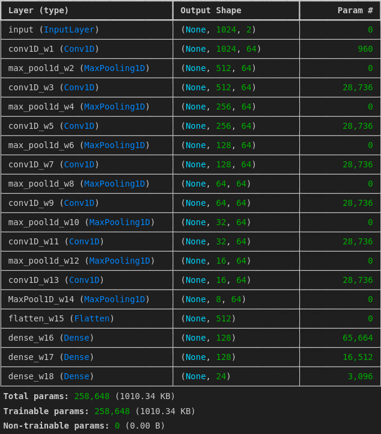

### Import the Radio-ML Database

You must train the Radio-ML ConvNet modulation classifier on the Radio-ML database. This database contains 24 modulation types, each with 26 Signal-to-Noise Ratio (SNR) levels, each with 4k frames, each containing 1024 I/Q samples.

```
data_file = os.environ["RADIOML_DATA"] + 'GOLD_XYZ_OSC.0001_1024.hdf5'
file_handle = h5.File(data_file,'r')

myData = file_handle['X'][:]  #1024x2 samples 
myMods = file_handle['Y'][:]  #mods 
mySNRs = file_handle['Z'][:]  #snrs  

modulation_classes = json.load(open(os.environ["RADIOML_DATA"] + "classes-fixed.json", 'r'))
```

Examine the dataset by plotting a few samples for all modulation types at the highest SNR.

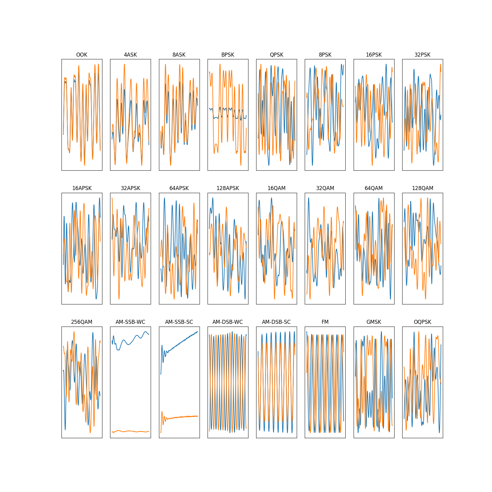

### Split the Training and Testing Data

This tutorial splits the dataset into training and testing data using scikit-learn's [train_test_split](https://scikit-learn.org/stable/modules/generated/sklearn.model_selection.train_test_split.html) with a ratio of 20% of the dataset for testing.

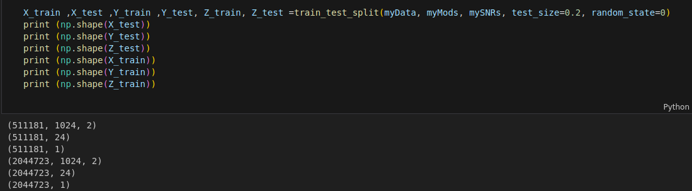

### Training the Model

The Keras framework provides built-in functions for training and testing the model. This tutorial uses an EarlyStopping callback that stops training when the monitored metric stops improving for five epochs.

```
callback = keras.callbacks.EarlyStopping(monitor='val_loss',
                                         restore_best_weights=True,
                                         patience=10)

history = model.fit(X_train,Y_train,epochs=100,validation_data=(X_test, Y_test),batch_size=1024,callbacks=[callback])
```

The following plots show the accuracy and the loss of the model against the training versus test data.

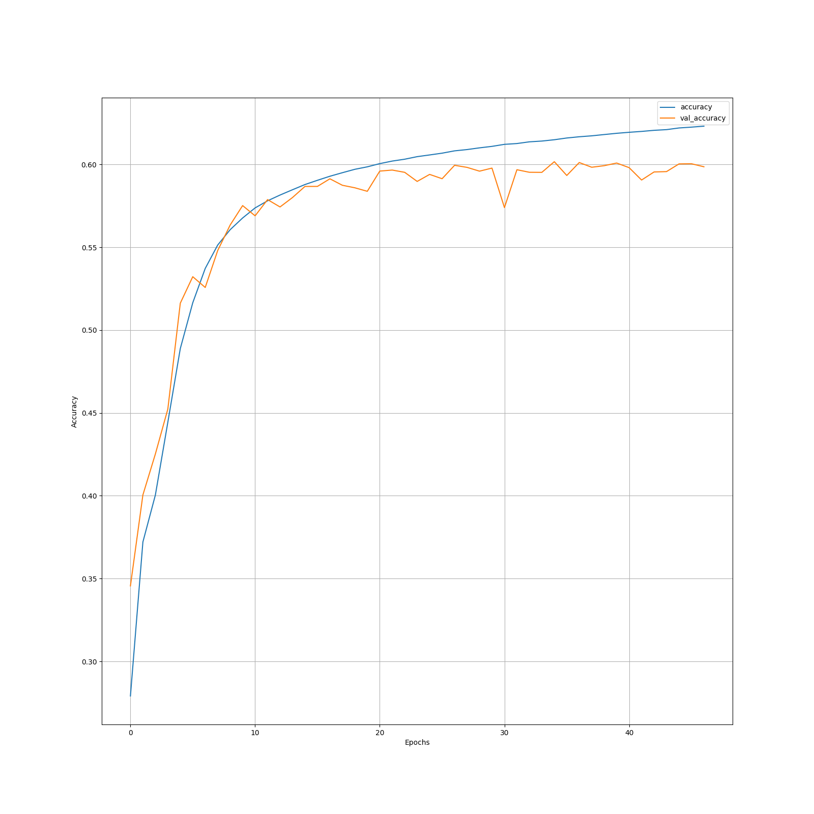

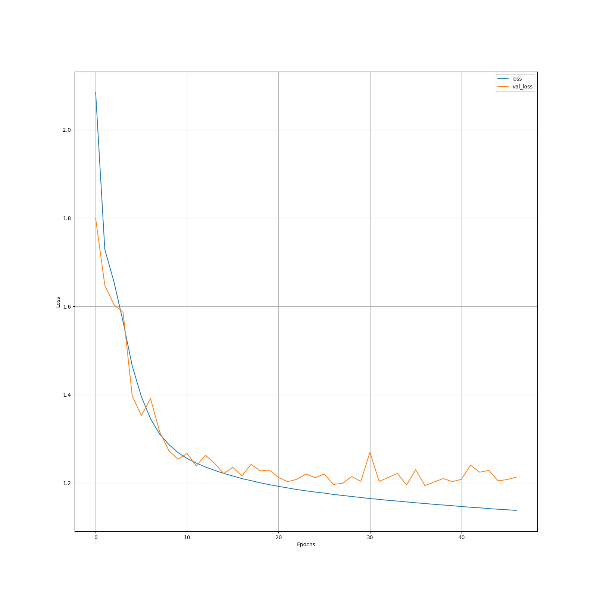

### Using the Radio-ML ConvNet Modulation Classifier for Inference

Use another built-in Keras routine for inference to predict new model outputs from test input images. The following code finds the accuracy of the model against each of the input SNR levels available in the dataset.

```
snrlist = np.unique(Z_test)
acc_arr = []

# iterate over SNRs
for snr in snrlist:
    i_SNR = np.where(Z_test==snr)
    X_SNR = X_test[i_SNR[0],:,:]
    Y_SNR = Y_test[i_SNR[0],:]
    X_SNR_len = np.shape(X_SNR)[0]

    # model prediction
    pred = model.predict(X_SNR)

    #Pediction values are onehot, corresponding to indices representing different modulation types
    pred_ind = np.argmax(pred, axis=1)
    expected_ind = np.argmax(Y_SNR, axis=1)
    matches  = sum(np.equal(pred_ind, expected_ind))
    acc      = matches/X_SNR_len
    acc_arr.append(acc)
```

The following figure is a plot of the SNR vs Correct Classification probability.

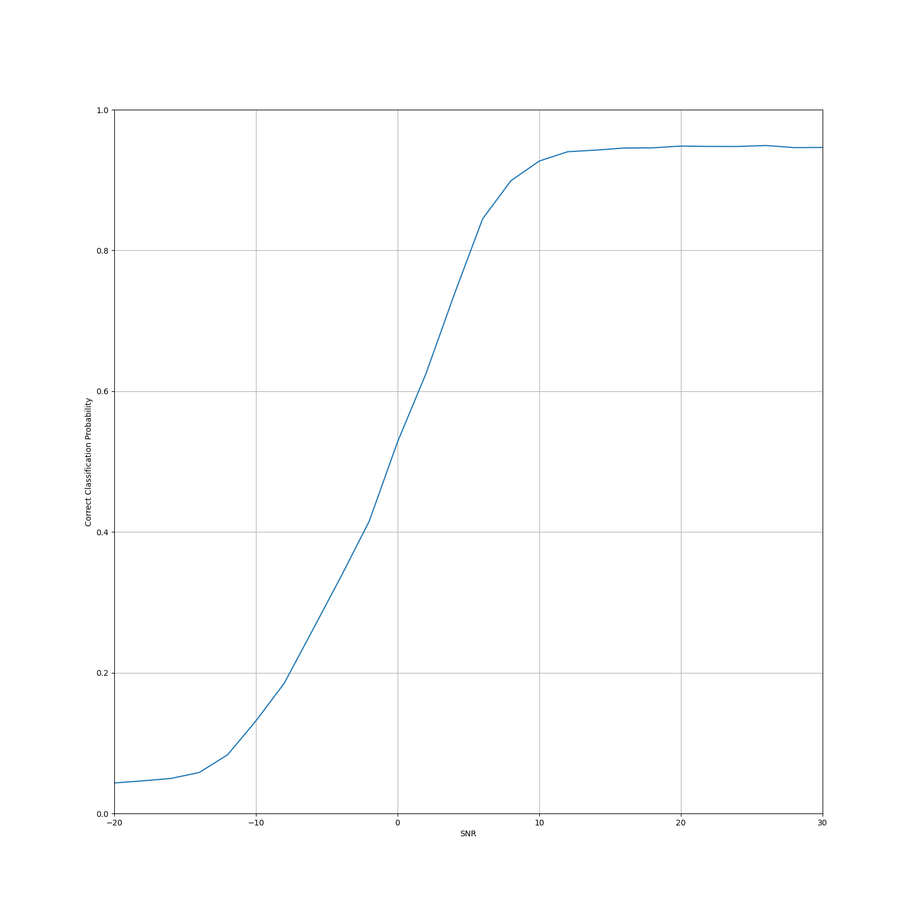

Use the following code to generate a plot of the [Confusion Matrix](https://en.wikipedia.org/wiki/Confusion_matrix) for the classifier across all 24 modulation classes for frames where the SNR is greater than or equal to zero.

```
X_test_SNR = X_test[(Z_test>=0)[:,0],:,:]
Y_test_SNR = Y_test[(Z_test>=0)[:,0],:]

test_Y_hat = model.predict(X_test_SNR, batch_size=1024)
conf = np.zeros([24,24])
confnorm = np.zeros([24,24])
for i in range(0,X_test_SNR.shape[0]):
    j = list(Y_test_SNR[i,:]).index(1)
    k = int(np.argmax(test_Y_hat[i,:]))
    conf[j,k] = conf[j,k] + 1
for i in range(0,24):
    confnorm[i,:] = conf[i,:] / np.sum(conf[i,:])

plot_confusion_matrix(confnorm, labels=modulation_classes)
```

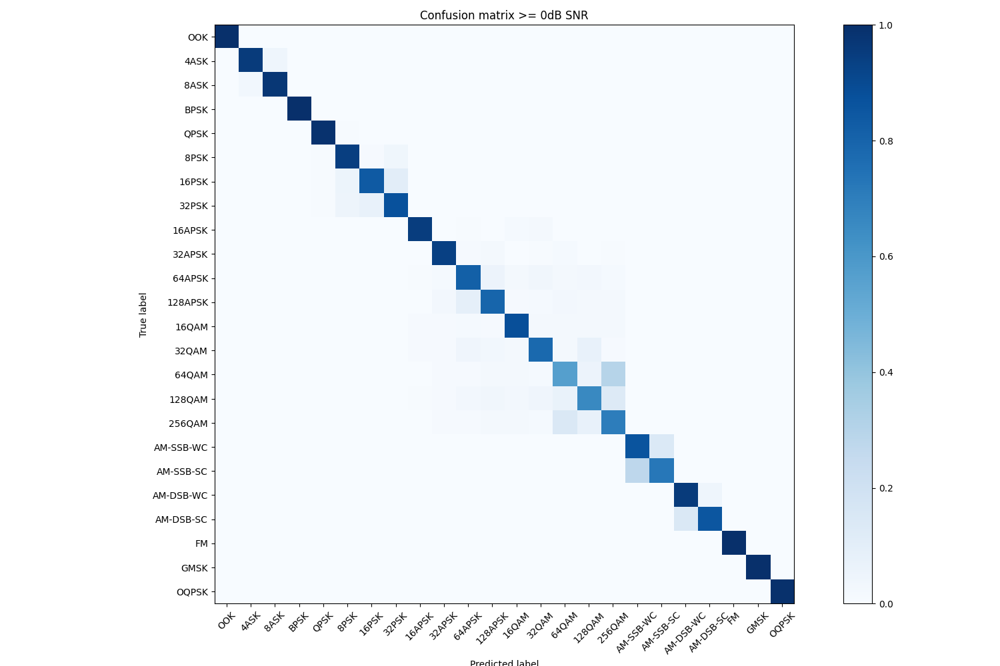

### Extracting Weights and Biases for AIE-ML Inference Solution

After obtaining a trained model for the Radio-ML ConvNet Modulation Classifier, the last step before building an inference solution on AIE-ML v2 is to obtain a quantized set of weights and use it in the implementation.

For simplicity in this tutorial, we choose a `bfloat16` implementation because quantization is straightforward.

The following code extracts the weights and biases from the Keras model. Then, it quantizes them to `bfloat16`. It then saves them in files for validating each layer of the network to be designed in AIE-ML v2 as follows.

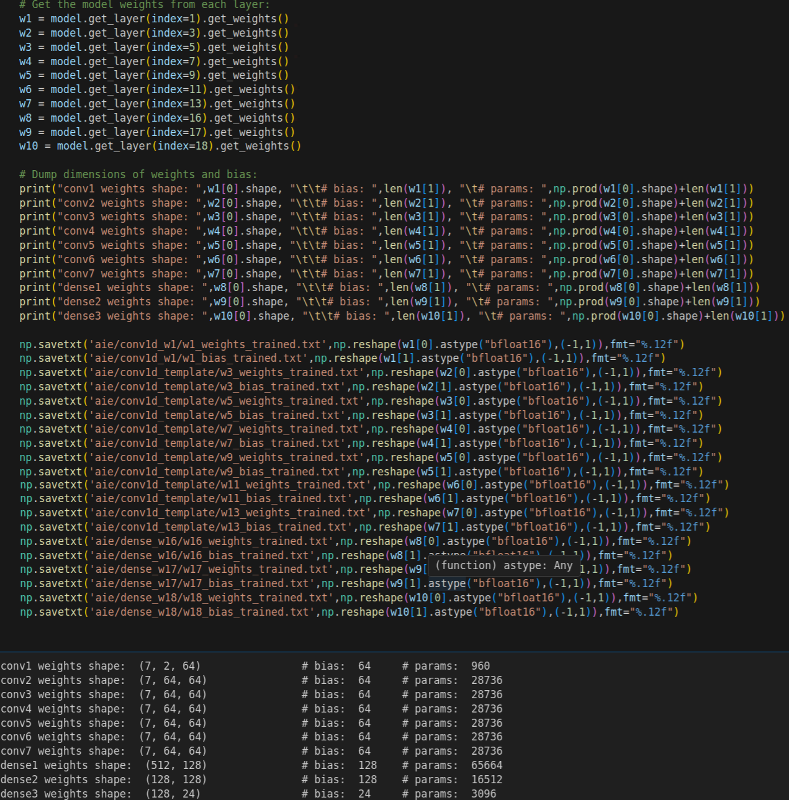

## AIE-ML v2 Inference Solution

This section provides an overview of the final AIE-ML v2 design for the Radio-ML ConvNet Modulation Classifier. It includes a review of key principles that the design leverages across all layers.
The [Individual Layer Designs](#individual-layer-designs) section then gives details for each layer.

### Design Approach

* This design chooses the `bfloat16` data type for both layer I/O data and for weights and biases. This simplifies the quantization of trained network parameters. Using `bfloat16` requires no special tools or quantization strategies.
* This design does not set a specific throughput target.
* The design partitions each network layer to its own AIE-ML v2 tile where feasible. This simplifies system partitioning and enables you to build a well-defined scope for each kernel.
* Memory tile pre/post zero-padding capability is leveraged for 1D convolutional layers to expand input tensor shapes to satisfy model requirements that use `padding="same"`. The model uses `kernel_size=7` which requires the input samples dimension to be pre-padded and post-padded with three zeros.
* Memory tile multi-dimensional addressing capabilities are leveraged to efficiently transfer I/O data for compute consumption with minimal core cycles being required for data shuffling or lane adjustments within the core.
* Compute workloads for 1D convolutional layers leverage the efficient `mac_4x8_8x8()` intrinsic for `bfloat16` data types to achieve a maximum efficiency of 256 MAC operations per cycle when feasible by a particular layer.
* Compute workloads leverage the less efficient `mac_elem_64()` intrinsic for `bfloat16` data types with a maximum efficiency of 64 MAC operations per cycle in cases where `mac_4x8_8x8()` is not feasible (for example in the `conv1d_w1()` layer which only receives data from two input nodes).
* The host sends weights and biases at run-time as async RTPs and stores them in local tile memory. Larger ML networks with millions or billions of weights require streaming solutions based on memory tiles or DDR; such a complex solution is excessive for the small Radio-ML Modulation Classifier problem considered here, where all weights fit easily within the array.
* The design does not achieve perfect functional bit-match against the Python model. The main contributors to this are the dense layers; the corresponding sections discuss more details. Achieve a closer match by building Python models aligning with the implementation, then training those models to extract updated weights/biases.

### Key Design Concepts

* Storage requirements for I/O data for some layers might exceed the available 64 KB in the local tile memory. Therefore, you must split the consumed input or produced output data into chunks. This has a direct impact on the nature of processing.
* If the input and output data fit into the memory tile but do not fit into the local tile memory, split processing into `NSPLIT` chunks such that local tile storage does not exceed 64 KB. You must split both input and output buffers by the same factor in the local tile. Then schedule processing for the layer as a multi-rate solution with a `repetition_count=1` on the memory tile and a `repetition_count=NSPLIT` on the kernel. For the Radio-ML design, this concept is used in `conv1d_w3-w7` layers as well as `max_pool1d_w4-w6`. To motivate this, consider `conv1d_w3` in more details. The block has (64,512) bfloat16 samples on the I/Os. Assuming ping-pong buffering and zero insertion, the input requires storage size of at least **64 nodes x (512 samples + 3 pre-pad zeros + 3 post-pad zeros ) x 2 ping-pong x 2 bytes/sample = 129.5 KB**, which is 2.03x larger than local tile. This motivates the need for splitting the processing over at least NSPLIT>2 chunks. For `conv1d_w3`, choose NSPLIT=8 to fit both I/Os into local tile. The following diagram illustrates this concept.

  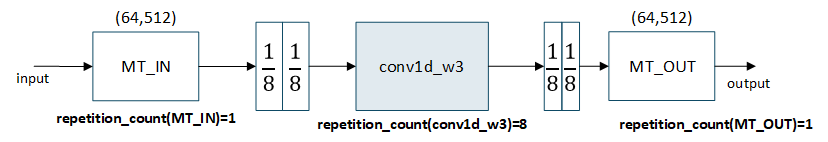
* The multi-rate solution with buffer splitting outlined above does not work if one of the buffers, input or output, does not require splitting. In this case, the multi-rate scheduling applies only to the buffer that is split. The buffer that is not split must use  a `repetition_count=1`. But AIE kernel multi-rate scheduling forces both input and output scheduling to use the same factor. Instead, solve this using the asynchronous buffer mechanism on the buffer that requires splitting.

  Consider the case with output splitting. Implement the kernel using `output_async_buffer`, enabling the split of the output_buffer by `NSPLIT` factor. At the beginning of kernel execution, the kernel acquires the locks for ping side of the output buffer. Once the kernel produces 1/NSPLIT of the output data, it releases the lock on the ping side and acquires it on the pong, then continues processing etc. For more information on asynchronous buffer ports, refer to [Asynchronous Buffer Port Access (UG1603)](https://docs.amd.com/r/en-US/ug1079-ai-engine-kernel-coding/Asynchronous-Buffer-Port-Access). For the Radio-ML design, the `conv1d_w1` layer uses this concept. To motivate this, consider `conv1d_w1` in more details. The block has (2,1024) bfloat16 samples on the input and (64,1024) on the output. The input requires ~8.04 KB of storage (accounting for zero-insertion and ping-pong storage) while the output requires 256 KB. Therefore, it requires **NSPLIT = 128 KB x 2 / 64 KB = 4**. The following diagram shows the dataflow.

  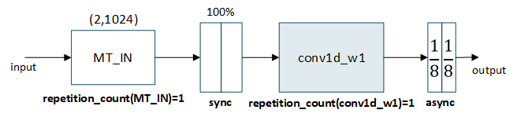
* For layers with compute, for example `conv1d_w1-w13`, the I/O data is a 2D matrix represented as (nodes,samples).
  * Splitting the  output:
    * Splitting the output processing over the samples dimension requires the weights to be read multiple times. The following figure highlights this: 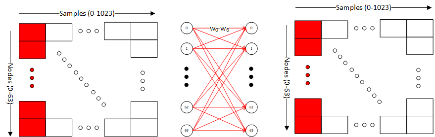
    * Splitting the output processing over the nodes dimension requires the input samples to be read multiple times. 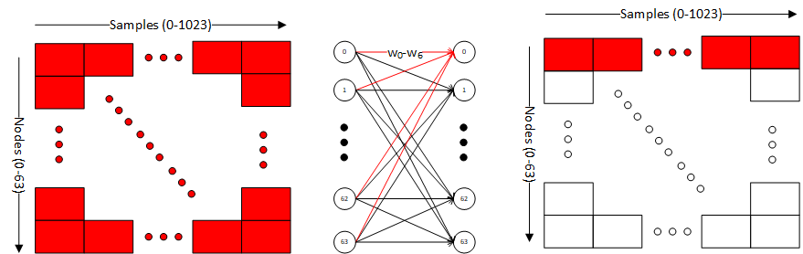
    * For `conv1d_w1`, the design splits the output in the nodes dimension because the input samples easily fit in the local tile and re-reading comes for "free." It is also been possible to split the output in the nodes dimension, because the weights also fit in the local tile.
    * For conv1d_w3-w7 layers, the design splits outputs in the samples dimension because the weights fit in the local tile memory (while the input does not) and re-reading comes for "free."
  * Splitting the  input:
    * Splitting the input over the samples dimension requires explicit state history handling. The following figure highlights this:
    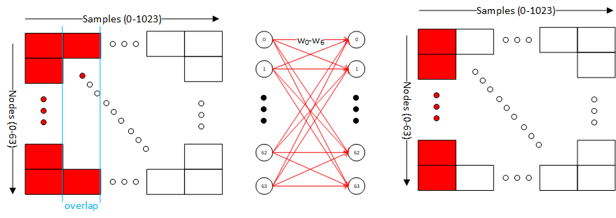
    * Splitting the input over the nodes dimension requires the storage of partial results. 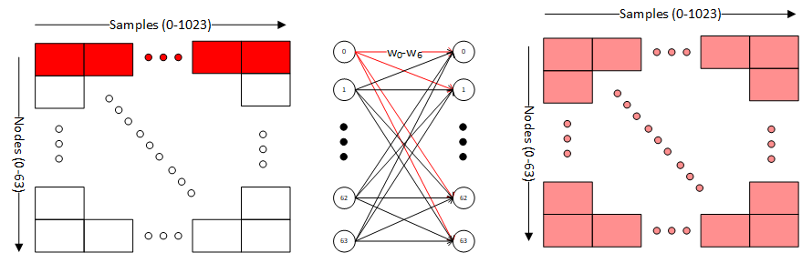
    * The latter requires additional storage and results in an implementation that does not software pipeline efficiently. For the former, either store state history samples in local tile or re-send them from the memory tile as needed. Re-sending the samples from the memory tile results in slight bandwidth expansion, but this is not an issue because conv1d_w3-w7 layers are not bandwidth-bound.
    * Therefore, the choice for conv1d_w3-w7 is to split the input data in the samples dimension and use the memory tiles to send samples with overlap to model state history. The conv1d_w1 input (as well as conv1d_w9-w13) does not need splitting because the local tile storage is sufficient to store all input samples.
  * One Graph invocation of `radioml_top` is one inference based on 1024 complex I/Q incoming samples. This translates into the following per layer invocation.

    |Layer|Input Tensor Shape|Output Tensor Shape|Input storage req. local tile (KB)|Output storage req. local tile (KB)|Kernel invocation|Memory Tile invocation|Note|
    |---|---|---|---|---|---|---|---|
    |conv1d_w1|(2,1024)|(64,1024)|8|256|1|1|Split output nodes by NSPLIT=8, handled inside kernel using async_output_buffer|
    |max_pool1d_w2|(64,1024)|(64,512)|256|128|8|1|---|
    |conv1d_w3|(64,512)|(64,512)|176|128|8|1|Split I/O over samples dimension|
    |max_pool1d_w4|(64,512)|(64,256)|128|64|4|NA|---|
    |conv1d_w5|(64,256)|(64,256)|88|64|4|1|Same note as conv1d_w3|
    |max_pool1d_w6|(64,256)|(64,128)|64|32|2|NA|---|
    |conv1d_w7|(64,128)|(64,128)|44|32|2|1|Same note as conv1d_w3|
    |max_pool1d_w8|(64,128)|(64,64)|32|16|1|NA|---|
    |conv1d_w9|(64,64)|(64,64)|17.5|16|1|1|NA|
    |max_pool1d_w10|(64,64)|(64,32)|16|8|1|NA|---|
    |conv1d_w11|(64,32)|(64,32)|9.5|8|1|1|NA|
    |max_pool1d_w12|(64,32)|(64,16)|8|4|1|NA|---|
    |conv1d_w13|(64,16)|(64,16)|5.5|4|1|1|NA|
    |max_pool1d_w14|(64,16)|(64,8)|4|2|1|NA|---|
    |dense_w16|(512)|(128)|2|0.5|1|NA|---|
    |dense_w17|(128)|(128)|0.5|0.5|1|NA|---|
    |dense_w18|(128)|(24)|0.5|0.1|1|NA|---|

### Radio-ML ConvNet: AI Engine Graph View

The following diagram shows the overall AI Engine graph of the Radio-ML ConvNet Modulation Classifier.

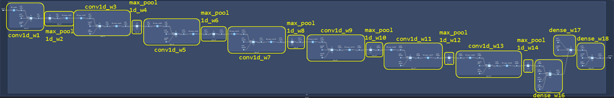

### Radio-ML ConvNet: AI Engine Floorplan View

The following diagram shows the floorplan view of the Radio-ML ConvNet Modulation Classifier.

Placement constraints were added to place the compute tiles in the top row of tiles and the weight delivery tiles in the lower row of tiles. The design uses memory tiles for layer I/O ordering and zero padding outlined as follows.  

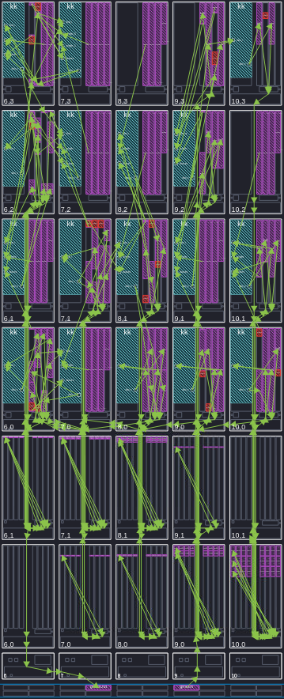

### Radio-ML ConvNet: AI Engine Resource Utilization

The following figure gives the resource utilization of the design. The design fits into a 4 x 6 grid of tiles and utilizes eight memory tiles for shared buffers.

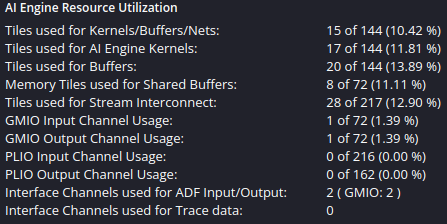

### Radio-ML ConvNet: Throughput

From the following figure, calculate throughput based on AI Engine simulations. Eight inferences run in 532.8 μs, which translates to ~15,000 inferences per second.

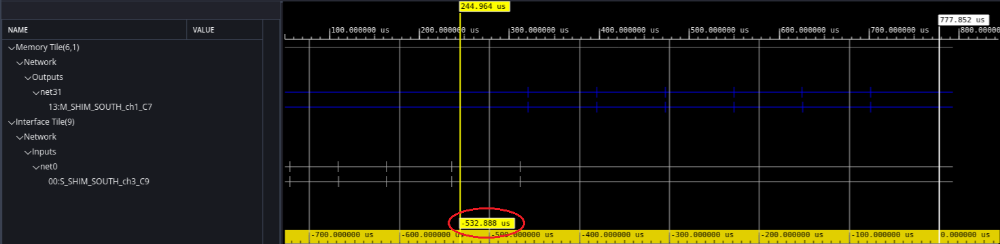

### Radio-ML ConvNet: Latency

The latency of the Radio-ML ConvNet Modulation Classifier is approximately 466 μs based on AI Engine simulations.

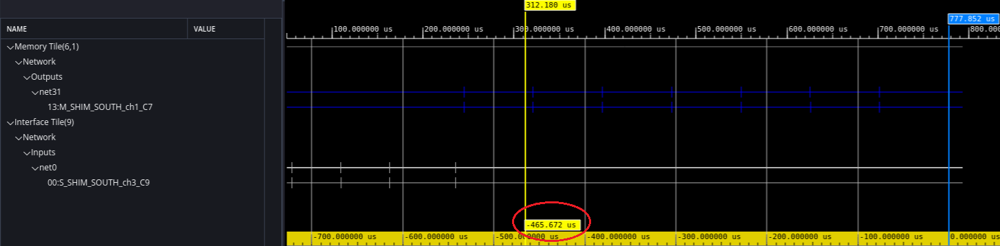

## Individual Layer Designs

### Layer Design Details: `conv1d_w1()`

The following figure summarizes the key aspects of the design of the `conv1d_w1()` layer. The Jupyter Notebook used for validation is [gen_vectors.ipynb](aie/conv1d_w1/gen_vectors.ipynb).

* This design uses an input memory tile to pre/post zero pad the input tensor to satisfy model requirements that use `padding="same"`. The layer of interest uses `kernel_size=7` which requires the incoming 1024 I/Q samples to be pre-padded with three zeros and post-padded with three zeros.
To guarantee kernel input size is a multiple of 16 bytes, pre-pad with 4 zeros and post-pad with 4 zeros.
* Incoming (samples,nodes) dimension becomes flipped on the output due to nature of compute. The max_pool1d_w2 layer recovers this orientation.
* The layer input data fits in the local tile memory, but the output expands to 64x1024 bfloat16 samples corresponding to 256 KB (assuming double buffering), which is larger than the local tile memory of 64 KB. Splitting the output data impacts the nature of processing, as described earlier in [Key Design Concepts](#key-design-concepts).
* For this reason, we implement the kernel using an `output_async_buffer`, enabling the split of the output_buffer by NSPLIT=4.
* Because this layer has only two input nodes, the kernel uses the `mac_elem_64()` intrinsic which drops the maximum achievable hardware utilization to 25%.
* The inner loop has KERNEL_SIZE=7 iterations and is fully unrolled. The next inner loop achieves II=57 with 7x2 MAC operations.
* The overall kernel structure employs an outer loop over the nodes dimension, an inner loop over samples dimension and the most inner loop over kernel_size dimension. This is a good fit for the chosen intrinsic.
* Notice how the design uses the tiling parameters of the memory tile to pre/post-pad the input samples dimension with 4 zeros.

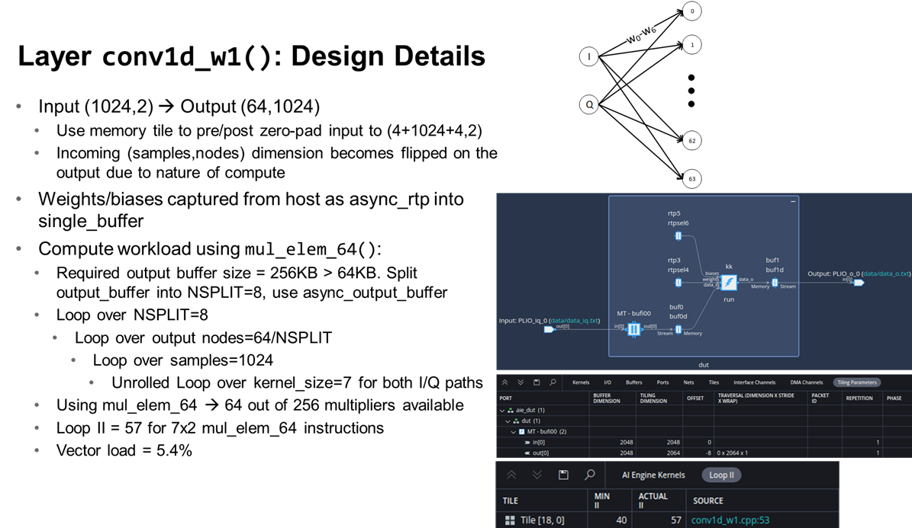

### Layer Design Details: `max_pool1d_w2()`

The following figure summarizes the key aspects of the design of the `max_pool1d_w2()` layer. The Jupyter Notebook used for validation is [gen_vectors.ipynb](aie/max_pool1d_w2/gen_vectors.ipynb).

* The `max_pool1d_w2` I/O storage requirements exceed the available 64 KB in the local tile. Splitting the I/O data processing impacts the nature of processing, as described earlier in [Key Design Concepts](#key-design-concepts).
* For this reason, set up `max_pool1d_w2` as a multi-rate solution with a `repetition_count=1` on the memory tile and a `repetition_count=4` on the compute kernel. This reduces the storage requirements in the local tile, which otherwise exceed the available 64 KB.
* Max pooling decimates the input samples dimension by a factor of 2 by applying a `max()` operation across two consecutive samples. The layer strides successive samples by 2, so they are non-overlapping. The `aie::max()` function in the AIE API vectorizes this compute workload efficiently.
* The design achieves 2D Matrix Transpose by leveraging the kernel `aie::interleave_zip` + Memory Tiles performing a partial transpose. Full 2D Transpose using Memory Tiles is impossible because the data is 16-bits and storage aligns to the 32-bit boundary. For more information, refer to [2D Matrix Transpose Using Tiling Parameters (UG1603)](https://docs.amd.com/r/en-US/ug1603-ai-engine-ml-kernel-graph/2D-Matrix-Transpose-Using-Tiling-Parameters)
* The layer is coded as an outer loop over the nodes dimension and an inner loop over the samples dimension. Vectorization and software pipelining of the inner loop creates 64 output samples with an II=8 (bandwidth-bound).

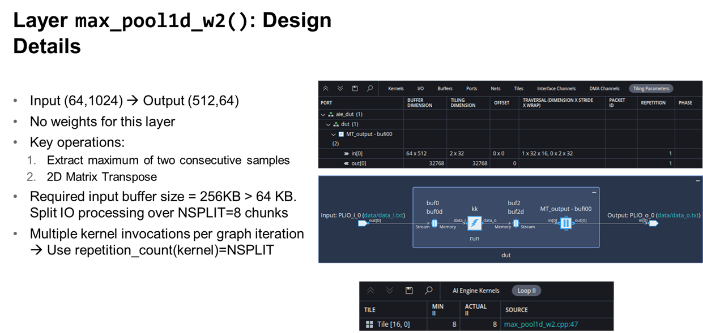

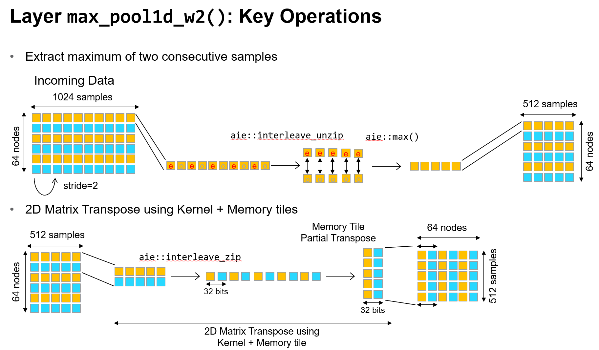

### Layer Design Details: `conv1d_w3()`

The following figure summarizes the key aspects of the design of the `conv1d_w3()` layer. The Jupyter Notebook used for validation is [gen_vectors.ipynb](aie/conv1d_template/gen_vectors.ipynb).

* The design approach described here is common for the remaining conv1d layers. The design achieves this by building a templatized kernel where the samples dimension varies as needed from a maximum of 512 down to 16.
* Set up `conv1d_w3` as a multi-rate solution with a `repetition_count=1` on the memory tile and a `repetition_count=8` on the compute kernel. This reduces the storage requirements of the kernel in the local tile.
* There are (7x64x64) bfloat16 weights to store, which have a total storage requirement of 56 KB (assuming single_buffer). The host initializes the weights at run-time during initialization.
* The required storage for I/O buffers for conv1d_w3 (512,64) = 256 KB (assuming double-buffering). This is larger than the available storage in local tile. The kernel splits I/O processing over NSPLIT chunks, with the kernel invocated NSPLIT times per graph iteration. The design accomplishes this by setting up `conv1d_w3` as a multi-rate solution with a `repetition_count=1` on the memory tile and a `repetition_count=8` on the compute kernel, hence reducing the storage requirements of the kernel in the local tile.
* Splitting the I/O data impacts the nature of processing, as described earlier in [Key Design Concepts](#key-design-concepts). The design splits the input and output data processing in the samples dimension.
* The input memory tile writes samples in linear order, consuming the input tensors of shape `{512,64}` in order from the rightmost dimension first (as in the Numpy convention). The design extracts samples from the input memory tile in a tiled fashion. Within each tile, access reads `dim=0` first, followed by `dim=1`, hence defining the `buffer_dimension` as `{64,512}`. The design defines the `tiling_dimension` as `{8,22}`, because 22 input samples are needed to produce `{8,16}` valid output samples. The input tile traverses down the nodes then right across the samples, with a stride of 16, providing 6 samples overlap for state history. The Keras/TF model uses `padding="same"`, which pre/post-pads the input samples such that the output dimension is the same as the input. The memory tile achieves this functionality via `offset` = `{0,-3}`.
* The weights `{7,64,64}` corresponding to `{KERNEL_SIZE,inputs,outputs}` require 56 KB of storage (assuming single_buffer) which is < 64 KB. Because the weights do not need to be updated often, initialize them from host as `async_rtp` and store them in local tile. Weights arrive from host in order to be consumed as `{1,8,8}`, traveling `dim=0` followed by `dim=1` then `dim=2`. The samples within the patch arrive in order from the rightmost dimension first (as in the Numpy convention).
* The incoming `{8,22}` patch gets captured into 6 x 32-lane registers, where the inner dimension of the patch gets access first, followed by the outer dimension. Each register stores the samples in row-based fashion, so `{4,8}` corresponds to four samples and eight nodes. Four `aie::accum<accfloat,32>` registers are operating concurrently, each producing 4 of the 16 output samples across 8 output nodes. The kernel achieves an `II=43` for the inner unrolled loop which contains 28 `mac_4x8_8x8()` instructions which corresponds to a vector load = 60%.
* The 4x`{4,8}` row-based output registers gets written into `{8,16}` memory tile patch, writing into inner-dimension first. The patch travels down the nodes then right across the samples.

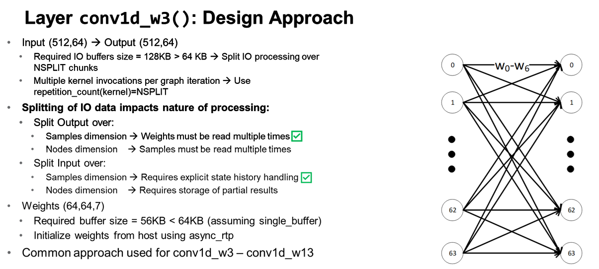

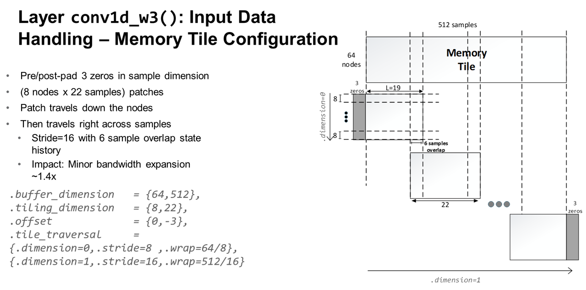

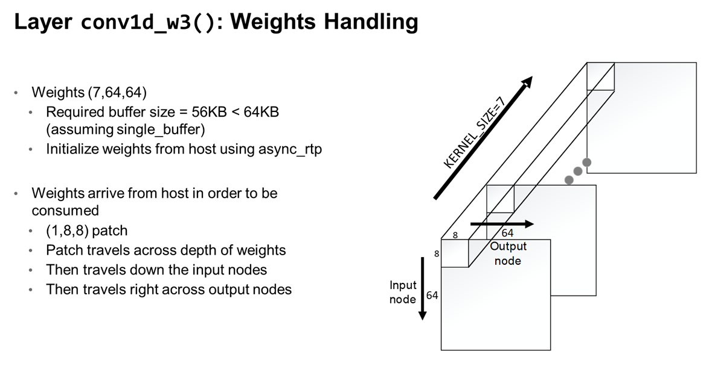

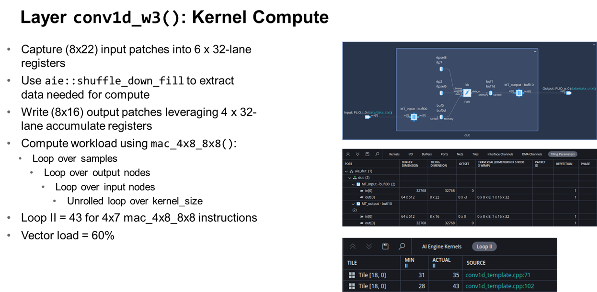

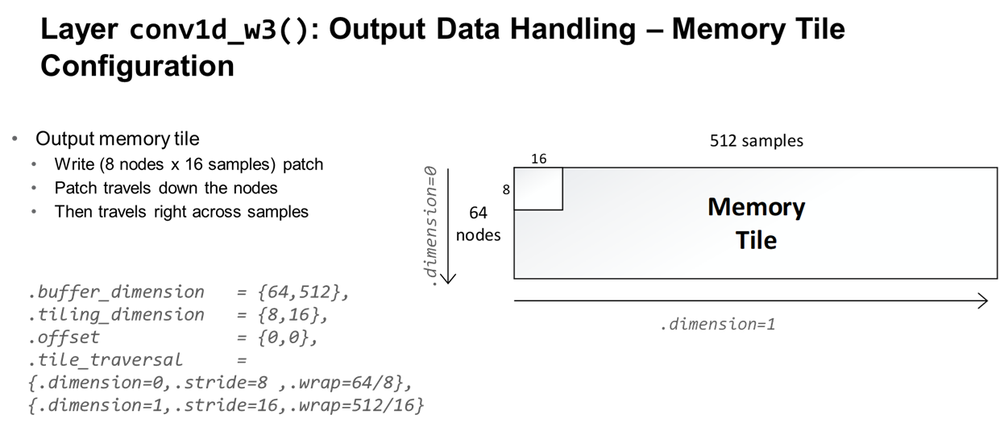

### Layer Design Details: `max_pool1d_w4()`

* The design approach described here is common for the remaining max_pool1d layers. The design achieves this by building a templatized kernel where the samples dimension varies as needed from a maximum of 512 down to 16.
* The `max_pool1d_w4` I/O storage requirements exceed the available 64 KB in the local tile. Splitting the I/O data processing impacts the nature of processing, as described earlier in [Key Design Concepts](#key-design-concepts).
* For this reason, set up `max_pool1d_w4` as a multi-rate solution with a `repetition_count=2` on the compute kernel. This reduces the storage requirements of the kernel in the local tile.
* Max pooling decimates the input samples dimension by a factor of 2 by applying a `max()` operation across two consecutive samples. Successive samples are strided by 2, so they are non-overlapping. The `aie::max()` function in the AIE API vectorizes this compute workload efficiently.
* The layer is coded as a loop capturing 2 consecutive samples from 64 nodes and using `aie::max` API to perform a lane-by-lane `max` function to extract the maximum of the 2 samples across the 64 nodes. Vectorization and software pipelining of the loop creates 64 output samples with an II=4 (bandwidth-bound).

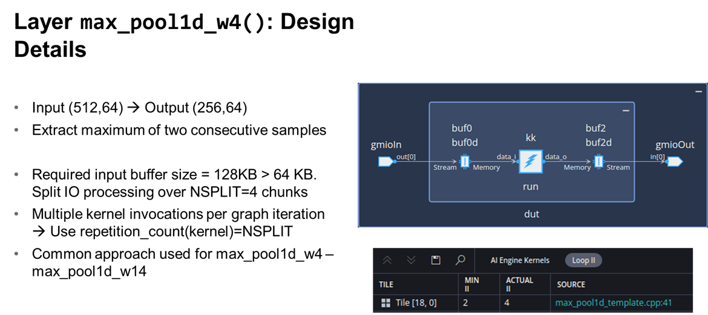

### Layer Approach: `flatten()`

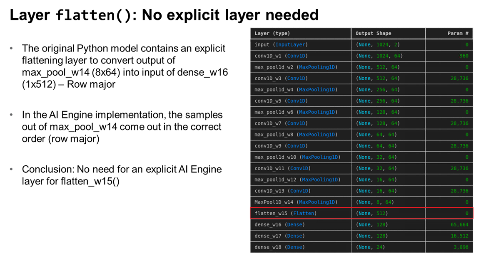

### Layer Design Approach: `dense()`

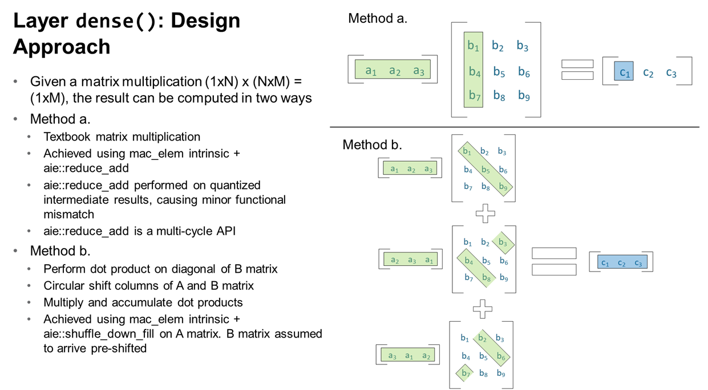

### Layer Design Details: `dense_w16()`

The following figure summarizes the key aspects of the design of the `dense_w16()` layer. The Jupyter Notebook used for validation is [gen_vectors.ipynb](aie/dense_w16/gen_vectors.ipynb). This tile includes two functions, the `dense_w16()` layer and a final `selu()` computation. The layer uses the `mac_elem_64()` intrinsic to compute outputs leveraging the preceding method b.

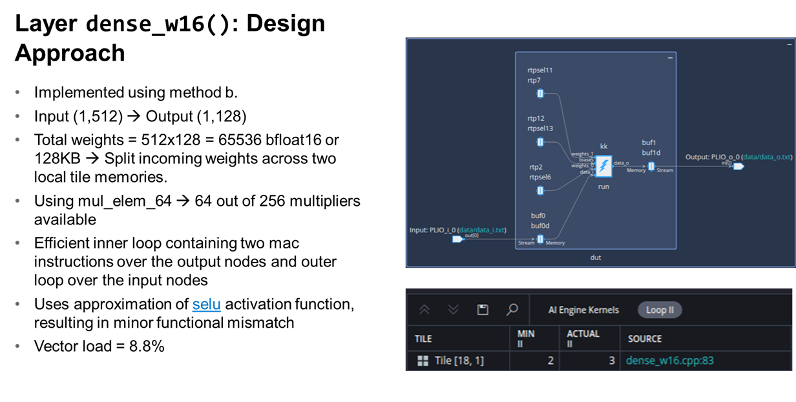

### Layer Design Details: `dense_w17()`

The following figure summarizes the key aspects of the design of the `dense_w17()` layer. The Jupyter Notebook used for validation is [gen_vectors.ipynb](aie/dense_w17/gen_vectors.ipynb). This tile includes two functions, the `dense_w17()` layer and a final `selu()` computation. The layer uses the `mac_elem_64()` intrinsic to compute outputs leveraging the preceding method b.

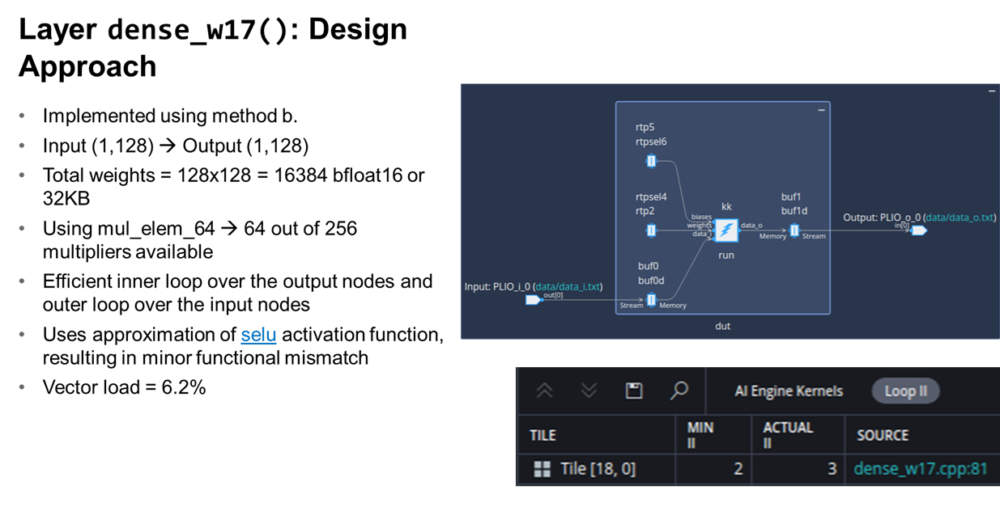

### Layer Design Details: `dense_w18()`

The following figure summarizes the key aspects of the design of the `dense_w18()` layer. The Jupyter Notebook used for validation is [gen_vectors.ipynb](aie/dense_w18/gen_vectors.ipynb). This tile includes two functions, the `dense_w18()` layer and a final `softmax()` computation. The design computes the `softmax()` activation function using the approach outlined in the [Softmax Function Vitis Tutorial](../../AIE-ML/Design_Tutorials/05-Softmax-Function/). The layer uses the `mac_elem_64()` intrinsic to compute outputs leveraging the preceding method a.

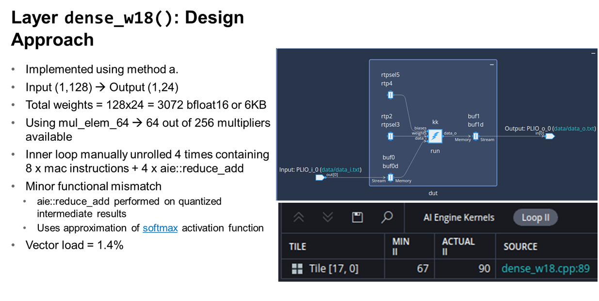

## Design Resources

The following figure summarizes the AI Engine and PL resources required to implement the design in the VE3858 device on the VEK385 eval board. The design uses 17 AI Engine tiles for compute, placed in a 4x6 arrangement. The design uses minimal PL resources because this is an AI Engine only design with data transfer happening from/to DDR over NoC.

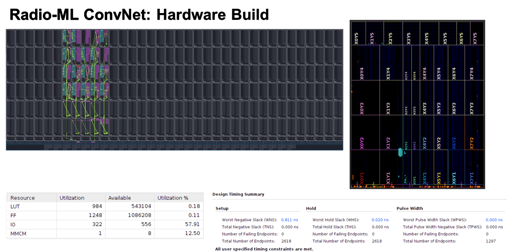

## Build and Run Design

### Setup and Initialization

<div style="border-left: 4px solid #2563eb; background: rgba(37, 99, 235, 0.05); padding: 0.75rem 1rem; margin: 1rem 0;">

**ℹ️ Note**

This tutorial has only been tested and verified on a REV-A VEK385 board. Other board revisions may require different image files or adjustments to these steps.
</div>

IMPORTANT: Before beginning the tutorial, verify you have:

* Installed AMD Vitis™ 2026.1 software and set `PLATFORM_REPO_PATHS` to the value `<Vitis_tools>/base_platforms`.
* Created directory `<path-to-design>/yocto_artifacts` and set environment variable YOCTO_ARTIFACTS to that path.
* From [AMD Embedded Development Framework Documentation downloads page](https://edf.docs.amd.com/en/latest/downloads-and-release-notes.html) package 26.06:
  * Downloaded amd-cortexa78-mali-common_meta-edf-app-sdk, run the script and set path output to `<path-to-design>/yocto_artifacts/amd-cortexa78-mali-common_meta-edf-app-sdk/sdk`.
  * Downloaded VEK385 OSPI Image and move into `<path-to-design>/yocto_artifacts/`. 
    * For Rev-A board: `edf-ospi-versal-2ve-2vm-vek385-multidomain-20260609231841.bin` 
  * Downloaded amd-cortexa78-mali-common_edf-linux-disk-image (SD wic), unzip and move into `<path-to-design>/yocto_artifacts/`.
  * Downloaded amd-cortexa78-mali-common_vek385_qemu_prebuilt, unzip and move into `<path-to-design>/yocto_artifacts/`.
    * For Rev-A board: `amd-cortexa78-mali-common_vek385_qemu_prebuilt.tar.gz`

### Hardware Emulation

Build the Radio-ML ConvNet Modulation Classifier design for hardware emulation with the Makefile as follows:

```
[shell]% cd <path-to-design>
[shell]% make all TARGET=hw_emu
[shell]% make run_emu -C vitis TARGET=hw_emu
```

This takes about 90 minutes to run. The build process generates a `package` folder containing all the files required for hardware emulation. Hardware emulation is then launched and run producing the outputs that follow. Apply an optional `-g` to the `launch_hw_emu.sh` command to launch Vivado waveform GUI to observe the top-level AXI signal ports in the design. Edit [vitis/Makefile](vitis/Makefile) `run_emu` target to do this.

~~~
PASSED:  Read all IO/RTP files
PASSED:  Read modulation_classes.txt file
PASSED:  auto my_graph  = xrt::graph(my_device, xclbin_uuid, "aie_dut")
PASSED:  my_graph.reset()
PASSED:  Transferred design RTP's to AIE graphs
PASSED:  xrt::aie::profiling handle(my_device);
PASSED:  my_graph.run( NUM_ITER=8 )
Graph completed execution
Model accuracy is within tolerance of 0.05
Inference # = 0 golden_classification = OOK implementation_classification = OOK
Inference # = 1 golden_classification = 4ASK implementation_classification = 4ASK
Inference # = 2 golden_classification = 8ASK implementation_classification = 8ASK
Inference # = 3 golden_classification = BPSK implementation_classification = BPSK
Inference # = 4 golden_classification = QPSK implementation_classification = QPSK
Inference # = 5 golden_classification = 8PSK implementation_classification = 8PSK
Inference # = 6 golden_classification = 16PSK implementation_classification = 16PSK
Inference # = 7 golden_classification = 32PSK implementation_classification = 32PSK
==============================
Cycle count: 690196
Approx Inference Throughput: 14.4886 KHz
==============================

--- PASSED ---
INFO: Embedded host run completed.
~~~

### Hardware

Build this design for the VEK385 board using the Makefile as follows:

```shell
[shell]% cd <path-to-design>
[shell]% make all TARGET=hw
```

The build process generates all the design specific files needed to run the design on hardware in the `package` folder.

1. Write the EDF boot firmware (OSPI) to the primary boot device following instructions in [How to Boot a Board Using the Pre-built Images](https://xilinx-wiki.atlassian.net/wiki/spaces/A/pages/3258155011/Discovery+and+Evaluation+AMD+Versal+Device+Portfolio#How-to-Boot-a-Board-Using-the-Pre-built-Images).
Find the OSPI image in `<path-to-design>/yocto_artifacts`:
    * For Rev-A board: `edf-ospi-versal-2ve-2vm-vek385-multidomain-20260609231841.bin`
2. Write `<path-to-design>/yocto_artifacts/edf-platform-disk-image-amd-cortexa78-common.rootfs-20260609231841.wic` to sd_card using your favorite SD imaging tool (Balena Etcher and Win32DiskImager seem to work well).
3. Put the sd_card into the board, boot it, and log in. (default username is amd-edf and you are prompted to set a password)
4. Determine the IP address eth0 on the board with `ip addr show eth0`.
5. cd `<path-to-design>/package; scp * amd-edf@<ip_address>:~/`
6. Run the design: `sudo ./embedded_exec.sh`

The following displays on the terminal.
~~~
root@amd-edf:/storage/sd_card_01RadioML# sudo ./embedded_exec.sh
INFO: Load the pdi and dtbo using fpgautil
mkdir: cannot create directory '/configfs': File exists
Time taken to load BIN is 966.000000 Milli Seconds
BIN FILE loaded through FPGA manager successfully
Initializing ADF API...
PASSED:  auto my_device = xrt::device(0)
XAIEFAL: INFO: Resource group Avail is created.
XAIEFAL: INFO: Resource group Static is created.
XAIEFAL: INFO: Resource group Generic is created.
PASSED:  auto xclbin_uuid = my_device.load_xclbin(dut.xclbin)
PASSED:  Create GMIO buffer objects
PASSED:  Successfully read input file data_iq.txt
PASSED:  Successfully read input file w1_weights-rtp.txt
PASSED:  Successfully read input file w1_biases-rtp.txt
PASSED:  Successfully read input file w3_weights-rtp.txt
PASSED:  Successfully read input file w3_biases-rtp.txt
PASSED:  Successfully read input file w5_weights-rtp.txt
PASSED:  Successfully read input file w5_biases-rtp.txt
PASSED:  Successfully read input file w7_weights-rtp.txt
PASSED:  Successfully read input file w7_biases-rtp.txt
PASSED:  Successfully read input file w9_weights-rtp.txt
PASSED:  Successfully read input file w9_biases-rtp.txt
PASSED:  Successfully read input file w11_weights-rtp.txt
PASSED:  Successfully read input file w11_biases-rtp.txt
PASSED:  Successfully read input file w13_weights-rtp.txt
PASSED:  Successfully read input file w13_biases-rtp.txt
PASSED:  Successfully read input file w16_0_weights-rtp.txt
PASSED:  Successfully read input file w16_1_weights-rtp.txt
PASSED:  Successfully read input file w16_biases-rtp.txt
PASSED:  Successfully read input file w17_weights-rtp.txt
PASSED:  Successfully read input file w17_biases-rtp.txt
PASSED:  Successfully read input file w18_weights-rtp.txt
PASSED:  Successfully read input file w18_biases-rtp.txt
PASSED:  Successfully read input file data_o.txt
PASSED:  Read all IO/RTP files
PASSED:  Read modulation_classes.txt file
PASSED:  auto my_graph  = xrt::graph(my_device, xclbin_uuid, "aie_dut")
PASSED:  my_graph.reset()
PASSED:  Transferred design RTP's to AIE graphs
PASSED:  xrt::aie::profiling handle(my_device);
PASSED:  my_graph.run( NUM_ITER=8 )
Graph completed execution
Model accuracy is within tolerance of 0.05
Inference # = 0 golden_classification = OOK implementation_classification = OOK
Inference # = 1 golden_classification = 4ASK implementation_classification = 4ASK
Inference # = 2 golden_classification = 8ASK implementation_classification = 8ASK
Inference # = 3 golden_classification = BPSK implementation_classification = BPSK
Inference # = 4 golden_classification = QPSK implementation_classification = QPSK
Inference # = 5 golden_classification = 8PSK implementation_classification = 8PSK
Inference # = 6 golden_classification = 16PSK implementation_classification = 16PSK
Inference # = 7 golden_classification = 32PSK implementation_classification = 32PSK
==============================
Cycle count: 690462
Approx Inference Throughput: 14.4831 KHz
==============================

--- PASSED ---
INFO: Embedded host run completed.
~~~

## Summary

This tutorial has presented the design of a Radio-ML ConvNet Modulation Classifier in AIE-ML v2. The solution has 258,648 parameters and requires ~20 tiles. It achieves a throughput of ~14.4K inferences per second with a latency of ~466 μs.

## References

[1]: <https://ieeexplore.ieee.org/document/8267032> "Over-the-Air Deep Learning Based Radio Signal Classification, T. J. O’Shea, T. Roy and T. C. Clancy"
[[1]] T. J. O’Shea, T. Roy and T. C. Clancy, "[Over-the-Air Deep Learning Based Radio Signal Classification](https://ieeexplore.ieee.org/document/8267032)" in IEEE Journal of Selected Topics in Signal Processing, vol. 12, no. 1, pp. 168-179, Feb. 2018

[2]:<https://www.kaggle.com/datasets/pinxau1000/radioml2018>
[[2]]: DeepSig Dataset 2018.01A: <https://www.kaggle.com/datasets/pinxau1000/radioml2018>

[3]: <https://en.wikipedia.org/wiki/Confusion_matrix> "Confusion Matrix"

[[3]] Wikipedia, "[Confusion Matrix](https://en.wikipedia.org/wiki/Confusion_matrix)"

## Support

GitHub issues track requests and bugs. For questions, go to [adaptivesupport.amd.com](https://adaptivesupport.amd.com/).

## License

<p class="sphinxhide" align="center"><sub>Copyright © 2025-2026 Advanced Micro Devices, Inc</sub></p>
<p class="sphinxhide" align="center"><sup><a href="https://www.amd.com/en/corporate/copyright">Terms and Conditions</a></sup></p>
