<!--
Copyright (C) 2026, Advanced Micro Devices, Inc. All rights reserved.
SPDX-License-Identifier: MIT
Author: Faisal El-Shabani
-->
<table class="sphinxhide" width="100%">
   <tr width="100%">
      <td align="center">
         <picture>
            <source media="(prefers-color-scheme: dark)" srcset="https://raw.githubusercontent.com/Xilinx/Image-Collateral/main/logo-white-text.png" width="30%">
            
         </picture>
         <h1>AI Engine Development</h1>
         <a href="https://www.amd.com/en/products/software/adaptive-socs-and-fpgas/vitis.html">See Vitis™ Development Environment on amd.com</br></a>
         <a href="https://www.amd.com/en/products/software/vitis-ai.html">See Vitis™ AI Development Environment on amd.com</a>
      </td>
   </tr>
</table>

# Porting of Channelizer to Versal AI Edge Series Gen 2 (AIE-ML v2) leveraging Vitis Libraries

***Version: Vitis 2026.1***

## Table of Contents

- [Porting of Channelizer to Versal AI Edge Series Gen 2 (AIE-ML v2) leveraging Vitis Libraries](#porting-of-channelizer-to-versal-ai-edge-series-gen-2-aie-ml-v2-leveraging-vitis-libraries)
  - [Table of Contents](#table-of-contents)
  - [Introduction](#introduction)
    - [Platform Comparison](#platform-comparison)
  - [Key Design Changes](#key-design-changes)
    - [Hardware Configuration Changes](#hardware-configuration-changes)
    - [AI Engine Array Changes](#ai-engine-array-changes)
    - [Boot and Software Framework Changes](#boot-and-software-framework-changes)
  - [Channelizer Requirements](#channelizer-requirements)
  - [System Partitioning](#system-partitioning)
    - [Filterbank Library Characterization](#filterbank-library-characterization)
    - [IFFT-2D Library Characterization](#ifft-2d-library-characterization)
    - [Design Summary](#design-summary)
  - [Design Resources](#design-resources)
  - [Build and Run the Design](#build-and-run-the-design)
    - [Setup and Initialization](#setup-and-initialization)
    - [Hardware Emulation](#hardware-emulation)
    - [Hardware](#hardware)
  - [Summary and Lessons Learned](#summary-and-lessons-learned)
    - [Performance Summary](#performance-summary)
    - [AI Engine Placement Summary](#ai-engine-placement-summary)
    - [Lessons Learned from Porting AIE-ML to AIE-ML v2](#lessons-learned-from-porting-aie-ml-to-aie-ml-v2)
    - [What Worked Well](#what-worked-well)
    - [Key Porting Considerations](#key-porting-considerations)
  - [Support](#support)
  - [License](#license)

## Introduction

The purpose of this tutorial is to demonstrate how to port an AIE-ML [reference design](https://github.com/Xilinx/Vitis-Tutorials/tree/2026.1/AI_Engine_Development/AIE-ML/Design_Tutorials/07-Channelizer-Using-Vitis-Libraries) to AIE-ML v2 with minimal code changes. You do this by leveraging [Vitis Libraries](https://docs.amd.com/r/en-US/Vitis_Libraries) which contain templatized DSP IPs that allow you to target all AI Engine variants.

The tutorial targets the same System Requirements as the original tutorial, and highlights the changes required to build this design.

The following table summarizes the key architectural differences between the two platforms. These differences influence the porting decisions and design optimizations described throughout this tutorial.

### Platform Comparison

| Aspect | Original Tutorial (AIE-ML) | This Tutorial (AIE-ML v2) |
|--------|---------------------------|---------------------------|
| **Device** | VE2802 (Versal AI Edge) | VE3858 (Versal AI Edge Series Gen 2) |
| **Evaluation Board** | VEK280 | VEK385 |
| **Part Number** | xcve2802-vsvh1760-2MP-e-S | xc2ve3858-ssva2112-2MP-e-S |
| **Base Platform** | vek280_base | vek385_base_reva |
| **AI Engine Architecture** | AIE-ML | AIE-ML v2 |
| **AIE Array Dimensions** | 38 columns × 8 rows | 36 columns × 4 rows |
| **Boot Framework** | Traditional boot flow | EDF with Segmented Configuration |

Note: To reproduce any of the following steps, begin by cloning [Vitis_Libraries](https://github.com/Xilinx/Vitis_Libraries) and setting the DSPLIB_ROOT path to point to the `<cloned_repo_path>/dsp`.

## Key Design Changes

Porting the design from AIE-ML (VEK280) to AIE-ML v2 (VEK385) required the following changes. Despite the architectural differences, using **Vitis Libraries** minimized code changes, demonstrating the portability benefits of parameterized IP.

### Hardware Configuration Changes

- Device Part Number**: Changed `--part` in [aie/channelizer/Makefile](aie/channelizer/Makefile) from `xcve2802-vsvh1760-2MP-e-S` (VEK280) to `xc2ve3858-ssva2112-2MP-e-S` (VEK385).
- Platform**: Changed `platform` in [Top Makefile](Makefile) from `vek280_base` to `vek385_base_reva`.

### AI Engine Array Changes

- **Placement Constraints**: Modified placement in [aie/channelizer/channelizer_app.cpp](aie/channelizer/channelizer_app.cpp) to account for VEK385's reduced array height.
  - **Original (VEK280)**: 38 columns × 8 rows  
  - **Ported (VEK385)**: 36 columns × 4 rows
  - This required rethinking tile placement while maintaining data flow connectivity.

### Boot and Software Framework Changes

- **Embedded Development Framework (EDF)**: For Versal AI Edge Series Gen 2, AMD tools by default use [Segmented Configuration](https://docs.amd.com/r/en-US/ug1273-versal-acap-design/Segmented-Configuration) and [AMD Embedded Development Framework (EDF)](https://edf.docs.amd.com/en/latest/downloads-and-release-notes.html).
  - **Segmented Configuration**: Enables processor boot and DDR memory access before programmable logic (PL) configuration
  - **Primary Boot**: OSPI firmware image - example pre-built disk image `VEK385 EDF boot firmware Image (OSPI) Image` available from [AMD Adaptive Computing Support Downloads page](https://www.xilinx.com/support/download/index.html/content/xilinx/en/downloadNav/embedded-design-tools.html)
  - **Secondary Boot**: Linux built using Yocto, also found on the same page: `amd-cortexa78-mali-common_edf-linux-disk-image (SD wic)`
  - **Runtime Loading**: The `pl-aie.pdi` (built in this tutorial) is loaded using `fpgautil` along with the device tree
  - **Execution**: Host program points to the `dut.xclbin` for runtime configuration

## Channelizer Requirements

The following table shows the system requirements for the polyphase channelizer. The sampling rate is 2 GSPS.
The design supports M=4096 channels with each channel supporting 2G / 4096 = 488.28125 KHz of bandwidth.
The filterbank used by the channelizer uses K=36 taps per phase, leading to a total of 4096 x 36 = 147456 taps overall.

|Parameter|Value|Units|
|---|---|---|
| Sampling Rate (Fs) | 2 | GSPS |
| # of Channels (M) | 4096 | channels |
| Channel Bandwidth | 488.28125 | KHz |
| # of taps per phase (K) | 36 | n/a |
| Input datatype | cint16 | n/a |
| Output datatype | cint32 | n/a |
| Filterbank coefficient type | int32 | n/a |
| FFT twiddle type | cint16 | n/a |

## System Partitioning

The System Partitioning analysis done in the original tutorial is still valid. The main difference is that AIE-ML v2 demonstrates improved compute capability compared to AIE-ML, as evidenced by the following measured throughput increases.

### Filterbank Library Characterization

Compile and simulate the design to confirm it works as you expect.

```
[shell]% cd <path-to-design>/aie/tdm_fir
[shell]% make clean all
[shell]% vitis_analyzer aiesimulator_output/default.aierun_summary
```

Inspecting vitis_analyzer, observe that the resource count dropped to 32 tiles with a throughput = 4096/1.5us = 2730 MSPS.

**Performance Comparison with Original Design:**

- **Original (AIE-ML on VEK280)**: 32 tiles, 2230 MSPS throughput
- **Ported (AIE-ML v2 on VEK385)**: 32 tiles, **2730 MSPS throughput** (+22% improvement)
- **Key Observation**: AIE-ML v2 delivers superior performance with the same tile count, demonstrating architectural improvements in the second-generation AI Engine.

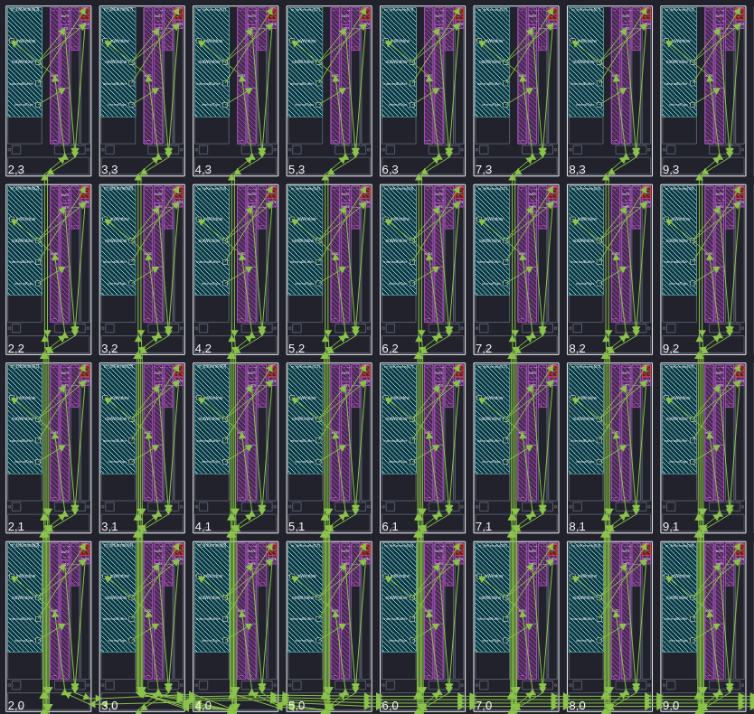

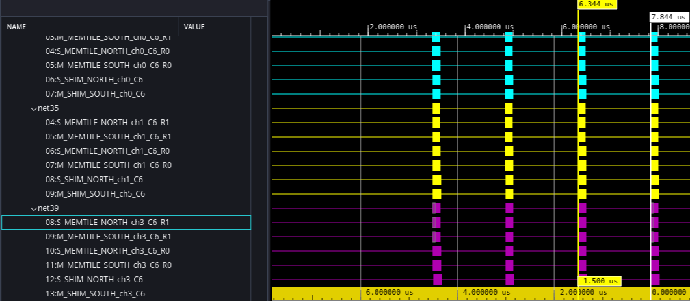

### IFFT-2D Library Characterization

Compile and simulate the design to confirm it works as you expect.

```
[shell]% cd <path-to-design>/aie/ifft4096_2d
[shell]% make clean all
[shell]% vitis_analyzer aiesimulator_output/default.aierun_summary
```

Inspecting vitis_analyzer, note the resource count of 16 AIE-ML v2 tiles.

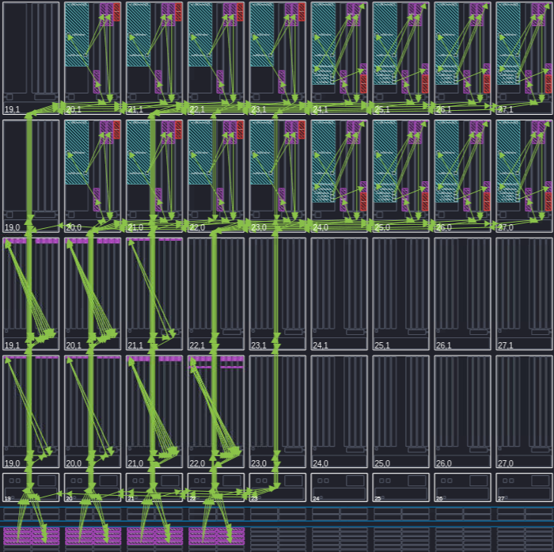

Achieved throughput for:

- Front 64-point IFFT + point-wise twiddle multiplication = 2731 MSPS
- Back 64-point IFFT = 3436 MSPS

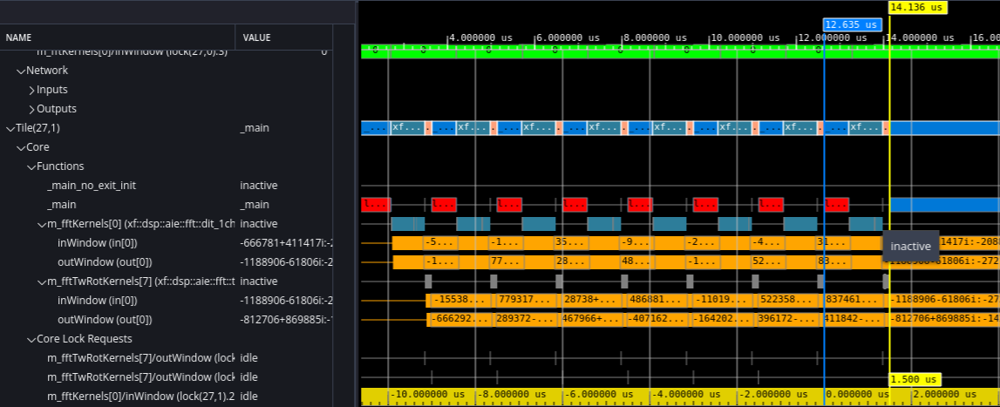

**Performance Comparison with Original Design:**

| Metric | Original (AIE-ML) | Ported (AIE-ML v2) | Improvement |
|--------|-------------------|-------------------|-------------|
| Front 64-pt IFFT + Twiddle | 2386 MSPS | 2731 MSPS | +14% |
| Back 64-pt IFFT | 2376 MSPS | 3436 MSPS | +45% |
| AI Engine Tiles | 16 | 16 | Same |
| Memory Tiles | 6 | 7 | +1 |

Note: Minor difference in the number of memory tiles. This is due to the different design floorplan and the different number of available rows.

### Design Summary

- TDM FIR uses 32 AI Engine tiles, leveraging newly introduced Vitis Library packet switching IP.
- The 4k-pt IFFT is implemented using 2D architecture (with Mode 1), with resources split between:
    -  16 AI Engine tiles (compute)
    -  Seven memory tiles (front transpose and back transpose)
    -  PL (middle transpose)
- From a bandwidth perspective, the design requires two input and four output streams.
- Custom HLS blocks (packet_sender and packet_receiver) interface with AI Engine packet switching IP.
- Output ports of AI Engine going to PL can arrive at different times causing minor throughput loss. You can compensate by adding FIFOs during the v++ linking step [Specifying-Streaming-Connections](https://docs.amd.com/r/en-US/ug1701-vitis-accelerated-embedded/Specifying-Streaming-Connections).


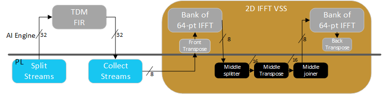

## Design Resources

The following figure summarizes the AI Engine and PL resources required to implement the design in the VE3858 device on the VEK385 eval board. The design uses 48 AI Engine tiles for compute and seven Memory Tiles for transpose operations.
The PL design includes the resources required to implement the DMA Source, Packet Sender/Receiver, Memory Transpose, and DMA Sink kernels.

Compared to the original design on VEK280, this design achieves better performance on VEK385 with the same AI Engine tile count, demonstrating the efficiency gains of AIE-ML v2 architecture.

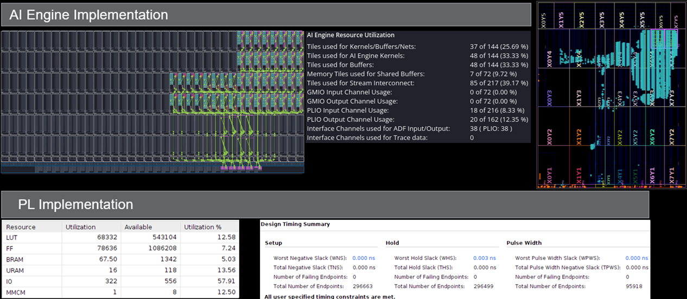

## Build and Run the Design

You can build the polyphase channelizer design from the command line.

### Setup and Initialization
> [!NOTE]
> This tutorial has only been tested and verified on a **Rev-A VEK385** board.
> Other board revisions may require different image files or adjustments to these steps. 

IMPORTANT: Before beginning the tutorial, ensure you have completed the following:

- Installed AMD Vitis™ 2026.1 software and set `PLATFORM_REPO_PATHS` to the value `<Vitis_tools>/base_platforms`.
- Created directory `<path-to-design>/yocto_artifacts` and set environment variable YOCTO_ARTIFACTS to that path.
- From [AMD Embedded Development Framework (EDF) Documentation downloads page](https://edf.docs.amd.com/en/latest/downloads-and-release-notes.html) package 26.06:
  - Downloaded amd-cortexa78-mali-common_meta-edf-app-sdk, run the script and set path output to `<path-to-design>/yocto_artifacts/amd-cortexa78-mali-common_meta-edf-app-sdk/sdk`.
  - Downloaded VEK385 OSPI Image and move into `<path-to-design>/yocto_artifacts/`.
    - For Rev-A board: `edf-ospi-versal-2ve-2vm-vek385-multidomain-20260609231841.bin`
  - Downloaded amd-cortexa78-mali-common_edf-linux-disk-image (SD wic), unzip and move into `<path-to-design>/yocto_artifacts/`.
  - Downloaded amd-cortexa78-mali-common_vek385_qemu_prebuilt, unzip and move `amd-cortexa78-mali-common_vek385_qemu_prebuilt` into `<path-to-design>/yocto_artifacts/`.
    - For Rev-A board: `amd-cortexa78-mali-common_vek385_qemu_prebuilt.tar.gz`

### Hardware Emulation

You can build the channelizer design for hardware emulation using the Makefile as follows:

```
[shell]% cd <path-to-design>
[shell]% make all TARGET=hw_emu
[shell]% make run_emu -C vitis TARGET=hw_emu
```

This takes about 90 minutes to run. The build process generates a folder `package` which contains all the files required for hardware emulation. Hardware emulation then launches and runs producing the outputs shown below. You can apply an optional `-g` can to the `launch_hw_emu.sh` command to launch Vivado waveform GUI to observe the top-level AXI signal ports in the design. Do this by editing [vitis/Makefile](vitis/Makefile) `run_emu` target.

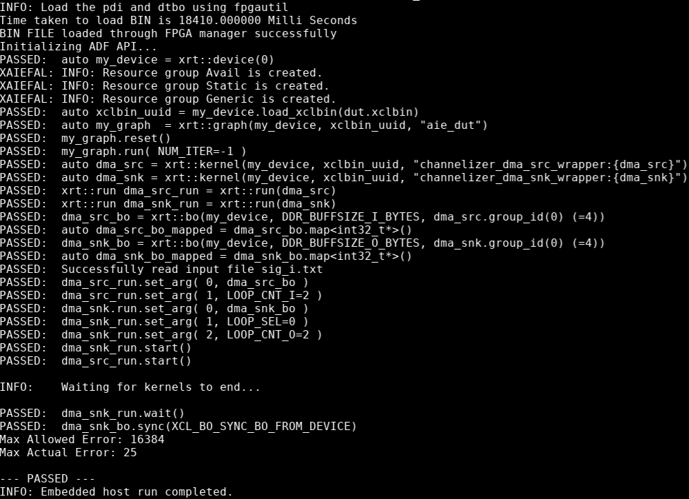

You can measure throughput by inspecting the traces. The design processes eight transforms, each with 4k samples in 13.584 µs. Throughput = 8 x 4096 / 13.584 = 2412 Msps.

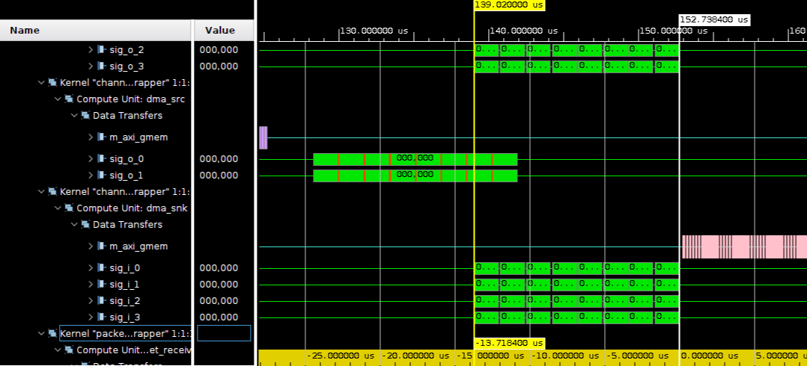

### Hardware

You can build the channelizer design for the VEK385 board using the Makefile as follows:

```
[shell]% cd <path-to-design>
[shell]% make all TARGET=hw
```

The build process generates all the design specific files needed to run the design on hardware in the ```package``` folder.

1. Write the EDF boot firmware (OSPI) to the primary boot device following instructions in [How to Boot a Board Using the Pre-built Images](https://xilinx-wiki.atlassian.net/wiki/spaces/A/pages/3258155011/Discovery+and+Evaluation+AMD+Versal+Device+Portfolio#How-to-Boot-a-Board-Using-the-Pre-built-Images). Find the OSPI image in `<path-to-design>/yocto_artifacts/edf-ospi-versal-2ve-2vm-vek385-multidomain-20260609231841.bin`.
2. Write `<path-to-design>/yocto_artifacts/edf-platform-disk-image-amd-cortexa78-common.rootfs-20260609231841.wic` to the sd_card using your favorite SD imaging tool (Rufus, Balena Etcher, and Win32DiskImager seem to work well).
3. Put the sd_card in to the board, boot it and log in. (Default username is amd-edf and you will be prompted to set a password.)
4. Determine the IP address of eth0 on the board using `ip addr show eth0`.
5. cd `<path-to-design>/package; scp * amd-edf@<ip_address>:~/`
6. Run the design: `sudo ./embedded_exec.sh`

The following displays on the terminal.

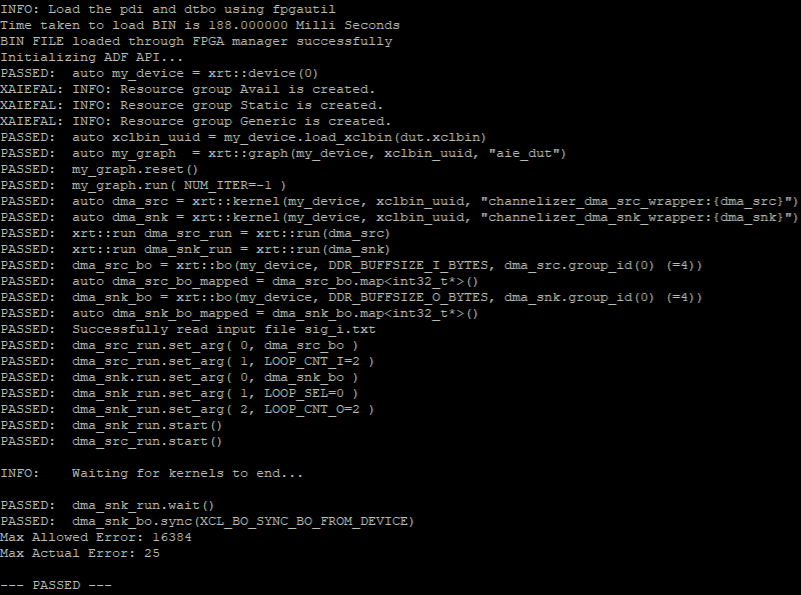

## Summary and Lessons Learned

### Performance Summary

| Platform | Throughput | Improvement | Margin vs. 2000 MSPS Target | Notes |
|----------|-----------|-------------|------------------------------|-------|
| VEK280 (AIE-ML) | ~2250 MSPS | Baseline | 12.5% | Original tutorial |
| VEK385 (AIE-ML v2) | ~2412 MSPS | **+7.2%** | 20.6% | This tutorial - bandwidth-bound by I/O ports |

### AI Engine Placement Summary

Following is a closer look at the placement delta between the VEK280 (AIE-ML) original tutorial compared to VEK385 (AIE-ML v2) shown in this tutorial.

VEK280 (AIE-ML) Original Tutorial

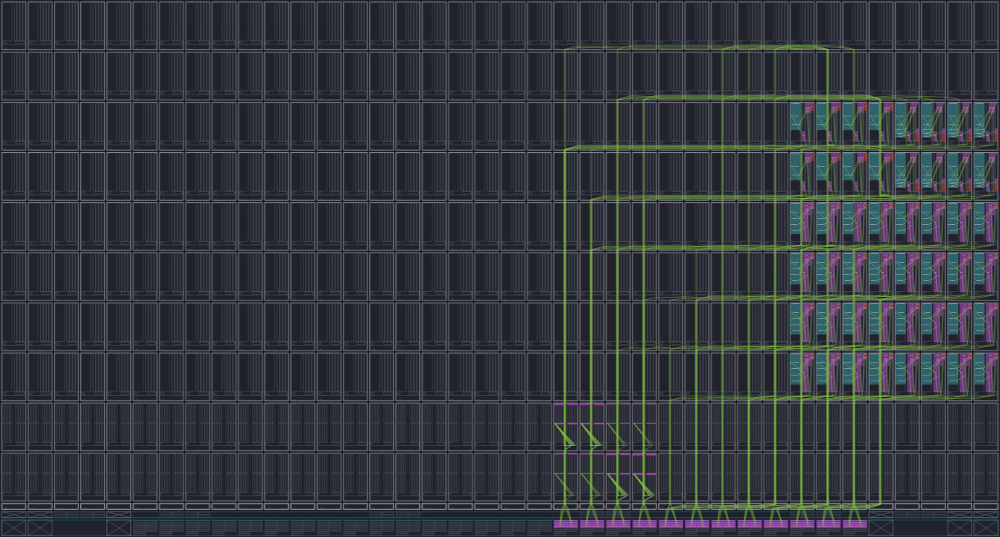

VEK385 (AIE-ML v2)

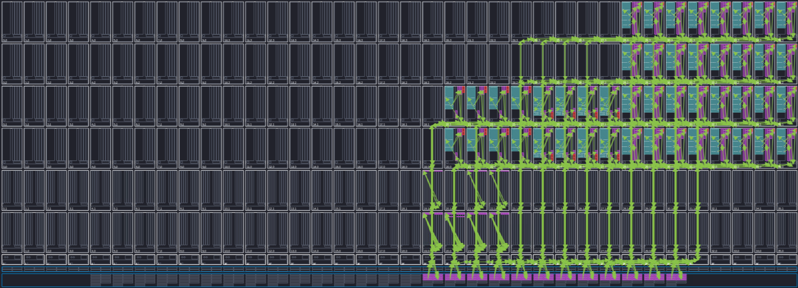

### Lessons Learned from Porting AIE-ML to AIE-ML v2

### What Worked Well

1. **Vitis Libraries Abstraction**: Parameterized DSP IP from [Vitis Libraries](https://docs.amd.com/r/en-US/Vitis_Libraries) allowed re-targeting a different AI Engine variant with minimal code changes
2. **Performance Gains**: AIE-ML v2's architectural enhancements increased throughput margin against the target requirement
3. **Similar AI Engine Tile Count and PL Resources**: Achieved target performance with identical AI Engine tile utilization (48 tiles) and similar PL resources

### Key Porting Considerations

1. **Array Geometry**: Required rethinking placement constraints due to VEK385 having half the rows (4 vs 8). Adapted tile placement for reduced array height while preserving connectivity and performance
2. **Boot Framework**: Usage of EDF/Segmented Configuration adds a learning curve compared to traditional boot flow

## Support

GitHub issues are used for tracking requests and bugs. For questions, go to [Support](https://adaptivesupport.amd.com/s/?language=en_US).

## License

<p class="sphinxhide" align="center"><sub>Copyright © 2023-2026 Advanced Micro Devices, Inc.</sub></p>
<p class="sphinxhide" align="center"><sup><a href="https://www.amd.com/en/legal/copyright.html">Terms and Conditions</a></sup></p>
