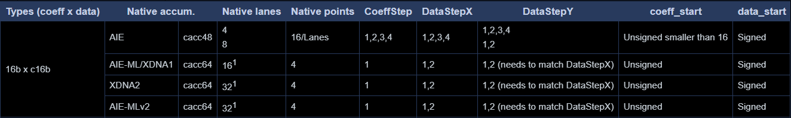
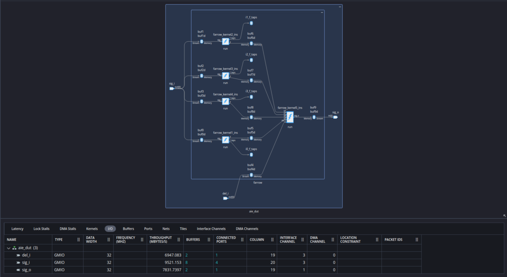
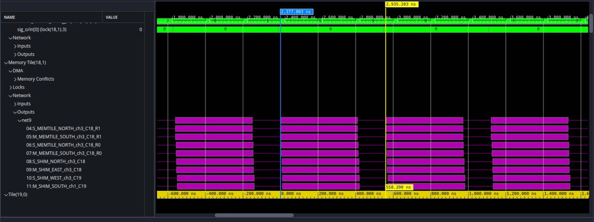
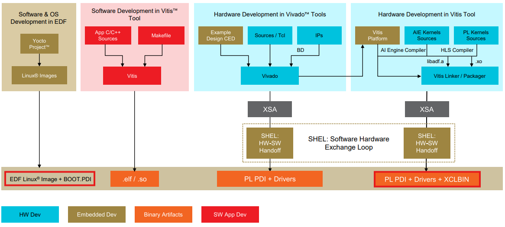

<table class="sphinxhide" style="width:100%;">
  <tr>
    <td align="center">
      <picture>
        <source media="(prefers-color-scheme: dark)" srcset="https://raw.githubusercontent.com/Xilinx/Image-Collateral/main/logo-white-text.png">
        
      </picture>
      <h1>AMD Vitis™ AI Engine Tutorials</h1>
      <a href="https://www.amd.com/en/products/software/adaptive-socs-and-fpgas/vitis.html">See Vitis™ Development Environment on amd.com</a>
        </br>
      <a href="https://www.amd.com/en/products/software/vitis-ai.html">See Vitis™ AI Development Environment on amd.com</a>
    </td>
  </tr>
</table>

# Migrating Fractional Delay Farrow Filter from AIE-ML to AIE-ML v2 Architecture

***Version: Vitis 2025.2***

## Introduction

The *Fractional Delay Farrow Filter* design already exists for the AIE and AIE-ML architectures. This tutorial shows you how to migrate the global memory input/output (GMIO)-based design from the AIE-ML architecture to the AIE-ML v2 architecture.

A fractional delay filter is a common digital signal processing (DSP) algorithm used in many applications, including digital receivers in modems, for timing synchronization.

Before porting to the AIE-ML v2 architecture, learn the Farrow Filter and its implementation details with the AIE architecture.

Study the tutorial **[Fractional Delay Farrow Filter Targeting AIE Architecture](../../../AIE/Design_Tutorials/15-farrow_filter/README.md)** to understand the following:

1. What is a farrow filter?
2. Requirements and AIE system partitioning
3. AI Engine implementation and optimization

Review **[Migrating Fractional Delay Farrow Filter from AIE to AIE-ML Architecture](../../../AIE-ML/Design_Tutorials/06-farrow_filter/README.md)**  to learn migration methods. Port the GMIO-based farrow filter design from the AIE-ML tutorial to the AIE-ML v2 architecture.

The GMIO-based farrow filter design from AIE-ML makes use of the GMIO ports. A GMIO port attribute creates external memory‑mapped connections to or from global memory. These connections link AI Engine kernels to logical global memory ports within a hardware platform design. To learn more about how to implement the GMIO interface, review the kernel written in the graph and test bench (`farrow_graph.h` and `farrow_app_adf.cpp`) located in the `<path-to-tutorial>/designs/aie_ml/` directory.

After reviewing the background on the farrow filter design in AIE and AIE-ML, begin porting the design to the AIE-ML v2 architecture. The design requirements remain identical because you are migrating the design to AIE-ML v2 architecture:

|Requirements| |
|---|---|
| Sampling rate | 1 GSPS |
| I/O data type | `cint16` |
| Coefficients data type | `int16` |
| Delay input data type | `int16` |

**IMPORTANT**: Before starting the tutorial, read and follow the *Vitis Software Platform Release Notes* (v2025.2) to set up the software and install the VEK385 base platform.

Run the following steps:

1. Set the `YOCTO_ARTIFACTS` environment variable to the AMD EDF from the embedded platforms download page [EDF Packages](https://www.xilinx.com/support/download/index.html/content/xilinx/en/downloadNav/embedded-design-tools.html).
2. Set the `PLATFORM_REPO_PATHS` environment variable to the location where you downloaded the platform.

Follow these instructions to port the design from AIE-ML on VEK280 to AIE-ML v2 on VEK385:

* Change `platform` in [Top Makefile](Makefile) from `xilinx-vek280_base` to `vek385_base`.
* For Versal AI Edge Series Gen 2, AMD tools default to [Segmented Configuration](https://docs.amd.com/r/en-US/ug1273-versal-acap-design/Segmented-Configuration) and [AMD Embedded Development Framework (EDF)](https://docs.amd.com/r/en-US/ug1304-versal-acap-ssdg/Embedded-Development-Framework-for-Versal-Prime-Series-Gen-2-and-Versal-AI-Edge-Series-Gen-2-Devices).
* Segmented configuration boots processors in a Versal device and accesses double data rate (DDR) memory before configuring the programmable logic (PL). Boot using a primary firmware image, such as the pre‑built `VEK385 EDF boot firmware Image (OSPI) Image` from [Versal AI Edge Series Gen 2 VEK385 HeadStart Board Early Access Secure Site](https://account.amd.com/en/member/vek385-board-ea.html#tabs-bdeb221ec4-item-2b4db1da1e-tab). Use a secondary image built with Yocto Linux, found in the same location as `EDF Linux® BSP Common SD-Card Image for Cortex A78 devices`. Generate the device tree overlay `pl.dtbo`, using `sdtgen` and `lopper`. After completing these steps, transfer the necessary files to boot and run the design on hardware using `scp`. Load `pl-aie.pdi` and the device tree using `fpgautil`. Execute the host program, pointing to `dut.xclbin`, to run the design on hardware.

## Table of Contents

- [Migrating the Design from AIE-ML to AIE-ML v2 architecture](#migrating-the-design-from-aie-ml-to-aie-ml-v2-Architecture)
- [Analyze the Reports](#analyze-the-reports)
- [Building and Running the Design on the Board](#building-and-running-the-design-on-the-board)

### Objectives

* Migrate the farrow filter from AIE-ML to AIE-ML v2 architecture
* Analyze the design to demonstrate enhancements in AIE-ML v2
* Implement the design using the Vitis tool
* Run the design on the board

### Migrating the Design from AIE-ML to AIE-ML v2 Architecture

#### Change the Project Path

Switch the device from AIE-ML to AIE-ML v2. Compile the design to confirm it compiles without errors. Enter the following command to navigate to the project path of the final AIE-ML design:

```
cd <path-to-tutorial>/designs/farrow_final_aie-ml
```

Make sure to set the `PLATFORM_REPO_PATHS` environment variable.

#### Source the Vitis Tool

Enter the following command to source the Vitis tool:

```
source /<TOOL_INSTALL_PATH>/Vitis/2025.2/settings.sh
```

#### Update the Makefile to switch the device from AIE-ML to AIE-ML v2

Open the Makefile and modify the platform as shown in the following:

```
PLATFORM_USE	  := vek385_base_reva
```

Save the file. 

Note: Set the platform for the appropriate board revision. Your revision can be different than the one in this tutorial. 

#### Compile and Simulate the Design

Enter the following command to navigate to the aie-ml directory to compile and simulate the design:

```
cd aie-ml
```

Enter the following command to compile (x86compile) and simulate (x86sim) to verify the functional correctness of the design:

```
$ make x86compile
$ make x86sim
$ make check_sim_output
```

After running the last command, view the console output shown in the following example:

```
Max error LSB = 1
```

In this GMIO-based design, write data to memory. First, read the output from global memory and then write it to a file. Perform AI Engine emulation using the SystemC simulator by running the following sequence of commands:

```
$ make compile
$ make sim
$ make check_sim_output
```

After running the last command, view the console output shown in the following example:

```
Max error LSB = 1
```

Because the AIE-ML v2 architecture supports the API functions and data-types used in the farrow filter design from the AIE-ML tutorial, no code changes were necessary to compile and simulate the ported design.

The following figure shows the supported parameters type (coeff x data) for AIE and AIE-ML architecture. **coeff** is *int16* and **data** is *cint16*.



Review the simulation results to determine if we need to make changes to the code to satisfy the design requirements listed in the Introduction.

### Analyze the Reports
Enter the following command to launch Vitis Analyzer and review the reports:

```
$ vitis_analyzer aiesimulator_output/default.aierun_summary
```


Graph view shows the five kernels (four for filters and one for final computation). Select the I/O tabs as shown in the above diagram. Observe the Throughput column in the I/O tab.

The output GMIO port throughput shows the value 7831.7397. Divide this throughput value by four because the data type used is `cint16`, which is four bytes in size. The result for the throughput value is 1957.53 MSPS.

Make a more accurate throughput measurement by measuring the steady state achieved in the final graph iteration. In `vitis_analyzer`, select the trace view and set markers to measure the throughput of this final iteration. 

Because each graph iteration processes 1024 samples, throughput is 1024/0.5582 = **1834.47 MSPS**.

Note: In the graph, select the output port that shows the net name, which in this case is net9.


The design was able to meet the desired 1 GSPS by ~2x. This is because of the increase in compute capacity as there are more multipliers in the AIE-ML v2 architecture compared to previous architectures. No additional code changes are necessary to meet the design requirements.

After reviewing the report, close Vitis Analyzer.

Run the script which reads the II from the compiler log for each tiles.

```
$ make get_II
```

The following is the console outputs:

```
*** [LOOP_II] *** Tile 19_1 minII = 3 achieves II = 3
*** [LOOP_II] *** Tile 19_1 minII = 3 achieves II = 3
*** [LOOP_II] *** Tile 19_1 minII = 3 achieves II = 3
*** [LOOP_II] *** Tile 19_3 minII = 16 achieves II = 16
*** [LOOP_II] *** Tile 20_0 minII = 16 achieves II = 16
*** [LOOP_II] *** Tile 20_1 minII = 16 achieves II = 16
*** [LOOP_II] *** Tile 20_2 minII = 16 achieves II = 16
```

The implementation of `farrow_kernel1.cpp` spans across tiles 19_1, 19_3, 20_0, 20_1, and 20_2. Based on the previous results, these tiles achieved an II of 16 for each of their respective for loops. Without any code optimizations, upgrading the AIE architecture results in almost 1/2 the II from AIE-ML.

### Building and Running the Design on the Board

#### Review of Tool Flow 

The following diagram shows the EDF flows. The flow we use in this tutorial called "Hardware Development in Vitis tool flow." This flow covers the development stages for AI kernels, PL kernels, and PS code. After you complete the development of AIE kernels and PL kernels, the subsequent step involves linking `libadf.a` and all `.xo` kernels with the designated platform. You then package the linker output (including `.xsa` and `host.exe`) together. This generate `.xclbin`, `.dtbo`, and `.pdi` files you need to program the board.
  


#### Setup and Initialization

IMPORTANT: Before beginning the tutorial, download and install the following:

* Installed AMD Vitis™ 2025.2 software and set `PLATFORM_REPO_PATHS` to the value `<Vitis_tools>/base_platforms`.
* Created directory `<path-to-design>/yocto_artifacts` and set environment variable YOCTO_ARTIFACTS to that path.
* From [Embedded Development Framework (EDF) downloads page](https://www.xilinx.com/support/download/index.html/content/xilinx/en/downloadNav/embedded-design-tools.html) package 25.11:
  * Downloaded EDF Application & Machine SDK, run the script and set path output to `<path-to-design>/yocto_artifacts/amd-cortexa78-mali-common_meta-edf-app-sdk/sdk`.
  * Downloaded SD/WIC Linux Image VEK385 and move them to `<path-to-design>/yocto_artifacts/amd-cortexa78-mali-common_edf-linux-disk-image`.
  * Downloaded EDF QEMU File Set for Versal™ AI Edge Series Gen 2 VEK385 evaluation board, unzip and move `amd-cortexa78-mali-common_vek385_qemu_prebuilt` into `<path-to-design>/yocto_artifacts/`.

##### Host Code with XRT APIs

The recommendation is to use the XRT APIs for the host code. Review the code to view the XRT APIs and then build the project and run it on board. Run the following command to change project path:

```
$ cd ../ps_apps/hw_emu
```

Review the `host.cpp` file. The XRT profiling API is also used to measure the throughput of the design.

###### Hardware Emulation

Enter the following command to build the design for hardware emulation:

```
$ cd <path-to-tutorial>/designs/farrow_final_aie-ml/
$ make clean all TARGET=hw_emu
```

This takes about 20 minutes to run.

```
...
PASSED:  auto xclbin_uuid = my_device.load_xclbin(dut.xclbin)
PASSED:  auto my_graph  = xrt::graph(my_device, xclbin_uuid, "aie_dut")
PASSED:  my_graph.reset()
GMIO::malloc completed
PASSED:  xrt::aie::profiling handle(my_device);

INFO:    Started profiling timers...

PASSED:  my_graph.run( ITERATION=4 )
Throughput of the graph: 7831.74 MB/s
Throughput of the graph: 1957.93 MSPS
--- PASSED ---
GMIO transactions finished
INFO: Embedded host run completed.
...
```

Note: You can ignore the warnings.

To exit the QEMU, press Ctrl A + X. After the hardware emulation run is complete, you can analyze the reports in Vitis Analyzer.

###### Hardware Run

Enter the following command to build the design for hardware validation:

```
$ cd <path-to-tutorial>/designs/farrow_final_aie-ml/
$ make clean all TARGET=hw
```

The build process generates all the design specific files needed to run the design on hardware in the ```package``` folder.

1. Write the EDF boot firmware (OSPI) to the primary boot device following instructions [here](https://xilinx-wiki.atlassian.net/wiki/spaces/A/pages/3258155011/AMD+EDF+Getting+started+-+Discovery+and+Evaluation+AMD+Versal+device+portfolio#Writing-the-EDF-boot-firmware-to-the-primary-boot-device-%2F-media-using-System-Controller-(SC)). You can find the OSPI image in `<path-to-design>/yocto_artifacts/amd-cortexa78-mali-common_vek385_qemu_prebuilt/qemu-ospi-versal-2ve-2vm-vek385-sdt-seg.bin`.
2. Write `<path-to-design>/yocto_artifacts/amd-cortexa78-mali-common_edf-linux-disk-image/edf-linux-disk-image-amd-cortexa78-mali-common.rootfs.wic` to sd_card using your favorite SD imaging tool (Balena Etcher and Win32DiskImager seems to work well).
3. Put the sd_card in to the board, boot it and log in. (default username is amd-edf and you will be promted to set a password)
4. On your terminal application, determine the IPv6 address eth0 on the board by typing `ip addr show eth0`.
5. cd `<path-to-design>/package; scp -6 * amd-edf@<ipv6_address>:~/`
6. Run the design: `sudo ./embedded_exec.sh`

Note: If you need to change the permissions of the files in the home directory, run the **"chmod +x *"** command. The following displays on the terminal:

```
...
PASSED:  auto xclbin_uuid = my_device.load_xclbin(dut.xclbin)
PASSED:  auto my_graph  = xrt::graph(my_device, xclbin_uuid, "aie_dut")
PASSED:  my_graph.reset()
GMIO::malloc completed
PASSED:  xrt::aie::profiling handle(my_device);

INFO:    Started profiling timers...

PASSED:  my_graph.run( ITERATION=4 )
Throughput of the graph: 8572.62 MB/s
Throughput of the graph: 2143.16 MSPS
--- PASSED ---
GMIO transactions finished
INFO: Embedded host run completed.
...
```

Note: You can ignore the warnings.

## Comparison of AIE & AIE-ML vs AIE-ML v2 Farrow Filter Design Implementation

The following table compares the farrow filter implementation across AIE, AIE-ML, and AIE-ML v2 architectures. Notice that AIE-ML v2 requires about twice the tiles for kernel computation compared to AIE. It needs two more tiles than AIE-ML architecture, yet delivers almost twice the performance.

| Design                  | Tiles for AIE Kernels | Tiles for Buffers | Total Tiles |  Throughput         | Relative MSPS per tile |
|-------------------------|-----------------------|-------------------|-------------|---------------------|------------------------|
| farrow - AIE (PLIO)     |       2               | 5                 | 5           | 1138 MSPS (HW_EMU)  | 227.6                  |
| farrow - AIE-ML (GMIO)  |       5               | 8                 | 8           | 1061 MSPS (HW_EMU)  | 132.6                  |
| farrow - AIE-MLv2 (GMIO)|       5               | 10                | 10          | 1958 MSPS (HW_EMU)  | 195.8                  |

```* Total Tiles: Represents the total count of tiles, including those that have both kernels and buffers within the same tile.```

## Conclusion

This tutorial has demonstrated the following:

- How to migrate the design from AIE-ML Engine to AIE-ML v2 architecture.
- How to analyze the design implementation and throughput with Vitis Analyzer and Hardware Emulation
- Running the design on the board.

<hr class="sphinxhide"></hr>

<p class="sphinxhide" align="center"><sub>Copyright © 2026 Advanced Micro Devices, Inc.</sub></p>

<p class="sphinxhide" align="center"><sup><a href="https://www.amd.com/en/corporate/copyright">Terms and Conditions</a></sup></p>
