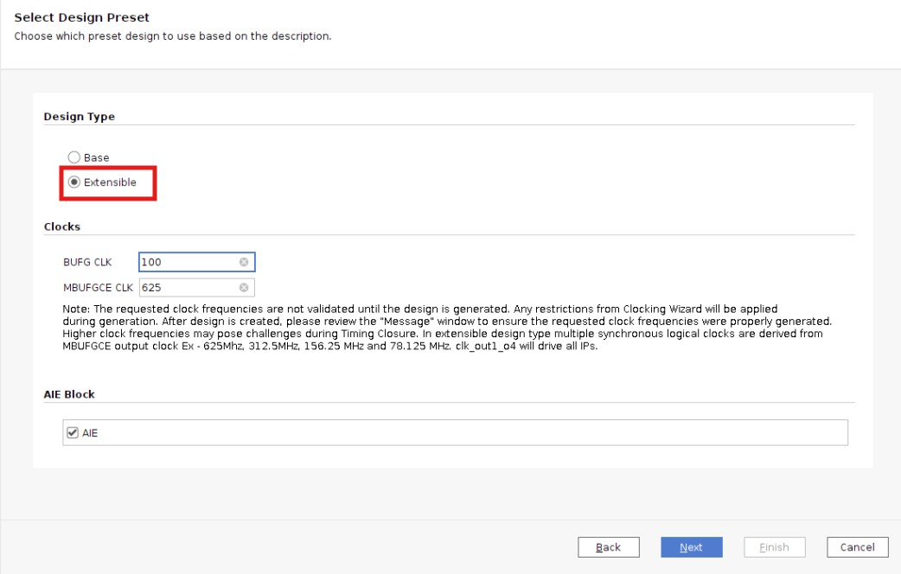
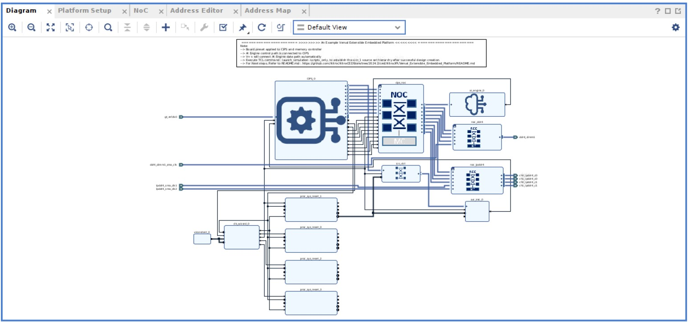
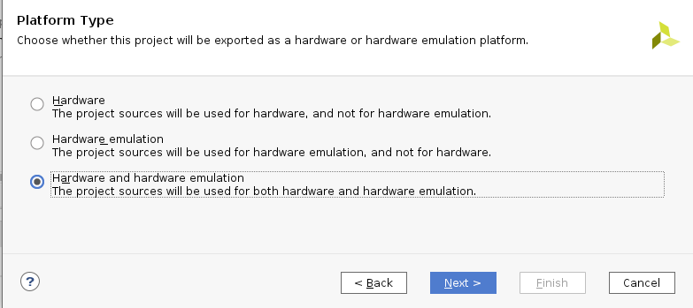
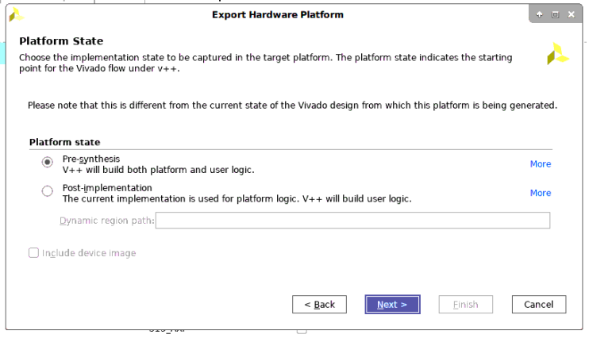
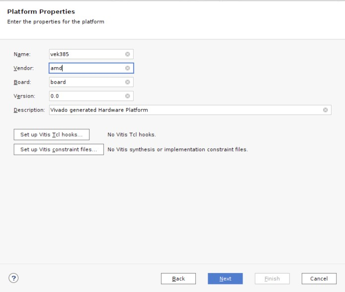
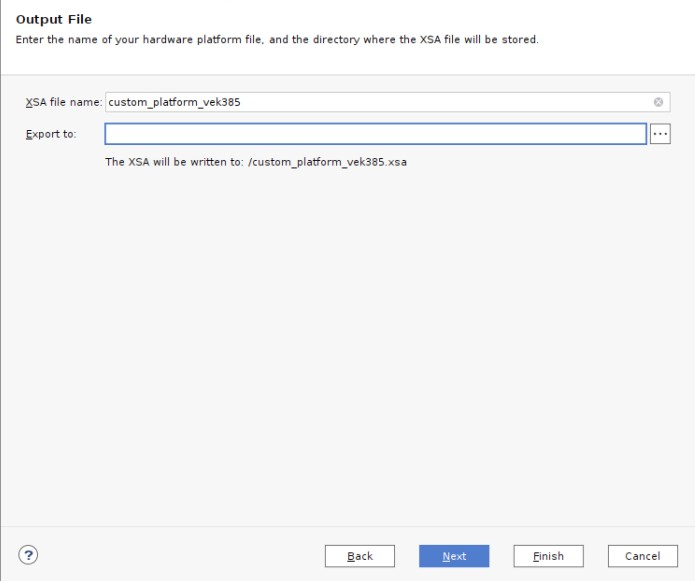
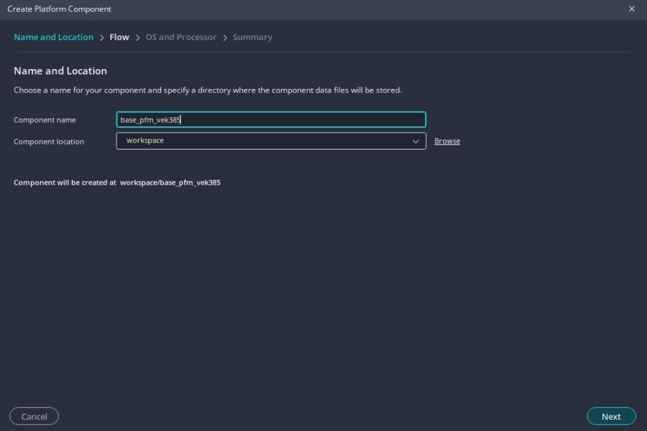
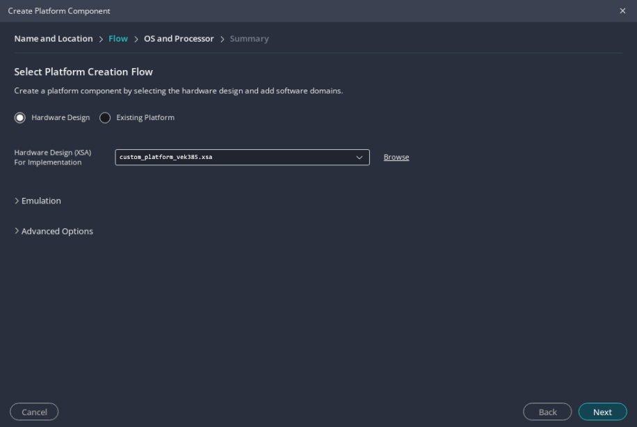
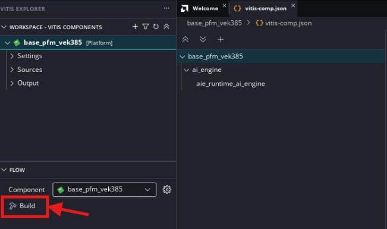

<table class="sphinxhide" style="width:100%;">
  <tr>
    <td align="center">
      <picture>
        <source media="(prefers-color-scheme: dark)" srcset="https://raw.githubusercontent.com/Xilinx/Image-Collateral/main/logo-white-text.png">
        
      </picture>
      <h1>AMD Vitis™ AI Engine Tutorials</h1>
      <a href="https://www.amd.com/en/products/software/adaptive-socs-and-fpgas/vitis.html">See Vitis™ Development Environment on amd.com</a>
         
      <a href="https://www.amd.com/en/products/software/vitis-ai.html">See Vitis™ AI Development Environment on amd.com</a>
    </td>
  </tr>
</table>

# Custom Platform Creation

## Platforms

A platform is the starting point of your design and will be used to build Vitis software platform applications.

>**NOTE**: AMD recommends using the VEK385 base platform provided on the Versal AI Edge Series Gen 2 VEK385 HeadStart Board Early Access Secure Site as a starting point for designs. This page is intended for users who would like to understand how the base platform is generated. Other users can start directly from [AI Engine Development](./02-aie_application_creation.md).

In this first section of the tutorial, an example of how to create a new platform is shown. This starts with building the hardware system using the AI Engine in the AMD Vivado™ Design Suite.

This is in most ways a traditional AMD Vivado™ design. You are building the platform, that is, the part of the design that you do not want the Vitis tools to configure or modify. This can include completely unrelated logic, any hierarchy you want to have in the design, but there are some rules that you must follow:

- Your design must contain an IP integrator block diagram containing the CIPS, NOC, and other infrastructure IP.
- Your design must have at least one clock that you will expose to Vitis for use with any kernels that it adds.
This clock must have an associated `proc_sys_reset` block.

This tutorial targets the VEK385 board

### Step 1: Build the AMD Versal™ Extensible Embedded Platform Example Design in Vivado

1. Launch Vivado IDE, and select ***Open Example Project*** from the Welcome window. You can also do it by clicking ***File*** from the menu, and select ***Project*** and then ***Open Example***.

2. Click ***Next*** to skip the first page of the wizard. In the template selection page, select the ***Versal Embedded Common Platform*** template. Click ***Next***.

3. Name this project as ***custom_pfm_vek385*** and click ***Next***.

4. In the part selection page, select the **VEK385 Evaluation Platform**. Click ***Next***.

5. In the design preset page, change the **Design Type** to **Extensible** and keep the default settings for the clocks:

      

6. Click **Next** and ***Finish*** to complete the example design creation phase, and this will open up the Vivado project with the template design you just created. You can open the block design to view the details of the platform design. By using the pre-built template, you can easily get a validated hardware design of the platform to move on to the next step. In your real design development procedure, you can use this as a baseline design and make further modifications on top of it.

      

7. Click ***Generate Block Design*** from the Flow Navigator panel on the left, click ***Generate***, and wait for the process to complete.

>**NOTE**: A critical warning is displayed by Vivado when generating the Block Design. This is due to the fact that the Interrupt Controller IP has an unconnected input. This can be ignored as this input will be connected automatically by Vitis later in the flow.

8. Click ***File*** from the menu, and select ***Export*** > ***Export Platform***.

   a. On the second page, select ***Hardware and hardware emulation*** as the platform type.

      

   b. On the third page select ***Pre-synthesis***.

      

   c. On the fourth page, add the name of the platform.

      

   d. On the fourth page, set the name of the XSA, and click ***Finish***.

      

9. Close the Vivado project after platform export process finishes.

> Note:  The vivado platform creation can be automated by running "make vivado_platform"

### Step 2: Build the Platform in the Vitis Software Platform

1. Open the Vitis Unified IDE, and select a workspace.

2. On the Welcome Page, select ***Create Platform Component***, or select ***File → New Component →  Platform***.

3. Set the platform component name to ***base_pfm_vek385*** and click ***Next***.

      

4. Select ***Hardware Design*** and use the XSA generated during the previous step and click ***Next***

     

5. Set the Operating System to  ***aie_runtime*** and the Processor to ***ai_engine*** and click ***Next***. Then click ***Finish*** to create the platform component.

      

6. Then build the platform by clicking on ***Build*** In the flow navigator with the base_pfm_vek385 component selected.

      

      >**NOTE**: If you modify the XSA file later, go to vitis-comp.json located in the Settings folder of the platform component and click ***switch xsa***

7. The generated platform can be found in `workspace/base_pfm_vek385/export`.

In this step, you created the platform starting with building the hardware platform in the Vivado Design Suite. Then, you built the platform in the Vitis software platform, based on the exported XSA file.

> Note:  The vivado platform creation can be automated by running "make vitis_platform"

In the next step, you will build an AI Engine application using this platform.

<b><a href="./README.md">Return to Start of Tutorial</a> — <a href="./02-aie_application_creation.md">Go to AI Engine Development</a></b>

Copyright © 2025 Advanced Micro Devices, Inc.

<a href="https://www.amd.com/en/corporate/copyright">Terms and Conditions</a>

