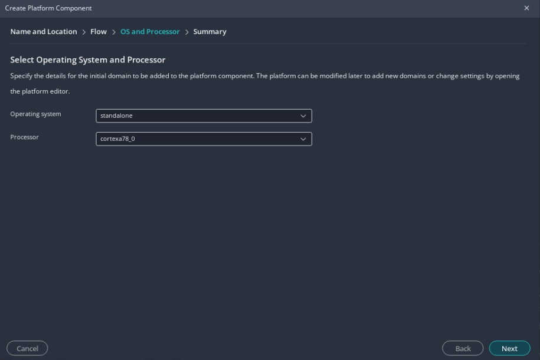
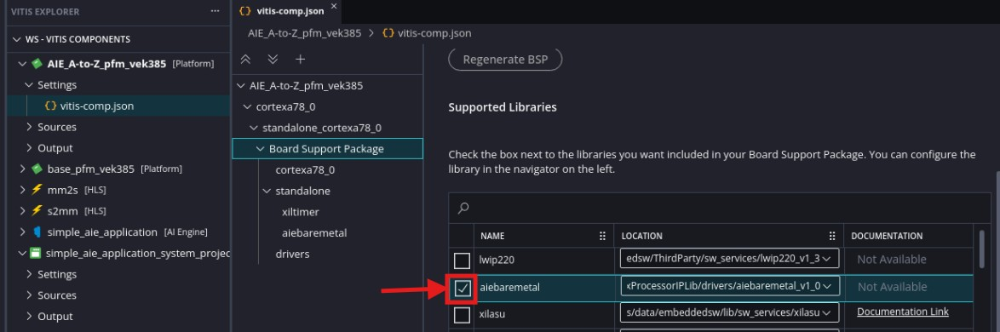
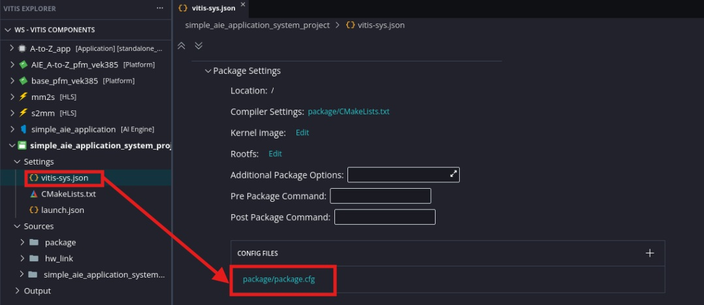
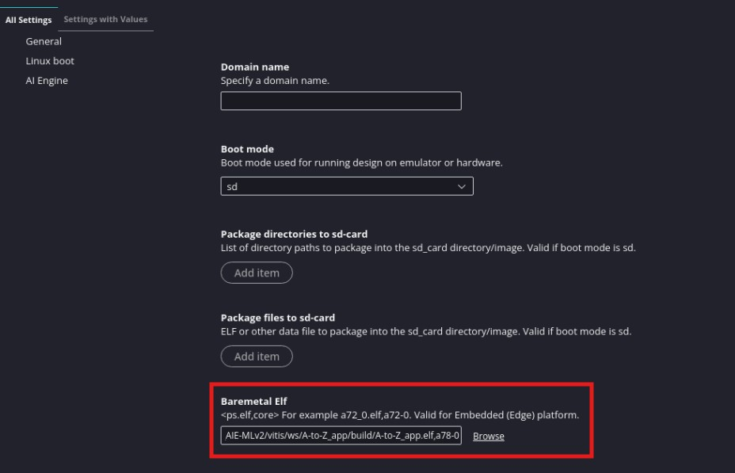
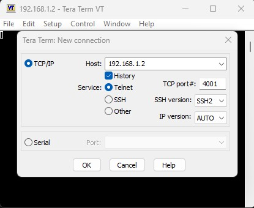

<table class="sphinxhide" style="width:100%;">
  <tr>
    <td align="center">
      <picture>
        <source media="(prefers-color-scheme: dark)" srcset="https://raw.githubusercontent.com/Xilinx/Image-Collateral/main/logo-white-text.png">
        
      </picture>
      <h1>AMD Vitis™ AI Engine Tutorials</h1>
      <a href="https://www.amd.com/en/products/software/adaptive-socs-and-fpgas/vitis.html">See Vitis™ Development Environment on amd.com</a>
        </br>
      <a href="https://www.amd.com/en/products/software/vitis-ai.html">See Vitis™ AI Development Environment on amd.com</a>
    </td>
  </tr>
</table>

# Introduction: PS Application Creation and Run

In this section of the tutorial, you will learn how to build a PS bare-metal application using the XSA created in the previous step, and then build, as well as run the complete system.

## Step 1: Create a New Platform in the Bare-metal Domain

1. In the Vitis Unified IDE with the same workspace directory as the previous step. Click ***File → New Component →  Platform***.

2. Set the Platform Project Name to **AIE_A-to-Z_pfm_vek385**, and click **Next**.

3. Use the XSA generated in the previous step that you can find in `simple_aie_application_system_project/build/hw/hw_link/binary_container_1.xsa`

   

4. Set **standalone** as the **Operating system**, **psv_cortexa78_0** as the **Processor** and click **Finish**.

   

5. Open the platform setting file (vitis_comp.json) and open the Board Support Package for the cortexa78_0 and enable the **aiebaremetal** library

   

6. Build the platform.

## Step 2. Build the Baremetal AI Engine Control Application

1. Create a new application by clicking ***File → New Component → Application***.

2. Set the name for the application to `A-to-Z_app` and click ***Next***.

3. Select **AIE_A-to-Z_pfm_vek385** as the platform and click ***Next***.

4. Select the A78_0 processor domain (`standalone_psv_cortexa78_0`), and click ***Next*** and then ***Finish***.

5. Right-click the `src` folder under the **A-to-Z_app** project, and click ***Import → Files***.

6. Import the `baremetal_metadata_compile.cpp` file from the output of the AI Engine application project (`simple_application/build/hw/Work/baremetal_metadata_compile.cpp`).

7. Import `main.cpp` from the `src` folder from the git repository.

      Go through the `main.cpp` file. You can see that the code is initializing the input data and the memory space for the output data. One thing to note is the use of the `.run()` API to control the AI Engine.

      ```
      printf("Running Graph for 4 iterations\n");
      gr.run(4);
      ```

      There are two options to enable an AI Engine graph from a system:

      * Enable the graph in the PDI. This means that the graph will be started during BOOT and will run forever.
      * Enable the AI Engine graph from the PS program using the `<graph>.init()` and `<graph>.run()` APIs. This is what you are using in this case.

8. Modify the Linker Script to increase the heap size for AIE library.

      * In the Project Explorer, expand the A-to-z_app component.

      * In the src directory, double-click `lscript.ld` to open the linker script for this project.

      * In the linker script modify the Heap size to `0x100000` (1MB).

    

12. Build the A72 PS component (`A-to-Z_app`).

> Note:  The creation of the Vitis fixed platform and the ps application can be automated running "make ps_app"

## Step 3: Package the Full System

1. Open the settings file **vitis-sys.json** for the **simple_aie_application_system_project** and click on the **package.cfg** config file under **Package Settings**

   

2. In the **General** Section, in the Baremetal Elf setting add the following to tell the packager to add the application executable and run it on the A72 processor

      `../../../../A-to-Z_app/build/A-to-Z_app.elf,a78-0`

   

3. In the **AI Engine section** select the option **Do not enable cores**

       

      >**NOTE:** The option will add the line --package.defer_aie_run in the package
       configuration file. This is required when running the AI Engine graph from th
       e PS (see the [AI Engine Tools and Flows User Guide (UG1076)](https://docs.amd.com/r/en-US/ug1076-ai-engine-environment/Integrating-the-Application-Using-the-Vitis-Tools-Flow)).
      If the user is looking for a free running graph, this option should be disabled

4. In the **AI Engine section** deselect the option **Enable debug**

   

   >**NOTE:** This option is used when running the debugger. In our case, we will just run the system without using the debugger

5. Build the **simple_aie_application_system_project** project for Hardware (Click ***Build All*** under **HARDWARE** in the Flow navigator).

## Step 4: Run or Debug the System in Hardware using JTAG
We will now test our system first by booting it through JTAG. As discussed previously, the segmented flow will use two PDI files; boot and PLD. The AIE binaries are applied to the PLD PDI. We have to tell the IDE to use both of them
Due to a limitation in the Vitis IDE in 2026.1, the run needs to be launched through XSDB instead of the IDE

1. Power up the board

The output will be send to UART0. 

2. If you are using a Rev B. board, open a serial terminal to get the UART0. If you are using a RevA, the UART0 is not available through the serial interfaces but is routed to the System Controller for remote UART functionality. To access it, log in to the system controller and set an IP address for the PS ethernet inteface and an IP address of the same network group to your PC (for example 192.168.1.2 and 192.168.1.1). Then open a Telnet Terminal (for example in tera term) and connect to 192.168.1.2:4001 to get the UART0 terminal

   

3. Start xsdb from the workspace folder and run the following commands:
 ```bash
connect
targets -set -nocase -filter {name =~"APU Cluster #0*"}
rst -system
after 3000
targets -set -filter {name=="PMC" }
device program ./A-to-Z_app/_ide/bootimage/resources/vpl_gen_fixed_boot.pdi
device program ./simple_aie_application_system_project/build/hw/package/package/container.pdi
targets -set -nocase -filter {name =~ "*A78*#0.0"}
rst -processor
dow ./A-to-Z_app/build/A-to-Z_app.elf
con
```
   
## Summary

In this tutorial, you have performed an end-to-end flow to create a platform based on the VEK385 board, added an AI Engine kernel and PL kernels into the system, and built a PS bare-metal application to control the system. Then you have run the system is hardware emulation and hardware.

<p class="sphinxhide" align="center"><sub>Copyright © 2025 Advanced Micro Devices, Inc.</sub></p>

<p class="sphinxhide" align="center"><sup><a href="https://www.amd.com/en/legal/copyright.html">Terms and Conditions</a></sup></p>
