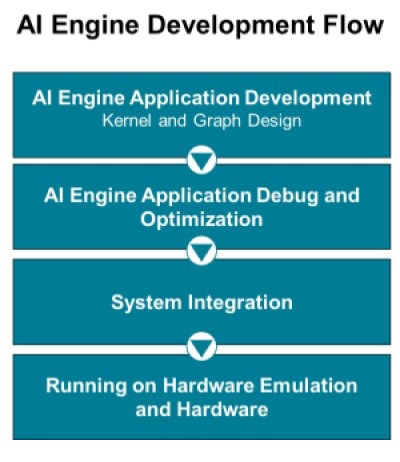

#######################################
AI Engine Development
#######################################

.. sidebar:: More Information

   See AMD Vitis™ Development Environment on `xilinx.com <https://www.xilinx.com/products/design-tools/vitis.html>`_

The tutorials under the AI Engine Development help you learn how to target, develop, and deploy advanced algorithms using a Versal AI Engine array in conjunction with PL IP/kernels and software applications running on the embedded processors. To successfully deploy AI Engine applications in hardware, you need to be aware of the Vitis and AI Engine tools and flows.

* :doc:`Feature Tutorials <./Feature_Tutorials/Feature_Tutorials>` highlight specific features and flows that help develop AI Engine applications.
* :doc:`Design Tutorials <./Design_Tutorials/Design_Tutorials>` showcase the two major phases of AI Engine application development: architecting the application and developing the kernels. Both phases are demonstrated in these tutorials.

Tutorials target the **VCK190** board. The table below lists the tutorials available, and the features and flows showcased in all of these tutorials. The various columns correspond to specific features/flows supported in these tutorials and will help you identify tutorials that showcase specific flows and features that you are interested in.

******************************************
Getting Started
******************************************

AI Engine Documentation
=============================================================

To easily find the right documentation corresponding to the development stage you are at, we recommend you use the `AI Engine Design Process Hub <https://docs.xilinx.com/p/ai-engine-development>`_.

The major documentation for AI Engine includes:

* *Versal ACAP AI Engine Architecture Manual* (`AM009 <https://docs.xilinx.com/r/en-US/am009-versal-ai-engine>`_)
* *AI Engine Tools and Flows* (`UG1076 <https://docs.xilinx.com/r/en-US/ug1076-ai-engine-environment>`_)
* *AI Engine Kernel and Graph Programming Guide* (`UG1079 <https://docs.xilinx.com/r/en-US/ug1076-ai-engine-environment>`_)

AI Engine Training
=============================================================

If you are new with AI Engine, the following training courses can help you understand the architecture and design flow.

* `Designing with Versal AI Engine 1: Architecture and Design Flow <https://xilinxprod-catalog.netexam.com/Search?searchText=Designing+with+Versal+AI+Engine+1>`_
* `Designing with Versal AI Engine 2: Graph Programming with AI Engine Kernels <https://xilinxprod-catalog.netexam.com/Search?searchText=Designing+with+Versal+AI+Engine+2>`_
* `Designing with Versal AI Engine 3: Kernel Programming and Optimization <https://xilinxprod-catalog.netexam.com/Search?searchText=Designing+with+Versal+AI+Engine+3>`_

Environment Settings
=============================================================

.. important:: 

   Before beginning a tutorial, read and follow the `Vitis Software Platform Release Notes <https://docs.xilinx.com/r/en-US/ug1393-vitis-application-acceleration/Vitis-Software-Platform-Release-Notes>`_ (v2023.2) for setting up software and installing the VCK190 base platform.

Run the following steps to set up the environment (do **NOT** apply to tutorials that do not use the VCK190 base platform):

1. Set up your platform by running the ``xilinx-versal-common-v2023.2/environment-setup-cortexa72-cortexa53-xilinx-linux`` script as provided in the platform download. 
   This script sets up the ``SYSROOT`` and ``CXX`` variables. If the script is not present, you **must** run the ``xilinx-versal-common-v2023.2/sdk.sh``.
2. Set up your ``ROOTFS`` to point to the ``xilinx-versal-common-v2023.2/rootfs.ext4``.
3. Set up your ``IMAGE`` to point to ``xilinx-versal-common-v2023.2/Image``.
4. Set up your ``PLATFORM_REPO_PATHS`` environment variable based upon where you downloaded the platform.

Getting Started with AI Engine Development Using the AI Engine Tutorials
==================================================================================================================

If you are new with the AI Engine Architecture and tools, we recommend that you start with the :doc:`A to Z Bare-metal Flow <./Feature_Tutorials/01-aie_a_to_z/README>`, which will guide you through the entire flow from platform creation in AMD Vivado™ to AI Engine application creation, system integration, and testing on Hardware using the Vitis IDE.

AI Engine Application Development
-------------------------------------------------------------------

To get started with AI Engine application development, we recommend that you look at the following tutorials:

* :doc:`DSP Library Tutorial <./Feature_Tutorials/08-dsp-library/README>` which will guide you to create an AI Engine using application using the AMD provided DSP library
* :doc:`AIE DSPLib and Model Composer <./Feature_Tutorials/10-aie-dsp-lib-model-composer/README>` which will also guide you to create an AI Engine using application using the AMD provided DSP library but using the ModelComposer tool which enables easy designs through a MATLAB Simulink environment.
* :doc:`Using GMIO with AIE <./Feature_Tutorials/02-using-gmio/README>` which goes through using the GMIOs for connectivity between the AI Engine and the DDR (through the NoC)
* :doc:`Implementing an IIR Filter on the AIE <./Feature_Tutorials/14-implementing-iir-filter/README>` will guide you into custom kernel coding using a IIR application

The following tutorials describe some features of the AI Engine, which might be useful for your application:

* :doc:`Runtime Parameter Reconfiguration <./Feature_Tutorials/03-rtp-reconfiguration/README>`
* :doc:`Packet Switching <./Feature_Tutorials/04-packet-switching/README>`
* :doc:`Using Floating-Point in the AIE <./Feature_Tutorials/07-AI-Engine-Floating-Point/README>`

AI Engine Application Debug and Optimization
----------------------------------------------------------------------------------------------

After you have written your first AI Engine application you might want to verify the correct functionality of your graphs and kernels using x86 simulation and AI Engine simulation. In this regards, the following tutorials will be useful for you:

* :doc:`Debug Walkthrough Tutorial <./Feature_Tutorials/09-debug-walkthrough/README>` will guide you to analyze the performance of your AI Engine application and help you with debugging functional issues.
* :doc:`AIE Performance and Deadlock Analysis <./Feature_Tutorials/13-aie-performance-analysis/README>` which introduces you to performance analysis and optimization methods, and shows you how synchronization works in graph execution.
* :doc:`Python and C++ External Traffic Generators for AI Engine Simulation and Emulation Flows <./Feature_Tutorials/16-external-traffic-generator-aie/README>`: This tutorial demonstrates how to create external traffic generators as Python scripts or C++ applications to exercise the AI Engine kernels in the x86 simulator, AI Engine simulator, and in hardware emulation.

System Integration
---------------------------------------------------------

When your AI Engine Application meets your expectation (in terms of functionality and performances), it will be the right time to integrate it with the rest of the Versal System. At this stage, the following tutorials will be useful for you:

* :doc:`AIE Versal Integration <./Feature_Tutorials/05-AI-engine-versal-integration/README>` demonstrates creating a system design running on the AI Engine, PS, and Programmable Logic (PL).
* :doc:`Versal System Design Clocking <./Feature_Tutorials/06-versal-system-design-clocking-tutorial/README>` teaches clocking concepts for the Vitis compiler and how to define clocking for an ADF Graph, as well as PL kernels using clocking automation functionality.
* :doc:`Versal Emulation Waveform Analysis <./Feature_Tutorials/11-ai-engine-emulation-waveform-analysis/README>` demonstrates how you can use the AMD Vivado Design Suite logic simulator (XSIM) waveform GUI, and the Vitis analyzer to debug and analyze your design.

******************************************
Available Tutorials
******************************************

Feature Tutorials
============================================

These tutorials target the **VCK190** board. The table below lists the tutorials available, and the features and flows showcased in all of these tutorials. The various columns correspond to specific features/flows supported in these tutorials and will help you identify tutorials that showcase specific flows and features that you are interested in.

.. toctree::
   :maxdepth: 3
   :caption: Feature Tutorials
   :hidden:

   Feature Tutorials <./Feature_Tutorials/Feature_Tutorials>

.. csv-table:: Feature Tutorials
   :header: "Tutorial","Platform","OS","IDE Flow","Libraries Used","HLS Kernel","x86 simulator","aie simulator","SW Emu","HW Emu","HW","Event Trace in HW","Profile in HW"
   :widths: 22, 8, 8, 6, 7, 8, 7, 7, 5, 6, 4, 6, 6

   ":doc:`AI Engine A-to-Z Flow for Linux <./Feature_Tutorials/18-aie_a_to_z_custom_linux_platform/README>`","Base / Custom","Linux","","","MM2S / S2MM","Yes","Yes","Yes","Yes","Yes","",""
   ":doc:`A to Z Bare-metal Flow <./Feature_Tutorials/01-aie_a_to_z/README>`","Custom","Baremetal","Vivado, Vitis IDE","","MM2S / S2MM","","Yes","","Yes","Yes","",""
   ":doc:`Using GMIO with AIE <./Feature_Tutorials/02-using-gmio/README>`","Base","Linux","","","","","Yes","","Yes","Yes","","Yes"
   ":doc:`Runtime Parameter Reconfiguration <./Feature_Tutorials/03-rtp-reconfiguration/README>`","Base","Linux","","","MM2S / S2MM","","Yes","","Yes","Yes","",""
   ":doc:`Packet Switching <./Feature_Tutorials/04-packet-switching/README>`","Base","Linux","","","MM2S / S2MM","","Yes","","Yes","Yes","",""
   ":doc:`AIE Versal Integration <./Feature_Tutorials/05-AI-engine-versal-integration/README>`","Base","Linux","CLI, Vitis Unified IDE","","MM2S / S2MM","Yes","Yes","Yes","Yes","Yes","",""
   ":doc:`Versal System Design Clocking <./Feature_Tutorials/06-versal-system-design-clocking-tutorial/README>`","Base","Linux","","","MM2S / S2MM","","Yes","","Yes","Yes","",""
   ":doc:`Using Floating-Point in the AIE <./Feature_Tutorials/07-AI-Engine-Floating-Point/README>`","Base","Linux","","","","","Yes","","","","",""
   ":doc:`DSP Library Tutorial <./Feature_Tutorials/08-dsp-library/README>`","Base","Linux","","DSPLib","MM2S / S2MM Variant","","Yes","","","","",""
   ":doc:`Debug Walkthrough Tutorial <./Feature_Tutorials/09-debug-walkthrough/README>`","Base","Linux","Vitis IDE","","","Yes","Yes","Yes","Yes","Yes","Yes","Yes"
   ":doc:`AIE DSPLib and Model Composer <./Feature_Tutorials/10-aie-dsp-lib-model-composer/README>`","Base","Linux","Simulink","DSPLib","MM2S / S2MM","Yes","Yes","","","","",""
   ":doc:`Versal Emulation Waveform Analysis <./Feature_Tutorials/11-ai-engine-emulation-waveform-analysis/README>`","Base","Linux","","","Traffic Generators","","","","Yes","","",""
   ":doc:`AXIS External Traffic Generator <./Feature_Tutorials/12-axis-traffic-generator/README>`","Base","Linux","","DSPLib","MM2S / S2MM","","Yes","","Yes","","",""
   ":doc:`AIE Performance and Deadlock Analysis <./Feature_Tutorials/13-aie-performance-analysis/README>`","Base","Linux","","","","","Yes","","Yes","Yes","","Yes"
   ":doc:`Implementing an IIR Filter on the AIE <./Feature_Tutorials/14-implementing-iir-filter/README>`","Base","Linux","Vitis IDE","","","Yes","Yes","","","","",""
   ":doc:`Post-Link Recompile of an AIE Application <./Feature_Tutorials/15-post-link-recompile/README>`","Base","Linux","","","MM2S / S2MM","","Yes","","Yes","Yes","",""
   ":doc:`Python and C++ External Traffic Generators for AI Engine Simulation and Emulation Flows <./Feature_Tutorials/16-external-traffic-generator-aie/README>`","Base","Linux","","","MM2S / S2MM / PolarClip","Yes","Yes","Yes","Yes","","",""
   ":doc:`Using RTL IP with AI Engines <./Feature_Tutorials/17-RTL-IP-with-AIE-Engines/README>`","Custom","Linux","","","MM2S / S2MM","","Yes","","Yes","","",""
   ":doc:`Using Verilog Traffic Generators in AIE Simulation <./Feature_Tutorials/19-aie_external_io_sv/README>`","Base","Linux","Vivado","","","Yes","Yes","","","","",""
   ":doc:`AIE Compiler Features <./Feature_Tutorials/20-aiecompiler-features/README>`","Base","Linux","","","MM2S / S2MM","Yes","Yes","","Yes","Yes","Yes","Yes"

Design Tutorials
============================================

These tutorials target the **VCK190** board. The table below lists the tutorials available, and the features and flows showcased in all of these tutorials. The various columns correspond to specific features/flows supported in these tutorials and will help you identify tutorials that showcase specific flows and features that you are interested in.

.. toctree::
   :maxdepth: 3
   :caption: Design Tutorials
   :hidden:

   Design Tutorials <./Design_Tutorials/Design_Tutorials>

.. csv-table:: Design Tutorials
   :header: "Tutorial","Platform","OS","IDE Flow","Libraries Used","HLS Kernel","x86 simulator","aie simulator","SW Emu","HW Emu","HW","Event Trace in HW","Profile in HW"
   :widths: 22, 8, 8, 6, 7, 8, 7, 7, 5, 6, 4, 6, 6

   ":doc:`Versal Custom Thin Platform Extensible System <./Design_Tutorials/01-Versal_Custom_Thin_Platform_Extensible_System/README>`","Custom","Linux","","","MM2S / S2MM / VADD","","","","Yes","Yes","",""
   ":doc:`LeNet Tutorial <./Design_Tutorials/01-aie_lenet_tutorial/README>`","Base","Linux","","","MM2S / S2MM","","Yes","","Yes","Yes","","Yes"
   ":doc:`Super Sampling Rate FIR Filters <./Design_Tutorials/02-super_sampling_rate_fir/README>`","Base","Linux","","","","","Yes","","","","",""
   ":doc:`Beamforming Design <./Design_Tutorials/03-beamforming/README>`","Base","Linux","","","","","Yes","","Yes","Yes","","Yes"
   ":doc:`Polyphase Channelizer <./Design_Tutorials/04-Polyphase-Channelizer/README>`","Base","Linux","","","MM2S / S2MM","","","","Yes","Yes","",""
   ":doc:`Prime Factor FFT <./Design_Tutorials/05-Prime-Factor-FFT/README>`","Base","Linux","","","MM2S / S2MM","","","","Yes","Yes","",""
   ":doc:`2D-FFT <./Design_Tutorials/06-fft2d_AIEvsHLS/README>`","Base","Linux","","DSPLib","PL Data Generator and Checker","","Yes","","Yes","Yes","","Yes"
   ":doc:`FIR Filter <./Design_Tutorials/07-firFilter_AIEvsHLS/README>`","Base","Linux","","DSPLib","PL Data Generator and Checker","","Yes","","Yes","Yes","","Yes"
   ":doc:`N-Body Simulator <./Design_Tutorials/08-n-body-simulator/README>`","Base","Linux","","","PL Datamover","","Yes","","Yes","Yes","",""
   ":doc:`Digital Down-conversion Chain <./Design_Tutorials/09-ddc_chain/README>`","Base","Linux","","","","Yes","Yes","","","","",""
   ":doc:`Versal GeMM Implementation <./Design_Tutorials/10-GeMM_AIEvsDSP/README>`","Base","Linux","","DSPLib","Datamover","","Yes","","Yes","Yes","","Yes"
   ":doc:`Bilinear Interpolation <./Design_Tutorials/11-Bilinear_Interpolation/README>`","Base","Linux","","","","Yes","Yes","","","","",""
