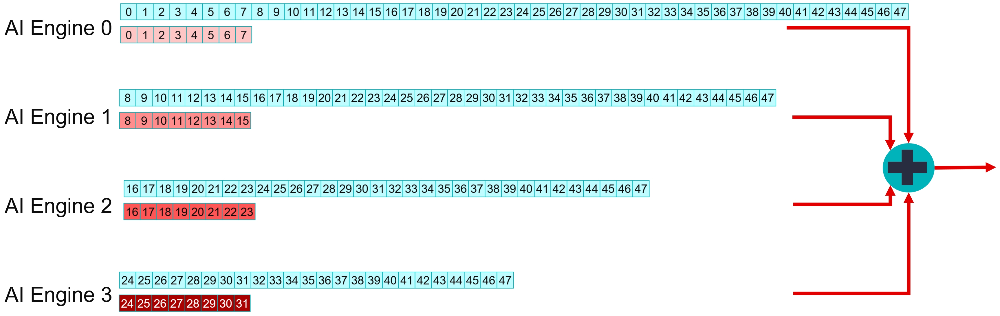
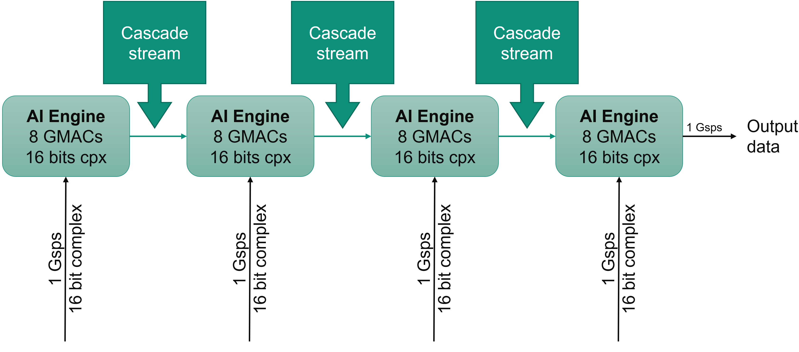
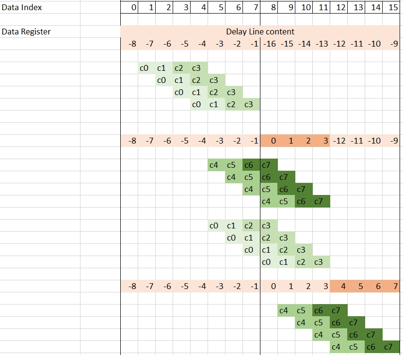
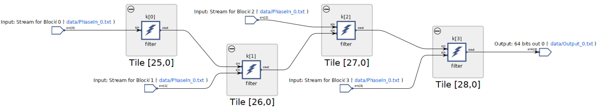
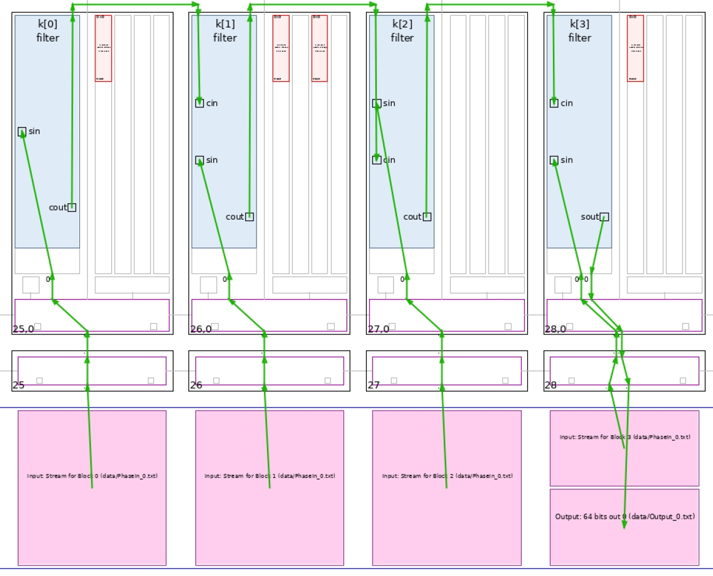
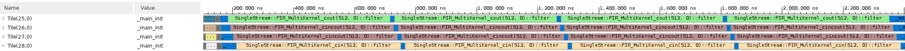
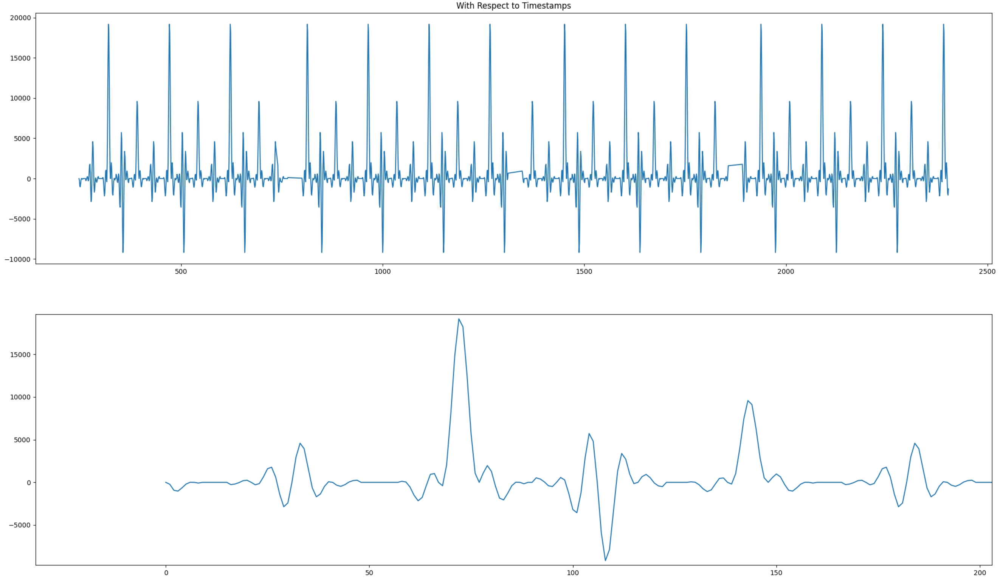

<table class="sphinxhide" style="width:100%;">
  <tr>
    <td align="center">
      <picture>
        <source media="(prefers-color-scheme: dark)" srcset="https://raw.githubusercontent.com/Xilinx/Image-Collateral/main/logo-white-text.png">
        
      </picture>
      <h1>AMD Vitis™ AI Engine Tutorials</h1>
      <a href="https://www.amd.com/en/products/software/adaptive-socs-and-fpgas/vitis.html">See Vitis™ Development Environment on amd.com</a>
        </br>
      <a href="https://www.amd.com/en/products/software/vitis-ai.html">See Vitis™ AI Development Environment on amd.com</a>
    </td>
  </tr>
</table>

# Multi-Kernel FIR Filter Implementation

***Version: Vitis 2025.2***

The second part of the tutorial dispatches the computations over multiple AI Engines and analyzes the performances that the system can achieve.

Navigate to the `MultiKernel` directory to continue.

## Designing the Kernel

As in the Single-kernel tutorial, this design uses the streaming input and output but requires improved performance. The limitations can come from two sources:

- Limit on the bandwidth side
- Limit in the compute performance side

In the single-kernel section of the tutorial, the maximum throughput was 225 MSPS, which shows that a limitation of the compute performance starves the streams. The data type `cint16` is 32-bit wide and the maximum bandwidth of the AXI-Stream connection array is 1x `cint16` per clock cycle on a single stream. In the single-kernel part, the system read four of them in four clock cycles, but the computation was taking 16 clock cycles for the 32 taps. For the optimal trade-off, the computation must take only four clock cycles for each of the four input samples read from the stream. In four clock cycles, the system can process eight taps, so the complete filtering operation splits onto four AI Engines.

This convolution represents the Single-Kernel Filter:


After dividing into four kernels, each one on a different AI Engine, the filter has this representation: four smaller filters in parallel running on the same data stream, except that for some of these kernels, the system discards the beginning of the stream:



The four AI Engines perform the computations for a subset of the coefficients. You must add their results together to get the overall result. The AI Engine architecture allows sending a number of accumulators to a neighboring AI Engine for use as a starting point for a number of `mac` operations. For computations being performed on four lanes, the accumulator vector is `v4cacc48`, which is a 384-bit vector that can be sent to the next AI Engine in the chain in one clock cycle.




## C++ Code Analysis

As shown in the previous figure, there are three different types of kernels that differ from their interface:

| Location      | Inputs     | Output     |
| :------------- | :----------: | -----------: |
|  First block | Stream In  | Cascade Out    |
| Middle Block   | Stream In<br>Cascade In | Cascade Out |
| Last Block   | Stream In<br>Cascade In | Stream Out |

They have been named with respect to their cascade connection structure:
- FIR_MultiKernel_cout
- FIR_MultiKernel_cincout
- FIR_MultiKernel_cincout

The class declaration for the first one is:

```C++
template<int NSamples,int ShiftAcc>
class FIR_MultiKernel_cout {
private:
	alignas(32) cint16 weights[8];
	alignas(32) cint16 delay_line[16];

public:
	FIR_MultiKernel_cout(const cint16 (&taps)[8])
	{
		for(int i=0;i<8;i++) weights[i] = taps[i];
		for(int i=0;i<16;i++) delay_line[i] = (cint16){0,0};
	};

	void filter(input_stream_cint16*  sin,output_stream_cacc48*  cout);

	static void registerKernelClass()
	{
		REGISTER_FUNCTION(FIR_MultiKernel_cout::filter);
	};
};
```


### Data and Coefficients Management and Operation Scheduling

The difference between the single-kernel case and this case is that the tap array contains eight elements and that the delay line is only 16 element deep. In the previous section, you saw that there were only two `mul4` and `mac4` intrinsics for cint16 x cint16 operations.


More interestingly is the one that uses a `v16cint16` for the data register. Filter output compute for an eight tap filter on four lanes in parallel requires (8+3 = 11) data in the buffer. The delay-line should contain at least eight samples as the seven previous samples are needed for the computation of the first output.

The following image gives an idea of data update scheduling and how it is interleaved with `mul4`/`mac4` operations (only the first eight outputs).



The related C++ code is as follows:

```C++
void SingleStream::FIR_MultiKernel_cout<NSamples,ShiftAcc>::filter(input_stream_cint16* sin,output_stream_cacc48* cout)
{
	v8cint16 taps =  *(v8cint16*) weights;
	v16cint16 *ptr_delay_line = (v16cint16 *)delay_line;
	v16cint16 data = *ptr_delay_line;

	v4cacc48 acc = undef_v4cacc48();


// Computes 16 samples per iteration
	for(int i=0;i<NSamples/16;i++)
		chess_prepare_for_pipelining
		chess_loop_range(NSamples/16,NSamples/16)
	{
		acc = mul4(data,1,0x3210,1,taps,0,0x0000,1);
		acc = mac4(acc,data,3,0x3210,1,taps,2,0x0000,1);
		data = upd_v(data, 2, readincr_v4(sin));
		acc = mac4(acc,data,5,0x3210,1,taps,4,0x0000,1);
		acc = mac4(acc,data,7,0x3210,1,taps,6,0x0000,1);
		writeincr_v4(cout,acc);

		acc = mul4(data,5,0x3210,1,taps,0,0x0000,1);
		acc = mac4(acc,data,7,0x3210,1,taps,2,0x0000,1);
		data = upd_v(data, 3, readincr_v4(sin));
		acc = mac4(acc,data,9,0x3210,1,taps,4,0x0000,1);
		acc = mac4(acc,data,11,0x3210,1,taps,6,0x0000,1);
		writeincr_v4(cout,acc);

		acc = mul4(data,9,0x3210,1,taps,0,0x0000,1);
		acc = mac4(acc,data,11,0x3210,1,taps,2,0x0000,1);
		data = upd_v(data, 0, readincr_v4(sin));
		acc = mac4(acc,data,13,0x3210,1,taps,4,0x0000,1);
		acc = mac4(acc,data,15,0x3210,1,taps,6,0x0000,1);
		writeincr_v4(cout,acc);

		acc = mul4(data,13,0x3210,1,taps,0,0x0000,1);
		acc = mac4(acc,data,15,0x3210,1,taps,2,0x0000,1);
		data = upd_v(data, 1, readincr_v4(sin));
		acc = mac4(acc,data,1,0x3210,1,taps,4,0x0000,1);
		acc = mac4(acc,data,3,0x3210,1,taps,6,0x0000,1);
		writeincr_v4(cout,acc);

	}

	*ptr_delay_line = data;
}
```

This code is the one of `FIR_MultiKernel_cout`, the output is sent to the cascade stream using the `writeincr_v4(cout,acc)` instruction.

At the graph level, all kernels are first declared in a class:

```C++
class FIRGraph_4Kernels: public adf::graph
{
private:
	kernel k[4];

public:
	input_port in[4];
	output_port out;
```

The constructor takes charge of the next operations. The first operation is to create the kernels: 1x**FIR_MultiKernel_cout**, 2x**FIR_MultiKernel_cincout**, 1x**FIR_MultiKernel_cin**

```C++
FIRGraph_4Kernels()
{

    k[0] = kernel::create_object<SingleStream::FIR_MultiKernel_cout<NUM_SAMPLES,SHIFT>>(taps4_0);
    k[1] = kernel::create_object<SingleStream::FIR_MultiKernel_cincout<NUM_SAMPLES,SHIFT>>(taps4_1);
    k[2] = kernel::create_object<SingleStream::FIR_MultiKernel_cincout<NUM_SAMPLES,SHIFT>>(taps4_2);
    k[3] = kernel::create_object<SingleStream::FIR_MultiKernel_cin<NUM_SAMPLES,SHIFT>>(taps4_3);
```

The AI Engine compiler needs to know the location of the source code for the kernels:

```C++
const int NChunks = 4;

for(int i=0;i<NChunks;i++)
    {
        runtime<ratio>(k[i]) = 0.9;
        source(k[i]) = "aie_kernels/FirSingleStream.cpp";
        headers(k[i]) = {"aie_kernels/FirSingleStream.h"};
    }
```

To shorten the place time by a few seconds, constrain the core location. A single one is necessary because all the others are constrained by the **cascade** connection:

```C++
// Constraints: location of the first kernel in the cascade
location<kernel>(k[0]) = tile(25,0);
```

All the kernels need to discard a specific number of elements. This initialization function handles this as this must be done beforehand and only one time:

```C++
// Discard first elements of the stream, depending on position in the cascade
initialization_function(k[0]) = "SingleStream::FIRinit<0>";
initialization_function(k[1]) = "SingleStream::FIRinit<8>";
initialization_function(k[2]) = "SingleStream::FIRinit<16>";
initialization_function(k[3]) = "SingleStream::FIRinit<24>";
```

Finally, all kernels must be connected together. This is done at the end of the constructor of the class:

```C++
// Cascade Connections and output connection
for(int i=0;i<NChunks-1;i++)
    connect<cascade> (k[i].out[0],k[i+1].in[1]);
connect<stream> (k[NChunks-1].out[0],out);

// Input Streams connections
for(int i=0;i<NChunks;i++)
    connect<stream>(in[i],k[i].in[0]);
```

The initialization function is  simple. It simply reads data from the input stream. Because there is no argument, you must use the raw API for stream access:

```C++
template<int Delay>
void SingleStream::FIRinit()
{
    for (int i = 0; i < Delay; ++i)
    {
        get_ss(0);
    }
}
```

## Compilation and Analysis


Navigate to the `MultiKernel` directory. In the `Makefile`, three methods are defined:

- `aie`
  - Compiles the graph and the kernels
- `aiesim`
  - Runs the AI Engine System C simulator
- `aieviz`
  - Runs `vitis_analyzer` on the output summary

Have a look at the source code (kernel and graph) to familiarize yourself with the C++ instantiation of kernels. In `graph.cpp`, the PL AI Engine connections are declared using 64-bit interfaces running at 500 MHz, allowing for maximum bandwidth on the AI Engine array AXI-Stream network.

To have the simulation running, input data must be generated. There are 2 possibilities:

1. Just type `make data`.
2. Change directory to `data` and type `GenerateStreams`. The following parameters should be set for this example:


Click **Generate** then **Exit**. The generated file `PhaseIn_0.txt` should contain mainly 0's, with a few 1's and 10's.

Type `make all` and wait for `vitis_analyzer` GUI to display. The AMD Vitis&trade; analyzer is able to show the graph, how it has been implemented in the device, and the complete timeline of the simulation. In this specific case, the graph is  simple (a single kernel) and the implementation is on a single AI Engine.

Click **Graph** to visualize the graph of the application:



The four kernels and their four independent input streams are clearly visible. A single input with a FIFO of eight between each AI Engine can also be implemented.

Click **Array** to visualize where the kernel has been placed, and how it is fed from the the PL:



In this view, the cascade streams connecting neighboring AI Engines are key to the performance of this graph.

Finally, click **Trace** to look at how the entire simulation went through. This might be useful to track where your AI Engine stalls if the performance is not as expected:



Now the output of the filter can be displayed. The input being a set of Dirac impulses, the impulse response of the filter should be recognized throughout the waveform. Navigate to `aiesimulator_output/data` and look at the `Output_0.txt`. You can see that you have two complex outputs per line which is prepended with a time stamp.  `ProcessAIEOutput Output_0.txt`.



The top graph reflects the outputs where the abscissa is the time at which this output occured. The four frames are clearly localized; there is no output for a number of clock cycles. On the bottom graph, a zoom on the output is displayed and the filter impulse response is recognizable.

After simulation the simulator displays the raw throughput at the input and output ports:

```
--------------------------------------------------------------------------------
| Intf Type   | Port Name                          | Type  | Throughput(MBps)  |
--------------------------------------------------------------------------------
| plio        | Stream for block 0                 | IN    | 4738.030714       |
|             | Stream for block 1                 | IN    | 4726.211849       |
|             | Stream for block 2                 | IN    | 4718.750000       |
|             | Stream for block 3                 | IN    | 4711.367673       |
|             | 64 bits output 0                   | OUT   | 4753.946147       |
```

The ouput port throughput in Msps (cint16) is: `1188.49 Msps`.

The performance of this architecture can also be measured using the timestamped output. In the same directory (`aiesimulator_output/data`), type `StreamThroughput Output_0.txt`:

```text
Output_0.txt -->  1188.49 Msps

-----------------------


Total Throughput -->    1188.49 Msps
```

This architecture achieves close to 1.25 GSPS performance. It is slightly less because of the number of cycles spent for initialization when the kernels are called (the quiet zones in the output graph). This performance increases with frame length.

## Support

GitHub issues are used to track requests and bugs. For questions, go to [support.amd.com](https://adaptivesupport.amd.com/s/?language=en_US).

<p class="sphinxhide" align="center"><sub>Copyright © 2020–2026 Advanced Micro Devices, Inc</sub><br></br></p>

<p class="sphinxhide" align="center"><sup><a href="https://www.amd.com/en/corporate/copyright">Terms and Conditions</a></sup></p>
