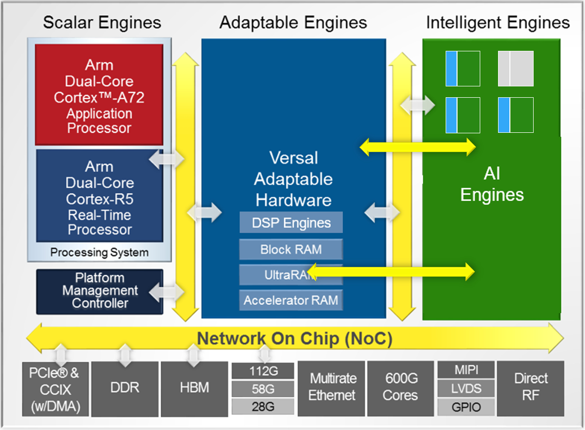
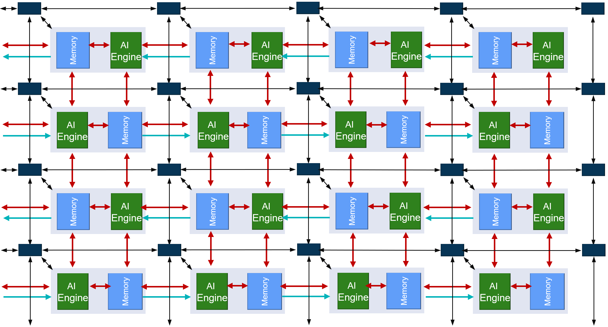
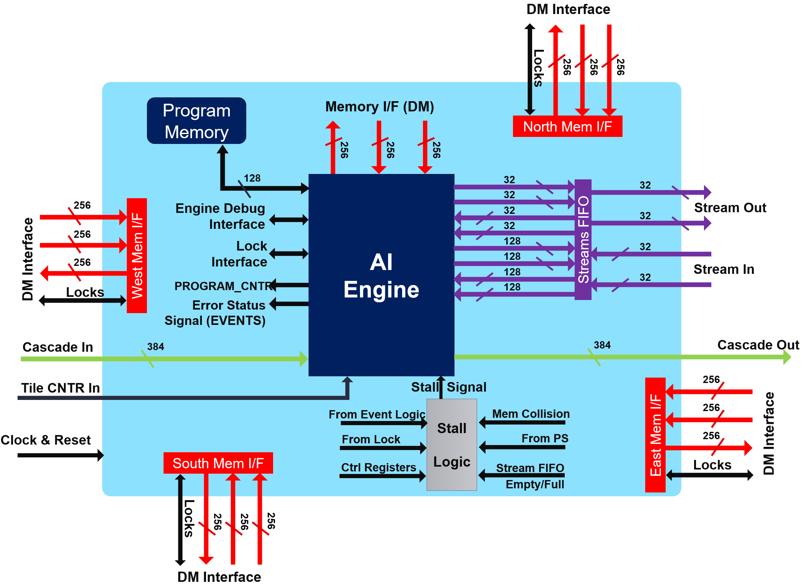
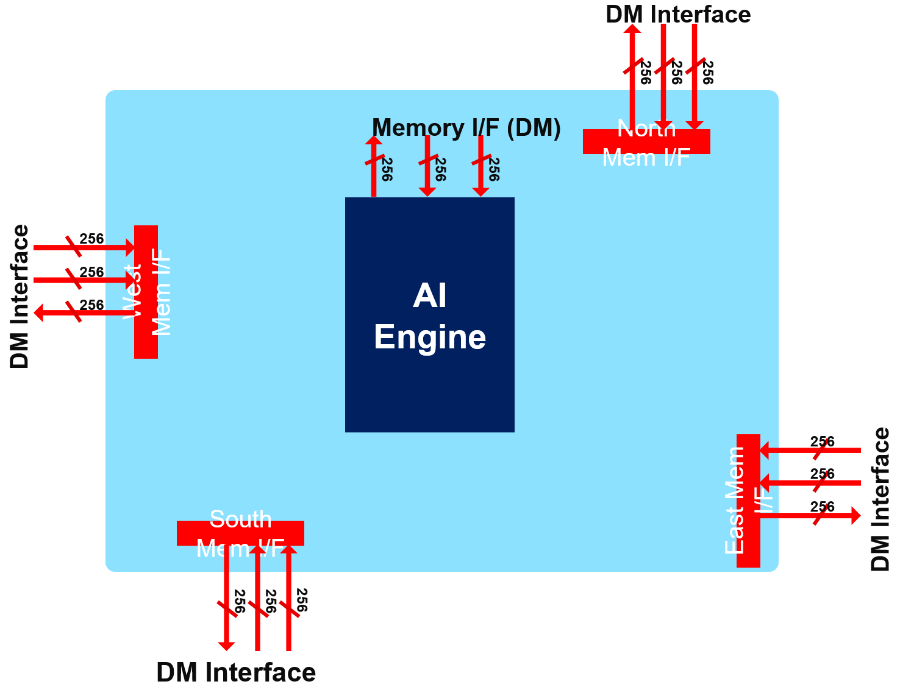
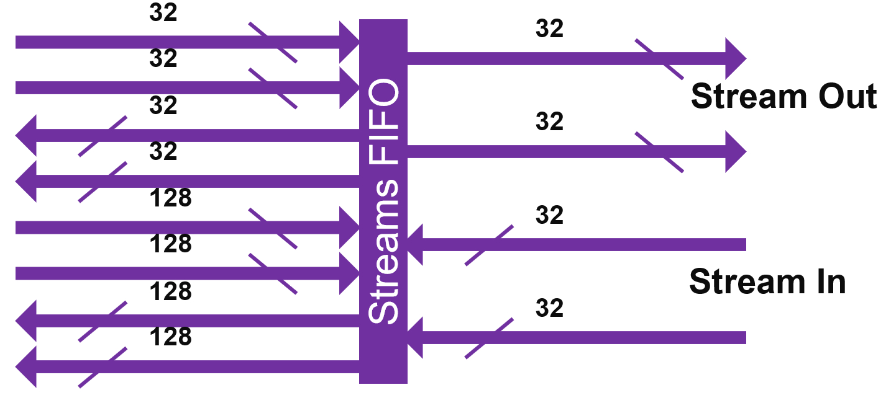
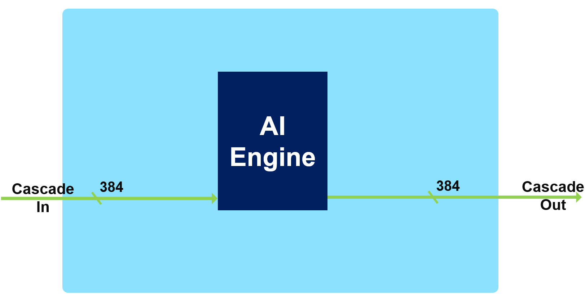
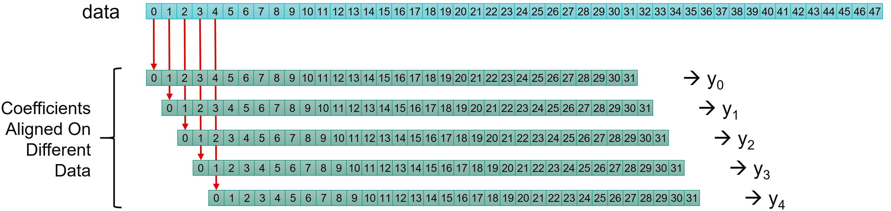
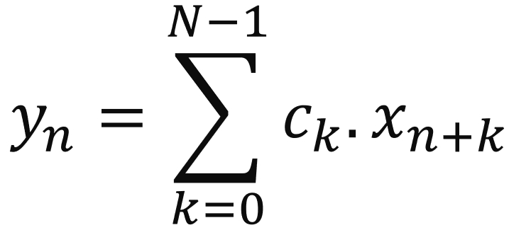
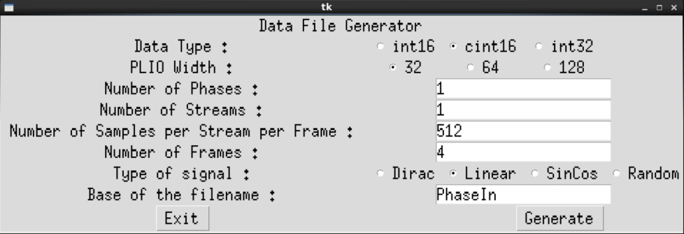

<table class="sphinxhide" style="width:100%;">
  <tr>
    <td align="center">
      <picture>
        <source media="(prefers-color-scheme: dark)" srcset="https://raw.githubusercontent.com/Xilinx/Image-Collateral/main/logo-white-text.png">
        
      </picture>
      <h1>AMD Vitis™ AI Engine Tutorials</h1>
      <a href="https://www.amd.com/en/products/software/adaptive-socs-and-fpgas/vitis.html">See Vitis™ Development Environment on amd.com</a>
        </br>
      <a href="https://www.amd.com/en/products/software/vitis-ai.html">See Vitis™ AI Development Environment on amd.com</a>
    </td>
  </tr>
</table>

# Super Sampling Rate FIR Filters: Implementation on the AI Engine

***Version: Vitis 2025.2***

## Introduction

AMD Versal™ adaptive SoCs combine programmable logic (PL), processing system (PS), and AI Engines with leading-edge memory and interfacing technologies to deliver powerful heterogeneous acceleration for any application. The hardware and software are targeted for programming and optimization by data scientists and software and hardware developers. A host of tools, software, libraries, IP, middleware, and frameworks enable Versal adaptive SoCs to support all industry-standard design flows.

FIR filter architecture is a rich and fruitful electrical engineering domain, especially when the input sampling rate becomes higher than the clock rate of the device (Super Sampling Rate or SSR). For the PL, there exists a number of solutions that are already available using turnkey IP solution (FIR Compiler). The AI Engine array is a completely new processor and processor array architecture with enormous compute capabilities. You must find an efficient filtering architecture using all the capabilities of the AI Engine array and all the communications possible with the PL.

The purpose of this tutorial is to provide a methodology to enable you to make appropriate choices depending on the filter characteristics, and to provide examples on how to implement Super Sampling Rate (SSR) FIR filters on a Versal adaptive SoC AI Engine processor array.

## Before You Begin

Before beginning this tutorial, familiarise yourself with Versal adaptive SoC architecture, and specifically, the AI Engine array processor and interconnect architecture.

>**IMPORTANT**: Before beginning the tutorial, install the AMD Vitis™ 2025.2 software platform. The Vitis release includes all the embedded base platforms, including the VCK190 base platform that this tutorial uses. Also, download the Common Images for Embedded Vitis Platforms from this link: [https://www.xilinx.com/support/download/index.html/content/xilinx/en/downloadNav/embedded-platforms/2025-2.html](https://www.xilinx.com/support/download/index.html/content/xilinx/en/downloadNav/embedded-platforms/2025-2.html).

The `common image` package contains a prebuilt Linux kernel and root file system that you can use with the Versal board for embedded design development using the AMD Vitis™ software platform.

Before starting this tutorial, run the following steps:

1. Go to the directory where you have unzipped the Versal Common Image package.
2. In a Bash shell, run the `/Common Images Dir/xilinx-versal-common-v2025.2/environment-setup-cortexa72-cortexa53-amd-linux` script. This script sets up the `SDKTARGETSYSROOT` and `CXX` variables. If the script is not present, run the `/Common Images Dir/xilinx-versal-common-v2025.2/sdk.sh`.
3. Set up your `ROOTFS` and `IMAGE` to point to the `rootfs.ext4` and `Image` files located in the `/Common Images Dir/xilinx-versal-common-v2025.2` directory.
4. Set up your `PLATFORM_REPO_PATHS` environment variable to `$XILINX_VITIS/base_platforms`.
This tutorial targets VCK190 production board for 2025.2 version and the makefiles are set up to use `xilinx_vck190_base_202520_1` automatically.

Data generation for this tutorial requires Python:

* [Python 3](https://www.python.org/downloads/)
  * Packages: math, shutils, functools, matplotlib, numpy, random, subprocess

### Accessing the Tutorial Reference Files

1. To access the reference files, type the following into a terminal: `git clone https://github.com/Xilinx/Vitis-Tutorials.git`.
2. Navigate to the `Vitis-Tutorials/AI_Engine_Development/Design_Tutorials/02-super_sampling_rate_fir/` directory, and type `source addon_setup.sh` to update the path for Python libraries and executable.

You can now start the tutorial.

## SSR FIR Tutorial

This tutorial has multiple steps:

1. [Summary of AI Engine Architecture](#AIE_Architecture)
2. [What is a FIR Filter?](#FIR_Filter)
3. ["Utils" directory](#UtilsDirectory)
4. [Single Kernel FIR](SingleKernel/README.md)
5. [Multi-Kernel FIR](MultiKernel/README.md)
6. Polyphase FIR (SSR)
   1. [Single Stream](SingleStreamSSR/README.md)
   2. [Double Stream](DualStreamSSR/README.md)
7. [Hardware implementation of 2 Dual-Stream SSR filters](DualSSR16_hw/README.md)

<a name="AIE_Architecture"></a>

## Summary of AI Engine Architecture

Ensure that you have already read the [AI Engine Detailed Architecture](https://docs.amd.com/go/en-US/am009-versal-ai-engine). The purpose of this chapter is to highlight the features of the AI Engine that are useful for this tutorial.

Versal™ adaptive SoCs combine programmable logic (PL), processing system (PS), and AI Engines with leading-edge memory and interfacing technologies to deliver powerful heterogeneous acceleration for any application. The hardware and software are targeted for programming and optimization by data scientists and software and hardware developers. A host of tools, software, libraries, IP, middleware, and frameworks enable Versal adaptive SoCs to support all industry-standard design flows.



The SIMD VLIW AI Engines come as an array of interconnected processors using the AXI-Stream interconnect blocks as shown in the following figure:



A single clock drives all arrays (processors, memory modules, AXI interconnects). The slowest speed grade device can run @1 GHz. The highest speedgrade enables 1.3 GHz clock rates. The device used in the VCK190, which you can use in this tutorial, is the `xcvc1902-vsva2197-2MP-e-S` running at 1.25 GHz.

The AI Engine enables numerous connection possibilities with the surrounding environment as shown in the following figure.



### Memory Interface



Each AI Engine has four 32 kB memories surrounding it, with each one divided into four pairs of banks. The bandwidth is high:

* Two reads / cycle on 32 bytes (256-bit) each
  * Each bank has a single port. The system must access different banks to achieve `2 x 256 bits/cycle`.
* One write / cycle on 32 bytes (256-bit)
  * On another bank to achieve the highest bandwidth.
* Be aware that you need also to feed the memories using DMAs or other AI Engines.

### Streaming Interface



The streaming interface uses two incoming streams and two outgoing streams, each one on 32 bits per clock cycle. A stream FIFO handles these four streams and enables the processor to use different bit widths to access these streams:

* Two streams in, two streams out:
  * Each one 4 bytes per cycle or 16 bytes per four cycles
* Parallel access to streams per VLIW:
  * Two reads (4/16 bytes), one write (4/16 bytes)
  * OR one read (4/16 bytes), two writes (4/16 bytes)
* Using one stream:
  * 4 bytes per cycle read and 4 bytes per cycle write
* Using the two streams and the 16-byte access option:
  * Reads and/or writes can be dispatched over time
  * On an average 8 bytes per cycle read and 8 bytes per cycle write

Accessing the data to/from the streams using the 128-bit interface does not increase the bandwidth. Instead, it limits the number of accesses that must be scheduled within the microcode of the VLIW processor.

### Cascade Streams



The cascade stream enables an AI Engine processor to transfer the value of some of its accumulator register (384-bit) to its neighbor (on the left or right depending on the row):

* It is capable of eight 48-bit word transfer `v8acc48` or `v4cacc48` in a single cycle.
* 48 bits is the number of bits of the result of a 16 bits x 16 bits multiplication.
* If the transfer concerns a 768-bit register, it takes two clock cycles.

<a name="FIR_Filter"></a>

## FIR Filters

The purpose of this tutorial is not to train you to be an expert in digital signal processing (DSP). However, to grasp the basics of finite impulse response (FIR) filtering, you must understand the computations required, and the data that the compute block consumes and produces.

A digital signal is an analog signal (audio, radio frequencies) that a converter (Analog to Digital Converter: ADC) receives. It performs two operations:

* **Slicing**: The system slices the impinging signal into small time slots on which a constant value approximates its amplitude.
* **Quantization**: Digital systems understand only bits. The constant value at the output of the slicer transforms into an integer value whose maximum represents the maximum amplitude that the system can receive.

As a result, the digital signal at the output of the ADC is simply a series of *N*-bits values (called samples) that the system can process to extract some useful information. The most basic operation multiplies some samples by some specific coefficients and accumulates these values to create a "summary" of this part of the signal.

A filtering operation performs this using a sliding window on the signal as shown in the following figure:



Input data samples are in general called **x** (blue squares), the coefficients **c** (green squares) and the output samples **y**:



DSP experts could say that this equation represents a *correlation* and not a *convolution,* which is the mathematical expression of the filtering operation. The easy answer is to say that it is simply a question of coefficients ordering (and perhaps conjugation for complex coefficients).

That is why you always see the two lines at the beginning of the various `graph.h` files:

```C++
std::vector<cint16> taps = std::vector<cint16>({
  ...
});

std::vector<cint16> taps_aie(taps.rbegin(),taps.rend());
```

The first line is the taps vector definition in the correct order for a DSP expert. The second line defines the vector that is used in the AI Engine implementation. This is the same vector but in the reverse order.

<a name="UtilsDirectory"></a>

## "Utils" Directory

For this tutorial, a number of utilities have been created that you can reuse for your own purposes.

First, to call these utilities from anywhere during this tutorial, add this directory to your ***PATH*** and indicate to `python` that this directory contains some libraries. The system checks this directory during imports.

Navigate to the `Utils` directory, and type `source InitPythonPath` to have this directory in your path for Python libraries and executable search path.

### GenerateStreams

This utility uses a library ***GenerationLib.py*** to generate input data suitable for the cases you want to test. Call it by typing `GenerateStreamsGUI`. This displays a GUI in which you can select the appropriate parameters to generate the correct input data files:



You have access to a number of parameters:

* *Data Type*: By default, `cint16`, as this is what you use throughout this tutorial.
* *PLIO Width*: By default, `64`. This tutorial uses this width.
* *Number of Phases*: For Super Sampling Rate Filters.
* *Number of Streams*: For the SSR filters using the 2 streams of the AI Engines.
* *Number of Samples per Stream per Phase*: Each stream contains a number of samples defined there.
* *Number of Frames*: The system launches simulations for a limited number of Frames.
* *Base of the Filename*: `PhaseIn` by default, which generates the following names:
  * Single Stream, Single Phase: `PhaseIn_0.txt`
  * Single Stream, Polyphase: `PhaseIn_0.txt`, `PhaseIn_1.txt`, and so on
  * Dual streams, Polyphase:  `PhaseIn_0_0.txt`, `PhaseIn_0_0.txt`, `PhaseIn_1_0.txt`, `PhaseIn_1_0.txt`, and so on

Another possibility is to type `GenerateStreams` with the same parameters. If you type `GenerateStreams` without parameters, the system displays a usage text:

```BASH
>>GenerateStreams

Stream Content Generation

================================================================================================

Usage:
GenerateStreams DataType PLIO_Width NPhases NStreams NSamples NFrames SequenceType Basename
   Datatype: cint16, int16, int32
   PLIO_Width: 32, 64 or 128
   NPhases: any integer >= 1
   NStreams: 1 or 2
   NSamples: integer, multiple of 8
   NFrames: Any integer >= 1
   SequenceType: Dirac, Linear, SinCos, Random
   Basename: file name that will prepend phase and stream index

================================================================================================
```

## ProcessAIEOutput

This utility takes all generated outputs and displays the reconstructed signal. For Single Stream/Single Phase, it displays a signal using the timestamps written in the file.

If your output signals are stored in files named `output_0.txt`, navigate to the output directory and type `ProcessAIEOutput output_*` to process the output of the AI Engines.

The system generates two other files:

* `Atot.txt`, which is the output phase by phase.
* `out.txt`, which is the text file of the reconstructed signal.

### StreamThroughput

This utility computes the throughput concerning all AI Engine output files given in an argument.

### `GetDeclare.sh`

This utility views the template arguments used for kernel declaration in the Double Stream SSR case. You can modify it to adapt to different cases.

## Support

GitHub issues are used for tracking requests and bugs. For questions, go to [support.amd.com](https://adaptivesupport.amd.com/s/topiccatalog?language=en_US).

<p class="sphinxhide" align="center"><sub>Copyright © 2020–2026 Advanced Micro Devices, Inc</sub><br>></br></p>

<p class="sphinxhide" align="center"><sup><a href="https://www.amd.com/en/corporate/copyright">Terms and Conditions</a></sup></p>
