<table class="sphinxhide" style="width:100%;">
  <tr>
    <td align="center">
      <picture>
        <source media="(prefers-color-scheme: dark)" srcset="https://raw.githubusercontent.com/Xilinx/Image-Collateral/main/logo-white-text.png">
        
      </picture>
      <h1>AMD Vitis™ AI Engine Tutorials</h1>
      <a href="https://www.amd.com/en/products/software/adaptive-socs-and-fpgas/vitis.html">See Vitis™ Development Environment on amd.com</a>
        </br>
      <a href="https://www.amd.com/en/products/software/vitis-ai.html">See Vitis™ AI Development Environment on amd.com</a>
    </td>
  </tr>
</table>

# Single-Kernel FIR Filter Implementation

***Version: Vitis 2025.2***

The first part of the tutorial uses a basic filtering application and analyzes the performance that the system can achieve.

Navigate to the `SingleKernel` directory to continue.

## Filter Description

Throughout this tutorial, you use and reuse the same filter with complex coefficients. This filter has 32 coefficients (or taps) and no symmetry characteristics.

```text
{   -82,  -253},{     0,  -204},{    11,   -35},{  -198,   273},
{  -642,   467},{ -1026,   333},{  -927,     0},{  -226,   -73},
{   643,   467},{   984,  1355},{   550,  1691},{     0,   647},
{   538, -1656},{  2860, -3936},{  6313, -4587},{  9113, -2961},
{  9582,     0},{  7421,  2411},{  3936,  2860},{  1023,  1409},
{  -200,  -615},{     0, -1778},{   517, -1592},{   467,  -643},
{  -192,   140},{  -882,   287},{ -1079,     0},{  -755,  -245},
{  -273,  -198},{    22,    30},{    63,   194},{     0,   266}
```

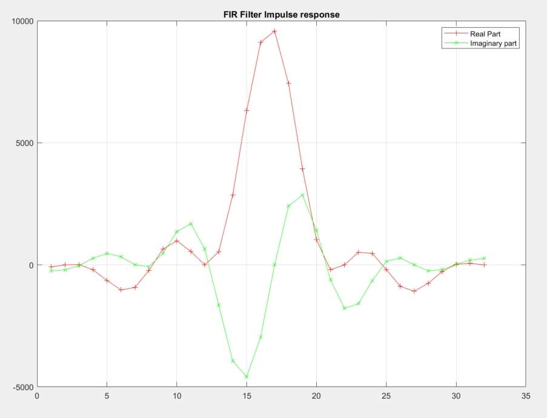

The output of this filter has a much higher amplitude than the input. You must apply a scaling factor of `2^15` to get back to the normalized data. In the debugging phase, when only impulses are given to the filter, you can reduce the scaling factor to `1`. This lets you verify that the output looks like the impulse response of the filter.

## Designing the Kernel

Before building a kernel to implement FIR filtering, consider the following:

- What kind of interface are you using?
- How many coefficients do you have?
  - How does it influence the size of the data register and coefficient register?
  - How many lanes can you use in the intrinsics?
- When do you schedule data reading and writing?

### Interfaces

There are two types of interfaces: windows and streams. Memory access (for stored windows) provides much higher bandwidth than streams: 2x40 GB/s vs. 2x5 GB/s (@1.25 GHz). Despite high memory bandwidth from the processor, another AI Engine (bandwidth 40 GB/s) or streams (2x5 GB/s) must fill the data. Somewhere in the kernel cascade, the data originates outside the AI Engine array (PL, DDR, etc.), requiring a stream source.

Window interfaces are used in a 'ping-pong' manner to allow for continuous data transfer while maintaining continuous processing. When multiple kernels map to the same AI Engine and communicate through windows, these windows use a single buffer because the kernels do not run simultaneously. Ping-pong buffering processes data only when the buffer completely fills, incurring minimum latency equal to the buffer filling duration. When an AI Engine kernel uses window interfaces, it must acquire a lock to gain access ownership to this memory. Lock acquisition and release takes a minimum of seven cycles per lock, which reduces the time allowed for processing.

As a rule of thumb, 900 MSPS (@ 25 GHz) is the maximum sample rate for which window interfaces are a viable solution. When kernel processing takes only a fraction of input window fill time, the **utilization ratio** falls below 1, enabling multiple kernels to map onto a single AI Engine.

In this tutorial, the goal is to achieve the maximum performance filter implementation, leading to a streaming interface at the input and the output.

### Data and Coefficients Management

The data register is limited to 1024 bits (`v32cint16`). The maximum bitwidth of the coefficient register is 512 bits (`v16cint16`). With a streaming interface (single stream to start with), the system can read four `cint16` in one instruction, but it takes four clock cycles to perform the same operation again. Reading four samples at a time allows the use of `mul4` and `mac4` intrinsics.

Not all intrinsics exist for the AI Engine. Only two intrinsics handle four lanes for complex 16 bits x complex 16 bits:

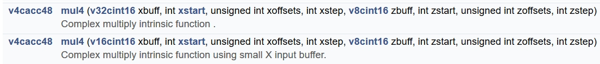

This tutorial assumes finite length loops (by default 512 input/output samples) for ease of debugging. You can increase or decrease the number of iterations up to infinite loops (`while(1) { ...}`). The filter delay-line must preserve its status between kernel calls. A 32-tap filter requires at least 31 delay-line samples. Because 32 samples fit in a Y register, this tutorial uses a `v32cint16` variable to maintain this delay-line. The kernel call loads this delay-line from memory at the beginning and stores it back at the end. The coefficients require `v8cint16` with no other options.

A `mul4` operating on `cint16` x `cint16` can perform eight operations in one clock cycle, leading to two operations per lane.

### Coefficients and Data Update Scheduling

Before the first iteration of the delay-line, the system reads the status to update the Y register. It contains all the necessary previous data: `{ d(-32), d(-31), ... , d(-2), d(-1)}`. The first output results from the following operation:

`y(0) = d(-31).c(0) + d(-30).c(1) + ... + d(-1).c(30) + d(0).c(31)`

where the array `c` is the array of coefficients. Use a table to organize operations scheduling (excel for example):

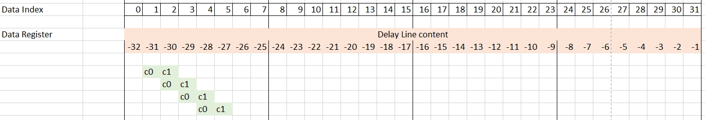

This image represents the following equation:

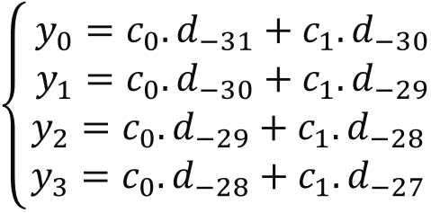

Following this first `mul4` operation, use 15 `mac4` operations to finish the computation of `{y(0), y(1), y(2), y(3)}`.

Use dark and darker green to represent the next three `mac4` operations.

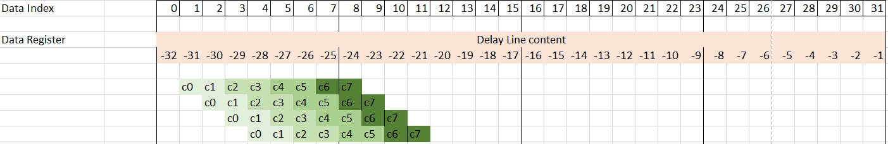

With these operations performed, the system has used the eight coefficients in the `v8cint16` and must update them. These operations should be followed by eight `mac4` operations:

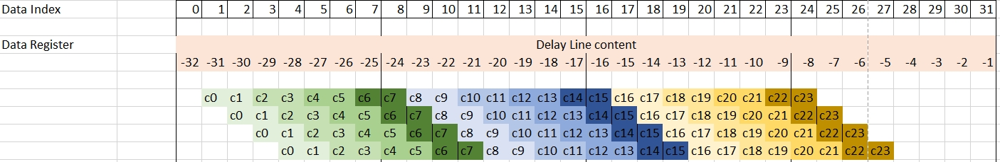

The next block of four `mac4` operations wraps around and reuses the beginning of the data register. Load four new samples from the stream and finish the operations:

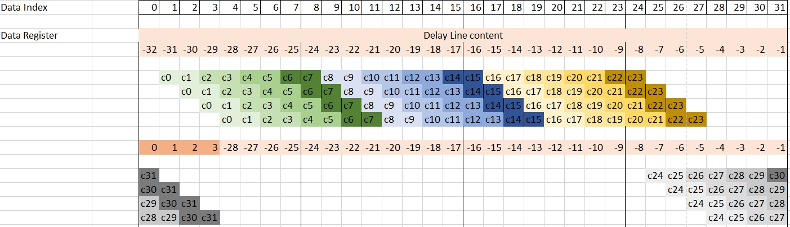

After completing the computation of `{y(0), y(1), y(2), y(3)}`, compute the next four outputs `{y(4), y(5), y(6), y(7)}`. The previous image shows that the next computation must start with index 5 in the data register. The system updates the data register before the group of four `mac4`, as with the previous set of output samples:

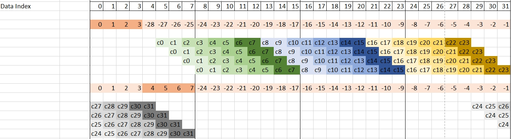

To have a regular inner loop, the system computes 32 output samples (eight groups of four) in the inner loop.

Now take a look at the related C code to implement all these operations. The program takes advantage of the templatization of the function and of the inclusion of the state in the class itself:

```C++
namespace SingleStream {

template<int NSamples,int ShiftAcc>
class FIR_SingleStream {
private:
	alignas(32) cint16 weights[32];
	alignas(32) cint16 delay_line[32];

public:
	FIR_SingleStream(const cint16 (&taps)[32])
	{
		for(int i=0;i<32;i++)
		{
			weights[i] = taps[i];
			delay_line[i] = (cint16){0,0};
		}
	};

	void filter(input_stream_cint16*  sin,output_stream_cint16*  sout);

	static void registerKernelClass()
	{
		REGISTER_FUNCTION(FIR_SingleStream::filter);
	};
};

}
```

Taps are provided during the instantiation of the class. The constructor initializes the internal array and sets the delay line to zero. In the template, two arguments define the number of iterations of the inner loop and the shifting value that is applied to the accumulator before sending the calculated y-values to the output stream.

Function, declaration, and variable initialization are as follows:

```C++
template <int NSamples,int ShiftAcc>
void FIR_SingleStream<NSamples,ShiftAcc>::filter(input_stream_cint16* sin,output_stream_cint16* sout)
{
	v8cint16 *coeff =  (v8cint16*) weights;
	v8cint16 taps = undef_v8cint16();
	v32cint16 *ptr_delay_line = (v32cint16 *)delay_line;
	v32cint16 data = *ptr_delay_line;

	v4cacc48 acc = undef_v4cacc48();
    ...
```

The function `filter` has two stream arguments: `sin` and `sout` for stream-in and stream-out. The pointers to the coefficients and the data are prepared so that they can be loaded using pointer addressing.

```C++
// Computes 32 samples per iteration
	for(int i=0;i<NSamples/32;i++)
		chess_prepare_for_pipelining
		chess_loop_range(NSamples/32,NSamples/32)
	{
        taps =  *coeff++;   // Get the coefficients for the Green block
        acc = mul4(data,1,0x3210,1,taps,0,0x0000,1);
        acc = mac4(acc,data,3+2,0x3210,1,taps,2,0x0000,1);
        acc = mac4(acc,data,5,0x3210,1,taps,4,0x0000,1);
        acc = mac4(acc,data,7,0x3210,1,taps,6,0x0000,1);

        taps =  *coeff++;   // get the coefficients for the Blue block
        acc = mac4(acc,data,9,0x3210,1,taps,0,0x0000,1);
        acc = mac4(acc,data,11,0x3210,1,taps,2,0x0000,1);
        acc = mac4(acc,data,13,0x3210,1,taps,4,0x0000,1);
        acc = mac4(acc,data,15,0x3210,1,taps,6,0x0000,1);

        taps =  *coeff++;   // Get the coefficients for the yellow-brown block
        acc = mac4(acc,data,17,0x3210,1,taps,0,0x0000,1);
        acc = mac4(acc,data,19,0x3210,1,taps,2,0x0000,1);
        acc = mac4(acc,data,21,0x3210,1,taps,4,0x0000,1);
        acc = mac4(acc,data,23,0x3210,1,taps,6,0x0000,1);

        data = upd_v(data,0,readincr_v4(sin));  // Update the data register

        taps =  *coeff++;   // Get the coefficients for the Grey block
        acc = mac4(acc,data,25,0x3210,1,taps,0,0x0000,1);
        acc = mac4(acc,data,27,0x3210,1,taps,2,0x0000,1);
        acc = mac4(acc,data,29,0x3210,1,taps,4,0x0000,1);
        acc = mac4(acc,data,31,0x3210,1,taps,6,0x0000,1);

        writeincr_v4(sout,srs(acc,ShiftAcc)); // Write on the output stream
        coeff -= 4;     // Realign the coefficients pointer
        ...
```

These four blocks have to be written eight times with different parameters to compute the 32 output samples. In the published code, two macros are defined to make this exercise a little easier:

```C++
#define MULMAC(N) \
		taps =  *coeff++; \
		acc = mul4(data,N,0x3210,1,taps,0,0x0000,1); \
		acc = mac4(acc,data,N+2,0x3210,1,taps,2,0x0000,1);\
		acc = mac4(acc,data,N+4,0x3210,1,taps,4,0x0000,1);\
		acc = mac4(acc,data,N+6,0x3210,1,taps,6,0x0000,1)

#define MACMAC(N) \
		taps =  *coeff++; \
		acc = mac4(acc,data,N,0x3210,1,taps,0,0x0000,1); \
		acc = mac4(acc,data,N+2,0x3210,1,taps,2,0x0000,1);\
		acc = mac4(acc,data,N+4,0x3210,1,taps,4,0x0000,1);\
		acc = mac4(acc,data,N+6,0x3210,1,taps,6,0x0000,1)
```

## Compilation and Analysis

Navigate to the `SingleKernel` directory. In the `Makefile`, three methods are defined:

- `aie`
  - Compiles the graph and the kernels
- `aiesim`
  - Runs the AI Engine System C simulator
- `aieviz`
  - Runs `vitis_analyzer` on the output summary

Have a look at the source code (kernel and graph) to familiarize yourself with the C++ instantiation of kernels. In `graph.cpp`, the PL AI Engine connections are declared using 64-bit interfaces running at 500 MHz, allowing for maximum bandwidth on the AI Engine array AXI-Stream network.

To have the simulation running, the system must generate input data. There are two possibilities:

1. Type `make data`.
2. Change directory to `data` and type `GenerateStreamsGUI`. The following parameters must be set for this example:

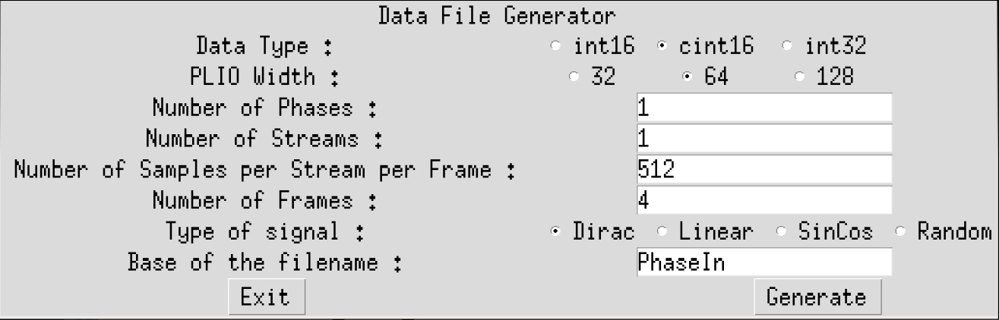

Click **Generate** then click **Exit**. The generated file `PhaseIn_0.txt` must contain mainly 0s, with a few 1s and 10s.

Type `make all` and wait for `vitis_analyzer` GUI to display. The AMD Vitis™ Analyzer shows the graph, the device implementation, and the complete simulation timeline. In this specific case the graph is very simple (a single kernel) and the implementation is on a single AI Engine.

### Vitis Analyzer

Click **Graph** to visualize the graph of the application:

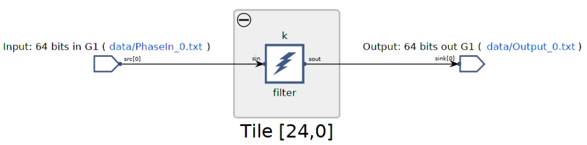

Click **Array** to visualize where the kernel has been placed, and how it is fed from the the PL:

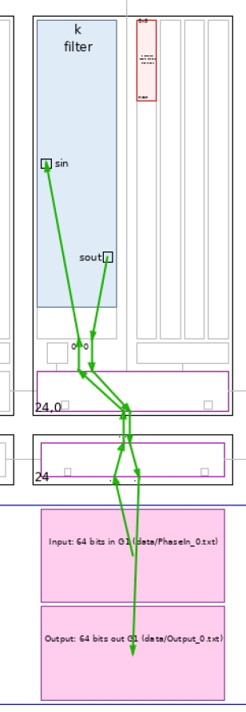

Click **Trace** to look how the entire simulation went through. This may be useful to track where your AI Engine stalls if the performance is not as expected:

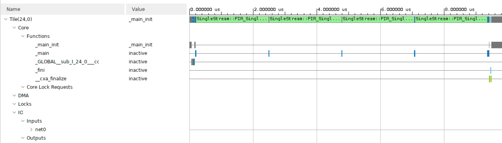

Vitis Analyzer allows you to analyze latency and thoughput of the design. Click the **Latency** tab on the lower panel. Right-click on the input port and choose **Plot Continuous Latency**. By default, the number of interval is specified as the **No of Intervals** defined on the duration of the simulation. By default this is the number of iteration. Click **OK** and the following plot is displayed:


You can perform the same analysis with throughput by selecting the **I/O** tab on the **Trace** section.

### Script Utils

As explained earlier, the directory `Utils` contains several utilities that aid in analyzing the design output. First, the output value has to be validated. Because the input is a set of Dirac impulses, the impulse response of the filter must be recognized throughout the waveform. Navigate to `aiesimulator_output/data` and look at the `Output_0.txt`. You can see that you have two complex outputs per line, which is prepended with a time stamp.

You can use the following command to display the reconstructed signals: `ProcessAIEOutput Output_0.txt`.

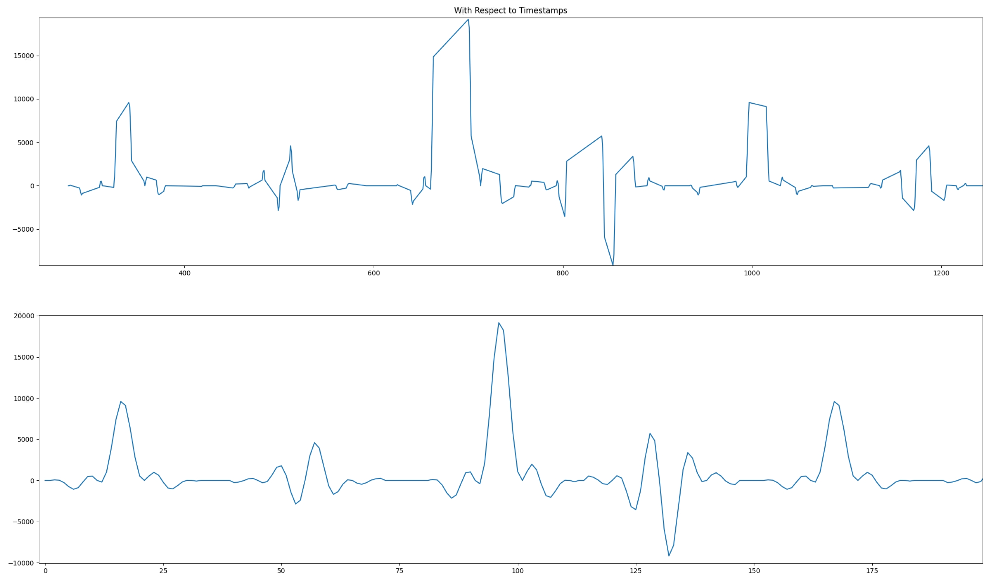

The top graph reflects the outputs where the abscissa is at the time at which this output occurred. It is much easier to look at the bottom graph where the samples are displayed one after the other. The filter impulse can be easily recognized on this sub-graph. The file `out.txt` contains three columns: (timestamp, real part, and imaginary part) of the output samples.

After simulation the simulator displays the raw throughput at the input and output port:

```text
--------------------------------------------------------------------------------
| Intf Type   | Port Name                          | Type  | Throughput(MBps)  |
--------------------------------------------------------------------------------
| plio        | 64 bits in G1                      | IN    | 1189.923578       |
|             | 64 bits out G1                     | OUT   | 1173.235564       |
```

Because the values are in bytes per second, divide by 4 to convert to samples per second (cint16 uses 2 bytes for the real part and 2 bytes for the imaginary part). This calculation yields an estimated throughput of `292.17 Msps`.

You can compute the throughput from the timeline, but the `Utils` directory contains a tool to compute it from the output files. In the same directory (`aiesimulator_output/data`), type `StreamThroughput Output_0.txt`:

```text
Output_0.txt -->   293.24 Msps

-----------------------


Total Throughput -->     293.24 Msps

```

Each of the four output samples need 16 `mul4`/`mac4` instructions, so the maximum throughput attainable is 312.5 MSPS. This is in line with what was achieved.

## Support

GitHub issues are used for tracking requests and bugs. For questions, go to [adaptivesupport.amd.com](https://adaptivesupport.amd.com/).

<p class="sphinxhide" align="center"><sub>Copyright © 2020–2026 Advanced Micro Devices, Inc</sub><br></br></p>

<p class="sphinxhide" align="center"><sup><a href="https://www.amd.com/en/corporate/copyright">Terms and Conditions</a></sup></p>
