<table class="sphinxhide" style="width:100%;">
  <tr>
    <td align="center">
      <picture>
        <source media="(prefers-color-scheme: dark)" srcset="https://raw.githubusercontent.com/Xilinx/Image-Collateral/main/logo-white-text.png">
        
      </picture>
      <h1>AMD Vitis™ AI Engine Tutorials</h1>
      <a href="https://www.amd.com/en/products/software/adaptive-socs-and-fpgas/vitis.html">See Vitis™ Development Environment on amd.com</a>
        </br>
      <a href="https://www.amd.com/en/products/software/vitis-ai.html">See Vitis™ AI Development Environment on amd.com</a>
    </td>
  </tr>
</table>

# Single-Stream Interface

***Version: Vitis 2025.2***

## Super Sampling Rate FIR Filter

The purpose of the third part of the tutorial is to understand how to implement a FIR filter that has an input sample rate above the clock frequency of the AI Engine array.

Navigate to the `SingleStreamSSR` directory to continue.

## Super Sampling Rate and Polyphase

When the input sampling rate exceeds the processor clock frequency (Super Sampling Rate), the system must acquire samples in parallel. For a 2.5 GSPS input sample rate, you can specify that the filter receives two samples at a 1.25 GHz rate, viewed as two data streams (Polyphase decomposition), each one at 1.25 GSPS. Because the AI Engine array AXI-Stream network is limited to 1.25 GHz (VCK190 device speed grade), the system decomposes high sampling rate inputs (above 1.25 GSPS) into multiple phases for processing.

As a first example, suppose a 2.5 GSPS data stream needs processing. The system splits it into two phases and routes them to the AI Engine array:

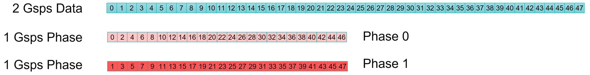

A 6.26 GSPS data stream requires splitting into five phases:

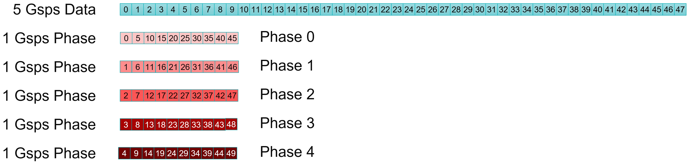

## Organize Computation for a 2.5 GSPS Data Stream in Two Phases

For a single-rate filter, a 2.5 GSPS input sample rate also means a 2.5 GSPS output sample rate. Because the system separates the input stream into two (even, odd) streams, the output stream splits the same way.

Take a look at how **y0** is computed:

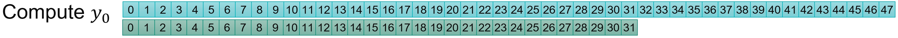

If the data stream is split into two phases, you can see that the coefficients must also be split into two phases.

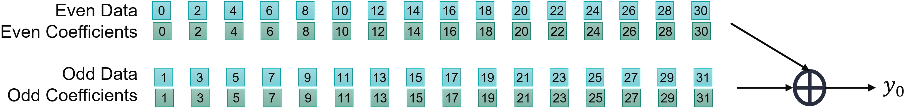

Also take a look at how **y2** is computed:

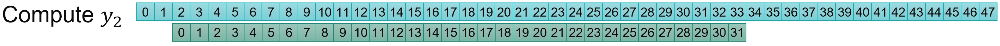

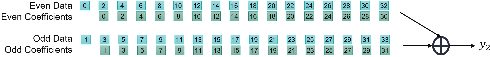

For the even output stream, data and coefficient phases must match:

- Even data phase sent through a filter built with the even phase coefficients
- Odd data phase sent through a filter built with the odd phase coefficients

Take a look at how this is modified for the odd outputs:

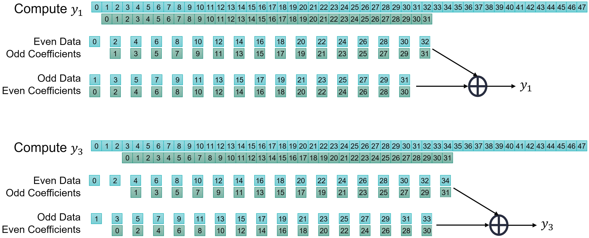

In this case, the system mixes the phases of the data and coefficients:

- Even data phase sent through a filter built with the odd phase coefficients
- Odd data phase sent through a filter built with the even phase coefficients

There is another difference between the two. In the odd output case, they (even data, odd coefficients) should discard one data at the beginning of the stream.

In the previous section, the balance between data transfer and compute performance of the AI Engine was obtained for a 1.25 GSPS data stream going through an eight tap filter. The balance is identical here. Eight different filters can process 4x 1.25 GSPS streams in parallel.

The system splits the data stream and the coefficients into four phases and then recombines them. In the following figures, the various colors correspond to a different phase for the data (blue) and the coefficients(red):

- Output phase 0, splits and recombines as follows:
  
  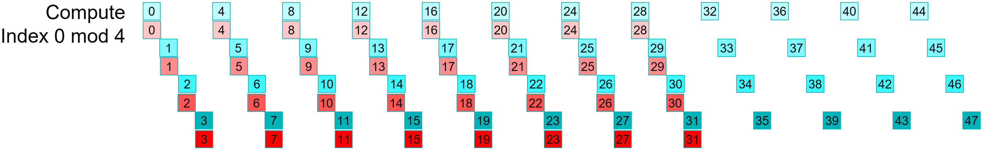
- Output phase 1, splits and recombines as follows:
  
  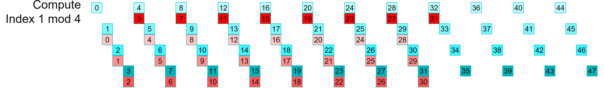
- Output phase 2, splits and recombines as follows:
  
  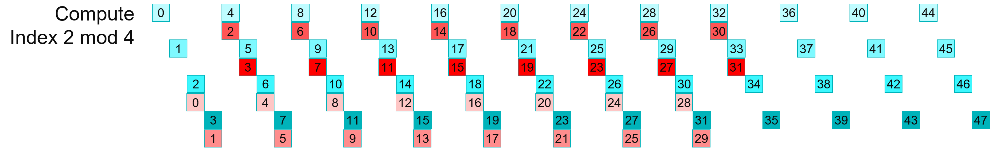
- Output phase 3, splits and recombines as follows:
  
  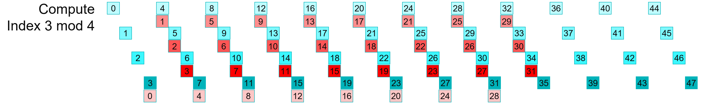

When splitting the data and coefficients into *N* Phases (four in this case), the resulting architecture requires *N*Phases x *N*Phases (4x4 = 16) kernels.

## Designing the Graph

This section reuses the kernels created in the previous section, as the only difference is how they connect together. In the preceding images, you can see 16 associations **(Data Phase, Coefficient Phase)**. You can also clearly see that some data streams discard data before computation starts:

- Output phase 0: No input data phase has discarded samples.
- Output phase 1: Input data phase 0 has one discarded sample.
- Output phase 2: Input data phase 0 and 1 have one discarded sample.
- Output phase 3: Input data phase 0, 1, and 2 have one discarded sample.

To minimize the data routing, place all blocks using the same data stream in the same column. This leads to the following architecture:

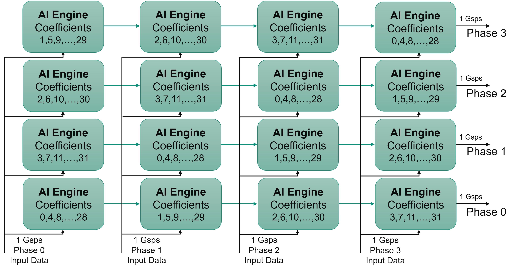

In the AI Engine array, the cascade stream direction flips from one row to the next.

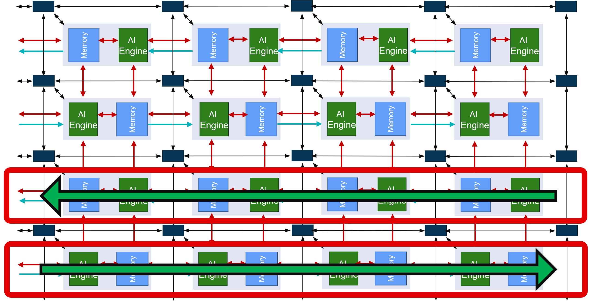

Take this feature into account when placing the kernels to get the cascade connections correct in the graph:

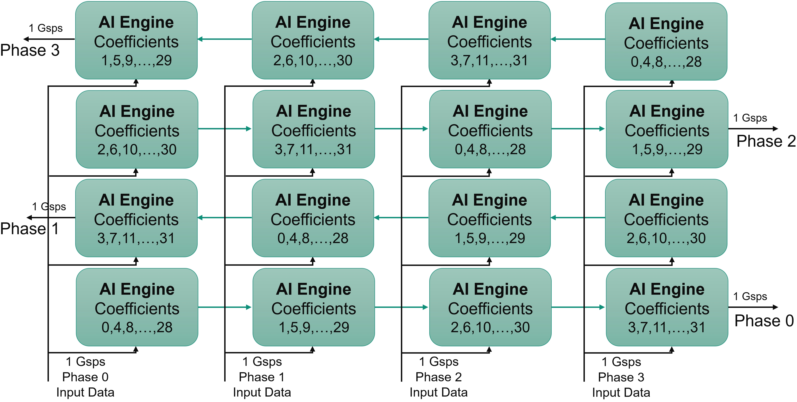

The kernels highlighted in the following figure must discard one sample within the initialization function:

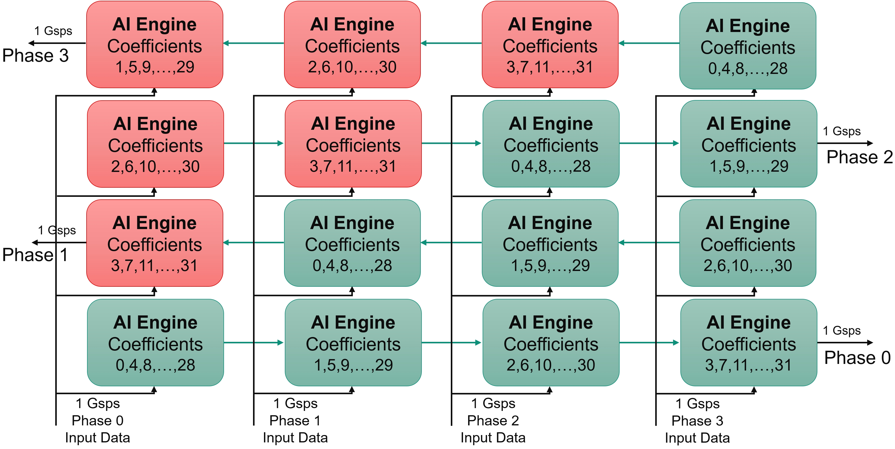

At this point, consider latencies within the kernels. The operation scheduling performs the following sequence:

1. Read data from the stream
2. Performs a `mul4` and three `mac4`
3. Sends the accumulator to the cascade stream

Overall, the latency from 'read' to 'write' spans approximately 20-25 clock cycles (call it L, L~25). In the left-hand column, the data input from row one to row two needs a FIFO of length ~75 (3L). The input to row two is approximately the same as row zero. The system feeds row three simultaneously with row one. The following table shows the latencies as multiples of L:

| Column 0 | Column 1 | Column 2 | Column 3 |
| ---: | :---: | :---: | :---: | :---: |
| **Row 3** | 3L  | 2L  | L  | 0  |
| **Row 2** | 0  | L  | 2L  | 3L  |
| **Row 1** | 3L  | 2L  | L  | 0  |
| **Row 0** | 0  | L  | 2L  | 3L  |

Depending on the row, the latencies differ completely.

One possibility is to implement these FIFOs in the PL, with two streams coming from the PL for each column: one serving the even rows and the other serving the odd rows. The first and last columns require a single FIFO, but the inner columns need two.

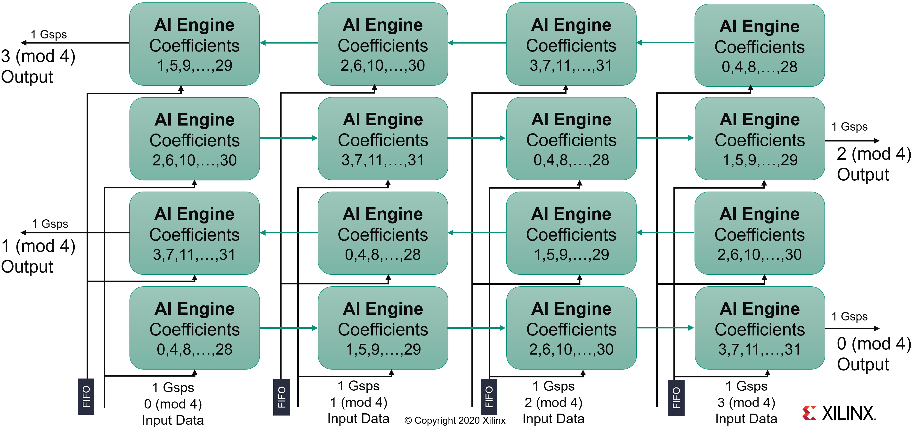

Another possibility places them inside the AI Engine array. The AXI-Stream interconnect implements latencies under 32 clock cycles into the included FIFOs. Beyond that threshold, a memory module implements it as a DMA FIFO. You can either share one DMA FIFO for the odd rows and another for the even rows, or dedicate one FIFO for each AI Engine. This design uses the latter choice and constrains their placement right beside the kernel.

## C++ Code Analysis

The kernel definition is exactly the same as the previous part of this tutorial. The only difference is in the graph to encode this 16 kernel four-phase filter.

At the graph level, all the kernels are first declared in a class:

```C++
class FIRGraph_4Kernels: public adf::graph
{
private:
	kernel k[4][4];

public:
	input_port in[4];
	output_port out[4];
```

The constructor takes charge in the next operations. The first operation creates the kernels. The following code defines the complete grid of 4x4 kernels:

```C++
FIRGraph_SSR4()
{
    // k[N][0] is always the first in the cascade stream
    // Topology of the TopGraph
    //
    //      3,3   3,2   3,1   3,0 <--
    //  --> 2,0   2,1   2,2   2,3
    //      1,3   1,2   1,1   1,0 <--
    //  --> 0,0   0,1   0,2   0,3

    k[0][0] = kernel::create_object<SingleStream::FIR_MultiKernel_cout<NUM_SAMPLES,SHIFT>>(taps4_p0);
    k[0][1] = kernel::create_object<SingleStream::FIR_MultiKernel_cincout<NUM_SAMPLES,SHIFT>>(taps4_p1);
    k[0][2] = kernel::create_object<SingleStream::FIR_MultiKernel_cincout<NUM_SAMPLES,SHIFT>>(taps4_p2);
    k[0][3] = kernel::create_object<SingleStream::FIR_MultiKernel_cin<NUM_SAMPLES,SHIFT>>(taps4_p3);

        .
        .
        .

    k[3][0] = kernel::create_object<SingleStream::FIR_MultiKernel_cout<NUM_SAMPLES,SHIFT>>(taps4_p0);
    k[3][1] = kernel::create_object<SingleStream::FIR_MultiKernel_cincout<NUM_SAMPLES,SHIFT>>(taps4_p3);
    k[3][2] = kernel::create_object<SingleStream::FIR_MultiKernel_cincout<NUM_SAMPLES,SHIFT>>(taps4_p2);
    k[3][3] = kernel::create_object<SingleStream::FIR_MultiKernel_cin<NUM_SAMPLES,SHIFT>>(taps4_p1);
```

The source and header locations are then defined for the AI Engine. You must also constrain the location of the first AI Engine in each row to help the placer work:

```C++
// Constraints: location of the first kernel in the cascade
for(int i=0;i<NPhases;i++)
{
    int j = (i%2?28:25); // 25 on even rows and 28 on odd rows
    location<kernel>(k[i][0]) = tile(j,i);
}
```

To shorten the place time by a few seconds, you can constrain the core location. A single constraint is necessary because the **cascade** connection constrains all the others:

```C++
// Constraints: location of the first kernel in the cascade
location<kernel>(k[0]) = tile(25,0);
```

All kernels must discard a specific number of elements. The initialization function handles this as it must occur beforehand. You can do this in a loop on the column and rows with two initialization functions:

- `SingleStream::FIRinit<0>`
- `SingleStream::FIRinit<1>`

Finally, connect the kernels together with the cascade stream between them, and the input streams for all of them.

```C++
// Cascade Connections
for(int row=0;row<NPhases;row++)
{
    for(int i=0;i<NPhases-1;i++) connect<cascade> (k[row][i].out[0],k[row][i+1].in[1]);
    connect<stream> (k[row][3].out[0],out[row]);
}

// Input Streams connections and DMA FIFO constraints
for(int row = 0;row<NPhases;row++)
    for(int col=0;col<NPhases;col++)
    {
        int col1 = (row%2?NPhases-col-1:col); // kernel col is inverted on odd rows
        int fiforow = row;  // Each Kernel is served by an independent FIFO

        connect<stream> n0 (in[col],k[row][col1].in[0]);
        fifo_depth(n0) = 512;
        location<fifo>(n0) = dma_fifo(aie_tile, FirstCol+col, fiforow, 0x0000, 512);
    }
```

## Compilation and Analysis

Navigate to the `MultiKernel` directory. The `Makefile` defines three methods:

- `aie`
  - Compiles the graph and the kernels
- `aiesim`
  - Runs the AI Engine SystemC simulator
- `aieviz`
  - Runs `vitis_analyzer`on the output summary

Look at the source code (kernel and graph) to familiarize yourself with the C++ instantiation of kernels. In `graph.cpp`, the code declares PL AI Engine connections using 64-bit interfaces running at 500 MHz, allowing for maximum bandwidth on the AI Engine array AXI-Stream network.

To run the simulation, generate input data. There are two possibilities:

1. Type `make data`.
2. Change directory to `data` and type `GenerateStreams`. Set the following parameters for this example:

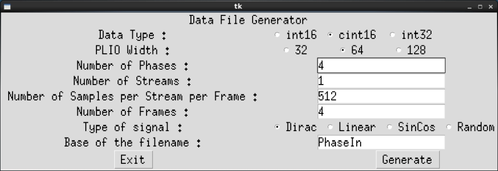

Click **Generate** and then **Exit**. The generated files, `PhaseIn_0.txt` to `PhaseIn_3.txt`, must contain mainly 0s, with a few 1s and 2s.

Type `make all` and wait for the `vitis_analyzer` GUI to display. The AMD Vitis™ Analyzer shows the graph, its device implementation, and the complete simulation timeline. In this specific case, the graph is simple (a single kernel) and the implementation is on a single AI Engine.

Click **Graph** to visualize the graph of the application:

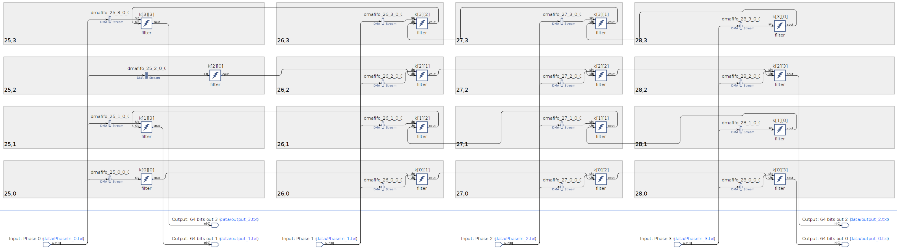

The 16 kernels and their eight independent input streams are clearly visible. The top graph is for the output phases 0 and 2, the phases where the cascade stream is from left to right on the physical device. The bottom graph is for phases 1 and 3 where the cascade stream is from right to left.

Click **Array** to visualize where the placer positioned the kernel, and how the PL feeds it:

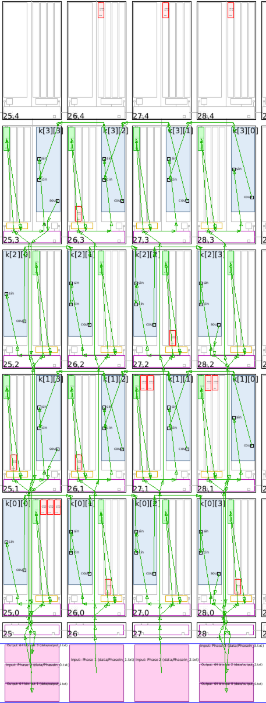

In this view, the cascade streams connecting neighboring AI Engines are key to the performance of this graph. With the four location constraints added, the placer had only one solution for the kernel placement: this square. The router had an easy job to feed all these kernels by simply using the south-north AXI-Stream. The path back to the PL from the extremities also uses only the vertical AXI-Streams.

Finally, click **Trace** to look at how the entire simulation went through. This may be useful to track where your AI Engine stalls if performance is not as expected:

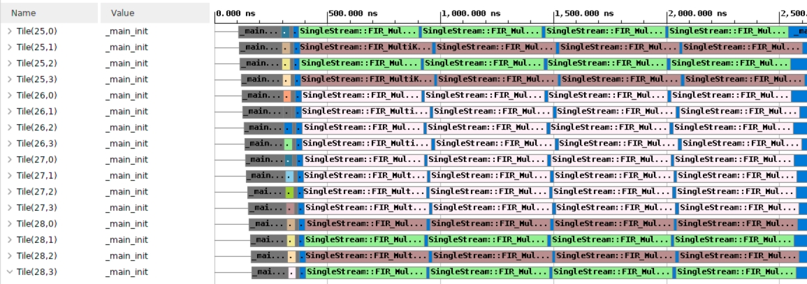

Now you can display the filter output. Because the input is a set of Dirac impulses, you must recognize the impulse response of the filter throughout the waveform. Navigate to `aiesimulator_output/data` and look at the `output_0.txt`. You can see that you have two complex outputs per line, prepended with a time stamp.  `ProcessAIEOutput output_*`.

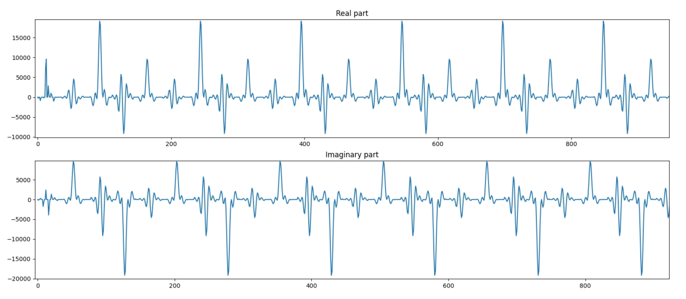

The top graph reflects the real part of the output. The bottom graph this is the imaginary part. On both, the filter impulse response is recognizable.

After simulation the simulator displays the raw throughput at the input and output ports:

```text
--------------------------------------------------------------------------------
| Intf Type   | Port Name                          | Type  | Throughput(MBps)  |
--------------------------------------------------------------------------------
| plio        | Phase 0                            | IN    | 4950.996958       |
|             | Phase 1                            | IN    | 4957.698816       |
|             | Phase 2                            | IN    | 4950.439288       |
|             | Phase 3                            | IN    | 4943.757030       |
|             | 64 bits out 0                      | OUT   | 4691.867125       |
|             | 64 bits out 1                      | OUT   | 4691.867125       |
|             | 64 bits out 2                      | OUT   | 4691.867125       |
|             | 64 bits out 3                      | OUT   | 4691.867125       |
```

The aggregated output port throughput in MSPS (cint16) is: `4753.9 Msps`.

You can measure the performance of this architecture using the timestamped output. In the same directory (`aiesimulator_output/data`), type `StreamThroughput output_*`:

```text
output_0.txt -->  1188.49 Msps
output_1.txt -->  1188.49 Msps
output_2.txt -->  1188.49 Msps
output_3.txt -->  1188.49 Msps

-----------------------


Total Throughput -->    4753.95 Msps

```

This architecture achieves close to 5 GSPS performance. The system spends cycles for initialization when calling the kernels, making it slightly less. This performance increases when you increase the frame length.

## Support

GitHub issues are used for tracking requests and bugs. For questions, go to [adaptivesupport.amd.com](https://adaptivesupport.amd.com/).

<p class="sphinxhide" align="center"><sub>Copyright © 2020–2025 Advanced Micro Devices, Inc</sub><br></br></p>

<p class="sphinxhide" align="center"><sup><a href="https://www.amd.com/en/corporate/copyright">Terms and Conditions</a></sup></p>
