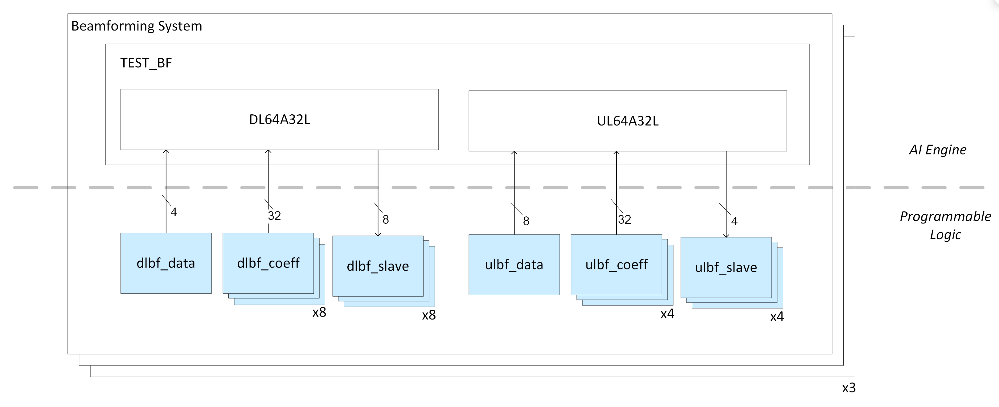
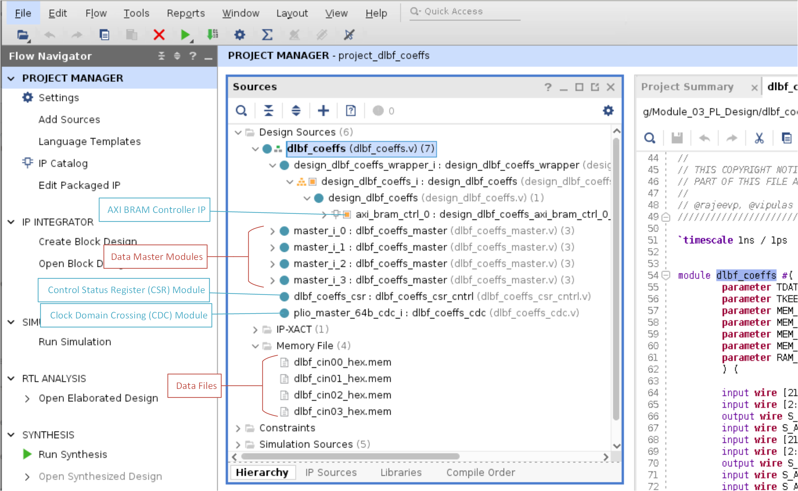
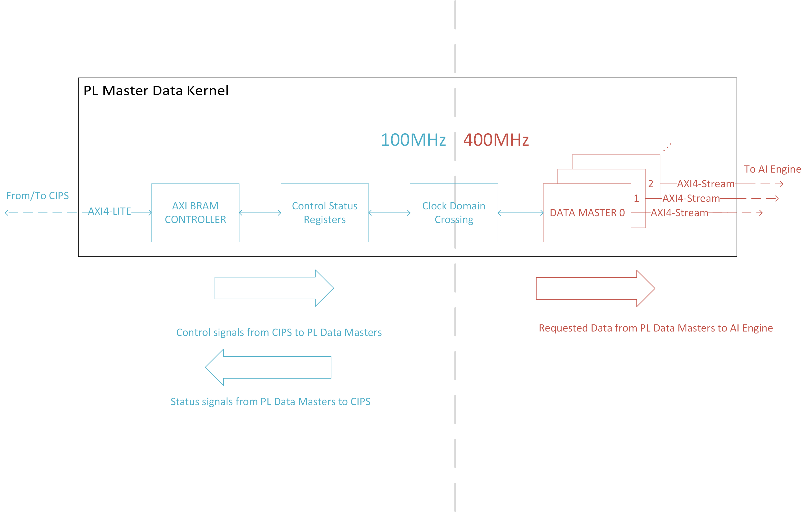
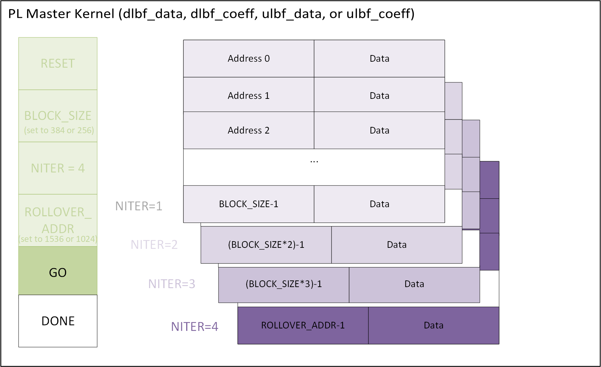
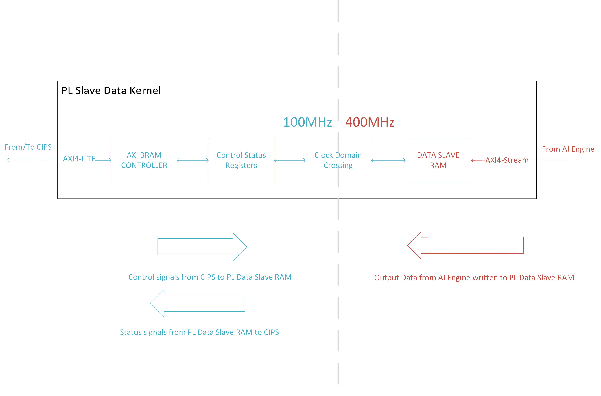

<table class="sphinxhide" style="width:100%;">
  <tr>
    <td align="center">
      <picture>
        <source media="(prefers-color-scheme: dark)" srcset="https://raw.githubusercontent.com/Xilinx/Image-Collateral/main/logo-white-text.png">
        
      </picture>
      <h1>AMD Vitis™ AI Engine Tutorials</h1>
      <a href="https://www.amd.com/en/products/software/adaptive-socs-and-fpgas/vitis.html">See Vitis™ Development Environment on amd.com</a>
        </br>
      <a href="https://www.amd.com/en/products/software/vitis-ai.html">See Vitis™ AI Development Environment on amd.com</a>
    </td>
  </tr>
</table>

# Building the Design

The next step is to build the PL kernels (XO files). This design requires seven different RTL PL kernels. Run the following commands to build all kernels.

```bash
make kernels
```

or

```bash
cd dlbf_data
vivado -mode batch -source run_dlbf_data.tcl -tclargs NO_SIM xcvc1902-vsva2197-2MP-e-S

cd ../dlbf_coeffs
vivado -mode batch -source run_dlbf_coeffs.tcl -tclargs NO_SIM xcvc1902-vsva2197-2MP-e-S

cd ../dlbf_slave
vivado -mode batch -source run_dlbf_slave.tcl -tclargs NO_SIM xcvc1902-vsva2197-2MP-e-S

cd ../ulbf_data
vivado -mode batch -source run_ulbf_data.tcl -tclargs NO_SIM xcvc1902-vsva2197-2MP-e-S

cd ../ulbf_coeffs
vivado -mode batch -source run_ulbf_coeffs.tcl -tclargs NO_SIM xcvc1902-vsva2197-2MP-e-S

cd ../ulbf_slave
vivado -mode batch -source run_ulbf_slave.tcl -tclargs NO_SIM xcvc1902-vsva2197-2MP-e-S

cd ../axi4s_regslice_64b
vivado -mode batch -source run_axi4s_regslice_64b.tcl -tclargs NO_SIM xcvc1902-vsva2197-2MP-e-S
```

The make command creates the Xilinx object files (XO) for PL kernels used in the design (highlighted in blue below).



# Dependencies

Each PL kernel has `run_<kernel_name>.tcl`, `bd_<kernel_name>.tcl`, `kernel_<kernel_name>.xml`, and `hdl/*.v` RTL code as dependencies.

|Filename|Description|
|  ---  |  ---  |
|bd_\<kernel_name\>.tcl| The Tcl script that creates the block design in the Vivado project.|
|kernel_\<kernel_name\>.xml| The XML file that specifies the ports and defines the PL kernel. |

The `hdl/` folder in each PL kernel folder contains the Verilog RTL used to create the PL kernels.

#### PL Master Kernels

The PL Master kernels are the `dlbf_data`, `dlbf_coeffs`, `ulbf_data`, and `ulbf_coeffs` kernels. The RTL for these kernels consists of the following modules:

|Filename|Description|
|  ---  |  ---  |
|hdl/\<kernel_name\>\.v| **PL Kernel Top-Level Module:** Contains a design\_\<kernel_name\>\_wrapper, multiple data master modules (four for DLBF or eight for ULBF), a control status register module, and a clock domain crossing module.|
|hdl/\<kernel_name\>\_cdc.v| **Clock Domain Crossing Module:** Converts 100 MHz control signals from the PS to 400 MHz signals to communicate with data master modules. Converts 400 MHz status/data signals from data master modules to 100 MHz signals to send to the PS.|
|hdl/\<kernel_name\>\_cntrl.v| **Control Module:** Used to read the status registers of the data master modules.|
|hdl/\<kernel_name\>\_csr_cntrl.v| **Control Status Register Module:** Defines the control/status register mapping of the PL kernel. |
|hdl/\<kernel_name\>\_ram2axis_64b.v| **RAM to AXI4-Stream Module:** Communicates with the XPM RAM module to read data using the AXI4-Stream protocol. This module instantiates the XPM RAM module, which contains a BRAM instance. |
|hdl/\<kernel_name\>\_xpm_ram.v| **XPM RAM Module:** BRAM instance used to store the input data. |
|hdl/\<kernel_name\>\_xpm_sync_fifo.v| **XPM Sync FIFO Module:** FIFO between the XPM RAM module and AI Engine. It stores the input data from XPM RAM module before sending it to the AI Engine. It stores 32 words total. Each word is 64 bits. |
|hdl/\<kernel_name\>\_master.v| **Data Master Module:** Contains a control module, a RAM to AXI4-Stream module, and an XPM sync FIFO module.|

#### PL Slave Kernels

The PL Slave kernels are the `dlbf_slave` and `ulbf_slave` kernels. The RTL for these kernels consists of the following modules:

|Filename|Description|
|  ---  |  ---  |
|hdl/\<kernel_name\>\.v|**PL Kernel Top-Level Module:** Contains a clock domain crossing module, a control module, and a RAM module. |
|hdl/\<kernel_name\>\_cdc.v|**Clock Domain Crossing Module:** Clock domain crossing module. Converts 100 MHz control signals from the PS to 400 MHz signals to communicate with the RAM module. Converts 400 MHz status/data signals from the RAM module to 100 MHz signals to send to the PS.|
|hdl/\<kernel_name\>\_cntrl.v| **Control Status Register Module:** Defines the control/status register mapping of the PL kernel. |
|hdl/\<kernel_name\>\_ram.v| **RAM Module:** URAM instance used to store the output data from the AI Engine. |

### Build Products

Each PL kernel results in the following build products:  

|Filename|Description|
|  ---  |  ---  |
|\<kernel_name\>.xo| Xilinx object file that packages the PL kernel. |
|\<kernel_name\> directory | Directory containing the Vivado project for the PL kernel.|

## PL Kernels: Master and Slaves

Now that you have an AI Engine application, find a way to send input data and store output data on hardware. Create PL master kernels that store input data in BRAM and feed it to the AI Engine. Use reference inputs in this design to mimic data flow coming from a radio antenna. Create PL slave kernels to receive AI Engine output data and store it in URAM resources.

### PL Master Kernels

The PL master kernels are the `dlbf_data`, `dlbf_coeff`, `ulbf_data`, and `ulbf_coeff` kernels. A `dlbf_data` PL kernel stores the reference input data matrices for the downlink subgraph in the AI Engine graph. The `dlbf_coeff` PL kernel stores the reference input coefficients for the downlink subgraph. The `ulbf_data` PL kernel stores the input data for the uplink subgraph. The `ulbf_coeff` stores the input coefficient data for the uplink subgraph.

Open the Vivado projects for these PL kernels and review their source code. They are all composed of the same modules: a AXI BRAM Controller IP, a control status register (CSR) module, a clock domain crossing (CDC) module, and multiple data master modules. The data master modules are initialized with reference input data and coefficients from `*_hex.mem` files in the `data/` folder.



The `*_hex.mem` files are generated by a python script that converts decimal data in `*.txt` files to hexidecimal. For example:

```
#Decimal data in dlbf_cin00.txt
-1893 3687 -6157 -1324

#Hexidecimal conversion in dlbf_cin00_hex.mem
fad4e7f30e67f89b
```

The rightmost decimal data (-1893) is converted to the leftmost hexidecimal data (f89b).

Below is a block diagram of how data in the PL Master kernels is requested by CIPS and sent to the AI Engine.



Each PL master kernel connects to one of the 16 AXI4-Lite PL interfaces on the custom platform built in Module 01 (Creating a Custom Platform). Through this connection, the CIPS block sends AXI control signals to data master modules and receives AXI status signals.

* **AXI BRAM Controller:** Writes control signals to the CSR module and reads status signals from the CSR module at 100 MHz.
* **Control Status Register (CSR) Module**: A register interface that the AXI BRAM controller uses to access data masters. Below is the control and status register map for one data master module.

*Control and Status Register Address Map*

| Register Space Offset | Bits and Name | R/W? | Description |  
|  ---  |  ---  |  ---  | --- |
| 0x0 | \[31:0\] ID | R | 32 bit ID register.|
| 0x4 | \[0\] RESET | W | 1: assert, 0: deassert. Also assigned to the `m_axis_rst_bram` input in the CSR module. |
| 0x4 | \[4\] GO | W | 1: start PL traffic, 0: stop PL traffic. Also assigned to the `go_bram` input in the CSR module. |
| 0x8 | \[11:0\] BLOCK_SIZE | W | Sets the block size of stream frame. Block size is the number of 64-bit TDATA packets to send to the AI Engine. TLAST is asserted for every <BLOCK_SIZE> number of cycles. Also assigned to the `block_size_bram` input in the CSR module. |  
| 0xC | \[11:0\] NITER | W | Sets the number of iterations of the data. The number of iterations is the number of <BLOCK_SIZE> data chunks to send to the AI Engine. If this set to 0, data is transmitted to the AI Engine forever. Also assigned to the `niter_bram` input in the CSR module. |
| 0x10 | \[15:0\] ROLLOVER_ADDR | W | When BRAM addresses reach this rollover address, they reset to address 0. In this design, the rollover address is set to the address of four <BLOCK_SIZE> chunks of data (that is, 4\*<BLOCK_SIZE>). Also assigned to the `rollover_addr_bram` input in the CSR module. |
| 0x20 | \[0\] MASTER_DONE | R | When this status register becomes 1'b, the data master is done sending data to the AI Engine. Also assigned to the `m0_done_bram` input in the CSR module. |

The CSR Module RTL definitions are located here:

```
dlbf_data/hdl/ulbf_data_csr_cntrl.v
dlbf_coeffs/hdl/dlbf_coeffs_csr_cntrl.v
ulbf_data/hdl/ulbf_data_csr_cntrl.v
ulbf_coeffs/hdl/ulbf_coeffs_csr_cntrl.v
```

* **Clock Domain Crossing (CDC) Module:** The control and status signals sent to the CSR module sync up with the data master modules through a clock domain crossing (CDC) module. It converts the 100 MHz control and status signals from CIPS to 400 MHz signals. The data master modules operate at 400 MHz. It also works the other way as well (converting 400 MHz signals from the data master modules to 100 MHz signals for CIPS).

* **Data Master Modules:** Contain BRAM instances that store input data sent to the AI Engine. They are initialized by `data/*_hex.mem` files with input data. There are four data master modules in the `dlbf_data` and `dlbf_coeffs` PL kernels. There are eight data master modules in the `ulbf_data` and `ulbf_coeffs` PL kernels.

#### PL Master Execution Flow

Through the control path (highlighted in blue in the block diagram), CIPS block requests data from specific addresses to be sent from the data master modules to the AI Engine. The data master modules then send data at the requested address through an AXI4-Stream interface to the AI Engine. The AI Engine receives its downlink input data matrices, downlink input coefficient data, uplink input data matrices, and uplink input coefficient data this way. The PL masters must follow a defined execution flow.

##### Reset

Reset PL masters by asserting their RESET bits to 1’b1 and then deasserting them to 0’b1.

##### Configuration

The PL masters must then have their `BLOCK_SIZE, NITER, and ROLLOVER_ADDR registers configured.

###### BLOCK_SIZE

The value you set the BLOCK_SIZE register to is determined by the number of 32-bit complex data samples you send to the AI Engine. Because the PL interface to the AI Engine is 64 bit, two 32-bit complex data samples fit in one packet. The BLOCK_SIZE register for each PL master kernel is as follows:

| PL Kernels | AI Engine Window Size (Bytes) | Number of 32-Bit Complex Data Samples | Number of 64-Bit Data Packets (BLOCK_SIZE) |  
|  ---  |  ---  |  ---  |  ---  |
|dlbf_data ulbf_data| 3072 | 768 | 384 |
|dlbf_coeffs ulbf_coeffs | 2048| 512 | 256 |

###### NITER and ROLLOVER_ADDR

The value of the NITER register determines the number BLOCK_SIZE chunks of input data to send of the AI Engine. Because BRAM resources are finite, it is not possible to store a large amount of unique input data. A design choice has been made to store four BLOCK_SIZE chunks of unique data in the PL masters.

* When NITER <=4, send up to four unique BLOCK_SIZE chunks of data to the AI Engine.
* When NITER > 4, the BRAMs send the four unique BLOCK_SIZE chunks of data, then the BRAM addresses roll over to address 0, and they repeat the process of sending data.  

The NITER register allows continuous input data to the AI Engine graph for any NITER number of data chunks without using a high number of BRAMs.

The ROLLOVER_ADDR register is the address that tells the BRAMs when to restart (or roll over) to address 0. The ROLLOVER_ADDR is calculated as the BLOCK_SIZE * 4. Four is the number of unique BLOCK_SIZE chunks of input data the PL masters store.

For example, set NITER to 4 to test the AI Engine graph on a variety of data inputs. This configures the PL kernels to send four <BLOCK_SIZE> chunks of unique input data to the AI Engine. To test performance, you can then set NITER to 100, which sends the same four chunks of input data to the AI Engine 25 times (for a total of 25\*4 = 100 iterations). You can then average the throughput across the iterations to give a valid performance measurement. The following is a table of the rollover addresses:

| PL Kernels | BLOCK_SIZE | ROLLOVER_ADDR |  
|  ---  |  ---  |  ---  |
| dlbf_data ulbf_data | 384 | 1536 |
| dlbf_coeffs ulbf_coeffs | 256 | 1024 |

##### Start

After configuration, the PL master kernels are ready to send data stored in their BRAMs to the AI Engine. When the GO bit is asserted, PL traffic to the AI Engine starts. Deasserting the GO bit stops PL traffic to the AI Engine.



##### Done

When the PL Master kernels have sent a BLOCK_SIZE number TDATA packets to the AI Engine for NITER number of times, they assert their MASTER_DONE bits.

#### IP Kernelization

Review the `package_xo` command in the last line of `run_*.tcl`.

```
package_xo -kernel_name ${IP_NAME} -ctrl_protocol user_managed -ip_directory [pwd]/../${IP_REPO}/${IP_NAME} -xo_path [pwd]/../${IP_REPO}/${IP_NAME}.xo -force -output_kernel_xml [pwd]/kernel_${IP_NAME}_auto.xml
```

First, the IP is created. The steps are in `run_*.tcl` until `update_ip_catalog`. The packaged IP is then taken from the IP directory and provided to the `package_xo` command using the `-kernel_name` keyword. When the `package_xo` command kernelizes the IP, it outputs the `${IP_NAME}.xo` in the path provided by the `-xo_path`. The `-xo_path` cannot be the same as the `-ip_directory` path. The argument `-force` overwrites a pre-existing XO file. The command also generates the intermediate metadata file and is stored as `kernel_${IP_NAME}_auto.xml`.

For more information, see [tutorial](https://github.com/Xilinx/Vitis-Tutorials/blob/master/Hardware_Acceleration/Feature_Tutorials/01-rtl_kernel_workflow/package_ip.md).

### PL Slave Kernels

The PL slave kernels are the `dlbf_slave` and the `ulbf_slave` kernels. These kernels store the output data generated by the AI Engine application. Open the AMD Vivado™ projects for the PL kernels and review their source code.



* **AXI BRAM Controller:** Writes the control signals to the CSR module and reads status signals from the CSR module at 100MHz.
* **CSR Module:** A register interface that the AXI BRAM Controller accesses to access the Slave RAM. Below is the control and status register map for one data master module.

*_*Control and Status Register Address Map*

| Register Space Offset | Bits and Name | R/W? | Description |  
|  ---  |  ---  |  ---  | --- |
| 0x0 | \[31:0\] ID | R | 32-bit ID Register.|
| 0x4 | \[0\] RESET | W | 1:assert, 0:de-assert. Also assigned to the `slave_rst_bram` input in CSR module. |
| 0xC | \[11:0\] NITER | W | Sets the number of iterations of the data to receive. The number of iterations is the number of <BLOCK_SIZE> data chunks AI Engine produces and sends to the PL Slave kernels. If this set to 0, data is transmitted from AI Engine forever. Also assigned to the `niter_bram` input in the CSR module. |
| 0x20 | \[0\] SLAVE_DONE | R | When this status register is 1'b, the RAM slave is done receiving data to AI Engine. Also assigned to the `rxdone_bram` input in the CSR module. |

* **CDC Module:** The control and status signals sent to the CSR module sync with the slave RAM module through a clock domain crossing (CDC) module. It converts 100 MHz control and status signals from CIPS to 400 MHz signals. The slave RAM module operate at 400 MHz. It also converts 400 MHz signals from the slave RAM module to 100 MHz signals for CIPS..
* **Data Slave RAM Module:** Contains the URAM instance that stores the output data produced by the AI Engine. There is one slave RAM module in the `dlbf_slave` and `ulbf_slave` PL kernels.

#### PL Slave Execution Flow

The control path (highlighted in blue in the preceding block diagram) is the same as in the PL master kernels; however, the CSR module syncs with a data slave RAM module. The AI Engine writes output data to a data slave RAM module through an AXI4-Stream interface. The AI Engine application writes output data from downlink and uplink subgraphs to the `dlbf_slave` and `ulbf_slave` PL kernels this way. The PL slaves must follow a certain execution flow to function.

##### Reset

Like the PL masters, the PL slaves must first be reset by asserting their RESET bits to 1’b1 and then deasserting them to 0’b1.

##### Configuration

The PL slaves must have their BLOCK_SIZE, NITER, and ROLLOVER_ADDR registers configured.

###### BLOCK_SIZE

Although there is no explicit BLOCK_SIZE register, PL slave kernels receive <BLOCK_SIZE> chunks of data from the AI Engine as follows:

| PL Kernels | AI Engine Window Size (bytes) | Number of 32-Bit Complex Data Samples (BLOCK_SIZE)|  
|  ---  |  ---  |   ---  |
| dlbf_slave | 3072 | 768 |
| ulbf_slave | 3072 | 768 |

##### NITER and ROLLOVER_ADDR

The NITER register tells the PL slave kernel how many <BLOCK_SIZE> chunks of data to expect and store in their URAMs.

PL slave kernels do not have a ROLLOVER_ADDR register because the goal is to keep all output data for functional verification. Data starts to be overwritten when NITER > 4.  

##### Start

PL slave kernels are slaves to the AI Engine. The AI Engine writes output data to them. Because the PL kernels must wait until the AI Engine fills their URAMs, there is no GO bit on the PL slave kernels.

##### Done

When the PL slave kernels have received the <BLOCK_SIZE> amount of data for NITER number of times, they assert their SLAVE_DONE bits.

### AXI4-Stream Register Slice

The AXI4-Stream Register Slice IP (axi_register_slice) is available in the IP Catalog. It is a flip-flop used to pipeline paths. It is used during timing closure (see Module 04).

## Beamforming Design: Downlink AI Engine Graph

Each downlink AI Engine graph has four input data ports, 32 input coefficient ports, and eight output ports. A `dlbf_data` PL kernel has four AXI4-Stream output ports to that plug into the four input data ports of the downlink AI Engine graph. A `dlbf_coeffs` PL kernel has four AXI4-Stream output ports. So, eight `dlbf_coeffs` PL kernels are required to plug into the 4\*8=32 input coefficient ports. A `dlbf_slave` PL kernel has one AXI4-Stream input port. So, eight `dlbf_slave` PL kernels are required to plug into the eight output ports.

The system instantiates three downlink graphs, so the total number of DLBF PL kernels is three `dlbf_data`, 24 `dlbf_coeffs`, and 24 `dlbfs_slave` PL kernels.  

## Beamforming Design: Uplink AI Engine Graph

Each uplink AI Engine graph has eight input data ports, 32 input coefficient ports, and four output ports. A `ulbf_data` PL kernel has eight AXI4-Stream output ports that plug into the eight input data ports of the uplink AI Engine graph. A `ulbf_coeffs` PL kernel has eight AXI4-Stream output ports. So, four `ulbf_coeffs` PL kernels are required to plug into the 8\*4=32 input coefficient ports. A `ulbf_slave` PL kernel has one AXI4-Stream input port. So, four `ulbf_slave` PL kernels are required to plug into the four output ports.

The system instantiates three uplink graphs, so the total number of ULBF PL kernels is three `ulbf_data`, 12 `ulbf_coeffs`, and 12 `ulbf_slaves`.

### References

* [Vitis Application Acceleration Development Flow Documentation, Developing Applications, RTL Kernels](https://docs.amd.com/r/en-US/ug1702-vitis-accelerated-reference/) - This is a reference to create your own custom RTL kernels. 

**Note**: The PL kernels in this design do not completely adhere to the recommended guidelines.

#### Support

GitHub issues will be used for tracking requests and bugs. For questions go to [forums.xilinx.com](http://forums.xilinx.com/).

<p class="sphinxhide" align="center"><sub>Copyright © 2020–2026 Advanced Micro Devices, Inc.</sub></p>

<p class="sphinxhide" align="center"><sup><a href="https://www.amd.com/en/legal/copyright.html">Terms and Conditions</a></sup></p>
